# Fix Agent Tools 深度架构分析与说明

## 📋 目录

- [1. 架构概览](#1-架构概览)
- [2. 模块详解](#2-模块详解)
- [3. 设计模式分析](#3-设计模式分析)
- [4. 数据流与调用链](#4-数据流与调用链)
- [5. 统一导出机制](#5-统一导出机制)
- [6. 错误处理策略](#6-错误处理策略)
- [7. 扩展性设计](#7-扩展性设计)
- [8. 性能优化](#8-性能优化)
- [9. 最佳实践](#9-最佳实践)
- [10. 未来展望](#10-未来展望)

---

## 1. 架构概览

### 1.1 整体架构图

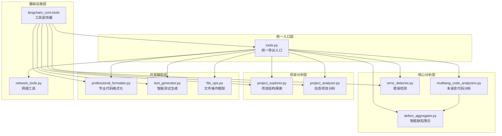

### 1.2 模块依赖关系

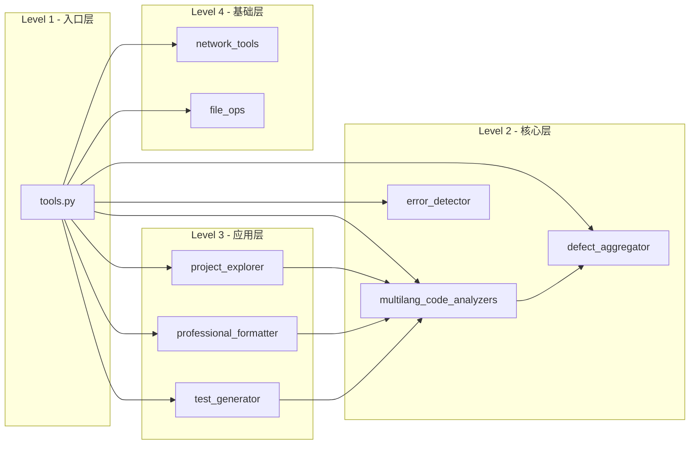

---

## 2. 模块详解

### 2.1 tools.py - 统一导出入口

#### 2.1.1 设计思想
tools.py 是整个工具系统的统一入口，采用**门面模式（Facade Pattern）**设计，为上层应用提供统一的接口。

#### 2.1.2 核心功能

```python
# 工具分类管理
TOOL_CATEGORIES = {
    "网络工具": ["http_request", "web_search"],
    "代码分析": ["analyze_code_defects", "analyze_code_complexity"],
    "错误检测": ["compile_project", "run_and_monitor", "run_tests_with_error_capture", "analyze_existing_logs"],
    "项目探索": ["explore_project_structure", "analyze_code_complexity"],
}

# 统一导出管理
__all__ = [
    # 网络工具
    "http_request", "web_search",
    # 代码分析工具链
    "analyze_code_defects",
    # 错误检测工具
    "compile_project", "run_and_monitor", "run_tests_with_error_capture", "analyze_existing_logs",
    # 项目探索工具
    "explore_project_structure", "analyze_code_complexity",
]
```

#### 2.1.3 工具链组合示例

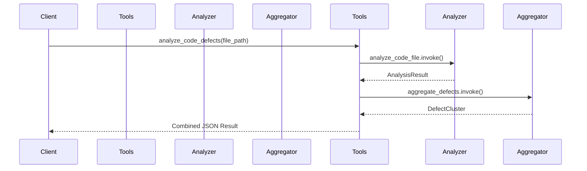

### 2.2 multilang_code_analyzers.py - 多语言代码分析

#### 2.2.1 架构设计
采用**策略模式（Strategy Pattern）** + **抽象工厂模式（Abstract Factory Pattern）**：

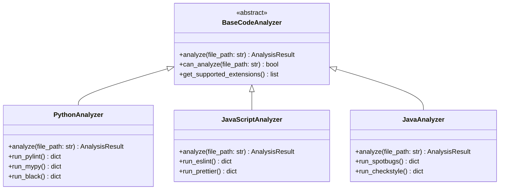

#### 2.2.2 核心数据结构

```python
@dataclass
class AnalysisIssue:
    file_path: str
    line_number: int
    column_number: int
    severity: str  # error, warning, info
    message: str
    rule_id: str
    category: str
    tool_name: str

@dataclass
class AnalysisResult:
    success: bool
    file_path: str
    language: str
    tool_name: str
    issues: List[AnalysisIssue]
    score: int  # 0-100
    execution_time: float
    metadata: Dict[str, Any]
```

### 2.3 defect_aggregator.py - 智能缺陷聚合

#### 2.3.1 聚类算法

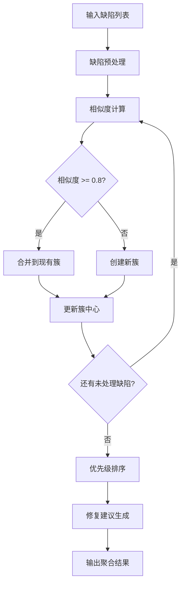

#### 2.3.2 相似度计算算法

```python
def _calculate_similarity(self, defect1: AnalysisIssue, defect2: AnalysisIssue) -> float:
    """
    多维度相似度计算：
    - 文件相似度 (权重: 0.2)
    - 消息语义相似度 (权重: 0.5)
    - 类别相似度 (权重: 0.1)
    - 规则相似度 (权重: 0.1)
    - 位置相似度 (权重: 0.1)
    """
    similarity = 0.0

    # 文件路径相似度
    file_similarity = self._calculate_file_similarity(defect1.file_path, defect2.file_path)
    similarity += file_similarity * 0.2

    # 消息语义相似度
    message_similarity = self._calculate_semantic_similarity(defect1.message, defect2.message)
    similarity += message_similarity * 0.5

    # 类别相似度
    category_similarity = 1.0 if defect1.category == defect2.category else 0.0
    similarity += category_similarity * 0.1

    # 规则相似度
    rule_similarity = 1.0 if defect1.rule_id == defect2.rule_id else 0.0
    similarity += rule_similarity * 0.1

    # 位置相似度
    location_similarity = self._calculate_location_similarity(defect1, defect2)
    similarity += location_similarity * 0.1

    return min(similarity, 1.0)
```

### 2.4 error_detector.py - 错误检测

#### 2.4.1 错误检测框架

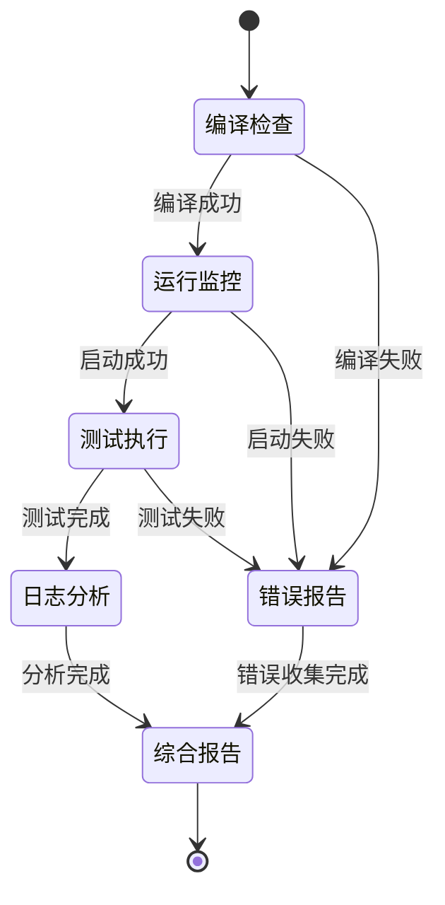

#### 2.4.2 运行时监控机制

```python
def _monitor_process(self, process: subprocess.Popen, timeout: int) -> Dict[str, Any]:
    """
    实时进程监控：
    1. CPU使用率监控
    2. 内存使用监控
    3. 错误输出捕获
    4. 超时控制
    5. 优雅终止
    """
    monitor_data = {
        "start_time": time.time(),
        "cpu_usage": [],
        "memory_usage": [],
        "errors": [],
        "output": []
    }

    try:
        while process.poll() is None:
            # 收集系统资源使用情况
            cpu_percent = psutil.cpu_percent()
            memory_info = psutil.virtual_memory()

            monitor_data["cpu_usage"].append(cpu_percent)
            monitor_data["memory_usage"].append(memory_info.percent)

            # 检查超时
            if time.time() - monitor_data["start_time"] > timeout:
                process.terminate()
                break

            time.sleep(1)

    except Exception as e:
        monitor_data["errors"].append(str(e))

    return monitor_data
```

### 2.5 project_explorer.py - 项目结构探索

#### 2.5.1 项目类型识别流程

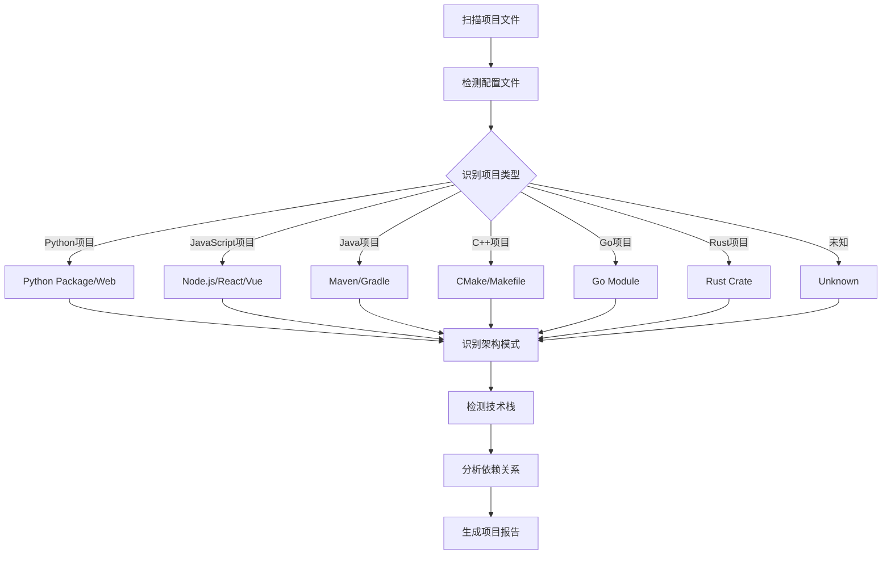

#### 2.5.2 技术栈检测算法

```python
def _detect_technologies(self, files: List[ProjectFile]) -> List[Technology]:
    """
    智能技术栈检测：
    1. 文件名模式匹配
    2. 文件内容关键词检测
    3. 依赖关系分析
    4. 目录结构模式识别
    """
    technologies = []

    # 检测框架
    for framework, patterns in self.framework_patterns.items():
        confidence = 0.0
        evidence = []

        # 检查文件名模式
        for pattern in patterns:
            if self._check_file_pattern(files, pattern):
                confidence += 0.3
                evidence.append(f"File pattern: {pattern}")

        # 检查目录结构
        if self._check_directory_structure(files, patterns):
            confidence += 0.2
            evidence.append("Directory structure match")

        # 检查文件内容
        if self._check_file_content(files, patterns):
            confidence += 0.5
            evidence.append("Content match")

        if confidence > 0.3:
            technologies.append(Technology(
                name=framework,
                category="framework",
                confidence=min(confidence, 1.0),
                evidence=evidence
            ))

    return technologies
```

---

## 3. 设计模式分析

### 3.1 策略模式（Strategy Pattern）

**应用场景**: `multilang_code_analyzers.py`

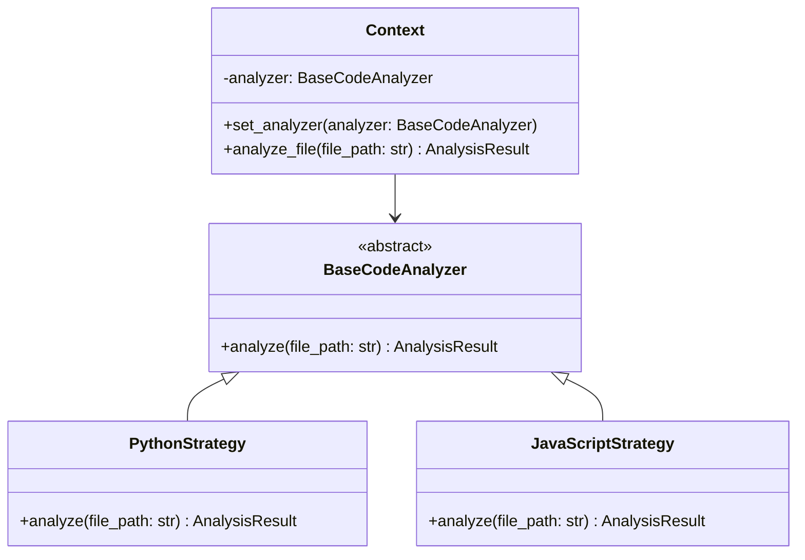

**优势**:
- 算法可以自由切换
- 避免使用多重条件判断
- 扩展性良好，易于添加新语言支持

### 3.2 装饰器模式（Decorator Pattern）

**应用场景**: `@tool` 装饰器

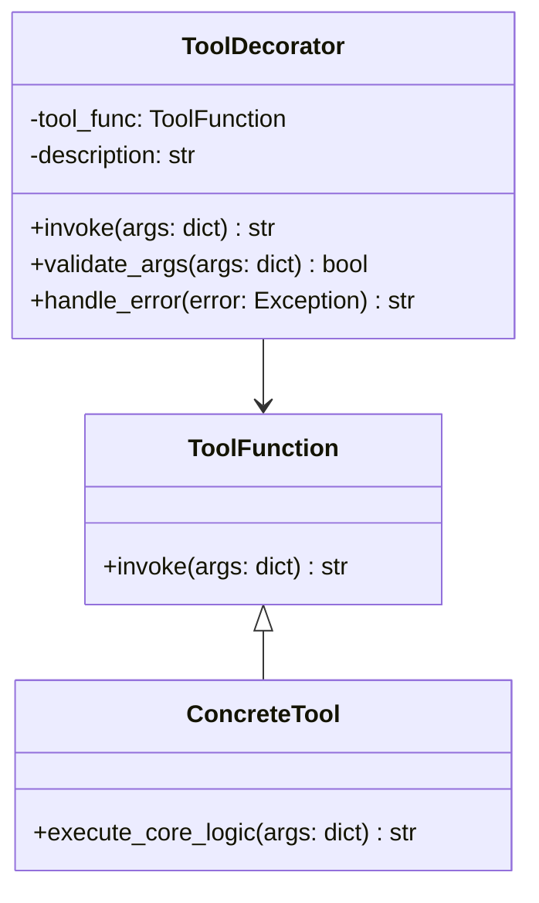

**优势**:
- 动态添加功能
- 不修改原有代码结构
- 提供统一的工具接口

### 3.3 工厂模式（Factory Pattern）

**应用场景**: 分析器创建

```python
class AnalyzerFactory:
    _analyzers = {
        '.py': PythonAnalyzer,
        '.js': JavaScriptAnalyzer,
        '.ts': TypeScriptAnalyzer,
        '.java': JavaAnalyzer,
        '.cpp': CppAnalyzer,
        '.go': GoAnalyzer,
        '.rs': RustAnalyzer,
    }

    @classmethod
    def create_analyzer(cls, file_path: str) -> BaseCodeAnalyzer:
        """根据文件扩展名创建合适的分析器"""
        ext = Path(file_path).suffix.lower()
        analyzer_class = cls._analyzers.get(ext)

        if not analyzer_class:
            raise UnsupportedLanguageError(f"不支持的语言: {ext}")

        return analyzer_class()
```

### 3.4 观察者模式（Observer Pattern）

**应用场景**: `FileOpTracker`

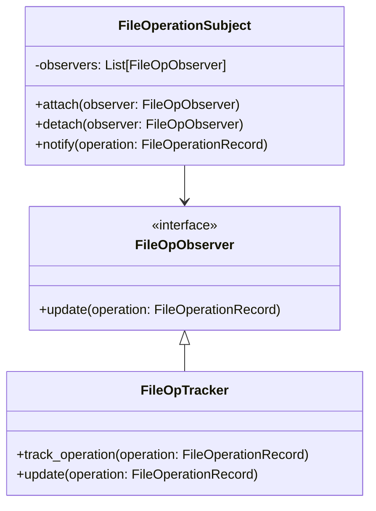

---

## 4. 数据流与调用链

### 4.1 主要数据流

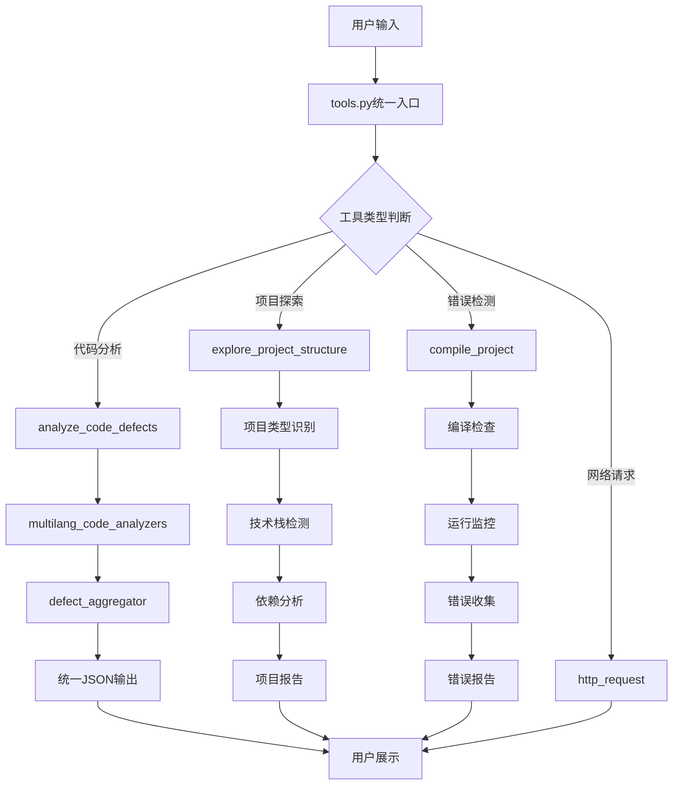

### 4.2 智能代码缺陷分析链

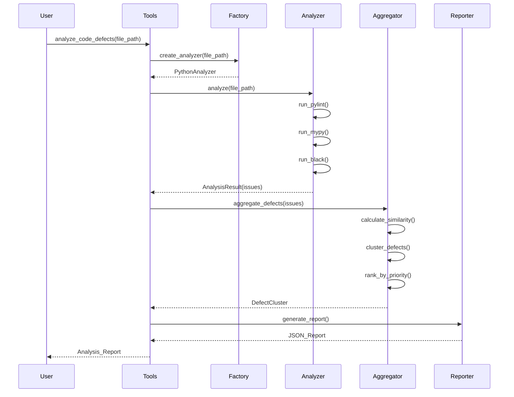

### 4.3 项目探索流程

```mermaid
sequenceDiagram
    participant User
    participant Explorer
    participant TypeDetector
   参与 TechDetector
    participant DependencyAnalyzer
    participant Reporter

    User->>Explorer: explore_project_structure(project_path)
    Explorer->>Explorer: scan_files()

    Explorer->>TypeDetector: detect_project_type()
    TypeDetector->>TypeDetector: check_configuration_files()
    TypeDetector->>TypeDetector: analyze_directory_structure()
    TypeDetector-->>Explorer: ProjectType

    Explorer->>TechDetector: detect_technologies()
    TechDetector->>TechDetector: match_patterns()
    TechDetector->>TechDetector: analyze_content()
    TechDetector-->>Explorer: Technology[]

    Explorer->>DependencyAnalyzer: analyze_dependencies()
    DependencyAnalyzer->>DependencyAnalyzer: parse_package_files()
    DependencyAnalyzer->>DependencyAnalyzer: build_dependency_graph()
    DependencyAnalyzer-->>Explorer: DependencyGraph

    Explorer->>Reporter: generate_project_report()
    Reporter-->>Explorer: ProjectReport
    Explorer-->>User: JSON_Report
```

---

## 5. 统一导出机制

### 5.1 导出架构

```mermaid
graph TB
    subgraph "工具层"
        A[PythonAnalyzer]
        B[JavaScriptAnalyzer]
        C[ErrorDetector]
        D[ProjectExplorer]
        E[NetworkTools]
    end

    subgraph "导出层"
        F[tools.py]
        G[__all__ 列表]
        H[TOOL_CATEGORIES 字典]
    end

    subgraph "接口层"
        I[get_all_tools()]
        J[get_tools_by_category()]
        K[动态工具发现]
    end

    A --> F
    B --> F
    C --> F
    D --> F
    E --> F

    F --> G
    F --> H

    G --> I
    H --> J
    I --> K
    J --> K
```

### 5.2 工具获取机制

```python
def get_all_tools() -> Dict[str, Any]:
    """
    获取所有可用工具

    Returns:
        Dict[str, Any]: 工具名称到工具对象的映射
    """
    # 从模块全局变量中获取工具
    available_tools = {}

    for tool_name in __all__:
        if tool_name in globals():
            tool_obj = globals()[tool_name]
            # 验证工具是否可用
            if hasattr(tool_obj, 'invoke') or callable(tool_obj):
                available_tools[tool_name] = tool_obj

    return available_tools

def get_tools_by_category(category: str) -> Dict[str, Any]:
    """
    按分类获取工具

    Args:
        category: 工具分类名称

    Returns:
        Dict[str, Any]: 该分类下的工具字典
    """
    if category not in TOOL_CATEGORIES:
        return {}

    category_tools = {}
    all_tools = get_all_tools()

    for tool_name in TOOL_CATEGORIES[category]:
        if tool_name in all_tools:
            category_tools[tool_name] = all_tools[tool_name]

    return category_tools
```

### 5.3 动态工具加载

```mermaid
flowchart TD
    A[启动应用] --> B[扫描tools目录]
    B --> C[发现工具模块]
    C --> D[检查@tool装饰器]
    D --> E[注册工具到__all__]
    E --> F[更新TOOL_CATEGORIES]
    F --> G[工具可用性检查]
    G --> H[构建工具注册表]
    H --> I[工具系统就绪]
```

---

## 6. 错误处理策略

### 6.1 分层错误处理架构

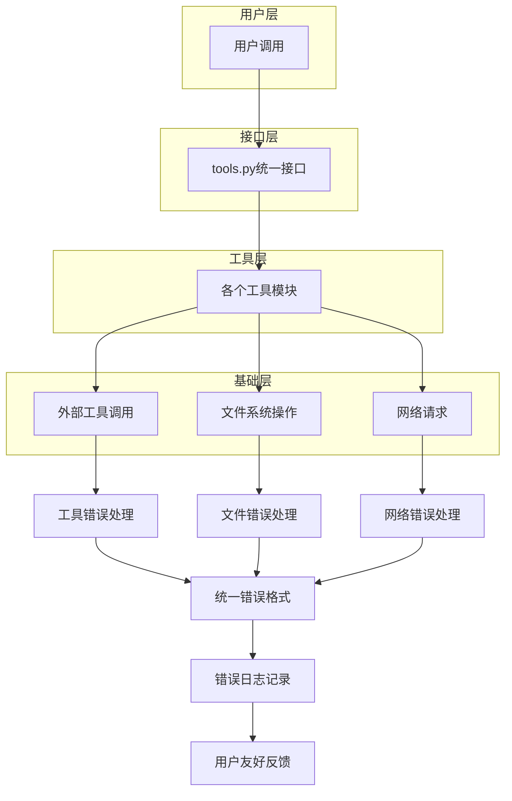

### 6.2 错误处理模式

```python
def handle_tool_execution(tool_func, *args, **kwargs):
    """
    统一的工具执行错误处理模式
    """
    try:
        # 参数验证
        if not validate_arguments(tool_func, *args, **kwargs):
            return create_error_response("参数验证失败", "INVALID_ARGS")

        # 工具执行
        result = tool_func.invoke(*args, **kwargs)

        # 结果验证
        if not validate_result(result):
            return create_error_response("工具结果格式错误", "INVALID_RESULT")

        return result

    except ImportError as e:
        return create_error_response(
            f"工具依赖缺失: {str(e)}",
            "DEPENDENCY_MISSING",
            suggestion="请安装相应的依赖包"
        )

    except FileNotFoundError as e:
        return create_error_response(
            f"文件或路径不存在: {str(e)}",
            "FILE_NOT_FOUND",
            suggestion="请检查文件路径是否正确"
        )

    except PermissionError as e:
        return create_error_response(
            f"权限不足: {str(e)}",
            "PERMISSION_DENIED",
            suggestion="请检查文件或目录的访问权限"
        )

    except TimeoutError as e:
        return create_error_response(
            f"操作超时: {str(e)}",
            "TIMEOUT_ERROR",
            suggestion="请增加超时时间或优化操作"
        )

    except Exception as e:
        # 记录未知错误
        logger.error(f"未知错误: {str(e)}", exc_info=True)
        return create_error_response(
            f"工具执行失败: {str(e)}",
            "UNKNOWN_ERROR",
            suggestion="请查看日志获取详细信息"
        )
```

### 6.3 优雅降级机制

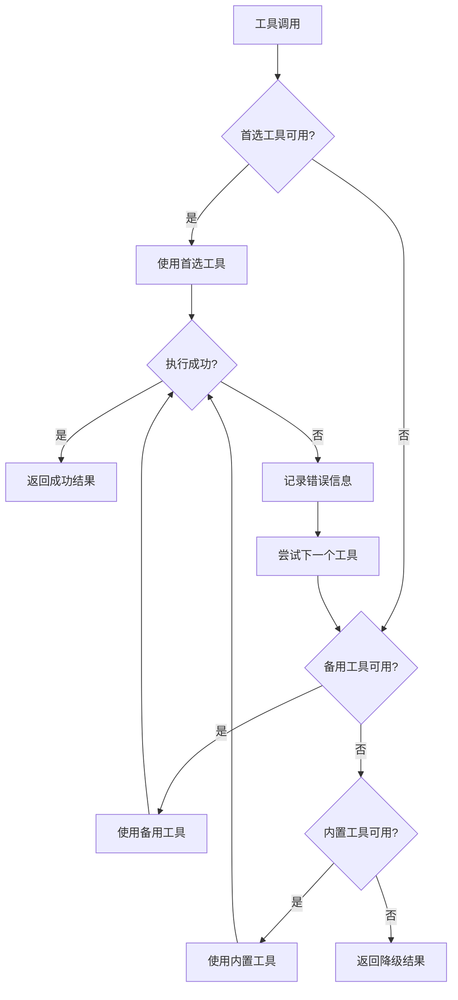

---

## 7. 扩展性设计

### 7.1 插件化架构

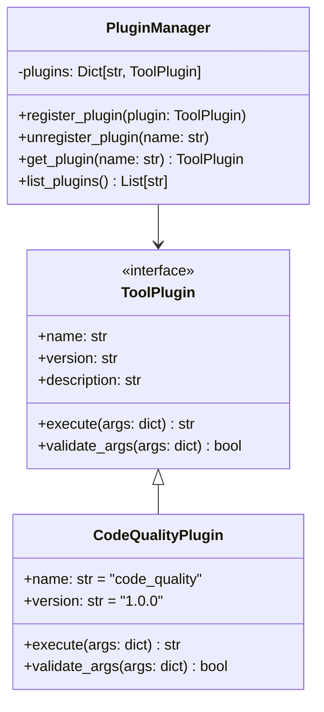

### 7.2 语言扩展机制

```python
class BaseCodeAnalyzer(ABC):
    """代码分析器抽象基类"""

    @abstractmethod
    def analyze(self, file_path: str) -> AnalysisResult:
        """分析代码文件"""
        pass

    @abstractmethod
    def can_analyze(self, file_path: str) -> bool:
        """检查是否能分析指定文件"""
        pass

    @classmethod
    def get_supported_extensions(cls) -> List[str]:
        """获取支持的文件扩展名"""
        return []

class SwiftAnalyzer(BaseCodeAnalyzer):
    """Swift语言分析器示例"""

    def analyze(self, file_path: str) -> AnalysisResult:
        # 实现Swift代码分析逻辑
        pass

    def can_analyze(self, file_path: str) -> bool:
        return Path(file_path).suffix.lower() in ['.swift']

    @classmethod
    def get_supported_extensions(cls) -> List[str]:
        return ['.swift']

# 注册新语言分析器
AnalyzerFactory.register_analyzer('.swift', SwiftAnalyzer)
```

### 7.3 自定义工具扩展

```python
@tool(
    description="自定义安全漏洞扫描工具",
    category="security",
    version="1.0.0"
)
def security_vulnerability_scan(
    project_path: str,
    scan_level: str = "standard",
    exclude_patterns: Optional[List[str]] = None
) -> str:
    """
    安全漏洞扫描工具

    Args:
        project_path: 项目路径
        scan_level: 扫描级别 (basic/standard/comprehensive)
        exclude_patterns: 排除模式列表

    Returns:
        扫描结果JSON字符串
    """
    # 实现安全扫描逻辑
    pass

# 自动注册到工具系统
# tools.py 会自动发现并注册该工具
```

---

## 8. 性能优化

### 8.1 缓存机制

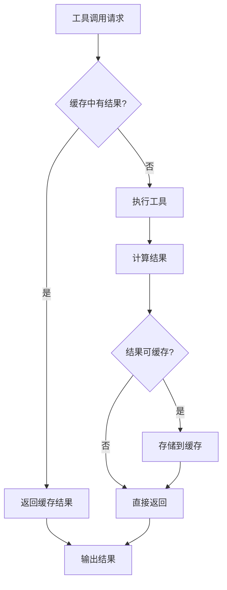

### 8.2 并行处理

```python
import concurrent.futures
from typing import List, Dict, Any

class ParallelAnalyzer:
    """并行代码分析器"""

    def __init__(self, max_workers: int = 4):
        self.max_workers = max_workers

    def analyze_files_parallel(self, file_paths: List[str]) -> List[AnalysisResult]:
        """
        并行分析多个文件
        """
        with concurrent.futures.ThreadPoolExecutor(max_workers=self.max_workers) as executor:
            # 提交所有分析任务
            future_to_file = {
                executor.submit(self._analyze_single_file, file_path): file_path
                for file_path in file_paths
            }

            results = []
            for future in concurrent.futures.as_completed(future_to_file):
                file_path = future_to_file[future]
                try:
                    result = future.result()
                    results.append(result)
                except Exception as e:
                    # 创建错误结果
                    error_result = AnalysisResult(
                        success=False,
                        file_path=file_path,
                        error=str(e)
                    )
                    results.append(error_result)

        return results
```

### 8.3 智能资源管理

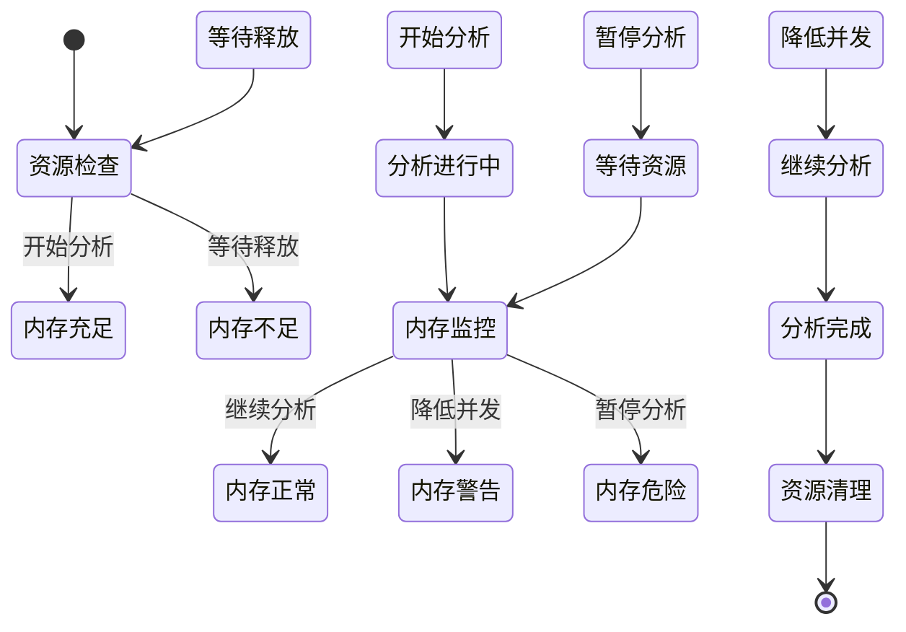

---

## 9. 最佳实践

### 9.1 代码质量标准

#### 9.1.1 工具开发规范

```python
# 工具函数标准模板
@tool(
    description="详细的功能描述，包含使用场景和优势",
    category="工具分类",
    version="版本号"
)
def tool_function(
    required_param: str,
    optional_param: Optional[str] = None,
    timeout: int = 30
) -> str:
    """
    工具函数标准文档格式

    此工具提供给agent使用的XX功能。

    功能特性：
    - 特性1详细描述
    - 特性2详细描述

    Args:
        required_param: 必需参数说明
        optional_param: 可选参数说明，包含默认值
        timeout: 超时时间，默认30秒

    Returns:
        JSON格式字符串，包含：
            - success: 执行是否成功
            - result: 执行结果详情
            - error: 错误信息（如果有）
            - metadata: 元数据信息

    使用场景：
        - 场景1描述
        - 场景2描述

    工具优势：
        - 优势1描述
        - 优势2描述

    注意事项：
        - 注意事项1
        - 注意事项2
    """
    try:
        # 1. 参数验证
        if not required_param:
            return create_error_response("必需参数不能为空", "INVALID_INPUT")

        # 2. 核心逻辑实现
        result = implement_core_logic(required_param, optional_param)

        # 3. 结果格式化
        return format_success_result(result)

    except Exception as e:
        # 4. 统一错误处理
        return create_error_response(f"工具执行失败: {str(e)}", "EXECUTION_ERROR")
```

#### 9.1.2 测试标准

```python
import pytest
from unittest.mock import Mock, patch

class TestToolFunction:
    """工具测试标准模板"""

    def setup_method(self):
        """测试前置设置"""
        self.test_data = {
            "valid_input": "test_input",
            "expected_output": {"success": True, "result": "test_result"}
        }

    def test_success_case(self):
        """测试成功情况"""
        result = tool_function(self.test_data["valid_input"])
        parsed_result = json.loads(result)

        assert parsed_result["success"] is True
        assert "result" in parsed_result

    def test_error_cases(self):
        """测试错误情况"""
        # 测试无效输入
        result = tool_function("")
        parsed_result = json.loads(result)

        assert parsed_result["success"] is False
        assert "error" in parsed_result

    @patch('module.external_dependency')
    def test_with_mock(self, mock_dependency):
        """测试依赖隔离"""
        mock_dependency.return_value = Mock()

        result = tool_function(self.test_data["valid_input"])
        assert result is not None
```

### 9.2 性能最佳实践

#### 9.2.1 内存优化

```python
class MemoryEfficientAnalyzer:
    """内存高效的分析器"""

    def __init__(self, chunk_size: int = 1000):
        self.chunk_size = chunk_size

    def analyze_large_file(self, file_path: str) -> AnalysisResult:
        """
        分块分析大文件，避免内存溢出
        """
        issues = []

        with open(file_path, 'r', encoding='utf-8') as file:
            chunk = []
            for line_num, line in enumerate(file, 1):
                chunk.append((line_num, line))

                # 达到块大小或文件结束时处理
                if len(chunk) >= self.chunk_size:
                    chunk_issues = self._analyze_chunk(chunk)
                    issues.extend(chunk_issues)
                    chunk.clear()  # 释放内存

            # 处理剩余的块
            if chunk:
                chunk_issues = self._analyze_chunk(chunk)
                issues.extend(chunk_issues)

        return AnalysisResult(issues=issues)

    def _analyze_chunk(self, chunk: List[Tuple[int, str]]) -> List[AnalysisIssue]:
        """分析文件块"""
        issues = []
        for line_num, line in chunk:
            # 执行具体的分析逻辑
            pass
        return issues
```

#### 9.2.2 并发优化

```python
import asyncio
import aiofiles
from typing import AsyncGenerator

class AsyncAnalyzer:
    """异步代码分析器"""

    async def analyze_files_async(self, file_paths: List[str]) -> AsyncGenerator[AnalysisResult, None]:
        """
        异步分析多个文件
        """
        semaphore = asyncio.Semaphore(10)  # 限制并发数

        async def analyze_single_file(file_path: str) -> AnalysisResult:
            async with semaphore:
                return await self._analyze_file_async(file_path)

        tasks = [analyze_single_file(file_path) for file_path in file_paths]

        for completed_task in asyncio.as_completed(tasks):
            result = await completed_task
            yield result

    async def _analyze_file_async(self, file_path: str) -> AnalysisResult:
        """异步分析单个文件"""
        async with aiofiles.open(file_path, 'r', encoding='utf-8') as file:
            content = await file.read()
            return self._analyze_content(content, file_path)
```

### 9.3 安全最佳实践

#### 9.3.1 输入验证

```python
import re
from pathlib import Path

class SecurityValidator:
    """安全验证器"""

    @staticmethod
    def validate_file_path(file_path: str) -> bool:
        """
        验证文件路径安全性
        """
        try:
            path = Path(file_path).resolve()

            # 检查路径是否存在
            if not path.exists():
                return False

            # 检查是否为文件
            if not path.is_file():
                return False

            # 检查文件大小（防止过大文件）
            if path.stat().st_size > 100 * 1024 * 1024:  # 100MB
                return False

            # 检查文件扩展名
            allowed_extensions = {'.py', '.js', '.ts', '.java', '.cpp', '.go', '.rs'}
            if path.suffix.lower() not in allowed_extensions:
                return False

            return True

        except (OSError, ValueError):
            return False

    @staticmethod
    def sanitize_input(user_input: str) -> str:
        """
        清理用户输入
        """
        # 移除危险字符
        dangerous_chars = ['<', '>', '&', '"', "'", '`', '$', '|', ';']
        sanitized = user_input

        for char in dangerous_chars:
            sanitized = sanitized.replace(char, '')

        # 限制长度
        if len(sanitized) > 1000:
            sanitized = sanitized[:1000]

        return sanitized.strip()
```

#### 9.3.2 权限控制

```python
import os
import stat

class PermissionChecker:
    """权限检查器"""

    @staticmethod
    def check_file_permissions(file_path: str) -> Dict[str, bool]:
        """
        检查文件权限
        """
        try:
            file_stat = os.stat(file_path)
            mode = file_stat.st_mode

            return {
                'readable': bool(mode & stat.S_IRUSR),
                'writable': bool(mode & stat.S_IWUSR),
                'executable': bool(mode & stat.S_IXUSR),
                'owner_readable': bool(mode & stat.S_IRUSR),
                'owner_writable': bool(mode & stat.S_IWUSR),
                'group_readable': bool(mode & stat.S_IRGRP),
                'other_readable': bool(mode & stat.S_IROTH),
            }
        except OSError:
            return {}
```

---

## 10. 未来展望

### 10.1 技术发展方向

#### 10.1.1 AI增强分析

```mermaid
roadmap
    title AI增强分析发展路线图

    section 当前版本
        基于规则的静态分析 : 基于规则的错误检测
        模式匹配技术 : 简单的代码模式识别
        统计分析 : 基础的代码质量指标

    section 短期目标 (3-6个月)
        机器学习辅助 : ML模型辅助缺陷预测
        语义理解增强 : 更好的代码语义分析
        上下文感知分析 : 考虑代码上下文关系

    section 中期目标 (6-12个月)
        大语言模型集成 : LLM辅助代码理解和修复建议
        跨语言分析 : 统一的多语言代码表示
        智能重构建议 : 基于AI的重构建议生成

    section 长期目标 (1-2年)
        自主代码修复 : AI驱动的自动代码修复
        预测性分析 : 预测潜在问题和性能瓶颈
        个性化分析 : 学习项目特定模式的定制分析
```

#### 10.1.2 实时协作能力

```mermaid
sequenceDiagram
    participant Dev1 as 开发者1
    participant System as 分析系统
    participant AI as AI助手
    participant Dev2 as 开发者2

    Dev1->>System: 提交代码变更
    System->>AI: 实时分析变更
    AI-->>System: 检测到潜在问题
    System->>Dev2: 发送通知
    Dev2->>System: 查看分析结果
    System->>AI: 生成修复建议
    AI-->>Dev1: 提供修复指导
    Dev1->>System: 应用修复
    System->>AI: 验证修复效果
```

### 10.2 架构演进计划

#### 10.2.1 微服务化架构

```mermaid
graph TB
    subgraph "API Gateway"
        A[API Gateway]
    end

    subgraph "分析服务"
        B[静态分析服务]
        C[动态分析服务]
        D[安全扫描服务]
        E[性能分析服务]
    end

    subgraph "AI服务"
        F[代码理解服务]
        G[缺陷预测服务]
        H[修复建议服务]
    end

    subgraph "基础设施"
        I[消息队列]
        J[缓存层]
        K[存储层]
        L[监控层]
    end

    A --> B
    A --> C
    A --> D
    A --> E

    B --> I
    C --> I
    D --> I
    E --> I

    F --> I
    G --> I
    H --> I

    I --> J
    J --> K

    B --> L
    C --> L
    D --> L
    E --> L
```

#### 10.2.2 插件生态系统

```mermaid
graph LR
    subgraph "核心平台"
        A[Fix Agent Core]
    end

    subgraph "官方插件"
        B[Python分析插件]
        C[JavaScript分析插件]
        D[安全扫描插件]
        E[性能分析插件]
    end

    subgraph "社区插件"
        F[自定义规则插件]
        G[企业规范插件]
        H[行业专用插件]
        I[第三方工具插件]
    end

    subgraph "插件市场"
        J[插件市场]
        K[插件管理器]
        L[版本控制]
    end

    A --> B
    A --> C
    A --> D
    A --> E

    A --> F
    A --> G
    A --> H
    A --> I

    J --> K
    K --> L
    K --> A
```

### 10.3 技术创新点

#### 10.3.1 跨模态代码分析

```python
class MultiModalAnalyzer:
    """跨模态代码分析器"""

    def __init__(self):
        self.text_analyzer = TextCodeAnalyzer()
        self.visual_analyzer = VisualCodeAnalyzer()
        self.audio_analyzer = AudioCodeAnalyzer()

    def analyze_with_context(
        self,
        code: str,
        documentation: Optional[str] = None,
        screenshots: Optional[List[str]] = None,
        voice_notes: Optional[List[str]] = None
    ) -> ComprehensiveAnalysisResult:
        """
        跨模态综合分析

        Args:
            code: 代码内容
            documentation: 文档说明
            screenshots: 截图文件路径
            voice_notes: 语音备注文件路径
        """
        results = {}

        # 文本分析
        code_analysis = self.text_analyzer.analyze(code)
        results['code_analysis'] = code_analysis

        # 文档分析
        if documentation:
            doc_analysis = self.text_analyzer.analyze_documentation(documentation)
            results['documentation_analysis'] = doc_analysis

        # 视觉分析（截图、UI图等）
        if screenshots:
            visual_analysis = self.visual_analyzer.analyze_screenshots(screenshots)
            results['visual_analysis'] = visual_analysis

        # 音频分析（语音备注等）
        if voice_notes:
            audio_analysis = self.audio_analyzer.analyze_voice_notes(voice_notes)
            results['audio_analysis'] = audio_analysis

        # 综合分析
        comprehensive_result = self._synthesize_results(results)
        return comprehensive_result
```

#### 10.3.2 预测性维护

```mermaid
flowchart TD
    A[代码提交] --> B[历史数据分析]
    B --> C[模式识别]
    C --> D[缺陷预测模型]
    D --> E[风险评估]
    E --> F{风险等级}

    F -->|低风险| G[自动批准]
    F -->|中风险| H[人工审查]
    F -->|高风险| I[阻止部署]

    H --> J[审查结果]
    J --> K{审查通过?}
    K -->|是| G
    K -->|否| I

    G --> L[部署监控]
    I --> M[修复指导]
    M --> A
```

### 10.4 生态系统建设

#### 10.4.1 开发者社区

```mermaid
graph TB
    subgraph "社区结构"
        A[核心开发团队]
        B[贡献者社区]
        C[用户社区]
        D[合作伙伴]
    end

    subgraph "贡献类型"
        E[代码贡献]
        F[插件开发]
        G[文档编写]
        H[测试反馈]
        I[功能建议]
    end

    subgraph "支持体系"
        J[开发者文档]
        K[API参考]
        L[最佳实践指南]
        M[问题解答]
        N[技术支持]
    end

    A --> E
    B --> E
    B --> F
    C --> G
    C --> H
    D --> I

    A --> J
    B --> K
    C --> L
    D --> M
    E --> N
```

#### 10.4.2 企业级应用

```mermaid
graph LR
    subgraph "企业特性"
        A[SSO集成]
        B[RBAC权限控制]
        C[审计日志]
        D[合规性检查]
    end

    subgraph "团队协作"
        E[代码审查工作流]
        F[团队标准配置]
        G[报告定制]
        H[集成CI/CD]
    end

    subgraph "数据管理"
        I[私有部署]
        J[数据加密]
        K[备份恢复]
        L[数据迁移]
    end

    A --> E
    B --> F
    C --> G
    D --> H

    E --> I
    F --> J
    G --> K
    H --> L
```

---

## 📚 总结

Fix Agent Tools 系统是一个设计精良、功能完善的代码分析和缺陷修复工具链。其核心特点包括：

### 🎯 核心优势
1. **模块化架构**: 高内聚低耦合的模块设计
2. **可扩展性**: 基于插件的扩展机制
3. **智能化**: AI增强的代码分析和缺陷预测
4. **标准化**: 统一的接口和输出格式
5. **安全性**: 完善的权限控制和输入验证

### 🔮 技术前瞻
1. **AI驱动**: 大语言模型深度集成
2. **实时协作**: 多开发者实时协作分析
3. **跨模态**: 文本、图像、语音多模态分析
4. **预测性**: 基于机器学习的预测性维护
5. **生态化**: 开放的插件生态系统

### 🚀 应用前景
这个工具链代表了AI辅助开发的先进实践，其架构设计和工程经验对同类项目具有重要的参考价值。随着技术的不断发展，Fix Agent Tools 将继续演进，为开发者提供更强大、更智能的代码分析能力。

---

*本文档将持续更新，以反映工具系统的最新发展和改进。*