---
tags:
  - design
  - implementation
  - processing
  - architecture
  - atomic-operations
keywords:
  - atomic processors
  - temporal processing
  - categorical processing
  - numerical processing
  - data validation
  - processor composition
  - TSA preprocessing
  - modular design
topics:
  - processing architecture
  - atomic operations
  - processor composition
  - temporal self-attention
  - data preprocessing
language: python
date of note: 2025-10-19
---

# Atomic Processing Architecture Design

## Overview

The Atomic Processing Architecture represents a fundamental redesign of the cursus processing framework, decomposing complex preprocessing operations into atomic, composable units. This design is driven by the need to modularize the monolithic preprocessing functions from the Temporal Self-Attention (TSA) model while creating reusable components for the broader ML ecosystem.

## Related Documents
- **[Temporal Self-Attention Scripts Analysis](../4_analysis/temporal_self_attention_scripts_analysis.md)** - Comprehensive analysis of TSA preprocessing requirements
- **[Temporal Self-Attention Model Design](./temporal_self_attention_model_design.md)** - TSA model architecture and design principles
- **[Config-Driven Design](./config_driven_design.md)** - Current pipeline configuration approach

> **💡 Design Philosophy**: This atomic approach prioritizes **composability and reusability** over monolithic convenience, enabling fine-grained control and flexible pipeline construction while maintaining production-grade reliability.

## Core Principles

### Atomic Operation Focus
- **Single Responsibility**: Each processor performs exactly one transformation
- **Composable Design**: Processors can be chained using the `>>` operator
- **Stateless Operations**: Processors maintain minimal state for thread safety
- **Clear Contracts**: Well-defined input/output interfaces

### Framework Integration
- **Cursus Compatibility**: Inherits from existing `Processor` base class
- **Backward Compatibility**: Existing processors continue to work unchanged
- **Standardized Interface**: Consistent `fit()`, `process()`, `transform()` pattern
- **Optional Dependencies**: Graceful handling of missing dependencies

### Production Readiness
- **Performance Optimized**: Vectorized operations and memory efficiency
- **Error Handling**: Comprehensive validation and error reporting
- **Logging Integration**: Detailed operation logging for debugging
- **Testing Support**: Unit testable atomic operations

## Architecture Overview

```mermaid
flowchart TD
    subgraph "🏗️ Atomic Processor Categories"
        TemporalCat["📅 Temporal Processors<br/>• TimeDeltaProcessor<br/>• SequencePaddingProcessor<br/>• SequenceOrderingProcessor<br/>• TemporalMaskProcessor"]
        
        CategoricalCat["🏷️ Categorical Processors<br/>• DictionaryEncodingProcessor<br/>• CategoricalImputationProcessor<br/>• NumericalCategoricalProcessor<br/>• CategoricalValidationProcessor"]
        
        NumericalCat["🔢 Numerical Processors<br/>• MinMaxScalingProcessor<br/>• NumericalImputationProcessor<br/>• FeatureNormalizationProcessor<br/>• NumericalValidationProcessor"]
        
        StructureCat["🔧 Structure Processors<br/>• DataTypeConversionProcessor<br/>• ArrayReshapeProcessor<br/>• TensorConversionProcessor<br/>• MatrixTransposeProcessor"]
        
        ValidationCat["✅ Validation Processors<br/>• RequiredFieldsProcessor<br/>• DataConsistencyProcessor<br/>• RangeValidationProcessor<br/>• SequenceLengthProcessor"]
    end
    
    subgraph "🎯 Composition Patterns"
        TSAComposition["TSA Preprocessing Pipeline<br/>RequiredFieldsProcessor >><br/>SequenceOrderingProcessor >><br/>TimeDeltaProcessor >><br/>CategoricalImputationProcessor >><br/>DictionaryEncodingProcessor >><br/>MinMaxScalingProcessor >><br/>SequencePaddingProcessor >><br/>TemporalMaskProcessor"]
        
        GenericComposition["Generic ML Pipeline<br/>DataTypeConversionProcessor >><br/>NumericalImputationProcessor >><br/>CategoricalImputationProcessor >><br/>FeatureNormalizationProcessor >><br/>TensorConversionProcessor"]
        
        ValidationComposition["Data Quality Pipeline<br/>RequiredFieldsProcessor >><br/>DataConsistencyProcessor >><br/>RangeValidationProcessor >><br/>SequenceLengthProcessor"]
    end
    
    subgraph "📊 Integration Points"
        TSAIntegration["TSA Model Integration<br/>• order_aggregation.py<br/>• feature_aggregation.py<br/>• preprocess_functions.py"]
        
        CursusIntegration["Cursus Framework Integration<br/>• Existing processor compatibility<br/>• Configuration management<br/>• Pipeline orchestration"]
        
        MLIntegration["ML Model Integration<br/>• PyTorch tensor support<br/>• Scikit-learn compatibility<br/>• Pandas DataFrame support"]
    end
    
    TemporalCat --> TSAComposition
    CategoricalCat --> TSAComposition
    NumericalCat --> TSAComposition
    StructureCat --> GenericComposition
    ValidationCat --> ValidationComposition
    
    TSAComposition --> TSAIntegration
    GenericComposition --> CursusIntegration
    ValidationComposition --> MLIntegration
```



## Restructured Processing Framework

### Current Restructured Organization
The `src/cursus/processing/` directory has been restructured to categorize processors by functionality:

```
src/cursus/processing/
├── __init__.py                          # Updated with new structure
├── processors.py                        # Base processor classes
├── categorical/
│   ├── categorical_label_processor.py   # Existing → Moved
│   ├── multiclass_label_processor.py    # Existing → Moved
│   ├── risk_table_processor.py          # Existing → Moved
│   ├── dictionary_encoding_processor.py # New atomic (planned)
│   ├── categorical_imputation_processor.py # New atomic (planned)
│   ├── numerical_categorical_processor.py # New atomic (planned)
│   └── categorical_validation_processor.py # New atomic (planned)
├── numerical/
│   ├── numerical_imputation_processor.py # Existing → Moved
│   ├── numerical_binning_processor.py    # Existing → Moved
│   ├── minmax_scaling_processor.py       # New atomic (planned)
│   ├── feature_normalization_processor.py # New atomic (planned)
│   └── numerical_validation_processor.py # New atomic (planned)
├── temporal/                             # New category for TSA-derived processors
│   ├── time_delta_processor.py           # New atomic (planned)
│   ├── sequence_padding_processor.py     # New atomic (planned)
│   ├── sequence_ordering_processor.py    # New atomic (planned)
│   └── temporal_mask_processor.py        # New atomic (planned)
├── nlp/                                  # Text/NLP processors
│   ├── bert_tokenize_processor.py        # Existing → Moved
│   ├── gensim_tokenize_processor.py      # Existing → Moved
│   ├── bsm_processor.py                  # Existing → Moved
│   └── cs_processor.py                   # Existing → Moved
├── dataloaders/
│   └── bsm_dataloader.py                 # Existing → Moved
├── datasets/
│   └── bsm_datasets.py                   # Existing → Moved
├── structure/                            # New category (planned)
│   ├── datatype_conversion_processor.py  # New atomic (planned)
│   ├── array_reshape_processor.py        # New atomic (planned)
│   ├── tensor_conversion_processor.py    # New atomic (planned)
│   └── matrix_transpose_processor.py     # New atomic (planned)
├── validation/                           # New category (planned)
│   ├── required_fields_processor.py      # New atomic (planned)
│   ├── data_consistency_processor.py     # New atomic (planned)
│   ├── range_validation_processor.py     # New atomic (planned)
│   └── sequence_length_processor.py      # New atomic (planned)
└── examples/                             # New category (planned)
    ├── atomic_composition_examples.py     # New
    ├── tsa_preprocessing_example.py       # New
    └── processor_benchmarks.py            # New
```

## Atomic Processor Specifications

### Enhanced Base Architecture

```python
from abc import ABC, abstractmethod
from typing import Any, Dict, List, Optional, Union
import logging

logger = logging.getLogger(__name__)

class AtomicProcessor(Processor):
    """
    Enhanced base class for atomic processors that perform single operations.
    
    Key Features:
    - Single responsibility principle
    - Composable via >> operator
    - Configurable and stateful
    - Production-ready error handling
    """
    
    def __init__(self, **kwargs):
        super().__init__()
        self.processor_name = self.__class__.__name__.lower()
        self.config = kwargs
        self.is_fitted = False
        self._validate_config()
    
    @abstractmethod
    def fit(self, data: Any) -> 'AtomicProcessor':
        """Learn parameters from data if needed"""
        pass
    
    @abstractmethod
    def process(self, input_data: Any) -> Any:
        """Apply atomic transformation"""
        pass
    
    def transform(self, data: Any) -> Any:
        """Sklearn-compatible transform method"""
        return self.process(data)
    
    def fit_transform(self, data: Any) -> Any:
        """Fit and transform in one step"""
        return self.fit(data).transform(data)
    
    def get_config(self) -> Dict[str, Any]:
        """Return processor configuration"""
        return self.config.copy()
    
    def _validate_config(self) -> None:
        """Validate processor configuration"""
        pass
    
    def __repr__(self) -> str:
        return f"{self.__class__.__name__}({self.config})"
```

### Temporal Processors (TSA-Derived)

#### TimeDeltaProcessor
```python
class TimeDeltaProcessor(AtomicProcessor):
    """
    Computes time deltas relative to a reference point.
    
    Extracted from TSA preprocess_functions.py:
    - seq_num_mtx[:, -2] = seq_num_mtx[-1, -2] - seq_num_mtx[:, -2]
    
    Args:
        reference_strategy: 'most_recent', 'first', 'custom'
        reference_field: Field name containing reference timestamp
        output_field: Field name for computed deltas
        time_unit: 'seconds', 'minutes', 'hours', 'days'
        max_delta: Maximum allowed delta (for outlier handling)
    """
    
    def __init__(self, 
                 reference_strategy: str = "most_recent",
                 reference_field: str = "orderDate", 
                 output_field: str = "time_delta",
                 time_unit: str = "seconds",
                 max_delta: Optional[float] = 10000000):
        super().__init__(
            reference_strategy=reference_strategy,
            reference_field=reference_field,
            output_field=output_field,
            time_unit=time_unit,
            max_delta=max_delta
        )
        self.reference_time = None
    
    def fit(self, data: Union[Dict, List, np.ndarray]) -> 'TimeDeltaProcessor':
        """Learn reference time from data"""
        if self.config["reference_strategy"] == "most_recent":
            if isinstance(data, dict):
                timestamps = data[self.config["reference_field"]]
                self.reference_time = max(timestamps) if isinstance(timestamps, list) else timestamps
            elif isinstance(data, np.ndarray):
                self.reference_time = data[-1, -1]  # Assume last row, last column
        elif self.config["reference_strategy"] == "first":
            # Similar logic for first timestamp
            pass
        
        self.is_fitted = True
        return self
    
    def process(self, input_data: Union[Dict, np.ndarray]) -> Union[Dict, np.ndarray]:
        """Compute time deltas"""
        if not self.is_fitted:
            raise RuntimeError("Processor must be fitted before processing")
        
        if isinstance(input_data, dict):
            timestamps = input_data[self.config["reference_field"]]
            if isinstance(timestamps, list):
                deltas = [self.reference_time - t for t in timestamps]
            else:
                deltas = self.reference_time - timestamps
            
            # Apply max_delta constraint
            if self.config["max_delta"]:
                deltas = [min(d, self.config["max_delta"]) for d in deltas]
            
            return {**input_data, self.config["output_field"]: deltas}
        
        elif isinstance(input_data, np.ndarray):
            # Handle numpy array case (TSA-specific)
            result = input_data.copy()
            result[:, -2] = self.reference_time - result[:, -2]
            
            # Apply max_delta constraint
            if self.config["max_delta"]:
                result[:, -2] = np.minimum(result[:, -2], self.config["max_delta"])
            
            return result
        
        else:
            raise ValueError(f"Unsupported input type: {type(input_data)}")
```

#### SequencePaddingProcessor
```python
class SequencePaddingProcessor(AtomicProcessor):
    """
    Pads or truncates sequences to a target length.
    
    Extracted from TSA preprocess_functions.py:
    - seq_cat_mtx = np.pad(seq_cat_mtx, [(seq_len - 1 - len(seq_cat_vars_mtx), 0), (0, 0)])
    
    Args:
        target_length: Desired sequence length
        padding_strategy: 'pre', 'post'
        truncation_strategy: 'pre', 'post'
        padding_value: Value to use for padding
        axis: Axis along which to pad/truncate
    """
    
    def __init__(self,
                 target_length: int = 51,
                 padding_strategy: str = "pre",
                 truncation_strategy: str = "post", 
                 padding_value: Union[int, float] = 0,
                 axis: int = 0):
        super().__init__(
            target_length=target_length,
            padding_strategy=padding_strategy,
            truncation_strategy=truncation_strategy,
            padding_value=padding_value,
            axis=axis
        )
    
    def fit(self, data: Any) -> 'SequencePaddingProcessor':
        """No fitting required for padding"""
        self.is_fitted = True
        return self
    
    def process(self, input_data: np.ndarray) -> np.ndarray:
        """Apply sequence padding/truncation"""
        if not self.is_fitted:
            raise RuntimeError("Processor must be fitted before processing")
        
        current_length = input_data.shape[self.config["axis"]]
        target_length = self.config["target_length"]
        
        if current_length == target_length:
            return input_data
        elif current_length < target_length:
            # Padding required
            pad_width = [(0, 0)] * input_data.ndim
            pad_amount = target_length - current_length
            
            if self.config["padding_strategy"] == "pre":
                pad_width[self.config["axis"]] = (pad_amount, 0)
            else:  # post
                pad_width[self.config["axis"]] = (0, pad_amount)
            
            return np.pad(input_data, pad_width, constant_values=self.config["padding_value"])
        else:
            # Truncation required
            if self.config["truncation_strategy"] == "pre":
                # Keep last target_length elements
                slices = [slice(None)] * input_data.ndim
                slices[self.config["axis"]] = slice(-target_length, None)
                return input_data[tuple(slices)]
            else:  # post
                # Keep first target_length elements
                slices = [slice(None)] * input_data.ndim
                slices[self.config["axis"]] = slice(target_length)
                return input_data[tuple(slices)]
```

#### SequenceOrderingProcessor
```python
class SequenceOrderingProcessor(AtomicProcessor):
    """
    Orders sequences by timestamp or other criteria.
    
    Extracted from TSA preprocess_functions.py sequence validation logic.
    
    Args:
        sort_field: Field to sort by
        sort_order: 'ascending', 'descending'
        validate_order: Whether to validate ordering consistency
    """
    
    def __init__(self,
                 sort_field: str = "orderDate",
                 sort_order: str = "ascending",
                 validate_order: bool = True):
        super().__init__(
            sort_field=sort_field,
            sort_order=sort_order,
            validate_order=validate_order
        )
    
    def fit(self, data: Any) -> 'SequenceOrderingProcessor':
        """No fitting required for ordering"""
        self.is_fitted = True
        return self
    
    def process(self, input_data: Union[Dict, np.ndarray]) -> Union[Dict, np.ndarray]:
        """Apply sequence ordering"""
        if not self.is_fitted:
            raise RuntimeError("Processor must be fitted before processing")
        
        if isinstance(input_data, np.ndarray):
            # Assume last column contains timestamps
            sort_indices = np.argsort(input_data[:, -1])
            if self.config["sort_order"] == "descending":
                sort_indices = sort_indices[::-1]
            
            result = input_data[sort_indices]
            
            # Validate ordering if requested
            if self.config["validate_order"]:
                timestamps = result[:, -1]
                if self.config["sort_order"] == "ascending":
                    if not np.all(timestamps[:-1] <= timestamps[1:]):
                        logger.warning("Sequence ordering validation failed")
                else:
                    if not np.all(timestamps[:-1] >= timestamps[1:]):
                        logger.warning("Sequence ordering validation failed")
            
            return result
        
        else:
            raise ValueError(f"Unsupported input type: {type(input_data)}")
```

#### TemporalMaskProcessor
```python
class TemporalMaskProcessor(AtomicProcessor):
    """
    Generates attention masks for padded sequences.
    
    Derived from TSA attention masking requirements.
    
    Args:
        mask_value: Value indicating valid positions
        padding_value: Value indicating padded positions
        output_format: 'boolean', 'float', 'int'
    """
    
    def __init__(self,
                 mask_value: Union[int, float, bool] = True,
                 padding_value: Union[int, float] = 0,
                 output_format: str = "boolean"):
        super().__init__(
            mask_value=mask_value,
            padding_value=padding_value,
            output_format=output_format
        )
    
    def fit(self, data: Any) -> 'TemporalMaskProcessor':
        """No fitting required for masking"""
        self.is_fitted = True
        return self
    
    def process(self, input_data: np.ndarray) -> np.ndarray:
        """Generate attention mask"""
        if not self.is_fitted:
            raise RuntimeError("Processor must be fitted before processing")
        
        # Create mask based on non-padding values
        mask = input_data != self.config["padding_value"]
        
        # Handle multi-dimensional arrays (use any non-padding value in row)
        if mask.ndim > 1:
            mask = np.any(mask, axis=1)
        
        # Convert to requested format
        if self.config["output_format"] == "boolean":
            return mask.astype(bool)
        elif self.config["output_format"] == "float":
            return mask.astype(float)
        elif self.config["output_format"] == "int":
            return mask.astype(int)
        else:
            raise ValueError(f"Unsupported output format: {self.config['output_format']}")
```

### Categorical Processors (TSA-Derived)

#### DictionaryEncodingProcessor
```python
class DictionaryEncodingProcessor(AtomicProcessor):
    """
    Pure dictionary-based categorical encoding.
    
    Extracted from TSA CategoricalTransformer functionality.
    
    Args:
        categorical_map: Pre-defined category mappings
        unknown_strategy: 'error', 'default', 'ignore'
        default_value: Value for unknown categories
        columns: Specific columns to encode
    """
    
    def __init__(self,
                 categorical_map: Optional[Dict[str, Dict[str, int]]] = None,
                 unknown_strategy: str = "default",
                 default_value: int = 0,
                 columns: Optional[List[str]] = None):
        super().__init__(
            categorical_map=categorical_map or {},
            unknown_strategy=unknown_strategy,
            default_value=default_value,
            columns=columns
        )
        self.categorical_map = categorical_map or {}
    
    def fit(self, data: Union[Dict, np.ndarray, pd.DataFrame]) -> 'DictionaryEncodingProcessor':
        """Learn categorical mappings from data if not provided"""
        if not self.categorical_map:
            if isinstance(data, pd.DataFrame):
                columns = self.config["columns"] or data.select_dtypes(include=['object']).columns
                for col in columns:
                    unique_values = data[col].unique()
                    self.categorical_map[col] = {val: idx for idx, val in enumerate(unique_values)}
            elif isinstance(data, dict):
                for key, values in data.items():
                    if isinstance(values, list) and all(isinstance(v, str) for v in values):
                        unique_values = list(set(values))
                        self.categorical_map[key] = {val: idx for idx, val in enumerate(unique_values)}
        
        self.is_fitted = True
        return self
    
    def process(self, input_data: Union[Dict, np.ndarray, pd.DataFrame]) -> Union[Dict, np.ndarray, pd.DataFrame]:
        """Apply dictionary encoding"""
        if not self.is_fitted:
            raise RuntimeError("Processor must be fitted before processing")
        
        if isinstance(input_data, pd.DataFrame):
            result = input_data.copy()
            for col, mapping in self.categorical_map.items():
                if col in result.columns:
                    result[col] = result[col].map(mapping).fillna(self.config["default_value"])
            return result
        
        elif isinstance(input_data, dict):
            result = {}
            for key, values in input_data.items():
                if key in self.categorical_map:
                    mapping = self.categorical_map[key]
                    if isinstance(values, list):
                        result[key] = [mapping.get(v, self.config["default_value"]) for v in values]
                    else:
                        result[key] = mapping.get(values, self.config["default_value"])
                else:
                    result[key] = values
            return result
        
        elif isinstance(input_data, np.ndarray):
            # Handle string arrays
            result = input_data.copy()
            if input_data.dtype.kind in ['U', 'S', 'O']:  # Unicode, byte string, or object
                # Apply first available mapping (assumes single column)
                if self.categorical_map:
                    mapping = list(self.categorical_map.values())[0]
                    vectorized_map = np.vectorize(lambda x: mapping.get(x, self.config["default_value"]))
                    result = vectorized_map(input_data)
            return result
        
        else:
            raise ValueError(f"Unsupported input type: {type(input_data)}")
```

#### CategoricalImputationProcessor
```python
class CategoricalImputationProcessor(AtomicProcessor):
    """
    Handles missing categorical values with configurable defaults.
    
    Extracted from TSA default value handling logic.
    
    Args:
        default_values: Dictionary of field -> default value mappings
        missing_indicators: Values that indicate missing data
        strategy: 'default', 'mode', 'constant'
        constant_value: Value to use for constant strategy
    """
    
    def __init__(self,
                 default_values: Optional[Dict[str, Any]] = None,
                 missing_indicators: List[Any] = None,
                 strategy: str = "default",
                 constant_value: str = "UNKNOWN"):
        if missing_indicators is None:
            missing_indicators = ["", "My Text String", None, np.nan]
        
        super().__init__(
            default_values=default_values or {},
            missing_indicators=missing_indicators,
            strategy=strategy,
            constant_value=constant_value
        )
        self.learned_defaults = {}
    
    def fit(self, data: Union[Dict, pd.DataFrame]) -> 'CategoricalImputationProcessor':
        """Learn default values from data if needed"""
        if self.config["strategy"] == "mode":
            if isinstance(data, pd.DataFrame):
                for col in data.select_dtypes(include=['object']).columns:
                    mode_value = data[col].mode()
                    self.learned_defaults[col] = mode_value[0] if len(mode_value) > 0 else self.config["constant_value"]
            elif isinstance(data, dict):
                for key, values in data.items():
                    if isinstance(values, list):
                        # Find mode
                        from collections import Counter
                        counter = Counter(v for v in values if v not in self.config["missing_indicators"])
                        self.learned_defaults[key] = counter.most_common(1)[0][0] if counter else self.config["constant_value"]
        
        self.is_fitted = True
        return self
    
    def process(self, input_data: Union[Dict, pd.DataFrame]) -> Union[Dict, pd.DataFrame]:
        """Apply categorical imputation"""
        if not self.is_fitted:
            raise RuntimeError("Processor must be fitted before processing")
        
        if isinstance(input_data, pd.DataFrame):
            result = input_data.copy()
            for col in result.select_dtypes(include=['object']).columns:
                mask = result[col].isin(self.config["missing_indicators"])
                if mask.any():
                    default_val = (self.config["default_values"].get(col) or 
                                 self.learned_defaults.get(col) or 
                                 self.config["constant_value"])
                    result.loc[mask, col] = default_val
            return result
        
        elif isinstance(input_data, dict):
            result = {}
            for key, values in input_data.items():
                if isinstance(values, list):
                    default_val = (self.config["default_values"].get(key) or 
                                 self.learned_defaults.get(key) or 
                                 self.config["constant_value"])
                    result[key] = [default_val if v in self.config["missing_indicators"] else v for v in values]
                else:
                    if values in self.config["missing_indicators"]:
                        default_val = (self.config["default_values"].get(key) or 
                                     self.learned_defaults.get(key) or 
                                     self.config["constant_value"])
                        result[key] = default_val
                    else:
                        result[key] = values
            return result
        
        else:
            raise ValueError(f"Unsupported input type: {type(input_data)}")
```

### Numerical Processors (TSA-Derived)

#### MinMaxScalingProcessor
```python
class MinMaxScalingProcessor(AtomicProcessor):
    """
    Min-max scaling with learned parameters.
    
    Extracted from TSA preprocessing:
    - seq_num_mtx[:, :-2] = seq_num_mtx[:, :-2] * np.array(seq_num_scale_) + np.array(seq_num_min_)
    
    Args:
        feature_range: Target range for scaling
        learned_params: Pre-computed scaling parameters
        columns: Specific columns to scale
        clip_values: Whether to clip to feature_range
    """
    
    def __init__(self,
                 feature_range: Tuple[float, float] = (0, 1),
                 learned_params: Optional[Dict[str, Dict[str, float]]] = None,
                 columns: Optional[List[str]] = None,
                 clip_values: bool = True):
        super().__init__(
            feature_range=feature_range,
            learned_params=learned_params or {},
            columns=columns,
            clip_values=clip_values
        )
        self.scale_params = learned_params or {}
    
    def fit(self, data: Union[np.ndarray, pd.DataFrame]) -> 'MinMaxScalingProcessor':
        """Learn scaling parameters from data"""
        if not self.scale_params:
            if isinstance(data, np.ndarray):
                # Compute min and max for each column
                data_min = np.min(data, axis=0)
                data_max = np.max(data, axis=0)
                data_range = data_max - data_min
                
                # Avoid division by zero
                data_range[data_range == 0] = 1
                
                # Compute scale and min for transform: X_scaled = X * scale + min
                target_min, target_max = self.config["feature_range"]
                scale = (target_max - target_min) / data_range
                min_val = target_min - data_min * scale
                
                self.scale_params = {
                    'scale_': scale,
                    'min_': min_val,
                    'data_min_': data_min,
                    'data_max_': data_max
                }
            
            elif isinstance(data, pd.DataFrame):
                columns = self.config["columns"] or data.select_dtypes(include=[np.number]).columns
                self.scale_params = {}
                
                for col in columns:
                    col_data = data[col].values
                    data_min = np.min(col_data)
                    data_max = np.max(col_data)
                    data_range = data_max - data_min
                    
                    if data_range == 0:
                        data_range = 1
                    
                    target_min, target_max = self.config["feature_range"]
                    scale = (target_max - target_min) / data_range
                    min_val = target_min - data_min * scale
                    
                    self.scale_params[col] = {
                        'scale_': scale,
                        'min_': min_val,
                        'data_min_': data_min,
                        'data_max_': data_max
                    }
        
        self.is_fitted = True
        return self
    
    def process(self, input_data: Union[np.ndarray, pd.DataFrame]) -> Union[np.ndarray, pd.DataFrame]:
        """Apply min-max scaling"""
        if not self.is_fitted:
            raise RuntimeError("Processor must be fitted before processing")
        
        if isinstance(input_data, np.ndarray):
            result = input_data.copy().astype(float)
            # Apply TSA-style scaling: X_scaled = X * scale + min
            if 'scale_' in self.scale_params:
                result = result * self.scale_params['scale_'] + self.scale_params['min_']
            
            # Apply clipping if requested
            if self.config["clip_values"]:
                target_min, target_max = self.config["feature_range"]
                result = np.clip(result, target_min, target_max)
            
            return result
        
        elif isinstance(input_data, pd.DataFrame):
            result = input_data.copy()
            for col, params in self.scale_params.items():
                if col in result.columns:
                    result[col] = result[col] * params['scale_'] + params['min_']
                    
                    # Apply clipping if requested
                    if self.config["clip_values"]:
                        target_min, target_max = self.config["feature_range"]
                        result[col] = result[col].clip(target_min, target_max)
            
            return result
        
        else:
            raise ValueError(f"Unsupported input type: {type(input_data)}")
```

### Structure Processors

#### DataTypeConversionProcessor
```python
class DataTypeConversionProcessor(AtomicProcessor):
    """
    Converts data types for compatibility.
    
    Extracted from TSA type conversion needs:
    - str(int(float(cur_var))) conversions
    - .astype(int), .astype(float) operations
    
    Args:
        type_mappings: Dictionary of field -> target type mappings
        conversion_strategy: 'strict', 'coerce', 'ignore'
        default_values: Default values for failed conversions
    """
    
    def __init__(self,
                 type_mappings: Optional[Dict[str, str]] = None,
                 conversion_strategy: str = "coerce",
                 default_values: Optional[Dict[str, Any]] = None):
        super().__init__(
            type_mappings=type_mappings or {},
            conversion_strategy=conversion_strategy,
            default_values=default_values or {}
        )
    
    def fit(self, data: Any) -> 'DataTypeConversionProcessor':
        """No fitting required for type conversion"""
        self.is_fitted = True
        return self
    
    def process(self, input_data: Union[Dict, np.ndarray, pd.DataFrame]) -> Union[Dict, np.ndarray, pd.DataFrame]:
        """Apply data type conversions"""
        if not self.is_fitted:
            raise RuntimeError("Processor must be fitted before processing")
        
        if isinstance(input_data, pd.DataFrame):
            result = input_data.copy()
            for col, target_type in self.config["type_mappings"].items():
                if col in result.columns:
                    try:
                        if target_type == "int":
                            result[col] = pd.to_numeric(result[col], errors='coerce').astype('Int64')
                        elif target_type == "float":
                            result[col] = pd.to_numeric(result[col], errors='coerce')
                        elif target_type == "str":
                            result[col] = result[col].astype(str)
                    except Exception as e:
                        if self.config["conversion_strategy"] == "strict":
                            raise e
                        elif self.config["conversion_strategy"] == "coerce":
                            default_val = self.config["default_values"].get(col, None)
                            result[col] = default_val
            return result
        
        elif isinstance(input_data, np.ndarray):
            # Handle numpy array type conversion
            target_type = list(self.config["type_mappings"].values())[0] if self.config["type_mappings"] else None
            if target_type:
                try:
                    if target_type == "int":
                        return input_data.astype(int)
                    elif target_type == "float":
                        return input_data.astype(float)
                    elif target_type == "str":
                        return input_data.astype(str)
                except Exception as e:
                    if self.config["conversion_strategy"] == "strict":
                        raise e
                    return input_data
            return input_data
        
        else:
            raise ValueError(f"Unsupported input type: {type(input_data)}")
```

#### TensorConversionProcessor
```python
class TensorConversionProcessor(AtomicProcessor):
    """
    Converts data to PyTorch tensors.
    
    Supports TSA model integration requirements.
    
    Args:
        tensor_type: 'float32', 'int64', 'bool'
        device: 'cpu', 'cuda', 'auto'
        requires_grad: Whether tensors should require gradients
    """
    
    def __init__(self,
                 tensor_type: str = "float32",
                 device: str = "cpu",
                 requires_grad: bool = False):
        super().__init__(
            tensor_type=tensor_type,
            device=device,
            requires_grad=requires_grad
        )
    
    def fit(self, data: Any) -> 'TensorConversionProcessor':
        """No fitting required for tensor conversion"""
        self.is_fitted = True
        return self
    
    def process(self, input_data: Union[np.ndarray, pd.DataFrame, List]) -> torch.Tensor:
        """Convert to PyTorch tensor"""
        if not self.is_fitted:
            raise RuntimeError("Processor must be fitted before processing")
        
        import torch
        
        # Convert to numpy first if needed
        if isinstance(input_data, pd.DataFrame):
            array_data = input_data.values
        elif isinstance(input_data, list):
            array_data = np.array(input_data)
        else:
            array_data = input_data
        
        # Convert to tensor
        if self.config["tensor_type"] == "float32":
            tensor = torch.FloatTensor(array_data)
        elif self.config["tensor_type"] == "int64":
            tensor = torch.LongTensor(array_data)
        elif self.config["tensor_type"] == "bool":
            tensor = torch.BoolTensor(array_data)
        else:
            tensor = torch.tensor(array_data)
        
        # Set device
        if self.config["device"] == "auto":
            device = "cuda" if torch.cuda.is_available() else "cpu"
        else:
            device = self.config["device"]
        
        tensor = tensor.to(device)
        
        # Set gradient requirements
        if self.config["requires_grad"]:
            tensor.requires_grad_(True)
        
        return tensor
```

### Validation Processors

#### RequiredFieldsProcessor
```python
class RequiredFieldsProcessor(AtomicProcessor):
    """
    Validates presence of required fields.
    
    Extracted from TSA sanity check logic.
    
    Args:
        required_fields: List of required field names
        validation_strategy: 'strict', 'warn', 'ignore'
        default_action: 'error', 'skip', 'fill'
    """
    
    def __init__(self,
                 required_fields: List[str],
                 validation_strategy: str = "strict",
                 default_action: str = "error"):
        super().__init__(
            required_fields=required_fields,
            validation_strategy=validation_strategy,
            default_action=default_action
        )
    
    def fit(self, data: Any) -> 'RequiredFieldsProcessor':
        """No fitting required for validation"""
        self.is_fitted = True
        return self
    
    def process(self, input_data: Union[Dict, pd.DataFrame]) -> Union[Dict, pd.DataFrame]:
        """Validate required fields"""
        if not self.is_fitted:
            raise RuntimeError("Processor must be fitted before processing")
        
        missing_fields = []
        
        if isinstance(input_data, dict):
            for field in self.config["required_fields"]:
                if field not in input_data:
                    missing_fields.append(field)
        elif isinstance(input_data, pd.DataFrame):
            for field in self.config["required_fields"]:
                if field not in input_data.columns:
                    missing_fields.append(field)
        
        if missing_fields:
            error_msg = f"Missing required fields: {missing_fields}"
            if self.config["validation_strategy"] == "strict":
                raise ValueError(error_msg)
            elif self.config["validation_strategy"] == "warn":
                logger.warning(error_msg)
        
        return input_data
```

## TSA Integration Examples

### Complete TSA Preprocessing Pipeline
```python
from cursus.processing.temporal import (
    TimeDeltaProcessor, SequencePaddingProcessor, 
    SequenceOrderingProcessor, TemporalMaskProcessor
)
from cursus.processing.categorical import (
    CategoricalImputationProcessor, DictionaryEncodingProcessor
)
from cursus.processing.numerical import MinMaxScalingProcessor
from cursus.processing.validation import RequiredFieldsProcessor

# TSA preprocessing pipeline composition
tsa_pipeline = (
    RequiredFieldsProcessor(required_fields=TSA_REQUIRED_FIELDS) >>
    SequenceOrderingProcessor(sort_field="orderDate") >>
    TimeDeltaProcessor(reference_strategy="most_recent", max_delta=10000000) >>
    CategoricalImputationProcessor(
        default_values=DEFAULT_VALUE_DICT,
        missing_indicators=["", "My Text String"]
    ) >>
    DictionaryEncodingProcessor(categorical_map=CATEGORICAL_MAP) >>
    MinMaxScalingProcessor(learned_params=SCALE_PARAMS) >>
    SequencePaddingProcessor(target_length=51, padding_strategy="pre") >>
    TemporalMaskProcessor(output_format="boolean")
)

# Usage
processed_data = tsa_pipeline.fit(training_data).transform(input_data)
```

### Order Aggregation Integration
```python
# Enhanced order_aggregation.py using atomic processors
from cursus.processing.temporal import TimeDeltaProcessor, SequenceOrderingProcessor
from cursus.processing.validation import RequiredFieldsProcessor, DataConsistencyProcessor

class OrderAggregator:
    def __init__(self, config):
        self.config = config
        
        # Compose atomic processors for order aggregation
        self.pipeline = (
            RequiredFieldsProcessor(required_fields=config.order_fields) >>
            DataConsistencyProcessor(consistency_rules=config.consistency_rules) >>
            SequenceOrderingProcessor(
                sort_field="orderDate",
                validate_order=True
            ) >>
            TimeDeltaProcessor(
                reference_strategy="most_recent",
                max_delta=config.max_time_delta
            )
        )
    
    def aggregate_orders(self, order_data):
        """Process order sequences using atomic processors"""
        return self.pipeline.fit_transform(order_data)
```

### Feature Aggregation Integration
```python
# Enhanced feature_aggregation.py using atomic processors
from cursus.processing.categorical import (
    CategoricalImputationProcessor, DictionaryEncodingProcessor
)
from cursus.processing.numerical import (
    MinMaxScalingProcessor, FeatureNormalizationProcessor
)

class FeatureAggregator:
    def __init__(self, config):
        self.config = config
        
        # Compose atomic processors for feature aggregation
        self.categorical_pipeline = (
            CategoricalImputationProcessor(
                default_values=config.default_values,
                strategy="default"
            ) >>
            DictionaryEncodingProcessor(
                categorical_map=config.categorical_map,
                unknown_strategy="default"
            )
        )
        
        self.numerical_pipeline = (
            MinMaxScalingProcessor(
                learned_params=config.scale_params,
                feature_range=(0, 1)
            ) >>
            FeatureNormalizationProcessor(method="l2")
        )
    
    def aggregate_features(self, categorical_data, numerical_data):
        """Process features using atomic processors"""
        processed_cat = self.categorical_pipeline.fit_transform(categorical_data)
        processed_num = self.numerical_pipeline.fit_transform(numerical_data)
        return processed_cat, processed_num
```

## Implementation Benefits

### Atomic Operation Advantages
- **Precise Control**: Each transformation is isolated and configurable
- **Easy Debugging**: Issues can be traced to specific atomic operations
- **Flexible Composition**: Different combinations for different use cases
- **Unit Testability**: Each processor can be tested independently

### TSA Model Benefits
- **Modular Preprocessing**: Replace monolithic preprocess_functions.py
- **Reusable Components**: Other temporal models can use these processors
- **Performance Optimization**: Optimize individual atomic operations
- **Configuration Driven**: Easy to adapt for different regions/markets

### Framework Benefits
- **Standardized Interface**: Consistent API across all processors
- **Backward Compatibility**: Existing processors continue to work
- **Extensibility**: Easy to add new atomic operations
- **Production Ready**: Comprehensive error handling and logging

## Performance Considerations

### Memory Efficiency
- **Streaming Processing**: Support for chunked data processing
- **In-Place Operations**: Minimize memory copying where possible
- **Lazy Evaluation**: Defer computation until needed

### Computational Efficiency
- **Vectorized Operations**: Use NumPy/Pandas vectorization
- **Parallel Processing**: Support for parallel processor execution
- **Caching**: Cache fitted parameters for repeated use

### Scalability
- **Distributed Processing**: Support for distributed data processing
- **GPU Acceleration**: PyTorch tensor support for GPU operations
- **Memory Mapping**: Support for memory-mapped large datasets

## Testing Strategy

### Unit Testing
- **Atomic Processor Tests**: Test each processor in isolation
- **Configuration Testing**: Test different parameter combinations
- **Edge Case Testing**: Handle boundary conditions and errors

### Integration Testing
- **Pipeline Composition**: Test processor chaining
- **TSA Integration**: Test with actual TSA preprocessing workflows
- **Performance Testing**: Benchmark against monolithic implementations

### Validation Testing
- **Data Quality**: Ensure transformations preserve data integrity
- **Numerical Stability**: Test with edge cases and extreme values
- **Backward Compatibility**: Ensure existing workflows continue to work

## Migration Path

### Phase 1: Core Atomic Processors
1. Implement temporal processors (highest priority for TSA)
2. Implement categorical and numerical processors
3. Create comprehensive unit tests

### Phase 2: Integration and Validation
1. Integrate with existing TSA preprocessing pipeline
2. Create performance benchmarks
3. Validate against existing preprocessing results

### Phase 3: Framework Enhancement
1. Update cursus processing __init__.py with new processors
2. Create comprehensive documentation and examples
3. Performance optimization and production deployment

## Conclusion

The Atomic Processing Architecture provides a robust foundation for modular, reusable data preprocessing components. By decomposing the monolithic TSA preprocessing functions into atomic operations, we achieve:

- **Enhanced Maintainability**: Clear separation of concerns and single responsibility
- **Improved Reusability**: Components can be used across different models and projects
- **Better Testability**: Each atomic operation can be thoroughly tested in isolation
- **Flexible Composition**: Different preprocessing pipelines for different use cases
- **Production Readiness**: Comprehensive error handling, logging, and performance optimization

This design enables the TSA model to benefit from modular preprocessing while contributing reusable components to the broader cursus framework ecosystem.
