---
tags:
  - design
  - implementation
  - lightgbmmt
  - multi_task_learning
  - model_inference
  - script_separation
keywords:
  - lightgbmmt inference
  - multi-task model
  - model loading
  - preprocessing
  - prediction generation
  - format support
  - modular architecture
topics:
  - model inference
  - multi-task learning
  - script modularity
  - data preprocessing
  - prediction output
language: python
date of note: 2025-11-13
---

# LightGBMMT Model Inference Script Design

## What is the Purpose of LightGBMMT Model Inference Script?

The LightGBMMT Model Inference Script serves as a **focused multi-task inference engine** that provides model loading and prediction generation functionality for multi-task gradient boosting models. It extends the XGBoost inference pattern to handle multi-task learning scenarios where a single model predicts multiple related binary classification tasks simultaneously.

The core purpose is to:
1. **Load LightGBMMT models** and preprocessing artifacts efficiently
2. **Apply preprocessing** (risk table mapping, imputation) to evaluation data
3. **Generate multi-task predictions** using the loaded model
4. **Output structured predictions** for all tasks in multiple formats (CSV/Parquet/JSON)
5. **Enable pipeline modularity** by separating inference from metrics computation

## Core Design Principles

The LightGBMMT Model Inference Script is built on several key design principles:

1. **Single Responsibility** - Focus solely on multi-task model inference
2. **Multi-task Support** - Handle N independent binary classification tasks
3. **Format Flexibility** - Support multiple output formats for different use cases
4. **Preprocessing Consistency** - Apply the same preprocessing used during training
5. **Main Task Emphasis** - Highlight the main task for business logic
6. **Performance Optimization** - Efficient model loading and batch prediction
7. **Secure by Default** - Use secure PyPI for package installation

## Multi-Task vs Multiclass Distinction

**Critical Conceptual Difference:**
- **Multiclass**: N mutually exclusive classes (one prediction per instance)
  - Example: Predict which fraud type (CC, DD, or GC)
  - Output: Single label from N options
  
- **Multi-task (Multi-label)**: N independent binary tasks (N predictions per instance)
  - Example: Predict if CC fraud AND if DD fraud AND if GC fraud
  - Output: Probability for each task independently

**Output Format Insight:**
Despite the conceptual difference, multi-task output can **reuse the multiclass format**:
- Each `prob_XX` represents a task probability (not a class probability)
- All tasks are independent (probabilities don't sum to 1)
- `custom-output-label` represents the **main task** prediction only

## Architecture Overview

The inference script architecture consists of four main components plus multi-task configuration:

```mermaid
graph TD
    subgraph "🔧 Model Loading Component"
        ModelLoader["Model Artifact Loader<br/>• LightGBMMT model (.txt)<br/>• Risk table mappings (.pkl)<br/>• Imputation dictionary (.pkl)<br/>• Feature columns (.txt)<br/>• Hyperparameters (.json)<br/>  - task_label_names<br/>  - main_task_index"]
    end
    
    subgraph "🔄 Data Preprocessing Component"
        DataPreprocessor["Data Preprocessor<br/>• Risk table mapping<br/>• Numerical imputation<br/>• Feature alignment<br/>• Type conversion"]
    end
    
    subgraph "🎯 Multi-Task Inference Engine"
        InferenceEngine["Inference Engine<br/>• LightGBM prediction<br/>• Multi-task probability extraction<br/>• N independent binary predictions<br/>• Main task identification"]
    end
    
    subgraph "💾 Output Management Component"
        OutputManager["Output Manager<br/>• Format detection (CSV/Parquet/JSON)<br/>• Multi-task structured output<br/>• Main task labeling<br/>• Column preservation"]
    end
    
    ModelLoader --> DataPreprocessor
    DataPreprocessor --> InferenceEngine
    InferenceEngine --> OutputManager
    
    subgraph "📊 Input Data"
        InputData["Evaluation Data<br/>• CSV/Parquet files<br/>• Feature columns<br/>• ID and task label columns<br/>• Optional metadata"]
    end
    
    subgraph "📈 Output Data"
        OutputData["Multi-Task Predictions<br/>• Original columns preserved<br/>• Task probabilities (prob_01, prob_02, ...)<br/>• Calibrated probabilities (if available)<br/>• Main task label (custom-output-label)"]
    end
    
    InputData --> DataPreprocessor
    OutputManager --> OutputData
```



## Core Components

### 1. Model Artifact Loading Component

The model loading component handles all LightGBMMT model artifacts with secure PyPI by default:

```python
def install_packages(packages: list, use_secure: bool = True) -> None:
    """
    Install packages from PyPI source.
    
    Args:
        packages: List of package specifications
        use_secure: If True, use secure CodeArtifact PyPI (default)
    
    Note: Default changed from XGBoost (false) to secure by default (true)
    """
    USE_SECURE_PYPI = os.environ.get("USE_SECURE_PYPI", "true").lower() == "true"
    
    # Installation logic...
    if use_secure or USE_SECURE_PYPI:
        install_packages_from_secure_pypi(packages)
    else:
        install_packages_from_public_pypi(packages)

# Required packages for LightGBMMT inference
required_packages = [
    "numpy==1.24.4",
    "scipy==1.10.1", 
    "matplotlib>=3.3.0,<3.7.0",
    "pygam==0.8.1",
    "lightgbm>=3.3.0",  # ← Added for LightGBMMT
]

def load_model_artifacts(
    model_dir: str,
) -> Tuple[lgb.Booster, Dict[str, Any], Dict[str, Any], List[str], Dict[str, Any]]:
    """
    Load the trained LightGBMMT model and all preprocessing artifacts.
    
    Returns:
        - LightGBM Booster model
        - Risk table mappings dictionary
        - Imputation dictionary
        - Feature column names list
        - Hyperparameters dictionary (includes task_label_names, main_task_index)
    """
    import lightgbm as lgb
    
    # Load LightGBMMT model
    model = lgb.Booster(
        model_file=os.path.join(model_dir, "lightgbmmt_model.txt")
    )
    
    # Load preprocessing artifacts (same as XGBoost)
    with open(os.path.join(model_dir, "risk_table_map.pkl"), "rb") as f:
        risk_tables = pkl.load(f)
    
    with open(os.path.join(model_dir, "impute_dict.pkl"), "rb") as f:
        impute_dict = pkl.load(f)
    
    # Load feature columns
    with open(os.path.join(model_dir, "feature_columns.txt"), "r") as f:
        feature_columns = [
            line.strip().split(",")[1] 
            for line in f 
            if not line.startswith("#")
        ]
    
    # Load hyperparameters (contains multi-task configuration)
    with open(os.path.join(model_dir, "hyperparameters.json"), "r") as f:
        hyperparams = json.load(f)
    
    # Validate multi-task configuration
    if "task_label_names" not in hyperparams:
        raise ValueError("Missing 'task_label_names' in hyperparameters")
    if "main_task_index" not in hyperparams:
        raise ValueError("Missing 'main_task_index' in hyperparameters")
    
    return model, risk_tables, impute_dict, feature_columns, hyperparams
```

Key features:
- **Secure PyPI by default** - `USE_SECURE_PYPI="true"` as default
- **LightGBM format** - Uses `lightgbmmt_model.txt` instead of `.bst`
- **Multi-task configuration** - Validates task_label_names and main_task_index
- **Comprehensive artifact loading** - All necessary model components
- **Error handling** - Graceful failure for missing artifacts

### 2. Data Preprocessing Component

The preprocessing component applies the same transformations used during training (identical to XGBoost):

```python
def preprocess_inference_data(
    df: pd.DataFrame,
    feature_columns: List[str],
    risk_tables: Dict[str, Any],
    impute_dict: Dict[str, Any],
) -> pd.DataFrame:
    """
    Apply risk table mapping and numerical imputation to inference data.
    Preserves all original columns while ensuring features are model-ready.
    
    Note: Preprocessing is identical to XGBoost - same transformations apply
    regardless of single-task vs multi-task model architecture.
    """
    # Preserve original dataframe structure
    result_df = df.copy()
    
    # Get available feature columns
    available_features = [col for col in feature_columns if col in df.columns]
    
    # Apply risk table mapping for categorical features
    for feature, risk_table in risk_tables.items():
        if feature in available_features:
            processor = RiskTableMappingProcessor(
                column_name=feature, 
                label_name="label", 
                risk_tables=risk_table
            )
            result_df[feature] = processor.transform(df[feature])
    
    # Apply numerical imputation
    imputer = NumericalVariableImputationProcessor(imputation_dict=impute_dict)
    feature_df = result_df[available_features].copy()
    imputed_df = imputer.transform(feature_df)
    
    # Update feature columns in result dataframe
    for col in available_features:
        if col in imputed_df:
            result_df[col] = imputed_df[col]
    
    # Ensure feature columns are numeric
    result_df[available_features] = (
        result_df[available_features].apply(pd.to_numeric, errors="coerce").fillna(0)
    )
    
    return result_df
```

Key features:
- **Identical to XGBoost** - Same preprocessing pipeline
- **Column preservation** - Maintains all original data columns
- **Feature alignment** - Handles missing features gracefully
- **Type safety** - Ensures numeric features for model input

### 3. Multi-Task Inference Engine Component

The inference engine handles LightGBM multi-task prediction generation:

```python
def generate_multitask_predictions(
    model: lgb.Booster,
    df: pd.DataFrame,
    feature_columns: List[str],
    task_label_names: List[str],
) -> np.ndarray:
    """
    Generate multi-task predictions using the LightGBMMT model.
    
    Args:
        model: LightGBM Booster model
        df: Preprocessed dataframe
        feature_columns: List of feature column names
        task_label_names: List of task names (for validation)
    
    Returns:
        np.ndarray of shape (n_samples, n_tasks) with probabilities
        Each column represents probability for one binary task
    """
    # Get available features for prediction
    available_features = [col for col in feature_columns if col in df.columns]
    X = df[available_features].values
    
    # Generate predictions using LightGBM
    # Multi-task LightGBM returns (n_samples, n_tasks) directly
    predictions = model.predict(X)
    
    # Validate output shape
    num_tasks = len(task_label_names)
    if len(predictions.shape) == 1:
        # Edge case: single task, reshape to (n_samples, 1)
        predictions = predictions.reshape(-1, 1)
    
    if predictions.shape[1] != num_tasks:
        raise ValueError(
            f"Model output shape mismatch: expected {num_tasks} tasks, "
            f"got {predictions.shape[1]} outputs"
        )
    
    return predictions
```

Key features:
- **LightGBM optimization** - Uses native LightGBM prediction
- **Multi-task handling** - Returns N independent task probabilities
- **Shape validation** - Ensures output matches expected task count
- **Memory efficiency** - Batch processing for large datasets

### 4. Output Management Component with Multi-Task Support

The output component handles flexible format support for multi-task predictions:

```python
def save_multitask_predictions(
    df: pd.DataFrame,
    predictions: np.ndarray,
    calibrated_predictions: Optional[np.ndarray],
    task_label_names: List[str],
    main_task_index: int,
    output_dir: str,
    format: str = "csv",
    id_col: str = "id",
    json_orient: str = "records"
) -> str:
    """
    Save multi-task predictions with original data in specified format.
    Reuses XGBoost multiclass output format for compatibility.
    
    Output structure:
    - prob_01, prob_02, ..., prob_N: Task probabilities
    - calibrated_prob_01, ..., calibrated_prob_N: Calibrated probabilities (if available)
    - custom-output-label: Main task prediction (class-0 or class-1)
    
    Args:
        df: Original dataframe with all columns
        predictions: Raw task probabilities (n_samples, n_tasks)
        calibrated_predictions: Calibrated probabilities (optional)
        task_label_names: List of task names
        main_task_index: Index of main task for output label
        output_dir: Directory to save predictions
        format: Output format (csv, parquet, json)
        id_col: ID column name
        json_orient: JSON orientation for json format
    
    Returns:
        Path to saved predictions file
    """
    # Create output dataframe with original data
    output_df = df.copy()
    
    # Add raw task probability columns (following XGBoost multiclass pattern)
    n_tasks = predictions.shape[1]
    for i in range(n_tasks):
        task_prefix = str(i + 1).zfill(2)
        output_df[f"prob_{task_prefix}"] = predictions[:, i]
    
    # Add calibrated probabilities if available
    if calibrated_predictions is not None:
        for i in range(n_tasks):
            task_prefix = str(i + 1).zfill(2)
            output_df[f"calibrated_prob_{task_prefix}"] = calibrated_predictions[:, i]
    
    # Add main task prediction label
    # Use raw predictions for decision (threshold at 0.5)
    main_task_probs = predictions[:, main_task_index]
    main_task_predictions = (main_task_probs > 0.5).astype(int)
    output_df["custom-output-label"] = [
        f"class-{pred}" for pred in main_task_predictions
    ]
    
    # Save in specified format (same as XGBoost)
    os.makedirs(output_dir, exist_ok=True)
    
    if format.lower() == "parquet":
        output_path = os.path.join(output_dir, "predictions.parquet")
        output_df.to_parquet(output_path, index=False)
    elif format.lower() == "json":
        output_path = os.path.join(output_dir, "predictions.json")
        # Convert numpy types to native Python types for JSON serialization
        output_df_json = output_df.copy()
        for col in output_df_json.columns:
            if output_df_json[col].dtype == 'object':
                continue
            elif 'int' in str(output_df_json[col].dtype):
                output_df_json[col] = output_df_json[col].astype(int)
            elif 'float' in str(output_df_json[col].dtype):
                output_df_json[col] = output_df_json[col].astype(float)
        
        output_df_json.to_json(output_path, orient=json_orient, indent=2)
    else:  # Default to CSV
        output_path = os.path.join(output_dir, "predictions.csv")
        output_df.to_csv(output_path, index=False)
    
    return output_path
```

Key features:
- **Reuses multiclass format** - Compatible with existing tooling
- **Main task emphasis** - `custom-output-label` based on main task only
- **Calibration support** - Optional calibrated probabilities
- **Multi-format support** - CSV, Parquet, and JSON formats
- **Data preservation** - All original columns maintained

## Calibration Strategy for Multi-Task Models

### Challenge
Multi-task calibration is fundamentally different from multiclass calibration:
- **Multiclass**: Calibrate class probabilities (sum to 1)
- **Multi-task**: Calibrate independent task probabilities (don't sum to 1)

### Proposed Approach
**Per-task calibration models:**

```python
def load_multitask_calibration_models(model_dir: str, num_tasks: int) -> Optional[Dict]:
    """
    Load per-task calibration models.
    
    Expected structure:
    calibration/
      task_0_calibration_model.pkl
      task_1_calibration_model.pkl
      ...
    
    Returns:
        Dictionary with 'type': 'multitask' and 'data': {task_idx: model}
        or None if no calibration models found
    """
    calibration_dir = os.path.join(model_dir, "calibration")
    if not os.path.exists(calibration_dir):
        logger.info("No calibration directory found")
        return None
    
    calibrators = {}
    for i in range(num_tasks):
        model_file = os.path.join(calibration_dir, f"task_{i}_calibration_model.pkl")
        if os.path.exists(model_file):
            with open(model_file, "rb") as f:
                calibrators[i] = pkl.load(f)
            logger.info(f"Loaded calibration model for task {i}")
    
    if not calibrators:
        logger.info("No calibration models found in calibration directory")
        return None
    
    return {"type": "multitask", "data": calibrators}

def apply_multitask_calibration(
    predictions: np.ndarray,
    calibrators: Dict[int, Any]
) -> np.ndarray:
    """
    Apply per-task calibration to multi-task predictions.
    
    Args:
        predictions: Raw predictions (n_samples, n_tasks)
        calibrators: Dictionary mapping task index to calibration model
    
    Returns:
        Calibrated predictions (n_samples, n_tasks)
    """
    calibrated = predictions.copy()
    
    for task_idx, calibrator in calibrators.items():
        if task_idx < predictions.shape[1]:
            task_probs = predictions[:, task_idx]
            
            # Apply calibration based on calibrator type
            if hasattr(calibrator, "transform"):
                # Isotonic regression
                calibrated[:, task_idx] = calibrator.transform(task_probs)
            elif hasattr(calibrator, "predict_proba"):
                # GAM or Platt scaling
                calibrated[:, task_idx] = calibrator.predict_proba(
                    task_probs.reshape(-1, 1)
                )
            else:
                logger.warning(f"Unknown calibrator type for task {task_idx}")
    
    return calibrated
```

### Implementation Status
- **Phase 1**: Skip calibration (use raw predictions only) ✅
- **Phase 2**: Implement per-task calibration (TBD)
- **Phase 3**: Optimize calibration performance (Future)

## Environment Variables and Configuration

The script supports the following environment variables:

### Required Environment Variables
- `ID_FIELD` - Column name for record identifiers (default: "id")
- `LABEL_FIELD` - Column name for true labels (default: "label")

### Required Arguments
- `--job_type` - Type of evaluation job to perform (e.g., "evaluation", "validation")

### Optional Environment Variables
- `USE_SECURE_PYPI` - Use secure CodeArtifact PyPI (default: "true" - **changed from XGBoost**)
- `OUTPUT_FORMAT` - Output format: "csv", "parquet", or "json" (default: "csv")
- `JSON_ORIENT` - JSON orientation: "records", "index", "values", "split", "table" (default: "records")
- `BATCH_SIZE` - Batch size for prediction (default: 10000)
- `MEMORY_LIMIT` - Memory limit for processing (default: "8GB")

### Input/Output Paths
Following SageMaker container conventions:
- **Model Input**: `/opt/ml/processing/input/model/`
- **Data Input**: `/opt/ml/processing/input/eval_data/`
- **Prediction Output**: `/opt/ml/processing/output/eval/`

## Output Format Comparison

### XGBoost Multiclass Output
```json
{
  "id": "12345",
  "label": 1,
  "prob_01": 0.2,
  "prob_02": 0.3,
  "prob_03": 0.5,
  "custom-output-label": "class-2"
}
```

### LightGBMMT Multi-Task Output (Same Structure!)
```json
{
  "id": "12345",
  "isFraud": 1,
  "isCCfrd": 0,
  "isDDfrd": 1,
  "prob_01": 0.7,    // Task 0 (isFraud) probability
  "prob_02": 0.3,    // Task 1 (isCCfrd) probability  
  "prob_03": 0.8,    // Task 2 (isDDfrd) probability
  "custom-output-label": "class-1"  // Main task prediction (isFraud)
}
```

**Key Insight**: By reusing the multiclass format, multi-task predictions are compatible with existing downstream tools that expect the `prob_XX` pattern!

## Integration with Pipeline Architecture

### Upstream Integration
The inference script integrates with:
1. **LightGBMMT Training Steps** - Consumes multi-task model artifacts
2. **Data Preparation Steps** - Processes prepared evaluation datasets
3. **Feature Engineering Steps** - Uses engineered features for prediction

### Downstream Integration
The inference script outputs to:
1. **Multi-Task Metrics Computation** - Provides per-task predictions for evaluation
2. **Multi-Task Calibration** - Supplies raw scores for per-task calibration
3. **Model Deployment** - Generates predictions for deployment validation

### Output Format Compatibility

#### **For Multi-Task Metrics Computation Script**
The inference output provides task-specific evaluation data:
- **ID Column**: As specified by `ID_FIELD` environment variable
- **Task Label Columns**: Original task labels preserved (e.g., `isFraud`, `isCCfrd`)
- **Task Probability Columns**: `prob_01`, `prob_02`, etc. for each task
- **Main Task Label**: `custom-output-label` for main task evaluation
- **Original Data**: All original columns preserved for domain-specific metrics

#### **For Multi-Task Calibration Script**
The inference output matches calibration requirements:
- **Input Path**: Inference output → calibration input
- **Task Labels**: Original task label columns preserved
- **Score Fields**: `prob_XX` columns for per-task calibration
- **Main Task**: `main_task_index` from hyperparameters identifies primary task

### Pipeline Flow

```mermaid
graph LR
    subgraph "🏗️ Upstream Steps"
        Training["LightGBMMT Training<br/>Multi-Task Artifacts"]
        DataPrep["Data Preparation<br/>Evaluation Data"]
    end
    
    subgraph "🎯 Multi-Task Inference Step"
        Inference["LightGBMMT Model Inference<br/>• Load model artifacts<br/>• Preprocess data<br/>• Generate N task predictions<br/>• Output: ID + Task Labels + prob_XX columns"]
    end
    
    subgraph "📊 Downstream Steps"
        Metrics["Multi-Task Metrics<br/>Input: Inference output<br/>• Per-task metrics<br/>• Aggregate metrics<br/>• Main task metrics"]
        Calibration["Multi-Task Calibration<br/>Input: Inference output<br/>• Per-task calibration<br/>• Independent calibrators"]
        Wiki["Model Wiki Generator<br/>Input: Metrics output<br/>• Multi-task documentation"]
    end
    
    Training --> Inference
    DataPrep --> Inference
    Inference --> Metrics
    Inference --> Calibration
    Metrics --> Wiki
```


## Key Differences from XGBoost Inference

| Aspect | XGBoost | LightGBMMT |
|--------|---------|------------|
| **Default PyPI** | Public (false) | Secure (true) ✅ |
| **Package Dependencies** | - | + lightgbm>=3.3.0 ✅ |
| **Model File** | xgboost_model.bst | lightgbmmt_model.txt ✅ |
| **Model Type** | xgb.Booster() | lgb.Booster() ✅ |
| **Prediction Type** | Multiclass/Binary | Multi-task (N binary) ✅ |
| **Output Probabilities** | Class probabilities (sum to 1) | Task probabilities (independent) ✅ |
| **Hyperparameters** | Standard | + task_label_names<br/>+ main_task_index ✅ |
| **Output Label** | Highest prob class | Main task prediction ✅ |
| **Calibration** | Per-class | Per-task (TBD) ⚠️ |
| **Output Format** | prob_01, prob_02, ... | **Same format!** ✅ |

## Performance Considerations

### Memory Management
- **Batch processing** - Process large datasets in configurable batches
- **Memory monitoring** - Track memory usage and optimize accordingly
- **Garbage collection** - Explicit cleanup of large objects
- **Multi-task overhead** - N tasks require N times memory for predictions

### Computational Efficiency
- **LightGBM optimization** - Use native LightGBM data structures
- **Vectorized operations** - Leverage pandas/numpy vectorization
- **Parallel processing** - LightGBM supports multi-core prediction
- **Batch prediction** - Efficient for N independent tasks

### I/O Optimization
- **Format selection** - Parquet for large datasets, CSV for compatibility
- **Compression** - Automatic compression for Parquet outputs
- **Streaming** - Support for streaming large datasets when memory-constrained

## Error Handling and Validation

### Input Validation
- **Model artifact validation** - Verify all required artifacts present
- **Multi-task configuration** - Validate task_label_names and main_task_index
- **Data schema validation** - Check for required columns and data types
- **Feature compatibility** - Validate features match training expectations

### Runtime Error Handling
- **Missing feature handling** - Graceful degradation for missing features
- **Task count validation** - Ensure predictions match expected task count
- **Data quality issues** - Handle null values, infinite values
- **Memory constraints** - Automatic batch size adjustment

### Output Validation
- **Prediction shape validation** - Verify (n_samples, n_tasks) shape
- **Probability range validation** - Ensure [0, 1] range for all tasks
- **Main task validation** - Verify main_task_index is valid
- **Format validation** - Ensure output format compliance

## Testing Strategy

### Unit Testing
- **Component isolation** - Test each component independently
- **Mock dependencies** - Mock LightGBM models and preprocessing artifacts
- **Edge case coverage** - Test missing features, empty data, single task
- **Multi-task scenarios** - Test various task configurations (2, 5, 10 tasks)

### Integration Testing
- **End-to-end testing** - Full pipeline from model artifacts to predictions
- **Format compatibility** - Test CSV, Parquet, and JSON output formats
- **Performance testing** - Validate performance with large datasets
- **Calibration integration** - Test with and without calibration models

### Validation Testing
- **Prediction consistency** - Compare with training script predictions
- **Preprocessing accuracy** - Verify preprocessing matches training pipeline
- **Task independence** - Verify tasks are truly independent
- **Main task logic** - Validate main task labeling is correct

## Migration from XGBoost Implementation

### Adaptation Strategy
The LightGBMMT inference script adapts the XGBoost implementation:
- **Model loading** - Changed from XGBoost to LightGBM format
- **Prediction generation** - Adapted for multi-task output
- **Output formatting** - Reuses multiclass pattern for compatibility
- **Preprocessing** - Identical to XGBoost (no changes needed)

### Code Reuse
- **Preprocessing pipeline** - 100% reused from XGBoost
- **Output management** - 95% reused (minor multi-task adaptations)
- **Error handling** - 90% reused with multi-task validation added
- **I/O utilities** - 100% reused

### Migration Benefits
- **Modularity** - Separate inference from evaluation concerns
- **Reusability** - Inference results can be cached and reused
- **Compatibility** - Output format compatible with existing tools
- **Flexibility** - Multiple output formats for different downstream needs

## Future Enhancements

### Near Term (Next 3 months)
- **Per-task calibration** - Implement independent task calibrators
- **Task importance weighting** - Emphasize important tasks in output
- **GPU acceleration** - LightGBM GPU prediction support
- **Monitoring integration** - CloudWatch metrics for multi-task predictions

### Medium Term (3-6 months)
- **Task dependency modeling** - Capture inter-task relationships
- **Ensemble multi-task** - Combine multiple multi-task models
- **Feature drift detection** - Monitor per-task feature distributions
- **Automated task importance** - Learn task weights from performance

### Long Term (6+ months)
- **Dynamic task selection** - Activate/deactivate tasks at inference time
- **Transfer learning** - Share knowledge across related tasks
- **Meta-learning** - Learn optimal task combinations
- **Real-time inference** - Streaming multi-task prediction capabilities

## References

- [XGBoost Model Inference Design](xgboost_model_inference_design.md) - Base inference pattern
- [MT-GBM Multi-Task Learning Design](mtgbm_multi_task_learning_design.md) - Multi-task architecture
- [LightGBMMT Training Step Design](lightgbm_multi_task_training_step_design.md) - Training pipeline
- [Script Contract](script_contract.md) - Script execution contracts
- [Model Metrics Computation Design](model_metrics_computation_design.md) - Downstream metrics computation
