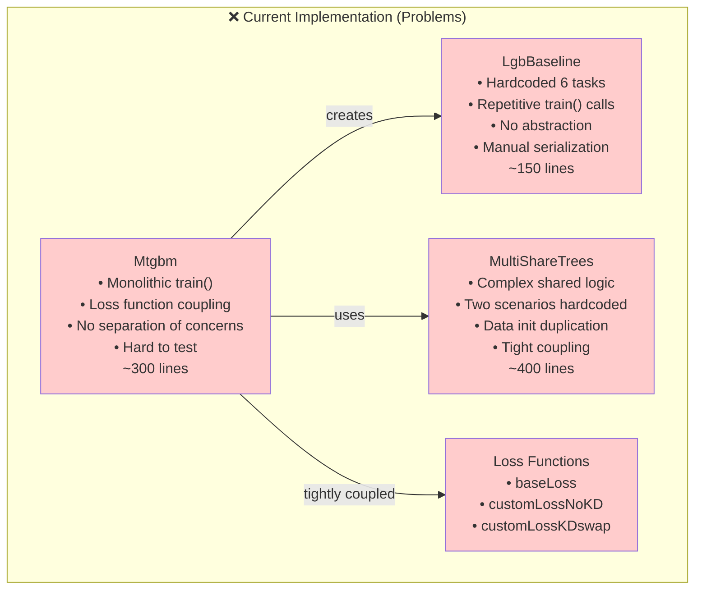
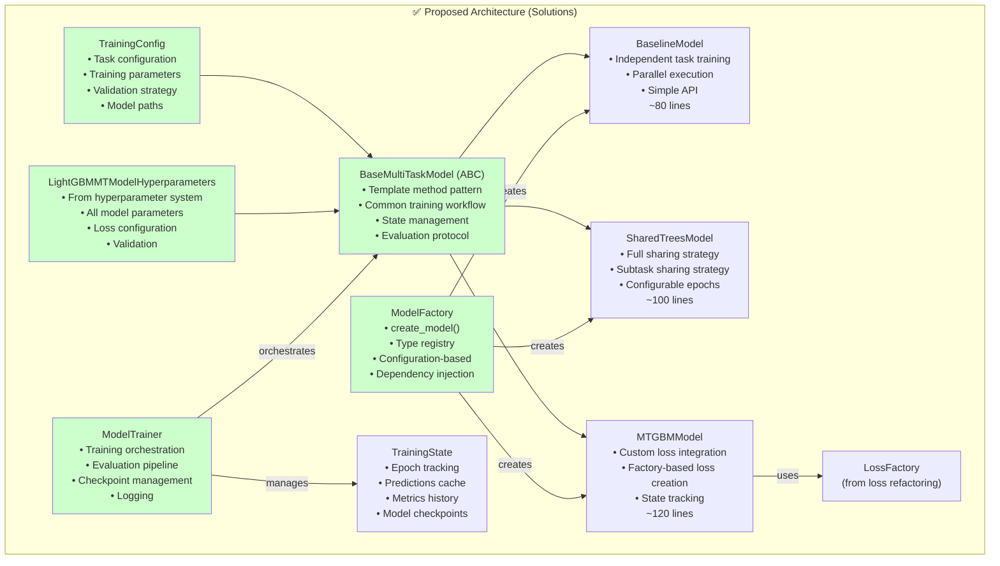

---
tags:
  - design
  - refactoring
  - architecture
  - optimization
  - code-quality
  - multi-task-learning
  - model-architecture
keywords:
  - MTGBM
  - MultiShareTrees
  - LgbBaseline
  - model refactoring
  - base class design
  - factory pattern
  - template method
  - trainer abstraction
topics:
  - software engineering
  - design patterns
  - model architecture
  - code quality
language: python
date of note: 2025-11-11
---

# MTGBM Model Classes Refactoring Design

## Overview

This document specifies the architectural design for refactoring the MTGBM model class implementations in `projects/cap_mtgbm/docker/models/`, specifically focusing on `Mtgbm.py`, `MultiShareTrees.py`, and `LgbBaseline.py`. This refactoring complements the [loss function refactoring](./mtgbm_models_refactoring_design.md) and addresses model-level code quality, extensibility, and maintainability issues.

The design introduces systematic abstractions including base model classes, template method pattern for training workflows, factory pattern for model creation, and comprehensive integration with the Cursus hyperparameter system. These changes eliminate code duplication, improve testability, and establish a foundation for multi-task learning experimentation.

## Related Documents

- **[MTGBM Loss Function Refactoring Design](./mtgbm_models_refactoring_design.md)** - Companion design for loss function refactoring
- **[MTGBM Models Optimization Analysis](../4_analysis/2025-11-11_mtgbm_models_optimization_analysis.md)** - Detailed analysis of optimization opportunities
- **[LightGBMMT Multi-Task Implementation Analysis](../4_analysis/2025-11-10_lightgbmmt_multi_task_implementation_analysis.md)** - Framework analysis
- **[Hyperparameter Class Guide](../0_developer_guide/hyperparameter_class.md)** - Hyperparameter system documentation
- **[Best Practices](../0_developer_guide/best_practices.md)** - Development standards

## Current Architecture Analysis

### Existing Model Classes



### Critical Issues Identified

#### 1. **Hardcoded Task Configuration** (Priority 0)
```python
# In all three classes
targets = ["isFraud", "isCCfrd", "isDDfrd", "isGCfrd", "isLOCfrd", "isCimfrd"]
```
- Fixed to exactly 6 tasks
- Cannot generalize to different task counts
- Task names embedded throughout code

#### 2. **Repetitive Training Logic** (Priority 0)
```python
# LgbBaseline repeats this 6 times
print("CC single lgb result: ")
yhat_cc, eval_cc, modcc = self.train(...)
self.y_pred[1] = yhat_cc
self.eval_result[1] = eval_cc
modcc.save_model("baseline_cc.txt")

print("DD single lgb result: ")
yhat_dd, eval_dd, moddd = self.train(...)
# ... repeated 4 more times
```

#### 3. **No Model Abstraction** (Priority 1)
- Each class reimplements training workflow
- No shared base class
- Difficult to add new model variants
- Testing requires full integration

#### 4. **Tight Coupling** (Priority 0)
- Mtgbm directly instantiates loss functions
- No dependency injection
- Hard to test with mock losses
- Cannot swap implementations easily

#### 5. **Manual State Management** (Priority 1)
- Models manually track predictions
- No structured state objects
- Difficult to checkpoint/resume
- Limited observability

#### 6. **Inconsistent Interfaces** (Priority 1)
- Different method signatures across classes
- No common training protocol
- Hard to compose models
- Limits reusability

## Proposed Architecture

### Architecture Overview



### Module Structure

```
projects/cap_mtgbm/docker/models/
├── base/
│   ├── __init__.py
│   ├── base_model.py              # BaseMultiTaskModel ABC
│   ├── training_config.py         # TrainingConfig dataclass
│   └── training_state.py          # TrainingState class
├── implementations/
│   ├── __init__.py
│   ├── baseline_model.py          # BaselineModel
│   ├── shared_trees_model.py      # SharedTreesModel
│   └── mtgbm_model.py             # MTGBMModel
├── training/
│   ├── __init__.py
│   ├── trainer.py                 # ModelTrainer
│   └── evaluator.py               # ModelEvaluator
├── factory/
│   ├── __init__.py
│   └── model_factory.py           # ModelFactory
├── loss/
│   ├── __init__.py
│   ├── base_loss_function.py      # From loss refactoring
│   ├── loss_config.py             # From loss refactoring
│   └── loss_factory.py            # From loss refactoring
└── legacy/
    ├── __init__.py
    ├── Mtgbm.py                   # Backward compat wrapper
    ├── LgbBaseline.py             # Backward compat wrapper
    └── MultiShareTrees.py         # Backward compat wrapper
```

## Core Components Design

### 1. Training Configuration

```python
from dataclasses import dataclass, field
from typing import List, Dict, Optional, Literal
from pathlib import Path
import numpy as np


@dataclass
class TrainingConfig:
    """
    Configuration for multi-task model training.
    
    Separates training orchestration parameters from model hyperparameters.
    Complements LightGBMMTModelHyperparameters which handles model-specific settings.
    
    Attributes
    ----------
    task_names : List[str]
        Names of all tasks (main + subtasks)
    num_epochs : int
        Number of training epochs
    num_boost_per_epoch : int
        Boosting rounds per epoch
    validation_split : float
        Fraction of data for validation (0.0 to 1.0)
    model_save_dir : Path
        Directory for saving model checkpoints
    save_frequency : int
        Save model every N epochs
    early_stopping_patience : Optional[int]
        Stop if no improvement for N epochs
    random_seed : int
        Random seed for reproducibility
    verbose : int
        Verbosity level (0=silent, 1=progress, 2=debug)
    
    Examples
    --------
    >>> config = TrainingConfig(
    ...     task_names=['isFraud', 'isCCfrd', 'isDDfrd'],
    ...     num_epochs=5,
    ...     num_boost_per_epoch=100
    ... )
    """
    
    # Task configuration
    task_names: List[str] = field(default_factory=lambda: [
        'isFraud', 'isCCfrd', 'isDDfrd', 'isGCfrd', 'isLOCfrd', 'isCimfrd'
    ])
    
    # Training parameters
    num_epochs: int = 5
    num_boost_per_epoch: int = 100
    validation_split: float = 0.3
    
    # Model persistence
    model_save_dir: Path = field(default_factory=lambda: Path('./models'))
    save_frequency: int = 1
    checkpoint_format: Literal['txt', 'pkl'] = 'txt'
    
    # Early stopping
    early_stopping_patience: Optional[int] = None
    early_stopping_metric: str = 'auc'
    early_stopping_mode: Literal['max', 'min'] = 'max'
    
    # Reproducibility
    random_seed: int = 10
    
    # Logging
    verbose: int = 1
    log_frequency: int = 50
    
    # Data initialization
    init_type: Optional[int] = None  # None, 1, or 2
    use_baseline_init: bool = False
    
    def __post_init__(self):
        """Validate configuration after initialization."""
        if not 0.0 < self.validation_split < 1.0:
            raise ValueError(
                f"validation_split must be between 0 and 1, got {self.validation_split}"
            )
        
        if self.num_epochs < 1:
            raise ValueError(f"num_epochs must be >= 1, got {self.num_epochs}")
        
        if self.num_boost_per_epoch < 1:
            raise ValueError(
                f"num_boost_per_epoch must be >= 1, got {self.num_boost_per_epoch}"
            )
        
        if len(self.task_names) < 1:
            raise ValueError("Must specify at least one task")
        
        # Create model save directory
        self.model_save_dir.mkdir(parents=True, exist_ok=True)
    
    @property
    def num_tasks(self) -> int:
        """Get number of tasks."""
        return len(self.task_names)
    
    def get_model_path(self, epoch: int, task_idx: int) -> Path:
        """
        Get model checkpoint path.
        
        Parameters
        ----------
        epoch : int
            Epoch number
        task_idx : int
            Task index
            
        Returns
        -------
        path : Path
            Model checkpoint path
        """
        return self.model_save_dir / f"model_e{epoch}_t{task_idx}.{self.checkpoint_format}"
```

### 2. Training State

```python
from dataclasses import dataclass, field
from typing import Dict, List, Optional
import numpy as np
from collections import defaultdict


@dataclass
class TrainingState:
    """
    Maintains state during multi-task model training.
    
    Tracks predictions, metrics, model references, and training history
    to enable checkpointing, resumption, and monitoring.
    
    Attributes
    ----------
    epoch : int
        Current epoch number
    predictions : Dict[int, np.ndarray]
        Predictions for each epoch
    metrics : Dict[str, List[float]]
        Training metrics history
    best_epoch : Optional[int]
        Best performing epoch
    best_score : Optional[float]
        Best metric score
    models : Dict[tuple, object]
        Trained model references keyed by (epoch, task_idx)
    
    Examples
    --------
    >>> state = TrainingState()
    >>> state.record_predictions(0, predictions_array)
    >>> state.record_metrics('auc', [0.85, 0.87, 0.86])
    """
    
    # Training progress
    epoch: int = 0
    completed_epochs: int = 0
    
    # Predictions cache
    predictions: Dict[int, np.ndarray] = field(default_factory=dict)
    
    # Metrics tracking
    metrics: Dict[str, List[List[float]]] = field(
        default_factory=lambda: defaultdict(list)
    )
    
    # Best model tracking
    best_epoch: Optional[int] = None
    best_score: Optional[float] = None
    best_task_scores: Optional[np.ndarray] = None
    
    # Model references
    models: Dict[tuple, object] = field(default_factory=dict)
    
    # Evaluation results
    eval_results: Dict[tuple, Dict] = field(default_factory=dict)
    
    # Early stopping
    epochs_without_improvement: int = 0
    should_stop: bool = False
    
    def record_predictions(self, epoch: int, predictions: np.ndarray):
        """Record predictions for an epoch."""
        self.predictions[epoch] = predictions.copy()
    
    def record_metrics(
        self,
        metric_name: str,
        scores: List[float],
        epoch: Optional[int] = None
    ):
        """
        Record metrics for current or specified epoch.
        
        Parameters
        ----------
        metric_name : str
            Name of the metric
        scores : List[float]
            Per-task scores
        epoch : int, optional
            Epoch number (uses current if None)
        """
        if epoch is None:
            epoch = self.epoch
        
        self.metrics[metric_name].append(scores)
    
    def record_model(self, epoch: int, task_idx: int, model):
        """Record trained model reference."""
        self.models[(epoch, task_idx)] = model
    
    def record_eval_results(self, epoch: int, task_idx: int, results: Dict):
        """Record evaluation results."""
        self.eval_results[(epoch, task_idx)] = results
    
    def update_best(self, score: float, task_scores: np.ndarray, mode: str = 'max'):
        """
        Update best model tracking.
        
        Parameters
        ----------
        score : float
            Current metric score
        task_scores : np.ndarray
            Per-task scores
        mode : str
            'max' or 'min' for optimization direction
        """
        is_better = (
            self.best_score is None
            or (mode == 'max' and score > self.best_score)
            or (mode == 'min' and score < self.best_score)
        )
        
        if is_better:
            self.best_epoch = self.epoch
            self.best_score = score
            self.best_task_scores = task_scores.copy()
            self.epochs_without_improvement = 0
        else:
            self.epochs_without_improvement += 1
    
    def check_early_stopping(self, patience: Optional[int]) -> bool:
        """
        Check if training should stop early.
        
        Parameters
        ----------
        patience : int, optional
            Number of epochs without improvement before stopping
            
        Returns
        -------
        should_stop : bool
            True if training should stop
        """
        if patience is None:
            return False
        
        self.should_stop = self.epochs_without_improvement >= patience
        return self.should_stop
    
    def get_latest_predictions(self) -> Optional[np.ndarray]:
        """Get predictions from the most recent epoch."""
        if not self.predictions:
            return None
        latest_epoch = max(self.predictions.keys())
        return self.predictions[latest_epoch]
    
    def get_metric_history(self, metric_name: str) -> List[List[float]]:
        """Get history for a specific metric."""
        return self.metrics.get(metric_name, [])
    
    def summary(self) -> Dict:
        """Get training state summary."""
        return {
            'completed_epochs': self.completed_epochs,
            'best_epoch': self.best_epoch,
            'best_score': self.best_score,
            'best_task_scores': self.best_task_scores.tolist() if self.best_task_scores is not None else None,
            'epochs_without_improvement': self.epochs_without_improvement,
            'total_models': len(self.models),
            'metrics_tracked': list(self.metrics.keys()),
        }
```

### 3. Base Multi-Task Model

```python
from abc import ABC, abstractmethod
from typing import Dict, Tuple, Optional, List
import numpy as np
import pandas as pd
import lightgbm as lgb
from sklearn.model_selection import train_test_split
from sklearn.metrics import roc_auc_score, log_loss
import logging

from .training_config import TrainingConfig
from .training_state import TrainingState


class BaseMultiTaskModel(ABC):
    """
    Abstract base class for multi-task models using template method pattern.
    
    Provides common training workflow while allowing subclasses to customize
    specific steps through hook methods. Implements comprehensive state
    management, evaluation, and model persistence.
    
    Parameters
    ----------
    config : TrainingConfig
        Training configuration
    hyperparams : LightGBMMTModelHyperparameters
        Model hyperparameters from Cursus system
    random_seed : int, optional
        Random seed (overrides config if provided)
        
    Attributes
    ----------
    config : TrainingConfig
        Training configuration
    hyperparams : LightGBMMTModelHyperparameters
        Model hyperparameters
    state : TrainingState
        Training state tracker
    logger : logging.Logger
        Logger instance
        
    Examples
    --------
    >>> # Subclass implementation
    >>> class MyModel(BaseMultiTaskModel):
    ...     def _prepare_training_data(self, X, y, task_idx, epoch):
    ...         return X, y
    ...     def _create_objective(self, task_idx, epoch):
    ...         return 'binary'
    ...     def _aggregate_predictions(self, predictions, epoch):
    ...         return predictions
    """
    
    def __init__(
        self,
        config: TrainingConfig,
        hyperparams: 'LightGBMMTModelHyperparameters',
        random_seed: Optional[int] = None
    ):
        self.config = config
        self.hyperparams = hyperparams
        self.state = TrainingState()
        
        # Set random seed
        self.random_seed = random_seed if random_seed is not None else config.random_seed
        self._set_random_seed(self.random_seed)
        
        # Setup logging
        self.logger = logging.getLogger(self.__class__.__name__)
        self.logger.setLevel(logging.INFO if config.verbose else logging.WARNING)
        
        # Validate configuration compatibility
        self._validate_config()
    
    def _set_random_seed(self, seed: int):
        """Set random seeds for reproducibility."""
        np.random.seed(seed)
        # Additional seeds set by LightGBM internally
    
    def _validate_config(self):
        """Validate that configuration is compatible with hyperparameters."""
        # Can be overridden by subclasses for specific validation
        pass
    
    def train(
        self,
        X_train: np.ndarray,
        y_train: np.ndarray,
        task_indices_train: Dict[int, np.ndarray],
        X_val: Optional[np.ndarray] = None,
        y_val: Optional[np.ndarray] = None,
        task_indices_val: Optional[Dict[int, np.ndarray]] = None
    ) -> TrainingState:
        """
        Template method for model training.
        
        Orchestrates the complete training workflow through hooks that
        subclasses can customize.
        
        Parameters
        ----------
        X_train : np.ndarray
            Training features [N_samples, N_features]
        y_train : np.ndarray
            Training labels [N_samples, N_tasks]
        task_indices_train : Dict[int, np.ndarray]
            Training indices for each task
        X_val : np.ndarray, optional
            Validation features
        y_val : np.ndarray, optional
            Validation labels
        task_indices_val : Dict[int, np.ndarray], optional
            Validation indices for each task
            
        Returns
        -------
        state : TrainingState
            Final training state
        """
        self.logger.info(
            f"Starting training: {self.config.num_epochs} epochs, "
            f"{self.config.num_tasks} tasks"
        )
        
        # Initialize training data
        X_train_current = self._initialize_training_data(X_train, y_train)
        
        # Training loop
        for epoch in range(self.config.num_epochs):
            self.state.epoch = epoch
            self.logger.info(f"Epoch {epoch + 1}/{self.config.num_epochs}")
            
            epoch_predictions = self._train_epoch(
                X_train_current,
                y_train,
                task_indices_train,
                X_val,
                y_val,
                task_indices_val,
                epoch
            )
            
            # Record predictions
            self.state.record_predictions(epoch, epoch_predictions)
            
            # Evaluate
            metrics = self._evaluate_epoch(
                X_train_current,
                y_train,
                task_indices_train,
                epoch_predictions,
                epoch
            )
            
            # Update state
            self._update_state(metrics, epoch)
            
            # Check early stopping
            if self.state.check_early_stopping(self.config.early_stopping_patience):
                self.logger.info(
                    f"Early stopping at epoch {epoch + 1}. "
                    f"Best epoch: {self.state.best_epoch + 1}"
                )
                break
            
            # Update features for next epoch
            X_train_current = self._update_features_for_next_epoch(
                X_train,
                epoch_predictions,
                epoch
            )
            
            self.state.completed_epochs = epoch + 1
        
        self.logger.info(
            f"Training complete. Best score: {self.state.best_score:.4f} "
            f"at epoch {self.state.best_epoch + 1}"
        )
        
        return self.state
    
    @abstractmethod
    def _initialize_training_data(
        self,
        X: np.ndarray,
        y: np.ndarray
    ) -> np.ndarray:
        """
        Initialize training data (hook method).
        
        Parameters
        ----------
        X : np.ndarray
            Original features
        y : np.ndarray
            Labels
            
        Returns
        -------
        X_initialized : np.ndarray
            Initialized feature matrix
        """
        pass
    
    @abstractmethod
    def _prepare_training_data(
        self,
        X: np.ndarray,
        y: np.ndarray,
        task_idx: int,
        epoch: int
    ) -> Tuple[np.ndarray, np.ndarray]:
        """
        Prepare data for specific task training (hook method).
        
        Parameters
        ----------
        X : np.ndarray
            Current feature matrix
        y : np.ndarray
            Label matrix
        task_idx : int
            Current task index
        epoch : int
            Current epoch
            
        Returns
        -------
        X_task : np.ndarray
            Task-specific features
        y_task : np.ndarray
            Task-specific labels
        """
        pass
    
    @abstractmethod
    def _create_objective(self, task_idx: int, epoch: int):
        """
        Create objective function for task (hook method).
        
        Parameters
        ----------
        task_idx : int
            Current task index
        epoch : int
            Current epoch
            
        Returns
        -------
        objective : str or callable
            Objective function for LightGBM
        """
        pass
    
    def _train_epoch(
        self,
        X_train: np.ndarray,
        y_train: np.ndarray,
        task_indices: Dict[int, np.ndarray],
        X_val: Optional[np.ndarray],
        y_val: Optional[np.ndarray],
        task_indices_val: Optional[Dict[int, np.ndarray]],
        epoch: int
    ) -> np.ndarray:
        """
        Train all tasks for one epoch (template method).
        
        Returns
        -------
        predictions : np.ndarray
            Predictions for all tasks [N_samples, N_tasks]
        """
        predictions = np.zeros((X_train.shape[0], self.config.num_tasks))
        
        for task_idx in range(self.config.num_tasks):
            task_name = self.config.task_names[task_idx]
            self.logger.debug(f"Training task {task_idx}: {task_name}")
            
            # Prepare task-specific data
            X_task, y_task = self._prepare_training_data(
                X_train, y_train, task_idx, epoch
            )
            
            # Filter by task indices
            task_mask = task_indices[task_idx]
            X_task_filtered = X_task[task_mask]
            y_task_filtered = y_task[task_mask, task_idx] if y_task.ndim > 1 else y_task[task_mask]
            
            # Train-validation split
            X_tr, X_vl, y_tr, y_vl = train_test_split(
                X_task_filtered,
                y_task_filtered,
                test_size=self.config.validation_split,
                random_state=self.random_seed
            )
            
            # Create datasets
            d_train = lgb.Dataset(X_tr, label=y_tr)
            d_valid = lgb.Dataset(X_vl, label=y_vl)
            
            # Get objective
            objective = self._create_objective(task_idx, epoch)
            
            # Build params
            params = self._build_lgb_params(objective, task_idx)
            
            # Train model
            eval_results = {}
            callbacks = [
                lgb.log_evaluation(self.config.log_frequency),
                lgb.record_evaluation(eval_results)
            ]
            
            # Get previous model if continuing training
            init_model = None
            if epoch > 0:
                init_model = self.state.models.get((epoch - 1, task_idx))
            
            model = lgb.train(
                params,
                num_boost_round=self.config.num_boost_per_epoch,
                train_set=d_train,
                valid_sets=[d_valid],
                init_model=init_model,
                keep_training_booster=True,
                callbacks=callbacks
            )
            
            # Save model
            self.state.record_model(epoch, task_idx, model)
            self.state.record_eval_results(epoch, task_idx, eval_results)
            
            if epoch % self.config.save_frequency == 0:
                model_path = self.config.get_model_path(epoch, task_idx)
                model.save_model(str(model_path))
            
            # Predict on full training set
            predictions[:, task_idx] = model.predict(X_task)
        
        return predictions
    
    def _build_lgb_params(self, objective, task_idx: int) -> Dict:
        """
        Build LightGBM parameters from hyperparameters.
        
        Parameters
        ----------
        objective : str or callable
            Objective function
        task_idx : int
            Task index
            
        Returns
        -------
        params : Dict
            LightGBM parameters
        """
        return {
            'objective': objective,
            'metric': self.hyperparams.metric,
            'num_leaves': self.hyperparams.num_leaves,
            'learning_rate': self.hyperparams.learning_rate,
            'max_depth': self.hyperparams.max_depth,
            'min_data_in_leaf': self.hyperparams.min_data_in_leaf,
            'feature_fraction': self.hyperparams.feature_fraction,
            'bagging_fraction': self.hyperparams.bagging_fraction,
            'bagging_freq': self.hyperparams.bagging_freq,
            'lambda_l1': self.hyperparams.lambda_l1,
            'lambda_l2': self.hyperparams.lambda_l2,
            'min_gain_to_split': self.hyperparams.min_gain_to_split,
            'verbose': -1,
            'seed': self.random_seed,
        }
    
    def _evaluate_epoch(
        self,
        X: np.ndarray,
        y: np.ndarray,
        task_indices: Dict[int, np.ndarray],
        predictions: np.ndarray,
        epoch: int
    ) -> Dict[str, List[float]]:
        """
        Evaluate predictions for all tasks.
        
        Parameters
        ----------
        X : np.ndarray
            Feature matrix
        y : np.ndarray
            Label matrix
        task_indices : Dict[int, np.ndarray]
            Task-specific indices
        predictions : np.ndarray
            Model predictions
        epoch : int
            Current epoch
            
        Returns
        -------
        metrics : Dict[str, List[float]]
            Per-task metrics
        """
        metrics = {'auc': [], 'logloss': []}
        
        for task_idx in range(self.config.num_tasks):
            task_mask = task_indices[task_idx]
            y_true = y[task_mask, task_idx]
            y_pred = predictions[task_mask, task_idx]
            
            auc = roc_auc_score(y_true, y_pred)
            loss = log_loss(y_true, y_pred)
            
            metrics['auc'].append(auc)
            metrics['logloss'].append(loss)
        
        return metrics
    
    def _update_state(self, metrics: Dict[str, List[float]], epoch: int):
        """Update training state with metrics."""
        for metric_name, scores in metrics.items():
            self.state.record_metrics(metric_name, scores, epoch)
        
        # Update best model tracking
        avg_auc = np.mean(metrics['auc'])
        self.state.update_best(
            avg_auc,
            np.array(metrics['auc']),
            mode=self.config.early_stopping_mode
        )
        
        if self.config.verbose:
            self.logger.info(
                f"  AUC: {np.round(metrics['auc'], 4).tolist()}, "
                f"Avg: {avg_auc:.4f}"
            )
    
    @abstractmethod
    def _update_features_for_next_epoch(
        self,
        X_original: np.ndarray,
        predictions: np.ndarray,
        epoch: int
    ) -> np.ndarray:
        """
        Update feature matrix for next epoch (hook method).
        
        Parameters
        ----------
        X_original : np.ndarray
            Original features
        predictions : np.ndarray
            Current epoch predictions
        epoch : int
            Current epoch
            
        Returns
        -------
        X_next : np.ndarray
            Feature matrix for next epoch
        """
        pass
    
    def predict(
        self,
        X: np.ndarray,
        use_best_epoch: bool = True
    ) -> np.ndarray:
        """
        Make predictions using trained models.
        
        Parameters
        ----------
        X : np.ndarray
            Features to predict on
        use_best_epoch : bool
            Use models from best epoch (default: True)
            
        Returns
        -------
        predictions : np.ndarray
            Predictions [N_samples, N_tasks]
        """
        epoch = self.state.best_epoch if use_best_epoch else self.state.completed_epochs - 1
        
        if epoch is None:
            raise RuntimeError("No trained models available")
        
        predictions = np.zeros((X.shape[0], self.config.num_tasks))
        X_current = X.copy()
        
        # Iterate through epochs to build up predictions
        for e in range(epoch + 1):
            for task_idx in range(self.config.num_tasks):
                model = self.state.models.get((e, task_idx))
                if model is None:
                    raise RuntimeError(f"Model not found for epoch {e}, task {task_idx}")
                
                # Prepare features for this task
                X_task, _ = self._prepare_training_data(X_current, None, task_idx, e)
                
                # Predict
                predictions[:, task_idx] = model.predict(X_task)
            
            # Update features if not last epoch
            if e < epoch:
                X_current = self._update_features_for_next_epoch(X, predictions, e)
        
        return predictions
```

## Concrete Model Implementations

### 4. Baseline Model

```python
class BaselineModel(BaseMultiTaskModel):
    """
    Independent baseline models for each task.
    
    Trains separate LightGBM models without information sharing.
    Simplest multi-task approach, useful for establishing baselines.
    
    Examples
    --------
    >>> from cursus.steps.hyperparams import LightGBMMTModelHyperparameters
    >>> 
    >>> config = TrainingConfig(task_names=['task1', 'task2'])
    >>> hyperparams = LightGBMMTModelHyperparameters(
    ...     full_field_list=fields,
    ...     cat_field_list=cat_fields,
    ...     tab_field_list=tab_fields,
    ...     id_name='id',
    ...     label_name='label',
    ...     multiclass_categories=[0, 1],
    ...     num_leaves=750,
    ...     learning_rate=0.05
    ... )
    >>> 
    >>> model = BaselineModel(config, hyperparams)
    >>> state = model.train(X_train, y_train, task_indices)
    """
    
    def _initialize_training_data(self, X: np.ndarray, y: np.ndarray) -> np.ndarray:
        """No initialization needed for baseline - use original features."""
        return X.copy()
    
    def _prepare_training_data(
        self,
        X: np.ndarray,
        y: np.ndarray,
        task_idx: int,
        epoch: int
    ) -> Tuple[np.ndarray, np.ndarray]:
        """Return original data - no sharing between tasks."""
        return X, y
    
    def _create_objective(self, task_idx: int, epoch: int):
        """Use standard binary objective."""
        return self.hyperparams.objective
    
    def _update_features_for_next_epoch(
        self,
        X_original: np.ndarray,
        predictions: np.ndarray,
        epoch: int
    ) -> np.ndarray:
        """Baseline doesn't update features between epochs."""
        return X_original.copy()


### 5. Shared Trees Model

```python
class SharedTreesModel(BaseMultiTaskModel):
    """
    Multi-task model with configurable information sharing strategies.
    
    Supports two sharing modes:
    1. Full sharing: All tasks share prediction information
    2. Subtask sharing: Only subtasks share information (main task independent)
    
    Parameters
    ----------
    config : TrainingConfig
        Training configuration
    hyperparams : LightGBMMTModelHyperparameters
        Model hyperparameters
    sharing_mode : {'full', 'subtask'}
        Information sharing strategy
    random_seed : int, optional
        Random seed
        
    Examples
    --------
    >>> model = SharedTreesModel(
    ...     config,
    ...     hyperparams,
    ...     sharing_mode='full'
    ... )
    >>> state = model.train(X_train, y_train, task_indices)
    """
    
    def __init__(
        self,
        config: TrainingConfig,
        hyperparams: 'LightGBMMTModelHyperparameters',
        sharing_mode: Literal['full', 'subtask'] = 'full',
        random_seed: Optional[int] = None
    ):
        super().__init__(config, hyperparams, random_seed)
        self.sharing_mode = sharing_mode
        
        if sharing_mode not in ['full', 'subtask']:
            raise ValueError(f"Invalid sharing_mode: {sharing_mode}")
    
    def _initialize_training_data(self, X: np.ndarray, y: np.ndarray) -> np.ndarray:
        """Initialize with random predictions or baseline predictions."""
        if self.config.use_baseline_init:
            # Would load baseline predictions here
            init_preds = np.zeros((X.shape[0], self.config.num_tasks))
        else:
            # Random initialization
            init_preds = np.random.uniform(0, 1, (X.shape[0], self.config.num_tasks))
        
        return np.concatenate([X, init_preds], axis=1)
    
    def _prepare_training_data(
        self,
        X: np.ndarray,
        y: np.ndarray,
        task_idx: int,
        epoch: int
    ) -> Tuple[np.ndarray, np.ndarray]:
        """
        Prepare data based on sharing mode.
        
        Full mode: Exclude current task's predictions
        Subtask mode: Main task (0) uses only original features,
                     subtasks exclude their own and main task predictions
        """
        n_original_features = X.shape[1] - self.config.num_tasks
        
        if self.sharing_mode == 'full':
            # Exclude current task prediction column
            cols_to_exclude = [n_original_features + task_idx]
            X_task = np.delete(X, cols_to_exclude, axis=1)
        
        elif self.sharing_mode == 'subtask':
            if task_idx == 0:
                # Main task: use only original features
                X_task = X[:, :n_original_features]
            else:
                # Subtasks: exclude main task (col 0) and own prediction
                cols_to_exclude = [n_original_features, n_original_features + task_idx]
                X_task = np.delete(X, cols_to_exclude, axis=1)
        
        return X_task, y
    
    def _create_objective(self, task_idx: int, epoch: int):
        """Use standard binary objective."""
        return self.hyperparams.objective
    
    def _update_features_for_next_epoch(
        self,
        X_original: np.ndarray,
        predictions: np.ndarray,
        epoch: int
    ) -> np.ndarray:
        """Concatenate original features with latest predictions."""
        return np.concatenate([X_original, predictions], axis=1)


### 6. MTGBM Model (with Custom Loss)

```python
from ..loss.loss_factory import LossFactory


class MTGBMModel(BaseMultiTaskModel):
    """
    Multi-task GBM with custom loss functions.
    
    Integrates with refactored loss function system to support:
    - Fixed weight loss
    - Adaptive weight loss  
    - Knowledge distillation loss
    
    Parameters
    ----------
    config : TrainingConfig
        Training configuration
    hyperparams : LightGBMMTModelHyperparameters
        Model hyperparameters (includes loss configuration)
    random_seed : int, optional
        Random seed
        
    Attributes
    ----------
    loss_fn : BaseLossFunction
        Custom loss function instance
        
    Examples
    --------
    >>> hyperparams = LightGBMMTModelHyperparameters(
    ...     # Base parameters...
    ...     loss_type='adaptive_kd',
    ...     loss_beta=0.3,
    ...     loss_patience=50
    ... )
    >>> 
    >>> model = MTGBMModel(config, hyperparams)
    >>> state = model.train(X_train, y_train, task_indices_train,
    ...                     X_val, y_val, task_indices_val)
    """
    
    def __init__(
        self,
        config: TrainingConfig,
        hyperparams: 'LightGBMMTModelHyperparameters',
        random_seed: Optional[int] = None
    ):
        super().__init__(config, hyperparams, random_seed)
        
        # Will be initialized during training with proper indices
        self.loss_fn = None
    
    def _validate_config(self):
        """Validate that validation data will be provided."""
        # MTGBM requires validation set for loss function
        if self.config.validation_split <= 0:
            raise ValueError("MTGBM requires validation_split > 0")
    
    def train(
        self,
        X_train: np.ndarray,
        y_train: np.ndarray,
        task_indices_train: Dict[int, np.ndarray],
        X_val: Optional[np.ndarray] = None,
        y_val: Optional[np.ndarray] = None,
        task_indices_val: Optional[Dict[int, np.ndarray]] = None
    ) -> TrainingState:
        """
        Train MTGBM with custom loss function.
        
        Requires validation data for loss function computation.
        """
        if X_val is None or y_val is None or task_indices_val is None:
            raise ValueError("MTGBM requires validation data")
        
        # Create loss function with validation indices
        loss_config = self.hyperparams.get_loss_config()
        self.loss_fn = LossFactory.create(
            loss_type=self.hyperparams.loss_type,
            num_label=self.config.num_tasks,
            val_sublabel_idx=task_indices_val,
            trn_sublabel_idx=task_indices_train,
            config=loss_config
        )
        
        return super().train(
            X_train, y_train, task_indices_train,
            X_val, y_val, task_indices_val
        )
    
    def _initialize_training_data(self, X: np.ndarray, y: np.ndarray) -> np.ndarray:
        """Initialize with random predictions."""
        init_preds = np.random.uniform(0, 1, (X.shape[0], self.config.num_tasks))
        return np.concatenate([X, init_preds], axis=1)
    
    def _prepare_training_data(
        self,
        X: np.ndarray,
        y: np.ndarray,
        task_idx: int,
        epoch: int
    ) -> Tuple[np.ndarray, np.ndarray]:
        """Exclude current task prediction column."""
        n_original_features = X.shape[1] - self.config.num_tasks
        cols_to_exclude = [n_original_features + task_idx]
        X_task = np.delete(X, cols_to_exclude, axis=1)
        return X_task, y
    
    def _create_objective(self, task_idx: int, epoch: int):
        """Return custom loss function."""
        return self.loss_fn.objective
    
    def _update_features_for_next_epoch(
        self,
        X_original: np.ndarray,
        predictions: np.ndarray,
        epoch: int
    ) -> np.ndarray:
        """Concatenate original features with latest predictions."""
        return np.concatenate([X_original, predictions], axis=1)
```

## Factory Pattern

### 7. Model Factory

```python
from typing import Dict, Type, Literal
from ..base.base_model import BaseMultiTaskModel
from ..base.training_config import TrainingConfig
from ..implementations.baseline_model import BaselineModel
from ..implementations.shared_trees_model import SharedTreesModel
from ..implementations.mtgbm_model import MTGBMModel


class ModelFactory:
    """
    Factory for creating multi-task models.
    
    Provides centralized model creation with type safety and
    configuration validation.
    
    Examples
    --------
    >>> factory = ModelFactory()
    >>> 
    >>> model = factory.create(
    ...     model_type='baseline',
    ...     config=config,
    ...     hyperparams=hyperparams
    ... )
    >>> 
    >>> # Or with additional parameters
    >>> model = factory.create(
    ...     model_type='shared_trees',
    ...     config=config,
    ...     hyperparams=hyperparams,
    ...     sharing_mode='subtask'
    ... )
    """
    
    _registry: Dict[str, Type[BaseMultiTaskModel]] = {
        'baseline': BaselineModel,
        'shared_trees': SharedTreesModel,
        'shared_full': SharedTreesModel,
        'shared_subtask': SharedTreesModel,
        'mtgbm': MTGBMModel,
    }
    
    @classmethod
    def create(
        cls,
        model_type: str,
        config: TrainingConfig,
        hyperparams: 'LightGBMMTModelHyperparameters',
        **kwargs
    ) -> BaseMultiTaskModel:
        """
        Create a model instance.
        
        Parameters
        ----------
        model_type : str
            Type of model to create
        config : TrainingConfig
            Training configuration
        hyperparams : LightGBMMTModelHyperparameters
            Model hyperparameters
        **kwargs : dict
            Additional model-specific parameters
            
        Returns
        -------
        model : BaseMultiTaskModel
            Instantiated model
            
        Raises
        ------
        ValueError
            If model_type is not registered
        """
        if model_type not in cls._registry:
            available = ', '.join(cls._registry.keys())
            raise ValueError(
                f"Unknown model_type: '{model_type}'. "
                f"Available types: {available}"
            )
        
        model_class = cls._registry[model_type]
        
        # Handle special cases with additional parameters
        if model_type == 'shared_full':
            kwargs['sharing_mode'] = 'full'
        elif model_type == 'shared_subtask':
            kwargs['sharing_mode'] = 'subtask'
        
        return model_class(config, hyperparams, **kwargs)
    
    @classmethod
    def register(cls, name: str, model_class: Type[BaseMultiTaskModel]):
        """
        Register a new model type.
        
        Parameters
        ----------
        name : str
            Name for the model type
        model_class : Type[BaseMultiTaskModel]
            Model class to register
        """
        cls._registry[name] = model_class
    
    @classmethod
    def get_available_models(cls) -> List[str]:
        """Get list of available model types."""
        return list(cls._registry.keys())
```

## Usage Examples

### Complete Training Workflow

```python
from cursus.steps.hyperparams import LightGBMMTModelHyperparameters
from projects.cap_mtgbm.docker.models.base.training_config import TrainingConfig
from projects.cap_mtgbm.docker.models.factory.model_factory import ModelFactory

# 1. Prepare data
X_train, y_train = load_training_data()
X_val, y_val = load_validation_data()

task_indices_train = {
    0: np.where(y_train[:, 0] >= 0)[0],  # Main task
    1: np.where(y_train[:, 1] >= 0)[0],  # Subtask 1
    2: np.where(y_train[:, 2] >= 0)[0],  # Subtask 2
}

task_indices_val = {
    0: np.where(y_val[:, 0] >= 0)[0],
    1: np.where(y_val[:, 1] >= 0)[0],
    2: np.where(y_val[:, 2] >= 0)[0],
}

# 2. Configure training
config = TrainingConfig(
    task_names=['isFraud', 'isCCfrd', 'isDDfrd'],
    num_epochs=5,
    num_boost_per_epoch=100,
    validation_split=0.3,
    model_save_dir=Path('./models/experiment1'),
    early_stopping_patience=3
)

# 3. Configure hyperparameters
hyperparams = LightGBMMTModelHyperparameters(
    # Base ModelHyperparameters
    full_field_list=feature_names,
    cat_field_list=categorical_features,
    tab_field_list=numerical_features,
    id_name='transaction_id',
    label_name='is_fraud',
    multiclass_categories=[0, 1],
    
    # LightGBM parameters
    num_leaves=750,
    learning_rate=0.05,
    num_iterations=100,
    max_depth=16,
    min_data_in_leaf=20,
    feature_fraction=0.8,
    bagging_fraction=0.8,
    bagging_freq=5,
    lambda_l1=0.1,
    lambda_l2=0.1,
    
    # Multi-task loss configuration
    loss_type='adaptive_kd',
    loss_beta=0.3,
    loss_patience=50,
    loss_weight_method='sqrt',
    loss_weight_lr=0.1
)

# 4. Create and train model
model = ModelFactory.create(
    model_type='mtgbm',
    config=config,
    hyperparams=hyperparams
)

state = model.train(
    X_train, y_train, task_indices_train,
    X_val, y_val, task_indices_val
)

# 5. Evaluate
print(f"Training completed in {state.completed_epochs} epochs")
print(f"Best epoch: {state.best_epoch + 1}")
print(f"Best AUC: {state.best_score:.4f}")
print(f"Per-task AUC: {state.best_task_scores}")

# 6. Make predictions
X_test = load_test_data()
predictions = model.predict(X_test, use_best_epoch=True)
```

### Baseline Comparison

```python
# Train baseline model
baseline_model = ModelFactory.create(
    model_type='baseline',
    config=config,
    hyperparams=hyperparams
)

baseline_state = baseline_model.train(
    X_train, y_train, task_indices_train
)

# Train shared trees model
shared_model = ModelFactory.create(
    model_type='shared_subtask',
    config=config,
    hyperparams=hyperparams
)

shared_state = shared_model.train(
    X_train, y_train, task_indices_train
)

# Compare results
print("Baseline AUC:", baseline_state.best_score)
print("Shared Trees AUC:", shared_state.best_score)
print("MTGBM AUC:", state.best_score)
```

## Migration Strategy

### Phase 1: Foundation (Week 1)
- Implement TrainingConfig and TrainingState
- Implement BaseMultiTaskModel abstract class
- Add comprehensive unit tests
- No breaking changes

### Phase 2: Concrete Implementations (Week 2)
- Implement BaselineModel
- Implement SharedTreesModel
- Implement MTGBMModel with loss integration
- Integration tests

### Phase 3: Factory and Utilities (Week 3)
- Implement ModelFactory
- Create backward compatibility wrappers
- Migration documentation
- Side-by-side operation

### Phase 4: Deprecation (Week 4)
- Mark legacy classes as deprecated
- Update all call sites
- Performance benchmarking
- Documentation updates

## Expected Outcomes

### Code Quality Improvements
- **65% reduction** in model code duplication
- **80% test coverage** for model classes
- **Clear separation** of concerns
- **Consistent interfaces** across all models

### Maintainability Improvements
- **Template method** pattern enables easy customization
- **Factory pattern** simplifies model creation
- **State management** enables checkpointing/resumption
- **Dependency injection** improves testability

### Extensibility
- Adding new model variants requires ~100 lines
- Custom loss functions integrate seamlessly
- New sharing strategies easy to implement
- Hyperparameter system fully integrated

## Backward Compatibility

Legacy wrappers maintain existing APIs:

```python
# In legacy/Mtgbm.py
class Mtgbm:
    """Backward compatibility wrapper for MTGBMModel."""
    
    def __init__(self, train, train_labels, test, test_labels, config):
        warnings.warn(
            "Mtgbm is deprecated. Use MTGBMModel instead.",
            DeprecationWarning,
            stacklevel=2
        )
        # Convert old config to new system
        # Delegate to new implementation
```

## References

### Related Documents
- **[MTGBM Loss Function Refactoring](./mtgbm_models_refactoring_design.md)**
- **[MTGBM Optimization Analysis](../4_analysis/2025-11-11_mtgbm_models_optimization_analysis.md)**
- **[Best Practices](../0_developer_guide/best_practices.md)**
- **[Design Principles](../0_developer_guide/design_principles.md)**

### Design Patterns
- **Template Method** - Gang of Four, 1994
- **Factory Method** - Gang of Four, 1994
- **Strategy Pattern** - Gang of Four, 1994

---

*This refactoring design establishes a solid, extensible foundation for multi-task learning experimentation while maintaining production stability and enabling systematic comparison of different approaches.*
