---
tags:
  - design
  - implementation
  - multi-task-learning
  - lightgbm
  - gradient-boosting
  - knowledge-distillation
  - fraud-detection
keywords:
  - MTGBM
  - multi-task gradient boosting
  - lightgbmmt
  - adaptive weighting
  - knowledge distillation
  - task similarity
  - Jensen-Shannon divergence
  - fraud detection
topics:
  - machine learning
  - multi-task learning
  - gradient boosting
  - loss functions
  - model architecture
language: python
date of note: 2025-01-10
---

# MTGBM Multi-Task Learning Design

## Overview

This document outlines the design and implementation of Multi-Task Gradient Boosting Machine (MTGBM) models for the CAP project. MTGBM extends traditional gradient boosting by jointly learning a main task alongside multiple auxiliary tasks, leveraging task relationships to improve overall performance through shared representations and dynamic task weighting.

The implementation builds on a custom fork of LightGBM (`lightgbmmt`) that supports multi-label training with sophisticated loss functions including adaptive task weighting and knowledge distillation mechanisms.

## Related Documents
- **[LightGBMMT Multi-Task Implementation Analysis](../4_analysis/2025-11-10_lightgbmmt_multi_task_implementation_analysis.md)** - Comprehensive analysis of lightgbmmt framework
- **[LightGBM Training Contract](../../src/cursus/steps/contracts/lightgbm_training_contract.py)** - LightGBM training interface
- **[Feature Selection Script Design](./feature_selection_script_design.md)** - Feature engineering patterns
- **[Model Metrics Computation Design](./model_metrics_computation_design.md)** - Evaluation metrics

## Design Principles

### Multi-Task Learning Philosophy
- **Shared Representations**: Learn common feature representations across related tasks
- **Task Complementarity**: Leverage auxiliary tasks to improve main task performance
- **Dynamic Weighting**: Automatically adjust task importance during training
- **Knowledge Transfer**: Transfer knowledge from well-performing tasks to struggling ones

### Architecture Principles
- **Modular Loss Functions**: Pluggable loss implementations for different training strategies
- **Configurable Complexity**: Flexible architecture supporting various task configurations
- **Evaluation Transparency**: Comprehensive metrics tracking for all tasks
- **Production Readiness**: Built-in visualization and model persistence

## Architecture Overview

```mermaid
flowchart TD
    subgraph "🎯 MTGBM Architecture"
        MainTask["Main Task (is_abusive)<br/>• Primary prediction target<br/>• Highest weight in optimization<br/>• Final model output"]
        SubTasks["Auxiliary Tasks<br/>• Related subtasks (e.g., abuse types)<br/>• Shared tree structures<br/>• Dynamic weight adjustment"]
        SharedTrees["Shared Tree Structures<br/>• Common feature representations<br/>• Multi-label leaf outputs<br/>• Gradient aggregation"]
    end
    
    subgraph "🔧 Model Components"
        Config["Configuration<br/>• Hyperparameters<br/>• Task definitions<br/>• Loss function selection<br/>• Training settings"]
        Features["Input Features<br/>• Categorical features<br/>• Numerical features<br/>• Engineered features<br/>• Feature importance"]
        Labels["Label Matrix<br/>• Main task labels<br/>• Subtask labels<br/>• Missing label handling<br/>• Label coordination"]
    end
    
    subgraph "📊 Loss Functions"
        BaseLoss["Base Loss<br/>• Fixed weight vector<br/>• Standard MTGBM<br/>• β=0.2 default<br/>• W=[1, 0.1β, 0.1β, ...]"]
        AutoWeight["Auto Weight (No KD)<br/>• Dynamic task weighting<br/>• Jensen-Shannon divergence<br/>• Task similarity computation<br/>• Real-time weight adjustment"]
        AutoWeightKD["Auto Weight + KD<br/>• Knowledge distillation<br/>• Patience-based replacement<br/>• Label swapping mechanism<br/>• Advanced convergence"]
    end
    
    subgraph "⚖️ Adaptive Weighting"
        Similarity["Task Similarity<br/>• JS divergence computation<br/>• Inverse similarity weights<br/>• L2 normalization<br/>• Learning rate scaling"]
        Methods["Weight Update Methods<br/>• None: Standard adaptive<br/>• tenIters: Every 50 iterations<br/>• sqrt: Square root weights<br/>• delta: Incremental updates"]
    end
    
    subgraph "📚 Knowledge Distillation"
        Patience["Patience Mechanism<br/>• Track task performance<br/>• Counter for decline<br/>• Best prediction storage<br/>• Replacement trigger"]
        LabelSwap["Label Swapping<br/>• Replace struggling labels<br/>• Use best predictions<br/>• Prevent performance plateau<br/>• Maintain training stability"]
    end
    
    subgraph "📈 Training Process"
        DataSplit["Train/Val Split<br/>• 90/10 split ratio<br/>• Stratified sampling<br/>• Index tracking<br/>• Reproducible seed=10"]
        GradientComp["Gradient Computation<br/>• Individual task gradients<br/>• Normalization step<br/>• Weighted aggregation<br/>• Ensemble G_e and H_e"]
        Boosting["Boosting Iterations<br/>• Serial tree learner<br/>• Max depth: 16<br/>• Num leaves: 750<br/>• Learning rate: 0.05"]
    end
    
    subgraph "🎨 Visualization & Analysis"
        EvalCurves["Evaluation Curves<br/>• Per-task AUC tracking<br/>• Training convergence<br/>• Real-time plotting<br/>• Performance monitoring"]
        WeightTrend["Weight Trajectory<br/>• Subtask weight evolution<br/>• Dynamic adjustment visualization<br/>• Training dynamics<br/>• Task importance shifts"]
        ROCCurves["ROC Curves<br/>• Main task performance<br/>• Subtask performance<br/>• Multi-task comparison<br/>• AUC computation"]
        FeatureImp["Feature Importance<br/>• Top-20 features<br/>• Importance percentages<br/>• Visualization plots<br/>• Model interpretability"]
    end
    
    subgraph "💾 Model Persistence"
        Checkpoint["Model Checkpointing<br/>• model.txt format<br/>• Configuration save<br/>• Weight tracking<br/>• Resume capability"]
        Prediction["Prediction Output<br/>• Main task scores<br/>• Subtask scores<br/>• DataFrame format<br/>• Deployment ready"]
    end
    
    Config --> MainTask
    Config --> SubTasks
    Features --> SharedTrees
    Labels --> SharedTrees
    MainTask --> SharedTrees
    SubTasks --> SharedTrees
    
    BaseLoss --> GradientComp
    AutoWeight --> GradientComp
    AutoWeightKD --> GradientComp
    
    AutoWeight --> Similarity
    AutoWeightKD --> Similarity
    Similarity --> Methods
    
    AutoWeightKD --> Patience
    Patience --> LabelSwap
    
    SharedTrees --> DataSplit
    DataSplit --> GradientComp
    GradientComp --> Boosting
    
    Boosting --> EvalCurves
    Boosting --> WeightTrend
    Boosting --> ROCCurves
    Boosting --> FeatureImp
    
    Boosting --> Checkpoint
    Checkpoint --> Prediction
```



## Core Architecture

### MtGbm Class

The primary class implementing multi-task gradient boosting with adaptive weighting and knowledge distillation.

#### Key Features
- **Flexible Task Configuration**: Support for single main task + multiple auxiliary tasks
- **Multiple Loss Functions**: Three different loss implementations with varying complexity
- **Automatic Evaluation**: Built-in validation and performance tracking
- **Comprehensive Visualization**: Real-time plotting of training dynamics
- **Production Ready**: Model persistence and deployment utilities

#### Class Structure

```python
class MtGbm:
    """
    Multi-Task Gradient Boosting Machine with adaptive weighting and KD.
    
    Core Responsibilities:
    - Multi-task learning with shared tree structures
    - Dynamic task weight adjustment based on similarity
    - Knowledge distillation for improved convergence
    - Comprehensive evaluation and visualization
    
    Parameters
    ----------
    config : dict or str
        Configuration dictionary or JSON file path containing:
        - Model hyperparameters (learning_rate, max_depth, num_leaves, etc.)
        - Training settings (num_rounds, verbose_eval, early_stopping_rounds)
        - Regularization (lambda_l1, lambda_l2, dropout equivalents)
        
    X_train : pd.DataFrame
        Training features [N_samples, N_features]
        
    train_label : pd.DataFrame
        Label matrix containing main task + subtasks [N_samples, N_tasks]
        
    sub_tasks_list : list of str
        Names of auxiliary subtasks (excluding main task)
        
    main_target : str, default='is_abusive'
        Name of main task column in train_label
        
    loss_type : str, optional
        Loss function type:
        - None: Base loss with fixed weights
        - 'auto_weight': Adaptive weighting without KD
        - 'auto_weight_KD': Adaptive weighting + knowledge distillation
    
    Attributes
    ----------
    model : lgbm.Booster
        Trained LightGBM multi-task model
        
    y_train : pd.Series
        Main task training labels
        
    y_train_s : pd.DataFrame
        Subtask training labels
        
    params : dict
        LightGBM training parameters
    """
```

### Configuration Schema

#### Model Hyperparameters

```python
MTGBM_CONFIG = {
    # Core Model Settings
    "objective": "custom",              # Use custom loss functions
    "boosting": "gbdt",                 # Gradient Boosting Decision Trees
    "tree_learner": "serial2",          # Multi-label tree learner
    "num_labels": None,                 # Computed: 1 + len(sub_tasks_list)
    
    # Tree Structure
    "max_depth": 16,                    # Maximum tree depth
    "num_leaves": 750,                  # Number of leaf nodes
    "min_data_in_leaf": 100,            # Minimum samples per leaf
    "min_child_weight": 0.1,            # Minimum sum of hessian in child
    
    # Learning Parameters
    "learning_rate": 0.05,              # Boosting learning rate
    "num_rounds": 100,                  # Number of boosting iterations
    "early_stopping_rounds": None,      # Early stopping patience
    
    # Sampling
    "bagging_fraction": 0.9,            # Row subsampling ratio
    "feature_fraction": 0.9,            # Column subsampling ratio
    "data_random_seed": 17,             # Random seed for reproducibility
    
    # Regularization
    "lambda_l1": 0.5,                   # L1 regularization strength
    "lambda_l2": 0.05,                  # L2 regularization strength
    
    # Training Settings
    "verbosity": 1,                     # Logging level
    "num_threads": 80,                  # Parallel threads
    "metric_freq": 10,                  # Metric computation frequency
    "verbose_eval": 50,                 # Evaluation logging frequency
}
```

#### Task Configuration

```python
TASK_CONFIG = {
    # Task Definition
    "main_target": "is_abusive",        # Main task column name
    "sub_tasks_list": [                 # Auxiliary task column names
        "harassment",
        "hate_speech",
        "spam",
        "violence",
        "nsfw"
    ],
    
    # Loss Function Selection
    "loss_type": "auto_weight_KD",      # Loss function type
    
    # Knowledge Distillation Settings (for auto_weight_KD)
    "patience": 100,                    # KD patience parameter
    "weight_method": None,              # Weight update method
    
    # Data Handling
    "test_size": 0.1,                   # Validation split ratio
    "random_state": 10,                 # Split random seed
}
```

## Loss Function Implementations

### 1. Base Loss (Fixed Weights)

The default MTGBM implementation with predefined fixed weights for task aggregation.

#### Key Features
- **Fixed Weight Vector**: User-defined static weights `W = [1, 0.1β, 0.1β, ...]`
- **Simple Aggregation**: Weighted sum of individual task gradients
- **No Adaptation**: Weights remain constant throughout training
- **Baseline Performance**: Standard multi-task learning baseline

#### Mathematical Formulation

**Gradient Computation:**

For each task $i$:

$$G_i = \sigma(\text{pred}_i) - y_i$$

$$H_i = \sigma(\text{pred}_i) \cdot (1 - \sigma(\text{pred}_i))$$

where $\sigma$ is the sigmoid function: $\sigma(z) = \frac{1}{1 + e^{-z}}$

**Ensemble Gradient/Hessian:**

$$G_e = \sum_{i=1}^{K} w_i \cdot G_i$$

$$H_e = \sum_{i=1}^{K} w_i \cdot H_i$$

where $w_i$ are fixed weights and $K$ is the number of tasks.

#### Implementation Details

```python
class base_loss(object):
    """
    Fixed weight loss implementation for MTGBM.
    
    Features:
    - Predefined weight vector
    - Static task importance
    - Simple gradient aggregation
    - Baseline performance
    """
    
    def __init__(self, val_sublabel_idx, num_label):
        self.val_label_idx = val_sublabel_idx
        self.eval_mat = []
        beta = 0.2
        # Weight vector: main task weight = 1, subtask weights = 0.1 * beta
        self.w = np.array([1, 0.1 * beta, 0.1 * beta, 0.1 * beta, 0.1 * beta, 0.1 * beta])
        self.num_label = num_label
    
    def base_obj(self, preds, train_data, ep=None):
        """
        Objective function with fixed weights.
        
        Args:
            preds: Model predictions [N_samples * N_labels]
            train_data: LightGBM Dataset containing labels
            ep: Optional epsilon adjustment (unused)
            
        Returns:
            grad: Aggregated gradient [N_samples * N_labels]
            hess: Aggregated hessian [N_samples * N_labels]
            grad_i: Individual task gradients
            hess_i: Individual task hessians
        """
        # Reshape predictions and labels
        labels_mat = train_data.get_label().reshape((self.num_label, -1)).transpose()
        preds_mat = expit(preds.reshape((self.num_label, -1)).transpose())
        preds_mat = np.clip(preds_mat, 1e-15, 1 - 1e-15)
        
        # Compute individual gradients and hessians
        grad_i = preds_mat - labels_mat
        hess_i = preds_mat * (1.0 - preds_mat)
        
        # Apply fixed weights and aggregate
        grad_n = grad_i * np.array(self.w)
        grad = np.sum(grad_n, axis=1)
        hess = np.sum(hess_i * np.array(self.w), axis=1)
        
        return grad, hess, grad_i, hess_i
    
    def base_eval(self, preds, train_data):
        """
        Evaluation function for validation.
        
        Computes AUC-ROC for each task and returns weighted average.
        """
        labels_mat = train_data.get_label().reshape((self.num_label, -1)).transpose()
        preds_mat = preds.reshape((self.num_label, -1)).transpose()
        preds_mat = expit(preds_mat)
        preds_mat = np.clip(preds_mat, 1e-15, 1 - 1e-15)
        
        curr_score = []
        for j in range(self.num_label):
            s = roc_auc_score(
                labels_mat[self.val_label_idx[j], j],
                preds_mat[self.val_label_idx[j], j],
            )
            curr_score.append(s)
        
        self.eval_mat.append(curr_score)
        weighted_score_vec = curr_score * self.w
        wavg_auc = 0 - np.sum(weighted_score_vec) / np.sum(self.w)
        
        return "base_metric", wavg_auc, False
```

### 2. Adaptive Weighting (No Knowledge Distillation)

Dynamic task weighting based on task similarity, without knowledge distillation.

#### Key Features
- **Dynamic Weights**: Automatically adjust task importance during training
- **Similarity-Based**: Use Jensen-Shannon divergence to measure task similarity
- **Real-Time Adaptation**: Weights update at each iteration based on current predictions
- **Performance Tracking**: Monitor weight evolution throughout training

#### Task Similarity Computation

**Jensen-Shannon Divergence:**

$$\text{JS}(P||Q) = \frac{1}{2}[\text{KL}(P||M) + \text{KL}(Q||M)]$$

where:
- $M = \frac{1}{2}(P + Q)$ is the mixture distribution
- $\text{KL}$ is the Kullback-Leibler divergence
- $P$ is the main task label distribution
- $Q$ is the subtask prediction distribution

**Similarity Weight Calculation:**

For each subtask $j$:

$$\text{dis}[j] = \text{JS}(y_{\text{main}}, \text{pred}_{\text{subtask}}[j])$$

$$\text{sim}[j] = \frac{1}{\text{dis}[j]}$$

$$w = \frac{\text{sim}}{\|\text{sim}\|_2} \cdot \text{lr}$$

$$w = [1, w[1], w[2], \ldots, w[K-1]]$$

where the main task weight is prepended and $K$ is the total number of tasks.

#### Implementation Details

```python
class custom_loss_noKD(object):
    """
    Adaptive weighting without knowledge distillation.
    
    Features:
    - Dynamic task similarity computation
    - Real-time weight adjustment
    - Multiple weight update strategies
    - Performance tracking
    """
    
    def __init__(self, num_label, val_sublabel_idx, trn_sublabel_idx):
        self.num_col = num_label
        self.val_label_idx = val_sublabel_idx
        self.trn_sublabel_idx = trn_sublabel_idx
        self.eval_mat = []
        self.w_trn_mat = []  # Track weight evolution
    
    def similarity_vec(self, main_label, sub_predmat, num_col, ind_dic, lr):
        """
        Calculate task similarity using Jensen-Shannon divergence.
        
        Args:
            main_label: Main task ground truth labels
            sub_predmat: Subtask prediction matrix
            num_col: Total number of labels (tasks)
            ind_dic: Dictionary mapping task index to sample indices
            lr: Learning rate for weight scaling
            
        Returns:
            Weight vector with main task weight = 1
        """
        dis = []
        for j in range(1, num_col):  # Skip main task (index 0)
            # Compute JS divergence between main and subtask
            js_div = jensenshannon(
                main_label[ind_dic[j]], 
                sub_predmat[ind_dic[j], j]
            )
            dis.append(js_div)
        
        # Convert to similarity (inverse divergence)
        dis_norm = self.unit_scale(np.reciprocal(dis)) * lr
        
        # Prepend main task weight
        w = np.insert(dis_norm, 0, 1)
        return w
    
    def unit_scale(self, vec):
        """L2 normalization to (0,1) scale."""
        return vec / np.linalg.norm(vec)
    
    def self_obj(self, preds, train_data, ep):
        """
        Objective function with adaptive weighting.
        
        Computes dynamic weights based on current predictions
        and aggregates gradients accordingly.
        """
        labels_mat = train_data.get_label().reshape((self.num_col, -1)).transpose()
        preds_mat = expit(preds.reshape((self.num_col, -1)).transpose())
        preds_mat = np.clip(preds_mat, 1e-15, 1 - 1e-15)
        
        # Compute adaptive weights
        w = self.similarity_vec(
            labels_mat[:, 0],           # Main task labels
            preds_mat,                  # All predictions
            self.num_col,               # Number of tasks
            self.trn_sublabel_idx,      # Sample indices
            0.1                          # Learning rate
        )
        self.w_trn_mat.append(w)
        
        # Compute gradients and hessians
        grad_i = preds_mat - labels_mat
        hess_i = preds_mat * (1.0 - preds_mat)
        
        # Normalize and aggregate with dynamic weights
        grad_n = self.normalize(grad_i)
        grad = np.sum(grad_n * np.array(w), axis=1)
        hess = np.sum(hess_i * np.array(w), axis=1)
        
        return grad, hess, grad_i, hess_i
```

#### Weight Update Methods

**Method 1: Standard Adaptive (default)**
- Recompute weights at every iteration
- Most responsive to training dynamics
- Highest computational cost

**Method 2: tenIters**
- Update weights every 50 iterations
- Reduced computation overhead
- Smoother weight trajectory

**Method 3: sqrt**
- Apply square root to similarity weights
- Dampens extreme weight values
- More stable training

**Method 4: delta**
- Incremental weight updates based on changes
- Smoother adaptation
- Memory of previous weights

### 3. Adaptive Weighting + Knowledge Distillation

The most advanced loss implementation combining adaptive weighting with knowledge distillation for improved convergence.

#### Key Features
- **Adaptive Weighting**: Dynamic task importance based on similarity
- **Knowledge Distillation**: Transfer knowledge from best-performing tasks
- **Patience Mechanism**: Detect performance plateaus automatically
- **Label Swapping**: Replace struggling task labels with predictions
- **Performance Tracking**: Comprehensive monitoring of training dynamics

#### Knowledge Distillation Mechanism

**Concept:**
When a subtask's performance plateaus or declines for consecutive iterations, replace its labels with the best predictions observed so far. This allows the model to learn from its own best predictions, effectively distilling knowledge.

**Algorithm:**
```
For each subtask j:
  1. Track validation AUC at each iteration
  2. Maintain counter for consecutive performance declines
  3. Store best predictions when performance improves
  4. When counter reaches patience threshold:
     a. Replace subtask labels with best predictions
     b. Reset counter
     c. Mark task as "replaced"
  5. Continue training with updated labels
```

#### Implementation Details

```python
class custom_loss_KDswap(object):
    """
    Adaptive weighting with knowledge distillation.
    
    Features:
    - Dynamic task similarity weighting
    - Patience-based performance monitoring
    - Automatic label replacement for struggling tasks
    - Best prediction storage and retrieval
    - Comprehensive training dynamics tracking
    """
    
    def __init__(
        self,
        num_label,
        val_sublabel_idx,
        trn_sublabel_idx,
        patience,
        weight_method=None,
    ):
        self.num_col = num_label
        self.val_label_idx = val_sublabel_idx
        self.trn_sublabel_idx = trn_sublabel_idx
        self.eval_mat = []
        self.w_trn_mat = []
        
        # Knowledge distillation parameters
        self.pat = patience                              # Patience threshold
        self.curr_obj_round = 0                          # Current objective call
        self.curr_eval_round = 0                         # Current evaluation call
        self.max_score = {}                              # Best score per task
        self.counter = np.zeros(num_label, dtype=int)   # Decline counters
        self.replaced = np.repeat(False, num_label)     # Replacement flags
        self.best_pred = {}                              # Best predictions
        self.pre_pred = {}                               # Previous predictions
        self.weight_method = weight_method
    
    def self_obj(self, preds, train_data, ep):
        """
        Objective function with KD label swapping.
        
        At each iteration:
        1. Check if any task reached patience threshold
        2. Replace labels if needed
        3. Compute adaptive weights
        4. Aggregate gradients
        """
        self.curr_obj_round += 1
        
        labels_mat = train_data.get_label().reshape((self.num_col, -1)).transpose()
        preds_mat = expit(preds.reshape((self.num_col, -1)).transpose())
        preds_mat = np.clip(preds_mat, 1e-15, 1 - 1e-15)
        
        # Knowledge distillation: Check for label replacement
        for j in range(self.num_col):
            # Store predictions for best model identification
            if j in self.max_score:
                best_round = self.max_score[j][0]
                if self.curr_obj_round == best_round + 1:
                    self.best_pred[j] = self.pre_pred[j]
            
            # Replace labels if patience threshold reached
            if self.counter[j] == self.pat and not self.replaced[j]:
                labels_mat[:, j] = self.best_pred[j]
                self.replaced[j] = True
                print(f"!TASK {j} replaced, curr_round: {self.curr_obj_round}, "
                      f"counter: {self.counter[j]}")
                self.counter[j] = 0
            
            # Store current predictions
            self.pre_pred[j] = preds_mat[:, j]
        
        # Compute adaptive weights (supports multiple methods)
        if self.weight_method == "tenIters":
            i = self.curr_obj_round - 1
            if i % 50 == 0:
                self.similar = self.similarity_vec(
                    labels_mat[:, 0], preds_mat, self.num_col, 
                    self.trn_sublabel_idx, 0.1
                )
            w = self.similar
        elif self.weight_method == "sqrt":
            w = self.similarity_vec(
                labels_mat[:, 0], preds_mat, self.num_col,
                self.trn_sublabel_idx, 0.5
            )
            w = np.sqrt(w)
        elif self.weight_method == "delta":
            simi = self.similarity_vec(
                labels_mat[:, 0], preds_mat, self.num_col,
                self.trn_sublabel_idx, 0.1
            )
            self.similar.append(simi)
            if self.curr_obj_round == 1:
                w = self.similar[0]
            else:
                i = self.curr_obj_round - 1
                diff = self.similar[i] - self.similar[i - 1]
                w = self.w_trn_mat[i - 1] + diff * 0.01
        else:
            # Standard adaptive weighting
            w = self.similarity_vec(
                labels_mat[:, 0], preds_mat, self.num_col,
                self.trn_sublabel_idx, 0.1
            )
        
        self.w_trn_mat.append(w)
        
        # Compute gradients and hessians
        grad_i = preds_mat - labels_mat
        hess_i = preds_mat * (1.0 - preds_mat)
        
        # Normalize and aggregate
        grad_n = self.normalize(grad_i)
        grad = np.sum(grad_n * np.array(w), axis=1)
        hess = np.sum(hess_i * np.array(w), axis=1)
        
        return grad, hess, grad_i, hess_i
    
    def self_eval(self, preds, train_data):
        """
        Evaluation function with performance tracking.
        
        Tracks performance for each task and updates counters
        for knowledge distillation mechanism.
        """
        self.curr_eval_round += 1
        
        labels_mat = train_data.get_label().reshape((self.num_col, -1)).transpose()
        preds_mat = preds.reshape((self.num_col, -1)).transpose()
        preds_mat = expit(preds_mat)
        preds_mat = np.clip(preds_mat, 1e-15, 1 - 1e-15)
        
        w = self.w_trn_mat[self.curr_eval_round - 1]
        
        # Compute per-task AUC
        curr_score = []
        for j in range(self.num_col):
            s = roc_auc_score(
                labels_mat[self.val_label_idx[j], j],
                preds_mat[self.val_label_idx[j], j],
            )
            curr_score.append(s)
        
        self.eval_mat.append(curr_score)
        print(f"--- task eval score: {np.round(curr_score, 4)}")
        
        # Update performance tracking for KD
        for j in range(self.num_col):
            if not self.replaced[j]:
                if self.curr_eval_round == 1:
                    self.max_score[j] = [self.curr_eval_round, curr_score[j]]
                else:
                    if curr_score[j] >= self.max_score[j][1]:
                        # Performance improved
                        self.max_score[j] = [self.curr_eval_round, curr_score[j]]
                        self.counter[j] = 0
                    else:
                        # Performance declined
                        self.counter[j] += 1
        
        # Compute weighted average for early stopping
        weighted_score_vec = curr_score * w
        wavg_auc = 0 - np.sum(weighted_score_vec) / np.sum(w)
        print(f"--- self_eval score: {np.round(wavg_auc, 4)}")
        
        return "self_eval", wavg_auc, False
```

## Training Pipeline

### Data Preparation

#### Train/Validation Split

```python
def prepare_mtgbm_data(X_train, y_train, y_train_s, test_size=0.1, random_state=10):
    """
    Prepare data for MTGBM training.
    
    Args:
        X_train: Training features [N_samples, N_features]
        y_train: Main task labels [N_samples]
        y_train_s: Subtask labels [N_samples, N_subtasks]
        test_size: Validation split ratio
        random_state: Random seed for reproducibility
        
    Returns:
        Training and validation datasets with index tracking
    """
    # Train/validation split
    X_tr, X_vl, Y_tr, Y_vl = train_test_split(
        X_train, y_train, test_size=test_size, random_state=random_state
    )
    
    # Get split indices
    tr_idx, val_idx = Y_tr.index, Y_vl.index
    
    # Split subtasks
    num_subtask_cols = y_train_s.shape[1] if isinstance(y_train_s, pd.DataFrame) else 1
    arr = np.array(range(num_subtask_cols))
    Y_tr2 = y_train_s.iloc[tr_idx, arr]
    Y_vl2 = y_train_s.iloc[val_idx, arr]
    
    # Create index dictionaries for loss functions
    num_tasks = 1 + len(y_train_s.columns)
    idx_trn_dic = {i: tr_idx for i in range(num_tasks)}
    idx_val_dic = {i: val_idx for i in range(num_tasks)}
    
    return X_tr, X_vl, Y_tr, Y_vl, Y_tr2, Y_vl2, idx_trn_dic, idx_val_dic
```

#### LightGBM Dataset Creation

```python
def create_lgbm_datasets(X_tr, X_vl, Y_tr, Y_vl, Y_tr2, Y_vl2):
    """
    Create LightGBM multi-label datasets.
    
    Args:
        X_tr, X_vl: Training and validation features
        Y_tr, Y_vl: Main task labels
        Y_tr2, Y_vl2: Subtask labels
        
    Returns:
        d_train, d_valid: LightGBM Dataset objects
    """
    # Concatenate main task and subtasks
    train_labels = np.concatenate([Y_tr.values.reshape((-1, 1)), Y_tr2.values], axis=1)
    valid_labels = np.concatenate([Y_vl.values.reshape((-1, 1)), Y_vl2.values], axis=1)
    
    # Create LightGBM datasets
    d_train = lgbm.Dataset(X_tr, label=train_labels)
    d_valid = lgbm.Dataset(X_vl, label=valid_labels)
    
    return d_train, d_valid
```

### Complete Training Workflow

```python
def train_mtgbm_model(config, X_train, train_label, sub_tasks_list, 
                      main_target='is_abusive', loss_type='auto_weight_KD'):
    """
    Complete MTGBM training workflow.
    
    Args:
        config: Model configuration dictionary or path
        X_train: Training features
        train_label: Label matrix (main + subtasks)
        sub_tasks_list: List of subtask names
        main_target: Main task column name
        loss_type: Loss function type
        
    Returns:
        Trained MtGbm model instance
    """
    # Initialize model
    model = MtGbm(
        config=config,
        X_train=X_train,
        train_label=train_label,
        sub_tasks_list=sub_tasks_list,
        main_target=main_target,
        loss_type=loss_type
    )
    
    # Train model
    model.train()
    
    return model
```

## Visualization and Analysis

### Training Dynamics

#### Evaluation Curves

```python
def plot_evaluation_curves(eval_mat, task_names, save_path='mtg_eval.png'):
    """
    Plot per-task evaluation curves during training.
    
    Args:
        eval_mat: Evaluation matrix [n_iterations, n_tasks]
        task_names: List of task names
        save_path: Output file path
    """
    plt.style.use('ggplot')
    plt.figure(figsize=(10, 6))
    
    eval_score = np.array(eval_mat)
    
    for j in range(eval_score.shape[1]):
        plt.plot(eval_score[:, j], label=task_names[j])
    
    plt.legend(ncol=2)
    plt.ylim(0.94, 1)
    plt.xlabel('Iteration')
    plt.ylabel('AUC-ROC')
    plt.title('MTGBM Training Evaluation Results')
    plt.grid(True, alpha=0.3)
    plt.savefig(save_path, dpi=300, bbox_inches='tight')
    plt.show()
```

#### Weight Evolution

```python
def plot_weight_trajectory(w_trn_mat, task_names, save_path='weight_change.png'):
    """
    Plot subtask weight evolution during training.
    
    Args:
        w_trn_mat: Weight matrix [n_iterations, n_tasks]
        task_names: List of task names (excluding main)
        save_path: Output file path
    """
    plt.figure(figsize=(10, 6))
    
    weight = np.array(w_trn_mat)
    
    # Plot subtask weights (skip main task at index 0)
    for j in range(1, weight.shape[1]):
        plt.plot(weight[:, j], label=task_names[j])
    
    plt.legend(ncol=2)
    plt.xlabel('Iteration')
    plt.ylabel('Weight Value')
    plt.title('MTGBM Subtask Weights Trajectory')
    plt.grid(True, alpha=0.3)
    plt.savefig(save_path, dpi=300, bbox_inches='tight')
    plt.show()
```

### Model Evaluation

#### ROC Curves

```python
def plot_roc_curves(model, X_test, test_label, main_target, sub_tasks_list):
    """
    Plot ROC curves for all tasks.
    
    Args:
        model: Trained MtGbm model
        X_test: Test features
        test_label: Test labels
        main_target: Main task name
        sub_tasks_list: Subtask names
    """
    # Get predictions
    df_pred = model.predict(X_test, test_label)
    
    # Extract test labels
    y_test = test_label[main_target]
    y_test_s = test_label[sub_tasks_list]
    
    plt.style.use('ggplot')
    plt.figure(figsize=(10, 6))
    
    # Main task ROC
    fpr, tpr, _ = roc_curve(y_test, df_pred[main_target])
    auc_score = roc_auc_score(y_test, df_pred[main_target])
    plt.plot(fpr, tpr, linewidth=2, 
             label=f'{main_target} (AUC={auc_score:.4f})')
    
    # Subtask ROCs
    for target in sub_tasks_list:
        fpr, tpr, _ = roc_curve(y_test_s[target], df_pred[target])
        auc_score = roc_auc_score(y_test_s[target], df_pred[target])
        plt.plot(fpr, tpr, linewidth=2, 
                 label=f'{target} (AUC={auc_score:.4f})')
    
    plt.plot([0, 1], [0, 1], 'k--', linewidth=1)
    plt.xlabel('False Positive Rate')
    plt.ylabel('True Positive Rate')
    plt.title('MTGBM Multi-Task ROC Curves')
    plt.legend(ncol=2, loc='lower right')
    plt.grid(True, alpha=0.3)
    plt.show()
```

#### Feature Importance

```python
def plot_feature_importance(model, X_train, top_n=20):
    """
    Plot top N most important features.
    
    Args:
        model: Trained MtGbm model
        X_train: Training features (for column names)
        top_n: Number of top features to display
    """
    # Get feature importances
    importances = model.model.feature_importance()
    importances_pct = (importances / importances.sum()) * 100
    
    # Create results DataFrame
    results = pd.DataFrame({
        'Features': X_train.columns,
        'Importances': importances_pct
    })
    
    # Sort and select top N
    results = results.sort_values(by='Importances', ascending=False).head(top_n)
    
    # Plot
    plt.figure(figsize=(10, 8))
    sns.set(font_scale=0.75)
    sns.barplot(x='Importances', y='Features', data=results, palette='viridis')
    plt.title(f'Top {top_n} Feature Importances')
    plt.xlabel('Importance (%)')
    plt.tight_layout()
    plt.show()
```

## Model Deployment and Usage

### Model Persistence

```python
def save_mtgbm_model(model, save_dir='./mtgbm_model'):
    """
    Save trained MTGBM model and metadata.
    
    Args:
        model: Trained MtGbm instance
        save_dir: Directory to save model artifacts
    """
    os.makedirs(save_dir, exist_ok=True)
    
    # Save LightGBM model
    model_path = os.path.join(save_dir, 'model.txt')
    model.model.save_model(model_path)
    
    # Save configuration
    config_path = os.path.join(save_dir, 'config.json')
    with open(config_path, 'w') as f:
        json.dump(model.params, f, indent=2)
    
    # Save task information
    meta_path = os.path.join(save_dir, 'metadata.json')
    metadata = {
        'main_target': model.main_target,
        'sub_tasks': model.targets,
        'num_labels': model.model.num_labels,
        'loss_type': model.loss_type
    }
    with open(meta_path, 'w') as f:
        json.dump(metadata, f, indent=2)
    
    print(f"Model saved to {save_dir}")


def load_mtgbm_model(save_dir='./mtgbm_model'):
    """
    Load saved MTGBM model.
    
    Args:
        save_dir: Directory containing model artifacts
        
    Returns:
        Loaded LightGBM model and metadata
    """
    # Load LightGBM model
    model_path = os.path.join(save_dir, 'model.txt')
    model = lgbm.Booster(model_file=model_path)
    
    # Load metadata
    meta_path = os.path.join(save_dir, 'metadata.json')
    with open(meta_path, 'r') as f:
        metadata = json.load(f)
    
    print(f"Model loaded from {save_dir}")
    return model, metadata
```

### Inference

```python
def predict_with_mtgbm(model, X_new, main_target, sub_tasks_list):
    """
    Make predictions with trained MTGBM model.
    
    Args:
        model: Trained LightGBM model (from load_mtgbm_model)
        X_new: New data for prediction
        main_target: Main task name
        sub_tasks_list: Subtask names
        
    Returns:
        DataFrame with predictions for all tasks
    """
    # Get predictions
    preds = model.predict(X_new)
    
    # Apply sigmoid activation
    preds = expit(preds)
    
    # Create prediction DataFrame
    pred_dict = {main_target: preds[:, 0]}
    for i, task in enumerate(sub_tasks_list):
        pred_dict[task] = preds[:, i + 1]
    
    df_pred = pd.DataFrame(pred_dict)
    
    return df_pred
```

## Required Packages and Dependencies

### Core Dependencies

```python
# Package requirements for MTGBM implementation
MTGBM_REQUIREMENTS = {
    # Core ML Libraries
    "lightgbm": "Custom lightgbmmt fork",  # Multi-task LightGBM
    "numpy": ">=1.21.0",                   # Numerical computations
    "pandas": "==2.1.4",                   # Data manipulation
    "scipy": ">=1.7.0",                    # Scientific computing
    
    # Evaluation and Metrics
    "scikit-learn": "==1.3.2",             # ML utilities, metrics
    
    # Visualization
    "matplotlib": "==3.8.2",               # Plotting
    "seaborn": ">=0.11.0",                 # Statistical visualization
    
    # Data Processing
    "pyarrow": "==14.0.2",                 # Data serialization
    
    # Validation
    "pydantic": "==2.11.2",                # Data validation
    
    # Utilities
    "beautifulsoup4": "==4.12.3",          # HTML parsing (if needed)
}
```

### LightGBMMT Installation

The MTGBM implementation requires a custom fork of LightGBM with multi-task support:

```bash
# Install lightgbmmt from local package
cd projects/cap_mtgbm/docker/lightgbmmt
pip install -e .
```

### Import Structure

```python
# Standard imports for MTGBM
import pandas as pd
import numpy as np
import lightgbm as lgb
import lightgbmmt as lgbm

# Loss functions
from baseLoss import base_loss
from customLossNoKD import custom_loss_noKD
from customLossKDswap import custom_loss_KDswap

# Utilities
from scipy.special import expit, rel_entr
from scipy.spatial.distance import jensenshannon
from sklearn.metrics import roc_auc_score, log_loss, f1_score
from sklearn.model_selection import train_test_split

# Visualization
import matplotlib.pyplot as plt
import seaborn as sns
```

## File Structure

```
projects/cap_mtgbm/docker/
├── models/
│   ├── __init__.py
│   ├── Mtgbm.py                    # Main MTGBM class
│   ├── baseLoss.py                 # Fixed weight loss
│   ├── customLossNoKD.py           # Adaptive weight loss
│   ├── customLossKDswap.py         # Adaptive + KD loss
│   ├── LgbBaseline.py              # Baseline LightGBM
│   ├── MultiShareTrees.py          # Alternative multi-task impl
│   └── util.py                     # Utility functions
├── lightgbmmt/                     # Custom LightGBM fork
│   ├── __init__.py
│   ├── basic.py
│   ├── engine.py
│   ├── sklearn.py
│   └── ...
├── hyperparams/                    # Hyperparameter definitions
│   ├── hyperparameters_base.py
│   └── hyperparameters.json
├── processing/                     # Data processing
├── scripts/                        # Training and evaluation scripts
└── requirements.txt                # Package dependencies
```

## Implementation Benefits

### Multi-Task Learning Advantages

#### Performance Improvements
- **Shared Representations**: Common features learned across tasks improve generalization
- **Task Complementarity**: Auxiliary tasks provide additional signal for main task
- **Data Efficiency**: Effective use of limited labels through multi-task learning
- **Regularization**: Multi-task training acts as implicit regularization

#### Adaptive Weighting Benefits
- **Automatic Tuning**: No manual weight tuning required
- **Dynamic Adaptation**: Weights adjust based on training progress
- **Task Relationships**: Automatically discover and leverage task similarities
- **Robustness**: Less sensitive to task imbalance than fixed weights

#### Knowledge Distillation Advantages
- **Improved Convergence**: Struggling tasks learn from best predictions
- **Plateau Prevention**: Automatic detection and resolution of performance plateaus
- **Stability**: More stable training through label smoothing
- **Performance Boost**: Consistent improvements over non-KD variants

### Production Advantages

#### Model Deployment
- **Single Model**: One model handles multiple related tasks
- **Efficient Inference**: Simultaneous predictions for all tasks
- **Model Persistence**: Standard LightGBM format for easy deployment
- **Interpretability**: Feature importance and visualization tools included

#### Operational Benefits
- **Reduced Complexity**: Single training pipeline for multiple tasks
- **Resource Efficiency**: Shared tree structures reduce memory footprint
- **Monitoring**: Comprehensive per-task metrics tracking
- **Debugging**: Detailed visualization of training dynamics

## Comparison with Alternatives

### vs. Single-Task Models

**MTGBM Advantages:**
- Shared representations improve generalization
- Better data efficiency with limited labels
- Single model for multiple predictions
- Implicit regularization through multi-task learning

**Single-Task Advantages:**
- Simpler implementation
- Independent optimization per task
- No task interference concerns

### vs. Deep Learning Multi-Task

**MTGBM Advantages:**
- Faster training on tabular data
- No GPU required
- Better interpretability (feature importance)
- Less hyperparameter tuning needed
- Robust to overfitting

**Deep Learning Advantages:**
- Better for high-dimensional, unstructured data
- More flexible architecture design
- Better for very complex relationships

## Use Cases and Applications

### Primary Use Cases

#### Fraud Detection
- **Main Task**: Detect abusive/fraudulent transactions
- **Auxiliary Tasks**: Classify abuse types (harassment, spam, violence, etc.)
- **Benefits**: Improved detection through multi-faceted abuse signals

#### Content Moderation
- **Main Task**: Binary content safety classification
- **Auxiliary Tasks**: Specific policy violations
- **Benefits**: Comprehensive content understanding

#### Risk Assessment
- **Main Task**: Overall risk score
- **Auxiliary Tasks**: Component risk factors
- **Benefits**: Interpretable risk decomposition

### Implementation Patterns

#### Task Selection Strategy
```
1. Identify main task (primary business objective)
2. Select related auxiliary tasks:
   - Correlated with main task
   - Provide complementary information
   - Have reasonable label availability
3. Ensure task balance (3-6 tasks recommended)
```

#### Loss Function Selection Guide
```
Use base_loss when:
- Task relationships are well understood
- Fixed weights are sufficient
- Baseline performance needed

Use custom_loss_noKD when:
- Task relationships should be learned
- Dynamic weighting desired
- No performance plateau issues

Use custom_loss_KDswap when:
- Maximum performance needed
- Training stability issues present
- Budget allows for longer training
```

## Troubleshooting and Best Practices

### Common Issues

#### Issue 1: Poor Main Task Performance
**Symptoms**: Main task AUC significantly lower than single-task baseline

**Solutions:**
- Increase main task weight in base_loss
- Check auxiliary task relevance
- Reduce number of auxiliary tasks
- Verify data quality and label consistency

#### Issue 2: Weight Instability
**Symptoms**: Weights oscillate wildly during training

**Solutions:**
- Use `weight_method='tenIters'` for smoother updates
- Use `weight_method='sqrt'` to dampen extreme values
- Reduce learning rate scaling (lr parameter in similarity_vec)
- Increase patience for KD mechanism

#### Issue 3: Knowledge Distillation Not Triggering
**Symptoms**: No task replacement messages during training

**Solutions:**
- Reduce patience parameter
- Verify validation metrics are computed correctly
- Check task performance is actually declining
- Ensure sufficient training iterations

### Best Practices

#### Hyperparameter Tuning
```python
# Start with conservative settings
CONSERVATIVE_CONFIG = {
    "learning_rate": 0.05,
    "max_depth": 12,
    "num_leaves": 500,
    "min_data_in_leaf": 100,
    "lambda_l1": 0.5,
    "lambda_l2": 0.05,
}

# Tune in this order:
# 1. num_leaves and max_depth (model capacity)
# 2. min_data_in_leaf (overfitting control)
# 3. learning_rate and num_rounds (convergence)
# 4. lambda_l1 and lambda_l2 (regularization)
# 5. bagging_fraction and feature_fraction (robustness)
```

#### Data Preparation
- Ensure consistent feature encoding across tasks
- Handle missing values appropriately
- Verify label distributions are reasonable
- Use stratified splitting for imbalanced datasets

#### Training Monitoring
- Track per-task metrics throughout training
- Monitor weight evolution for insights
- Save checkpoints at regular intervals
- Visualize training curves for anomalies

## Future Enhancements

### Planned Improvements

#### Advanced Loss Functions
- **Focal Loss Integration**: Better class imbalance handling
- **Contrastive Learning**: Task representation learning
- **Uncertainty Estimation**: Prediction confidence scores
- **Multi-Objective Optimization**: Pareto-optimal solutions

#### Architecture Enhancements
- **Deep Tree Networks**: Combine with neural networks
- **Graph-Based Tasks**: Task relationship graphs
- **Hierarchical Tasks**: Task hierarchies and dependencies
- **Meta-Learning**: Fast adaptation to new tasks

#### Engineering Improvements
- **Distributed Training**: Multi-node training support
- **Online Learning**: Incremental model updates
- **Auto-Tuning**: Automated hyperparameter optimization
- **MLOps Integration**: Model versioning and monitoring

## Conclusion

The MTGBM implementation provides a sophisticated multi-task learning framework built on gradient boosting, offering significant advantages for related classification tasks through shared representations, adaptive task weighting, and knowledge distillation mechanisms.

### Key Achievements
- **Flexible Architecture**: Support for varying numbers of auxiliary tasks
- **Advanced Loss Functions**: Three loss implementations with increasing sophistication
- **Automatic Optimization**: Dynamic weight adjustment based on task similarity
- **Knowledge Transfer**: Improved convergence through distillation mechanisms
- **Production Ready**: Comprehensive visualization and deployment utilities

### When to Use MTGBM
- Multiple related classification tasks exist
- Tasks share common underlying features
- Limited labels available for some tasks
- Interpretability is important
- Tabular data with mixed feature types
- Fast training and inference required

### Technical Excellence
- **Code Quality**: Well-documented, modular implementation
- **Performance**: Competitive with state-of-art multi-task methods
- **Reliability**: Robust training with automatic issue detection
- **Usability**: Clear API and comprehensive examples
- **Extensibility**: Easy to add new loss functions and features

This MTGBM implementation establishes a strong foundation for multi-task gradient boosting applications, particularly in fraud detection and content moderation domains, while maintaining the interpretability and efficiency advantages of tree-based methods.

## References

### Research Papers
- **"Multi-Task Learning Using Uncertainty to Weigh Losses"** - Kendall et al., 2018
- **"An Overview of Multi-Task Learning in Deep Neural Networks"** - Ruder, 2017
- **"LightGBM: A Highly Efficient Gradient Boosting Decision Tree"** - Ke et al., 2017
- **"Distilling the Knowledge in a Neural Network"** - Hinton et al., 2015

### Technical Documentation
- **[LightGBM Documentation](https://lightgbm.readthedocs.io/)** - Official LightGBM docs
- **[Scikit-Learn Multi-Output](https://scikit-learn.org/stable/modules/multiclass.html)** - Multi-task patterns
- **[Jensen-Shannon Divergence](https://docs.scipy.org/doc/scipy/reference/generated/scipy.spatial.distance.jensenshannon.html)** - SciPy documentation

### Implementation References
- **[MTGBM Original Paper](projects/cap_mtgbm/)** - CAP project implementation
- **[LightGBM Multi-Label](https://github.com/microsoft/LightGBM/issues/1100)** - Multi-label discussions

### Related Design Documents
- **[Feature Selection Script Design](./feature_selection_script_design.md)** - Feature engineering
- **[Model Metrics Computation Design](./model_metrics_computation_design.md)** - Evaluation metrics
- **[LightGBM Training Contract](../../src/cursus/steps/contracts/lightgbm_training_contract.py)** - Training interface

---

*This design document provides comprehensive specification for the MTGBM multi-task learning implementation, covering architecture, loss functions, training procedures, and deployment patterns for production fraud detection systems.*
