---
tags:
  - design
  - implementation
  - multi-sequence-processing
  - feature-engineering
  - cross-sequence-coordination
keywords:
  - multi sequence feature engineering
  - cross sequence transformations
  - coordinated feature processing
  - dual sequence features
  - synchronized transformations
  - multi entity features
topics:
  - multi-sequence feature engineering
  - cross-sequence coordination
  - feature transformation
  - distributed computing
  - machine learning feature processing
language: python
date of note: 2025-10-20
---

# Multi-Sequence Feature Engineering Design

## Overview

The MultiSequenceFeatureEngineering step provides coordinated feature transformation capabilities across multiple related sequences, ensuring consistent feature engineering operations while maintaining cross-sequence relationships. This step operates on preprocessed multi-sequence data to apply synchronized transformations, derive cross-sequence features, and maintain feature alignment across different entity types (e.g., customer and payment method sequences).

## Related Documents
- **[TSA Cursus Step Equivalency Analysis](../4_analysis/2025-10-20_tsa_cursus_step_equivalency_analysis.md)** - Comprehensive analysis of TSA multi-sequence requirements
- **[Multi-Sequence Preprocessing Design](./multi_sequence_preprocessing_design.md)** - Prerequisite preprocessing step
- **[Temporal Feature Engineering Design](./temporal_feature_engineering_design.md)** - Single-sequence feature engineering patterns
- **[Temporal Self-Attention Scripts Analysis](../4_analysis/temporal_self_attention_scripts_analysis.md)** - Detailed TSA script analysis

## Core Principles

### Cross-Sequence Feature Coordination
- **Synchronized Transformations**: Apply identical transformations across all sequence types
- **Feature Alignment**: Maintain consistent feature sets and naming across sequences
- **Cross-Sequence Validation**: Ensure transformation consistency and quality
- **Relationship Preservation**: Maintain entity relationships during feature engineering

### Multi-Entity Feature Engineering
- **Entity-Aware Processing**: Handle entity-specific feature characteristics
- **Cross-Entity Features**: Derive features from relationships between entities
- **Scalable Transformations**: Support large-scale multi-sequence datasets
- **Configurable Operations**: Flexible transformation pipeline configuration

### Production Readiness
- **Memory Efficient**: Leverage infrastructure modules for optimal resource usage
- **Robust Processing**: Comprehensive error handling and validation
- **Framework Integration**: Compatible with existing Cursus patterns
- **Quality Assurance**: Multi-level feature quality validation

## Architecture Overview

```mermaid
flowchart TD
    subgraph "📊 Input Layer"
        AlignedSequences["Aligned Multi-Sequences<br/>• Temporally consistent<br/>• Cross-validated<br/>• Properly structured<br/>• From preprocessing step"]
        SequenceMetadata["Sequence Metadata<br/>• Alignment parameters<br/>• Validation results<br/>• Processing statistics<br/>• Entity information"]
        TransformConfig["Transformation Configuration<br/>• Feature definitions<br/>• Transformation rules<br/>• Cross-sequence mappings<br/>• Quality thresholds"]
    end
    
    subgraph "🔄 Core Feature Engineering Operations"
        Op1["1️⃣ Coordinated Feature Transformations<br/>• Synchronized scaling<br/>• Consistent encoding<br/>• Parallel processing<br/>• Quality validation"]
        
        Op2["2️⃣ Cross-Sequence Feature Derivation<br/>• Relationship features<br/>• Interaction analysis<br/>• Correlation features<br/>• Consistency metrics"]
        
        Op3["3️⃣ Feature Quality Assurance<br/>• Cross-sequence validation<br/>• Feature completeness<br/>• Distribution analysis<br/>• Outlier detection"]
    end
    
    subgraph "🛠️ Infrastructure Modules"
        ProcessingInfra["Processing Infrastructure<br/>• Feature computation<br/>• Memory management<br/>• Batch coordination<br/>• Parallel execution"]
        
        MemoryStorage["Memory-Mapped Storage<br/>• Feature persistence<br/>• Efficient access<br/>• Chunk coordination<br/>• Sequential assembly"]
        
        Validation["Multi-Sequence Validation<br/>• Feature quality checks<br/>• Cross-sequence consistency<br/>• Statistical validation<br/>• Error detection"]
    end
    
    subgraph "📈 Output Layer"
        EngineeredFeatures["Engineered Multi-Sequence Features<br/>• Transformed sequences<br/>• Cross-sequence features<br/>• Quality validated<br/>• Model ready"]
        
        FeatureMetadata["Feature Metadata<br/>• Transformation parameters<br/>• Quality metrics<br/>• Feature descriptions<br/>• Validation results"]
        
        CrossSequenceFeatures["Cross-Sequence Features<br/>• Relationship indicators<br/>• Interaction features<br/>• Consistency metrics<br/>• Derived attributes"]
    end
    
    AlignedSequences --> Op1
    SequenceMetadata --> Op1
    TransformConfig --> Op1
    
    Op1 --> Op2
    Op2 --> Op3
    
    ProcessingInfra --> Op1
    ProcessingInfra --> Op2
    ProcessingInfra --> Op3
    
    MemoryStorage --> Op1
    MemoryStorage --> Op2
    MemoryStorage --> Op3
    
    Validation --> Op1
    Validation --> Op2
    Validation --> Op3
    
    Op3 --> EngineeredFeatures
    Op3 --> FeatureMetadata
    Op3 --> CrossSequenceFeatures
```



## Core Operations

### Operation 1: Coordinated Feature Transformations

Applies synchronized transformations across multiple sequences while maintaining consistency and cross-sequence alignment.

#### Key Features
- **Synchronized Scaling**: Apply identical scaling parameters across all sequences
- **Consistent Encoding**: Maintain uniform categorical encoding across sequences
- **Parallel Processing**: Transform multiple sequences simultaneously
- **Quality Validation**: Validate transformation consistency and completeness

#### Implementation Details
```python
class CoordinatedFeatureTransformationsOperation:
    """
    Applies coordinated transformations across multiple sequences.
    
    Extracted from TSA feature transformation coordination logic.
    """
    
    def __init__(self, config):
        self.sequence_entities = config.get("sequence_entities", ["entity_1", "entity_2"])
        self.transformation_rules = config.get("transformation_rules", {})
        self.scaling_parameters = config.get("scaling_parameters", {})
        self.encoding_mappings = config.get("encoding_mappings", {})
        self.validation_thresholds = config.get("validation_thresholds", {})
    
    def process(self, aligned_sequences: Dict[str, Dict[str, Any]], 
                sequence_metadata: Dict[str, Any]) -> Dict[str, Any]:
        """
        Apply coordinated transformations across multiple sequences.
        
        Args:
            aligned_sequences: Preprocessed and aligned sequence data
            sequence_metadata: Metadata from preprocessing step
            
        Returns:
            Dictionary containing transformed sequences and metadata
        """
        transformed_sequences = {}
        transformation_metadata = {}
        
        # Extract shared transformation parameters
        shared_parameters = self._extract_shared_parameters(aligned_sequences, sequence_metadata)
        
        # Apply coordinated transformations to each sequence
        for entity, sequence_data in aligned_sequences.items():
            # Transform categorical sequences
            transformed_categorical = self._transform_categorical_sequences(
                sequence_data["categorical_sequences"], 
                entity, 
                shared_parameters
            )
            
            # Transform numerical sequences
            transformed_numerical = self._transform_numerical_sequences(
                sequence_data["numerical_sequences"], 
                entity, 
                shared_parameters
            )
            
            # Validate transformation consistency
            transformation_validation = self._validate_transformations(
                transformed_categorical, 
                transformed_numerical, 
                entity
            )
            
            if transformation_validation["valid"]:
                transformed_sequences[entity] = {
                    "categorical_sequences": transformed_categorical,
                    "numerical_sequences": transformed_numerical,
                    "entity_type": sequence_data["entity_type"],
                    "temporal_metadata": sequence_data["temporal_metadata"]
                }
                transformation_metadata[entity] = transformation_validation
            else:
                raise ValueError(f"Transformation validation failed for entity {entity}: {transformation_validation['errors']}")
        
        # Cross-sequence transformation validation
        cross_transformation_validation = self._validate_cross_sequence_transformations(transformed_sequences)
        
        return {
            "transformed_sequences": transformed_sequences,
            "transformation_metadata": transformation_metadata,
            "cross_transformation_validation": cross_transformation_validation,
            "shared_parameters": shared_parameters
        }
    
    def _extract_shared_parameters(self, aligned_sequences: Dict[str, Dict[str, Any]], 
                                 sequence_metadata: Dict[str, Any]) -> Dict[str, Any]:
        """Extract parameters that should be shared across all sequences."""
        shared_parameters = {
            "categorical_encodings": {},
            "numerical_scalers": {},
            "feature_statistics": {}
        }
        
        # Collect all unique categorical values across sequences for consistent encoding
        all_categorical_values = {}
        for entity, sequence_data in aligned_sequences.items():
            for seq in sequence_data["categorical_sequences"]:
                feature_name = seq["normalized_name"]
                if feature_name not in all_categorical_values:
                    all_categorical_values[feature_name] = set()
                all_categorical_values[feature_name].update(seq["values"])
        
        # Create shared categorical encodings
        for feature_name, unique_values in all_categorical_values.items():
            encoding_map = {val: idx for idx, val in enumerate(sorted(unique_values))}
            shared_parameters["categorical_encodings"][feature_name] = encoding_map
        
        # Collect numerical statistics across sequences for consistent scaling
        all_numerical_values = {}
        for entity, sequence_data in aligned_sequences.items():
            for seq in sequence_data["numerical_sequences"]:
                feature_name = seq["normalized_name"]
                if feature_name not in all_numerical_values:
                    all_numerical_values[feature_name] = []
                
                # Convert values to float and filter valid numbers
                numeric_values = []
                for val in seq["values"]:
                    try:
                        if val is not None and str(val).replace('.', '').replace('-', '').isdigit():
                            numeric_values.append(float(val))
                    except (ValueError, TypeError):
                        continue
                
                all_numerical_values[feature_name].extend(numeric_values)
        
        # Create shared numerical scalers
        for feature_name, all_values in all_numerical_values.items():
            if all_values:
                min_val = min(all_values)
                max_val = max(all_values)
                mean_val = sum(all_values) / len(all_values)
                
                # Avoid division by zero
                scale_range = max_val - min_val
                if scale_range == 0:
                    scale_range = 1.0
                
                shared_parameters["numerical_scalers"][feature_name] = {
                    "min": min_val,
                    "max": max_val,
                    "mean": mean_val,
                    "range": scale_range,
                    "method": self.scaling_parameters.get("method", "min_max")
                }
                
                shared_parameters["feature_statistics"][feature_name] = {
                    "count": len(all_values),
                    "min": min_val,
                    "max": max_val,
                    "mean": mean_val,
                    "std": (sum((x - mean_val) ** 2 for x in all_values) / len(all_values)) ** 0.5
                }
        
        return shared_parameters
    
    def _transform_categorical_sequences(self, categorical_sequences: List[Dict[str, Any]], 
                                       entity: str, 
                                       shared_parameters: Dict[str, Any]) -> List[Dict[str, Any]]:
        """Transform categorical sequences using shared encodings."""
        transformed_sequences = []
        
        for seq in categorical_sequences:
            feature_name = seq["normalized_name"]
            encoding_map = shared_parameters["categorical_encodings"].get(feature_name, {})
            
            # Apply shared encoding
            encoded_values = []
            for val in seq["values"]:
                encoded_val = encoding_map.get(val, 0)  # Default to 0 for unknown values
                encoded_values.append(encoded_val)
            
            transformed_seq = seq.copy()
            transformed_seq["values"] = encoded_values
            transformed_seq["encoding_applied"] = True
            transformed_seq["encoding_map"] = encoding_map
            transformed_seq["transformation_entity"] = entity
            
            transformed_sequences.append(transformed_seq)
        
        return transformed_sequences
    
    def _transform_numerical_sequences(self, numerical_sequences: List[Dict[str, Any]], 
                                     entity: str, 
                                     shared_parameters: Dict[str, Any]) -> List[Dict[str, Any]]:
        """Transform numerical sequences using shared scaling parameters."""
        transformed_sequences = []
        
        for seq in numerical_sequences:
            feature_name = seq["normalized_name"]
            scaler_params = shared_parameters["numerical_scalers"].get(feature_name, {})
            
            if scaler_params:
                # Apply shared scaling
                scaled_values = []
                for val in seq["values"]:
                    try:
                        if val is not None and str(val).replace('.', '').replace('-', '').isdigit():
                            numeric_val = float(val)
                            
                            # Apply scaling method
                            if scaler_params["method"] == "min_max":
                                scaled_val = (numeric_val - scaler_params["min"]) / scaler_params["range"]
                            elif scaler_params["method"] == "z_score":
                                scaled_val = (numeric_val - scaler_params["mean"]) / max(scaler_params.get("std", 1), 1e-8)
                            else:
                                scaled_val = numeric_val  # No scaling
                            
                            scaled_values.append(scaled_val)
                        else:
                            scaled_values.append(0.0)  # Default for invalid values
                    except (ValueError, TypeError):
                        scaled_values.append(0.0)  # Default for conversion errors
                
                transformed_seq = seq.copy()
                transformed_seq["values"] = scaled_values
                transformed_seq["scaling_applied"] = True
                transformed_seq["scaler_params"] = scaler_params
                transformed_seq["transformation_entity"] = entity
                
                transformed_sequences.append(transformed_seq)
            else:
                # No scaling parameters available, keep original
                transformed_seq = seq.copy()
                transformed_seq["scaling_applied"] = False
                transformed_seq["transformation_entity"] = entity
                transformed_sequences.append(transformed_seq)
        
        return transformed_sequences
    
    def _validate_transformations(self, categorical_sequences: List[Dict[str, Any]], 
                                numerical_sequences: List[Dict[str, Any]], 
                                entity: str) -> Dict[str, Any]:
        """Validate transformation results for a single entity."""
        validation_result = {
            "valid": True,
            "errors": [],
            "warnings": [],
            "entity": entity,
            "statistics": {}
        }
        
        # Validate categorical transformations
        for seq in categorical_sequences:
            if seq.get("encoding_applied", False):
                # Check for valid encoded values
                encoded_values = seq["values"]
                if any(not isinstance(val, (int, float)) for val in encoded_values):
                    validation_result["errors"].append(f"Invalid encoded values in {seq['normalized_name']}")
                    validation_result["valid"] = False
                
                # Check encoding consistency
                if len(encoded_values) != seq["length"]:
                    validation_result["errors"].append(f"Length mismatch after encoding in {seq['normalized_name']}")
                    validation_result["valid"] = False
        
        # Validate numerical transformations
        for seq in numerical_sequences:
            if seq.get("scaling_applied", False):
                # Check for valid scaled values
                scaled_values = seq["values"]
                if any(not isinstance(val, (int, float)) or (isinstance(val, float) and (val != val)) for val in scaled_values):  # NaN check
                    validation_result["errors"].append(f"Invalid scaled values in {seq['normalized_name']}")
                    validation_result["valid"] = False
                
                # Check scaling range (for min_max scaling, values should be in [0, 1])
                scaler_method = seq.get("scaler_params", {}).get("method", "min_max")
                if scaler_method == "min_max":
                    min_scaled = min(scaled_values)
                    max_scaled = max(scaled_values)
                    if min_scaled < -0.1 or max_scaled > 1.1:  # Allow small tolerance
                        validation_result["warnings"].append(
                            f"Scaled values outside expected range [0,1] in {seq['normalized_name']}: [{min_scaled:.3f}, {max_scaled:.3f}]"
                        )
        
        # Generate transformation statistics
        validation_result["statistics"] = {
            "categorical_sequences_transformed": len([s for s in categorical_sequences if s.get("encoding_applied", False)]),
            "numerical_sequences_transformed": len([s for s in numerical_sequences if s.get("scaling_applied", False)]),
            "total_sequences": len(categorical_sequences) + len(numerical_sequences),
            "transformation_success_rate": (
                len([s for s in categorical_sequences if s.get("encoding_applied", False)]) +
                len([s for s in numerical_sequences if s.get("scaling_applied", False)])
            ) / max(len(categorical_sequences) + len(numerical_sequences), 1)
        }
        
        return validation_result
    
    def _validate_cross_sequence_transformations(self, transformed_sequences: Dict[str, Dict[str, Any]]) -> Dict[str, Any]:
        """Validate consistency across transformed sequences."""
        cross_validation = {
            "valid": True,
            "errors": [],
            "warnings": [],
            "consistency_metrics": {}
        }
        
        if len(transformed_sequences) < 2:
            cross_validation["warnings"].append("Less than 2 sequences, cross-validation limited")
            return cross_validation
        
        # Check feature alignment across sequences
        entities = list(transformed_sequences.keys())
        reference_entity = entities[0]
        reference_sequences = transformed_sequences[reference_entity]
        
        # Extract feature names for comparison
        ref_categorical_features = set(seq["normalized_name"] for seq in reference_sequences["categorical_sequences"])
        ref_numerical_features = set(seq["normalized_name"] for seq in reference_sequences["numerical_sequences"])
        
        for entity in entities[1:]:
            entity_sequences = transformed_sequences[entity]
            entity_categorical_features = set(seq["normalized_name"] for seq in entity_sequences["categorical_sequences"])
            entity_numerical_features = set(seq["normalized_name"] for seq in entity_sequences["numerical_sequences"])
            
            # Check categorical feature alignment
            if ref_categorical_features != entity_categorical_features:
                missing_features = ref_categorical_features - entity_categorical_features
                extra_features = entity_categorical_features - ref_categorical_features
                
                if missing_features:
                    cross_validation["errors"].append(f"Missing categorical features in {entity}: {missing_features}")
                    cross_validation["valid"] = False
                
                if extra_features:
                    cross_validation["warnings"].append(f"Extra categorical features in {entity}: {extra_features}")
            
            # Check numerical feature alignment
            if ref_numerical_features != entity_numerical_features:
                missing_features = ref_numerical_features - entity_numerical_features
                extra_features = entity_numerical_features - ref_numerical_features
                
                if missing_features:
                    cross_validation["errors"].append(f"Missing numerical features in {entity}: {missing_features}")
                    cross_validation["valid"] = False
                
                if extra_features:
                    cross_validation["warnings"].append(f"Extra numerical features in {entity}: {extra_features}")
        
        # Calculate consistency metrics
        cross_validation["consistency_metrics"] = {
            "entities_processed": len(entities),
            "feature_alignment_score": 1.0 if cross_validation["valid"] else 0.5,
            "categorical_feature_count": len(ref_categorical_features),
            "numerical_feature_count": len(ref_numerical_features),
            "cross_sequence_consistency": cross_validation["valid"]
        }
        
        return cross_validation
```

### Operation 2: Cross-Sequence Feature Derivation

Derives new features from relationships and interactions between multiple sequences, creating cross-entity insights.

#### Key Features
- **Relationship Features**: Extract features from entity relationships
- **Interaction Analysis**: Analyze interactions between sequence types
- **Correlation Features**: Derive correlation-based features across sequences
- **Consistency Metrics**: Calculate consistency measures between sequences

#### Implementation Details
```python
class CrossSequenceFeatureDerivationOperation:
    """
    Derives features from relationships between multiple sequences.
    
    Implements cross-sequence feature engineering patterns.
    """
    
    def __init__(self, config):
        self.sequence_entities = config.get("sequence_entities", ["entity_1", "entity_2"])
        self.derivation_rules = config.get("derivation_rules", {})
        self.correlation_thresholds = config.get("correlation_thresholds", {})
        self.interaction_methods = config.get("interaction_methods", [])
    
    def process(self, transformed_sequences: Dict[str, Dict[str, Any]], 
                transformation_metadata: Dict[str, Any]) -> Dict[str, Any]:
        """
        Derive cross-sequence features from transformed sequences.
        
        Args:
            transformed_sequences: Transformed sequence data from previous operation
            transformation_metadata: Metadata from transformation operation
            
        Returns:
            Dictionary containing derived cross-sequence features
        """
        cross_sequence_features = {}
        derivation_metadata = {}
        
        # Extract entity pairs for cross-sequence analysis
        entity_pairs = self._get_entity_pairs(list(transformed_sequences.keys()))
        
        for entity1, entity2 in entity_pairs:
            seq1_data = transformed_sequences[entity1]
            seq2_data = transformed_sequences[entity2]
            
            # Derive relationship features
            relationship_features = self._derive_relationship_features(seq1_data, seq2_data, entity1, entity2)
            
            # Derive interaction features
            interaction_features = self._derive_interaction_features(seq1_data, seq2_data, entity1, entity2)
            
            # Derive correlation features
            correlation_features = self._derive_correlation_features(seq1_data, seq2_data, entity1, entity2)
            
            # Derive consistency metrics
            consistency_features = self._derive_consistency_metrics(seq1_data, seq2_data, entity1, entity2)
            
            # Combine all derived features
            pair_key = f"{entity1}_{entity2}"
            cross_sequence_features[pair_key] = {
                "relationship_features": relationship_features,
                "interaction_features": interaction_features,
                "correlation_features": correlation_features,
                "consistency_features": consistency_features
            }
            
            # Generate derivation metadata
            derivation_metadata[pair_key] = {
                "entity_pair": (entity1, entity2),
                "features_derived": (
                    len(relationship_features) + len(interaction_features) + 
                    len(correlation_features) + len(consistency_features)
                ),
                "derivation_success": True
            }
        
        # Validate derived features
        derivation_validation = self._validate_derived_features(cross_sequence_features)
        
        return {
            "cross_sequence_features": cross_sequence_features,
            "derivation_metadata": derivation_metadata,
            "derivation_validation": derivation_validation
        }
    
    def _get_entity_pairs(self, entities: List[str]) -> List[Tuple[str, str]]:
        """Generate all unique pairs of entities for cross-sequence analysis."""
        pairs = []
        for i, entity1 in enumerate(entities):
            for entity2 in entities[i+1:]:
                pairs.append((entity1, entity2))
        return pairs
    
    def _derive_relationship_features(self, seq1_data: Dict[str, Any], seq2_data: Dict[str, Any], 
                                    entity1: str, entity2: str) -> Dict[str, Any]:
        """Derive features based on relationships between sequences."""
        relationship_features = {}
        
        # Sequence length relationship
        seq1_length = len(seq1_data["categorical_sequences"][0]["values"]) if seq1_data["categorical_sequences"] else 0
        seq2_length = len(seq2_data["categorical_sequences"][0]["values"]) if seq2_data["categorical_sequences"] else 0
        
        if seq1_length > 0 and seq2_length > 0:
            relationship_features[f"length_ratio_{entity1}_{entity2}"] = seq1_length / seq2_length
            relationship_features[f"length_difference_{entity1}_{entity2}"] = abs(seq1_length - seq2_length)
            relationship_features[f"length_similarity_{entity1}_{entity2}"] = min(seq1_length, seq2_length) / max(seq1_length, seq2_length)
        
        # Temporal relationship analysis
        seq1_temporal = seq1_data.get("temporal_metadata", {})
        seq2_temporal = seq2_data.get("temporal_metadata", {})
        
        if seq1_temporal and seq2_temporal:
            # Compare temporal field counts
            seq1_temporal_fields = len(seq1_temporal.get("temporal_fields", []))
            seq2_temporal_fields = len(seq2_temporal.get("temporal_fields", []))
            
            if seq1_temporal_fields > 0 and seq2_temporal_fields > 0:
                relationship_features[f"temporal_field_ratio_{entity1}_{entity2}"] = seq1_temporal_fields / seq2_temporal_fields
            
            # Compare sequence counts
            seq1_count = seq1_temporal.get("sequence_count", 0)
            seq2_count = seq2_temporal.get("sequence_count", 0)
            
            if seq1_count > 0 and seq2_count > 0:
                relationship_features[f"sequence_count_ratio_{entity1}_{entity2}"] = seq1_count / seq2_count
        
        # Feature type distribution relationship
        seq1_cat_count = len(seq1_data["categorical_sequences"])
        seq1_num_count = len(seq1_data["numerical_sequences"])
        seq2_cat_count = len(seq2_data["categorical_sequences"])
        seq2_num_count = len(seq2_data["numerical_sequences"])
        
        if (seq1_cat_count + seq1_num_count) > 0 and (seq2_cat_count + seq2_num_count) > 0:
            seq1_cat_ratio = seq1_cat_count / (seq1_cat_count + seq1_num_count)
            seq2_cat_ratio = seq2_cat_count / (seq2_cat_count + seq2_num_count)
            
            relationship_features[f"categorical_ratio_difference_{entity1}_{entity2}"] = abs(seq1_cat_ratio - seq2_cat_ratio)
            relationship_features[f"feature_distribution_similarity_{entity1}_{entity2}"] = 1 - abs(seq1_cat_ratio - seq2_cat_ratio)
        
        return relationship_features
    
    def _derive_interaction_features(self, seq1_data: Dict[str, Any], seq2_data: Dict[str, Any], 
                                   entity1: str, entity2: str) -> Dict[str, Any]:
        """Derive features based on interactions between sequences."""
        interaction_features = {}
        
        # Find matching feature names between sequences
        seq1_feature_names = set(seq["normalized_name"] for seq in seq1_data["categorical_sequences"] + seq1_data["numerical_sequences"])
        seq2_feature_names = set(seq["normalized_name"] for seq in seq2_data["categorical_sequences"] + seq2_data["numerical_sequences"])
        
        common_features = seq1_feature_names.intersection(seq2_feature_names)
        
        # Analyze interactions for common features
        for feature_name in common_features:
            # Find sequences with this feature name
            seq1_feature = None
            seq2_feature = None
            
            # Search in categorical sequences
            for seq in seq1_data["categorical_sequences"]:
                if seq["normalized_name"] == feature_name:
                    seq1_feature = seq
                    break
            
            for seq in seq2_data["categorical_sequences"]:
                if seq["normalized_name"] == feature_name:
                    seq2_feature = seq
                    break
            
            # Search in numerical sequences if not found in categorical
            if seq1_feature is None:
                for seq in seq1_data["numerical_sequences"]:
                    if seq["normalized_name"] == feature_name:
                        seq1_feature = seq
                        break
            
            if seq2_feature is None:
                for seq in seq2_data["numerical_sequences"]:
                    if seq["normalized_name"] == feature_name:
                        seq2_feature = seq
                        break
            
            # Calculate interaction features if both sequences found
            if seq1_feature and seq2_feature:
                seq1_values = seq1_feature["values"]
                seq2_values = seq2_feature["values"]
                
                # Ensure same length for comparison
                min_length = min(len(seq1_values), len(seq2_values))
                seq1_values = seq1_values[:min_length]
                seq2_values = seq2_values[:min_length]
                
                if min_length > 0:
                    # Value agreement rate
                    agreement_count = sum(1 for v1, v2 in zip(seq1_values, seq2_values) if v1 == v2)
                    agreement_rate = agreement_count / min_length
                    interaction_features[f"agreement_rate_{feature_name}_{entity1}_{entity2}"] = agreement_rate
                    
                    # Value difference analysis (for numerical features)
                    if seq1_feature in seq1_data["numerical_sequences"] and seq2_feature in seq2_data["numerical_sequences"]:
                        try:
                            numeric_seq1 = [float(v) for v in seq1_values if isinstance(v, (int, float))]
                            numeric_seq2 = [float(v) for v in seq2_values if isinstance(v, (int, float))]
                            
                            if len(numeric_seq1) == len(numeric_seq2) and len(numeric_seq1) > 0:
                                differences = [abs(v1 - v2) for v1, v2 in zip(numeric_seq1, numeric_seq2)]
                                avg_difference = sum(differences) / len(differences)
                                interaction_features[f"avg_difference_{feature_name}_{entity1}_{entity2}"] = avg_difference
                                
                                # Correlation coefficient
                                if len(numeric_seq1) > 1:
                                    correlation = self._calculate_correlation(numeric_seq1, numeric_seq2)
                                    interaction_features[f"correlation_{feature_name}_{entity1}_{entity2}"] = correlation
                        
                        except (ValueError, TypeError):
                            # Skip numerical analysis if conversion fails
                            pass
        
        # Overall interaction summary
        interaction_features[f"common_features_count_{entity1}_{entity2}"] = len(common_features)
        total_unique_features = len(seq1_feature_names.union(seq2_feature_names))
        if total_unique_features > 0:
            interaction_features[f"feature_overlap_ratio_{entity1}_{entity2}"] = len(common_features) / total_unique_features
        
        return interaction_features
    
    def _derive_correlation_features(self, seq1_data: Dict[str, Any], seq2_data: Dict[str, Any], 
                                   entity1: str, entity2: str) -> Dict[str, Any]:
        """Derive correlation-based features between sequences."""
        correlation_features = {}
        
        # Extract numerical sequences for correlation analysis
        seq1_numerical = seq1_data["numerical_sequences"]
        seq2_numerical = seq2_data["numerical_sequences"]
        
        if not seq1_numerical or not seq2_numerical:
            return correlation_features
        
        # Calculate cross-sequence correlations
        for seq1 in seq1_numerical:
            for seq2 in seq2_numerical:
                seq1_values = seq1["values"]
                seq2_values = seq2["values"]
                
                # Ensure same length and convert to numeric
                min_length = min(len(seq1_values), len(seq2_values))
                try:
                    numeric_seq1 = [float(v) for v in seq1_values[:min_length] if isinstance(v, (int, float))]
                    numeric_seq2 = [float(v) for v in seq2_values[:min_length] if isinstance(v, (int, float))]
                    
                    if len(numeric_seq1) == len(numeric_seq2) and len(numeric_seq1) > 1:
                        correlation = self._calculate_correlation(numeric_seq1, numeric_seq2)
                        feature_key = f"correlation_{seq1['normalized_name']}_{seq2['normalized_name']}_{entity1}_{entity2}"
                        correlation_features[feature_key] = correlation
                        
                        # Add correlation strength category
                        abs_correlation = abs(correlation)
                        if abs_correlation >= 0.7:
                            strength = "strong"
                        elif abs_correlation >= 0.3:
                            strength = "moderate"
                        else:
                            strength = "weak"
                        
                        correlation_features[f"{feature_key}_strength"] = strength
                
                except (ValueError, TypeError):
                    continue
        
        # Calculate aggregate correlation metrics
        correlations = [v for k, v in correlation_features.items() if not k.endswith("_strength") and isinstance(v, (int, float))]
        if correlations:
            correlation_features[f"avg_correlation_{entity1}_{entity2}"] = sum(correlations) / len(correlations)
            correlation_features[f"max_correlation_{entity1}_{entity2}"] = max(correlations)
            correlation_features[f"min_correlation_{entity1}_{entity2}"] = min(correlations)
            correlation_features[f"correlation_variance_{entity1}_{entity2}"] = sum((c - sum(correlations)/len(correlations))**2 for c in correlations) / len(correlations)
        
        return correlation_features
    
    def _derive_consistency_metrics(self, seq1_data: Dict[str, Any], seq2_data: Dict[str, Any], 
                                  entity1: str, entity2: str) -> Dict[str, Any]:
        """Derive consistency metrics between sequences."""
        consistency_features = {}
        
        # Temporal consistency
        seq1_temporal = seq1_data.get("temporal_metadata", {})
        seq2_temporal = seq2_data.get("temporal_metadata", {})
        
        if seq1_temporal and seq2_temporal:
            # Alignment consistency
            seq1_aligned = seq1_temporal.get("alignment_applied", False)
            seq2_aligned = seq2_temporal.get("alignment_applied", False)
            consistency_features[f"temporal_alignment_consistency_{entity1}_{entity2}"] = int(seq1_aligned == seq2_aligned)
            
            # Validation consistency
            seq1_validated = seq1_temporal.get("validation_passed", False)
            seq2_validated = seq2_temporal.get("validation_passed", False)
            consistency_features[f"temporal_validation_consistency_{entity1}_{entity2}"] = int(seq1_validated == seq2_validated)
        
        # Transformation consistency
        seq1_cat_transformed = sum(1 for seq in seq1_data["categorical_sequences"] if seq.get("encoding_applied", False))
        seq1_num_transformed = sum(1 for seq in seq1_data["numerical_sequences"] if seq.get("scaling_applied", False))
        seq2_cat_transformed = sum(1 for seq in seq2_data["categorical_sequences"] if seq.get("encoding_applied", False))
        seq2_num_transformed = sum(1 for seq in seq2_data["numerical_sequences"] if seq.get("scaling_applied", False))
        
        seq1_total = len(seq1_data["categorical_sequences"]) + len(seq1_data["numerical_sequences"])
        seq2_total = len(seq2_data["categorical_sequences"]) + len(seq2_data["numerical_sequences"])
        
        if seq1_total > 0 and seq2_total > 0:
            seq1_transform_rate = (seq1_cat_transformed + seq1_num_transformed) / seq1_total
            seq2_transform_rate = (seq2_cat_transformed + seq2_num_transformed) / seq2_total
            
            consistency_features[f"transformation_rate_consistency_{entity1}_{entity2}"] = 1 - abs(seq1_transform_rate - seq2_transform_rate)
        
        # Data quality consistency
        seq1_quality_score = self._calculate_sequence_quality_score(seq1_data)
        seq2_quality_score = self._calculate_sequence_quality_score(seq2_data)
        
        consistency_features[f"quality_score_consistency_{entity1}_{entity2}"] = 1 - abs(seq1_quality_score - seq2_quality_score)
        consistency_features[f"quality_score_difference_{entity1}_{entity2}"] = abs(seq1_quality_score - seq2_quality_score)
        
        return consistency_features
    
    def _calculate_correlation(self, seq1: List[float], seq2: List[float]) -> float:
        """Calculate Pearson correlation coefficient between two sequences."""
        if len(seq1) != len(seq2) or len(seq1) < 2:
            return 0.0
        
        n = len(seq1)
        sum1 = sum(seq1)
        sum2 = sum(seq2)
        sum1_sq = sum(x * x for x in seq1)
        sum2_sq = sum(x * x for x in seq2)
        sum_products = sum(x * y for x, y in zip(seq1, seq2))
        
        numerator = n * sum_products - sum1 * sum2
        denominator = ((n * sum1_sq - sum1 * sum1) * (n * sum2_sq - sum2 * sum2)) ** 0.5
        
        if denominator == 0:
            return 0.0
        
        return numerator / denominator
    
    def _calculate_sequence_quality_score(self, sequence_data: Dict[str, Any]) -> float:
        """Calculate a quality score for sequence data."""
        total_sequences = len(sequence_data["categorical_sequences"]) + len(sequence_data["numerical_sequences"])
        if total_sequences == 0:
            return 0.0
        
        quality_factors = []
        
        # Transformation success rate
        transformed_count = (
            sum(1 for seq in sequence_data["categorical_sequences"] if seq.get("encoding_applied", False)) +
            sum(1 for seq in sequence_data["numerical_sequences"] if seq.get("scaling_applied", False))
        )
        transformation_rate = transformed_count / total_sequences
        quality_factors.append(transformation_rate)
        
        # Data completeness (non-null values)
        total_values = 0
        non_null_values = 0
        
        for seq in sequence_data["categorical_sequences"] + sequence_data["numerical_sequences"]:
            values = seq["values"]
            total_values += len(values)
            non_null_values += sum(1 for v in values if v is not None and v != "")
        
        if total_values > 0:
            completeness_rate = non_null_values / total_values
            quality_factors.append(completeness_rate)
        
        # Temporal metadata presence
        temporal_metadata = sequence_data.get("temporal_metadata", {})
        if temporal_metadata:
            quality_factors.append(1.0)
        else:
            quality_factors.append(0.0)
        
        return sum(quality_factors) / len(quality_factors) if quality_factors else 0.0
    
    def _validate_derived_features(self, cross_sequence_features: Dict[str, Dict[str, Any]]) -> Dict[str, Any]:
        """Validate derived cross-sequence features."""
        validation_result = {
            "valid": True,
            "errors": [],
            "warnings": [],
            "statistics": {}
        }
        
        total_features = 0
        valid_features = 0
        
        for pair_key, feature_groups in cross_sequence_features.items():
            for group_name, features in feature_groups.items():
                for feature_name, feature_value in features.items():
                    total_features += 1
                    
                    # Validate feature value
                    if isinstance(feature_value, (int, float)):
                        if feature_value != feature_value:  # NaN check
                            validation_result["errors"].append(f"NaN value in feature {feature_name} for {pair_key}")
                            validation_result["valid"] = False
                        elif abs(feature_value) > 1e10:  # Extremely large values
                            validation_result["warnings"].append(f"Extremely large value in feature {feature_name} for {pair_key}: {feature_value}")
                        else:
                            valid_features += 1
                    elif isinstance(feature_value, str):
                        if feature_value.strip() == "":
                            validation_result["warnings"].append(f"Empty string value in feature {feature_name} for {pair_key}")
                        else:
                            valid_features += 1
                    else:
                        valid_features += 1
        
        # Generate validation statistics
        validation_result["statistics"] = {
            "total_features_derived": total_features,
            "valid_features": valid_features,
            "validation_success_rate": valid_features / max(total_features, 1),
            "entity_pairs_processed": len(cross_sequence_features),
            "feature_groups_per_pair": len(list(cross_sequence_features.values())[0]) if cross_sequence_features else 0
        }
        
        return validation_result
```

### Operation 3: Feature Quality Assurance

Performs comprehensive quality validation and assurance for all derived multi-sequence features.

#### Key Features
- **Cross-Sequence Validation**: Validate feature consistency across sequences
- **Feature Completeness**: Ensure all required features are present and valid
- **Distribution Analysis**: Analyze feature distributions for anomalies
- **Outlier Detection**: Identify and handle outliers in derived features

#### Implementation Details
```python
class FeatureQualityAssuranceOperation:
    """
    Performs quality assurance for multi-sequence features.
    
    Ensures feature quality and consistency across sequences.
    """
    
    def __init__(self, config):
        self.quality_thresholds = config.get("quality_thresholds", {})
        self.outlier_detection_methods = config.get("outlier_detection_methods", ["iqr", "z_score"])
        self.completeness_requirements = config.get("completeness_requirements", {})
        self.distribution_checks = config.get("distribution_checks", True)
    
    def process(self, transformed_sequences: Dict[str, Dict[str, Any]], 
                cross_sequence_features: Dict[str, Dict[str, Any]], 
                derivation_metadata: Dict[str, Any]) -> Dict[str, Any]:
        """
        Perform comprehensive quality assurance on multi-sequence features.
        
        Args:
            transformed_sequences: Transformed sequence data
            cross_sequence_features: Derived cross-sequence features
            derivation_metadata: Metadata from feature derivation
            
        Returns:
            Dictionary containing quality assurance results and validated features
        """
        quality_results = {
            "sequence_quality": {},
            "cross_sequence_quality": {},
            "overall_quality": {},
            "quality_passed": True,
            "recommendations": []
        }
        
        # Validate individual sequence quality
        for entity, sequence_data in transformed_sequences.items():
            sequence_quality = self._validate_sequence_quality(sequence_data, entity)
            quality_results["sequence_quality"][entity] = sequence_quality
            
            if not sequence_quality["quality_passed"]:
                quality_results["quality_passed"] = False
        
        # Validate cross-sequence feature quality
        for pair_key, feature_groups in cross_sequence_features.items():
            cross_quality = self._validate_cross_sequence_quality(feature_groups, pair_key)
            quality_results["cross_sequence_quality"][pair_key] = cross_quality
            
            if not cross_quality["quality_passed"]:
                quality_results["quality_passed"] = False
        
        # Perform overall quality assessment
        overall_quality = self._assess_overall_quality(
            quality_results["sequence_quality"], 
            quality_results["cross_sequence_quality"],
            derivation_metadata
        )
        quality_results["overall_quality"] = overall_quality
        
        # Generate quality recommendations
        recommendations = self._generate_quality_recommendations(quality_results)
        quality_results["recommendations"] = recommendations
        
        return quality_results
    
    def _validate_sequence_quality(self, sequence_data: Dict[str, Any], entity: str) -> Dict[str, Any]:
        """Validate quality of individual sequence data."""
        quality_result = {
            "entity": entity,
            "quality_passed": True,
            "quality_score": 0.0,
            "issues": [],
            "metrics": {}
        }
        
        quality_factors = []
        
        # Check transformation completeness
        categorical_sequences = sequence_data["categorical_sequences"]
        numerical_sequences = sequence_data["numerical_sequences"]
        
        total_sequences = len(categorical_sequences) + len(numerical_sequences)
        if total_sequences == 0:
            quality_result["issues"].append("No sequences found")
            quality_result["quality_passed"] = False
            return quality_result
        
        # Categorical transformation quality
        cat_transformed = sum(1 for seq in categorical_sequences if seq.get("encoding_applied", False))
        cat_transform_rate = cat_transformed / max(len(categorical_sequences), 1)
        quality_factors.append(cat_transform_rate)
        
        # Numerical transformation quality
        num_transformed = sum(1 for seq in numerical_sequences if seq.get("scaling_applied", False))
        num_transform_rate = num_transformed / max(len(numerical_sequences), 1)
        quality_factors.append(num_transform_rate)
        
        # Data completeness check
        completeness_scores = []
        for seq in categorical_sequences + numerical_sequences:
            values = seq["values"]
            if values:
                non_null_count = sum(1 for v in values if v is not None and str(v).strip() != "")
                completeness = non_null_count / len(values)
                completeness_scores.append(completeness)
                
                # Check completeness threshold
                min_completeness = self.completeness_requirements.get("min_completeness", 0.8)
                if completeness < min_completeness:
                    quality_result["issues"].append(
                        f"Low completeness in {seq['normalized_name']}: {completeness:.2f} < {min_completeness}"
                    )
        
        if completeness_scores:
            avg_completeness = sum(completeness_scores) / len(completeness_scores)
            quality_factors.append(avg_completeness)
        
        # Outlier detection for numerical sequences
        outlier_rates = []
        for seq in numerical_sequences:
            if seq.get("scaling_applied", False):
                outlier_rate = self._detect_outliers(seq["values"])
                outlier_rates.append(outlier_rate)
                
                max_outlier_rate = self.quality_thresholds.get("max_outlier_rate", 0.1)
                if outlier_rate > max_outlier_rate:
                    quality_result["issues"].append(
                        f"High outlier rate in {seq['normalized_name']}: {outlier_rate:.2f} > {max_outlier_rate}"
                    )
        
        if outlier_rates:
            avg_outlier_rate = sum(outlier_rates) / len(outlier_rates)
            quality_factors.append(1 - avg_outlier_rate)  # Lower outlier rate = higher quality
        
        # Calculate overall quality score
        quality_result["quality_score"] = sum(quality_factors) / len(quality_factors) if quality_factors else 0.0
        
        # Set quality pass/fail based on score and issues
        min_quality_score = self.quality_thresholds.get("min_quality_score", 0.7)
        if quality_result["quality_score"] < min_quality_score:
            quality_result["quality_passed"] = False
            quality_result["issues"].append(f"Quality score {quality_result['quality_score']:.2f} below threshold {min_quality_score}")
        
        # Store detailed metrics
        quality_result["metrics"] = {
            "categorical_transform_rate": cat_transform_rate,
            "numerical_transform_rate": num_transform_rate,
            "average_completeness": sum(completeness_scores) / len(completeness_scores) if completeness_scores else 0.0,
            "average_outlier_rate": sum(outlier_rates) / len(outlier_rates) if outlier_rates else 0.0,
            "total_sequences": total_sequences,
            "issues_count": len(quality_result["issues"])
        }
        
        return quality_result
    
    def _validate_cross_sequence_quality(self, feature_groups: Dict[str, Dict[str, Any]], pair_key: str) -> Dict[str, Any]:
        """Validate quality of cross-sequence features."""
        quality_result = {
            "pair_key": pair_key,
            "quality_passed": True,
            "quality_score": 0.0,
            "issues": [],
            "metrics": {}
        }
        
        quality_factors = []
        total_features = 0
        valid_features = 0
        
        # Validate each feature group
        for group_name, features in feature_groups.items():
            group_quality = self._validate_feature_group_quality(features, group_name)
            
            total_features += len(features)
            valid_features += group_quality["valid_features"]
            
            if group_quality["issues"]:
                quality_result["issues"].extend(group_quality["issues"])
            
            quality_factors.append(group_quality["quality_score"])
        
        # Calculate feature validity rate
        feature_validity_rate = valid_features / max(total_features, 1)
        quality_factors.append(feature_validity_rate)
        
        # Check for minimum feature requirements
        min_features_per_group = self.quality_thresholds.get("min_features_per_group", 1)
        for group_name, features in feature_groups.items():
            if len(features) < min_features_per_group:
                quality_result["issues"].append(
                    f"Insufficient features in {group_name}: {len(features)} < {min_features_per_group}"
                )
        
        # Calculate overall quality score
        quality_result["quality_score"] = sum(quality_factors) / len(quality_factors) if quality_factors else 0.0
        
        # Set quality pass/fail
        min_quality_score = self.quality_thresholds.get("min_cross_sequence_quality", 0.6)
        if quality_result["quality_score"] < min_quality_score:
            quality_result["quality_passed"] = False
            quality_result["issues"].append(f"Cross-sequence quality score {quality_result['quality_score']:.2f} below threshold {min_quality_score}")
        
        # Store detailed metrics
        quality_result["metrics"] = {
            "total_features": total_features,
            "valid_features": valid_features,
            "feature_validity_rate": feature_validity_rate,
            "feature_groups": len(feature_groups),
            "issues_count": len(quality_result["issues"])
        }
        
        return quality_result
    
    def _validate_feature_group_quality(self, features: Dict[str, Any], group_name: str) -> Dict[str, Any]:
        """Validate quality of a specific feature group."""
        quality_result = {
            "group_name": group_name,
            "quality_score": 0.0,
            "valid_features": 0,
            "issues": []
        }
        
        if not features:
            quality_result["issues"].append(f"No features in group {group_name}")
            return quality_result
        
        valid_count = 0
        numeric_features = []
        
        for feature_name, feature_value in features.items():
            # Check for valid values
            if isinstance(feature_value, (int, float)):
                if feature_value == feature_value and abs(feature_value) < 1e10:  # Not NaN and not extremely large
                    valid_count += 1
                    numeric_features.append(feature_value)
                else:
                    quality_result["issues"].append(f"Invalid numeric value in {feature_name}: {feature_value}")
            elif isinstance(feature_value, str):
                if feature_value.strip():
                    valid_count += 1
                else:
                    quality_result["issues"].append(f"Empty string value in {feature_name}")
            else:
                valid_count += 1  # Accept other types as valid
        
        # Calculate validity rate
        validity_rate = valid_count / len(features)
        
        # Check numeric feature distribution if applicable
        distribution_score = 1.0
        if numeric_features and self.distribution_checks:
            distribution_score = self._check_feature_distribution(numeric_features, group_name)
        
        quality_result["quality_score"] = (validity_rate + distribution_score) / 2
        quality_result["valid_features"] = valid_count
        
        return quality_result
    
    def _detect_outliers(self, values: List[Any]) -> float:
        """Detect outliers in a sequence of values."""
        try:
            numeric_values = [float(v) for v in values if isinstance(v, (int, float)) and v == v]  # Filter NaN
            
            if len(numeric_values) < 4:
                return 0.0  # Not enough data for outlier detection
            
            outlier_count = 0
            
            if "iqr" in self.outlier_detection_methods:
                outlier_count += self._iqr_outliers(numeric_values)
            
            if "z_score" in self.outlier_detection_methods:
                outlier_count += self._z_score_outliers(numeric_values)
            
            # Average outlier count across methods
            outlier_rate = outlier_count / (len(self.outlier_detection_methods) * len(numeric_values))
            return min(outlier_rate, 1.0)  # Cap at 100%
        
        except (ValueError, TypeError):
            return 0.0
    
    def _iqr_outliers(self, values: List[float]) -> int:
        """Count outliers using IQR method."""
        sorted_values = sorted(values)
        n = len(sorted_values)
        
        q1_idx = n // 4
        q3_idx = 3 * n // 4
        
        q1 = sorted_values[q1_idx]
        q3 = sorted_values[q3_idx]
        iqr = q3 - q1
        
        lower_bound = q1 - 1.5 * iqr
        upper_bound = q3 + 1.5 * iqr
        
        outlier_count = sum(1 for v in values if v < lower_bound or v > upper_bound)
        return outlier_count
    
    def _z_score_outliers(self, values: List[float]) -> int:
        """Count outliers using Z-score method."""
        if len(values) < 2:
            return 0
        
        mean_val = sum(values) / len(values)
        variance = sum((v - mean_val) ** 2 for v in values) / len(values)
        std_dev = variance ** 0.5
        
        if std_dev == 0:
            return 0
        
        z_threshold = 3.0  # Standard threshold for outliers
        outlier_count = sum(1 for v in values if abs((v - mean_val) / std_dev) > z_threshold)
        return outlier_count
    
    def _check_feature_distribution(self, values: List[float], group_name: str) -> float:
        """Check if feature distribution is reasonable."""
        if len(values) < 2:
            return 1.0
        
        # Check for constant values
        if len(set(values)) == 1:
            return 0.5  # Constant values might be problematic
        
        # Check for extreme skewness
        mean_val = sum(values) / len(values)
        variance = sum((v - mean_val) ** 2 for v in values) / len(values)
        
        if variance == 0:
            return 0.5
        
        # Simple skewness check
        std_dev = variance ** 0.5
        skewness_sum = sum(((v - mean_val) / std_dev) ** 3 for v in values)
        skewness = skewness_sum / len(values)
        
        # Penalize extreme skewness
        if abs(skewness) > 2.0:
            return 0.7
        elif abs(skewness) > 1.0:
            return 0.8
        else:
            return 1.0
    
    def _assess_overall_quality(self, sequence_quality: Dict[str, Any], 
                              cross_sequence_quality: Dict[str, Any],
                              derivation_metadata: Dict[str, Any]) -> Dict[str, Any]:
        """Assess overall quality across all sequences and features."""
        overall_quality = {
            "quality_passed": True,
            "overall_score": 0.0,
            "summary": {},
            "critical_issues": []
        }
        
        # Calculate sequence quality summary
        sequence_scores = [sq["quality_score"] for sq in sequence_quality.values()]
        sequence_pass_rate = sum(1 for sq in sequence_quality.values() if sq["quality_passed"]) / max(len(sequence_quality), 1)
        
        # Calculate cross-sequence quality summary
        cross_scores = [cq["quality_score"] for cq in cross_sequence_quality.values()]
        cross_pass_rate = sum(1 for cq in cross_sequence_quality.values() if cq["quality_passed"]) / max(len(cross_sequence_quality), 1)
        
        # Calculate overall score
        avg_sequence_score = sum(sequence_scores) / len(sequence_scores) if sequence_scores else 0.0
        avg_cross_score = sum(cross_scores) / len(cross_scores) if cross_scores else 0.0
        
        overall_quality["overall_score"] = (avg_sequence_score + avg_cross_score + sequence_pass_rate + cross_pass_rate) / 4
        
        # Check for critical issues
        min_overall_score = self.quality_thresholds.get("min_overall_score", 0.7)
        if overall_quality["overall_score"] < min_overall_score:
            overall_quality["quality_passed"] = False
            overall_quality["critical_issues"].append(f"Overall quality score {overall_quality['overall_score']:.2f} below threshold {min_overall_score}")
        
        if sequence_pass_rate < 0.8:
            overall_quality["critical_issues"].append(f"Low sequence quality pass rate: {sequence_pass_rate:.2f}")
        
        if cross_pass_rate < 0.6:
            overall_quality["critical_issues"].append(f"Low cross-sequence quality pass rate: {cross_pass_rate:.2f}")
        
        # Generate summary
        overall_quality["summary"] = {
            "sequences_processed": len(sequence_quality),
            "cross_sequence_pairs": len(cross_sequence_quality),
            "average_sequence_score": avg_sequence_score,
            "average_cross_sequence_score": avg_cross_score,
            "sequence_pass_rate": sequence_pass_rate,
            "cross_sequence_pass_rate": cross_pass_rate,
            "total_issues": sum(len(sq["issues"]) for sq in sequence_quality.values()) + 
                           sum(len(cq["issues"]) for cq in cross_sequence_quality.values())
        }
        
        return overall_quality
    
    def _generate_quality_recommendations(self, quality_results: Dict[str, Any]) -> List[str]:
        """Generate recommendations for improving feature quality."""
        recommendations = []
        
        # Analyze sequence quality issues
        for entity, sq in quality_results["sequence_quality"].items():
            if not sq["quality_passed"]:
                recommendations.append(f"Improve data quality for entity '{entity}': {', '.join(sq['issues'])}")
            
            if sq["metrics"]["average_completeness"] < 0.8:
                recommendations.append(f"Address data completeness issues in entity '{entity}' (current: {sq['metrics']['average_completeness']:.2f})")
        
        # Analyze cross-sequence quality issues
        for pair_key, cq in quality_results["cross_sequence_quality"].items():
            if not cq["quality_passed"]:
                recommendations.append(f"Improve cross-sequence feature quality for pair '{pair_key}': {', '.join(cq['issues'])}")
        
        # Overall recommendations
        overall_quality = quality_results["overall_quality"]
        if overall_quality["summary"]["total_issues"] > 10:
            recommendations.append("Consider reviewing data preprocessing steps due to high number of quality issues")
        
        if overall_quality["summary"]["sequence_pass_rate"] < 0.8:
            recommendations.append("Focus on improving individual sequence quality before cross-sequence feature derivation")
        
        return recommendations
```

## Configuration Schema

```python
@dataclass
class MultiSequenceFeatureEngineeringConfig:
    """Configuration for multi-sequence feature engineering step."""
    
    # Core processing parameters
    sequence_entities: List[str] = field(default_factory=lambda: ["entity_1", "entity_2"])
    transformation_rules: Dict[str, Any] = field(default_factory=dict)
    scaling_parameters: Dict[str, Any] = field(default_factory=lambda: {"method": "min_max"})
    encoding_mappings: Dict[str, Any] = field(default_factory=dict)
    validation_thresholds: Dict[str, Any] = field(default_factory=dict)
    
    # Cross-sequence derivation parameters
    derivation_rules: Dict[str, Any] = field(default_factory=dict)
    correlation_thresholds: Dict[str, Any] = field(default_factory=lambda: {"min_correlation": 0.1})
    interaction_methods: List[str] = field(default_factory=lambda: ["agreement", "correlation", "difference"])
    
    # Quality assurance parameters
    quality_thresholds: Dict[str, Any] = field(default_factory=lambda: {
        "min_quality_score": 0.7,
        "min_cross_sequence_quality": 0.6,
        "min_overall_score": 0.7,
        "max_outlier_rate": 0.1,
        "min_features_per_group": 1
    })
    outlier_detection_methods: List[str] = field(default_factory=lambda: ["iqr", "z_score"])
    completeness_requirements: Dict[str, Any] = field(default_factory=lambda: {"min_completeness": 0.8})
    distribution_checks: bool = True
    
    # Infrastructure module configurations
    processing_infrastructure_config: Dict[str, Any] = field(default_factory=dict)
    memory_storage_config: Dict[str, Any] = field(default_factory=dict)
    validation_config: Dict[str, Any] = field(default_factory=dict)
    
    # Performance and resource management
    batch_size: int = 1000
    parallel_processing: bool = True
    memory_limit_mb: int = 4096
    chunk_size: int = 100
    
    # Output configuration
    output_format: str = "structured"
    include_metadata: bool = True
    feature_naming_convention: str = "descriptive"
    
    def validate_config(self) -> Dict[str, Any]:
        """Validate configuration parameters."""
        validation_result = {"valid": True, "errors": []}
        
        # Validate sequence entities
        if len(self.sequence_entities) < 2:
            validation_result["errors"].append("At least 2 sequence entities required")
            validation_result["valid"] = False
        
        # Validate scaling method
        valid_scaling_methods = ["min_max", "z_score", "robust", "none"]
        scaling_method = self.scaling_parameters.get("method", "min_max")
        if scaling_method not in valid_scaling_methods:
            validation_result["errors"].append(f"Invalid scaling method: {scaling_method}")
            validation_result["valid"] = False
        
        # Validate quality thresholds
        for threshold_name, threshold_value in self.quality_thresholds.items():
            if isinstance(threshold_value, (int, float)):
                if threshold_value < 0 or threshold_value > 1:
                    validation_result["errors"].append(f"Quality threshold {threshold_name} must be between 0 and 1")
                    validation_result["valid"] = False
        
        # Validate resource limits
        if self.batch_size <= 0:
            validation_result["errors"].append("Batch size must be positive")
            validation_result["valid"] = False
        
        if self.memory_limit_mb <= 0:
            validation_result["errors"].append("Memory limit must be positive")
            validation_result["valid"] = False
        
        return validation_result
```

### Configuration Examples

#### Basic Multi-Sequence Feature Engineering
```json
{
  "sequence_entities": ["customer", "payment_method"],
  "scaling_parameters": {
    "method": "min_max"
  },
  "quality_thresholds": {
    "min_quality_score": 0.8,
    "min_cross_sequence_quality": 0.7
  }
}
```

#### Advanced Cross-Sequence Analysis
```json
{
  "sequence_entities": ["customer", "payment_method", "merchant"],
  "transformation_rules": {
    "categorical_encoding": "label",
    "numerical_scaling": "robust",
    "handle_missing": "impute"
  },
  "derivation_rules": {
    "relationship_features": ["length_ratio", "temporal_overlap"],
    "interaction_features": ["agreement_rate", "correlation"],
    "consistency_metrics": ["alignment_consistency", "quality_consistency"]
  },
  "correlation_thresholds": {
    "min_correlation": 0.2,
    "strong_correlation": 0.7
  },
  "quality_thresholds": {
    "min_quality_score": 0.75,
    "min_cross_sequence_quality": 0.65,
    "max_outlier_rate": 0.05
  },
  "parallel_processing": true,
  "batch_size": 2000
}
```

## Integration Examples

### Basic Integration with Cursus Pipeline

```python
from cursus.steps import MultiSequenceFeatureEngineeringStep
from cursus.core import Pipeline

# Configure the step
config = {
    "sequence_entities": ["customer", "payment_method"],
    "scaling_parameters": {"method": "min_max"},
    "quality_thresholds": {"min_quality_score": 0.8}
}

# Create and configure the step
feature_engineering_step = MultiSequenceFeatureEngineeringStep(config)

# Add to pipeline
pipeline = Pipeline("multi_sequence_ml_pipeline")
pipeline.add_step("multi_sequence_preprocessing", preprocessing_step)
pipeline.add_step("multi_sequence_feature_engineering", feature_engineering_step)
pipeline.add_step("model_training", training_step)

# Execute pipeline
results = pipeline.execute(input_data)
```

### Integration with SageMaker Pipeline

```python
from sagemaker.workflow.steps import ProcessingStep
from sagemaker.processing import ScriptProcessor

# Define processing step for multi-sequence feature engineering
feature_engineering_processor = ScriptProcessor(
    image_uri="your-account.dkr.ecr.region.amazonaws.com/multi-sequence-feature-engineering:latest",
    command=["python3"],
    instance_type="ml.m5.xlarge",
    instance_count=1,
    base_job_name="multi-sequence-feature-engineering"
)

feature_engineering_step = ProcessingStep(
    name="MultiSequenceFeatureEngineering",
    processor=feature_engineering_processor,
    code="scripts/multi_sequence_feature_engineering.py",
    inputs=[
        ProcessingInput(
            source=preprocessing_step.properties.ProcessingOutputConfig.Outputs["aligned_sequences"].S3Output.S3Uri,
            destination="/opt/ml/processing/input/aligned_sequences"
        )
    ],
    outputs=[
        ProcessingOutput(
            output_name="engineered_features",
            source="/opt/ml/processing/output/engineered_features"
        ),
        ProcessingOutput(
            output_name="feature_metadata",
            source="/opt/ml/processing/output/feature_metadata"
        )
    ],
    job_arguments=[
        "--config", "config/multi_sequence_feature_engineering.json",
        "--input-path", "/opt/ml/processing/input/aligned_sequences",
        "--output-path", "/opt/ml/processing/output"
    ]
)
```

### Integration with Infrastructure Modules

```python
from cursus.infrastructure import (
    MultiSequenceProcessingInfrastructure,
    MultiSequenceMemoryMappedStorage,
    MultiSequenceValidation
)

class MultiSequenceFeatureEngineeringStep:
    """Multi-sequence feature engineering step with infrastructure integration."""
    
    def __init__(self, config):
        self.config = config
        
        # Initialize infrastructure modules
        self.processing_infrastructure = MultiSequenceProcessingInfrastructure(
            config.get("processing_infrastructure_config", {})
        )
        self.memory_storage = MultiSequenceMemoryMappedStorage(
            config.get("memory_storage_config", {})
        )
        self.validation = MultiSequenceValidation(
            config.get("validation_config", {})
        )
        
        # Initialize operations
        self.coordinated_transformations = CoordinatedFeatureTransformationsOperation(config)
        self.cross_sequence_derivation = CrossSequenceFeatureDerivationOperation(config)
        self.quality_assurance = FeatureQualityAssuranceOperation(config)
    
    def execute(self, input_data):
        """Execute multi-sequence feature engineering with infrastructure support."""
        
        # Load aligned sequences using memory-mapped storage
        aligned_sequences = self.memory_storage.load_sequences(
            input_data["aligned_sequences_path"]
        )
        
        # Validate input using validation module
        input_validation = self.validation.validate_input(aligned_sequences)
        if not input_validation["valid"]:
            raise ValueError(f"Input validation failed: {input_validation['errors']}")
        
        # Execute coordinated transformations with processing infrastructure
        transformation_result = self.processing_infrastructure.execute_operation(
            self.coordinated_transformations,
            aligned_sequences,
            input_data.get("sequence_metadata", {})
        )
        
        # Execute cross-sequence feature derivation
        derivation_result = self.processing_infrastructure.execute_operation(
            self.cross_sequence_derivation,
            transformation_result["transformed_sequences"],
            transformation_result["transformation_metadata"]
        )
        
        # Execute quality assurance
        quality_result = self.processing_infrastructure.execute_operation(
            self.quality_assurance,
            transformation_result["transformed_sequences"],
            derivation_result["cross_sequence_features"],
            derivation_result["derivation_metadata"]
        )
        
        # Store results using memory-mapped storage
        output_paths = self.memory_storage.store_results({
            "engineered_features": transformation_result["transformed_sequences"],
            "cross_sequence_features": derivation_result["cross_sequence_features"],
            "feature_metadata": {
                "transformation_metadata": transformation_result["transformation_metadata"],
                "derivation_metadata": derivation_result["derivation_metadata"],
                "quality_results": quality_result
            }
        })
        
        # Final validation
        final_validation = self.validation.validate_output(output_paths)
        
        return {
            "engineered_features_path": output_paths["engineered_features"],
            "cross_sequence_features_path": output_paths["cross_sequence_features"],
            "feature_metadata_path": output_paths["feature_metadata"],
            "validation_results": final_validation,
            "quality_passed": quality_result["quality_passed"]
        }
```

## Infrastructure Dependencies

### Required Infrastructure Modules

#### MultiSequenceProcessingInfrastructure
- **Purpose**: Coordinate feature computation and parallel execution
- **Key Features**:
  - Batch processing coordination
  - Memory management for large datasets
  - Parallel execution of transformation operations
  - Resource monitoring and optimization
- **Integration**: Used by all three operations for efficient processing

#### MultiSequenceMemoryMappedStorage
- **Purpose**: Efficient storage and retrieval of multi-sequence features
- **Key Features**:
  - Memory-mapped file access for large feature sets
  - Chunk-based storage for sequential processing
  - Efficient serialization of complex feature structures
  - Cross-sequence feature indexing
- **Integration**: Handles input loading and output storage

#### MultiSequenceValidation
- **Purpose**: Comprehensive validation across all processing stages
- **Key Features**:
  - Input data validation before processing
  - Intermediate result validation between operations
  - Output quality validation and certification
  - Cross-sequence consistency checks
- **Integration**: Validates data at each operation boundary

### Optional Infrastructure Modules

#### MultiSequenceWorkflowOrchestration
- **Purpose**: Coordinate complex multi-sequence processing workflows
- **Usage**: Optional for simple feature engineering, recommended for complex pipelines
- **Features**:
  - Progress tracking across operations
  - Error recovery and retry logic
  - Performance monitoring and optimization
  - Integration with external workflow systems

## Performance Considerations

### Memory Management
- **Large Dataset Handling**: Use memory-mapped storage for datasets > 1GB
- **Batch Processing**: Configure appropriate batch sizes based on available memory
- **Chunk Coordination**: Optimize chunk sizes for sequential processing efficiency
- **Memory Monitoring**: Track memory usage during feature derivation operations

### Computational Efficiency
- **Parallel Processing**: Enable parallel processing for multiple sequence entities
- **Vectorized Operations**: Use vectorized computations for numerical transformations
- **Caching**: Cache shared parameters and intermediate results
- **Resource Optimization**: Monitor CPU and memory usage during processing

### Scalability Patterns
- **Horizontal Scaling**: Distribute processing across multiple instances for large datasets
- **Vertical Scaling**: Optimize memory and CPU usage for single-instance processing
- **Progressive Processing**: Process sequences incrementally for very large datasets
- **Result Streaming**: Stream results for real-time feature engineering applications

## Testing Strategy

### Unit Testing
```python
import pytest
from cursus.steps.multi_sequence_feature_engineering import (
    CoordinatedFeatureTransformationsOperation,
    CrossSequenceFeatureDerivationOperation,
    FeatureQualityAssuranceOperation
)

class TestCoordinatedFeatureTransformations:
    """Test coordinated feature transformations operation."""
    
    def test_shared_parameter_extraction(self):
        """Test extraction of shared transformation parameters."""
        config = {"scaling_parameters": {"method": "min_max"}}
        operation = CoordinatedFeatureTransformationsOperation(config)
        
        # Mock aligned sequences data
        aligned_sequences = {
            "customer": {
                "categorical_sequences": [
                    {"normalized_name": "category_a", "values": ["A", "B", "C"]},
                ],
                "numerical_sequences": [
                    {"normalized_name": "amount", "values": [10.0, 20.0, 30.0]},
                ]
            },
            "payment_method": {
                "categorical_sequences": [
                    {"normalized_name": "category_a", "values": ["A", "C", "D"]},
                ],
                "numerical_sequences": [
                    {"normalized_name": "amount", "values": [15.0, 25.0, 35.0]},
                ]
            }
        }
        
        shared_params = operation._extract_shared_parameters(aligned_sequences, {})
        
        # Verify shared categorical encodings
        assert "category_a" in shared_params["categorical_encodings"]
        encoding_map = shared_params["categorical_encodings"]["category_a"]
        assert set(encoding_map.keys()) == {"A", "B", "C", "D"}
        
        # Verify shared numerical scalers
        assert "amount" in shared_params["numerical_scalers"]
        scaler_params = shared_params["numerical_scalers"]["amount"]
        assert scaler_params["min"] == 10.0
        assert scaler_params["max"] == 35.0
    
    def test_transformation_validation(self):
        """Test transformation validation logic."""
        config = {}
        operation = CoordinatedFeatureTransformationsOperation(config)
        
        # Mock transformed sequences
        categorical_sequences = [
            {
                "normalized_name": "category_a",
                "values": [0, 1, 2],
                "length": 3,
                "encoding_applied": True
            }
        ]
        numerical_sequences = [
            {
                "normalized_name": "amount",
                "values": [0.0, 0.5, 1.0],
                "scaling_applied": True,
                "scaler_params": {"method": "min_max"}
            }
        ]
        
        validation_result = operation._validate_transformations(
            categorical_sequences, numerical_sequences, "test_entity"
        )
        
        assert validation_result["valid"] == True
        assert validation_result["entity"] == "test_entity"
        assert validation_result["statistics"]["transformation_success_rate"] == 1.0

class TestCrossSequenceFeatureDerivation:
    """Test cross-sequence feature derivation operation."""
    
    def test_relationship_feature_derivation(self):
        """Test derivation of relationship features."""
        config = {}
        operation = CrossSequenceFeatureDerivationOperation(config)
        
        # Mock sequence data
        seq1_data = {
            "categorical_sequences": [{"values": [1, 2, 3]}],
            "numerical_sequences": [{"values": [10.0, 20.0, 30.0]}],
            "temporal_metadata": {"sequence_count": 5}
        }
        seq2_data = {
            "categorical_sequences": [{"values": [1, 2]}],
            "numerical_sequences": [{"values": [15.0, 25.0]}],
            "temporal_metadata": {"sequence_count": 3}
        }
        
        relationship_features = operation._derive_relationship_features(
            seq1_data, seq2_data, "entity1", "entity2"
        )
        
        assert "length_ratio_entity1_entity2" in relationship_features
        assert relationship_features["length_ratio_entity1_entity2"] == 1.5  # 3/2
        assert "sequence_count_ratio_entity1_entity2" in relationship_features
        assert relationship_features["sequence_count_ratio_entity1_entity2"] == 5/3

class TestFeatureQualityAssurance:
    """Test feature quality assurance operation."""
    
    def test_sequence_quality_validation(self):
        """Test individual sequence quality validation."""
        config = {"quality_thresholds": {"min_quality_score": 0.7}}
        operation = FeatureQualityAssuranceOperation(config)
        
        # Mock high-quality sequence data
        sequence_data = {
            "categorical_sequences": [
                {"values": [0, 1, 2], "encoding_applied": True, "normalized_name": "cat_a"}
            ],
            "numerical_sequences": [
                {"values": [0.1, 0.5, 0.9], "scaling_applied": True, "normalized_name": "num_a"}
            ]
        }
        
        quality_result = operation._validate_sequence_quality(sequence_data, "test_entity")
        
        assert quality_result["quality_passed"] == True
        assert quality_result["quality_score"] >= 0.7
        assert quality_result["entity"] == "test_entity"
```

### Integration Testing
```python
class TestMultiSequenceFeatureEngineeringIntegration:
    """Test full multi-sequence feature engineering integration."""
    
    def test_end_to_end_processing(self):
        """Test complete feature engineering pipeline."""
        config = {
            "sequence_entities": ["customer", "payment_method"],
            "scaling_parameters": {"method": "min_max"},
            "quality_thresholds": {"min_quality_score": 0.6}
        }
        
        # Mock input data from preprocessing step
        input_data = {
            "aligned_sequences": {
                "customer": {
                    "categorical_sequences": [
                        {"normalized_name": "category", "values": ["A", "B", "C"], "length": 3}
                    ],
                    "numerical_sequences": [
                        {"normalized_name": "amount", "values": [100.0, 200.0, 300.0], "length": 3}
                    ],
                    "entity_type": "customer",
                    "temporal_metadata": {"alignment_applied": True}
                },
                "payment_method": {
                    "categorical_sequences": [
                        {"normalized_name": "category", "values": ["A", "C", "D"], "length": 3}
                    ],
                    "numerical_sequences": [
                        {"normalized_name": "amount", "values": [150.0, 250.0, 350.0], "length": 3}
                    ],
                    "entity_type": "payment_method",
                    "temporal_metadata": {"alignment_applied": True}
                }
            },
            "sequence_metadata": {"preprocessing_version": "1.0"}
        }
        
        # Execute feature engineering
        step = MultiSequenceFeatureEngineeringStep(config)
        result = step.execute(input_data)
        
        # Verify results
        assert "engineered_features" in result
        assert "cross_sequence_features" in result
        assert "feature_metadata" in result
        assert result["quality_passed"] == True
        
        # Verify transformed sequences
        engineered_features = result["engineered_features"]
        assert "customer" in engineered_features
        assert "payment_method" in engineered_features
        
        # Verify cross-sequence features
        cross_features = result["cross_sequence_features"]
        assert "customer_payment_method" in cross_features
        
        pair_features = cross_features["customer_payment_method"]
        assert "relationship_features" in pair_features
        assert "interaction_features" in pair_features
        assert "correlation_features" in pair_features
        assert "consistency_features" in pair_features
```

## Related Steps

### Prerequisite Steps
- **[MultiSequencePreprocessing](./multi_sequence_preprocessing_design.md)**: Required for aligned and validated multi-sequence data
- **DataIngestion**: Provides raw multi-sequence data for preprocessing
- **DataValidation**: Initial data quality checks before preprocessing

### Dependent Steps
- **ModelTraining**: Consumes engineered features for model training
- **FeatureSelection**: May use feature metadata for selection decisions
- **ModelEvaluation**: Uses engineered features for model evaluation

### Complementary Steps
- **TemporalFeatureEngineering**: Single-sequence temporal feature engineering
- **FeatureStore**: Storage and versioning of engineered features
- **DataQualityMonitoring**: Ongoing monitoring of feature quality

### Alternative Steps
- **SingleSequenceFeatureEngineering**: For non-multi-sequence scenarios
- **AutomatedFeatureEngineering**: For automated feature discovery and engineering
- **DomainSpecificFeatureEngineering**: For domain-specific feature engineering patterns

## Implementation Notes

### Key Design Decisions
1. **Shared Parameter Extraction**: Ensures consistency across sequences by computing shared transformation parameters
2. **Modular Operations**: Three distinct operations allow for flexible pipeline composition
3. **Comprehensive Quality Assurance**: Multi-level validation ensures feature quality and reliability
4. **Infrastructure Integration**: Leverages reusable modules for scalability and performance

### Extension Points
- **Custom Transformation Rules**: Add domain-specific transformation logic
- **Additional Derivation Methods**: Implement new cross-sequence feature derivation techniques
- **Enhanced Quality Metrics**: Add specialized quality assessment methods
- **Performance Optimizations**: Implement GPU acceleration for large-scale processing

### Maintenance Considerations
- **Configuration Validation**: Ensure robust validation of all configuration parameters
- **Error Handling**: Implement comprehensive error handling and recovery mechanisms
- **Performance Monitoring**: Track processing times and resource usage
- **Version Compatibility**: Maintain backward compatibility with existing configurations
