---
tags:
  - design
  - implementation
  - multi-sequence-processing
  - data-preprocessing
  - sequence-alignment
keywords:
  - multi sequence preprocessing
  - cross sequence alignment
  - dual sequence processing
  - temporal alignment
  - parameter management
  - sequence coordination
  - distributed processing
topics:
  - multi-sequence data processing
  - sequence preprocessing
  - temporal alignment
  - distributed computing
  - machine learning preprocessing
language: python
date of note: 2025-10-20
---

# Multi-Sequence Preprocessing Design

## Overview

The MultiSequencePreprocessing step provides comprehensive multi-sequence data preprocessing capabilities, combining three core operations: multi-sequence data loading and coordination, cross-sequence parameter management, and multi-sequence temporal alignment and validation. This step is designed to handle complex multi-entity scenarios where multiple related sequences (e.g., customer sequences and payment method sequences) must be processed together while maintaining temporal consistency and cross-sequence relationships.

## Related Documents
- **[TSA Cursus Step Equivalency Analysis](../4_analysis/2025-10-20_tsa_cursus_step_equivalency_analysis.md)** - Comprehensive analysis of TSA multi-sequence requirements
- **[Temporal Self-Attention Scripts Analysis](../4_analysis/temporal_self_attention_scripts_analysis.md)** - Detailed TSA script analysis
- **[Multi-Sequence Feature Engineering Design](./multi_sequence_feature_engineering_design.md)** - Complementary feature engineering step

## Core Principles

### Multi-Entity Data Architecture
- **Parallel Sequence Processing**: Handle multiple related sequences simultaneously
- **Cross-Sequence Validation**: Ensure consistency and alignment between sequences
- **Entity Relationship Preservation**: Maintain relationships between different entity types
- **Configurable Sequence Types**: Support for any number and type of sequences

### Temporal Consistency Management
- **Cross-Sequence Alignment**: Align sequences based on temporal relationships
- **Temporal Validation**: Verify temporal consistency across all sequences
- **Intersection-Based Synchronization**: Handle mismatched sequence lengths gracefully
- **Time-Aware Processing**: Consider temporal context in all operations

### Production Readiness
- **Scalable Architecture**: Support for large-scale multi-sequence datasets
- **Memory Efficient**: Leverage shared infrastructure modules for optimal resource usage
- **Robust Error Handling**: Comprehensive validation and error recovery
- **Framework Integration**: Compatible with existing Cursus patterns

## Architecture Overview

```mermaid
flowchart TD
    subgraph "📊 Input Data Layer"
        MultiSequenceData["Multi-Sequence Raw Data<br/>• Customer sequences (CID)<br/>• Payment sequences (CCID)<br/>• Product sequences<br/>• Any entity sequences"]
        SequenceConfig["Sequence Configuration<br/>• Entity definitions<br/>• Field mappings<br/>• Alignment rules<br/>• Validation criteria"]
    end
    
    subgraph "🔄 Core Operations (Sequential)"
        Op1["1️⃣ Multi-Sequence Data Loading<br/>• Parallel sequence loading<br/>• Entity-aware processing<br/>• Cross-sequence validation<br/>• Failure propagation"]
        
        Op2["2️⃣ Cross-Sequence Parameters<br/>• Parallel parameter structures<br/>• Feature alignment<br/>• Consistent naming patterns<br/>• Parameter validation"]
        
        Op3["3️⃣ Temporal Alignment<br/>• Cross-sequence timestamps<br/>• Intersection-based sync<br/>• Length mismatch handling<br/>• Temporal consistency"]
    end
    
    subgraph "🛠️ Infrastructure Modules"
        ProcessingInfra["Processing Infrastructure<br/>• Tensor organization<br/>• Data structure management<br/>• Batch processing<br/>• Memory optimization"]
        
        MemoryStorage["Memory-Mapped Storage<br/>• Large dataset handling<br/>• Efficient persistence<br/>• Chunk coordination<br/>• Sequential assembly"]
        
        Validation["Multi-Sequence Validation<br/>• Cross-sequence checks<br/>• Temporal consistency<br/>• Data integrity<br/>• Quality assurance"]
    end
    
    subgraph "📈 Output Layer"
        AlignedSequences["Aligned Multi-Sequences<br/>• Temporally consistent<br/>• Cross-validated<br/>• Properly structured<br/>• Ready for processing"]
        
        SequenceMetadata["Sequence Metadata<br/>• Alignment parameters<br/>• Validation results<br/>• Processing statistics<br/>• Quality metrics"]
        
        CrossSequenceMasks["Cross-Sequence Masks<br/>• Valid position indicators<br/>• Alignment boundaries<br/>• Entity relationships<br/>• Processing guides"]
    end
    
    MultiSequenceData --> Op1
    SequenceConfig --> Op1
    
    Op1 --> Op2
    Op2 --> Op3
    
    ProcessingInfra --> Op1
    ProcessingInfra --> Op2
    ProcessingInfra --> Op3
    
    MemoryStorage --> Op1
    MemoryStorage --> Op2
    MemoryStorage --> Op3
    
    Validation --> Op1
    Validation --> Op2
    Validation --> Op3
    
    Op3 --> AlignedSequences
    Op3 --> SequenceMetadata
    Op3 --> CrossSequenceMasks
```



## Core Operations

### Operation 1: Multi-Sequence Data Loading and Coordination

Handles parallel loading and coordination of multiple related sequences with comprehensive validation and error handling.

#### Key Features
- **Parallel Entity Processing**: Load multiple sequence types simultaneously
- **Cross-Sequence Validation**: Validate relationships between sequences
- **Failure Propagation**: Ensure all sequences are valid or fail together
- **Configurable Entity Types**: Support any number of entity sequence types

#### Implementation Details
```python
class MultiSequenceDataLoadingOperation:
    """
    Handles parallel loading and coordination of multiple related sequences.
    
    Extracted from TSA data_parsing() function dual-sequence processing logic.
    """
    
    def __init__(self, config):
        self.sequence_entities = config.get("sequence_entities", ["entity_1", "entity_2"])
        self.sequence_parameter_patterns = config.get("sequence_parameter_patterns", {})
        self.validation_rules = config.get("validation_rules", {})
        self.failure_strategy = config.get("failure_strategy", "fail_all")
        self.entity_field_mappings = config.get("entity_field_mappings", {})
    
    def process(self, input_data: Dict[str, Any]) -> Dict[str, Any]:
        """
        Load and coordinate multiple sequences with cross-validation.
        
        Args:
            input_data: Raw multi-sequence data with entity-specific fields
            
        Returns:
            Dictionary containing loaded and validated sequences
        """
        loaded_sequences = {}
        validation_results = {}
        
        # Process each sequence entity
        for entity in self.sequence_entities:
            try:
                # Load sequence for this entity
                sequence_data = self._load_entity_sequence(input_data, entity)
                
                # Validate sequence data
                validation_result = self._validate_sequence(sequence_data, entity)
                
                if validation_result["valid"]:
                    loaded_sequences[entity] = sequence_data
                    validation_results[entity] = validation_result
                else:
                    # Handle validation failure
                    if self.failure_strategy == "fail_all":
                        raise ValueError(f"Sequence validation failed for entity {entity}: {validation_result['errors']}")
                    else:
                        logger.warning(f"Sequence validation failed for entity {entity}, skipping")
                        continue
                        
            except Exception as e:
                if self.failure_strategy == "fail_all":
                    raise ValueError(f"Failed to load sequence for entity {entity}: {str(e)}")
                else:
                    logger.warning(f"Failed to load sequence for entity {entity}: {str(e)}")
                    continue
        
        # Cross-sequence validation
        cross_validation_result = self._validate_cross_sequences(loaded_sequences)
        if not cross_validation_result["valid"]:
            if self.failure_strategy == "fail_all":
                raise ValueError(f"Cross-sequence validation failed: {cross_validation_result['errors']}")
        
        return {
            "sequences": loaded_sequences,
            "validation_results": validation_results,
            "cross_validation": cross_validation_result,
            "metadata": {
                "entities_processed": list(loaded_sequences.keys()),
                "total_entities": len(self.sequence_entities),
                "processing_strategy": self.failure_strategy
            }
        }
    
    def _load_entity_sequence(self, input_data: Dict[str, Any], entity: str) -> Dict[str, Any]:
        """Load sequence data for a specific entity."""
        # Extract entity-specific field patterns
        categorical_pattern = self.sequence_parameter_patterns.get("categorical_otf", "*_seq_by_{entity}.c_*_seq")
        numerical_pattern = self.sequence_parameter_patterns.get("numerical_otf", "*_seq_by_{entity}.c_*_seq")
        object_id_pattern = self.sequence_parameter_patterns.get("object_id_pattern", "*_seq_by_{entity}.c_objectid_seq")
        
        # Replace entity placeholder
        categorical_fields = self._find_matching_fields(input_data, categorical_pattern.replace("{entity}", entity))
        numerical_fields = self._find_matching_fields(input_data, numerical_pattern.replace("{entity}", entity))
        object_id_field = self._find_matching_fields(input_data, object_id_pattern.replace("{entity}", entity))
        
        # Extract sequence data
        sequence_data = {
            "categorical_fields": categorical_fields,
            "numerical_fields": numerical_fields,
            "object_id_field": object_id_field[0] if object_id_field else None,
            "entity_type": entity,
            "raw_data": {}
        }
        
        # Extract raw field data
        all_fields = categorical_fields + numerical_fields + (object_id_field if object_id_field else [])
        for field in all_fields:
            if field in input_data:
                sequence_data["raw_data"][field] = input_data[field]
        
        return sequence_data
    
    def _find_matching_fields(self, input_data: Dict[str, Any], pattern: str) -> List[str]:
        """Find fields matching a pattern in input data."""
        import fnmatch
        matching_fields = []
        
        for field_name in input_data.keys():
            if fnmatch.fnmatch(field_name, pattern):
                matching_fields.append(field_name)
        
        return matching_fields
    
    def _validate_sequence(self, sequence_data: Dict[str, Any], entity: str) -> Dict[str, Any]:
        """Validate individual sequence data."""
        validation_result = {
            "valid": True,
            "errors": [],
            "warnings": [],
            "entity": entity
        }
        
        # Check required fields presence
        if not sequence_data["categorical_fields"]:
            validation_result["errors"].append("No categorical fields found")
            validation_result["valid"] = False
        
        if not sequence_data["numerical_fields"]:
            validation_result["errors"].append("No numerical fields found")
            validation_result["valid"] = False
        
        if not sequence_data["object_id_field"]:
            validation_result["errors"].append("No object ID field found")
            validation_result["valid"] = False
        
        # Validate data consistency
        if sequence_data["raw_data"]:
            field_lengths = [len(str(data).split(",")) if isinstance(data, str) else 1 
                           for data in sequence_data["raw_data"].values()]
            
            if len(set(field_lengths)) > 1:
                validation_result["warnings"].append("Inconsistent field lengths detected")
        
        return validation_result
    
    def _validate_cross_sequences(self, loaded_sequences: Dict[str, Dict[str, Any]]) -> Dict[str, Any]:
        """Validate relationships between sequences."""
        cross_validation = {
            "valid": True,
            "errors": [],
            "warnings": [],
            "relationships": {}
        }
        
        if len(loaded_sequences) < 2:
            cross_validation["warnings"].append("Less than 2 sequences loaded, cross-validation limited")
            return cross_validation
        
        # Check structural consistency
        entities = list(loaded_sequences.keys())
        for i, entity1 in enumerate(entities):
            for entity2 in entities[i+1:]:
                seq1 = loaded_sequences[entity1]
                seq2 = loaded_sequences[entity2]
                
                # Check field count consistency
                cat_count1 = len(seq1["categorical_fields"])
                cat_count2 = len(seq2["categorical_fields"])
                
                if cat_count1 != cat_count2:
                    cross_validation["warnings"].append(
                        f"Categorical field count mismatch between {entity1} ({cat_count1}) and {entity2} ({cat_count2})"
                    )
                
                num_count1 = len(seq1["numerical_fields"])
                num_count2 = len(seq2["numerical_fields"])
                
                if num_count1 != num_count2:
                    cross_validation["warnings"].append(
                        f"Numerical field count mismatch between {entity1} ({num_count1}) and {entity2} ({num_count2})"
                    )
                
                # Record relationship
                cross_validation["relationships"][f"{entity1}_{entity2}"] = {
                    "categorical_alignment": cat_count1 == cat_count2,
                    "numerical_alignment": num_count1 == num_count2,
                    "structural_compatibility": cat_count1 == cat_count2 and num_count1 == num_count2
                }
        
        return cross_validation
```

### Operation 2: Cross-Sequence Parameter Management

Manages parallel parameter structures across multiple sequences, ensuring consistent feature alignment and naming conventions.

#### Key Features
- **Parallel Parameter Structures**: Maintain consistent parameter organization across sequences
- **Feature Alignment**: Ensure identical feature sets across sequence types
- **Consistent Naming**: Enforce standardized naming patterns for cross-sequence compatibility
- **Parameter Validation**: Validate parameter consistency and completeness

#### Implementation Details
```python
class CrossSequenceParameterManagementOperation:
    """
    Manages parallel parameter structures across multiple sequences.
    
    Extracted from TSA params_na.py dual parameter set management logic.
    """
    
    def __init__(self, config):
        self.sequence_entities = config.get("sequence_entities", ["entity_1", "entity_2"])
        self.parameter_alignment_rules = config.get("alignment_strategy", ["feature_synchronization"])
        self.naming_conventions = config.get("naming_conventions", {})
        self.validation_rules = config.get("validation_rules", {})
        self.feature_mapping = config.get("feature_mapping", {})
    
    def process(self, loaded_sequences: Dict[str, Dict[str, Any]]) -> Dict[str, Any]:
        """
        Manage and align parameters across multiple sequences.
        
        Args:
            loaded_sequences: Dictionary of loaded sequence data by entity
            
        Returns:
            Dictionary containing aligned parameter structures
        """
        aligned_parameters = {}
        parameter_metadata = {}
        
        # Extract parameters for each sequence
        for entity, sequence_data in loaded_sequences.items():
            entity_parameters = self._extract_entity_parameters(sequence_data, entity)
            aligned_parameters[entity] = entity_parameters
            
            # Generate parameter metadata
            parameter_metadata[entity] = {
                "categorical_count": len(entity_parameters.get("categorical", [])),
                "numerical_count": len(entity_parameters.get("numerical", [])),
                "total_features": len(entity_parameters.get("categorical", [])) + len(entity_parameters.get("numerical", [])),
                "parameter_patterns": entity_parameters.get("patterns", {})
            }
        
        # Validate parameter alignment
        alignment_validation = self._validate_parameter_alignment(aligned_parameters)
        
        # Apply alignment corrections if needed
        if not alignment_validation["aligned"] and "feature_synchronization" in self.parameter_alignment_rules:
            aligned_parameters = self._synchronize_parameters(aligned_parameters, alignment_validation)
        
        return {
            "aligned_parameters": aligned_parameters,
            "parameter_metadata": parameter_metadata,
            "alignment_validation": alignment_validation,
            "synchronization_applied": not alignment_validation["aligned"]
        }
    
    def _extract_entity_parameters(self, sequence_data: Dict[str, Any], entity: str) -> Dict[str, Any]:
        """Extract and organize parameters for a specific entity."""
        entity_parameters = {
            "categorical": [],
            "numerical": [],
            "patterns": {},
            "entity_type": entity
        }
        
        # Extract categorical parameters
        for field in sequence_data["categorical_fields"]:
            param_info = {
                "field_name": field,
                "parameter_type": "categorical",
                "entity": entity,
                "normalized_name": self._normalize_parameter_name(field, entity)
            }
            entity_parameters["categorical"].append(param_info)
        
        # Extract numerical parameters
        for field in sequence_data["numerical_fields"]:
            param_info = {
                "field_name": field,
                "parameter_type": "numerical", 
                "entity": entity,
                "normalized_name": self._normalize_parameter_name(field, entity)
            }
            entity_parameters["numerical"].append(param_info)
        
        # Extract naming patterns
        entity_parameters["patterns"] = self._extract_naming_patterns(sequence_data, entity)
        
        return entity_parameters
    
    def _normalize_parameter_name(self, field_name: str, entity: str) -> str:
        """Normalize parameter names for cross-sequence consistency."""
        # Remove entity-specific parts to get base feature name
        # Example: "payment_risk.retail_order_cat_seq_by_cid.c_cciscorporate_seq" -> "cciscorporate"
        
        if "." in field_name:
            parts = field_name.split(".")
            if len(parts) >= 3:
                base_name = parts[-1]  # Get the last part
                
                # Remove common prefixes/suffixes
                if base_name.startswith("c_"):
                    base_name = base_name[2:]
                if base_name.endswith("_seq"):
                    base_name = base_name[:-4]
                
                return base_name
        
        return field_name
    
    def _extract_naming_patterns(self, sequence_data: Dict[str, Any], entity: str) -> Dict[str, str]:
        """Extract naming patterns for this entity."""
        patterns = {}
        
        # Analyze field naming patterns
        categorical_fields = sequence_data["categorical_fields"]
        numerical_fields = sequence_data["numerical_fields"]
        
        if categorical_fields:
            # Extract common pattern from categorical fields
            sample_field = categorical_fields[0]
            if f"_by_{entity}" in sample_field:
                base_pattern = sample_field.split(f"_by_{entity}")[0] + f"_by_{entity}"
                patterns["categorical_base"] = base_pattern
        
        if numerical_fields:
            # Extract common pattern from numerical fields
            sample_field = numerical_fields[0]
            if f"_by_{entity}" in sample_field:
                base_pattern = sample_field.split(f"_by_{entity}")[0] + f"_by_{entity}"
                patterns["numerical_base"] = base_pattern
        
        return patterns
    
    def _validate_parameter_alignment(self, aligned_parameters: Dict[str, Dict[str, Any]]) -> Dict[str, Any]:
        """Validate alignment between parameter structures."""
        validation_result = {
            "aligned": True,
            "misalignments": [],
            "statistics": {},
            "recommendations": []
        }
        
        if len(aligned_parameters) < 2:
            validation_result["aligned"] = True  # Single sequence is always aligned
            return validation_result
        
        # Compare parameter structures between entities
        entities = list(aligned_parameters.keys())
        reference_entity = entities[0]
        reference_params = aligned_parameters[reference_entity]
        
        # Extract normalized feature names for comparison
        reference_cat_features = set(p["normalized_name"] for p in reference_params["categorical"])
        reference_num_features = set(p["normalized_name"] for p in reference_params["numerical"])
        
        for entity in entities[1:]:
            entity_params = aligned_parameters[entity]
            entity_cat_features = set(p["normalized_name"] for p in entity_params["categorical"])
            entity_num_features = set(p["normalized_name"] for p in entity_params["numerical"])
            
            # Check categorical feature alignment
            if reference_cat_features != entity_cat_features:
                validation_result["aligned"] = False
                missing_in_entity = reference_cat_features - entity_cat_features
                extra_in_entity = entity_cat_features - reference_cat_features
                
                validation_result["misalignments"].append({
                    "type": "categorical_mismatch",
                    "reference_entity": reference_entity,
                    "compared_entity": entity,
                    "missing_features": list(missing_in_entity),
                    "extra_features": list(extra_in_entity)
                })
            
            # Check numerical feature alignment
            if reference_num_features != entity_num_features:
                validation_result["aligned"] = False
                missing_in_entity = reference_num_features - entity_num_features
                extra_in_entity = entity_num_features - reference_num_features
                
                validation_result["misalignments"].append({
                    "type": "numerical_mismatch",
                    "reference_entity": reference_entity,
                    "compared_entity": entity,
                    "missing_features": list(missing_in_entity),
                    "extra_features": list(extra_in_entity)
                })
        
        # Generate statistics
        validation_result["statistics"] = {
            "total_entities": len(entities),
            "reference_categorical_count": len(reference_cat_features),
            "reference_numerical_count": len(reference_num_features),
            "alignment_score": 1.0 if validation_result["aligned"] else len([m for m in validation_result["misalignments"]]) / len(entities)
        }
        
        return validation_result
    
    def _synchronize_parameters(self, aligned_parameters: Dict[str, Dict[str, Any]], 
                              alignment_validation: Dict[str, Any]) -> Dict[str, Dict[str, Any]]:
        """Synchronize parameters across sequences to achieve alignment."""
        synchronized_parameters = {}
        
        # Find the union of all features across entities
        all_categorical_features = set()
        all_numerical_features = set()
        
        for entity_params in aligned_parameters.values():
            all_categorical_features.update(p["normalized_name"] for p in entity_params["categorical"])
            all_numerical_features.update(p["normalized_name"] for p in entity_params["numerical"])
        
        # Synchronize each entity to have all features
        for entity, entity_params in aligned_parameters.items():
            synchronized_params = {
                "categorical": [],
                "numerical": [],
                "patterns": entity_params["patterns"],
                "entity_type": entity_params["entity_type"]
            }
            
            # Ensure all categorical features are present
            existing_cat_features = {p["normalized_name"]: p for p in entity_params["categorical"]}
            for feature_name in all_categorical_features:
                if feature_name in existing_cat_features:
                    synchronized_params["categorical"].append(existing_cat_features[feature_name])
                else:
                    # Create placeholder parameter
                    placeholder_param = {
                        "field_name": f"placeholder_{feature_name}_seq_by_{entity}",
                        "parameter_type": "categorical",
                        "entity": entity,
                        "normalized_name": feature_name,
                        "is_placeholder": True
                    }
                    synchronized_params["categorical"].append(placeholder_param)
            
            # Ensure all numerical features are present
            existing_num_features = {p["normalized_name"]: p for p in entity_params["numerical"]}
            for feature_name in all_numerical_features:
                if feature_name in existing_num_features:
                    synchronized_params["numerical"].append(existing_num_features[feature_name])
                else:
                    # Create placeholder parameter
                    placeholder_param = {
                        "field_name": f"placeholder_{feature_name}_seq_by_{entity}",
                        "parameter_type": "numerical",
                        "entity": entity,
                        "normalized_name": feature_name,
                        "is_placeholder": True
                    }
                    synchronized_params["numerical"].append(placeholder_param)
            
            synchronized_parameters[entity] = synchronized_params
        
        return synchronized_parameters
```

### Operation 3: Multi-Sequence Temporal Alignment and Validation

Ensures temporal consistency and alignment across multiple sequences using intersection-based synchronization and comprehensive validation.

#### Key Features
- **Cross-Sequence Temporal Consistency**: Validate temporal ordering across all sequences
- **Intersection-Based Synchronization**: Handle length mismatches through intelligent alignment
- **Temporal Validation**: Comprehensive checks for temporal data integrity
- **Length Mismatch Handling**: Graceful handling of sequences with different lengths

#### Implementation Details
```python
class MultiSequenceTemporalAlignmentOperation:
    """
    Ensures temporal consistency and alignment across multiple sequences.
    
    Extracted from TSA sequence_data_parsing() temporal alignment logic.
    """
    
    def __init__(self, config):
        self.sequence_entities = config.get("sequence_entities", ["entity_1", "entity_2"])
        self.alignment_strategy = config.get("alignment_strategy", ["temporal_intersection"])
        self.validation_rules = config.get("validation_rules", {})
        self.time_delta_thresholds = config.get("time_delta_thresholds", {"max": 10000000, "min": 0})
        self.timestamp_field_pattern = config.get("timestamp_field_pattern", "*_seq")
    
    def process(self, aligned_parameters: Dict[str, Dict[str, Any]], 
                loaded_sequences: Dict[str, Dict[str, Any]]) -> Dict[str, Any]:
        """
        Align sequences temporally and validate consistency.
        
        Args:
            aligned_parameters: Parameter structures from previous operation
            loaded_sequences: Raw sequence data from loading operation
            
        Returns:
            Dictionary containing temporally aligned sequences
        """
        aligned_sequences = {}
        alignment_metadata = {}
        
        # Process each entity sequence
        for entity in self.sequence_entities:
            if entity in loaded_sequences and entity in aligned_parameters:
                # Extract temporal data for this entity
                temporal_data = self._extract_temporal_data(loaded_sequences[entity], aligned_parameters[entity])
                
                # Validate temporal consistency
                temporal_validation = self._validate_temporal_consistency(temporal_data, entity)
                
                if temporal_validation["valid"]:
                    aligned_sequences[entity] = temporal_data
                    alignment_metadata[entity] = temporal_validation
                else:
                    raise ValueError(f"Temporal validation failed for entity {entity}: {temporal_validation['errors']}")
        
        # Cross-sequence temporal alignment
        if len(aligned_sequences) > 1:
            cross_aligned_sequences = self._align_sequences_temporally(aligned_sequences)
            cross_alignment_validation = self._validate_cross_sequence_alignment(cross_aligned_sequences)
        else:
            cross_aligned_sequences = aligned_sequences
            cross_alignment_validation = {"valid": True, "message": "Single sequence, no cross-alignment needed"}
        
        return {
            "aligned_sequences": cross_aligned_sequences,
            "alignment_metadata": alignment_metadata,
            "cross_alignment_validation": cross_alignment_validation,
            "processing_summary": {
                "entities_processed": list(cross_aligned_sequences.keys()),
                "alignment_strategy": self.alignment_strategy,
                "temporal_consistency": all(meta["valid"] for meta in alignment_metadata.values())
            }
        }
    
    def _extract_temporal_data(self, sequence_data: Dict[str, Any], 
                             parameters: Dict[str, Any]) -> Dict[str, Any]:
        """Extract and organize temporal data from sequence."""
        temporal_data = {
            "entity_type": parameters["entity_type"],
            "categorical_sequences": [],
            "numerical_sequences": [],
            "temporal_metadata": {}
        }
        
        # Process categorical sequences
        for param in parameters["categorical"]:
            field_name = param["field_name"]
            if field_name in sequence_data["raw_data"]:
                sequence_values = self._parse_sequence_field(sequence_data["raw_data"][field_name])
                temporal_data["categorical_sequences"].append({
                    "field_name": field_name,
                    "normalized_name": param["normalized_name"],
                    "values": sequence_values,
                    "length": len(sequence_values)
                })
        
        # Process numerical sequences
        for param in parameters["numerical"]:
            field_name = param["field_name"]
            if field_name in sequence_data["raw_data"]:
                sequence_values = self._parse_sequence_field(sequence_data["raw_data"][field_name])
                temporal_data["numerical_sequences"].append({
                    "field_name": field_name,
                    "normalized_name": param["normalized_name"],
                    "values": sequence_values,
                    "length": len(sequence_values)
                })
        
        # Extract temporal metadata
        temporal_data["temporal_metadata"] = self._extract_temporal_metadata(temporal_data)
        
        return temporal_data
    
    def _parse_sequence_field(self, field_data: Any) -> List[Any]:
        """Parse sequence field data into list format."""
        if isinstance(field_data, str):
            # Handle comma-separated values
            if "," in field_data:
                return field_data.split(",")
            else:
                return [field_data]
        elif isinstance(field_data, list):
            return field_data
        else:
            return [field_data]
    
    def _validate_temporal_consistency(self, temporal_data: Dict[str, Any], entity: str) -> Dict[str, Any]:
        """Validate temporal consistency within a single sequence."""
        validation_result = {
            "valid": True,
            "errors": [],
            "warnings": [],
            "entity": entity,
            "statistics": {}
        }
        
        # Check sequence length consistency
        categorical_lengths = [seq["length"] for seq in temporal_data["categorical_sequences"]]
        numerical_lengths = [seq["length"] for seq in temporal_data["numerical_sequences"]]
        all_lengths = categorical_lengths + numerical_lengths
        
        if len(set(all_lengths)) > 1:
            validation_result["errors"].append(f"Inconsistent sequence lengths: {set(all_lengths)}")
            validation_result["valid"] = False
        
        # Validate time delta constraints
        for seq in temporal_data["numerical_sequences"]:
            if "time" in seq["normalized_name"].lower() or "delta" in seq["normalized_name"].lower():
                time_values = [float(v) for v in seq["values"] if v is not None and str(v).replace('.', '').isdigit()]
                
                if time_values:
                    max_time = max(time_values)
                    min_time = min(time_values)
                    
                    if max_time > self.time_delta_thresholds["max"]:
                        validation_result["warnings"].append(
                            f"Time values exceed maximum threshold: {max_time} > {self.time_delta_thresholds['max']}"
                        )
                    
                    if min_time < self.time_delta_thresholds["min"]:
                        validation_result["warnings"].append(
                            f"Time values below minimum threshold: {min_time} < {self.time_delta_thresholds['min']}"
                        )
        
        # Generate statistics
        validation_result["statistics"] = {
            "total_categorical_sequences": len(temporal_data["categorical_sequences"]),
            "total_numerical_sequences": len(temporal_data["numerical_sequences"]),
            "sequence_lengths": all_lengths,
            "consistent_lengths": len(set(all_lengths)) == 1,
            "max_length": max(all_lengths) if all_lengths else 0,
            "min_length": min(all_lengths) if all_lengths else 0
        }
        
        return validation_result
    
    def _extract_temporal_metadata(self, temporal_data: Dict[str, Any]) -> Dict[str, Any]:
        """Extract temporal metadata from sequence data."""
        metadata = {
            "sequence_count": len(temporal_data["categorical_sequences"]) + len(temporal_data["numerical_sequences"]),
            "categorical_count": len(temporal_data["categorical_sequences"]),
            "numerical_count": len(temporal_data["numerical_sequences"]),
            "temporal_fields": []
        }
        
        # Identify temporal fields
        all_sequences = temporal_data["categorical_sequences"] + temporal_data["numerical_sequences"]
        for seq in all_sequences:
            if any(keyword in seq["normalized_name"].lower() for keyword in ["time", "delta", "timestamp", "date"]):
                metadata["temporal_fields"].append({
                    "field_name": seq["field_name"],
                    "normalized_name": seq["normalized_name"],
                    "type": "categorical" if seq in temporal_data["categorical_sequences"] else "numerical",
                    "length": seq["length"]
                })
        
        return metadata
    
    def _align_sequences_temporally(self, aligned_sequences: Dict[str, Dict[str, Any]]) -> Dict[str, Dict[str, Any]]:
        """Align multiple sequences temporally using intersection strategy."""
        if "temporal_intersection" not in self.alignment_strategy:
            return aligned_sequences
        
        # Find minimum sequence length across all entities
        min_length = float('inf')
        for entity_data in aligned_sequences.values():
            all_sequences = entity_data["categorical_sequences"] + entity_data["numerical_sequences"]
            if all_sequences:
                entity_min_length = min(seq["length"] for seq in all_sequences)
                min_length = min(min_length, entity_min_length)
        
        if min_length == float('inf'):
            min_length = 0
        
        # Truncate all sequences to minimum length
        cross_aligned_sequences = {}
        for entity, entity_data in aligned_sequences.items():
            aligned_entity_data = {
                "entity_type": entity_data["entity_type"],
                "categorical_sequences": [],
                "numerical_sequences": [],
                "temporal_metadata": entity_data["temporal_metadata"].copy()
            }
            
            # Truncate categorical sequences
            for seq in entity_data["categorical_sequences"]:
                aligned_seq = seq.copy()
                aligned_seq["values"] = seq["values"][:min_length]
                aligned_seq["length"] = min_length
                aligned_seq["truncated"] = seq["length"] > min_length
                aligned_entity_data["categorical_sequences"].append(aligned_seq)
            
            # Truncate numerical sequences
            for seq in entity_data["numerical_sequences"]:
                aligned_seq = seq.copy()
                aligned_seq["values"] = seq["values"][:min_length]
                aligned_seq["length"] = min_length
                aligned_seq["truncated"] = seq["length"] > min_length
                aligned_entity_data["numerical_sequences"].append(aligned_seq)
            
            # Update temporal metadata
            aligned_entity_data["temporal_metadata"]["aligned_length"] = min_length
            aligned_entity_data["temporal_metadata"]["alignment_applied"] = True
            
            cross_aligned_sequences[entity] = aligned_entity_data
        
        return cross_aligned_sequences
    
    def _validate_cross_sequence_alignment(self, cross_aligned_sequences: Dict[str, Dict[str, Any]]) -> Dict[str, Any]:
        """Validate alignment across multiple sequences."""
        validation_result = {
            "valid": True,
            "errors": [],
            "warnings": [],
            "alignment_statistics": {}
        }
        
        if len(cross_aligned_sequences) < 2:
            validation_result["valid"] = True
            validation_result["alignment_statistics"]["message"] = "Single sequence, no cross-validation needed"
            return validation_result
        
        # Check length consistency across entities
        entity_lengths = {}
        for entity, entity_data in cross_aligned_sequences.items():
            all_sequences = entity_data["categorical_sequences"] + entity_data["numerical_sequences"]
            if all_sequences:
                lengths = [seq["length"] for seq in all_sequences]
                entity_lengths[entity] = {
                    "lengths": lengths,
                    "consistent": len(set(lengths)) == 1,
                    "max_length": max(lengths),
                    "min_length": min(lengths)
                }
        
        # Validate cross-entity length consistency
        all_max_lengths = [data["max_length"] for data in entity_lengths.values()]
        all_min_lengths = [data["min_length"] for data in entity_lengths.values()]
        
        if len(set(all_max_lengths)) > 1:
            validation_result["errors"].append(f"Inconsistent maximum lengths across entities: {set(all_max_lengths)}")
            validation_result["valid"] = False
        
        if len(set(all_min_lengths)) > 1:
            validation_result["errors"].append(f"Inconsistent minimum lengths across entities: {set(all_min_lengths)}")
            validation_result["valid"] = False
        
        # Generate alignment statistics
        validation_result["alignment_statistics"] = {
            "entities_aligned": list(cross_aligned_sequences.keys()),
            "entity_length_details": entity_lengths,
            "cross_entity_consistency": validation_result["valid"],
            "aligned_length": all_max_lengths[0] if all_max_lengths and len(set(all_max_lengths)) == 1 else None
        }
        
        return validation_result
```

## Configuration Schema

```python
class MultiSequencePreprocessingConfig:
    """Configuration schema for MultiSequencePreprocessing step."""
    
    def __init__(self):
        self.sequence_entities = ["entity_1", "entity_2"]  # List of entity types to process
        self.sequence_parameter_patterns = {
            "categorical_otf": "*_seq_by_{entity}.c_*_seq",
            "numerical_otf": "*_seq_by_{entity}.c_*_seq", 
            "object_id_pattern": "*_seq_by_{entity}.c_objectid_seq"
        }
        self.validation_rules = {
            "require_all_entities": True,
            "cross_sequence_validation": True,
            "temporal_consistency_check": True
        }
        self.failure_strategy = "fail_all"  # "fail_all" or "skip_invalid"
        self.alignment_strategy = ["feature_synchronization", "temporal_intersection"]
        self.time_delta_thresholds = {"max": 10000000, "min": 0}
        self.naming_conventions = {
            "normalize_entity_names": True,
            "remove_common_prefixes": True,
            "standardize_suffixes": True
        }
        
        # Infrastructure module configurations
        self.processing_infrastructure = {
            "batch_size": 1000,
            "memory_optimization": True,
            "parallel_processing": True
        }
        self.memory_mapped_storage = {
            "enable_memory_mapping": True,
            "chunk_size": 10000,
            "compression": "gzip"
        }
        self.validation_config = {
            "strict_validation": True,
            "warning_threshold": 0.1,
            "error_threshold": 0.05
        }

# Example configuration
config_example = {
    "sequence_entities": ["cid", "ccid"],
    "sequence_parameter_patterns": {
        "categorical_otf": "*_seq_by_{entity}.c_*_seq",
        "numerical_otf": "*_seq_by_{entity}.c_*_seq",
        "object_id_pattern": "*_seq_by_{entity}.c_objectid_seq"
    },
    "validation_rules": {
        "require_all_entities": True,
        "cross_sequence_validation": True,
        "temporal_consistency_check": True
    },
    "failure_strategy": "fail_all",
    "alignment_strategy": ["feature_synchronization", "temporal_intersection"],
    "time_delta_thresholds": {"max": 10000000, "min": 0}
}
```

## Integration Examples

### Basic Multi-Sequence Processing
```python
from cursus.steps.multi_sequence_preprocessing import MultiSequencePreprocessingStep

# Configure step
config = {
    "sequence_entities": ["customer", "payment_method"],
    "alignment_strategy": ["feature_synchronization", "temporal_intersection"],
    "failure_strategy": "fail_all"
}

# Initialize step
preprocessing_step = MultiSequencePreprocessingStep(config)

# Process multi-sequence data
input_data = {
    "customer_seq_by_customer.c_age_seq": "25,26,27,28",
    "customer_seq_by_customer.c_income_seq": "50000,52000,54000,56000",
    "payment_seq_by_payment_method.c_type_seq": "credit,debit,credit,cash",
    "payment_seq_by_payment_method.c_amount_seq": "100.50,75.25,200.00,50.00"
}

result = preprocessing_step.process(input_data)
```

### Advanced Configuration with Infrastructure Modules
```python
# Advanced configuration leveraging infrastructure modules
advanced_config = {
    "sequence_entities": ["customer", "product", "transaction"],
    "alignment_strategy": ["feature_synchronization", "temporal_intersection"],
    "processing_infrastructure": {
        "batch_size": 5000,
        "memory_optimization": True,
        "parallel_processing": True
    },
    "memory_mapped_storage": {
        "enable_memory_mapping": True,
        "chunk_size": 50000,
        "compression": "lz4"
    },
    "validation_config": {
        "strict_validation": True,
        "cross_sequence_checks": True,
        "temporal_validation": True
    }
}

preprocessing_step = MultiSequencePreprocessingStep(advanced_config)
```

## Infrastructure Module Dependencies

This step leverages three key infrastructure modules:

### MultiSequenceProcessingInfrastructure
- **Purpose**: Tensor organization and data structure management
- **Usage**: Handles batch processing and memory optimization across all operations
- **Integration**: Automatically utilized by all three core operations

### MultiSequenceMemoryMappedStorage  
- **Purpose**: Efficient storage and retrieval of large multi-sequence datasets
- **Usage**: Manages memory-mapped files for sequences that exceed memory limits
- **Integration**: Activated when dataset size exceeds configured thresholds

### MultiSequenceValidation
- **Purpose**: Comprehensive validation across all sequence types and operations
- **Usage**: Provides validation logic used by all three core operations
- **Integration**: Embedded validation calls throughout the processing pipeline

## Performance Considerations

### Memory Management
- **Memory-Mapped Storage**: Automatically handles large datasets that exceed available RAM
- **Batch Processing**: Processes sequences in configurable batch sizes to optimize memory usage
- **Lazy Loading**: Sequences are loaded on-demand to minimize memory footprint

### Scalability
- **Parallel Processing**: Multiple sequences can be processed simultaneously
- **Configurable Batch Sizes**: Adjust processing batch sizes based on available resources
- **Infrastructure Module Reuse**: Shared modules reduce overhead and improve efficiency

### Error Handling
- **Graceful Degradation**: Configurable failure strategies allow for robust processing
- **Comprehensive Validation**: Multi-level validation ensures data integrity
- **Detailed Error Reporting**: Clear error messages facilitate debugging and resolution

## Testing Strategy

### Unit Testing
```python
def test_multi_sequence_data_loading():
    """Test multi-sequence data loading operation."""
    config = {"sequence_entities": ["entity_1", "entity_2"]}
    operation = MultiSequenceDataLoadingOperation(config)
    
    test_data = {
        "field_seq_by_entity_1.c_test_seq": "1,2,3",
        "field_seq_by_entity_2.c_test_seq": "a,b,c"
    }
    
    result = operation.process(test_data)
    assert "sequences" in result
    assert len(result["sequences"]) == 2

def test_cross_sequence_parameter_management():
    """Test cross-sequence parameter alignment."""
    config = {"sequence_entities": ["entity_1", "entity_2"]}
    operation = CrossSequenceParameterManagementOperation(config)
    
    # Test with aligned parameters
    loaded_sequences = create_test_sequences()
    result = operation.process(loaded_sequences)
    assert result["alignment_validation"]["aligned"]

def test_temporal_alignment():
    """Test temporal alignment across sequences."""
    config = {"alignment_strategy": ["temporal_intersection"]}
    operation = MultiSequenceTemporalAlignmentOperation(config)
    
    # Test with sequences of different lengths
    test_data = create_misaligned_sequences()
    result = operation.process(test_data["parameters"], test_data["sequences"])
    assert result["cross_alignment_validation"]["valid"]
```

### Integration Testing
```python
def test_full_multi_sequence_preprocessing():
    """Test complete multi-sequence preprocessing pipeline."""
    config = {
        "sequence_entities": ["customer", "payment"],
        "alignment_strategy": ["feature_synchronization", "temporal_intersection"]
    }
    
    step = MultiSequencePreprocessingStep(config)
    test_data = create_comprehensive_test_data()
    
    result = step.process(test_data)
    
    # Validate complete processing
    assert "aligned_sequences" in result
    assert result["processing_summary"]["temporal_consistency"]
    assert len(result["aligned_sequences"]) == 2
```

## Related Steps and Modules

### Complementary Steps
- **[MultiSequenceFeatureEngineering](./multi_sequence_feature_engineering_design.md)**: Applies coordinated transformations to preprocessed sequences
- **[TemporalFeatureEngineering](./temporal_feature_engineering_design.md)**: Handles temporal feature extraction for individual sequences
- **[TemporalSequenceNormalization](./temporal_sequence_normalization_design.md)**: Normalizes temporal aspects of sequence data

### Infrastructure Dependencies
- **MultiSequenceProcessingInfrastructure**: Core processing and memory management
- **MultiSequenceMemoryMappedStorage**: Large dataset handling and persistence
- **MultiSequenceValidation**: Comprehensive validation across all operations

### Optional Coordination
- **MultiSequenceWorkflowOrchestration**: Workflow coordination utility (evaluated as optional utility module)
