---
tags:
  - design
  - implementation
  - temporal-processing
  - feature-engineering
  - data-preprocessing
keywords:
  - temporal feature engineering
  - generic temporal features
  - time window aggregations
  - statistical features
  - temporal patterns
  - distributed processing
  - TSA preprocessing
topics:
  - temporal data processing
  - feature engineering
  - statistical aggregations
  - distributed computing
  - machine learning preprocessing
language: python
date of note: 2025-10-20
---

# Temporal Feature Engineering Design

## Overview

The TemporalFeatureEngineering step provides comprehensive temporal feature derivation capabilities, combining two core operations: generic temporal feature generation and time window aggregations. This step is designed to extract meaningful temporal patterns and statistical features from sequence data, enabling machine learning models to capture complex temporal relationships and behavioral patterns.

## Related Documents
- **[TSA Cursus Step Equivalency Analysis](../4_analysis/2025-10-20_tsa_cursus_step_equivalency_analysis.md)** - Comprehensive analysis of TSA preprocessing requirements
- **[Temporal Self-Attention Scripts Analysis](../4_analysis/temporal_self_attention_scripts_analysis.md)** - Detailed TSA script analysis
- **[Temporal Sequence Normalization Design](./temporal_sequence_normalization_design.md)** - Complementary temporal processing step

## Core Principles

### Comprehensive Feature Derivation
- **Generic Temporal Features**: Extract universal temporal patterns applicable across domains
- **Time Window Aggregations**: Compute statistical features over configurable time windows
- **Configurable Operations**: Each feature type can be enabled/disabled independently
- **Scalable Architecture**: Support for large-scale feature computation

### Distributed Processing Support
- **Optional Infrastructure**: DistributedChunkedProcessing as configurable cross-cutting concern
- **Parallel Feature Computation**: Multiple feature types computed simultaneously
- **Memory Efficient**: Streaming computation for large datasets
- **Fault Tolerant**: Robust handling of computation failures

### Production Readiness
- **Performance Optimized**: Vectorized operations and efficient algorithms
- **Extensible Design**: Easy addition of new feature types
- **Quality Assurance**: Built-in feature validation and quality checks
- **Framework Integration**: Compatible with existing Cursus patterns

## Architecture Overview

```mermaid
flowchart TD
    subgraph "📊 Input Data Layer"
        NormalizedSequences["Normalized Temporal Sequences<br/>• Ordered sequences<br/>• Clean data<br/>• Computed time deltas<br/>• Entity-grouped data"]
        FeatureConfig["Feature Configuration<br/>• Feature types to compute<br/>• Time window specifications<br/>• Aggregation functions<br/>• Output formats"]
    end
    
    subgraph "🔄 Core Operations (Parallel)"
        Op4["4️⃣ Generic Temporal Features<br/>• Sequence statistics<br/>• Temporal patterns<br/>• Behavioral indicators<br/>• Universal features"]
        
        Op8["8️⃣ Time Window Aggregations<br/>• Rolling statistics<br/>• Window-based features<br/>• Multi-scale aggregations<br/>• Temporal bucketing"]
    end
    
    subgraph "🎯 Feature Categories"
        StatisticalFeatures["Statistical Features<br/>• Count, sum, mean<br/>• Min, max, std<br/>• Percentiles, skewness<br/>• Variance, kurtosis"]
        
        TemporalPatterns["Temporal Patterns<br/>• Frequency analysis<br/>• Seasonality detection<br/>• Trend identification<br/>• Periodicity measures"]
        
        BehavioralFeatures["Behavioral Features<br/>• Activity patterns<br/>• Usage intensity<br/>• Consistency metrics<br/>• Change detection"]
        
        WindowFeatures["Window Features<br/>• Rolling averages<br/>• Cumulative sums<br/>• Exponential smoothing<br/>• Lag features"]
    end
    
    subgraph "⚡ Distributed Processing Infrastructure (Optional)"
        FeatureManager["Feature Manager<br/>• Feature type coordination<br/>• Computation scheduling<br/>• Result aggregation<br/>• Quality validation"]
        
        ComputePool["Compute Pool<br/>• Parallel feature computation<br/>• Resource allocation<br/>• Load balancing<br/>• Error handling"]
        
        CacheManager["Cache Manager<br/>• Intermediate result caching<br/>• Memory optimization<br/>• Computation reuse<br/>• Storage management"]
    end
    
    subgraph "📈 Output Layer"
        EngineeredFeatures["Engineered Features<br/>• Statistical summaries<br/>• Temporal patterns<br/>• Behavioral indicators<br/>• Window aggregations"]
        
        FeatureMetadata["Feature Metadata<br/>• Feature descriptions<br/>• Computation parameters<br/>• Quality metrics<br/>• Validation results"]
        
        QualityReport["Quality Report<br/>• Feature distributions<br/>• Missing value rates<br/>• Correlation analysis<br/>• Anomaly detection"]
    end
    
    NormalizedSequences --> Op4
    FeatureConfig --> Op4
    NormalizedSequences --> Op8
    FeatureConfig --> Op8
    
    Op4 --> StatisticalFeatures
    Op4 --> TemporalPatterns
    Op4 --> BehavioralFeatures
    Op8 --> WindowFeatures
    
    FeatureManager --> Op4
    ComputePool --> Op8
    CacheManager --> StatisticalFeatures
    
    StatisticalFeatures --> EngineeredFeatures
    TemporalPatterns --> EngineeredFeatures
    BehavioralFeatures --> EngineeredFeatures
    WindowFeatures --> EngineeredFeatures
    
    Op4 --> FeatureMetadata
    Op8 --> FeatureMetadata
    EngineeredFeatures --> QualityReport
```



## Core Operations

### Operation 4: Generic Temporal Features

Extracts universal temporal patterns and statistical features that are applicable across different domains and use cases.

#### Key Features
- **Statistical Summaries**: Count, sum, mean, standard deviation, percentiles
- **Temporal Patterns**: Frequency analysis, seasonality detection, trend identification
- **Behavioral Indicators**: Activity patterns, consistency metrics, change detection
- **Universal Applicability**: Domain-agnostic features suitable for various models

#### Implementation Details
```python
class GenericTemporalFeaturesOperation:
    """
    Extracts generic temporal features from normalized sequences.
    
    Extracted from TSA feature engineering requirements and general temporal modeling needs.
    """
    
    def __init__(self, config):
        self.feature_types = config.get("feature_types", ["statistical", "temporal", "behavioral"])
        self.entity_field = config.get("entity_field", "customerId")
        self.timestamp_field = config.get("timestamp_field", "orderDate")
        self.value_fields = config.get("value_fields", ["transactionAmount"])
        self.categorical_fields = config.get("categorical_fields", ["merchantCategory"])
        self.output_prefix = config.get("output_prefix", "generic_")
    
    def process(self, sequences: Dict[str, List]) -> Dict[str, List]:
        """
        Extract generic temporal features from sequences.
        
        Args:
            sequences: Dictionary containing normalized sequence data
            
        Returns:
            Dictionary with extracted temporal features
        """
        # Group by entity for per-entity feature computation
        entity_groups = self._group_by_entity(sequences)
        
        extracted_features = {}
        
        for entity_id, entity_data in entity_groups.items():
            entity_features = {}
            
            # Extract different types of features
            if "statistical" in self.feature_types:
                statistical_features = self._extract_statistical_features(entity_data)
                entity_features.update(statistical_features)
            
            if "temporal" in self.feature_types:
                temporal_features = self._extract_temporal_patterns(entity_data)
                entity_features.update(temporal_features)
            
            if "behavioral" in self.feature_types:
                behavioral_features = self._extract_behavioral_features(entity_data)
                entity_features.update(behavioral_features)
            
            # Add entity features to global feature set
            for feature_name, feature_value in entity_features.items():
                if feature_name not in extracted_features:
                    extracted_features[feature_name] = []
                extracted_features[feature_name].append(feature_value)
        
        return extracted_features
    
    def _extract_statistical_features(self, entity_data: Dict[str, List]) -> Dict[str, float]:
        """Extract statistical features from entity sequences."""
        features = {}
        
        for field in self.value_fields:
            if field in entity_data:
                values = [v for v in entity_data[field] if v is not None]
                
                if values:
                    # Basic statistics
                    features[f"{self.output_prefix}count_{field}"] = len(values)
                    features[f"{self.output_prefix}sum_{field}"] = sum(values)
                    features[f"{self.output_prefix}mean_{field}"] = np.mean(values)
                    features[f"{self.output_prefix}std_{field}"] = np.std(values)
                    features[f"{self.output_prefix}min_{field}"] = min(values)
                    features[f"{self.output_prefix}max_{field}"] = max(values)
                    
                    # Percentiles
                    features[f"{self.output_prefix}p25_{field}"] = np.percentile(values, 25)
                    features[f"{self.output_prefix}p50_{field}"] = np.percentile(values, 50)
                    features[f"{self.output_prefix}p75_{field}"] = np.percentile(values, 75)
                    
                    # Advanced statistics
                    features[f"{self.output_prefix}skew_{field}"] = self._compute_skewness(values)
                    features[f"{self.output_prefix}kurtosis_{field}"] = self._compute_kurtosis(values)
                    features[f"{self.output_prefix}range_{field}"] = max(values) - min(values)
                    features[f"{self.output_prefix}cv_{field}"] = np.std(values) / np.mean(values) if np.mean(values) != 0 else 0
        
        # Categorical field statistics
        for field in self.categorical_fields:
            if field in entity_data:
                values = [v for v in entity_data[field] if v is not None]
                
                if values:
                    # Unique counts and diversity
                    unique_values = set(values)
                    features[f"{self.output_prefix}unique_count_{field}"] = len(unique_values)
                    features[f"{self.output_prefix}diversity_{field}"] = len(unique_values) / len(values)
                    
                    # Most frequent category
                    from collections import Counter
                    counter = Counter(values)
                    most_common = counter.most_common(1)[0]
                    features[f"{self.output_prefix}mode_freq_{field}"] = most_common[1] / len(values)
        
        return features
    
    def _extract_temporal_patterns(self, entity_data: Dict[str, List]) -> Dict[str, float]:
        """Extract temporal pattern features."""
        features = {}
        
        if self.timestamp_field in entity_data:
            timestamps = [t for t in entity_data[self.timestamp_field] if t is not None]
            
            if len(timestamps) > 1:
                # Time intervals between events
                intervals = [timestamps[i+1] - timestamps[i] for i in range(len(timestamps)-1)]
                
                features[f"{self.output_prefix}avg_interval"] = np.mean(intervals)
                features[f"{self.output_prefix}std_interval"] = np.std(intervals)
                features[f"{self.output_prefix}min_interval"] = min(intervals)
                features[f"{self.output_prefix}max_interval"] = max(intervals)
                
                # Temporal span and frequency
                total_span = timestamps[-1] - timestamps[0]
                features[f"{self.output_prefix}temporal_span"] = total_span
                features[f"{self.output_prefix}event_frequency"] = len(timestamps) / total_span if total_span > 0 else 0
                
                # Regularity measures
                features[f"{self.output_prefix}interval_regularity"] = 1 / (1 + np.std(intervals) / np.mean(intervals)) if np.mean(intervals) > 0 else 0
                
                # Time-of-day patterns (if timestamps are in appropriate format)
                if self._is_datetime_format(timestamps[0]):
                    hour_distribution = self._extract_hour_distribution(timestamps)
                    features.update(hour_distribution)
        
        return features
    
    def _extract_behavioral_features(self, entity_data: Dict[str, List]) -> Dict[str, float]:
        """Extract behavioral pattern features."""
        features = {}
        
        # Activity intensity over time
        if self.timestamp_field in entity_data and self.value_fields:
            timestamps = entity_data[self.timestamp_field]
            
            # Compute activity bursts and quiet periods
            if len(timestamps) > 2:
                # Activity concentration (Gini coefficient)
                activity_concentration = self._compute_gini_coefficient(timestamps)
                features[f"{self.output_prefix}activity_concentration"] = activity_concentration
                
                # Consistency in activity patterns
                consistency_score = self._compute_consistency_score(entity_data)
                features[f"{self.output_prefix}consistency_score"] = consistency_score
        
        # Value-based behavioral features
        for field in self.value_fields:
            if field in entity_data:
                values = [v for v in entity_data[field] if v is not None]
                
                if len(values) > 1:
                    # Trend analysis
                    trend_slope = self._compute_trend_slope(values)
                    features[f"{self.output_prefix}trend_slope_{field}"] = trend_slope
                    
                    # Volatility measures
                    volatility = self._compute_volatility(values)
                    features[f"{self.output_prefix}volatility_{field}"] = volatility
                    
                    # Change point detection
                    change_points = self._detect_change_points(values)
                    features[f"{self.output_prefix}change_points_{field}"] = len(change_points)
        
        return features
    
    def _compute_skewness(self, values: List[float]) -> float:
        """Compute skewness of value distribution."""
        if len(values) < 3:
            return 0.0
        
        mean_val = np.mean(values)
        std_val = np.std(values)
        
        if std_val == 0:
            return 0.0
        
        skewness = np.mean([((x - mean_val) / std_val) ** 3 for x in values])
        return skewness
    
    def _compute_kurtosis(self, values: List[float]) -> float:
        """Compute kurtosis of value distribution."""
        if len(values) < 4:
            return 0.0
        
        mean_val = np.mean(values)
        std_val = np.std(values)
        
        if std_val == 0:
            return 0.0
        
        kurtosis = np.mean([((x - mean_val) / std_val) ** 4 for x in values]) - 3
        return kurtosis
    
    def _compute_gini_coefficient(self, timestamps: List[float]) -> float:
        """Compute Gini coefficient for activity concentration."""
        if len(timestamps) < 2:
            return 0.0
        
        # Convert timestamps to intervals
        intervals = [timestamps[i+1] - timestamps[i] for i in range(len(timestamps)-1)]
        intervals.sort()
        
        n = len(intervals)
        cumsum = np.cumsum(intervals)
        
        # Gini coefficient formula
        gini = (2 * sum((i + 1) * intervals[i] for i in range(n))) / (n * sum(intervals)) - (n + 1) / n
        return max(0, gini)  # Ensure non-negative
    
    def _compute_consistency_score(self, entity_data: Dict[str, List]) -> float:
        """Compute consistency score based on pattern regularity."""
        # Simplified consistency measure based on coefficient of variation
        consistency_scores = []
        
        for field in self.value_fields:
            if field in entity_data:
                values = [v for v in entity_data[field] if v is not None]
                if len(values) > 1:
                    cv = np.std(values) / np.mean(values) if np.mean(values) != 0 else float('inf')
                    consistency_scores.append(1 / (1 + cv))  # Higher consistency = lower CV
        
        return np.mean(consistency_scores) if consistency_scores else 0.0
    
    def _compute_trend_slope(self, values: List[float]) -> float:
        """Compute trend slope using linear regression."""
        if len(values) < 2:
            return 0.0
        
        x = np.arange(len(values))
        y = np.array(values)
        
        # Simple linear regression slope
        n = len(values)
        slope = (n * np.sum(x * y) - np.sum(x) * np.sum(y)) / (n * np.sum(x**2) - (np.sum(x))**2)
        
        return slope
    
    def _compute_volatility(self, values: List[float]) -> float:
        """Compute volatility as standard deviation of returns."""
        if len(values) < 2:
            return 0.0
        
        returns = [(values[i+1] - values[i]) / values[i] if values[i] != 0 else 0 
                  for i in range(len(values)-1)]
        
        return np.std(returns)
    
    def _detect_change_points(self, values: List[float]) -> List[int]:
        """Simple change point detection using moving averages."""
        if len(values) < 6:  # Need minimum length for meaningful detection
            return []
        
        window_size = max(3, len(values) // 10)
        change_points = []
        
        for i in range(window_size, len(values) - window_size):
            left_mean = np.mean(values[i-window_size:i])
            right_mean = np.mean(values[i:i+window_size])
            
            # Detect significant change (threshold can be configurable)
            if abs(left_mean - right_mean) > 0.5 * np.std(values):
                change_points.append(i)
        
        return change_points
```

### Operation 8: Time Window Aggregations

Computes statistical features over configurable time windows, enabling multi-scale temporal analysis.

#### Key Features
- **Rolling Statistics**: Moving averages, rolling sums, rolling standard deviations
- **Multi-Scale Windows**: Multiple time window sizes for different temporal scales
- **Lag Features**: Historical values at specific time lags
- **Exponential Smoothing**: Weighted historical aggregations with decay

#### Implementation Details
```python
class TimeWindowAggregationsOperation:
    """
    Computes time window aggregations for multi-scale temporal analysis.
    
    Extracted from TSA time window feature requirements and temporal modeling needs.
    """
    
    def __init__(self, config):
        self.window_sizes = config.get("window_sizes", [7, 14, 30])  # Days or time units
        self.aggregation_functions = config.get("aggregation_functions", ["mean", "sum", "std", "min", "max"])
        self.lag_features = config.get("lag_features", [1, 7, 30])
        self.exponential_smoothing = config.get("exponential_smoothing", {"enabled": True, "alpha": 0.3})
        self.entity_field = config.get("entity_field", "customerId")
        self.timestamp_field = config.get("timestamp_field", "orderDate")
        self.value_fields = config.get("value_fields", ["transactionAmount"])
        self.time_unit = config.get("time_unit", "days")
        self.output_prefix = config.get("output_prefix", "window_")
    
    def process(self, sequences: Dict[str, List]) -> Dict[str, List]:
        """
        Compute time window aggregations for sequences.
        
        Args:
            sequences: Dictionary containing normalized sequence data
            
        Returns:
            Dictionary with computed window aggregation features
        """
        # Group by entity for per-entity aggregation computation
        entity_groups = self._group_by_entity(sequences)
        
        aggregated_features = {}
        
        for entity_id, entity_data in entity_groups.items():
            entity_features = {}
            
            # Convert to time series format for easier processing
            time_series = self._create_time_series(entity_data)
            
            # Compute rolling window features
            rolling_features = self._compute_rolling_features(time_series)
            entity_features.update(rolling_features)
            
            # Compute lag features
            lag_features = self._compute_lag_features(time_series)
            entity_features.update(lag_features)
            
            # Compute exponential smoothing features
            if self.exponential_smoothing["enabled"]:
                exp_smooth_features = self._compute_exponential_smoothing(time_series)
                entity_features.update(exp_smooth_features)
            
            # Add entity features to global feature set
            for feature_name, feature_value in entity_features.items():
                if feature_name not in aggregated_features:
                    aggregated_features[feature_name] = []
                aggregated_features[feature_name].append(feature_value)
        
        return aggregated_features
    
    def _create_time_series(self, entity_data: Dict[str, List]) -> pd.DataFrame:
        """Convert entity data to time series DataFrame."""
        # Create DataFrame from entity data
        df_data = {}
        for field, values in entity_data.items():
            df_data[field] = values
        
        df = pd.DataFrame(df_data)
        
        # Convert timestamp to datetime if needed
        if self.timestamp_field in df.columns:
            df[self.timestamp_field] = pd.to_datetime(df[self.timestamp_field], unit='s')
            df = df.set_index(self.timestamp_field)
            df = df.sort_index()
        
        return df
    
    def _compute_rolling_features(self, time_series: pd.DataFrame) -> Dict[str, float]:
        """Compute rolling window aggregation features."""
        features = {}
        
        for field in self.value_fields:
            if field in time_series.columns:
                series = time_series[field].dropna()
                
                for window_size in self.window_sizes:
                    # Convert window size to appropriate pandas frequency
                    window = f"{window_size}D" if self.time_unit == "days" else f"{window_size}H"
                    
                    for agg_func in self.aggregation_functions:
                        try:
                            if agg_func == "mean":
                                rolling_values = series.rolling(window).mean()
                            elif agg_func == "sum":
                                rolling_values = series.rolling(window).sum()
                            elif agg_func == "std":
                                rolling_values = series.rolling(window).std()
                            elif agg_func == "min":
                                rolling_values = series.rolling(window).min()
                            elif agg_func == "max":
                                rolling_values = series.rolling(window).max()
                            elif agg_func == "count":
                                rolling_values = series.rolling(window).count()
                            else:
                                continue
                            
                            # Extract final rolling value (most recent)
                            final_value = rolling_values.iloc[-1] if len(rolling_values) > 0 else 0
                            
                            feature_name = f"{self.output_prefix}rolling_{window_size}_{agg_func}_{field}"
                            features[feature_name] = final_value if not pd.isna(final_value) else 0
                            
                        except Exception as e:
                            # Handle edge cases gracefully
                            feature_name = f"{self.output_prefix}rolling_{window_size}_{agg_func}_{field}"
                            features[feature_name] = 0
        
        return features
    
    def _compute_lag_features(self, time_series: pd.DataFrame) -> Dict[str, float]:
        """Compute lag features for historical values."""
        features = {}
        
        for field in self.value_fields:
            if field in time_series.columns:
                series = time_series[field].dropna()
                
                for lag in self.lag_features:
                    try:
                        # Convert lag to appropriate pandas frequency
                        lag_period = f"{lag}D" if self.time_unit == "days" else f"{lag}H"
                        
                        # Shift series by lag period
                        lagged_series = series.shift(freq=lag_period)
                        
                        # Get the lagged value closest to the most recent timestamp
                        if len(lagged_series) > 0:
                            # Find the closest lagged value to the most recent timestamp
                            recent_timestamp = series.index[-1]
                            closest_lagged = lagged_series[lagged_series.index <= recent_timestamp]
                            
                            if len(closest_lagged) > 0:
                                lag_value = closest_lagged.iloc[-1]
                            else:
                                lag_value = 0
                        else:
                            lag_value = 0
                        
                        feature_name = f"{self.output_prefix}lag_{lag}_{field}"
                        features[feature_name] = lag_value if not pd.isna(lag_value) else 0
                        
                    except Exception as e:
                        # Handle edge cases gracefully
                        feature_name = f"{self.output_prefix}lag_{lag}_{field}"
                        features[feature_name] = 0
        
        return features
    
    def _compute_exponential_smoothing(self, time_series: pd.DataFrame) -> Dict[str, float]:
        """Compute exponential smoothing features."""
        features = {}
        alpha = self.exponential_smoothing["alpha"]
        
        for field in self.value_fields:
            if field in time_series.columns:
                series = time_series[field].dropna()
                
                if len(series) > 0:
                    # Compute exponential weighted moving average
                    ewm = series.ewm(alpha=alpha).mean()
                    
                    # Extract final smoothed value
                    final_smoothed = ewm.iloc[-1] if len(ewm) > 0 else 0
                    
                    feature_name = f"{self.output_prefix}exp_smooth_{field}"
                    features[feature_name] = final_smoothed if not pd.isna(final_smoothed) else 0
                    
                    # Compute exponential weighted standard deviation
                    ewm_std = series.ewm(alpha=alpha).std()
                    final_std = ewm_std.iloc[-1] if len(ewm_std) > 0 else 0
                    
                    feature_name_std = f"{self.output_prefix}exp_smooth_std_{field}"
                    features[feature_name_std] = final_std if not pd.isna(final_std) else 0
        
        return features
    
    def _group_by_entity(self, sequences: Dict[str, List]) -> Dict[str, Dict[str, List]]:
        """Group sequences by entity identifier."""
        entity_groups = {}
        entity_ids = sequences[self.entity_field]
        
        for i, entity_id in enumerate(entity_ids):
            if entity_id not in entity_groups:
                entity_groups[entity_id] = {field: [] for field in sequences.keys()}
            
            for field, values in sequences.items():
                entity_groups[entity_id][field].append(values[i])
        
        return entity_groups
```

## Distributed Processing Infrastructure

### DistributedChunkedProcessing for Feature Engineering

Specialized distributed processing infrastructure optimized for feature computation workloads.

#### Key Features
- **Feature-Aware Chunking**: Intelligent partitioning based on feature computation requirements
- **Parallel Feature Types**: Different feature types computed in parallel
- **Result Caching**: Cache intermediate results for reuse across feature types
- **Memory Optimization**: Efficient memory usage for large-scale feature computation

#### Implementation Details
```python
class DistributedFeatureProcessing:
    """
    Distributed processing infrastructure specialized for feature engineering.
    
    Optimized for parallel feature computation with intelligent caching and resource management.
    """
    
    def __init__(self, config):
        self.chunk_size = config.get("chunk_size", 5000)  # Smaller chunks for feature computation
        self.max_workers = config.get("max_workers", 4)
        self.feature_parallelism = config.get("feature_parallelism", True)
        self.cache_intermediate = config.get("cache_intermediate", True)
        self.memory_limit = config.get("memory_limit", "4GB")
        self.temp_dir = config.get("temp_dir", "/tmp/cursus_features")
    
    def process_features_distributed(self, sequences: Dict[str, List], operations: List) -> Dict[str, List]:
        """
        Process features using distributed computation with feature-aware optimization.
        
        Args:
            sequences: Large sequence dataset
            operations: List of feature operations to apply
            
        Returns:
            Computed features
        """
        # Create entity-aware chunks for better feature computation
        chunks = self._create_entity_aware_chunks(sequences)
        
        if self.feature_parallelism:
            # Process different feature types in parallel
            return self._process_features_parallel(chunks, operations)
        else:
            # Process chunks sequentially
            return self._process_chunks_sequential(chunks, operations)
    
    def _create_entity_aware_chunks(self, sequences: Dict[str, List]) -> List[Dict[str, List]]:
        """Create chunks that preserve entity boundaries for better feature computation."""
        entity_field = "customerId"  # Configurable
        entity_ids = sequences[entity_field]
        
        # Group indices by entity
        entity_indices = {}
        for i, entity_id in enumerate(entity_ids):
            if entity_id not in entity_indices:
                entity_indices[entity_id] = []
            entity_indices[entity_id].append(i)
        
        # Create chunks that don't split entities
        chunks = []
        current_chunk_indices = []
        current_chunk_size = 0
        
        for entity_id, indices in entity_indices.items():
            if current_chunk_size + len(indices) > self.chunk_size and current_chunk_indices:
                # Create chunk from current indices
                chunk = self._create_chunk_from_indices(sequences, current_chunk_indices)
                chunks.append(chunk)
                
                # Start new chunk
                current_chunk_indices = indices
                current_chunk_size = len(indices)
            else:
                current_chunk_indices.extend(indices)
                current_chunk_size += len(indices)
        
        # Add final chunk
        if current_chunk_indices:
            chunk = self._create_chunk_from_indices(sequences, current_chunk_indices)
            chunks.append(chunk)
        
        return chunks
    
    def _process_features_parallel(self, chunks: List[Dict[str, List]], operations: List) -> Dict[str, List]:
        """Process different feature types in parallel across chunks."""
        with concurrent.futures.ProcessPoolExecutor(max_workers=self.max_workers) as executor:
            # Submit feature computation tasks
            futures = []
            for chunk_id, chunk_data in enumerate(chunks):
                for operation in operations:
                    future = executor.submit(self._compute_chunk_features, chunk_data, operation, chunk_id)
                    futures.append((future, operation.__class__.__name__))
            
            # Collect results by operation type
            results_by_operation = {}
            for future, operation_name in futures:
                try:
                    chunk_features = future.result()
                    if operation_name not in results_by_operation:
                        results_by_operation[operation_name] = []
                    results_by_operation[operation_name].append(chunk_features)
                except Exception as e:
                    logger.error(f"Feature computation failed for {operation_name}: {e}")
                    raise
            
            # Merge results across operations
            return self._merge_operation_results(results_by_operation)
    
    def _compute_chunk_features(self, chunk_data: Dict[str, List], operation, chunk_id: int) -> Dict[str, List]:
        """Compute features for a single chunk using specified operation."""
        return operation.process(chunk_data)
    
    def _merge_operation_results(self, results_by_operation: Dict[str, List[Dict[str, List]]]) -> Dict[str, List]:
        """Merge feature results from different operations."""
        merged_features = {}
        
        for operation_name, operation_results in results_by_operation.items():
            for chunk_result in operation_results:
                for feature_name, feature_values in chunk_result.items():
                    if feature_name not in merged_features:
                        merged_features[feature_name] = []
                    merged_features[feature_name].extend(feature_values)
        
        return merged_features
    
    def _create_chunk_from_indices(self, sequences: Dict[str, List], indices: List[int]) -> Dict[str, List]:
        """Create a chunk from specified indices."""
        chunk = {}
        for field, values in sequences.items():
            chunk[field] = [values[i] for i in indices]
        return chunk
```

## Configuration Schema

### Step Configuration
```python
temporal_feature_engineering_config = {
    "step_name": "TemporalFeatureEngineering",
    "step_type": "processing",
    "version": "1.0.0",
    
    # Core operation configuration
    "operations": {
        "generic_temporal_features": {
            "enabled": True,
            "feature_types": ["statistical", "temporal", "behavioral"],
            "entity_field": "customerId",
            "timestamp_field": "orderDate",
            "value_fields": ["transactionAmount", "merchantRiskScore"],
            "categorical_fields": ["merchantCategory", "paymentMethod"],
            "output_prefix": "generic_"
        },
        
        "time_window_aggregations": {
            "enabled": True,
            "window_sizes": [7, 14, 30, 90],
            "aggregation_functions": ["mean", "sum", "std", "min", "max", "count"],
            "lag_features": [1, 7, 14, 30],
            "exponential_smoothing": {
                "enabled": True,
                "alpha": 0.3
            },
            "entity_field": "customerId",
            "timestamp_field": "orderDate",
            "value_fields": ["transactionAmount", "merchantRiskScore"],
            "time_unit": "days",
            "output_prefix": "window_"
        }
    },
    
    # Distributed processing configuration (optional)
    "distributed_processing": {
        "enabled": False,
        "chunk_size": 5000,
        "max_workers": 4,
        "feature_parallelism": True,
        "cache_intermediate": True,
        "memory_limit": "4GB",
        "temp_dir": "/tmp/cursus_features"
    },
    
    # Feature quality and validation
    "quality_control": {
        "enable_validation": True,
        "missing_value_threshold": 0.95,
        "correlation_threshold": 0.99,
        "variance_threshold": 0.01,
        "outlier_detection": True,
        "feature_selection": False
    },
    
    # Performance and monitoring
    "performance": {
        "enable_profiling": False,
        "log_level": "INFO",
        "progress_reporting": True,
        "memory_monitoring": True,
        "feature_importance_tracking": False
    }
}
```

## Integration Examples

### Basic Usage
```python
from cursus.steps.processing import TemporalFeatureEngineering

# Initialize step with configuration
step = TemporalFeatureEngineering(temporal_feature_engineering_config)

# Process normalized sequences to extract features
feature_results = step.process(normalized_temporal_sequences)

# Access results
engineered_features = feature_results["features"]
feature_metadata = feature_results["metadata"]
quality_report = feature_results["quality_report"]
```

### Distributed Processing
```python
# Enable distributed processing for large datasets
config = temporal_feature_engineering_config.copy()
config["distributed_processing"]["enabled"] = True
config["distributed_processing"]["chunk_size"] = 10000
config["distributed_processing"]["max_workers"] = 8
config["distributed_processing"]["feature_parallelism"] = True

step = TemporalFeatureEngineering(config)
feature_results = step.process(large_normalized_dataset)
```

### TSA Model Integration
```python
# Configure for TSA feature engineering requirements
tsa_config = {
    "step_name": "TSATemporalFeatureEngineering",
    "operations": {
        "generic_temporal_features": {
            "enabled": True,
            "feature_types": ["statistical", "temporal", "behavioral"],
            "entity_field": "customerId",
            "timestamp_field": "orderDate",
            "value_fields": ["transactionAmount", "merchantRiskScore", "accountBalance"],
            "categorical_fields": ["merchantCategory", "paymentMethod", "transactionType"],
            "output_prefix": "tsa_generic_"
        },
        
        "time_window_aggregations": {
            "enabled": True,
            "window_sizes": [1, 3, 7, 14, 30],  # Multiple scales for fraud detection
            "aggregation_functions": ["mean", "sum", "std", "min", "max", "count"],
            "lag_features": [1, 3, 7, 14, 30],
            "exponential_smoothing": {
                "enabled": True,
                "alpha": 0.2  # Slower decay for fraud patterns
            },
            "entity_field": "customerId",
            "timestamp_field": "orderDate",
            "value_fields": ["transactionAmount", "merchantRiskScore"],
            "time_unit": "days",
            "output_prefix": "tsa_window_"
        }
    },
    
    # Enhanced quality control for fraud detection
    "quality_control": {
        "enable_validation": True,
        "missing_value_threshold": 0.90,
        "correlation_threshold": 0.95,
        "variance_threshold": 0.001,
        "outlier_detection": True,
        "feature_selection": True
    }
}

# Create TSA-specific feature engineering step
tsa_step = TemporalFeatureEngineering(tsa_config)
tsa_features = tsa_step.process(tsa_normalized_sequences)
```

### Pipeline Integration
```python
# Integrate with TemporalSequenceNormalization in a pipeline
from cursus.steps.processing import TemporalSequenceNormalization, TemporalFeatureEngineering

# Create processing pipeline
normalization_step = TemporalSequenceNormalization(normalization_config)
feature_engineering_step = TemporalFeatureEngineering(feature_config)

# Process data through pipeline
normalized_data = normalization_step.process(raw_temporal_sequences)
engineered_features = feature_engineering_step.process(normalized_data)

# Combined results
final_results = {
    "normalized_sequences": normalized_data["sequences"],
    "attention_masks": normalized_data["attention_masks"],
    "engineered_features": engineered_features["features"],
    "feature_metadata": engineered_features["metadata"],
    "processing_metadata": {
        "normalization": normalized_data["metadata"],
        "feature_engineering": engineered_features["metadata"]
    }
}
```

## Feature Quality and Validation

### Quality Control Framework
```python
class FeatureQualityController:
    """
    Comprehensive feature quality control and validation framework.
    
    Ensures engineered features meet quality standards for model consumption.
    """
    
    def __init__(self, config):
        self.missing_threshold = config.get("missing_value_threshold", 0.95)
        self.correlation_threshold = config.get("correlation_threshold", 0.99)
        self.variance_threshold = config.get("variance_threshold", 0.01)
        self.enable_outlier_detection = config.get("outlier_detection", True)
        self.enable_feature_selection = config.get("feature_selection", False)
    
    def validate_features(self, features: Dict[str, List]) -> Dict[str, Any]:
        """
        Comprehensive feature validation and quality assessment.
        
        Args:
            features: Dictionary of engineered features
            
        Returns:
            Quality report with validation results and recommendations
        """
        quality_report = {
            "validation_results": {},
            "quality_metrics": {},
            "recommendations": [],
            "feature_statistics": {}
        }
        
        # Convert to DataFrame for analysis
        df = pd.DataFrame(features)
        
        # Missing value analysis
        missing_analysis = self._analyze_missing_values(df)
        quality_report["validation_results"]["missing_values"] = missing_analysis
        
        # Correlation analysis
        correlation_analysis = self._analyze_correlations(df)
        quality_report["validation_results"]["correlations"] = correlation_analysis
        
        # Variance analysis
        variance_analysis = self._analyze_variance(df)
        quality_report["validation_results"]["variance"] = variance_analysis
        
        # Outlier detection
        if self.enable_outlier_detection:
            outlier_analysis = self._detect_outliers(df)
            quality_report["validation_results"]["outliers"] = outlier_analysis
        
        # Feature selection recommendations
        if self.enable_feature_selection:
            selection_recommendations = self._recommend_feature_selection(df)
            quality_report["recommendations"].extend(selection_recommendations)
        
        # Overall quality score
        quality_score = self._compute_quality_score(quality_report["validation_results"])
        quality_report["quality_metrics"]["overall_score"] = quality_score
        
        return quality_report
    
    def _analyze_missing_values(self, df: pd.DataFrame) -> Dict[str, Any]:
        """Analyze missing value patterns in features."""
        missing_rates = df.isnull().mean()
        
        problematic_features = missing_rates[missing_rates > self.missing_threshold].index.tolist()
        
        return {
            "missing_rates": missing_rates.to_dict(),
            "problematic_features": problematic_features,
            "max_missing_rate": missing_rates.max(),
            "avg_missing_rate": missing_rates.mean()
        }
    
    def _analyze_correlations(self, df: pd.DataFrame) -> Dict[str, Any]:
        """Analyze feature correlations to identify redundant features."""
        # Compute correlation matrix for numerical features
        numerical_df = df.select_dtypes(include=[np.number])
        correlation_matrix = numerical_df.corr()
        
        # Find highly correlated feature pairs
        high_corr_pairs = []
        for i in range(len(correlation_matrix.columns)):
            for j in range(i+1, len(correlation_matrix.columns)):
                corr_value = abs(correlation_matrix.iloc[i, j])
                if corr_value > self.correlation_threshold:
                    high_corr_pairs.append({
                        "feature1": correlation_matrix.columns[i],
                        "feature2": correlation_matrix.columns[j],
                        "correlation": corr_value
                    })
        
        return {
            "correlation_matrix": correlation_matrix.to_dict(),
            "high_correlation_pairs": high_corr_pairs,
            "max_correlation": correlation_matrix.abs().max().max() if len(correlation_matrix) > 0 else 0
        }
    
    def _analyze_variance(self, df: pd.DataFrame) -> Dict[str, Any]:
        """Analyze feature variance to identify low-variance features."""
        numerical_df = df.select_dtypes(include=[np.number])
        variances = numerical_df.var()
        
        low_variance_features = variances[variances < self.variance_threshold].index.tolist()
        
        return {
            "variances": variances.to_dict(),
            "low_variance_features": low_variance_features,
            "min_variance": variances.min(),
            "avg_variance": variances.mean()
        }
    
    def _detect_outliers(self, df: pd.DataFrame) -> Dict[str, Any]:
        """Detect outliers in feature distributions."""
        numerical_df = df.select_dtypes(include=[np.number])
        outlier_info = {}
        
        for column in numerical_df.columns:
            series = numerical_df[column].dropna()
            if len(series) > 0:
                Q1 = series.quantile(0.25)
                Q3 = series.quantile(0.75)
                IQR = Q3 - Q1
                
                lower_bound = Q1 - 1.5 * IQR
                upper_bound = Q3 + 1.5 * IQR
                
                outliers = series[(series < lower_bound) | (series > upper_bound)]
                outlier_rate = len(outliers) / len(series)
                
                outlier_info[column] = {
                    "outlier_count": len(outliers),
                    "outlier_rate": outlier_rate,
                    "lower_bound": lower_bound,
                    "upper_bound": upper_bound
                }
        
        return outlier_info
    
    def _recommend_feature_selection(self, df: pd.DataFrame) -> List[str]:
        """Generate feature selection recommendations."""
        recommendations = []
        
        # Recommend removing high missing value features
        missing_rates = df.isnull().mean()
        high_missing_features = missing_rates[missing_rates > self.missing_threshold].index.tolist()
        if high_missing_features:
            recommendations.append(f"Consider removing features with high missing rates: {high_missing_features}")
        
        # Recommend removing low variance features
        numerical_df = df.select_dtypes(include=[np.number])
        variances = numerical_df.var()
        low_var_features = variances[variances < self.variance_threshold].index.tolist()
        if low_var_features:
            recommendations.append(f"Consider removing low variance features: {low_var_features}")
        
        return recommendations
    
    def _compute_quality_score(self, validation_results: Dict[str, Any]) -> float:
        """Compute overall feature quality score."""
        score_components = []
        
        # Missing value score (lower missing rate = higher score)
        if "missing_values" in validation_results:
            missing_score = 1 - validation_results["missing_values"]["avg_missing_rate"]
            score_components.append(missing_score)
        
        # Variance score (higher average variance = higher score, up to a point)
        if "variance" in validation_results:
            avg_variance = validation_results["variance"]["avg_variance"]
            variance_score = min(1.0, avg_variance / 10.0)  # Normalize to 0-1 range
            score_components.append(variance_score)
        
        # Correlation score (fewer high correlations = higher score)
        if "correlations" in validation_results:
            high_corr_count = len(validation_results["correlations"]["high_correlation_pairs"])
            correlation_score = max(0, 1 - high_corr_count / 10.0)  # Penalize many high correlations
            score_components.append(correlation_score)
        
        return np.mean(score_components) if score_components else 0.5
```

## Performance Considerations

### Memory Efficiency
- **Streaming Computation**: Process features in chunks to handle large datasets
- **Lazy Evaluation**: Compute features only when needed
- **Memory Monitoring**: Track memory usage and optimize chunk sizes
- **Garbage Collection**: Explicit cleanup of intermediate results

### Computational Efficiency
- **Vectorized Operations**: Use NumPy and Pandas vectorization for speed
- **Parallel Processing**: Distribute feature computation across workers
- **Caching Strategy**: Cache expensive computations for reuse
- **Algorithm Selection**: Choose efficient algorithms for statistical computations

### Scalability
- **Horizontal Scaling**: Distribute processing across multiple machines
- **Feature Parallelism**: Compute different feature types simultaneously
- **Incremental Processing**: Support for incremental feature updates
- **Resource Management**: Dynamic resource allocation based on workload

## Testing Strategy

### Unit Testing
- **Operation Testing**: Test each feature operation independently
- **Edge Case Testing**: Handle boundary conditions and missing data
- **Performance Testing**: Benchmark feature computation speed
- **Quality Testing**: Validate feature quality metrics

### Integration Testing
- **Pipeline Testing**: Test integration with TemporalSequenceNormalization
- **Distributed Testing**: Validate distributed processing functionality
- **Memory Testing**: Test memory usage under various conditions
- **Scalability Testing**: Test with large datasets

### Validation Testing
- **Feature Correctness**: Validate computed features against expected results
- **Statistical Validation**: Verify statistical properties of features
- **Domain Validation**: Ensure features make sense in business context
- **Model Integration**: Test features with downstream ML models

## Migration and Deployment

### Migration Strategy
1. **Parallel Implementation**: Run alongside existing feature engineering
2. **Gradual Rollout**: Migrate feature types incrementally
3. **Validation Phase**: Compare results with existing implementations
4. **Performance Optimization**: Tune parameters based on production workloads

### Deployment Considerations
- **Resource Requirements**: CPU, memory, and storage needs
- **Monitoring Setup**: Feature quality and performance monitoring
- **Alerting Configuration**: Alerts for feature quality degradation
- **Rollback Strategy**: Quick rollback to previous implementation if needed

## Conclusion

The TemporalFeatureEngineering step provides a comprehensive, scalable solution for extracting meaningful temporal features from sequence data. By combining generic temporal features with time window aggregations, it enables machine learning models to capture complex temporal relationships and behavioral patterns.

Key benefits include:

- **Comprehensive Feature Coverage**: Statistical, temporal, and behavioral features
- **Scalable Architecture**: Distributed processing for large datasets
- **Quality Assurance**: Built-in validation and quality control
- **Framework Integration**: Seamless integration with Cursus framework
- **Production Ready**: Robust error handling and performance optimization

This design enables the TSA model and other temporal models to benefit from rich, high-quality temporal features while providing a reusable foundation for future temporal feature engineering needs.
