---
tags:
  - design
  - implementation
  - deep-learning
  - attention-mechanism
  - temporal-modeling
keywords:
  - temporal self-attention
  - order attention
  - feature attention
  - sequence modeling
  - mixture of experts
  - fraud detection
  - pytorch
topics:
  - machine learning architecture
  - attention mechanisms
  - temporal sequence processing
  - multi-modal learning
  - model interpretability
language: python
date of note: 2025-10-19
---

# Temporal Self-Attention Model Design

## Overview

The Temporal Self-Attention (TSA) Model is a sophisticated deep learning architecture designed for sequential data analysis with temporal awareness. It combines order-level and feature-level attention mechanisms to automatically generate features from entity sequences while learning complex temporal patterns and feature interactions.

## Related Documents
- **[Order Aggregation Module](../scripts/order_aggregation.py)** - Handles temporal sequence ordering and preprocessing
- **[Feature Aggregation Module](../scripts/feature_aggregation.py)** - Manages feature encoding and interaction computation
- **[Training Framework](../train.py)** - Comprehensive training system with distributed support

## Core Principles

### Temporal-Aware Attention
- **Order Attention**: Processes sequences to learn temporal patterns based on both time and order information
- **Feature Attention**: Learns interactions between aggregated features from sequences and engineered features
- **Time Encoding**: Incorporates temporal information using learnable periodic functions

### Multi-Modal Architecture
- **Single Sequence Model**: OrderFeatureAttentionClassifier for standard sequence processing
- **Two Sequence Model**: TwoSeqMoEOrderFeatureAttentionClassifier with gating mechanism for multiple sequence types
- **Mixture of Experts**: Sparse expert routing for improved model capacity and efficiency

### Modular Design
- **Separation of Concerns**: Clear separation between order processing, feature processing, and classification
- **Reusable Components**: Modular attention layers that can be composed for different architectures
- **Configurable Architecture**: Flexible parameter configuration for different use cases

## Architecture Overview

```mermaid
flowchart TD
    subgraph "📊 Data Input Layer"
        SeqCat["Categorical Sequence Features<br/>• Transaction types<br/>• Merchant categories<br/>• Payment methods"]
        SeqNum["Numerical Sequence Features<br/>• Transaction amounts<br/>• Time deltas<br/>• Risk scores"]
        EngFeatures["Engineered Features<br/>• Statistical aggregations<br/>• Domain-specific features<br/>• Historical patterns"]
    end
    
    subgraph "🔄 Preprocessing Layer"
        OrderAgg["Order Aggregation<br/>• Temporal sequence ordering<br/>• Sequence padding/truncation<br/>• Time delta computation<br/>• Missing value handling"]
        FeatureAgg["Feature Aggregation<br/>• Categorical encoding<br/>• Numerical scaling<br/>• Feature interaction computation<br/>• Embedding preparation"]
    end
    
    subgraph "🎯 Attention Mechanisms"
        OrderAttn["Order Attention Layer<br/>• Temporal multi-head attention<br/>• Feature-level aggregation<br/>• MLP-based feature encoding<br/>• Time-aware computations"]
        FeatureAttn["Feature Attention Layer<br/>• Order-level aggregation<br/>• Pre-norm attention<br/>• Engineered feature integration<br/>• Cross-feature interactions"]
    end
    
    subgraph "🔀 Model Variants"
        SingleSeq["Single Sequence Model<br/>OrderFeatureAttentionClassifier<br/>• Standard sequence processing<br/>• Order + Feature attention<br/>• Optional MLP enhancement"]
        TwoSeq["Two Sequence Model<br/>TwoSeqMoEOrderFeatureAttentionClassifier<br/>• Customer ID sequences<br/>• Credit Card ID sequences<br/>• Gating mechanism<br/>• MoE structure"]
    end
    
    subgraph "🎛️ Advanced Components"
        TimeEnc["Time Encoding<br/>• Learnable periodic functions<br/>• Sinusoidal embeddings<br/>• Temporal relationship modeling"]
        MoE["Mixture of Experts<br/>• Sparse expert routing<br/>• Improved model capacity<br/>• Computational efficiency"]
        Gate["Gating Mechanism<br/>• Sequence importance weighting<br/>• Dynamic sequence selection<br/>• Adaptive combination"]
    end
    
    subgraph "📈 Output Layer"
        Classifier["Classification Head<br/>• Multi-layer perceptron<br/>• Dropout regularization<br/>• Softmax activation<br/>• Class probability output"]
        Embeddings["Ensemble Embeddings<br/>• Order representations<br/>• Feature representations<br/>• Combined embeddings<br/>• Interpretability support"]
    end
    
    SeqCat --> OrderAgg
    SeqNum --> OrderAgg
    EngFeatures --> FeatureAgg
    
    OrderAgg --> OrderAttn
    FeatureAgg --> FeatureAttn
    
    OrderAttn --> SingleSeq
    FeatureAttn --> SingleSeq
    OrderAttn --> TwoSeq
    FeatureAttn --> TwoSeq
    
    TimeEnc --> OrderAttn
    MoE --> OrderAttn
    MoE --> FeatureAttn
    Gate --> TwoSeq
    
    SingleSeq --> Classifier
    TwoSeq --> Classifier
    SingleSeq --> Embeddings
    TwoSeq --> Embeddings
```



## Core Components

### Order Attention Layer

The OrderAttentionLayer processes sequential data to learn temporal patterns and order-level representations.

#### Key Features
- **Feature-Level Aggregation**: Uses MLP-based encoders to aggregate features before attention computation
- **Temporal Multi-Head Attention**: Incorporates time information into attention mechanisms
- **Sequence Processing**: Handles variable-length sequences with padding and masking
- **Dummy Token**: Adds learnable dummy token for final representation extraction

#### Architecture Details
```python
class OrderAttentionLayer:
    def __init__(self, n_cat_features, n_num_features, n_embedding, seq_len, 
                 dim_embed, dim_attn_feedforward, embedding_table, ...):
        # Embedding and feature aggregation
        self.embedding = embedding_table
        self.feature_aggregation_cat = FeatureAggregationMLP(n_cat_features)
        self.feature_aggregation_num = FeatureAggregationMLP(n_num_features)
        
        # Multi-layer attention stack
        self.layer_stack = nn.ModuleList([
            AttentionLayer(dim_embed, dim_attn_feedforward, ...)
            for _ in range(n_layers_order)
        ])
        
        # Learnable dummy token for final representation
        self.dummy_order = nn.Parameter(torch.rand(1, dim_embed))
```

#### Processing Flow
1. **Embedding**: Convert categorical and numerical features to embeddings
2. **Feature Aggregation**: Apply MLP-based aggregation to reduce feature dimensions
3. **Sequence Formation**: Combine features and add dummy token
4. **Attention Processing**: Apply multi-layer temporal attention
5. **Representation Extraction**: Extract final representation from dummy token

### Feature Attention Layer

The FeatureAttentionLayer processes feature interactions and learns relationships between sequence features and engineered features.

#### Key Features
- **Order-Level Aggregation**: Takes the last order (current order) for feature attention
- **Pre-Norm Architecture**: Uses pre-normalization for improved training stability
- **Engineered Feature Integration**: Combines sequence features with static engineered features
- **Cross-Feature Interactions**: Learns complex feature relationships through attention

#### Architecture Details
```python
class FeatureAttentionLayer:
    def __init__(self, n_cat_features, n_num_features, n_embedding,
                 n_engineered_num_features, dim_embed, ...):
        # Embedding tables
        self.embedding = embedding_table
        self.embedding_engineered = embedding_table_engineered
        
        # Pre-norm attention layers
        self.layer_stack_feature = nn.ModuleList([
            AttentionLayerPreNorm(embedding_table_dim, ...)
            for _ in range(n_layers_feature)
        ])
```

#### Processing Flow
1. **Last Order Extraction**: Extract features from the most recent order
2. **Feature Combination**: Combine categorical, numerical, and engineered features
3. **Embedding Application**: Apply embeddings with optional bias terms
4. **Attention Processing**: Apply pre-norm attention layers
5. **Final Representation**: Extract final feature representation

### Model Variants

#### Single Sequence Model (OrderFeatureAttentionClassifier)

The standard TSA model that processes single sequence data through both order and feature attention mechanisms.

**Key Characteristics:**
- Processes single sequence type (e.g., customer transaction history)
- Combines order attention and feature attention outputs
- Optional MLP enhancement for numerical features
- Suitable for standard sequence classification tasks

**Architecture Flow:**
```python
def forward(self, x_cat, x_num, x_engineered, time_seq):
    # Order attention processing
    x_order = self.order_attention(x_cat, x_num, time_seq)
    
    # Feature attention processing
    x_feature = self.feature_attention(x_cat, x_num, x_engineered)
    
    # Optional MLP processing
    if self.use_mlp:
        x_mlp = self.MLP(torch.cat([x_num[:, -1, :], x_engineered], dim=-1))
        ensemble = torch.cat([x_order, x_feature, x_mlp], dim=-1)
    else:
        ensemble = torch.cat([x_order, x_feature], dim=-1)
    
    # Classification
    scores = self.clf(ensemble)
    return scores, ensemble
```

#### Two Sequence Model (TwoSeqMoEOrderFeatureAttentionClassifier)

Advanced TSA model that processes two different sequence types with a gating mechanism to determine their relative importance.

**Key Characteristics:**
- Processes two sequence types: Customer ID (cid) and Credit Card ID (ccid) sequences
- Gating mechanism determines sequence importance
- Mixture of Experts structure for improved capacity
- Adaptive sequence combination based on data characteristics

**Gating Mechanism:**
```python
def forward(self, x_seq_cat_cid, x_seq_num_cid, time_seq_cid,
           x_seq_cat_ccid, x_seq_num_ccid, time_seq_ccid, x_engineered):
    # Compute gate embeddings
    gate_emb_cid = self.gate_emb(x_seq_cat_cid, x_seq_num_cid, time_seq_cid)
    gate_emb_ccid = self.gate_emb(x_seq_cat_ccid, x_seq_num_ccid, time_seq_ccid)
    
    # Compute gate scores
    gate_scores = self.gate_score(torch.cat([gate_emb_cid, gate_emb_ccid], dim=-1))
    
    # Process sequences based on gate scores
    x_cid = self.order_attention_cid(x_seq_cat_cid, x_seq_num_cid, time_seq_cid)
    x_ccid = self.order_attention_ccid(x_seq_cat_ccid, x_seq_num_ccid, time_seq_ccid)
    
    # Combine using gate scores
    ensemble_order = torch.einsum("i,ij->ij", gate_scores[:, 0], x_cid) + \
                    torch.einsum("i,ij->ij", gate_scores[:, 1], x_ccid)
    
    return scores, ensemble
```

## Advanced Features

### Time Encoding

Temporal information is encoded using learnable periodic functions that capture both short-term and long-term temporal patterns.

```python
class TimeEncode(nn.Module):
    def __init__(self, time_dim):
        self.weight = nn.Parameter(torch.empty((time_dim, 1)))
        self.emb_tbl_bias = nn.Parameter(torch.empty(time_dim))
    
    def forward(self, tt):
        # Periodic encoding with learnable parameters
        out2 = torch.sin(F.linear(tt, self.weight[1:, :], self.emb_tbl_bias[1:]))
        out1 = F.linear(tt, self.weight[0:1, :], self.emb_tbl_bias[0:1])
        return torch.cat([out1, out2], -1)
```

### Mixture of Experts (MoE)

Sparse expert routing improves model capacity while maintaining computational efficiency.

```python
class MixtureOfExperts(nn.Module):
    def __init__(self, dim, num_experts, hidden_dim):
        # Multiple expert networks
        self.experts = nn.ModuleList([
            nn.Sequential(nn.Linear(dim, hidden_dim), nn.ReLU(), nn.Linear(hidden_dim, dim))
            for _ in range(num_experts)
        ])
        # Gating network for expert selection
        self.gate = nn.Linear(dim, num_experts)
```

### Feature Interaction Computation

Factorization Machine (FM) style feature interactions capture second-order feature relationships.

```python
def compute_fm_parallel(feature_embedding):
    # Sum of embeddings
    summed_features_emb = torch.sum(feature_embedding, dim=-2)
    summed_features_emb_square = torch.square(summed_features_emb)
    
    # Square of embeddings then sum
    squared_features_emb = torch.square(feature_embedding)
    squared_sum_features_emb = torch.sum(squared_features_emb, dim=-2)
    
    # FM interaction computation
    fm_interaction = 0.5 * (summed_features_emb_square - squared_sum_features_emb)
    return fm_interaction
```

## Data Processing Pipeline

### Order Aggregation

The OrderAggregator handles temporal sequence processing and order-level transformations.

**Key Responsibilities:**
- Temporal sequence ordering based on timestamps
- Sequence length normalization through padding/truncation
- Time delta computation relative to most recent order
- Missing value handling with configurable defaults
- Parallel processing for large datasets

**Processing Steps:**
1. **Data Validation**: Ensure required fields are present
2. **History Availability Check**: Determine if historical data is valid
3. **Sequence Processing**: Extract and process categorical/numerical sequences
4. **Time Delta Computation**: Calculate relative time differences
5. **Padding Application**: Normalize sequence lengths
6. **Batch Processing**: Handle multiple samples efficiently

### Feature Aggregation

The FeatureAggregator manages feature encoding and preprocessing for model consumption.

**Key Responsibilities:**
- Categorical feature encoding using lookup tables
- Numerical feature scaling and normalization
- Engineered feature processing and integration
- Feature interaction computation
- Embedding preparation for neural networks

**Processing Steps:**
1. **Categorical Encoding**: Map categorical values to integer indices
2. **Numerical Scaling**: Apply min-max scaling to numerical features
3. **Engineered Feature Processing**: Handle static engineered features
4. **Feature Interaction Computation**: Calculate FM-style interactions
5. **Embedding Preparation**: Prepare features for embedding layers

## Training Framework

### Comprehensive Training System

The training framework provides enterprise-grade capabilities for model development and deployment.

**Key Features:**
- **Distributed Training**: Multi-GPU and multi-node support with DistributedDataParallel
- **Mixed Precision**: Automatic mixed precision training for improved performance
- **Model Checkpointing**: Comprehensive checkpoint management with resumption capability
- **Early Stopping**: Configurable early stopping based on validation metrics
- **Learning Rate Scheduling**: Adaptive learning rate adjustment
- **Metrics Tracking**: Comprehensive training and validation metrics logging

**Training Configuration:**
```python
config = {
    "model_type": "single_seq",  # or "two_seq"
    "batch_size": 32,
    "learning_rate": 1e-4,
    "num_epochs": 100,
    "patience": 10,
    "use_amp": True,
    "n_cat_features": 20,
    "n_num_features": 15,
    "n_engineered_num_features": 100,
    "dim_embedding_table": 128,
    "num_heads": 8,
    "n_layers_order": 2,
    "n_layers_feature": 2,
    "use_moe": True,
    "num_experts": 5
}
```

### Model Evaluation and Metrics

**Primary Metrics:**
- **AUC-ROC**: Area under the receiver operating characteristic curve
- **Cross-Entropy Loss**: Standard classification loss
- **Training/Validation Loss Tracking**: Monitor overfitting and convergence

**Advanced Evaluation:**
- **Gate Score Analysis**: For two-sequence models, analyze sequence importance
- **Attention Weight Visualization**: Understand model focus areas
- **Embedding Analysis**: Examine learned representations
- **Feature Importance**: Identify most influential features

## Implementation Details

### Modular Architecture

The TSA model is implemented with a highly modular architecture that promotes code reusability and maintainability.

**Module Structure:**
```
pytorch_temporal_self_attention/
├── models/
│   ├── order_attention_layer.py          # Order attention implementation
│   ├── feature_attention_layer.py        # Feature attention implementation
│   ├── order_feature_attention_classifier.py    # Single sequence model
│   └── two_seq_moe_order_feature_attention_classifier.py  # Two sequence model
├── scripts/
│   ├── order_aggregation.py              # Order processing utilities
│   └── feature_aggregation.py            # Feature processing utilities
└── train.py                              # Training framework
```

### Configuration Management

**Model Configuration:**
- Flexible parameter configuration through JSON files
- Factory functions for easy model instantiation
- Validation of configuration parameters
- Support for different model variants

**Training Configuration:**
- Comprehensive training parameter specification
- Environment-specific configurations
- Hyperparameter optimization support
- Distributed training configuration

### Performance Optimizations

**Memory Efficiency:**
- Gradient checkpointing for large models
- Memory-mapped data loading for large datasets
- Efficient tensor operations and memory management
- Batch processing optimizations

**Computational Efficiency:**
- Mixed precision training with automatic loss scaling
- Efficient attention implementations
- Sparse MoE routing for reduced computation
- Optimized data loading with multiple workers

## Use Cases and Applications

### Fraud Detection

The TSA model excels in fraud detection scenarios where temporal patterns and feature interactions are crucial.

**Key Advantages:**
- **Temporal Pattern Recognition**: Identifies suspicious temporal sequences
- **Feature Interaction Learning**: Captures complex fraud patterns
- **Multi-Modal Processing**: Handles different types of transaction sequences
- **Interpretability**: Provides insights into decision-making process

### Sequential Data Analysis

General sequential data analysis tasks benefit from the TSA architecture.

**Applications:**
- **Customer Behavior Analysis**: Understanding customer journey patterns
- **Risk Assessment**: Temporal risk pattern identification
- **Recommendation Systems**: Sequential preference modeling
- **Time Series Classification**: Complex temporal pattern classification

### Multi-Modal Learning

The two-sequence model variant enables multi-modal learning scenarios.

**Capabilities:**
- **Multiple Data Sources**: Integrate different sequence types
- **Adaptive Weighting**: Dynamically weight different modalities
- **Cross-Modal Interactions**: Learn interactions between modalities
- **Robust Performance**: Handle missing or incomplete modalities

## Advantages

### Technical Advantages

**Advanced Architecture:**
- State-of-the-art attention mechanisms with temporal awareness
- Modular design enabling flexible model composition
- Efficient implementation with performance optimizations
- Comprehensive training framework with enterprise features

**Scalability:**
- Distributed training support for large-scale datasets
- Memory-efficient implementations for resource-constrained environments
- Configurable model complexity for different use cases
- Production-ready deployment capabilities

### Business Advantages

**Improved Performance:**
- Superior accuracy on temporal sequence tasks
- Robust handling of complex feature interactions
- Adaptive processing of different sequence types
- Interpretable results for business decision-making

**Operational Efficiency:**
- Automated feature generation reduces manual engineering
- Modular architecture simplifies maintenance and updates
- Comprehensive training framework reduces development time
- Flexible configuration supports multiple use cases

## Limitations and Considerations

### Computational Requirements

**Resource Intensity:**
- High memory requirements for large sequence lengths
- Computational complexity scales with sequence length and model size
- GPU requirements for efficient training and inference
- Storage requirements for large embedding tables

### Model Complexity

**Architecture Complexity:**
- Multiple attention mechanisms increase model complexity
- Hyperparameter tuning requires domain expertise
- Debugging and interpretability can be challenging
- Training stability requires careful configuration

### Data Requirements

**Data Quality Dependencies:**
- Requires high-quality temporal sequence data
- Sensitive to data preprocessing and feature engineering
- Performance depends on sequence length and completeness
- Requires sufficient training data for complex patterns

## Future Enhancements

### Architectural Improvements

**Advanced Attention Mechanisms:**
- Sparse attention patterns for longer sequences
- Hierarchical attention for multi-scale temporal patterns
- Cross-attention between different sequence types
- Adaptive attention span based on data characteristics

**Model Architecture:**
- Transformer-based encoder-decoder architectures
- Graph neural network integration for relational data
- Continual learning capabilities for evolving patterns
- Multi-task learning for related prediction tasks

### Performance Optimizations

**Efficiency Improvements:**
- Model compression techniques for deployment
- Quantization for reduced memory footprint
- Knowledge distillation for smaller models
- Hardware-specific optimizations

**Scalability Enhancements:**
- Streaming processing for real-time applications
- Federated learning for distributed data
- Edge deployment optimizations
- Cloud-native scaling capabilities

## References and Related Work

### Academic References
- **Attention Mechanisms**: "Attention Is All You Need" - Transformer architecture foundations
- **Temporal Modeling**: "Temporal Convolutional Networks" - Temporal sequence processing
- **Mixture of Experts**: "Outrageously Large Neural Networks" - Sparse expert routing
- **Feature Interactions**: "Factorization Machines" - Second-order feature interactions

### Implementation References
- **PyTorch Documentation**: Official PyTorch deep learning framework
- **Distributed Training**: PyTorch DistributedDataParallel best practices
- **Mixed Precision**: NVIDIA Apex and PyTorch AMP implementations
- **Model Optimization**: TensorRT and ONNX optimization techniques

### Domain Applications
- **Fraud Detection**: Industry best practices and benchmarks
- **Sequential Modeling**: Time series analysis and forecasting
- **Multi-Modal Learning**: Cross-modal representation learning
- **Attention Visualization**: Interpretability and explainability techniques

## See Also

### Related Design Documents
- **[Config-Driven Design](./config_driven_design.md)** - Configuration management patterns
- **[Pipeline Architecture](./mods_dag_compiler_design.md)** - ML pipeline design principles
- **[Model Registry](./registry_manager.md)** - Model versioning and management

### Implementation Guides
- **[Order Aggregation](../scripts/order_aggregation.py)** - Temporal sequence processing
- **[Feature Aggregation](../scripts/feature_aggregation.py)** - Feature engineering and encoding
- **[Training Framework](../train.py)** - Comprehensive model training system

### Performance and Optimization
- **[Distributed Training](./distributed_training_design.md)** - Multi-GPU and multi-node training
- **[Model Optimization](./model_optimization_design.md)** - Performance tuning and optimization
- **[Deployment Strategies](./model_deployment_design.md)** - Production deployment patterns
