---
tags:
  - design
  - implementation
  - temporal-processing
  - sequence-normalization
  - data-preprocessing
keywords:
  - temporal sequence normalization
  - sequence ordering
  - data validation
  - missing value handling
  - time delta computation
  - sequence padding
  - distributed processing
  - TSA preprocessing
topics:
  - temporal data processing
  - sequence preprocessing
  - data normalization
  - distributed computing
  - machine learning preprocessing
language: python
date of note: 2025-10-20
---

# Temporal Sequence Normalization Design

## Overview

The TemporalSequenceNormalization step provides comprehensive temporal sequence preprocessing capabilities, combining five core operations: sequence ordering, data validation, missing value handling, time delta computation, and sequence padding. This step is designed to normalize temporal sequences into a consistent format suitable for machine learning models, particularly temporal self-attention architectures.

## Related Documents
- **[TSA Cursus Step Equivalency Analysis](../4_analysis/2025-10-20_tsa_cursus_step_equivalency_analysis.md)** - Comprehensive analysis of TSA preprocessing requirements
- **[Temporal Self-Attention Scripts Analysis](../4_analysis/temporal_self_attention_scripts_analysis.md)** - Detailed TSA script analysis
- **[Atomic Processing Architecture Design](./atomic_processing_architecture_design.md)** - Atomic processor design principles

## Core Principles

### Unified Temporal Processing
- **Sequential Operations**: Five operations executed in logical dependency order
- **Configurable Pipeline**: Each operation can be enabled/disabled independently
- **Consistent Interface**: Standardized input/output format across operations
- **Memory Efficient**: In-place operations where possible to minimize memory usage

### Distributed Processing Support
- **Optional Infrastructure**: DistributedChunkedProcessing as configurable cross-cutting concern
- **Chunk-Based Processing**: Large datasets processed in manageable chunks
- **Parallel Execution**: Multiple chunks processed simultaneously across workers
- **Memory Management**: Memory-mapped file operations for datasets larger than RAM

### Production Readiness
- **Robust Error Handling**: Comprehensive validation and error recovery
- **Performance Monitoring**: Detailed logging and performance metrics
- **Scalability**: Horizontal scaling through distributed processing
- **Backward Compatibility**: Compatible with existing Cursus framework patterns

## Architecture Overview

```mermaid
flowchart TD
    subgraph "📊 Input Data Layer"
        RawSequences["Raw Temporal Sequences<br/>• Transaction histories<br/>• Event sequences<br/>• Time-ordered data<br/>• Multiple entity types"]
        Metadata["Sequence Metadata<br/>• Entity identifiers<br/>• Timestamp fields<br/>• Required fields<br/>• Data types"]
    end
    
    subgraph "🔄 Core Operations (Sequential)"
        Op1["1️⃣ Sequence Ordering<br/>• Sort by timestamp<br/>• Validate temporal order<br/>• Handle duplicate timestamps<br/>• Maintain entity grouping"]
        
        Op2["2️⃣ Data Validation<br/>• Required field presence<br/>• Data type consistency<br/>• Range validation<br/>• Sequence completeness"]
        
        Op3["3️⃣ Missing Value Handling<br/>• Configurable imputation<br/>• Default value assignment<br/>• Missing indicator handling<br/>• Forward/backward fill"]
        
        Op6["6️⃣ Time Delta Computation<br/>• Reference point calculation<br/>• Relative time differences<br/>• Time unit normalization<br/>• Outlier handling"]
        
        Op7["7️⃣ Sequence Padding<br/>• Length normalization<br/>• Padding strategy (pre/post)<br/>• Truncation handling<br/>• Attention mask generation"]
    end
    
    subgraph "⚡ Distributed Processing Infrastructure (Optional)"
        ChunkManager["Chunk Manager<br/>• Dataset partitioning<br/>• Chunk size optimization<br/>• Memory usage monitoring<br/>• Load balancing"]
        
        WorkerPool["Worker Pool<br/>• Parallel processing<br/>• Task distribution<br/>• Result aggregation<br/>• Error handling"]
        
        MemoryManager["Memory Manager<br/>• Memory-mapped files<br/>• Streaming processing<br/>• Garbage collection<br/>• Resource monitoring"]
    end
    
    subgraph "📈 Output Layer"
        NormalizedSequences["Normalized Sequences<br/>• Consistent length<br/>• Ordered by time<br/>• Clean data<br/>• Computed deltas"]
        
        AttentionMasks["Attention Masks<br/>• Valid position indicators<br/>• Padding masks<br/>• Sequence boundaries<br/>• Model-ready format"]
        
        ProcessingMetadata["Processing Metadata<br/>• Transformation parameters<br/>• Quality metrics<br/>• Performance statistics<br/>• Validation results"]
    end
    
    RawSequences --> Op1
    Metadata --> Op1
    
    Op1 --> Op2
    Op2 --> Op3
    Op3 --> Op6
    Op6 --> Op7
    
    ChunkManager --> Op1
    WorkerPool --> Op2
    MemoryManager --> Op3
    
    Op7 --> NormalizedSequences
    Op7 --> AttentionMasks
    Op7 --> ProcessingMetadata
```



## Core Operations

### Operation 1: Sequence Ordering

Ensures temporal sequences are properly ordered by timestamp while maintaining entity grouping and handling edge cases.

#### Key Features
- **Temporal Sorting**: Sort sequences by timestamp within entity groups
- **Order Validation**: Verify temporal consistency and detect anomalies
- **Duplicate Handling**: Configurable strategies for duplicate timestamps
- **Entity Preservation**: Maintain entity boundaries during sorting

#### Implementation Details
```python
class SequenceOrderingOperation:
    """
    Handles temporal sequence ordering with entity awareness.
    
    Extracted from TSA preprocess_functions.py sequence validation logic.
    """
    
    def __init__(self, config):
        self.sort_field = config.get("sort_field", "orderDate")
        self.sort_order = config.get("sort_order", "ascending")
        self.entity_field = config.get("entity_field", "customerId")
        self.duplicate_strategy = config.get("duplicate_strategy", "keep_last")
        self.validate_order = config.get("validate_order", True)
    
    def process(self, sequences: Dict[str, List]) -> Dict[str, List]:
        """
        Order sequences by timestamp within entity groups.
        
        Args:
            sequences: Dictionary containing sequence data with entity grouping
            
        Returns:
            Dictionary with temporally ordered sequences
        """
        ordered_sequences = {}
        
        # Group by entity
        entity_groups = self._group_by_entity(sequences)
        
        for entity_id, entity_data in entity_groups.items():
            # Sort by timestamp
            sorted_indices = self._get_sort_indices(entity_data)
            
            # Apply sorting to all fields
            for field, values in entity_data.items():
                if field not in ordered_sequences:
                    ordered_sequences[field] = []
                ordered_sequences[field].extend([values[i] for i in sorted_indices])
            
            # Validate temporal order if requested
            if self.validate_order:
                self._validate_temporal_order(entity_data, sorted_indices)
        
        return ordered_sequences
    
    def _group_by_entity(self, sequences: Dict[str, List]) -> Dict[str, Dict[str, List]]:
        """Group sequences by entity identifier."""
        entity_groups = {}
        entity_ids = sequences[self.entity_field]
        
        for i, entity_id in enumerate(entity_ids):
            if entity_id not in entity_groups:
                entity_groups[entity_id] = {field: [] for field in sequences.keys()}
            
            for field, values in sequences.items():
                entity_groups[entity_id][field].append(values[i])
        
        return entity_groups
    
    def _get_sort_indices(self, entity_data: Dict[str, List]) -> List[int]:
        """Get indices for sorting by timestamp."""
        timestamps = entity_data[self.sort_field]
        
        # Handle duplicate timestamps
        if self.duplicate_strategy == "keep_last":
            # Sort with stable sort to maintain relative order
            indices = sorted(range(len(timestamps)), key=lambda i: timestamps[i])
        elif self.duplicate_strategy == "keep_first":
            indices = sorted(range(len(timestamps)), key=lambda i: timestamps[i], reverse=True)
            indices.reverse()
        else:  # keep_all
            indices = sorted(range(len(timestamps)), key=lambda i: timestamps[i])
        
        if self.sort_order == "descending":
            indices.reverse()
        
        return indices
```

### Operation 2: Data Validation

Comprehensive validation of sequence data to ensure quality and consistency before processing.

#### Key Features
- **Required Field Validation**: Ensure all necessary fields are present
- **Data Type Consistency**: Validate and enforce expected data types
- **Range Validation**: Check numerical values are within expected ranges
- **Sequence Completeness**: Verify sequence integrity and completeness

#### Implementation Details
```python
class DataValidationOperation:
    """
    Comprehensive data validation for temporal sequences.
    
    Extracted from TSA sanity check and validation logic.
    """
    
    def __init__(self, config):
        self.required_fields = config.get("required_fields", [])
        self.field_types = config.get("field_types", {})
        self.value_ranges = config.get("value_ranges", {})
        self.validation_strategy = config.get("validation_strategy", "strict")
        self.min_sequence_length = config.get("min_sequence_length", 1)
    
    def process(self, sequences: Dict[str, List]) -> Dict[str, List]:
        """
        Validate sequence data quality and consistency.
        
        Args:
            sequences: Dictionary containing sequence data
            
        Returns:
            Validated sequences (may be filtered or corrected)
        """
        # Validate required fields
        self._validate_required_fields(sequences)
        
        # Validate data types
        sequences = self._validate_data_types(sequences)
        
        # Validate value ranges
        sequences = self._validate_value_ranges(sequences)
        
        # Validate sequence completeness
        sequences = self._validate_sequence_completeness(sequences)
        
        return sequences
    
    def _validate_required_fields(self, sequences: Dict[str, List]) -> None:
        """Validate presence of required fields."""
        missing_fields = [field for field in self.required_fields if field not in sequences]
        
        if missing_fields:
            error_msg = f"Missing required fields: {missing_fields}"
            if self.validation_strategy == "strict":
                raise ValueError(error_msg)
            else:
                logger.warning(error_msg)
    
    def _validate_data_types(self, sequences: Dict[str, List]) -> Dict[str, List]:
        """Validate and convert data types."""
        validated_sequences = {}
        
        for field, values in sequences.items():
            expected_type = self.field_types.get(field)
            if expected_type:
                try:
                    if expected_type == "int":
                        validated_sequences[field] = [int(float(v)) if v is not None else None for v in values]
                    elif expected_type == "float":
                        validated_sequences[field] = [float(v) if v is not None else None for v in values]
                    elif expected_type == "str":
                        validated_sequences[field] = [str(v) if v is not None else None for v in values]
                    else:
                        validated_sequences[field] = values
                except (ValueError, TypeError) as e:
                    if self.validation_strategy == "strict":
                        raise ValueError(f"Type conversion failed for field {field}: {e}")
                    else:
                        logger.warning(f"Type conversion failed for field {field}: {e}")
                        validated_sequences[field] = values
            else:
                validated_sequences[field] = values
        
        return validated_sequences
```

### Operation 3: Missing Value Handling

Configurable imputation strategies for handling missing values in temporal sequences.

#### Key Features
- **Multiple Strategies**: Forward fill, backward fill, default values, interpolation
- **Field-Specific Configuration**: Different strategies per field type
- **Missing Indicators**: Configurable values that indicate missing data
- **Temporal Awareness**: Consider temporal context in imputation decisions

#### Implementation Details
```python
class MissingValueHandlingOperation:
    """
    Handles missing values in temporal sequences with configurable strategies.
    
    Extracted from TSA default value handling and imputation logic.
    """
    
    def __init__(self, config):
        self.default_values = config.get("default_values", {})
        self.missing_indicators = config.get("missing_indicators", ["", "My Text String", None])
        self.imputation_strategy = config.get("imputation_strategy", "default")
        self.field_strategies = config.get("field_strategies", {})
    
    def process(self, sequences: Dict[str, List]) -> Dict[str, List]:
        """
        Handle missing values using configured strategies.
        
        Args:
            sequences: Dictionary containing sequence data
            
        Returns:
            Sequences with missing values handled
        """
        processed_sequences = {}
        
        for field, values in sequences.items():
            strategy = self.field_strategies.get(field, self.imputation_strategy)
            processed_sequences[field] = self._apply_imputation_strategy(field, values, strategy)
        
        return processed_sequences
    
    def _apply_imputation_strategy(self, field: str, values: List, strategy: str) -> List:
        """Apply specific imputation strategy to field values."""
        if strategy == "default":
            default_value = self.default_values.get(field, "UNKNOWN")
            return [default_value if self._is_missing(v) else v for v in values]
        
        elif strategy == "forward_fill":
            result = []
            last_valid = None
            for v in values:
                if not self._is_missing(v):
                    last_valid = v
                    result.append(v)
                else:
                    result.append(last_valid if last_valid is not None else self.default_values.get(field, "UNKNOWN"))
            return result
        
        elif strategy == "backward_fill":
            # Find next valid value for each missing position
            result = values.copy()
            for i in range(len(result) - 2, -1, -1):
                if self._is_missing(result[i]) and not self._is_missing(result[i + 1]):
                    result[i] = result[i + 1]
            
            # Handle remaining missing values with default
            default_value = self.default_values.get(field, "UNKNOWN")
            return [default_value if self._is_missing(v) else v for v in result]
        
        elif strategy == "interpolate":
            # Linear interpolation for numerical values
            return self._interpolate_values(field, values)
        
        else:
            raise ValueError(f"Unknown imputation strategy: {strategy}")
    
    def _is_missing(self, value) -> bool:
        """Check if value is considered missing."""
        return value in self.missing_indicators or pd.isna(value)
    
    def _interpolate_values(self, field: str, values: List) -> List:
        """Linear interpolation for numerical missing values."""
        try:
            # Convert to pandas Series for interpolation
            series = pd.Series(values)
            series = series.replace(self.missing_indicators, np.nan)
            interpolated = series.interpolate(method='linear')
            
            # Fill remaining NaN with default
            default_value = self.default_values.get(field, 0)
            interpolated = interpolated.fillna(default_value)
            
            return interpolated.tolist()
        except Exception:
            # Fall back to default strategy if interpolation fails
            return self._apply_imputation_strategy(field, values, "default")
```

### Operation 6: Time Delta Computation

Computes relative time differences from a reference point, enabling temporal relationship modeling.

#### Key Features
- **Reference Strategies**: Most recent, first, custom reference points
- **Time Unit Normalization**: Convert to consistent time units (seconds, minutes, hours, days)
- **Outlier Handling**: Configurable maximum delta values to handle outliers
- **Temporal Relationships**: Preserve temporal relationships between events

#### Implementation Details
```python
class TimeDeltaComputationOperation:
    """
    Computes time deltas relative to reference points.
    
    Extracted from TSA preprocess_functions.py:
    seq_num_mtx[:, -2] = seq_num_mtx[-1, -2] - seq_num_mtx[:, -2]
    """
    
    def __init__(self, config):
        self.reference_strategy = config.get("reference_strategy", "most_recent")
        self.reference_field = config.get("reference_field", "orderDate")
        self.output_field = config.get("output_field", "time_delta")
        self.time_unit = config.get("time_unit", "seconds")
        self.max_delta = config.get("max_delta", 10000000)
        self.entity_field = config.get("entity_field", "customerId")
    
    def process(self, sequences: Dict[str, List]) -> Dict[str, List]:
        """
        Compute time deltas for temporal sequences.
        
        Args:
            sequences: Dictionary containing sequence data
            
        Returns:
            Sequences with computed time deltas
        """
        # Group by entity for per-entity delta computation
        entity_groups = self._group_by_entity(sequences)
        
        processed_sequences = {field: [] for field in sequences.keys()}
        processed_sequences[self.output_field] = []
        
        for entity_id, entity_data in entity_groups.items():
            # Compute reference time for this entity
            reference_time = self._compute_reference_time(entity_data)
            
            # Compute deltas
            timestamps = entity_data[self.reference_field]
            deltas = [self._compute_delta(reference_time, ts) for ts in timestamps]
            
            # Apply max delta constraint
            deltas = [min(delta, self.max_delta) if delta is not None else self.max_delta for delta in deltas]
            
            # Add to processed sequences
            for field, values in entity_data.items():
                processed_sequences[field].extend(values)
            processed_sequences[self.output_field].extend(deltas)
        
        return processed_sequences
    
    def _compute_reference_time(self, entity_data: Dict[str, List]):
        """Compute reference time based on strategy."""
        timestamps = entity_data[self.reference_field]
        
        if self.reference_strategy == "most_recent":
            return max(timestamps)
        elif self.reference_strategy == "first":
            return min(timestamps)
        elif self.reference_strategy == "median":
            return sorted(timestamps)[len(timestamps) // 2]
        else:
            raise ValueError(f"Unknown reference strategy: {self.reference_strategy}")
    
    def _compute_delta(self, reference_time, timestamp):
        """Compute time delta in specified units."""
        if timestamp is None or reference_time is None:
            return None
        
        # Compute raw delta (assuming timestamps are in seconds)
        delta_seconds = reference_time - timestamp
        
        # Convert to requested time unit
        if self.time_unit == "seconds":
            return delta_seconds
        elif self.time_unit == "minutes":
            return delta_seconds / 60
        elif self.time_unit == "hours":
            return delta_seconds / 3600
        elif self.time_unit == "days":
            return delta_seconds / 86400
        else:
            raise ValueError(f"Unknown time unit: {self.time_unit}")
```

### Operation 7: Sequence Padding

Normalizes sequence lengths through padding and truncation, generating attention masks for model consumption.

#### Key Features
- **Length Normalization**: Pad short sequences, truncate long sequences
- **Padding Strategies**: Pre-padding (default) or post-padding
- **Truncation Strategies**: Keep recent (post-truncation) or keep early (pre-truncation)
- **Attention Mask Generation**: Create masks indicating valid vs. padded positions

#### Implementation Details
```python
class SequencePaddingOperation:
    """
    Normalizes sequence lengths and generates attention masks.
    
    Extracted from TSA preprocess_functions.py:
    seq_cat_mtx = np.pad(seq_cat_mtx, [(seq_len - 1 - len(seq_cat_vars_mtx), 0), (0, 0)])
    """
    
    def __init__(self, config):
        self.target_length = config.get("target_length", 51)
        self.padding_strategy = config.get("padding_strategy", "pre")
        self.truncation_strategy = config.get("truncation_strategy", "post")
        self.padding_values = config.get("padding_values", {})
        self.generate_masks = config.get("generate_masks", True)
        self.entity_field = config.get("entity_field", "customerId")
    
    def process(self, sequences: Dict[str, List]) -> Dict[str, List]:
        """
        Apply sequence padding and generate attention masks.
        
        Args:
            sequences: Dictionary containing sequence data
            
        Returns:
            Sequences with normalized lengths and attention masks
        """
        # Group by entity for per-entity padding
        entity_groups = self._group_by_entity(sequences)
        
        processed_sequences = {field: [] for field in sequences.keys()}
        if self.generate_masks:
            processed_sequences["attention_mask"] = []
        
        for entity_id, entity_data in entity_groups.items():
            current_length = len(entity_data[list(entity_data.keys())[0]])
            
            # Apply padding/truncation
            padded_data, mask = self._apply_padding_truncation(entity_data, current_length)
            
            # Add to processed sequences
            for field, values in padded_data.items():
                processed_sequences[field].extend(values)
            
            if self.generate_masks:
                processed_sequences["attention_mask"].extend(mask)
        
        return processed_sequences
    
    def _apply_padding_truncation(self, entity_data: Dict[str, List], current_length: int) -> Tuple[Dict[str, List], List[bool]]:
        """Apply padding or truncation to achieve target length."""
        target_length = self.target_length
        
        if current_length == target_length:
            # No padding/truncation needed
            mask = [True] * current_length
            return entity_data, mask
        
        elif current_length < target_length:
            # Padding required
            pad_amount = target_length - current_length
            padded_data = {}
            
            for field, values in entity_data.items():
                padding_value = self.padding_values.get(field, 0)
                
                if self.padding_strategy == "pre":
                    padded_values = [padding_value] * pad_amount + values
                else:  # post
                    padded_values = values + [padding_value] * pad_amount
                
                padded_data[field] = padded_values
            
            # Create attention mask
            if self.padding_strategy == "pre":
                mask = [False] * pad_amount + [True] * current_length
            else:
                mask = [True] * current_length + [False] * pad_amount
            
            return padded_data, mask
        
        else:
            # Truncation required
            truncated_data = {}
            
            for field, values in entity_data.items():
                if self.truncation_strategy == "post":
                    # Keep most recent (last target_length elements)
                    truncated_values = values[-target_length:]
                else:  # pre
                    # Keep earliest (first target_length elements)
                    truncated_values = values[:target_length]
                
                truncated_data[field] = truncated_values
            
            # All positions are valid after truncation
            mask = [True] * target_length
            
            return truncated_data, mask
```

## Distributed Processing Infrastructure

### DistributedChunkedProcessing

Optional infrastructure for processing large datasets across multiple workers with memory-efficient chunking.

#### Key Features
- **Chunk Management**: Intelligent dataset partitioning based on memory constraints
- **Parallel Execution**: Distribute chunks across available workers
- **Memory Efficiency**: Memory-mapped files for datasets larger than RAM
- **Fault Tolerance**: Handle worker failures and retry mechanisms

#### Implementation Details
```python
class DistributedChunkedProcessing:
    """
    Optional distributed processing infrastructure for large datasets.
    
    Provides memory-efficient chunked processing with parallel execution.
    """
    
    def __init__(self, config):
        self.chunk_size = config.get("chunk_size", 10000)
        self.max_workers = config.get("max_workers", 4)
        self.memory_limit = config.get("memory_limit", "8GB")
        self.use_memory_mapping = config.get("use_memory_mapping", True)
        self.temp_dir = config.get("temp_dir", "/tmp/cursus_processing")
    
    def process_distributed(self, sequences: Dict[str, List], operations: List) -> Dict[str, List]:
        """
        Process sequences using distributed chunked processing.
        
        Args:
            sequences: Large sequence dataset
            operations: List of operations to apply
            
        Returns:
            Processed sequences
        """
        # Determine chunking strategy
        total_size = len(sequences[list(sequences.keys())[0]])
        chunks = self._create_chunks(sequences, total_size)
        
        # Process chunks in parallel
        with concurrent.futures.ProcessPoolExecutor(max_workers=self.max_workers) as executor:
            futures = []
            for chunk_id, chunk_data in enumerate(chunks):
                future = executor.submit(self._process_chunk, chunk_data, operations, chunk_id)
                futures.append(future)
            
            # Collect results
            processed_chunks = []
            for future in concurrent.futures.as_completed(futures):
                try:
                    result = future.result()
                    processed_chunks.append(result)
                except Exception as e:
                    logger.error(f"Chunk processing failed: {e}")
                    raise
        
        # Merge chunks back together
        return self._merge_chunks(processed_chunks)
    
    def _create_chunks(self, sequences: Dict[str, List], total_size: int) -> List[Dict[str, List]]:
        """Create memory-efficient chunks from large dataset."""
        chunks = []
        
        for start_idx in range(0, total_size, self.chunk_size):
            end_idx = min(start_idx + self.chunk_size, total_size)
            
            chunk = {}
            for field, values in sequences.items():
                chunk[field] = values[start_idx:end_idx]
            
            chunks.append(chunk)
        
        return chunks
    
    def _process_chunk(self, chunk_data: Dict[str, List], operations: List, chunk_id: int) -> Dict[str, List]:
        """Process a single chunk through all operations."""
        processed_data = chunk_data
        
        for operation in operations:
            processed_data = operation.process(processed_data)
        
        return processed_data
    
    def _merge_chunks(self, processed_chunks: List[Dict[str, List]]) -> Dict[str, List]:
        """Merge processed chunks back into single dataset."""
        if not processed_chunks:
            return {}
        
        merged = {field: [] for field in processed_chunks[0].keys()}
        
        for chunk in processed_chunks:
            for field, values in chunk.items():
                merged[field].extend(values)
        
        return merged
```

## Configuration Schema

### Step Configuration
```python
temporal_sequence_normalization_config = {
    "step_name": "TemporalSequenceNormalization",
    "step_type": "processing",
    "version": "1.0.0",
    
    # Core operation configuration
    "operations": {
        "sequence_ordering": {
            "enabled": True,
            "sort_field": "orderDate",
            "sort_order": "ascending",
            "entity_field": "customerId",
            "duplicate_strategy": "keep_last",
            "validate_order": True
        },
        
        "data_validation": {
            "enabled": True,
            "required_fields": ["customerId", "orderDate", "transactionAmount"],
            "field_types": {
                "customerId": "str",
                "orderDate": "float",
                "transactionAmount": "float"
            },
            "value_ranges": {
                "transactionAmount": {"min": 0, "max": 1000000}
            },
            "validation_strategy": "strict",
            "min_sequence_length": 1
        },
        
        "missing_value_handling": {
            "enabled": True,
            "default_values": {
                "merchantCategory": "UNKNOWN",
                "paymentMethod": "UNKNOWN",
                "transactionAmount": 0.0
            },
            "missing_indicators": ["", "My Text String", None],
            "imputation_strategy": "default",
            "field_strategies": {
                "transactionAmount": "forward_fill",
                "merchantCategory": "default"
            }
        },
        
        "time_delta_computation": {
            "enabled": True,
            "reference_strategy": "most_recent",
            "reference_field": "orderDate",
            "output_field": "time_delta",
            "time_unit": "seconds",
            "max_delta": 10000000,
            "entity_field": "customerId"
        },
        
        "sequence_padding": {
            "enabled": True,
            "target_length": 51,
            "padding_strategy": "pre",
            "truncation_strategy": "post",
            "padding_values": {
                "merchantCategory": 0,
                "transactionAmount": 0.0,
                "time_delta": 0.0
            },
            "generate_masks": True,
            "entity_field": "customerId"
        }
    },
    
    # Distributed processing configuration (optional)
    "distributed_processing": {
        "enabled": False,
        "chunk_size": 10000,
        "max_workers": 4,
        "memory_limit": "8GB",
        "use_memory_mapping": True,
        "temp_dir": "/tmp/cursus_processing"
    },
    
    # Performance and monitoring
    "performance": {
        "enable_profiling": False,
        "log_level": "INFO",
        "progress_reporting": True,
        "memory_monitoring": True
    }
}
```

## Integration Examples

### Basic Usage
```python
from cursus.steps.processing import TemporalSequenceNormalization

# Initialize step with configuration
step = TemporalSequenceNormalization(temporal_sequence_normalization_config)

# Process temporal sequences
normalized_sequences = step.process(raw_temporal_sequences)

# Access results
sequences = normalized_sequences["sequences"]
attention_masks = normalized_sequences["attention_masks"]
metadata = normalized_sequences["metadata"]
```

### Distributed Processing
```python
# Enable distributed processing for large datasets
config = temporal_sequence_normalization_config.copy()
config["distributed_processing"]["enabled"] = True
config["distributed_processing"]["chunk_size"] = 50000
config["distributed_processing"]["max_workers"] = 8

step = TemporalSequenceNormalization(config)
normalized_sequences = step.process(large_temporal_dataset)
```

### TSA Model Integration
```python
# Configure for TSA preprocessing requirements
tsa_config = {
    "step_name": "TSATemporalSequenceNormalization",
    "operations": {
        "sequence_ordering": {
            "enabled": True,
            "sort
