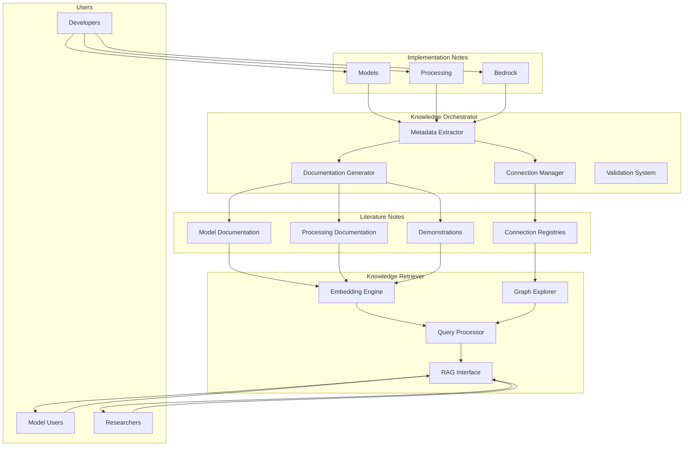

---
tags:
  - design
  - knowledge_management
  - architecture
  - zettelkasten
  - intelligent_agents
keywords:
  - knowledge orchestrator
  - knowledge retriever
  - dual-layer notes
  - implementation notes
  - literature notes
  - RAG
  - embedding models
  - knowledge graph
topics:
  - knowledge management system
  - intelligent knowledge retrieval
  - model catalog design
language: python
date of note: 2025-08-27
---

# Zettelkasten Knowledge Layer: Dual-Note Architecture with Intelligent Agents

## Purpose

This document defines the architecture for treating the repository as a comprehensive Zettelkasten knowledge system with dual-layer notes and intelligent agents. The design supports creating a universal catalog that standardizes model implementations and processing components to streamline model selection, comparison, and innovation.

## Dual-Layer Note Architecture

The repository implements a dual-layer Zettelkasten approach where each component exists as both implementation code and knowledge documentation:

### Layer 1: Implementation Notes (Source Code)

**Definition**: The actual Python implementation files that contain the executable code for models, processors, and utilities.

**Characteristics**:
- Atomic implementation files focused on single responsibilities
- Contains working code with carefully defined interfaces and dependencies
- Includes structured metadata headers that define connections and properties
- Self-contained implementation with clear boundaries

**Location**: Primary source code directories
- `src/models/`
- `src/processing/`
- `src/bedrock/`

**Example**:
```python
"""
---
component_type: model
framework: lightning
task: text_classification
connections:
  requires:
    - "processing.text.bert_tokenize_processor.BertTokenizeProcessor"
---
"""

class BertClassifier(LightningModule):
    """Implementation of BERT classifier."""
    # Actual implementation code
```

### Layer 2: Literature Notes (Knowledge Documentation)

**Definition**: Markdown documentation that summarizes, contextualizes, and connects implementation components.

**Characteristics**:
- Summarizes implementation details in accessible language
- Explicitly documents connections between components
- Provides higher-level understanding and context
- Includes usage examples and best practices
- Explains design decisions and architectural considerations

**Location**:
- `slipbox/` directory
- `src/knowledge/demonstrations/`

**Example**:
```markdown
# BERT Classification Model

## Overview
This model implements a BERT-based text classifier using PyTorch Lightning.

## Related Components
- **Requires**: BertTokenizeProcessor
- **Alternative To**: TextCNN
- **Used In**: Buyer abuse detection pipeline

## Implementation Details
The implementation uses Hugging Face Transformers with a classification head.
Key features include...

## Usage Examples
```python
model = BertClassifier(config={...})
```


### Relationship Between Layers

The dual-layer architecture creates a bidirectional relationship:

1. **Implementation → Knowledge**: Source code serves as the authoritative implementation, while knowledge documentation provides context and explanation.

2. **Knowledge → Implementation**: Knowledge documentation helps users understand and discover implementations, guiding appropriate use.

3. **Synchronization**: Changes to implementation should be reflected in knowledge documentation and vice versa, maintained by the Knowledge Orchestrator.

## Intelligent Agents

Two specialized agents maintain and facilitate access to the knowledge system:

### 1. Knowledge Orchestrator

**Purpose**: Maintain the knowledge system by organizing, connecting, and validating knowledge components.

**Responsibilities**:
- Monitor new code additions and updates
- Extract metadata and identify connections between components
- Maintain connection registries
- Generate and update knowledge documentation
- Ensure consistency between implementation and knowledge layers
- Validate connections and relationships

**Implementation Components**:

#### Metadata Extractor

```python
class MetadataExtractor:
    """Extracts structured metadata from Python source files."""
    
    def extract_from_file(self, file_path: str) -> dict:
        """Extract metadata from a Python file's docstring."""
        with open(file_path, 'r') as f:
            content = f.read()
            
        # Extract docstring between triple quotes
        docstring_match = re.search(r'"""(.*?)"""', content, re.DOTALL)
        if not docstring_match:
            return {}
            
        docstring = docstring_match.group(1)
        
        # Extract YAML metadata between --- markers
        metadata_match = re.search(r'---\s*(.*?)\s*---', docstring, re.DOTALL)
        if not metadata_match:
            return {}
            
        metadata_yaml = metadata_match.group(1)
        try:
            return yaml.safe_load(metadata_yaml)
        except Exception:
            return {}
```

#### Connection Registry Manager

```python
class ConnectionRegistryManager:
    """Manages connection registries between components."""
    
    def __init__(self, registry_dir: str):
        self.registry_dir = Path(registry_dir)
        self.registries = self._load_registries()
    
    def _load_registries(self) -> dict:
        """Load all connection registry files."""
        registries = {}
        for file_path in self.registry_dir.glob('*.yaml'):
            with open(file_path, 'r') as f:
                registry = yaml.safe_load(f)
                registries[file_path.stem] = registry
        return registries
    
    def add_connection(self, 
                      source_component: str, 
                      target_component: str,
                      relationship_type: str,
                      registry_type: str,
                      description: str = None):
        """Add a connection between components to the appropriate registry."""
        # Implementation details
```

#### Documentation Generator

```python
class DocumentationGenerator:
    """Generates knowledge documentation from implementation files."""
    
    def generate_for_component(self, 
                              component_path: str, 
                              output_path: str,
                              connection_registry: ConnectionRegistryManager):
        """Generate documentation for a specific component."""
        # Extract metadata, code structure, and connections
        # Generate markdown documentation
        # Save to output path
```

#### Orchestration Workflow

```python
class KnowledgeOrchestrator:
    """Main orchestrator that coordinates knowledge management activities."""
    
    def __init__(self, 
                repo_root: str,
                connection_registry_dir: str,
                knowledge_dir: str):
        self.repo_root = Path(repo_root)
        self.connection_manager = ConnectionRegistryManager(connection_registry_dir)
        self.metadata_extractor = MetadataExtractor()
        self.doc_generator = DocumentationGenerator()
        self.knowledge_dir = Path(knowledge_dir)
    
    def process_new_component(self, component_path: str):
        """Process a new or updated component."""
        # Extract metadata
        metadata = self.metadata_extractor.extract_from_file(component_path)
        
        # Update connection registry
        self._update_connections(component_path, metadata)
        
        # Generate or update documentation
        relative_path = Path(component_path).relative_to(self.repo_root)
        doc_path = self.knowledge_dir / f"{relative_path.stem}.md"
        self.doc_generator.generate_for_component(
            component_path, 
            doc_path,
            self.connection_manager
        )
    
    def validate_knowledge_system(self):
        """Validate the entire knowledge system for consistency."""
        # Check for broken connections
        # Verify documentation exists for all components
        # Ensure metadata is valid
```

### 2. Knowledge Retriever

**Purpose**: Enable intelligent search and discovery of knowledge components through advanced retrieval techniques.

**Responsibilities**:
- Index implementation code and knowledge documentation
- Process natural language queries to find relevant components
- Recommend related components based on context
- Support exploration of the component knowledge graph
- Facilitate innovation by surfacing relevant implementations

**Implementation Components**:

#### Embedding Engine

```python
class KnowledgeEmbeddingEngine:
    """Creates and stores embeddings for knowledge components."""
    
    def __init__(self, model_name: str = "text-embedding-ada-002"):
        self.model = SentenceTransformer(model_name)
        self.embeddings_db = {}
        self.component_index = {}
    
    def embed_component(self, component_id: str, content: str):
        """Create and store embeddings for a component."""
        # Create chunked embeddings for longer content
        chunks = self._chunk_content(content)
        embeddings = [self.model.encode(chunk) for chunk in chunks]
        
        # Store in database
        self.embeddings_db[component_id] = embeddings
        self.component_index[component_id] = {
            'chunks': chunks,
            'embedding_ids': [f"{component_id}_{i}" for i in range(len(chunks))]
        }
    
    def search(self, query: str, top_k: int = 5) -> list[dict]:
        """Search for components matching the query."""
        query_embedding = self.model.encode(query)
        
        # Calculate similarity with all stored embeddings
        results = []
        for component_id, embeddings in self.embeddings_db.items():
            for i, embedding in enumerate(embeddings):
                similarity = cosine_similarity([query_embedding], [embedding])[0][0]
                chunk_id = f"{component_id}_{i}"
                results.append({
                    'component_id': component_id,
                    'chunk_id': chunk_id,
                    'similarity': similarity,
                    'text': self.component_index[component_id]['chunks'][i]
                })
        
        # Return top results
        results.sort(key=lambda x: x['similarity'], reverse=True)
        return results[:top_k]
```

#### Knowledge Graph Explorer

```python
class KnowledgeGraphExplorer:
    """Explores the knowledge graph of connected components."""
    
    def __init__(self, connection_registry_manager: ConnectionRegistryManager):
        self.registry_manager = connection_registry_manager
        self.graph = self._build_graph()
    
    def _build_graph(self) -> nx.DiGraph:
        """Build a directed graph from connection registries."""
        G = nx.DiGraph()
        
        # Add nodes and edges from connection registries
        for registry_name, registry in self.registry_manager.registries.items():
            for source, data in registry.get('nodes', {}).items():
                G.add_node(source, **data.get('metadata', {}))
                
                for rel_type, connections in data.get('connections', {}).items():
                    for conn in connections:
                        target = conn['component']
                        G.add_edge(
                            source, 
                            target, 
                            relationship=rel_type,
                            description=conn.get('description', '')
                        )
        
        return G
    
    def find_related_components(self, 
                               component_id: str, 
                               relationship_type: str = None,
                               max_depth: int = 1) -> list[dict]:
        """Find components related to the specified component."""
        if component_id not in self.graph:
            return []
        
        results = []
        
        # For direct relationships (depth=1)
        for _, target, data in self.graph.out_edges(component_id, data=True):
            if relationship_type is None or data['relationship'] == relationship_type:
                results.append({
                    'component_id': target,
                    'relationship': data['relationship'],
                    'description': data.get('description', ''),
                    'depth': 1
                })
        
        # Add deeper relationships if requested
        if max_depth > 1:
            # Implementation for multi-hop traversal
            pass
            
        return results
    
    def recommend_components(self, 
                           context: dict,
                           component_type: str = None,
                           limit: int = 5) -> list[dict]:
        """Recommend components based on context."""
        # Implementation for context-aware recommendations
        pass
```

#### Query Processor

```python
class KnowledgeQueryProcessor:
    """Processes natural language queries against the knowledge system."""
    
    def __init__(self, 
                embedding_engine: KnowledgeEmbeddingEngine,
                graph_explorer: KnowledgeGraphExplorer):
        self.embedding_engine = embedding_engine
        self.graph_explorer = graph_explorer
    
    def process_query(self, query: str) -> dict:
        """Process a natural language query and return relevant results."""
        # Determine query intent (search, exploration, recommendation)
        intent = self._determine_intent(query)
        
        if intent == 'search':
            # Semantic search for components
            results = self.embedding_engine.search(query)
            return {
                'type': 'search_results',
                'results': results
            }
        
        elif intent == 'explore':
            # Extract component to explore
            component = self._extract_component_from_query(query)
            if component:
                related = self.graph_explorer.find_related_components(component)
                return {
                    'type': 'exploration_results',
                    'component': component,
                    'related': related
                }
        
        elif intent == 'recommend':
            # Extract context for recommendations
            context = self._extract_context_from_query(query)
            recommendations = self.graph_explorer.recommend_components(context)
            return {
                'type': 'recommendation_results',
                'context': context,
                'recommendations': recommendations
            }
            
        # Default to search if intent unclear
        return {
            'type': 'search_results',
            'results': self.embedding_engine.search(query)
        }
```

#### RAG-Based Knowledge Interface

```python
class RAGKnowledgeInterface:
    """Retrieval-Augmented Generation interface to the knowledge system."""
    
    def __init__(self, 
                query_processor: KnowledgeQueryProcessor,
                llm_model: str = "gpt-4"):
        self.query_processor = query_processor
        self.llm = LLMClient(model=llm_model)
    
    def ask(self, question: str) -> str:
        """Ask a question about the knowledge system."""
        # Process query to retrieve relevant knowledge
        query_results = self.query_processor.process_query(question)
        
        # Format context from retrieved results
        context = self._format_context(query_results)
        
        # Generate response using RAG
        prompt = f"""
        Based on the following information from our model catalog:
        
        {context}
        
        Answer the following question:
        {question}
        
        Provide specific examples and references to components when relevant.
        """
        
        response = self.llm.generate(prompt)
        return response
    
    def _format_context(self, query_results: dict) -> str:
        """Format retrieved results as context for the LLM."""
        # Implementation to format different types of query results
        pass
```

## Integration with Repository Structure

The dual-layer architecture and intelligent agents integrate with the repository structure as follows:

### Directory Structure

```
src/
├── models/                # Implementation notes - Models
├── processing/            # Implementation notes - Processing
├── bedrock/               # Implementation notes - Bedrock
├── knowledge/             # Knowledge system components
│   ├── demonstrations/    # Component demonstrations (literature notes)
│   ├── connections/       # Connection registries
│   ├── orchestrator/      # Knowledge Orchestrator implementation
│   └── retriever/         # Knowledge Retriever implementation
└── utils/                 # Shared utilities

slipbox/                   # Literature notes (documentation)
├── models/                # Model documentation
├── processing/            # Processing documentation
└── knowledge/             # Knowledge system documentation
```

### Workflow Integration

1. **Development Workflow**:
   - Developer creates or updates a component in `src/`
   - Knowledge Orchestrator detects changes and:
     - Extracts metadata from the updated file
     - Updates connection registries
     - Generates or updates documentation
   - Knowledge Retriever indexes the new content

2. **Discovery Workflow**:
   - User queries for components with specific capabilities
   - Knowledge Retriever searches and returns relevant results
   - User explores connections through Knowledge Graph
   - Knowledge interface provides context and explanations

3. **Innovation Workflow**:
   - User describes a problem to solve
   - Knowledge Retriever recommends relevant components
   - Knowledge Orchestrator shows how components can be connected
   - User builds on existing components to create new solutions

## Application of Core Design Principles

The knowledge layer architecture implements the core design principles as follows:

### 1. Single Source of Truth

- Implementation code is the single source of truth for behavior
- Connection registries are the single source of truth for relationships
- Component metadata is the single source of truth for component properties
- Literature notes reference implementation rather than duplicating details

```python
# Example of Single Source of Truth for connections
# src/knowledge/connections/text_models.yaml - The ONE place relationships are defined

nodes:
  bert_model:
    file: "src/models/lightning/bert.py"
    connections:
      requires:
        - component: "bert_tokenize_processor"
          relationship: "requires"
          description: "Provides tokenized input for BERT"
```

### 2. Declarative Over Imperative

- Component metadata uses declarative YAML to define properties and connections
- Connection registries declare relationships without implementation details
- Knowledge Retriever queries express what to find, not how to find it
- Orchestration workflows are defined declaratively through configurations

```python
# Example of Declarative Knowledge Definition
# Component metadata in docstring

"""
---
component_type: model
framework: lightning
task: text_classification
connections:
  requires:
    - "processing.text.bert_tokenize_processor.BertTokenizeProcessor"
---
"""
```

### 3. Type-Safe Specifications

- Component metadata follows a strict schema with validation
- Connection registry entries use strongly-typed enums for relationship types
- Knowledge Orchestrator validates connections against defined interfaces
- Knowledge Retriever uses typed query interfaces

```python
# Example of Type-Safe Knowledge Definitions
from enum import Enum, auto
from pydantic import BaseModel, Field

class ComponentType(Enum):
    MODEL = auto()
    PROCESSOR = auto()
    UTILITY = auto()

class ConnectionType(Enum):
    REQUIRES = auto()
    COMPATIBLE_WITH = auto()
    ALTERNATIVE_TO = auto()
    EXTENDS = auto()

class ConnectionDefinition(BaseModel):
    source_component: str
    target_component: str
    relationship: ConnectionType
    description: str = None
```

### 4. Explicit Over Implicit

- Connections between components are explicitly defined in registries
- Component dependencies are explicitly declared in metadata
- Knowledge Orchestrator explicitly generates documentation from implementations
- Knowledge queries explicitly specify intent and context

```python
# Example of Explicit Knowledge Connections

# In implementation file metadata
"""
connections:
  requires:
    - component: "bert_tokenize_processor"
      reason: "Provides tokenized input for BERT model"
"""

# In connection registry
nodes:
  bert_model:
    connections:
      requires:
        - component: "bert_tokenize_processor"
          description: "Provides tokenized input for BERT model"
```

## Benefits of the Dual-Layer Knowledge Architecture

The architecture provides several key benefits:

1. **Knowledge Preservation**: Implementation details and context are preserved together, preventing loss of institutional knowledge.

2. **Enhanced Discovery**: Intelligent retrieval makes finding appropriate components easier, reducing duplication.

3. **Consistent Implementation**: Standardized patterns and connections ensure consistency across implementations.

4. **Innovation Support**: Knowledge connections highlight opportunities for new combinations and approaches.

5. **Streamlined Model Selection**: Comprehensive knowledge facilitates direct comparison of model capabilities.

6. **Self-Documenting System**: Documentation stays synchronized with implementation through orchestration.

## Visual Representation



## Conclusion

The dual-layer Zettelkasten architecture with intelligent agents creates a comprehensive knowledge system that standardizes model and processing implementations while facilitating discovery, comparison, and innovation. By treating the entire repository as a knowledge base with distinct implementation and literature notes, we create a system that preserves both working code and the context needed to understand and extend it.

The Knowledge Orchestrator ensures that the system remains synchronized and valid, while the Knowledge Retriever enables intelligent access to the accumulated knowledge. Together, they transform the repository from a collection of code into a living knowledge system that grows more valuable over time as connections emerge and expand.

## Related Concepts

- **Knowledge Graphs**: Graph-based representation of knowledge domains and their interrelationships
- **RAG (Retrieval-Augmented Generation)**: Using retrieved context to improve language model responses
- **Digital Gardens**: Personal knowledge management systems with interconnected notes
- **Semantic Search**: Search based on meaning rather than lexical matching

## Cross-References

- [Zettelkasten Knowledge Management Principles](zettelkasten_knowledge_management_principles.md)
- [Core Design Principles](core_design_principles.md)
- [Repository Structure Design](zettelkasten_repository_structure_design.md)
