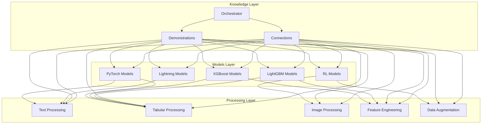

---
tags:
  - design
  - architecture
  - knowledge_management
  - repository_structure
  - zettelkasten
keywords:
  - repository organization
  - Zettelkasten principles
  - model catalog
  - knowledge orchestration
  - atomicity
  - connectivity
  - emergent organization
topics:
  - repository architecture
  - knowledge management system
  - model catalog design
language: python
date of note: 2025-08-27
---

# Zettelkasten-Inspired ML Model Catalog: Repository Structure Design

## Purpose

This document outlines the architectural design for restructuring the BuyerAbuseNLP repository using Zettelkasten knowledge management principles. The goal is to create a flexible, scalable model catalog that supports multiple machine learning frameworks while maintaining clear connections between components.

## Core Design Principles

### 1. Atomicity in Component Design

**Definition**: Each file should contain a single coherent concept or component.

**Implementation**:
- Individual model implementations focused on a single algorithm/approach
- Processing components with single responsibilities
- Utilities that perform specific functions

**Benefits**:
- **Reusability**: Components can be used in multiple contexts
- **Clarity**: Single-purpose components are easier to understand
- **Maintainability**: Smaller files with focused functionality

### 2. Explicit Connectivity Between Components

**Definition**: Components should have explicit connections rather than implicit relationships.

**Implementation**:
- Connection registries documenting relationships
- Cross-reference metadata in file headers
- Knowledge orchestration layer for connection management

**Benefits**:
- **Discoverability**: Relationships between components are clear
- **Flexibility**: Connections can be updated without changing code
- **Knowledge Graph**: Enables visualization and navigation of relationships

### 3. Emergent Organization Over Rigid Categories

**Definition**: Structure should emerge from content relationships rather than predefined hierarchies.

**Implementation**:
- Flat organization within subsystems
- Tag-based classification in metadata
- Multiple connection types between components

**Benefits**:
- **Adaptability**: Structure evolves naturally with content
- **Multiple Views**: Components can be viewed through different organizational lenses
- **Future-proofing**: No need to reorganize as requirements change

## Repository Structure Design

```
src/
├── models/                # Atomic model implementations (replacing lightning/)
│   ├── pytorch/          # Native PyTorch implementations
│   │   └── components/   # Reusable PyTorch components (e.g., attention mechanisms)
│   ├── lightning/        # PyTorch Lightning implementations
│   ├── xgboost/          # XGBoost models
│   ├── lightgbm/         # LightGBM models
│   └── rl/               # Reinforcement learning models
│
├── processing/           # Data processing components
│   ├── base/             # Base processors and abstractions
│   ├── text/             # Text processing components
│   ├── tabular/          # Tabular data processing
│   ├── image/            # Image processing
│   ├── augmentation/     # Data augmentation techniques
│   └── feature/          # Feature engineering components
│
├── bedrock/              # AWS Bedrock implementation (unchanged)
│
├── knowledge/            # Knowledge management layer (new)
│   ├── demonstrations/   # Demonstration layer connecting implementations
│   ├── connections/      # Explicit connections between components
│   └── orchestrator/     # Knowledge orchestration and retrieval
│
└── utils/                # Shared utilities
```

## Component Design Patterns

### 1. Model Component Pattern

**Purpose**: Define atomic model implementations with explicit metadata.

**Structure**:
```python
"""
---
component_type: model
framework: lightning
task: text_classification
connections:
  requires:
    - "processing.text.bert_tokenize_processor.BertTokenizeProcessor"
  compatible_with:
    - "processing.tabular.numerical_imputation_processor.NumericalImputationProcessor"
  alternatives:
    - "models.lightning.pl_multimodal_bert.MultimodalBert"
---
"""

import torch
import lightning.pytorch as pl

class TextClassificationModel(pl.LightningModule):
    """
    Atomic model implementation for text classification.
    """
    # Implementation...
```

### 2. Processing Component Pattern

**Purpose**: Define atomic data processing components with explicit metadata.

**Structure**:
```python
"""
---
component_type: processor
data_type: text
stage: preprocessing
connections:
  used_by:
    - "models.lightning.pl_bert.BertModel"
    - "models.lightning.pl_text_cnn.TextCNN"
  alternatives:
    - "processing.text.gensim_tokenize_processor.GensimTokenizeProcessor"
---
"""

from ..base.processors import Processor

class BertTokenizeProcessor(Processor):
    """
    BERT tokenization processor for text data.
    """
    # Implementation...
```

### 3. Connection Registry Pattern

**Purpose**: Define explicit relationships between components.

**Structure**:
```yaml
# knowledge/connections/text_models.yaml
nodes:
  pl_bert:
    file: "models/lightning/pl_bert.py"
    connections:
      preprocessing:
        - component: "bert_tokenize_processor"
          relationship: "requires"
          description: "Tokenizes text for BERT model input"
      alternatives:
        - component: "pl_multimodal_bert"
          relationship: "alternative_approach"
          description: "Multimodal version that also handles tabular data"
```

### 4. Knowledge Orchestrator Pattern

**Purpose**: Manage and retrieve connections between components.

**Structure**:
```python
"""
---
component_type: orchestrator
purpose: knowledge_retrieval
---
"""

class KnowledgeOrchestrator:
    """
    Manages retrieval and visualization of component relationships.
    """
    
    def get_related_components(self, component_id, relationship_type=None):
        """Find components related to the specified component."""
        # Implementation...
    
    def generate_knowledge_graph(self, root_component=None, depth=2):
        """Generate a visual representation of component relationships."""
        # Implementation...
    
    def find_compatible_processors(self, model_id):
        """Find processors compatible with a specific model."""
        # Implementation...
```

## Integration With Existing Repository

### Current Structure
```
src/
├── lightning/         # PyTorch Lightning models
├── processing/        # Data processing components
└── bedrock/          # AWS Bedrock implementation
```

### Transition Strategy
1. Create new directory structure while maintaining the existing one
2. Gradually migrate components to the new structure
3. Update imports and references
4. Add connection metadata to components
5. Implement knowledge orchestration layer

### Backward Compatibility Considerations
- Provide import compatibility layers during transition
- Maintain existing API interfaces while enhancing internals
- Document migration paths for dependent code

## Knowledge Layer Design

### 1. Demonstrations Layer

**Purpose**: Provide comprehensive documentation of component implementations and relationships.

**Implementation**:
- Markdown documentation in `knowledge/demonstrations/`
- Jupyter notebooks showing component usage
- Visual diagrams of relationships

**Content Example**:
```markdown
# BERT Model Implementation

## Model Overview
- Text classification using BERT embeddings
- Implemented in PyTorch Lightning

## Related Components
- **Requires**: BertTokenizeProcessor
- **Compatible With**: NumericalImputationProcessor
- **Alternatives**: MultimodalBert

## Implementation Details
[Code walkthrough with explanations]

## Usage Examples
[Code snippets showing common use cases]
```

### 2. Connections Layer

**Purpose**: Store explicit relationship data between components.

**Implementation**:
- YAML/JSON files in `knowledge/connections/`
- Typed relationship definitions
- Bidirectional connection mapping

**Benefits**:
- Queryable relationship data
- Automated validation of connections
- Support for visualization tools

### 3. Orchestrator Layer

**Purpose**: Provide tools for navigating and retrieving knowledge connections.

**Implementation**:
- Python API for querying component relationships
- Visualization tools for knowledge graphs
- Search functionality across components and connections

**Capabilities**:
- Find compatible components
- Generate dependency graphs
- Identify alternative implementations
- Trace data flow between components

## Visual Representation of Architecture



## Technical Implementation Guidelines

### 1. File Organization

- Keep files small and focused on single concepts
- Use descriptive filenames that reflect component purpose
- Group related components by functional area, not by implementation details

### 2. Metadata Format

- Use structured comments at the top of each file
- Include component type, purpose, and connections
- Format as YAML for easy parsing

### 3. Connection Definitions

- Define bidirectional connections (A → B and B → A)
- Include relationship types and descriptions
- Support multiple relationship categories

### 4. Import Structure

- Import components by specific path rather than generic imports
- Avoid circular dependencies
- Use relative imports within subsystems

### 5. Documentation Integration

- Link component documentation to implementation
- Include usage examples in documentation
- Provide visual diagrams where appropriate

## Conclusion

This Zettelkasten-inspired repository structure provides a flexible, scalable architecture for a machine learning model catalog. By embracing atomicity, explicit connectivity, and emergent organization, the design supports organic growth while maintaining clear relationships between components. The addition of a dedicated knowledge management layer enhances discovery and understanding of the complex relationships within the ML ecosystem.

The design directly supports the project's goals of expanding beyond PyTorch Lightning models to include other frameworks and providing a central catalog with suitable access patterns. By applying Zettelkasten principles, the structure creates a knowledge management system that connects models with processing components, models with other models, and processing components with other processing components.

## Related Concepts

- **Component-based architecture**: Design built around independent components with well-defined interfaces
- **Knowledge graphs**: Graph structures representing knowledge domains and their interrelationships
- **Metadata-driven design**: System organization driven by component metadata rather than rigid structure
- **Information architecture**: Design and organization of information environments

## Cross-References

This document connects to other design documents in this knowledge system:

- **[Zettelkasten Knowledge Management Principles](zettelkasten_knowledge_management_principles.md)** - Foundational principles applied in this design
- **[Pipeline Catalog Design](pipeline_catalog_design.md)** (if exists) - Related catalog organization principles

These cross-references demonstrate how the theoretical Zettelkasten principles are practically implemented in this repository design.
