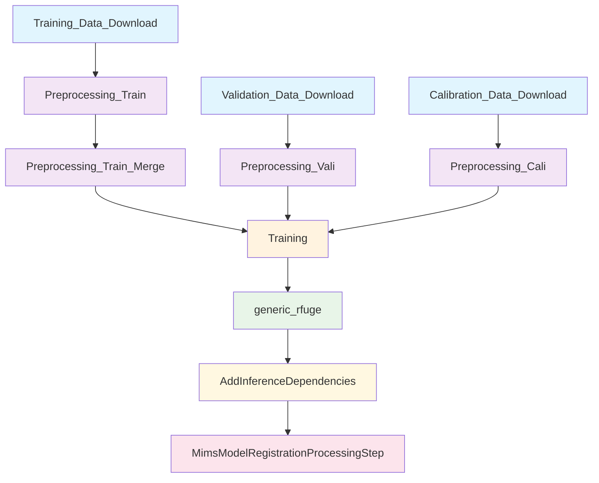

---
tags:
  - analysis
  - temporal-self-attention
  - sagemaker-pipeline
  - dag-analysis
  - pipeline-orchestration
  - fraud-detection
keywords:
  - TSA pipeline
  - SageMaker steps
  - pipeline DAG
  - step dependencies
  - script mapping
  - workflow orchestration
topics:
  - machine learning pipeline
  - step-by-step analysis
  - dependency mapping
  - pipeline architecture
  - workflow design
language: python
date of note: 2025-10-20
---

# TSA SageMaker Pipeline DAG Analysis

## Executive Summary

This analysis provides a comprehensive examination of the **NA TSA Suspect Queue Model** SageMaker pipeline, including its Directed Acyclic Graph (DAG) structure, step-by-step breakdown, and detailed script analysis. The pipeline implements an end-to-end machine learning workflow for fraud detection using Temporal Self-Attention models.

## Pipeline DAG Structure

### Visual DAG Representation



### Pipeline Execution Phases

1. **Data Loading Phase** (Parallel): Steps A, B, C
2. **Preprocessing Phase** (Parallel + Sequential): Steps D, E, F → G
3. **Training Phase**: Step H
4. **Post-Processing Phase** (Sequential): Steps I → J → K

## Step-by-Step Analysis

### Phase 1: Data Loading Steps

#### Step 1: Training_Data_Download
- **Type**: `CradleDataLoadingStep`
- **Purpose**: Downloads training dataset from Cradle data source
- **Script**: Framework-provided (no custom script)
- **Dependencies**: None
- **Parallelization**: Runs independently

**Main Functionalities**:
- Connects to Cradle data loading service
- Downloads training data based on configured filters
- Validates data integrity and format
- Stores data in S3 for downstream processing

**Expected Input**:
- Cradle data source configuration
- Date range filters
- Data selection criteria

**Expected Output**:
- Raw training data files in S3
- Data manifest and metadata
- Validation reports

#### Step 2: Validation_Data_Download
- **Type**: `CradleDataLoadingStep`
- **Purpose**: Downloads validation dataset from Cradle data source
- **Script**: Framework-provided (no custom script)
- **Dependencies**: None
- **Parallelization**: Runs independently

**Main Functionalities**:
- Identical to training data download but for validation set
- Ensures temporal separation from training data
- Applies validation-specific filters

**Expected Input**:
- Cradle data source configuration
- Validation date range filters
- Data selection criteria

**Expected Output**:
- Raw validation data files in S3
- Data manifest and metadata
- Validation reports

#### Step 3: Calibration_Data_Download
- **Type**: `CradleDataLoadingStep`
- **Purpose**: Downloads calibration dataset for probability score mapping
- **Script**: Framework-provided (no custom script)
- **Dependencies**: None
- **Parallelization**: Runs independently

**Main Functionalities**:
- Downloads calibration data for score calibration
- Ensures proper temporal ordering relative to training/validation
- Applies calibration-specific data filters

**Expected Input**:
- Cradle data source configuration
- Calibration date range filters
- Data selection criteria

**Expected Output**:
- Raw calibration data files in S3
- Data manifest and metadata
- Validation reports

### Phase 2: Preprocessing Steps

#### Step 4: Preprocessing_Train
- **Type**: `ProcessingStep` with `SKLearnProcessor`
- **Purpose**: Preprocesses training data into model-ready tensors
- **Script**: `scripts/preprocess_train_na.py`
- **Dependencies**: Training_Data_Download
- **Instance**: `ml.r5.24xlarge` (2 instances, 2048GB storage)

**Main Functionalities**:
- Orchestrates chunked processing of training data
- Calls `chunk_processing()` from `preprocess_functions_na.py`
- Processes 60 chunks in parallel for memory efficiency
- Applies data validation and transformation

**Modules Defined/Imported**:
```python
from preprocess_functions_na import chunk_processing
```

**Operations Completed**:
1. **Data Loading**: Loads raw training data from S3
2. **Chunk Processing**: Divides data into 60 manageable chunks
3. **Parallel Processing**: Processes chunks using multiprocessing
4. **Data Transformation**: 
   - Temporal sequence ordering
   - Categorical feature encoding using `cat_to_index_na.json`
   - Numerical feature scaling using `preprocessor_na.pkl`
   - Missing value imputation using `default_value_dict_na.json`
   - Sequence padding/truncation to length 51
   - Time delta computation
5. **Tensor Generation**: Creates PyTorch-compatible tensors
6. **Output Serialization**: Saves processed tensors to S3

**Expected Input**:
- Raw training data files from Cradle
- Configuration files: `cat_to_index_na.json`, `preprocessor_na.pkl`, `default_value_dict_na.json`
- Processing scripts and dependencies

**Expected Output**:
- Processed training tensors (X_seq_cat_cid, X_seq_num_cid, X_seq_cat_ccid, X_seq_num_ccid, X_num, Y)
- Processing metadata and statistics
- Chunk-level processed data files

#### Step 5: Preprocessing_Vali
- **Type**: `ProcessingStep` with `SKLearnProcessor`
- **Purpose**: Preprocesses validation data for model evaluation
- **Script**: `scripts/preprocess_vali_na.py`
- **Dependencies**: Validation_Data_Download
- **Instance**: `ml.r5.24xlarge` (1 instance, 2048GB storage)

**Main Functionalities**:
- Similar to training preprocessing but for validation data
- Uses consistent preprocessing parameters from training
- Processes validation data in chunks for memory efficiency

**Modules Defined/Imported**:
```python
from preprocess_functions_na import chunk_processing
```

**Operations Completed**:
1. **Data Loading**: Loads raw validation data
2. **Consistent Preprocessing**: Applies same transformations as training
3. **Validation-Specific Processing**: Handles validation data characteristics
4. **Tensor Generation**: Creates validation tensors
5. **Quality Assurance**: Validates preprocessing consistency

**Expected Input**:
- Raw validation data files
- Same configuration files as training preprocessing
- Processing scripts and dependencies

**Expected Output**:
- Processed validation tensors with same structure as training
- Validation preprocessing statistics
- Quality assurance reports

#### Step 6: Preprocessing_Cali
- **Type**: `ProcessingStep` with `SKLearnProcessor`
- **Purpose**: Preprocesses calibration data for probability score mapping
- **Script**: `scripts/preprocess_cali_na.py`
- **Dependencies**: Calibration_Data_Download
- **Instance**: `ml.r5.24xlarge` (1 instance, 2048GB storage)

**Main Functionalities**:
- Preprocesses calibration data using consistent parameters
- Ensures calibration data maintains temporal relationships
- Prepares data for B-spline probability calibration

**Modules Defined/Imported**:
```python
from preprocess_functions_na import chunk_processing
```

**Operations Completed**:
1. **Data Loading**: Loads raw calibration data
2. **Consistent Preprocessing**: Applies identical transformations
3. **Calibration-Specific Handling**: Maintains score distribution properties
4. **Tensor Generation**: Creates calibration tensors
5. **Distribution Analysis**: Analyzes score distributions for calibration

**Expected Input**:
- Raw calibration data files
- Same configuration files as training/validation
- Processing scripts and dependencies

**Expected Output**:
- Processed calibration tensors
- Score distribution statistics
- Calibration preprocessing metadata

#### Step 7: Preprocessing_Train_Merge
- **Type**: `ProcessingStep` with `SKLearnProcessor`
- **Purpose**: Merges processed training chunks into unified datasets
- **Script**: `scripts/preprocess_train_na_merge.py`
- **Dependencies**: Preprocessing_Train
- **Instance**: `ml.r5.24xlarge` (1 instance, 2048GB storage)

**Main Functionalities**:
- Consolidates chunked training data into unified tensors
- Performs final data validation and consistency checks
- Optimizes data layout for distributed training

**Modules Defined/Imported**:
```python
from preprocess_functions_na import merge_chunks, validate_merged_data
```

**Operations Completed**:
1. **Chunk Collection**: Gathers all processed training chunks
2. **Data Merging**: Combines chunks into unified tensors
3. **Consistency Validation**: Ensures data integrity across chunks
4. **Memory Optimization**: Optimizes tensor layout for training
5. **Final Validation**: Performs comprehensive data quality checks

**Expected Input**:
- Processed training chunks from Preprocessing_Train
- Merge configuration parameters
- Validation scripts

**Expected Output**:
- Unified training tensors ready for distributed training
- Merged dataset statistics
- Data quality validation reports

### Phase 3: Training Step

#### Step 8: Training
- **Type**: `TrainingStep` with `PyTorch` estimator
- **Purpose**: Trains the Two-Sequence MoE TSA model using distributed training
- **Script**: `scripts/train.py`
- **Dependencies**: Preprocessing_Train_Merge, Preprocessing_Vali, Preprocessing_Cali
- **Instance**: `ml.g5.48xlarge` (2 instances with distributed training)

**Main Functionalities**:
- Implements distributed data parallel training
- Trains Two-Sequence Mixture-of-Experts Temporal Self-Attention model
- Supports automatic mixed precision training
- Implements early stopping and model checkpointing

**Modules Defined/Imported**:
```python
from models import TwoSeqMoEOrderFeatureAttentionClassifier
from dataloaders import load_data_two_seq
from utilities import train, evaluation_single_seq, get_performance
from pytorchtools import EarlyStopping
import torch.distributed as dist
```

**Operations Completed**:
1. **Distributed Setup**: Initializes distributed training environment
2. **Data Loading**: Loads preprocessed training, validation, and calibration data
3. **Model Instantiation**: Creates TwoSeqMoEOrderFeatureAttentionClassifier
4. **Training Configuration**:
   - Optimizer: Adam with learning rate 5e-05
   - Scheduler: OneCycleLR with max learning rate 0.0005
   - Loss: CrossEntropyLoss
   - Batch size: 640
   - Max epochs: 100
   - Early stopping patience: 5
5. **Training Loop**:
   - Forward pass through both CID and CCID sequences
   - Attention mechanism computation
   - Loss computation and backpropagation
   - Gradient synchronization across GPUs
   - Validation evaluation
   - Early stopping monitoring
6. **Model Evaluation**: Comprehensive metrics computation (AUC, precision, recall)
7. **Model Saving**: Saves trained model and training artifacts
8. **Score Generation**: Generates scores on calibration data for percentile mapping

**Model Architecture Details**:
- **Input Features**: 109 categorical + 67 numerical sequence features + 297 engineered features
- **Sequence Length**: 51
- **Embedding Dimension**: 64
- **Attention Heads**: 1
- **Order Attention Layers**: 6
- **Feature Attention Layers**: 4
- **Feedforward Dimension**: 256

**Expected Input**:
- Processed training tensors (train, validation, calibration)
- Model hyperparameters
- Training configuration

**Expected Output**:
- Trained model artifacts (`isSmall_0_TwoSeqMoEOrderFeature.pt`)
- Training metrics and logs
- Percentile score mapping (`percentile_score.pkl`)
- Model evaluation results
- Calibration scores (`score_file.csv`, `tag_file.csv`)

### Phase 4: Post-Processing Steps

#### Step 9: generic_rfuge
- **Type**: `ProcessingStep` with `ScriptProcessor` (R)
- **Purpose**: Generates probability score calibration using B-spline regression
- **Script**: `scripts/generic_rfuge.r`
- **Dependencies**: Training
- **Instance**: `ml.m5.4xlarge` (1 instance, 64GB storage)

**Main Functionalities**:
- Implements monotonic B-spline regression for probability calibration
- Converts raw model scores to calibrated probabilities
- Generates B-spline parameters for inference

**Modules Defined/Imported**:
```r
library(splines)
library(quadprog)
library(glm2)
library(jsonlite)
library(dplyr)
```

**Operations Completed**:
1. **Model Artifact Extraction**: Extracts model.tar.gz from training step
2. **Data Loading**: Loads score_file.csv and tag_file.csv from training
3. **Data Validation**:
   - Minimum 1000 records requirement
   - Minimum 10 fraud cases requirement
   - Score range validation (0-1)
   - Tag range validation (0-1)
4. **Knot Selection**:
   - Adaptive knot selection based on data size
   - Quantile-based knot placement
   - Additional knot insertion for high-score regions
5. **Monotonic B-Spline Fitting**:
   - Degree 3 B-spline with monotonicity constraints
   - Quadratic programming optimization
   - P-spline regularization for numerical stability
   - Iterative reweighted least squares
6. **Model Validation**:
   - Coefficient stability checks
   - Prediction uniqueness validation
   - Mean squared error comparison
7. **Parameter Export**: Generates bspline_parameters.json

**Expected Input**:
- Trained model artifacts (model.tar.gz)
- Calibration scores (score_file.csv, tag_file.csv)
- R package dependencies

**Expected Output**:
- B-spline parameters (`bspline_parameters.json`)
- Calibration quality metrics
- Probability mapping function

#### Step 10: AddInferenceDependencies
- **Type**: `ProcessingStep` with `SKLearnProcessor`
- **Purpose**: Packages model with all inference dependencies for deployment
- **Script**: `scripts/mims_package_na.py`
- **Dependencies**: generic_rfuge
- **Instance**: `ml.m5.4xlarge` (1 instance, 100GB storage)

**Main Functionalities**:
- Consolidates all model artifacts and dependencies
- Creates deployment-ready model package
- Ensures inference environment consistency

**Modules Defined/Imported**:
```python
import shutil
import tarfile
from pathlib import Path
import os
import subprocess
```

**Operations Completed**:
1. **Directory Setup**: Creates packaging directory structure
2. **Model Artifact Collection**:
   - Extracts trained model (`isSmall_0_TwoSeqMoEOrderFeature.pt`)
   - Copies percentile score mapping (`percentile_score.pkl`)
   - Copies B-spline parameters (`bspline_parameters.json`)
   - Copies preprocessing artifacts (`preprocessor_na.pkl`)
3. **Code Dependencies**:
   - Model architecture (`models.py`, `basic_blocks.py`)
   - Attention mechanisms (`TemporalMultiheadAttentionDelta.py`)
   - MoE implementation (`mixture_of_experts.py`)
   - Parameter definitions (`params_na.py`)
   - Inference handler (`na_tsa_inference_handler.py`)
   - Data processing (`CategoricalTransformer.py`)
4. **Configuration Files**:
   - Categorical mappings (`cat_to_index_na.json`)
   - Default values (`default_value_dict_na.json`)
5. **Package Creation**: Creates compressed model package (`mims_model_na.tar.gz`)

**Expected Input**:
- Trained model artifacts from Training step
- B-spline parameters from generic_rfuge step
- Inference scripts and dependencies
- Configuration files

**Expected Output**:
- Complete model package (`mims_model_na.tar.gz`)
- Deployment-ready inference environment
- Package manifest and metadata

#### Step 11: MimsModelRegistrationProcessingStep
- **Type**: `MimsModelRegistrationProcessingStep`
- **Purpose**: Registers model in MIMS system for production deployment
- **Script**: Framework-provided (no custom script)
- **Dependencies**: AddInferenceDependencies
- **Instance**: Framework-managed

**Main Functionalities**:
- Registers model in Model Information Management System (MIMS)
- Performs automated model validation and testing
- Enables production deployment and monitoring

**Operations Completed**:
1. **Model Registration**: Registers model in MIMS registry
2. **Automated Testing**: Performs inference validation tests
3. **Deployment Preparation**: Prepares model for production deployment
4. **Monitoring Setup**: Configures model monitoring and alerting
5. **Version Management**: Manages model versioning and rollback capabilities

**Expected Input**:
- Complete model package from AddInferenceDependencies
- Model metadata and configuration
- Registration parameters

**Expected Output**:
- Registered model in MIMS system
- Model validation reports
- Deployment configuration
- Production-ready model endpoint

## Pipeline Dependencies and Data Flow

### Critical Path Analysis

**Longest Path**: 
Training_Data_Download → Preprocessing_Train → Preprocessing_Train_Merge → Training → generic_rfuge → AddInferenceDependencies → MimsModelRegistrationProcessingStep

**Parallel Execution Opportunities**:
1. **Data Loading**: All three data loading steps run in parallel
2. **Initial Preprocessing**: Training, validation, and calibration preprocessing run in parallel
3. **Training Dependencies**: Training step waits for all preprocessing to complete

### Resource Utilization

**Compute-Intensive Steps**:
- **Preprocessing Steps**: High memory usage (ml.r5.24xlarge, 2048GB)
- **Training Step**: GPU-intensive (ml.g5.48xlarge, distributed)
- **Other Steps**: Standard compute requirements

**Storage Requirements**:
- **Preprocessing**: 2048GB for large dataset processing
- **Training**: Standard storage for model artifacts
- **Packaging**: 100GB for model consolidation

### Data Lineage

```
Raw Data → Preprocessed Tensors → Trained Model → Calibrated Scores → Packaged Model → Registered Model
    ↓              ↓                    ↓              ↓                ↓              ↓
Cradle Data → PyTorch Tensors → Model Weights → B-spline Params → Deployment Package → Production Model
```

## Quality Assurance and Monitoring

### Data Quality Checks
- **Input Validation**: Comprehensive data validation at each preprocessing step
- **Consistency Checks**: Cross-step data consistency validation
- **Distribution Monitoring**: Score distribution analysis and validation

### Model Quality Assurance
- **Training Metrics**: AUC, precision, recall, F1-score monitoring
- **Early Stopping**: Prevents overfitting with patience-based stopping
- **Calibration Validation**: B-spline fitting quality assessment
- **Inference Testing**: Automated inference validation in MIMS

### Pipeline Monitoring
- **Step-Level Monitoring**: Individual step success/failure tracking
- **Resource Monitoring**: Compute and storage utilization tracking
- **Performance Metrics**: End-to-end pipeline execution time
- **Error Handling**: Comprehensive error reporting and alerting

## Scalability and Performance Considerations

### Horizontal Scaling
- **Data Loading**: Parallel data source access
- **Preprocessing**: Multi-instance processing with data sharding
- **Training**: Distributed data parallel across multiple GPUs
- **Post-Processing**: Independent step execution

### Vertical Scaling
- **Memory Optimization**: Chunked processing for large datasets
- **GPU Utilization**: Mixed precision training for memory efficiency
- **Storage Optimization**: Compressed data formats and efficient I/O

### Performance Optimizations
- **Caching**: Intermediate result caching between steps
- **Parallel Processing**: Multi-core utilization in preprocessing
- **Distributed Training**: Multi-GPU model training
- **Memory Management**: Efficient tensor operations and garbage collection

## Conclusion

The NA TSA Suspect Queue Model pipeline represents a sophisticated, production-ready machine learning workflow that effectively orchestrates data loading, preprocessing, training, and deployment of a complex temporal self-attention model. The pipeline's DAG structure ensures optimal resource utilization through parallel execution where possible while maintaining strict dependencies where required. The comprehensive quality assurance, monitoring, and scalability features make it suitable for production fraud detection applications.

The pipeline successfully addresses the challenges of:
1. **Large-scale data processing** through chunked and distributed processing
2. **Complex model training** with distributed GPU training and advanced optimization
3. **Production deployment** with comprehensive packaging and registration
4. **Quality assurance** through multi-level validation and monitoring
5. **Scalability** through horizontal and vertical scaling strategies

This analysis provides the foundation for understanding, maintaining, and extending the TSA pipeline for future enhancements and optimizations.
