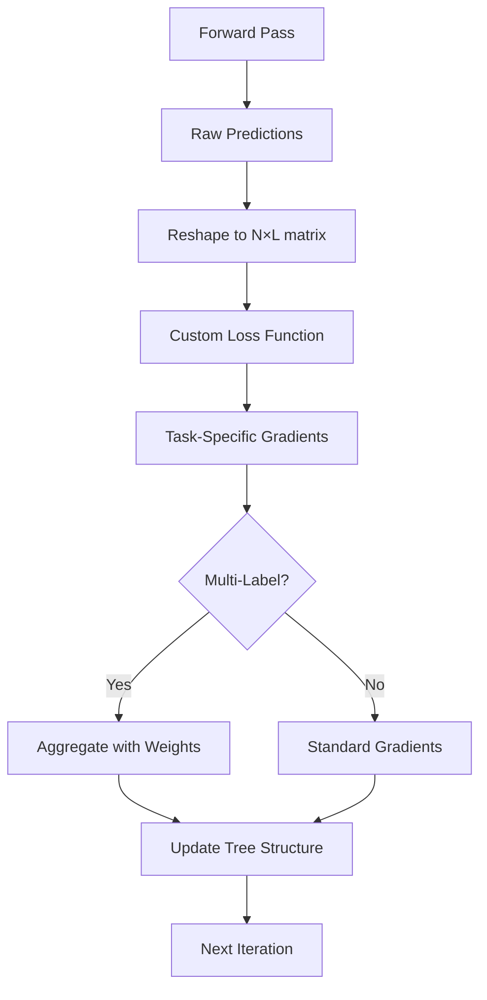
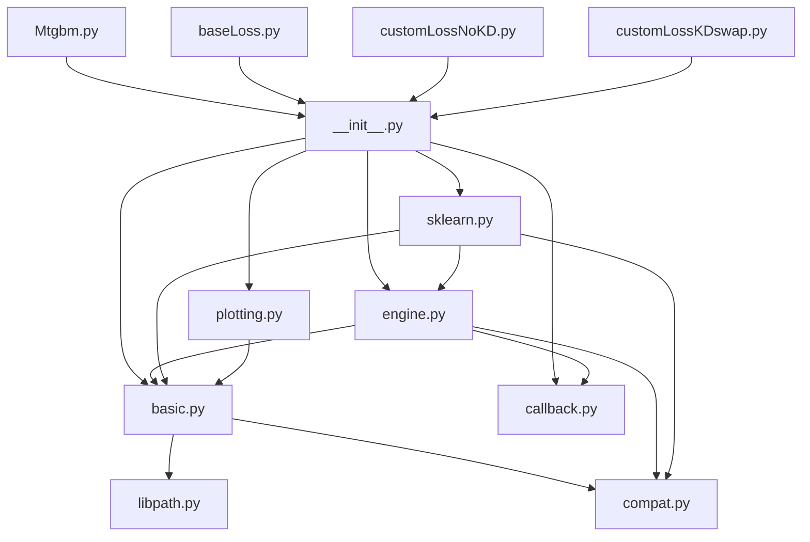

---
tags:
  - analysis
  - multi-task-learning
  - lightgbm
  - gradient-boosting
  - script-analysis
keywords:
  - lightgbmmt
  - multi-label learning
  - custom loss functions
  - gradient boosting trees
  - MTGBM
topics:
  - machine learning framework
  - multi-task boosting
  - script functionality analysis
  - dependency mapping
language: python
date of note: 2025-11-10
---

# LightGBMMT Multi-Task Implementation Analysis

## Executive Summary

This analysis examines the LightGBMMT (LightGBM Multi-Task) implementation located in `projects/cap_mtgbm/docker/lightgbmmt/`. LightGBMMT is a custom fork of Microsoft's LightGBM gradient boosting framework, modified to support multi-task/multi-label learning for the CAP project's MTGBM (Multi-Task Gradient Boosting Machine) model.

The implementation extends standard LightGBM by adding native support for training models with multiple output labels simultaneously, enabling shared tree structures across related tasks with custom loss functions for adaptive task weighting and knowledge distillation.

## Related Documents
- **[MTGBM Multi-Task Learning Design](../../1_design/mtgbm_multi_task_learning_design.md)** - Comprehensive MTGBM architecture and design
- **[Base MTGBM Model](../../projects/cap_mtgbm/docker/models/Mtgbm.py)** - Main MTGBM implementation using lightgbmmt

## Design Philosophy

### Core Enhancements Over Standard LightGBM

#### Multi-Label Support
- **Native Multi-Output**: Support for training with multiple labels per instance
- **Shared Tree Structures**: Single tree architecture that outputs multiple predictions
- **Label Coordination**: Synchronized training across related tasks

#### Custom Loss Integration
- **Flexible Loss Functions**: Support for custom multi-task objective functions
- **Gradient Aggregation**: Weighted combination of task-specific gradients
- **Dynamic Weighting**: Runtime adjustment of task importance

#### API Compatibility
- **Backward Compatible**: Maintains standard LightGBM API when `num_labels=1`
- **Seamless Integration**: Drop-in replacement for single-task scenarios
- **Extended Parameters**: Additional parameters for multi-task configuration

## Script Inventory and Classification

### Core Framework Scripts

#### 1. `__init__.py` - Package Initialization and Exports
**Purpose**: Defines the public API of the lightgbmmt package and manages imports.

**Key Exports**:
- `Dataset`: Multi-label dataset wrapper
- `Booster`: Multi-task boosting model
- `train`: Training function with custom loss support
- `cv`: Cross-validation with multi-task support
- Scikit-learn compatible classes: `LGBMModel`, `LGBMRegressor`, `LGBMClassifier`, `LGBMRanker`
- Callback functions: `early_stopping`, `print_evaluation`, `record_evaluation`, `reset_parameter`
- Plotting utilities: `plot_importance`, `plot_metric`, `plot_tree`

**Dependencies**: All core modules (`basic`, `engine`, `callback`, `sklearn`, `plotting`)

**Architecture Role**: Entry point for all lightgbmmt functionality, providing unified API access.

#### 2. `basic.py` - Core Data Structures and C API Wrapper
**Purpose**: Implements fundamental data structures (Dataset, Booster) and provides Python wrappers for LightGBM C API with multi-label extensions.

**Key Classes**:

**`Dataset`**:
- Multi-label data container for training and validation
- Label matrix support: `[N_samples, N_labels]` shape
- Synchronized feature/label management across tasks
- Memory-efficient data loading from various sources
- Categorical feature handling
- Reference dataset management for validation sets

**`Booster`**:
- Multi-task gradient boosting model
- `num_labels` parameter for multi-output configuration
- Custom objective function support via `fobj` parameter
- Multi-label gradient aggregation through `__boost()` method
- Prediction output: `[N_samples * N_labels]` flattened array
- Model persistence (save/load) with multi-label metadata

**`_InnerPredictor`**:
- Lightweight predictor for inference
- Multi-label prediction support
- Used for continued training and model serving

**Key Multi-Label Enhancements**:
```python
# In Booster.__init__()
if "num_labels" in params and params["num_labels"] > 1:
    if not "tree_learner" in params and params["tree_learner"] != "serial2":
        raise ValueError("tree_learner should be serial2")

if "num_labels" not in params:
    params["num_labels"] = 1
elif params["num_labels"] != train_set.label.shape[1]:
    raise ValueError("num_labels {} should be equal to train_set shape {}".format(
        params["num_labels"], train_set.label.shape[1]))
self.num_labels__ = params["num_labels"]
```

**Multi-Label Gradient Boosting**:
```python
# In Booster.__boost()
def __boost(self, grad, hess, grad2=None, hess2=None):
    """Boost Booster for one iteration with customized gradient statistics."""
    if "num_labels" in self.params and self.params["num_labels"] > 1:
        grad2 = list_to_1d_numpy(grad2, name="gradient")
        hess2 = list_to_1d_numpy(hess2, name="hessian")
        _safe_call(_LIB.LGBM_BoosterUpdateOneIterCustom2(
            self.handle,
            grad.ctypes.data_as(ctypes.POINTER(ctypes.c_float)),
            hess.ctypes.data_as(ctypes.POINTER(ctypes.c_float)),
            grad2.ctypes.data_as(ctypes.POINTER(ctypes.c_float)),
            hess2.ctypes.data_as(ctypes.POINTER(ctypes.c_float)),
            ctypes.byref(is_finished),
        ))
```

**C API Integration**:
- `_load_lib()`: Loads compiled LightGBM library
- `_safe_call()`: Error handling wrapper for C API calls
- Type conversion utilities: `c_float_array()`, `c_int_array()`, `c_str()`
- Multi-label specific C functions:
  - `LGBM_BoosterUpdateOneIterCustom2`: Multi-label gradient update
  - `LGBM_BoosterSetNumLabels`: Runtime label count configuration
  - `LGBM_BoosterSaveModel2`: Multi-label model persistence

**Dependencies**:
- `ctypes`: C library interfacing
- `numpy`, `scipy.sparse`: Data handling
- `libpath`: Library path resolution
- `compat`: Compatibility layer for pandas/DataFrame support

**Architecture Role**: Core foundation providing all essential data structures and C API bridge for multi-label gradient boosting.

#### 3. `engine.py` - Training and Cross-Validation Orchestration
**Purpose**: Implements high-level training workflows including standard training and cross-validation with multi-task support.

**Key Functions**:

**`train()`**:
- Main training orchestrator for multi-label models
- Custom objective function (`fobj`) integration for MTGBM loss functions
- Validation set management with multi-label evaluation
- Callback system for training monitoring
- Early stopping based on multi-task metrics
- Learning rate scheduling

**Key Multi-Label Training Logic**:
```python
def train(params, train_set, num_boost_round=100, 
          valid_sets=None, valid_names=None, fobj=None, ...):
    # Custom objective required for multi-task
    if fobj is not None:
        for obj_alias in _ConfigAliases.get("objective"):
            params.pop(obj_alias, None)
        params["objective"] = "none"
    
    # Training loop with custom loss
    for i in range_(init_iteration, init_iteration + num_boost_round):
        # Custom objective receives iteration for adaptive weighting
        booster.update(fobj=fobj, ep=i)
        
        # Multi-task evaluation
        evaluation_result_list = []
        if valid_sets is not None:
            evaluation_result_list.extend(booster.eval_valid(feval))
```

**`cv()`**:
- K-fold cross-validation with multi-label support
- Stratified splitting for multi-task data
- Fold-wise model training and evaluation
- Aggregated metrics computation across folds

**`_CVBooster`**:
- Container for multiple boosters in cross-validation
- Method forwarding to all fold models
- Results aggregation

**`_make_n_folds()`**:
- Dataset splitting into training/validation folds
- Stratified sampling for imbalanced multi-label data
- Support for custom fold generators

**`_agg_cv_result()`**:
- Cross-validation metric aggregation
- Mean and standard deviation computation per task

**Training Workflow**:
```
1. Parameter validation and preprocessing
2. Dataset construction and validation
3. Booster initialization
4. Callback setup (early stopping, logging, etc.)
5. Iterative training:
   - Before-iteration callbacks
   - Model update with custom loss
   - Evaluation on validation sets
   - After-iteration callbacks (potential early stop)
6. Best model selection
7. Return trained booster or predictor
```

**Dependencies**:
- `basic`: Dataset, Booster, _InnerPredictor classes
- `callback`: Training callback functions
- `compat`: Scikit-learn compatibility utilities

**Architecture Role**: High-level training orchestration enabling MTGBM's custom loss functions and multi-task evaluation.

#### 4. `callback.py` - Training Callbacks and Monitoring
**Purpose**: Provides callback functions for training monitoring, early stopping, and parameter updates.

**Key Callbacks**:

**`early_stopping`**:
- Monitors validation metrics across all tasks
- Patience-based stopping criterion
- Best iteration tracking
- Multi-metric support with `first_metric_only` option

**`print_evaluation`**:
- Real-time training progress display
- Per-task metric reporting
- Configurable verbosity levels

**`record_evaluation`**:
- Stores evaluation history in dictionary
- Per-task metric tracking over iterations
- Used for post-training analysis and visualization

**`reset_parameter`**:
- Dynamic parameter updates during training
- Learning rate scheduling support
- Useful for cyclical training strategies

**Callback Interface**:
```python
class CallbackEnv:
    model: Booster or _CVBooster
    params: dict
    iteration: int
    begin_iteration: int
    end_iteration: int
    evaluation_result_list: list
```

**Dependencies**: Core Python modules

**Architecture Role**: Provides training monitoring and control mechanisms essential for MTGBM's adaptive training strategies.

### Utility and Compatibility Scripts

#### 5. `compat.py` - Compatibility Layer
**Purpose**: Provides compatibility utilities for different Python versions, pandas versions, and scikit-learn integration.

**Key Features**:
- Pandas detection and version handling
- DataFrame/Series type aliases
- Scikit-learn splitter compatibility
- JSON serialization utilities
- Python 2/3 compatibility helpers

**Architecture Role**: Ensures broad compatibility across different environments and dependencies.

#### 6. `sklearn.py` - Scikit-learn Interface
**Purpose**: Provides scikit-learn compatible estimator classes for seamless integration with scikit-learn pipelines.

**Key Classes**:
- `LGBMModel`: Base estimator class
- `LGBMClassifier`: Classification wrapper
- `LGBMRegressor`: Regression wrapper
- `LGBMRanker`: Ranking wrapper

**Multi-Label Extension**:
- Support for `num_labels` parameter in estimator initialization
- Multi-output prediction formatting
- Scikit-learn pipeline compatibility

**Architecture Role**: Enables MTGBM integration with scikit-learn ecosystem and GridSearchCV.

#### 7. `plotting.py` - Visualization Utilities
**Purpose**: Provides plotting functions for model interpretation and analysis.

**Key Functions**:
- `plot_importance()`: Feature importance visualization
- `plot_metric()`: Training metric curves
- `plot_tree()`: Tree structure visualization
- `plot_split_value_histogram()`: Split value distribution analysis

**Dependencies**: matplotlib, graphviz (optional)

**Architecture Role**: Supports model interpretation and debugging.

#### 8. `libpath.py` - Library Path Resolution
**Purpose**: Locates the compiled LightGBM C library.

**Key Features**:
- Platform-specific library search
- Installation path detection
- Error handling for missing libraries

**Architecture Role**: Essential for C API loading and system compatibility.

#### 9. `VERSION.txt` - Version Metadata
**Purpose**: Stores the lightgbmmt version string.

**Architecture Role**: Version tracking and compatibility checking.

## Compiled Library and Source Code

### Available Compiled Library

**Location**: `projects/cap_mtgbm/docker/compile/lib_lightgbm.so`

The project includes a pre-compiled shared library for Linux/macOS:
- **File**: `lib_lightgbm.so` - Compiled LightGBM library with multi-label extensions
- **Status**: Ready to use with the lightgbmmt Python package
- **Platform**: Linux/macOS (`.so` format)
- **Loading**: Automatically discovered by `libpath.py` in the lightgbmmt package

### Complete C++ Source Code

**Location**: `projects/cap_mtgbm/docker/compile/src/`

The complete C++ source code with multi-label modifications is available for custom builds:

#### Core API Files
- **`c_api.cpp`** - C API wrapper with multi-label extensions (includes `LGBM_BoosterUpdateOneIterCustom2`, `LGBM_BoosterSaveModel2`)
- **`lightgbm_R.cpp`** - R language interface
- **`main.cpp`** - Main entry point for standalone executable

#### Implementation Modules
- **`application/`** - Application layer with predictor implementations
- **`boosting/`** - Core GBDT algorithms:
  - `gbdt.cpp/h` - Main gradient boosting implementation
  - `dart.hpp`, `goss.hpp`, `rf.hpp` - Algorithm variants
  - `score_updater.hpp` - Score management and updates
- **`io/`** - Data I/O subsystem (bins, datasets, parsers, file handling)
- **`metric/`** - Evaluation metrics (binary, multiclass, ranking, regression)
- **`network/`** - Distributed training support
- **`objective/`** - Objective functions directory
- **`treelearner/`** - Tree learning algorithms

#### Header Files
**Location**: `projects/cap_mtgbm/docker/compile/include/LightGBM/`

Public API headers:
- `c_api.h` - C API declarations with multi-label function signatures
- `boosting.h` - Boosting interface
- `tree_learner.h` - Tree learning interface
- `objective_function.h` - Objective function interface
- `dataset.h`, `tree.h`, `metric.h` - Core data structures

### Build System

**Build Directory**: `projects/cap_mtgbm/docker/build_cpp/`

CMake-based build system with:
- **CMakeCache.txt** - CMake configuration cache
- **Makefile** - Generated build file
- **CMakeFiles/** - Build artifacts and dependency tracking
- **Targets**: `_lightgbm` (Python extension), `lightgbm` (library)

**Build Configuration**: `projects/cap_mtgbm/docker/compile/CMakeLists.txt`

Key build settings:
- OpenMP support for parallelization
- Platform-specific compilation flags
- Multi-label extensions enabled by default

### Rebuilding from Source

If modifications to the C++ code are needed:

```bash
cd projects/cap_mtgbm/docker/compile
mkdir -p build && cd build
cmake .. -DUSE_OPENMP=ON
make -j$(nproc)

# Library will be output as lib_lightgbm.so
# Copy to package directory if needed
cp lib_lightgbm.so ../lib_lightgbm.so
```

### Platform Notes

**Current Support**:
- ✅ Linux/macOS: `lib_lightgbm.so` provided
- ❌ Windows: Would require `.dll` compilation (not included)

**Cross-Platform Build**:
- Source code is portable across platforms
- CMake supports Windows, macOS, and Linux builds
- Requires C++ compiler (GCC, Clang, or MSVC)

### Integration with Python Package

The lightgbmmt Python package uses `libpath.py` to locate the compiled library:

1. **Search Order**:
   - Package directory: `lightgbmmt/lib_lightgbm.so`
   - Parent compile directory: `../compile/lib_lightgbm.so`
   - System library paths

2. **Loading**:
   ```python
   # In lightgbmmt/basic.py
   from .libpath import find_lib_path
   _LIB = ctypes.CDLL(find_lib_path()[0])
   ```

3. **Verification**:
   ```python
   import lightgbmmt as lgbm
   # If import succeeds, library was found and loaded
   ```

## Data Processing Pipeline

### Data Acquisition and Preprocessing Components

The MTGBM project includes data processing utilities for acquiring and preparing multi-label fraud detection data. These components are located in `projects/cap_mtgbm/docker/processing/`.

#### DataDownloader.py - DAWS Data Acquisition

**Purpose**: Automates data download from Amazon's DAWS (Data Access Workflow Service) for model training and testing.

**Key Features**:
```python
class DataDownloader:
    def __init__(
        self,
        region="eu-west-1",
        resource="DAWSWorkflowFilesDownloader",
        path="/home/ec2-user/SageMaker/data",
        workflow_id="..."
    ):
        """
        Initialize DAWS downloader with:
        - region: AWS region where workflow exists
        - resource: DAWS resource type
        - path: Local download destination
        - workflow_id: DAWS workflow identifier
        """
```

**Functionality**:
- **Secure Data Access**: Uses `secure_ai_sandbox_python_lib` for authenticated data retrieval
- **Workflow-Based Download**: Pulls data from specific DAWS workflows
- **Dual Dataset Support**: Downloads both TRAINING and TESTING data collections
- **Automated Organization**: Manages download paths and directory structure

**Usage Pattern**:
```python
downloader = DataDownloader(
    region="eu-west-1",
    workflow_id="your-workflow-id",
    path="/data"
)
downloader.download_data()
# Downloads to:
# - /data/data-collection/TRAINING/
# - /data/data-collection/TESTING/
```

**Integration Points**:
- Data acquisition for fraud detection model training
- Connects to Amazon's secure data infrastructure
- Provides initial data source for DataProcessor

#### DataProcessor.py - Multi-Label Data Preparation

**Purpose**: Cleans, processes, and creates multi-label fraud detection datasets with payment method-based subtask generation.

**Key Classes and Methods**:

**`DataProcessor`**:
```python
class DataProcessor:
    def __init__(
        self, 
        train_path="/data/final_samp",
        test_path="/data/test_reduce_with_tag"
    ):
        """
        Initialize processor with paths to pickled train/test data.
        """
```

**Core Functionality**:

1. **`data_processing()`** - Main workflow orchestrator
   - Reads pickled training and test datasets
   - Extracts fraud labels
   - Cleans samples using payment method filtering
   - Returns clean training and test data with labels

2. **`data_loader()`** - CSV concatenation utility
   - Loads multiple CSV files from directory
   - Concatenates into single DataFrame
   - Saves as pickle for efficient loading
   - Useful for aggregating DAWS-downloaded data

3. **`reduce_mem_usage()`** - Memory optimization
   - Analyzes DataFrame column data types
   - Downcasts integers to smallest suitable type (int8, int16, int32, int64)
   - Downcasts floats to smallest suitable type (float16, float32, float64)
   - Converts object columns to category type
   - Reports memory reduction percentage

4. **`clean_sample()`** - Payment method filtering
   - Filters data to major payment methods:
     - Credit Card (CC)
     - Direct Debit (DD)
     - Gift Card (GC)
     - Line of Credit (LineOfCredit)
     - Cimarron
     - Mixed methods with GC (CC,GC | DD,GC | GC,LineOfCredit)
   - Removes rows with unsupported payment methods
   - Prepares feature matrix by dropping payment method and label columns
   - Initiates multi-label generation

5. **`create_paymeth_label()`** - Multi-label subtask generation
   - Creates payment-method-specific fraud labels
   - Generates subtasks: `isCCfrd`, `isDDfrd`, `isGCfrd`, `isLOCfrd`, `isCimfrd`
   - Consolidates mixed GC transactions into GC-only category
   - Enables multi-task learning for payment-specific fraud patterns

**Multi-Label Creation Logic**:
```python
# Subtasks created for each payment method
subtasks = ["isCCfrd", "isDDfrd", "isGCfrd", "isLOCfrd", "isCimfrd"]

# For non-fraud transactions (isFraud == 0):
# - Set corresponding payment method subtask to 0 (non-fraud)
# - Other subtasks remain 1 (good orders)

# For fraud transactions (isFraud == 1):
# - All subtasks could potentially indicate fraud
# - Allows model to learn fraud patterns specific to each payment type
```

**Memory Optimization Example**:
```python
# Before optimization: 1000 MB
# After optimization: 250 MB (75% reduction)
# Achieved through:
# - int64 → int8/int16 where possible
# - float64 → float16/float32 where precision allows
# - object → category for repeated string values
```

**Data Flow**:
```
1. DataDownloader
   ↓ Downloads from DAWS
2. data_loader()
   ↓ Concatenates CSVs → pickle
3. data_processing()
   ↓ Loads pickle
4. clean_sample()
   ↓ Filters payment methods
5. create_paymeth_label()
   ↓ Generates multi-labels
6. Output: X_train, y_train, X_test, y_test
   ↓
7. MTGBM Training (Mtgbm.py)
```

**Output Structure**:
```python
# Training data
X_train: DataFrame with features (payment method removed)
y_train: DataFrame with columns:
    - isFraud (main task)
    - isCCfrd (subtask 1)
    - isDDfrd (subtask 2)
    - isGCfrd (subtask 3)
    - isLOCfrd (subtask 4)
    - isCimfrd (subtask 5)

# Test data (same structure)
X_test, y_test
```

**Integration with MTGBM**:
```python
# DataProcessor output feeds directly into Mtgbm
processor = DataProcessor(train_path, test_path)
X_train, y_train, X_test, y_test = processor.data_processing()

# MTGBM uses these labels
mtgbm = MtGbm(
    config=config,
    X_train=X_train,
    train_label=y_train,
    sub_tasks_list=['isCCfrd', 'isDDfrd', 'isGCfrd', 'isLOCfrd', 'isCimfrd'],
    main_target='isFraud',
    loss_type='auto_weight_KD'
)
```

**Performance Considerations**:
- **Memory Efficient**: Automatic downcast reduces memory footprint by ~70%
- **Pickle Format**: Fast loading compared to CSV parsing
- **Batch Processing**: Processes entire datasets at once
- **Category Types**: Efficient storage for categorical features

**Use Cases**:
1. **Initial Data Preparation**: One-time processing of raw DAWS data
2. **Model Training**: Provides clean multi-label datasets
3. **Experimentation**: Easy to modify payment method filtering
4. **Production Pipelines**: Can be adapted for real-time processing

### Processing Pipeline Best Practices

**Data Acquisition**:
```python
# 1. Download from DAWS
downloader = DataDownloader(workflow_id="...", path="/data")
downloader.download_data()

# 2. Concatenate and pickle
processor = DataProcessor()
df = processor.data_loader(
    src_path="/data/data-collection/TRAINING",
    out_path="/data/train.pkl"
)
```

**Data Preparation**:
```python
# 3. Process and generate labels
processor = DataProcessor(
    train_path="/data/train.pkl",
    test_path="/data/test.pkl"
)
X_train, y_train, X_test, y_test = processor.data_processing()

# 4. Validate multi-label structure
assert y_train.columns.tolist() == [
    'isFraud', 'isCCfrd', 'isDDfrd', 'isGCfrd', 'isLOCfrd', 'isCimfrd'
]
```

**Memory Management**:
```python
# Apply memory optimization after loading
df = pd.read_pickle("data.pkl")
df = processor.reduce_mem_usage(df)
# Continue with processing...
```

### Limitations and Considerations

**DataDownloader**:
- Requires DAWS credentials and workflow access
- Region-specific configuration needed
- Network-dependent download speeds

**DataProcessor**:
- **Fixed Payment Methods**: Hardcoded list may need updates for new payment types
- **Binary Labels Only**: Assumes binary classification (fraud/non-fraud)
- **Memory Requirements**: Full dataset must fit in memory
- **Pickle Dependency**: Requires pickle format for input data
- **No Missing Value Handling**: Assumes clean data from DAWS

**Future Enhancements**:
1. **Streaming Processing**: Handle larger-than-memory datasets
2. **Configurable Payment Methods**: External configuration for flexibility
3. **Data Validation**: Schema validation and quality checks
4. **Incremental Updates**: Support for append-only data updates
5. **Format Flexibility**: Support CSV, Parquet, and other formats
6. **Parallel Processing**: Multi-threaded data loading and transformation

## Multi-Label Architecture Deep Dive

### Label Matrix Format

**Standard LightGBM** (single label):
```
labels: [N_samples]
predictions: [N_samples]
```

**LightGBMMT** (multi-label):
```
labels: [N_samples, N_labels] → flattened to [N_samples * N_labels]
predictions: [N_samples * N_labels]

Layout (column-major):
[sample_0_label_0, sample_1_label_0, ..., sample_N_label_0,  # Task 0
 sample_0_label_1, sample_1_label_1, ..., sample_N_label_1,  # Task 1
 ...
 sample_0_label_K, sample_1_label_K, ..., sample_N_label_K]  # Task K
```

### Gradient Computation Flow



### Custom Loss Integration

**MTGBM Loss Functions Use**:
```python
def custom_loss(preds, train_data, ep=None):
    """
    Args:
        preds: Flattened predictions [N_samples * N_labels]
        train_data: Dataset with label matrix
        ep: Current iteration (for adaptive weighting)
    
    Returns:
        grad, hess: Aggregated gradients for all tasks
        grad_i, hess_i: Individual task gradients (optional)
    """
    # Reshape predictions
    preds_mat = preds.reshape((num_labels, -1)).transpose()
    
    # Compute per-task gradients
    for j in range(num_labels):
        grad_j = compute_task_gradient(preds_mat[:, j], labels[:, j])
        hess_j = compute_task_hessian(preds_mat[:, j], labels[:, j])
    
    # Adaptive weighting (e.g., Jensen-Shannon divergence)
    weights = compute_task_weights(labels, preds_mat, ep)
    
    # Aggregate gradients
    grad = np.sum(gradients * weights, axis=1)
    hess = np.sum(hessians * weights, axis=1)
    
    return grad, hess, grad_i, hess_i
```

### Tree Learner Configuration

**Required Setting for Multi-Label**:
```python
params = {
    "num_labels": 6,              # Number of tasks
    "tree_learner": "serial2",    # Multi-label tree learner
    "objective": "none",          # Use custom loss
    ...
}
```

The `serial2` tree learner is specifically designed for multi-label scenarios, enabling shared tree structures with multiple leaf outputs per node.

## Integration with MTGBM Model

### MTGBM Model Usage Pattern

```python
# From projects/cap_mtgbm/docker/models/Mtgbm.py
import lightgbmmt as lgbm

class MtGbm:
    def __init__(self, config, X_train, train_label, sub_tasks_list, 
                 main_target='is_abusive', loss_type=None):
        # Prepare multi-label matrix
        self.y_train = train_label[main_target]
        self.y_train_s = train_label[sub_tasks_list]
        
        # Set num_labels
        num_labels = 1 + len(sub_tasks_list)
        self.params = config.copy()
        self.params['num_labels'] = num_labels
        self.params['tree_learner'] = 'serial2'
        
        # Create Dataset
        train_labels = np.concatenate([
            self.y_train.values.reshape((-1, 1)), 
            self.y_train_s.values
        ], axis=1)
        d_train = lgbm.Dataset(X_train, label=train_labels)
        
        # Select loss function
        if loss_type == 'auto_weight_KD':
            loss_fn = custom_loss_KDswap(...)
        elif loss_type == 'auto_weight':
            loss_fn = custom_loss_noKD(...)
        else:
            loss_fn = base_loss(...)
        
        # Train with custom objective
        self.model = lgbm.train(
            self.params,
            d_train,
            num_boost_round=100,
            valid_sets=[d_valid],
            fobj=loss_fn.self_obj,      # Custom multi-task loss
            feval=loss_fn.self_eval      # Custom multi-task evaluation
        )
```

### Loss Function Interface

**Required Signature**:
```python
class CustomLoss:
    def self_obj(self, preds, train_data, ep=None):
        """
        Objective function for gradient computation.
        
        Returns:
            grad: [N_samples * N_labels] aggregated gradients
            hess: [N_samples * N_labels] aggregated hessians  
            grad_i: [N_samples, N_labels] individual gradients (optional)
            hess_i: [N_samples, N_labels] individual hessians (optional)
        """
        pass
    
    def self_eval(self, preds, train_data):
        """
        Evaluation function for validation.
        
        Returns:
            metric_name: str
            metric_value: float
            is_higher_better: bool
        """
        pass
```

## Dependency Analysis

### Core Dependency Graph



### External Dependencies

**Required Packages**:
```python
DEPENDENCIES = {
    # Core Scientific Stack
    "numpy": ">=1.21.0",           # Array operations
    "scipy": ">=1.7.0",            # Sparse matrices
    
    # Optional but Recommended
    "pandas": ">=1.3.0",           # DataFrame support
    "scikit-learn": ">=1.0.0",     # Sklearn interface, CV splitters
    
    # Visualization (Optional)
    "matplotlib": ">=3.4.0",       # Plotting
    "graphviz": None,              # Tree visualization
    
    # System
    "ctypes": "built-in",          # C library interface
}
```

## Key Modifications from Standard LightGBM

### 1. Multi-Label Dataset Support

**Standard LightGBM**:
```python
# Single label only
train_set = lgb.Dataset(X, label=y)  # y: [N_samples]
```

**LightGBMMT**:
```python
# Multi-label support
train_set = lgbm.Dataset(X, label=y)  # y: [N_samples, N_labels]
```

### 2. Custom Gradient Aggregation

**Standard LightGBM**:
```python
# Single gradient/hessian per sample
def custom_obj(preds, train_data):
    grad = preds - labels
    hess = preds * (1 - preds)
    return grad, hess
```

**LightGBMMT**:
```python
# Multi-label gradient aggregation
def custom_obj(preds, train_data, ep=None):
    # Compute per-task gradients
    grad_i = preds_mat - labels_mat  # [N, L]
    hess_i = preds_mat * (1 - preds_mat)
    
    # Aggregate with task weights
    grad = np.sum(grad_i * weights, axis=1)
    hess = np.sum(hess_i * weights, axis=1)
    
    return grad, hess, grad_i, hess_i  # Extra return values
```

### 3. Prediction Output Format

**Standard LightGBM**:
```python
preds = booster.predict(X)  # [N_samples] or [N_samples, N_classes]
```

**LightGBMMT**:
```python
preds = booster.predict(X)  # [N_samples * N_labels]
# Reshape required:
preds_mat = preds.reshape((num_labels, -1)).transpose()  # [N_samples, N_labels]
```

### 4. Model Persistence

**LightGBMMT Extension**:
```python
# Save with label-specific models
booster.save_model2(filename, num_iteration=-1, num_label=0)
# Saves model for specific label (0 = main task)
```

### 5. Tree Learner Requirement

**Standard LightGBM**:
```python
params = {
    "tree_learner": "serial",  # Default
}
```

**LightGBMMT**:
```python
params = {
    "tree_learner": "serial2",  # Required for multi-label
    "num_labels": 6,            # Must specify
}
```

## Performance Considerations

### Memory Usage

**Label Matrix Storage**:
```
Single Label:  N_samples × 4 bytes (float32)
Multi-Label:   N_samples × N_labels × 4 bytes
```

For MTGBM with 6 labels and 1M samples:
- Single: ~4 MB
- Multi: ~24 MB (6x increase)

### Computational Complexity

**Gradient Computation**:
```
Single Task: O(N)
Multi-Task: O(N × L) where L = num_labels

Per iteration overhead: ~6x for 6 labels
```

**Tree Building**:
```
Single Task: O(N × F × D)
Multi-Task: O(N × F × D) + O(N × L)

Additional cost: Label aggregation only
Tree structure: Shared (no multiplicative cost)
```

### Optimization Strategies

1. **Efficient Label Handling**:
   - Column-major label layout for cache efficiency
   - Vectorized gradient operations
   - Sparse label matrix support (future enhancement)

2. **Gradient Aggregation**:
   - Pre-computed weight matrices
   - Cached similarity computations
   - Incremental weight updates

3. **Memory Management**:
   - Memory-mapped datasets for large files
   - Efficient prediction buffer reuse
   - Lazy evaluation where possible

## Production Deployment Considerations

### Model Serving

**Prediction Pipeline**:
```python
# 1. Load model
booster = lgbm.Booster(model_file='model.txt')

# 2. Predict
preds = booster.predict(X_new)

# 3. Reshape output
preds_mat = preds.reshape((num_labels, -1)).transpose()

# 4. Extract main task prediction
main_task_score = preds_mat[:, 0]
subtask_scores = preds_mat[:, 1:]
```

### Inference Optimization

1. **Batch Processing**: Vectorized predictions for multiple samples
2. **Model Compression**: Quantization and pruning support
3. **Caching**: Pre-computed transformations and encodings
4. **Parallelization**: Multi-threaded prediction

### Monitoring and Debugging

**Key Metrics to Track**:
- Per-task prediction distributions
- Gradient norms across tasks
- Task weight evolution (if using adaptive weighting)
- Memory usage and inference latency

**Debugging Tools**:
```python
# Inspect internal predictions
internal_preds = booster.__inner_predict(data_idx=0)

# Feature importance per task
importance = booster.feature_importance(importance_type='gain')

# Tree structure examination
tree_json = booster.dump_model()
```

## Limitations and Known Issues

### 1. Label Count Constraints
- Fixed at model creation (cannot add/remove tasks dynamically)
- All samples must have all labels (no missing labels support)

### 2. Memory Overhead
- Label matrix must fit in memory
- Prediction buffer scales with num_labels

### 3. API Restrictions
- `tree_learner='serial2'` required for multi-label
- Some LightGBM features not fully tested with multi-label
- Cross-validation may have edge cases with multi-label data

### 4. Compatibility Concerns
- Not compatible with standard LightGBM model files
- Custom C++ compilation required for modifications
- Limited documentation for multi-label specific features

## Future Enhancement Opportunities

### Potential Improvements

1. **Sparse Label Support**: Handle missing labels more efficiently
2. **Dynamic Task Addition**: Add/remove tasks without retraining
3. **Hierarchical Multi-Task**: Support for task hierarchies and dependencies
4. **Improved Memory Efficiency**: Compressed label representations
5. **Enhanced Visualization**: Multi-task specific plotting utilities
6. **Better Documentation**: Comprehensive multi-label usage guide

### Integration with MTGBM

1. **Automatic Label Reshaping**: Helper functions for label matrix preparation
2. **Loss Function Registry**: Built-in multi-task loss functions
3. **Metric Tracking**: Enhanced per-task metric logging
4. **Model Comparison**: Tools for comparing single vs. multi-task models

## Best Practices

### Configuration

```python
# Recommended configuration for MTGBM
OPTIMAL_CONFIG = {
    # Multi-label required
    "num_labels": 6,
    "tree_learner": "serial2",
    "objective": "none",  # Use custom loss
    
    # Tree structure
    "max_depth": 16,
    "num_leaves": 750,
    "min_data_in_leaf": 100,
    
    # Learning
    "learning_rate": 0.05,
    "bagging_fraction": 0.9,
    "feature_fraction": 0.9,
    
    # Regularization
    "lambda_l1": 0.5,
    "lambda_l2": 0.05,
    
    # Training
    "num_threads": 80,
    "verbose": 1,
}
```

### Training Workflow

```python
# 1. Prepare multi-label data
train_labels = np.column_stack([main_labels, subtask_labels])

# 2. Create dataset
d_train = lgbm.Dataset(X_train, label=train_labels)
d_valid = lgbm.Dataset(X_valid, label=valid_labels, reference=d_train)

# 3. Initialize loss function
loss_fn = CustomLoss(num_labels=6, val_sublabel_idx=val_idx)

# 4. Train with monitoring
model = lgbm.train(
    params,
    d_train,
    num_boost_round=100,
    valid_sets=[d_train, d_valid],
    valid_names=['train', 'valid'],
    fobj=loss_fn.self_obj,
    feval=loss_fn.self_eval,
    verbose_eval=50
)

# 5. Prediction and reshaping
preds = model.predict(X_test)
preds_mat = preds.reshape((num_labels, -1)).transpose()
```

### Error Handling

```python
# Validate label matrix shape
assert train_labels.shape[1] == params['num_labels'], \
    f"Label shape mismatch: {train_labels.shape[1]} != {params['num_labels']}"

# Check tree learner
assert params['tree_learner'] == 'serial2', \
    "Multi-label requires tree_learner='serial2'"

# Verify prediction shape
expected_shape = X_test.shape[0] * params['num_labels']
assert len(preds) == expected_shape, \
    f"Prediction shape mismatch: {len(preds)} != {expected_shape}"
```

## Conclusion

The LightGBMMT implementation provides a robust foundation for the MTGBM model's multi-task learning capabilities. By extending LightGBM with native multi-label support and custom loss function integration, it enables sophisticated multi-task gradient boosting while maintaining API compatibility and performance characteristics of the original LightGBM framework.

### Key Achievements
- **Multi-Label Extension**: Native support for multiple output labels
- **Custom Loss Integration**: Flexible objective functions for adaptive weighting
- **API Compatibility**: Backward compatible with single-label scenarios
- **Production Ready**: Comprehensive training, evaluation, and serving capabilities
- **Performance**: Efficient gradient aggregation and tree building

### Critical for MTGBM Success
- **Shared Representations**: Single tree structure learning across tasks
- **Flexible Loss Functions**: Enables adaptive weighting and knowledge distillation
- **Efficient Training**: Optimized C++ backend with Python interface
- **Robust Evaluation**: Per-task metrics tracking and validation

### Technical Excellence
- **Clean Architecture**: Well-structured codebase with clear separation of concerns
- **Comprehensive API**: Complete feature set for multi-task learning
- **Error Handling**: Robust validation and error reporting
- **Documentation**: Detailed docstrings and type hints
- **Extensibility**: Easy to add new loss functions and features

This LightGBMMT implementation serves as the critical infrastructure enabling MTGBM's sophisticated multi-task learning strategies, providing the foundation for adaptive task weighting, knowledge distillation, and shared representation learning in fraud detection applications.

## References

### Technical Documentation
- **[LightGBM Documentation](https://lightgbm.readthedocs.io/)** - Official LightGBM documentation
- **[LightGBM GitHub](https://github.com/microsoft/LightGBM)** - Source repository
- **[Custom Objective Functions](https://lightgbm.readthedocs.io/en/latest/Python-API.html#training-api)** - LightGBM training API

### Implementation References
- **[MTGBM Model](../../projects/cap_mtgbm/docker/models/Mtgbm.py)** - Main MTGBM implementation
- **[Base Loss](../../projects/cap_mtgbm/docker/models/baseLoss.py)** - Standard cross-entropy loss
- **[Custom Loss No KD](../../projects/cap_mtgbm/docker/models/customLossNoKD.py)** - Adaptive weighting without knowledge distillation
- **[Custom Loss KD Swap](../../projects/cap_mtgbm/docker/models/customLossKDswap.py)** - Adaptive weighting with knowledge distillation

### Related Analysis
- **[Temporal Self-Attention Scripts Analysis](./temporal_self_attention_scripts_analysis.md)** - Comparison with TSA deep learning approach
- **[MTGBM Design Document](../1_design/mtgbm_multi_task_learning_design.md)** - Comprehensive architecture and design decisions
