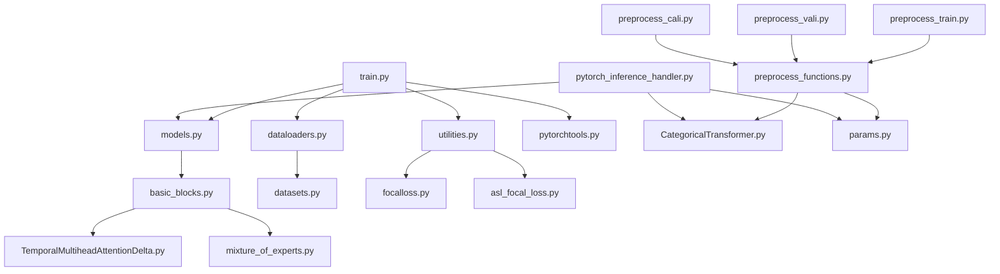

---
tags:
  - analysis
  - temporal-self-attention
  - deep-learning
  - fraud-detection
  - pytorch
  - script-analysis
keywords:
  - TSA model
  - script dependencies
  - training pipeline
  - inference pipeline
  - data preprocessing
  - model architecture
topics:
  - machine learning pipeline
  - script functionality analysis
  - dependency mapping
  - model training workflow
  - inference workflow
language: python
date of note: 2025-10-19
---

# Temporal Self-Attention Scripts Analysis

## Executive Summary

This analysis examines the complete script ecosystem of the Temporal Self-Attention (TSA) model implementation located in `dockers/tsa/scripts/` and `dockers/tsa/inference_script/`. The TSA model is a sophisticated deep learning architecture designed for fraud detection using sequential transaction data with temporal awareness.

## Script Inventory and Classification

### Core Model Architecture Scripts

#### 1. `basic_blocks.py` - Fundamental Building Blocks
**Purpose**: Contains the core neural network components that form the foundation of the TSA architecture.

**Key Components**:
- `TimeEncode` & `TimeEncoder`: Temporal encoding using learnable periodic functions
- `FeatureAggregation`: MLP-based feature dimension reduction
- `AttentionLayer`: Standard transformer attention with optional MoE and temporal awareness
- `AttentionLayerPreNorm`: Pre-normalization variant of attention layer
- `OrderAttentionLayer`: Processes sequences to learn temporal patterns
- `FeatureAttentionLayer`: Learns feature interactions from current order
- `compute_FM_parallel`: Factorization Machine for second-order feature interactions

**Dependencies**: 
- `TemporalMultiheadAttentionDelta.py`
- `mixture_of_experts.py`

**Architecture Role**: Provides the fundamental neural network building blocks that are composed into complete models.

#### 2. `models.py` - Complete Model Definitions
**Purpose**: Defines the two main TSA model variants by composing basic blocks.

**Key Models**:
- `OrderFeatureAttentionClassifier`: Single sequence TSA model
  - Combines OrderAttentionLayer and FeatureAttentionLayer
  - Optional MLP enhancement for numerical features
  - Suitable for standard fraud detection tasks
- `TwoSeqMoEOrderFeatureAttentionClassifier`: Advanced two-sequence model
  - Processes Customer ID (cid) and Credit Card ID (ccid) sequences
  - Gating mechanism for sequence importance weighting
  - MoE structure for improved capacity

**Dependencies**: 
- `basic_blocks.py`

**Architecture Role**: Top-level model definitions that orchestrate the complete TSA architecture.

#### 3. `TemporalMultiheadAttentionDelta.py` - Temporal Attention Mechanism
**Purpose**: Implements time-aware multi-head attention that incorporates temporal relationships.

**Key Features**:
- Extends standard multi-head attention with temporal encoding
- Handles time delta information in attention computation
- Critical for capturing temporal patterns in transaction sequences

**Dependencies**: Standard PyTorch modules

**Architecture Role**: Core attention mechanism that enables temporal awareness in the model.

#### 4. `mixture_of_experts.py` - Mixture of Experts Implementation
**Purpose**: Implements sparse expert routing for improved model capacity and efficiency.

**Key Features**:
- Multiple expert networks with gating mechanism
- Sparse activation for computational efficiency
- Configurable expert selection policies

**Dependencies**: Standard PyTorch modules

**Architecture Role**: Provides scalable capacity expansion through expert specialization.

### Data Processing and Preprocessing Scripts

#### 5. `preprocess_functions.py` - Core Data Processing Engine
**Purpose**: Central data preprocessing pipeline that transforms raw transaction data into model-ready tensors.

**Key Functions**:
- `data_parsing()`: Main preprocessing function with comprehensive data validation
- `parallel_data_parsing()`: Multi-process version for large datasets
- `processing_training_data_by_chunk()`: Chunked processing for training data
- `processing_calibration_data_by_chunk()`: Calibration data processing
- `processing_testing_data_by_chunk()`: Test data processing
- `chunk_processing()`: Orchestrates chunked data processing workflow

**Data Transformations**:
- Temporal sequence ordering and validation
- Categorical feature encoding using CategoricalTransformer
- Numerical feature scaling and normalization
- Sequence padding/truncation to fixed length (51)
- Time delta computation relative to most recent order
- Missing value handling with configurable defaults

**Dependencies**:
- `CategoricalTransformer.py`
- `params.py`
- Configuration files (preprocessor.pkl, cat_to_index.json, default_value_dict.json)

**Architecture Role**: Critical data pipeline that ensures consistent, high-quality input to the model.

#### 6. `CategoricalTransformer.py` - Categorical Feature Processing
**Purpose**: Transforms categorical features using predefined mappings for neural network consumption.

**Key Features**:
- Dictionary-based categorical encoding
- Missing value handling with defaults
- Vectorized operations for performance
- sklearn-compatible interface

**Dependencies**: 
- numpy, sklearn

**Architecture Role**: Essential preprocessing component for categorical feature handling.

#### 7. `params.py` & `params_na.py` - Configuration Management
**Purpose**: Centralized configuration for feature definitions and model parameters.

**Key Configurations**:
- Feature variable lists (categorical, numerical, engineered)
- Sequence length and separator definitions
- Model hyperparameters
- Regional variations (NA vs EU)

**Dependencies**: None (configuration only)

**Architecture Role**: Central configuration management ensuring consistency across the pipeline.

### Training and Evaluation Scripts

#### 8. `train.py` - Main Training Orchestrator
**Purpose**: Comprehensive training script with distributed training support and advanced features.

**Key Features**:
- Distributed Data Parallel (DDP) training support
- Automatic Mixed Precision (AMP) training
- Multiple loss functions (CrossEntropy, Focal, Cyclical Focal)
- Early stopping with patience
- Model checkpointing and resumption
- Comprehensive evaluation metrics
- Learning rate scheduling

**Training Pipeline**:
1. Argument parsing and configuration setup
2. Distributed training initialization
3. Data loading with appropriate samplers
4. Model instantiation and DDP wrapping
5. Optimizer and scheduler creation
6. Training loop with validation
7. Model saving and score generation
8. Calibration data processing for percentile scoring

**Dependencies**:
- `models.py`
- `dataloaders.py`
- `utilities.py`
- `pytorchtools.py`

**Architecture Role**: Main training orchestrator that coordinates all training components.

#### 9. `utilities.py` - Training and Evaluation Utilities
**Purpose**: Comprehensive utility functions supporting training, evaluation, and model management.

**Key Functions**:
- `train()`: Single epoch training with loss computation
- `evaluation_single_seq()`: Model evaluation with distributed support
- `get_performance()`: Comprehensive metrics computation (AUC, precision, recall, F1)
- `create_optimizer()`: Optimizer and scheduler factory
- `set_loss()`: Loss function factory
- `iteration()` & variants: Forward pass orchestration
- `distributed_concat()`: Distributed evaluation result aggregation

**Supported Metrics**:
- AUC-ROC, PR-AUC, Average Precision Score
- Accuracy, Precision, Recall, F1-Score
- Custom loss functions (Focal, Cyclical Focal)

**Dependencies**:
- `asl_focal_loss.py`
- `focalloss.py`
- sklearn, scipy

**Architecture Role**: Essential utilities that support the complete training and evaluation workflow.

#### 10. `dataloaders.py` - Data Loading Infrastructure
**Purpose**: Manages data loading for both single and two-sequence model variants with distributed training support.

**Key Functions**:
- `load_data_single_seq()`: Single sequence data loading
- `load_data_two_seq()`: Two sequence data loading with CID/CCID separation
- Distributed sampler creation
- Memory-mapped file loading for large datasets
- Data validation and preprocessing

**Data Handling**:
- Memory-mapped numpy arrays for efficient large dataset handling
- Distributed sampling for multi-GPU training
- Flexible batch size configuration
- Support for small batch testing

**Dependencies**:
- `datasets.py`

**Architecture Role**: Critical data infrastructure that efficiently feeds data to the training process.

#### 11. `datasets.py` - PyTorch Dataset Definitions
**Purpose**: Defines PyTorch Dataset classes for both single and two-sequence data formats.

**Key Classes**:
- `OrderSeqDataset`: Single sequence dataset
- `TwoOrderSeqDataset`: Two sequence dataset with CID/CCID separation

**Features**:
- Efficient tensor conversion
- Padding mask computation
- Time sequence extraction
- Memory-efficient data access

**Dependencies**: PyTorch

**Architecture Role**: Provides PyTorch-compatible data access patterns for training.

### Loss Functions and Optimization

#### 12. `focalloss.py` & `asl_focal_loss.py` - Advanced Loss Functions
**Purpose**: Implements specialized loss functions for imbalanced classification tasks.

**Key Loss Functions**:
- `FocalLoss`: Addresses class imbalance by down-weighting easy examples
- `Cyclical_FocalLoss`: Dynamic focal loss with cyclical gamma adjustment
- `AsymmetricLoss`: Asymmetric treatment of positive and negative samples

**Features**:
- Configurable gamma and alpha parameters
- Reduction options (mean, sum)
- Cyclical adjustment for training dynamics

**Dependencies**: PyTorch

**Architecture Role**: Specialized loss functions optimized for fraud detection's class imbalance.

#### 13. `pytorchtools.py` - Training Tools
**Purpose**: Additional training utilities including early stopping.

**Key Features**:
- `EarlyStopping`: Configurable early stopping with patience
- Model checkpointing
- Training state management

**Dependencies**: PyTorch

**Architecture Role**: Training workflow enhancements for robust model development.

### Inference and Deployment Scripts

#### 14. `pytorch_inference_handler.py` - SageMaker Inference Handler
**Purpose**: Production inference handler for SageMaker deployment with comprehensive preprocessing and postprocessing.

**Key Functions**:
- `input_fn()`: Request preprocessing and JSON parsing
- `predict_fn()`: Model inference with data preprocessing
- `output_fn()`: Response formatting with multiple score types
- `model_fn()`: Model loading and initialization
- `data_parsing()`: Production-grade data preprocessing

**Inference Pipeline**:
1. Input validation and JSON parsing
2. Data preprocessing (identical to training preprocessing)
3. Model inference with attention masking
4. Score computation (raw, percentile, probability)
5. Response formatting

**Score Types**:
- Raw model score (softmax probability)
- Percentile score (relative ranking)
- Probability score (calibrated probability using B-spline)

**Dependencies**:
- `CategoricalTransformer.py`
- `params.py`
- `models.py`
- Configuration files

**Architecture Role**: Production inference endpoint that maintains consistency with training pipeline.

#### 15. `na_tsa_inference_handler.py` - Regional Inference Handler
**Purpose**: North America specific inference handler with regional configurations.

**Key Differences**:
- Regional parameter configurations
- Market-specific feature handling
- Localized preprocessing parameters

**Dependencies**: Similar to pytorch_inference_handler.py

**Architecture Role**: Regional deployment variant ensuring market-specific optimizations.

### Preprocessing Pipeline Scripts

#### 16. `preprocess_*.py` Scripts - Data Pipeline Orchestration
**Purpose**: Various preprocessing scripts for different data splits and regions.

**Script Variants**:
- `preprocess_train.py` / `preprocess_train_na.py`: Training data preprocessing
- `preprocess_vali.py` / `preprocess_vali_na.py`: Validation data preprocessing  
- `preprocess_cali.py` / `preprocess_cali_na.py`: Calibration data preprocessing
- `preprocess.py`: General preprocessing orchestrator

**Key Functions**:
- Data loading from multiple sources
- Chunked processing for memory efficiency
- Parallel processing coordination
- Output tensor generation and saving

**Dependencies**:
- `preprocess_functions.py`
- Regional parameter files

**Architecture Role**: Data pipeline orchestration ensuring consistent preprocessing across data splits.

## Dependency Analysis

### Core Dependency Graph



### Configuration Dependencies

All scripts depend on external configuration files:
- `preprocessor.pkl`: Scaling parameters and preprocessing configurations
- `cat_to_index.json`: Categorical feature mappings
- `default_value_dict.json`: Default values for missing features
- `percentile_score.pkl`: Percentile mapping for score calibration
- `bspline_parameters.json`: B-spline parameters for probability calibration

### Critical Path Analysis

**Training Pipeline Critical Path**:
1. `params.py` → `preprocess_functions.py` → `preprocess_train.py`
2. `basic_blocks.py` → `models.py` → `train.py`
3. `datasets.py` → `dataloaders.py` → `train.py`
4. `utilities.py` → `train.py`

**Inference Pipeline Critical Path**:
1. `params.py` → `CategoricalTransformer.py` → `pytorch_inference_handler.py`
2. `basic_blocks.py` → `models.py` → `pytorch_inference_handler.py`

## Functional Analysis

### Data Flow Architecture

#### Training Data Flow
1. **Raw Data** → `preprocess_functions.py` → **Preprocessed Tensors**
2. **Preprocessed Tensors** → `datasets.py` → **PyTorch Datasets**
3. **PyTorch Datasets** → `dataloaders.py` → **DataLoaders**
4. **DataLoaders** → `train.py` → **Trained Model**

#### Inference Data Flow
1. **JSON Request** → `pytorch_inference_handler.py::input_fn()` → **Parsed Data**
2. **Parsed Data** → `data_parsing()` → **Preprocessed Tensors**
3. **Preprocessed Tensors** → `predict_fn()` → **Raw Scores**
4. **Raw Scores** → `output_fn()` → **Formatted Response**

### Model Architecture Composition

#### Single Sequence Model Flow
```
Input Data → OrderAttentionLayer → Feature Representation
Input Data → FeatureAttentionLayer → Feature Representation
Combined Representations → MLP Classifier → Predictions
```

#### Two Sequence Model Flow
```
CID Sequence → OrderAttentionLayer (CID) → CID Representation
CCID Sequence → OrderAttentionLayer (CCID) → CCID Representation
Gate Function → Sequence Importance Weights
Weighted Combination → Feature Attention → Final Predictions
```

### Preprocessing Pipeline Architecture

#### Core Preprocessing Steps
1. **Data Validation**: Comprehensive input validation and sanity checks
2. **Temporal Processing**: Sequence ordering and time delta computation
3. **Categorical Encoding**: Dictionary-based categorical transformation
4. **Numerical Scaling**: Min-max scaling with learned parameters
5. **Sequence Normalization**: Padding/truncation to fixed length
6. **Missing Value Handling**: Default value imputation

#### Parallel Processing Strategy
- Multi-process data parsing for large datasets
- Chunked processing to manage memory usage
- Memory-mapped arrays for efficient data access
- Distributed processing coordination

## Performance and Scalability Considerations

### Training Performance Optimizations
- **Distributed Data Parallel**: Multi-GPU training support
- **Automatic Mixed Precision**: Memory and speed optimization
- **Memory-Mapped Data Loading**: Efficient large dataset handling
- **Gradient Accumulation**: Effective batch size scaling
- **Early Stopping**: Training efficiency optimization

### Inference Performance Optimizations
- **Model State Caching**: Efficient model loading
- **Preprocessing Optimization**: Vectorized operations
- **Memory Management**: Efficient tensor operations
- **Score Caching**: Percentile and probability score optimization

### Scalability Features
- **Chunked Data Processing**: Handles arbitrarily large datasets
- **Parallel Processing**: Multi-core utilization
- **Distributed Training**: Multi-node scaling capability
- **Memory-Efficient Loading**: Streaming data access patterns

## Quality Assurance and Robustness

### Data Quality Assurance
- **Comprehensive Validation**: Multi-level input validation
- **Sanity Checks**: Data consistency verification
- **Missing Value Handling**: Robust default value strategies
- **Sequence Validation**: Temporal consistency checks

### Model Robustness Features
- **Attention Masking**: Proper handling of padded sequences
- **Gradient Clipping**: Training stability enhancement
- **Dropout Regularization**: Overfitting prevention
- **Early Stopping**: Generalization optimization

### Production Readiness
- **Error Handling**: Comprehensive exception management
- **Logging**: Detailed training and inference logging
- **Monitoring**: Performance and quality metrics
- **Fallback Strategies**: Graceful degradation handling

## Regional and Market Adaptations

### North America (NA) Variants
- Specialized parameter configurations
- Market-specific feature definitions
- Regional preprocessing adaptations
- Localized model parameters

### European (EU) Variants
- EU-specific regulatory compliance
- Regional feature engineering
- Market-adapted preprocessing
- Localized scoring mechanisms

## Integration Points and Interfaces

### SageMaker Integration
- **Training Jobs**: Distributed training orchestration
- **Inference Endpoints**: Real-time prediction serving
- **Model Registry
