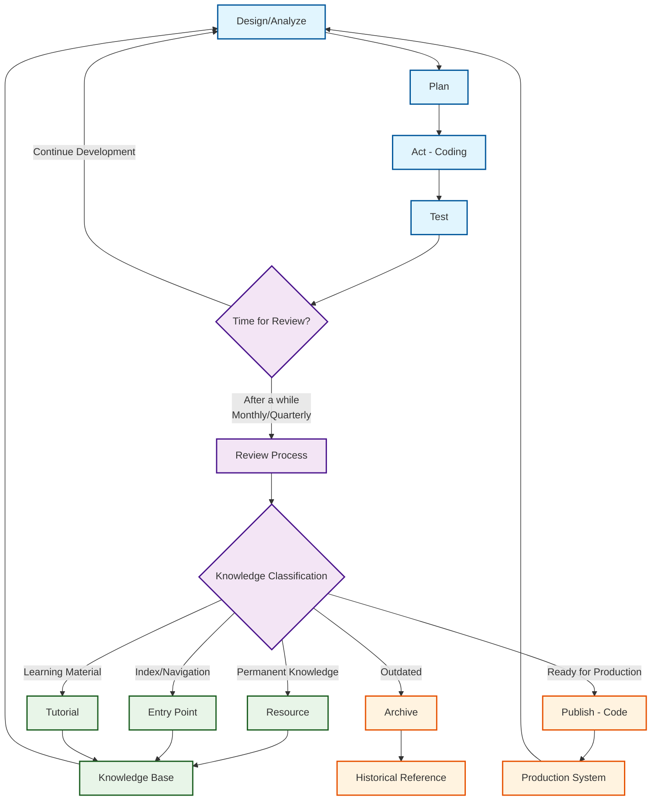

---
tags:
  - resource
  - documentation
  - standardization
  - metadata
keywords:
  - YAML frontmatter
  - documentation standard
  - metadata format
  - knowledge organization
  - searchability
topics:
  - documentation standards
  - knowledge management
  - organizational structure
language: python
date of note: 2025-07-31
---

# Documentation YAML Frontmatter Standard

## Purpose

This document defines the standardized YAML frontmatter format for all documentation files in the MODS project. The frontmatter provides consistent metadata that improves discoverability, categorization, and relationships between documents.

## Frontmatter Schema

All documentation files should include the following YAML frontmatter at the beginning of the file:

```yaml
---
tags:
  - tag1
  - tag2
  - tag3
keywords:
  - keyword1
  - keyword2
  - keyword3
topics:
  - topic1
  - topic2
language: python
date of note: YYYY-MM-DD
---
```

### Field Definitions

1. **tags**: Broad categorization for document filtering and navigation
   - Should include 3-5 hierarchical tags moving from general to specific
   - First tag typically identifies document type (code, project, design, analysis)
   - Following tags provide increasingly specific categorization

2. **keywords**: Specific terms for search and indexing
   - Should include 3-10 relevant terms
   - Each term should be descriptive and contextually relevant
   - Terms should help with document discovery

3. **topics**: Major subject areas covered in the document
   - Should include 2-4 main topics
   - Topics are broader than keywords but more specific than tags
   - Help cluster related documents by subject area

4. **language**: Primary programming language discussed
   - Usually "python" for our codebase
   - Can be another language if specifically relevant

5. **date of note**: Creation/last major update date
   - Format: YYYY-MM-DD
   - Typically extracted from the filename if using date-based naming

## Knowledge Generation and Coding Workflow

The tagging system follows a comprehensive workflow that combines action-driven development with regular operational review processes:



### Workflow Phases

#### Action-Driven Development Cycle
**Purpose**: Creating functional code and solutions
- **Design/Analyze** → **Plan** → **Act (Coding)** → **Test**
- Fast iteration focused on problem-solving and implementation
- Documentation tagged with initial generation tags (`design`, `analysis`, `project`, `test`)

#### Review Process (Regular/Operational)
**Purpose**: Extracting permanent knowledge and categorizing documentation
- Conducted regularly (monthly/quarterly cycles)
- Systematic evaluation of accumulated documentation
- Classification into permanent knowledge categories
- Application of post-processing tags (`resource`, `archive`, `entry_point`, `tutorial`, `code`)

## Tag Categorization by Knowledge Generation Lifecycle

The tagging system follows this workflow with three distinct phases:

### Phase 1: Initial Generation Tags (Content Creation)

These tags are applied **when the document is first written** to categorize the purpose and content of the document according to the ReAct knowledge generation process:

#### Design Phase Tags
```yaml
tags:
  - design
  - [design_area]
  - [component_name]
```
Applied when creating architectural designs, system specifications, and technical proposals.

#### Analysis Phase Tags
```yaml
tags:
  - analysis
  - [analysis_type]
  - [component_name]
```
Applied when conducting analysis of existing systems, performance studies, or comparative evaluations.

#### Project Planning Phase Tags
```yaml
tags:
  - project
  - planning
  - [technical_area]
  - [component]
```
Applied when creating implementation roadmaps, project plans, and development strategies.

#### Implementation Phase Tags
```yaml
tags:
  - project
  - implementation
  - [technical_area]
  - [component]
```
Applied when documenting implementation progress, development summaries, and execution details.

#### Test Phase Tags
```yaml
tags:
  - test
  - [test_type]
  - [component_name]
```
Applied when code is ready and test documentation is created for validation frameworks, test suites, and testing methodologies.

### Phase 2: Post-Processing Tags (Review Phase)

These tags are applied **after a period of time** (typically a month or quarter) as part of the review process to label the final destination and status of the document:

#### Resource Tag
Documents that are **beyond one design** and considered as general principles, best practices, common pitfalls, standard operation protocols, or instructions:

```yaml
tags:
  - resource
  - [category]
  - [topic_area]
  - [purpose]
```

Example locations for resource tags:
- Design principles and architectural philosophy documents
- Best practices guides and coding standards
- Common pitfalls and troubleshooting guides
- Standard operation protocols and procedures
- General instructions and methodology documents
- Style guides and documentation standards

#### Archive Tag
Documents that are considered **outdated** either by a new document or because the code is deprecated and refactored:

```yaml
tags:
  - archive
  - [original_category]
  - [topic_area]
  - [reason_for_archival]
```

Example locations for archive tags:
- Design documents describing systems that have been replaced
- Implementation guides for deprecated approaches
- Documentation for refactored or removed code
- Outdated architectural decisions superseded by new designs
- Legacy documentation maintained for historical reference

#### Entry Point Tag
Documents that serve as **Index Notes** connecting to many related notes and primarily used as entry points for query and knowledge access:

```yaml
tags:
  - entry_point
  - documentation
  - overview
  - [topic_area]
```

Example locations for entry point tags:
- Main README.md files that serve as documentation hubs
- Index documents that link to multiple related notes
- Overview documents that summarize and connect to detailed documentation
- Getting started guides that serve as navigation entry points
- Package overview documents that connect to various components

#### Tutorial Tag
Documents created during the review stage to extract and summarize existing knowledge for easy access:

```yaml
tags:
  - tutorial
  - reference
  - [tutorial_type]
  - [component_name]
  - [skill_level]
```

Example locations for tutorial tags:
- Getting started guides extracted from existing documentation
- Step-by-step tutorials summarizing complex processes
- API reference tutorials consolidating usage patterns
- Implementation tutorials distilling best practices
- Learning paths created from existing knowledge base

### Phase 3: Publishing Tags (Code Publication)

These tags are applied when documents are **reviewed and ready for code publication**:

#### Code Tag
Documents for code components that have been reviewed and are ready for publication:

```yaml
tags:
  - code
  - [module_path]
  - [component_name]
  - [component_purpose]
```

Example locations for code tags:
- API documentation for published modules
- Component documentation for released code
- Module guides for production-ready systems
- Implementation documentation for stable features

## Additional Tag Categories

### Prompt Tags

Documentation for prompt templates should begin with "prompt":

```yaml
tags:
  - prompt
  - [prompt_type]
  - [workflow_stage]
  - [purpose]
```

Example locations for prompt tags:
- LLM prompt templates
- Agentic workflow prompts
- Developer prompt templates
- Validation prompt templates
- Code generation prompts

Common prompt type subcategories:
- `planner` - Planning stage prompts
- `validator` - Validation stage prompts
- `programmer` - Code generation prompts
- `refinement` - Code refinement prompts
- `agentic` - Agentic workflow prompts
- `developer` - Developer assistance prompts

## Examples

### Module README Example (Entry Point)

```yaml
---
tags:
  - entry_point
  - code
  - pipeline_api
  - documentation
  - overview
keywords:
  - pipeline API
  - DAG
  - template converter
  - MODS integration
  - documentation
topics:
  - pipeline API
  - usage examples
  - architecture
language: python
date of note: 2025-07-31
---
```

### Component Documentation Example

```yaml
---
tags:
  - code
  - pipeline_api
  - config_resolver
  - matching_engine
keywords:
  - configuration
  - resolver
  - matching
  - DAG
  - pipeline
topics:
  - pipeline API
  - configuration resolution
language: python
date of note: 2025-07-31
---
```

### Project Planning Document Example

```yaml
---
tags:
  - project
  - planning
  - validation
  - alignment
keywords:
  - alignment validation
  - script contracts
  - property paths
  - step specifications
  - validation framework
topics:
  - pipeline validation
  - contract alignment
  - property path consistency
  - implementation plan
language: python
date of note: 2025-07-05
---
```

### Test Documentation Example

```yaml
---
tags:
  - test
  - builders
  - tabular_preprocessing
  - validation
keywords:
  - step builder tests
  - tabular preprocessing
  - validation infrastructure
  - universal test framework
  - processing step validation
topics:
  - test suite documentation
  - validation framework
  - step builder testing
language: python
date of note: 2025-08-08
---
```

## Implementation Process

The YAML frontmatter standardization was implemented across all documentation in:

1. `slipbox/project_planning/` - Project planning and implementation documents
2. `slipbox/pipeline_api/` - API component documentation
3. `slipbox/pipeline_design/` - Design documents and architecture

The implementation process included:
1. Analyzing existing documentation for common themes
2. Creating a standardized schema for metadata
3. Adding appropriate tags, keywords, and topics based on document content
4. Ensuring consistent formatting across all documents
5. Special handling for entry point documents and READMEs

## Benefits

### 1. Improved Discoverability
- Documents can be found via tags, keywords, or topics
- Related documents can be discovered through shared metadata
- Entry points clearly identified for newcomers

### 2. Better Organization
- Clear hierarchy of documentation
- Consistent categorization across the codebase
- Standard date format for chronological tracking

### 3. Relationship Mapping
- Documents with shared tags/topics can be related
- Technical areas clearly delineated
- Implementation details linked to design documents

### 4. Knowledge Management
- Easier to build documentation indexes
- Documentation gaps become visible
- Historical development path preserved through dates

## Tooling Support

The YAML frontmatter standard enables various tooling possibilities:

1. **Documentation Generators**: Create hierarchical documentation websites
2. **Search Indexes**: Build specialized search functionality
3. **Relationship Maps**: Generate visual document relationship diagrams
4. **Validation Tools**: Ensure conformance to the standard
5. **Tag Clouds**: Visualize the most common topics across the codebase

## Maintenance Guidelines

To maintain the effectiveness of this standard:

1. **Consistency**: Always follow the defined format
2. **Review**: Regularly review and update metadata
3. **Evolution**: Add new tags/keywords as the codebase evolves
4. **Validation**: Periodically check for adherence to the standard
5. **Refinement**: Improve the standard as needs change

## Conclusion

The standardized YAML frontmatter provides a robust foundation for documentation organization and discovery. By consistently applying this standard across all documentation files, we create a more navigable, searchable, and maintainable knowledge base that grows with the project.

This standard should be considered a living document, evolving as the project's documentation needs change over time.
