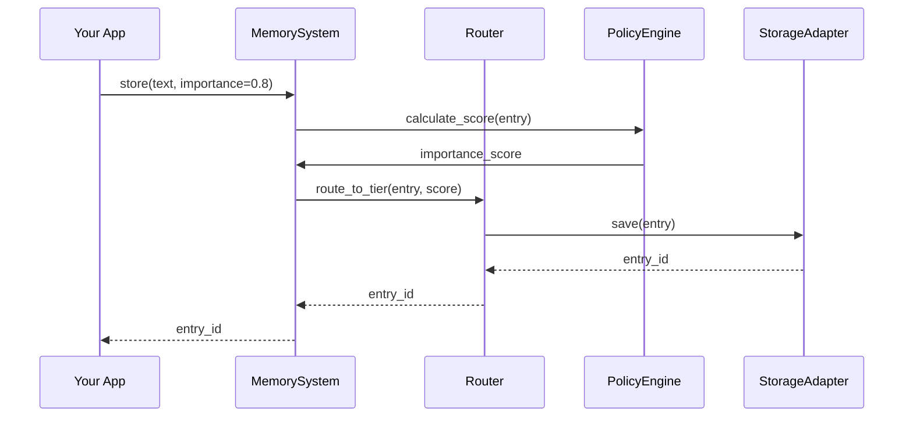
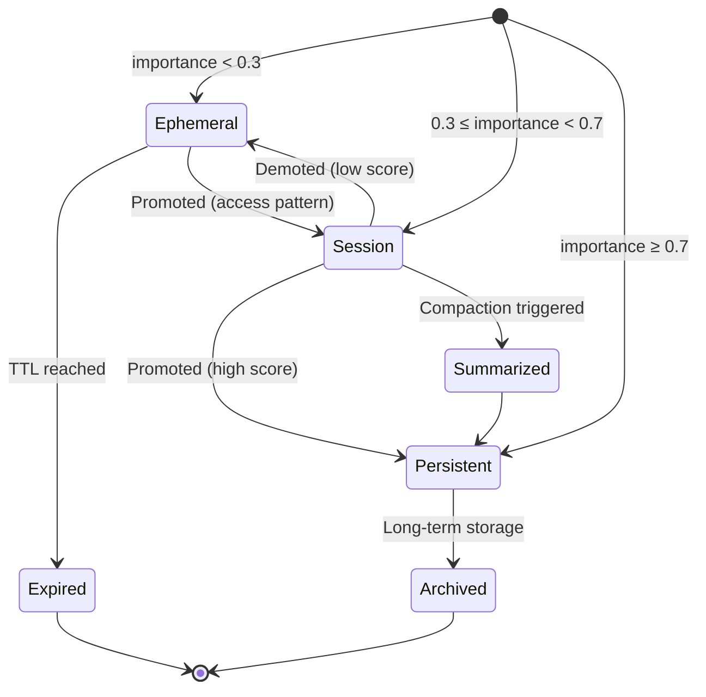

# Core Concepts

Understanding Axon's architecture and design principles.

## Architecture

Axon is built on four core pillars:

1. **Multi-Tier Storage**: Automatic routing across ephemeral, session, and persistent tiers
2. **Policy-Driven Lifecycle**: Configurable policies for TTL, capacity, promotion, and demotion
3. **Semantic Recall**: Vector-based similarity search with metadata filtering
4. **Production Features**: Audit logging, PII detection, transactions, and observability

## Memory Flow



## Key Components

### MemorySystem

The main API for all memory operations.

**Methods:**
- `store()` - Save a memory
- `recall()` - Search memories semantically
- `forget()` - Delete memories
- `compact()` - Summarize and compress
- `export()` - Export all memories
- `import_data()` - Import memories

### Router

Intelligently routes operations across tiers based on:
- Importance scores
- Access patterns
- Capacity constraints
- Explicit tier hints

### PolicyEngine

Orchestrates lifecycle decisions:
- Promotion eligibility
- Demotion triggers
- Eviction policies
- Compaction scheduling

### ScoringEngine

Calculates importance scores using:
- Access frequency
- Recency
- Base importance
- Session continuity

## Memory Lifecycle



## Design Principles

### 1. Async-First

All operations are async for high performance:

```python
# Correct
await system.store("memory")

# Wrong
system.store("memory")  # Returns coroutine, doesn't execute
```

### 2. Fail-Fast

Invalid inputs raise exceptions immediately:

```python
# Raises ValueError
await system.store("", importance=0.8)  # Empty content

await system.recall("query", k=0)  # Invalid k
```

### 3. Explicit > Implicit

Always prefer explicit configuration:

```python
# Explicit tier
await system.store("data", tier="persistent")

# Explicit importance
await system.store("data", importance=0.8)
```

### 4. Composability

Components can be mixed and matched:

```python
# Custom adapter + policy
registry.register("custom", MyAdapter())
config.tiers["custom"] = MyPolicy()
```

## Next Steps

- [Memory Tiers](tiers.md) - Deep dive into tier architecture
- [Policies](policies.md) - Learn about policy configuration
- [Routing](routing.md) - Understand tier selection logic
