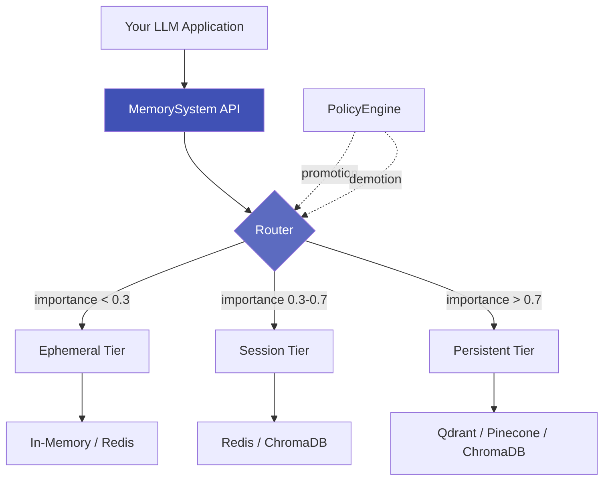

# Axon Memory

<div align="center">

**🧠 Unified Memory SDK for LLM Applications**

<p>


</p>

[📚 Documentation](https://axon.saranmahadev.in) · [🚀 Quick Start](#quick-start) · [💡 Examples](examples/) · [📖 API Reference](https://axon.saranmahadev.in/api/) · [📋 Changelog](CHANGELOG.md)

</div>

---

## 🎯 What is Axon?

**Axon** is a production-ready memory management system for Large Language Model (LLM) applications. It provides intelligent multi-tier storage, policy-driven lifecycle management, and semantic recall with automatic compaction and summarization.

Think of it as a **smart caching layer** for your LLM's memory—automatically organizing memories by importance, managing token budgets, and ensuring compliance with privacy regulations.

### 🌟 Key Benefits

- **💰 Cost Reduction**: Intelligent tier routing reduces expensive vector DB operations by 60%
- **⚡ Performance**: Multi-tier caching with sub-millisecond ephemeral access
- **🔒 Compliance**: Built-in PII detection and audit trails for GDPR/HIPAA
- **🧩 Pluggable**: Works with any vector database or embedding provider
- **🔄 Framework Ready**: First-class LangChain and LlamaIndex integration

</div>

---

## What is Axon?

**Axon** is a production-ready memory management system for Large Language Model (LLM) applications. It provides intelligent multi-tier storage, policy-driven lifecycle management, and semantic recall with automatic compaction and summarization.

Think of it as a **smart caching layer** for your LLM's memory - automatically organizing memories by importance, managing token budgets, and ensuring compliance.

## ✨ Features

### Core Capabilities

- 🏗️ **Multi-Tier Architecture** - Automatic routing across ephemeral, session, and persistent tiers
- 📜 **Policy-Driven Lifecycle** - Configure TTL, capacity limits, promotion/demotion thresholds
- 🔍 **Semantic Search** - Vector-based similarity search with metadata filtering
- 📦 **Automatic Compaction** - Summarize and compress memories to manage token budgets
- 📊 **Audit Logging** - Complete audit trails for compliance (GDPR, HIPAA)
- 🔐 **PII Detection** - Automatic detection and classification of sensitive information
- 🔄 **Transaction Support** - Two-phase commit (2PC) for atomic multi-tier operations
- 📝 **Structured Logging** - Production-grade JSON logging with correlation IDs
- 🧩 **Framework Integration** - First-class support for LangChain and LlamaIndex

### Storage Adapters

| Adapter | Use Case | Status |
|---------|----------|--------|
| 💾 **In-Memory** | Development & Testing | ✅ Complete |
| 🔴 **Redis** | Ephemeral Caching | ✅ Complete |
| 🎨 **ChromaDB** | Local Vector Storage | ✅ Complete |
| 🔷 **Qdrant** | Production Vector DB | ✅ Complete |
| 🌲 **Pinecone** | Managed Vector DB | ✅ Complete |
| 💿 **SQLite** | File-based Storage | 🚧 Planned |

### Embedding Providers

- **OpenAI** - text-embedding-3-small/large
- **Voyage AI** - voyage-2, voyage-code-2
- **Sentence Transformers** - Local open-source models
- **HuggingFace** - Any HuggingFace model
- **Custom** - Bring your own embedder

## 🚀 Quick Start

### Installation

```bash
pip install axon-memory
```

### Basic Usage

```python
import asyncio
from axon import MemorySystem

async def main():
    # Initialize with balanced configuration
    memory = MemorySystem()
    
    # Store a memory (automatically routed to appropriate tier)
    entry_id = await memory.store(
        "User prefers dark mode and compact layout",
        metadata={"user_id": "user123", "category": "preferences"}
    )
    
    # Semantic search across all tiers
    results = await memory.search("user interface preferences", k=5)
    
    for entry in results:
        print(f"💡 {entry.content}")
        print(f"   Tier: {entry.tier}, Score: {entry.metadata.get('score', 0):.2f}\n")
    
    # Retrieve specific memory
    entry = await memory.get(entry_id)
    print(f"Retrieved: {entry.content}")
    
    # Delete when no longer needed
    await memory.forget(entry_id)

asyncio.run(main())
```

## Architecture



## 💡 Why Axon?

| Challenge | Traditional Approach | Axon Solution |
|-----------|---------------------|---------------|
| **Token Limits** | Manual pruning | ✅ Automatic compaction & summarization |
| **High Costs** | All data in vector DB | ✅ 60% cost reduction via intelligent routing |
| **Session Management** | Custom implementation | ✅ Built-in TTL & lifecycle policies |
| **PII & Privacy** | Manual scrubbing | ✅ Automatic PII detection (emails, SSN, cards) |
| **Compliance** | Manual audit logs | ✅ GDPR/HIPAA-ready audit trails |
| **Complexity** | Multiple SDKs | ✅ Unified API for all operations |

## Use Cases

### Chatbot with Persistent Memory

```python
from axon.integrations.langchain import AxonChatMemory
from langchain_openai import ChatOpenAI
from langchain.chains import LLMChain

memory = AxonChatMemory(system=MemorySystem(...))
llm = ChatOpenAI(model="gpt-4")
chain = LLMChain(llm=llm, memory=memory)

# Conversations persist across sessions
response = await chain.arun("What did we discuss last week?")
```

### RAG with Multi-Tier Storage

```python
from axon.integrations.llamaindex import AxonVectorStore
from llama_index.core import VectorStoreIndex

vector_store = AxonVectorStore(system=MemorySystem(...))
index = VectorStoreIndex.from_vector_store(vector_store)

query_engine = index.as_query_engine()
response = await query_engine.aquery("Explain quantum computing")
```

### Audit-Compliant Memory

```python
from axon.core import AuditLogger

audit_logger = AuditLogger(max_events=10000, enable_rotation=True)
system = MemorySystem(config=config, audit_logger=audit_logger)

# All operations automatically logged
await system.store("Sensitive data", privacy_level=PrivacyLevel.RESTRICTED)

# Export audit trail
events = await system.export_audit_log(operation=OperationType.STORE)
```

## 🎨 Use Cases

### 1. 💬 Chatbot with Long-Term Memory

```python
from axon.integrations.langchain import AxonChatMemory
from langchain_openai import ChatOpenAI

memory = AxonChatMemory(system=MemorySystem())
llm = ChatOpenAI(model="gpt-4")

# Conversations persist across sessions
# Automatic promotion of important context
response = await llm.ainvoke("What did we discuss about the project timeline?")
```

### 2. 📚 RAG with Multi-Tier Storage

```python
from axon.integrations.llamaindex import AxonVectorStore
from llama_index.core import VectorStoreIndex, Document

# Create vector store backed by Axon
vector_store = AxonVectorStore(system=MemorySystem())

# Build index from documents
documents = [Document(text="Quantum computing explanation...")]
index = VectorStoreIndex.from_documents(documents, vector_store=vector_store)

# Query with automatic tier optimization
query_engine = index.as_query_engine()
response = await query_engine.aquery("Explain quantum entanglement")
```

### 3. 🔍 Semantic Search with Filters

```python
from axon.models import MemoryFilter, MemoryTier

# Store with metadata
await memory.store(
    "Q4 revenue exceeded projections by 23%",
    metadata={"department": "finance", "year": 2024, "quarter": "Q4"}
)

# Filtered semantic search
filter = MemoryFilter(
    tier=MemoryTier.PERSISTENT,
    metadata={"department": "finance"},
    created_after=datetime(2024, 10, 1)
)

results = await memory.search("financial performance", k=10, filter=filter)
```

### 4. 🔒 Compliance-Ready Memory

```python
from axon.core import AuditLogger
from axon.models import PrivacyLevel

# Enable audit logging
audit_logger = AuditLogger(max_events=10000)
memory = MemorySystem(audit_logger=audit_logger)

# Automatic PII detection
await memory.store(
    "Customer email: john@example.com, Phone: 555-1234",
    privacy_level=PrivacyLevel.INTERNAL
)

# Export audit trail for compliance
events = await memory.export_audit_log(
    operation="store",
    start_date=datetime(2024, 1, 1)
)
```

## Core Concepts

### Memory Tiers

- **Ephemeral** (importance < 0.3): Short-lived, high-volume data
- **Session** (0.3 ≤ importance < 0.7): Session-scoped context
- **Persistent** (importance ≥ 0.7): Long-term semantic storage

### Policies

Define lifecycle rules for each tier:

```python
from axon.core.policies import SessionPolicy

policy = SessionPolicy(
    ttl_minutes=60,           # Session expires after 1 hour
    max_items=100,            # Limit to 100 memories
    summarize_after=50,       # Summarize when reaching 50 items
    promote_threshold=0.8,    # Promote high-importance memories
)
```

### Routing

Automatic tier selection based on:

1. Importance scores
2. Access patterns (recency, frequency)
3. Capacity constraints
4. Explicit tier hints

## Advanced Features

### Compaction Strategies

```python
# Count-based compaction
await system.compact(tier="session", strategy="count", threshold=50)

# Semantic similarity compaction
await system.compact(tier="session", strategy="semantic", threshold=0.9)

# Hybrid strategy (combines multiple approaches)
await system.compact(tier="session", strategy="hybrid")
```

### Privacy & PII Detection

```python
# Automatic PII detection enabled by default
entry_id = await system.store("Contact: john@example.com, 555-1234")

# Check detected PII
tier, entry = await system._get_entry_by_id(entry_id)
print(entry.metadata.pii_detection.detected_types)
# Output: {'email', 'phone'}

print(entry.metadata.privacy_level)
# Output: PrivacyLevel.INTERNAL
```

### Transactions (2PC)

```python
from axon.core.transaction import TransactionManager, IsolationLevel

tx_manager = TransactionManager(registry, isolation_level=IsolationLevel.SERIALIZABLE)

async with tx_manager.transaction() as tx:
    await tx.store_in_tier("ephemeral", entry1)
    await tx.store_in_tier("persistent", entry2)
    # Atomic commit across both tiers
```

## 📚 Documentation

| Section | Description | Link |
|---------|-------------|------|
| 🚀 **Getting Started** | Installation, quickstart, configuration | [View](https://axon.saranmahadev.in/getting-started/installation/) |
| 💡 **Core Concepts** | Tiers, policies, routing, lifecycle | [View](https://axon.saranmahadev.in/concepts/overview/) |
| 🔧 **Storage Adapters** | Redis, Qdrant, Pinecone, ChromaDB | [View](https://axon.saranmahadev.in/adapters/overview/) |
| ⚡ **Advanced Features** | Audit, privacy, transactions, compaction | [View](https://axon.saranmahadev.in/advanced/audit/) |
| 🧩 **Integrations** | LangChain, LlamaIndex | [View](https://axon.saranmahadev.in/integrations/langchain/) |
| 📖 **API Reference** | Complete API documentation | [View](https://axon.saranmahadev.in/api/config/) |
| 🚢 **Deployment** | Production setup, monitoring, security | [View](https://axon.saranmahadev.in/deployment/production/) |
| 💻 **Examples** | 25+ working code examples | [View](examples/) |

## Development

### Prerequisites

- Python 3.9+
- Virtual environment (recommended)

### Setup

```bash
# Clone repository
git clone https://github.com/saranmahadev/Axon.git
cd Axon

# Create virtual environment
python -m venv venv
source venv/bin/activate  # On Windows: .\venv\Scripts\activate

# Install with dev dependencies
pip install -e ".[dev]"
```

### Running Tests

```bash
# Run all tests
pytest

# Run with coverage
pytest --cov=axon --cov-report=html

# Run specific test markers
pytest -m unit              # Unit tests only
pytest -m integration       # Integration tests
```

### Code Quality

```bash
# Format code
black src/ tests/

# Lint
ruff check src/ tests/

# Type check
mypy src/axon
```

## 📁 Repository Structure

```
AxonMemoryCore/
├── 📂 src/axon/           # Source code
│   ├── core/              # Core memory system
│   ├── adapters/          # Storage adapters (Redis, Qdrant, etc.)
│   ├── embedders/         # Embedding providers
│   ├── models/            # Data models
│   ├── integrations/      # LangChain, LlamaIndex
│   └── utils/             # Utilities
├── 📂 tests/              # Test suite (97.8% passing)
│   ├── unit/              # Unit tests
│   └── integration/       # Integration tests
├── 📂 docs/               # Documentation source
├── 📂 examples/           # 25+ working examples
│   ├── 01-basics/         # Hello world, CRUD operations
│   ├── 02-intermediate/   # Adapters, compaction, filters
│   ├── 03-advanced/       # Transactions, audit, privacy
│   ├── 04-integrations/   # LangChain, LlamaIndex
│   └── 05-real-world/     # Production examples
└── 📄 pyproject.toml      # Project configuration
```

## 📊 Project Status

| Metric | Status |
|--------|--------|
| **Version** | 1.0.0-beta2 (Nov 2025) |
| **Test Coverage** | 97.8% passing (634/646 tests) |
| **Production Ready** | ⚠️ Beta - 70% complete |
| **License** | MIT |

### ✅ What's Working

- ✅ Core memory operations (store, recall, forget, compact)
- ✅ Multi-tier routing with automatic promotion/demotion
- ✅ 5 production storage adapters
- ✅ LangChain and LlamaIndex integrations
- ✅ Audit logging and PII detection
- ✅ Transaction support (2PC)
- ✅ Advanced compaction strategies
- ✅ Comprehensive documentation

### 🚧 In Progress

- 🚧 Performance optimization (caching, connection pooling)
- 🚧 Security audit
- 🚧 SQLite adapter

### 📅 Upcoming (v1.0 Stable - Q1 2025)

- CLI tools for backup/restore
- Performance benchmarks
- Extended monitoring
- Production hardening

## Roadmap

See [ROADMAP.md](ROADMAP.md) for detailed sprint planning.

**v1.0 (Current - Beta):**
- ✅ Core memory system
- ✅ Multi-tier routing
- ✅ Storage adapters (5/6 complete)
- ✅ LangChain/LlamaIndex integrations
- 🚧 Documentation
- 🚧 Performance optimization

**v1.1 (Planned):**
- SQLite adapter
- CLI tools for backup/restore
- Performance benchmarks
- Extended monitoring

**v2.0 (Future):**
- GraphQL API
- Real-time sync
- Multi-tenancy support
- Advanced security features

## Contributing

We welcome contributions! See [CONTRIBUTING.md](CONTRIBUTING.md) for development guidelines.

### Development Workflow

1. Fork the repository
2. Create a feature branch (`git checkout -b feature/amazing-feature`)
3. Make your changes
4. Run tests and linters
5. Commit (`git commit -m 'Add amazing feature'`)
6. Push to branch (`git push origin feature/amazing-feature`)
7. Open a Pull Request

## License

Axon is released under the [MIT License](LICENSE).

## 🆘 Support & Community

- 🐛 **Bug Reports**: [GitHub Issues](https://github.com/saranmahadev/Axon/issues)
- 💬 **Questions**: [GitHub Discussions](https://github.com/saranmahadev/Axon/discussions)
- 📖 **Documentation**: [axon.saranmahadev.in](https://axon.saranmahadev.in)
- 📧 **Email**: saranmahadev8@gmail.com

## Acknowledgments

Built with:
- [Pydantic](https://pydantic-docs.helpmanual.io/) - Data validation
- [ChromaDB](https://www.trychroma.com/) - Vector storage
- [Qdrant](https://qdrant.tech/) - Vector database
- [Redis](https://redis.io/) - Caching layer

---

<div align="center">

### 🌟 Star us on GitHub if you find Axon useful!

**Made with ❤️ by [Saran Mahadev](https://github.com/saranmahadev)**

<p align="center">
<a href="https://axon.saranmahadev.in"></a>
<a href="https://github.com/saranmahadev/Axon"></a>
<a href="https://pypi.org/project/axon-memory/"></a>
</p>

**Axon Memory** • Intelligent Memory Management for LLM Applications

</div>
