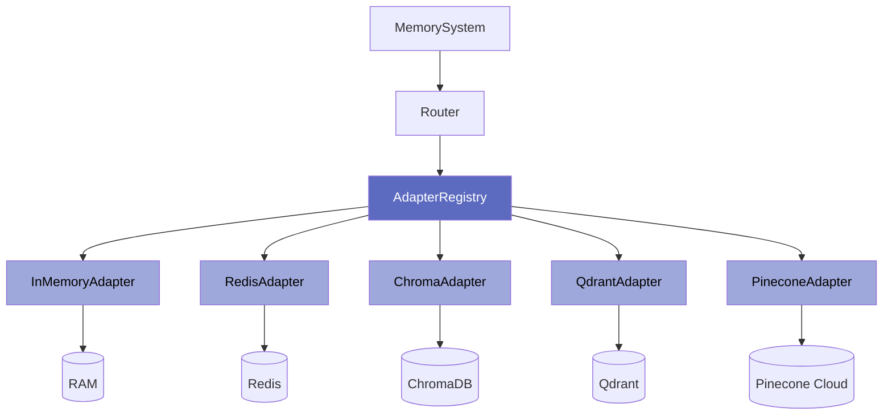
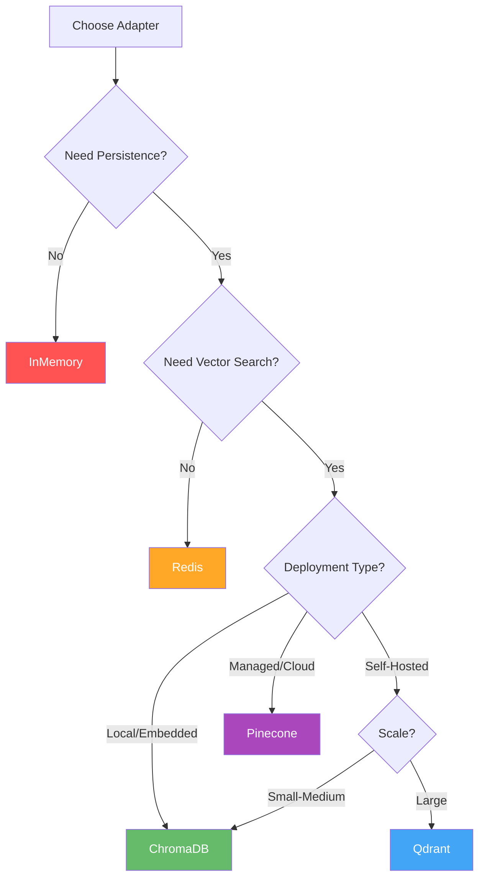

# Storage Adapters

Learn about Axon's storage adapter system and choose the right backend for your memory tiers.

---

## Overview

**Storage adapters** provide the abstraction layer between Axon and various storage backends. Each adapter implements the same interface, allowing you to swap storage systems without changing your code.



---

## Available Adapters

| Adapter | Storage | Vector Search | Persistence | Best For |
|---------|---------|---------------|-------------|----------|
| **InMemory** | RAM | ✓ (numpy) | ✗ | Development, testing |
| **Redis** | In-Memory | ✗ | Optional | Ephemeral, session cache |
| **ChromaDB** | Disk (SQLite) | ✓ | ✓ | Local, embedded apps |
| **Qdrant** | Disk/Cloud | ✓ | ✓ | High-performance production |
| **Pinecone** | Cloud | ✓ | ✓ | Managed, serverless |

---

## Adapter Interface

All adapters implement the `StorageAdapter` base class:

```python
from axon.adapters.base import StorageAdapter

class StorageAdapter(ABC):
    """Abstract base class for storage adapters."""
    
    @abstractmethod
    async def save(self, entry: MemoryEntry) -> str:
        """Save a memory entry and return its ID."""
        pass
    
    @abstractmethod
    async def query(
        self,
        vector: list[float],
        k: int = 5,
        filter: Filter | None = None,
    ) -> list[MemoryEntry]:
        """Query by vector similarity with optional filtering."""
        pass
    
    @abstractmethod
    async def get(self, id: str) -> MemoryEntry:
        """Retrieve a memory entry by ID."""
        pass
    
    @abstractmethod
    async def delete(self, id: str) -> bool:
        """Delete a memory entry by ID."""
        pass
```

---

## Adapter Comparison

### Performance

| Adapter | Read Latency | Write Latency | Throughput | Scalability |
|---------|--------------|---------------|------------|-------------|
| **InMemory** | <1ms | <1ms | Very High | Single machine |
| **Redis** | 1-5ms | 1-5ms | High | Distributed |
| **ChromaDB** | 5-20ms | 5-30ms | Medium | Single machine |
| **Qdrant** | 10-50ms | 10-100ms | High | Horizontal scaling |
| **Pinecone** | 50-200ms | 50-200ms | Very High | Serverless auto-scale |

### Features

| Adapter | Vector Search | Metadata Filter | Batch Ops | TTL | Cost |
|---------|---------------|-----------------|-----------|-----|------|
| **InMemory** | ✓ (numpy) | ✓ | ✓ | ✗ | Free |
| **Redis** | ✗ | Limited | ✓ | ✓ | Low (self-hosted) |
| **ChromaDB** | ✓ | ✓ | ✓ | ✗ | Free (embedded) |
| **Qdrant** | ✓ | ✓ | ✓ | ✗ | Low-Medium |
| **Pinecone** | ✓ | ✓ | ✓ | ✗ | Medium-High (managed) |

### Use Cases

| Adapter | Ideal For | Not Good For |
|---------|-----------|--------------|
| **InMemory** | Development, testing, CI/CD | Production (no persistence) |
| **Redis** | Cache, sessions, rate limits | Long-term storage, vector search |
| **ChromaDB** | Local apps, prototypes, small datasets | High-scale production |
| **Qdrant** | Production, high-performance, self-hosted | Embedded applications |
| **Pinecone** | Serverless, managed infrastructure | Cost-sensitive projects |

---

## Adapter Selection Guide

### Decision Tree



### Quick Selection

**Choose InMemory if:**
- ✓ Developing/testing locally
- ✓ Running CI/CD tests
- ✓ No persistence needed
- ✓ Single-process application

**Choose Redis if:**
- ✓ Need fast cache with TTL
- ✓ Session management
- ✓ Rate limiting
- ✓ No vector search required
- ✓ Multi-process/distributed

**Choose ChromaDB if:**
- ✓ Local development with persistence
- ✓ Embedded applications
- ✓ Small to medium datasets (<1M vectors)
- ✓ No separate server desired

**Choose Qdrant if:**
- ✓ Production deployment
- ✓ High performance vector search
- ✓ Large datasets (>1M vectors)
- ✓ Self-hosted infrastructure
- ✓ Cost optimization

**Choose Pinecone if:**
- ✓ Managed infrastructure preferred
- ✓ Serverless auto-scaling needed
- ✓ Global distribution
- ✓ Don't want to manage infrastructure

---

## Configuration Examples

### Multi-Tier Setup

```python
from axon import MemorySystem
from axon.core.config import MemoryConfig
from axon.core.policies import EphemeralPolicy, SessionPolicy, PersistentPolicy

# Optimal multi-tier configuration
config = MemoryConfig(
    ephemeral=EphemeralPolicy(
        adapter_type="redis",  # Fast cache
        ttl_seconds=60
    ),
    session=SessionPolicy(
        adapter_type="redis",  # Distributed sessions
        ttl_seconds=1800,
        max_entries=1000,
        overflow_to_persistent=True
    ),
    persistent=PersistentPolicy(
        adapter_type="qdrant",  # High-performance vector search
        compaction_threshold=10000
    )
)

memory = MemorySystem(config)
```

### Development Setup

```python
# All in-memory for local development
config = MemoryConfig(
    ephemeral=EphemeralPolicy(adapter_type="memory"),
    session=SessionPolicy(adapter_type="memory"),
    persistent=PersistentPolicy(adapter_type="memory")
)
```

### Production Setup

```python
# Production-grade setup
config = MemoryConfig(
    ephemeral=EphemeralPolicy(adapter_type="redis"),
    session=SessionPolicy(adapter_type="redis"),
    persistent=PersistentPolicy(adapter_type="pinecone")
)
```

---

## Adapter-Specific Features

### InMemory

- **Pros**: Instant setup, no dependencies, perfect for testing
- **Cons**: No persistence, single-process only
- **Best Tier**: Development/testing only

### Redis

- **Pros**: Very fast, distributed, TTL support, battle-tested
- **Cons**: No vector search, costs memory
- **Best Tier**: Ephemeral, Session

### ChromaDB

- **Pros**: Embedded, persistent, no server, good for prototypes
- **Cons**: Single-machine, limited scale
- **Best Tier**: Persistent (small-scale)

### Qdrant

- **Pros**: High performance, self-hosted, scalable, cost-effective
- **Cons**: Requires server setup
- **Best Tier**: Persistent (production)

### Pinecone

- **Pros**: Fully managed, serverless, auto-scaling, global
- **Cons**: Higher cost, network latency
- **Best Tier**: Persistent (managed)

---

## Installation

### Base Installation

```bash
pip install axon-sdk
```

### Adapter-Specific Dependencies

```bash
# Redis
pip install redis>=5.0.0

# ChromaDB
pip install chromadb>=0.4.0

# Qdrant
pip install qdrant-client>=1.6.0

# Pinecone
pip install pinecone-client>=3.0.0

# All adapters
pip install "axon-sdk[all]"
```

---

## Connection Configuration

### Environment Variables

```bash
# Redis
export REDIS_HOST=localhost
export REDIS_PORT=6379
export REDIS_PASSWORD=your-password

# Qdrant
export QDRANT_URL=http://localhost:6333
export QDRANT_API_KEY=your-api-key

# Pinecone
export PINECONE_API_KEY=your-api-key
export PINECONE_ENVIRONMENT=us-east-1-aws
```

### Programmatic Configuration

```python
# Redis with custom settings
from axon.adapters.redis import RedisAdapter

redis_adapter = RedisAdapter(
    host="redis.example.com",
    port=6379,
    password="secret",
    namespace="app_v1",
    default_ttl=3600
)

# Qdrant with authentication
from axon.adapters.qdrant import QdrantAdapter

qdrant_adapter = QdrantAdapter(
    url="https://your-cluster.qdrant.io",
    api_key="your-api-key",
    collection_name="memories"
)

# Pinecone with namespace
from axon.adapters.pinecone import PineconeAdapter

pinecone_adapter = PineconeAdapter(
    api_key="your-api-key",
    index_name="memories",
    namespace="user_123",
    cloud="aws",
    region="us-east-1"
)
```

---

## Custom Adapters

You can create custom adapters for any storage backend:

```python
from axon.adapters.base import StorageAdapter
from axon.models import MemoryEntry, Filter

class CustomAdapter(StorageAdapter):
    """Custom adapter for MyDatabase."""
    
    async def save(self, entry: MemoryEntry) -> str:
        # Implement save logic
        pass
    
    async def query(
        self,
        vector: list[float],
        k: int = 5,
        filter: Filter | None = None,
    ) -> list[MemoryEntry]:
        # Implement query logic
        pass
    
    async def get(self, id: str) -> MemoryEntry:
        # Implement get logic
        pass
    
    async def delete(self, id: str) -> bool:
        # Implement delete logic
        pass

# Use custom adapter
config = MemoryConfig(
    persistent=PersistentPolicy(adapter_type="custom")
)
# Register adapter in registry
registry.register("persistent", CustomAdapter())
```

---

## Best Practices

### 1. Match Adapter to Tier

```python
# ✓ Good: Fast cache + persistent vector search
ephemeral=EphemeralPolicy(adapter_type="redis")
persistent=PersistentPolicy(adapter_type="qdrant")

# ✗ Bad: Expensive vector DB for cache
ephemeral=EphemeralPolicy(adapter_type="pinecone")
```

### 2. Use Connection Pooling

```python
# ✓ Good: Reuse connections
redis_adapter = RedisAdapter(max_connections=10)

# ✗ Bad: Single connection (bottleneck)
redis_adapter = RedisAdapter(max_connections=1)
```

### 3. Enable Persistence for Important Data

```python
# ✓ Good: ChromaDB/Qdrant/Pinecone for persistent tier
persistent=PersistentPolicy(adapter_type="qdrant")

# ✗ Bad: InMemory for persistent (data lost on restart)
persistent=PersistentPolicy(adapter_type="memory")
```

### 4. Monitor Adapter Performance

```python
# Track adapter metrics
import time

start = time.time()
await adapter.save(entry)
duration = time.time() - start

if duration > 0.1:  # 100ms threshold
    print(f"Slow save operation: {duration:.2f}s")
```

---

## Adapter Documentation

Detailed guides for each adapter:

<div class="grid cards" markdown>

-   :material-memory:{ .lg .middle } **InMemory Adapter**

    ---

    Fast in-memory storage for development and testing.

    [:octicons-arrow-right-24: InMemory Guide](in-memory.md)

-   :material-database-sync:{ .lg .middle } **Redis Adapter**

    ---

    High-performance cache with TTL support.

    [:octicons-arrow-right-24: Redis Guide](redis.md)

-   :material-database:{ .lg .middle } **ChromaDB Adapter**

    ---

    Embedded vector database for local persistence.

    [:octicons-arrow-right-24: ChromaDB Guide](chromadb.md)

-   :material-rocket-launch:{ .lg .middle } **Qdrant Adapter**

    ---

    High-performance vector search engine.

    [:octicons-arrow-right-24: Qdrant Guide](qdrant.md)

-   :material-cloud:{ .lg .middle } **Pinecone Adapter**

    ---

    Managed cloud vector database.

    [:octicons-arrow-right-24: Pinecone Guide](pinecone.md)

-   :material-puzzle:{ .lg .middle } **Custom Adapters**

    ---

    Create adapters for your storage backend.

    [:octicons-arrow-right-24: Custom Guide](custom.md)

</div>

---

## Next Steps

<div class="grid cards" markdown>

-   :material-cog:{ .lg .middle } **Configuration**

    ---

    Configure adapters for each tier.

    [:octicons-arrow-right-24: Configuration Guide](../getting-started/configuration.md)

-   :material-layers:{ .lg .middle } **Memory Tiers**

    ---

    Understand which adapters work with which tiers.

    [:octicons-arrow-right-24: Tier Guide](../concepts/tiers.md)

-   :material-rocket:{ .lg .middle } **Deployment**

    ---

    Deploy adapters in production environments.

    [:octicons-arrow-right-24: Deployment Guide](../deployment/production.md)

</div>
