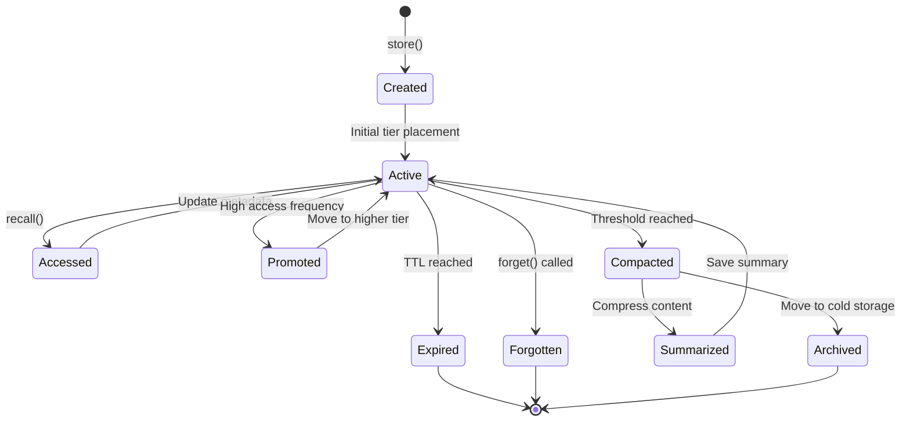
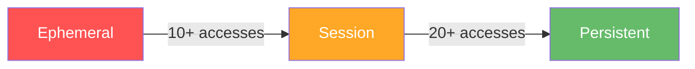
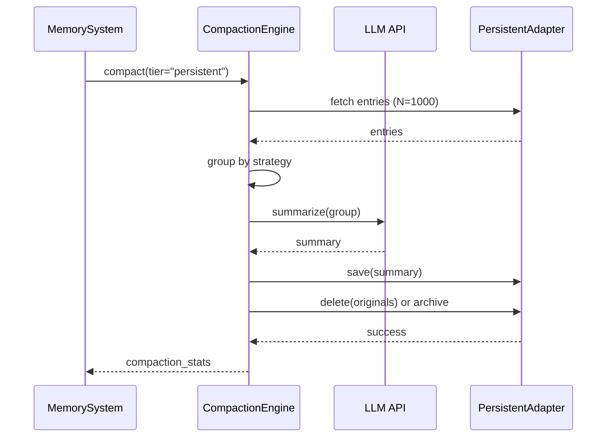
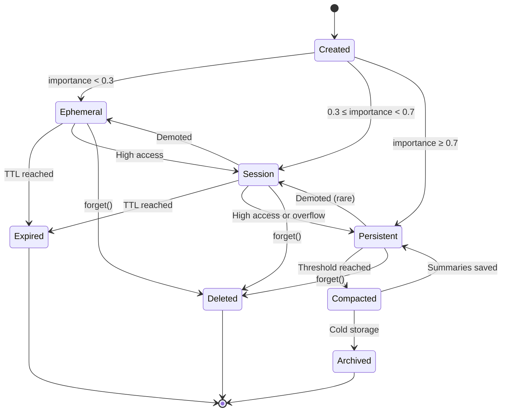

# Lifecycle

Understanding the complete lifecycle of memories in Axon - from creation through access, promotion, compaction, and eventual archival or deletion.

---

## Overview

Every memory in Axon goes through a **lifecycle** with distinct stages:



---

## Lifecycle Stages

### 1. Creation

Memories are created via `store()` operation.

```python
entry_id = await memory.store(
    text="User prefers dark mode",
    importance=0.8,
    tags=["preference", "ui"],
    metadata={"user_id": "123"}
)
```

**What Happens:**

1. **Validation**: Check required fields
2. **PII Detection**: Scan for sensitive data (if enabled)
3. **Embedding**: Generate vector representation
4. **Scoring**: Calculate initial importance score
5. **Tier Selection**: Router selects appropriate tier
6. **Storage**: Save to selected tier adapter
7. **Audit Log**: Record creation event (if enabled)

**Initial Metadata:**

```python
{
    "id": "mem_abc123",
    "importance": 0.8,
    "access_count": 0,
    "created_at": "2025-11-11T10:00:00Z",
    "last_accessed": None,
    "tags": ["preference", "ui"],
    "tier": "persistent"
}
```

---

### 2. Active State

Memory exists in a tier and can be accessed.

```python
# Memory is active in session tier
results = await memory.recall("user preferences", k=5)
```

**Characteristics:**

- Stored in adapter (Redis, ChromaDB, etc.)
- Searchable via semantic queries
- Metadata tracked (access count, timestamps)
- Subject to tier policies (TTL, capacity)

---

### 3. Access

Every `recall()` operation updates the memory's access metadata.

```python
# First access
results = await memory.recall("dark mode", k=1)
# access_count: 0 → 1
# last_accessed: None → 2025-11-11T10:05:00Z

# Second access
results = await memory.recall("dark mode", k=1)
# access_count: 1 → 2
# last_accessed: 2025-11-11T10:05:00Z → 2025-11-11T10:10:00Z
```

**Metadata Updates:**

```python
{
    "access_count": 2,
    "last_accessed": "2025-11-11T10:10:00Z",
    "access_timestamps": [
        "2025-11-11T10:05:00Z",
        "2025-11-11T10:10:00Z"
    ]
}
```

**Promotion Check:**

After each access, Router checks if promotion criteria are met:

```python
# After 15 accesses
if entry.metadata.access_count >= 10:
    score = await scoring_engine.calculate_score(entry)
    if score >= 0.7:
        # Promote to persistent tier
        await router.promote(entry.id, target_tier="persistent")
```

---

### 4. Promotion

Memories move to higher tiers based on access patterns.



**Promotion Flow:**

```python
# Stored in session tier initially
entry_id = await memory.store("Important fact", importance=0.5, tier="session")

# Access frequently
for i in range(25):
    await memory.recall("important fact", k=1)
    
    # After 20 accesses, router promotes
    if i == 20:
        # Automatic promotion to persistent
        print("Promoted to persistent tier!")
```

**What Happens During Promotion:**

1. **Score Calculation**: Recalculate importance score
2. **Eligibility Check**: Verify promotion criteria
3. **Target Tier**: Determine next higher tier
4. **Copy**: Store in target tier
5. **Delete**: Remove from source tier
6. **Update**: Update tier metadata
7. **Audit**: Log promotion event

---

### 5. TTL Expiration

Memories expire when their Time-To-Live (TTL) is reached.

```python
# Configure ephemeral with 60s TTL
config = MemoryConfig(
    ephemeral=EphemeralPolicy(
        adapter_type="redis",
        ttl_seconds=60  # Expire after 60 seconds
    )
)

memory = MemorySystem(config)

# Store with TTL
entry_id = await memory.store("Temporary data", importance=0.1, tier="ephemeral")

# Wait 61 seconds
await asyncio.sleep(61)

# Memory expired - not found
results = await memory.recall("temporary", tier="ephemeral")
assert len(results) == 0  # Expired!
```

**TTL by Tier:**

| Tier | Typical TTL | Expiration |
|------|-------------|------------|
| **Ephemeral** | 5s-1hr | Fast (Redis handles) |
| **Session** | 10min-1hr | Moderate |
| **Persistent** | None | Never (unless configured) |

---

### 6. Capacity Eviction

When tier reaches `max_entries`, overflow behavior applies.

```python
# Configure session with overflow
config = MemoryConfig(
    session=SessionPolicy(
        max_entries=100,
        overflow_to_persistent=True  # Promote oldest
    ),
    persistent=PersistentPolicy(
        adapter_type="chroma"
    )
)

memory = MemorySystem(config)

# Store 100 entries
for i in range(100):
    await memory.store(f"Entry {i}", importance=0.5, tier="session")

# Store 101st entry
await memory.store("Entry 101", importance=0.5, tier="session")

# Oldest entry promoted to persistent tier
# Session tier remains at 100 entries
```

**Overflow Strategies:**

| overflow_to_persistent | Behavior |
|------------------------|----------|
| `True` | Promote oldest entries to persistent |
| `False` | Evict oldest entries (deleted) |

---

### 7. Compaction

When persistent tier reaches `compaction_threshold`, memories are summarized and compressed.

```python
# Configure compaction
config = MemoryConfig(
    persistent=PersistentPolicy(
        compaction_threshold=10000,  # Compact at 10K entries
        compaction_strategy="importance"
    )
)

memory = MemorySystem(config)

# Store 10,000+ entries
for i in range(10001):
    await memory.store(f"Knowledge {i}", importance=0.8, tier="persistent")

# Automatic compaction triggered after 10,000th entry
# Or manual compaction
await memory.compact(tier="persistent", strategy="importance")
```

### Compaction Strategies

#### 1. Count-Based

Group entries by batch size:

```python
await memory.compact(tier="persistent", strategy="count")

# Groups entries into batches
# Summarizes each batch
# Example: 10,000 entries → 1,000 summaries (10:1 ratio)
```

#### 2. Importance-Based

Keep high-importance, summarize low-importance:

```python
await memory.compact(tier="persistent", strategy="importance")

# Keep: importance ≥ 0.8 (as-is)
# Summarize: 0.5 ≤ importance < 0.8
# Delete: importance < 0.5
```

#### 3. Semantic-Based

Group similar content:

```python
await memory.compact(tier="persistent", strategy="semantic")

# Cluster by semantic similarity
# Summarize each cluster
# Example: 100 similar facts → 1 comprehensive summary
```

#### 4. Time-Based

Compact oldest entries first:

```python
await memory.compact(tier="persistent", strategy="time")

# Sort by created_at
# Compact entries older than N days
# Recent entries untouched
```

### Compaction Flow



---

### 8. Archival

Long-term cold storage for old or compacted memories.

```python
# Configure archival
config = MemoryConfig(
    persistent=PersistentPolicy(
        adapter_type="pinecone",
        compaction_threshold=50000,
        archive_adapter="s3"  # Archive to S3
    )
)

memory = MemorySystem(config)

# When compaction runs:
# 1. Summarize groups of memories
# 2. Save summaries to Pinecone
# 3. Move originals to S3 (archive)
# 4. Mark as archived in metadata
```

**Archive Flow:**

```python
# Original entries in Pinecone
entries = [
    "Fact 1 about Python",
    "Fact 2 about Python", 
    "Fact 3 about Python"
]

# After compaction with archival:
# Pinecone: "Python is a programming language with facts 1, 2, 3 summarized"
# S3: Original 3 entries stored as JSON
```

---

### 9. Deletion (Forget)

Memories can be explicitly deleted:

```python
# Delete single entry
await memory.forget(entry_id)

# Delete by filter
await memory.forget(filter=Filter(tags=["temporary"]))

# Delete entire tier
await memory.forget(tier="ephemeral")
```

**What Happens:**

1. **Locate**: Find entries matching criteria
2. **Validate**: Check permissions (if enabled)
3. **Delete**: Remove from adapter storage
4. **Audit**: Log deletion event
5. **Cleanup**: Remove from caches

---

## Complete Lifecycle Example

```python
from axon import MemorySystem
from axon.core.templates import STANDARD_CONFIG
import asyncio

async def demonstrate_lifecycle():
    memory = MemorySystem(STANDARD_CONFIG)
    
    # 1. CREATION
    print("1. Creating memory...")
    entry_id = await memory.store(
        "User prefers dark mode in settings",
        importance=0.5,  # → Session tier
        tags=["preference", "ui"]
    )
    print(f"   Created: {entry_id} in session tier")
    
    # 2. ACTIVE STATE
    print("\n2. Memory active in session tier")
    results = await memory.recall("user preferences", tier="session")
    print(f"   Found: {len(results)} results")
    
    # 3. ACCESS (10 times to build score)
    print("\n3. Accessing memory multiple times...")
    for i in range(10):
        await memory.recall("dark mode preference", k=1)
    print(f"   Accessed 10 times, access_count=10")
    
    # 4. ACCESS (10 more times)
    print("\n4. Continue accessing...")
    for i in range(10):
        await memory.recall("dark mode preference", k=1)
    print(f"   Accessed 20 times total")
    
    # 5. PROMOTION CHECK
    print("\n5. Checking for promotion...")
    results = await memory.recall("dark mode", tier="persistent")
    if results:
        print(f"   ✓ Promoted to persistent tier!")
    else:
        print(f"   Not yet promoted (score may be below threshold)")
    
    # 6. COMPACTION (if threshold reached)
    stats = await memory.get_tier_stats("persistent")
    if stats["entry_count"] > 10000:
        print("\n6. Compacting persistent tier...")
        await memory.compact(tier="persistent", strategy="importance")
        print(f"   Compaction complete")
    
    # 7. DELETION
    print("\n7. Deleting memory...")
    await memory.forget(entry_id)
    print(f"   Deleted: {entry_id}")
    
    # 8. VERIFY DELETION
    results = await memory.recall("dark mode", k=10)
    print(f"   Search results: {len(results)} (should be 0)")

# Run demonstration
asyncio.run(demonstrate_lifecycle())
```

---

## Lifecycle States

### State Transitions



---

## Lifecycle Monitoring

### Track Lifecycle Events

```python
# Enable audit logging
memory.enable_audit()

# Operations are logged
await memory.store("Data", importance=0.5)  # Logged: STORE
await memory.recall("query", k=5)           # Logged: RECALL  
await memory.forget(entry_id)               # Logged: DELETE

# Get audit trail
events = await memory.get_audit_log(
    filter=Filter(tags=["user_123"]),
    start_date="2025-11-01",
    end_date="2025-11-11"
)

for event in events:
    print(f"{event.timestamp}: {event.operation} - {event.status}")
```

### Lifecycle Metrics

```python
# Get tier statistics
stats = await memory.get_tier_stats("session")

print(f"Total entries: {stats['entry_count']}")
print(f"Stores: {stats['stores']}")
print(f"Recalls: {stats['recalls']}")
print(f"Promotions: {stats['promotions']}")
print(f"Expirations: {stats['expirations']}")
print(f"Avg TTL remaining: {stats['avg_ttl_seconds']}s")
```

---

## Lifecycle Best Practices

### 1. Set Appropriate TTLs

```python
# ✓ Good: Match TTL to data lifetime
ephemeral: 30-300 seconds     # Very temporary
session: 600-3600 seconds     # Session duration
persistent: None              # Long-term

# ✗ Bad: Mismatched TTLs
ephemeral: 7200 seconds       # Use session instead
persistent: 300 seconds       # Defeats purpose
```

### 2. Enable Overflow Protection

```python
# ✓ Good: Prevent data loss
session = SessionPolicy(
    max_entries=1000,
    overflow_to_persistent=True  # Auto-promote
)

# ⚠️ Risky: May lose important data
session = SessionPolicy(
    max_entries=1000,
    overflow_to_persistent=False  # Evict oldest
)
```

### 3. Schedule Regular Compaction

```python
# ✓ Good: Proactive compaction
async def maintenance_task():
    while True:
        await asyncio.sleep(86400)  # Daily
        
        stats = await memory.get_tier_stats("persistent")
        if stats["entry_count"] > 8000:  # Before threshold
            await memory.compact(tier="persistent")

# ✗ Bad: Only react to threshold
# (May cause performance issues when triggered)
```

### 4. Monitor Lifecycle Health

```python
# ✓ Good: Track metrics
async def check_health():
    for tier in ["ephemeral", "session", "persistent"]:
        stats = await memory.get_tier_stats(tier)
        
        # Check for issues
        if stats["entry_count"] > stats["max_entries"] * 0.9:
            print(f"Warning: {tier} tier at 90% capacity")
        
        if stats["promotions"] / stats["stores"] > 0.5:
            print(f"Info: {tier} has high promotion rate")
```

---

## Advanced Lifecycle Features

### Transaction Support

Ensure atomic operations:

```python
# All-or-nothing store operations
async with memory.transaction():
    await memory.store("Entry 1", importance=0.5)
    await memory.store("Entry 2", importance=0.6)
    await memory.store("Entry 3", importance=0.7)
    # If any fails, all rollback
```

### Provenance Tracking

Track memory origins and transformations:

```python
# Store with provenance
entry_id = await memory.store(
    "Summarized from 100 documents",
    importance=0.8,
    metadata={
        "provenance": {
            "source": "compaction",
            "original_count": 100,
            "summarized_at": "2025-11-11T10:00:00Z"
        }
    }
)
```

### Custom Lifecycle Hooks

```python
class CustomMemorySystem(MemorySystem):
    async def on_store(self, entry: MemoryEntry):
        """Called after successful store."""
        print(f"Stored: {entry.id}")
    
    async def on_promote(self, entry_id: str, from_tier: str, to_tier: str):
        """Called after successful promotion."""
        print(f"Promoted {entry_id}: {from_tier} → {to_tier}")
    
    async def on_compact(self, tier: str, stats: dict):
        """Called after compaction."""
        print(f"Compacted {tier}: {stats}")
```

---

## Next Steps

<div class="grid cards" markdown>

-   :material-database:{ .lg .middle } **Storage Adapters**

    ---

    Learn about storage backends for each lifecycle stage.

    [:octicons-arrow-right-24: Adapter Guide](../adapters/overview.md)

-   :material-cog-outline:{ .lg .middle } **Advanced Features**

    ---

    Audit logging, transactions, and compaction details.

    [:octicons-arrow-right-24: Advanced Features](../advanced/audit.md)

-   :material-shield-check:{ .lg .middle } **Policies**

    ---

    Configure lifecycle rules and constraints.

    [:octicons-arrow-right-24: Policy Guide](policies.md)

-   :material-chart-line:{ .lg .middle } **Monitoring**

    ---

    Monitor lifecycle health in production.

    [:octicons-arrow-right-24: Monitoring Guide](../deployment/monitoring.md)

</div>
