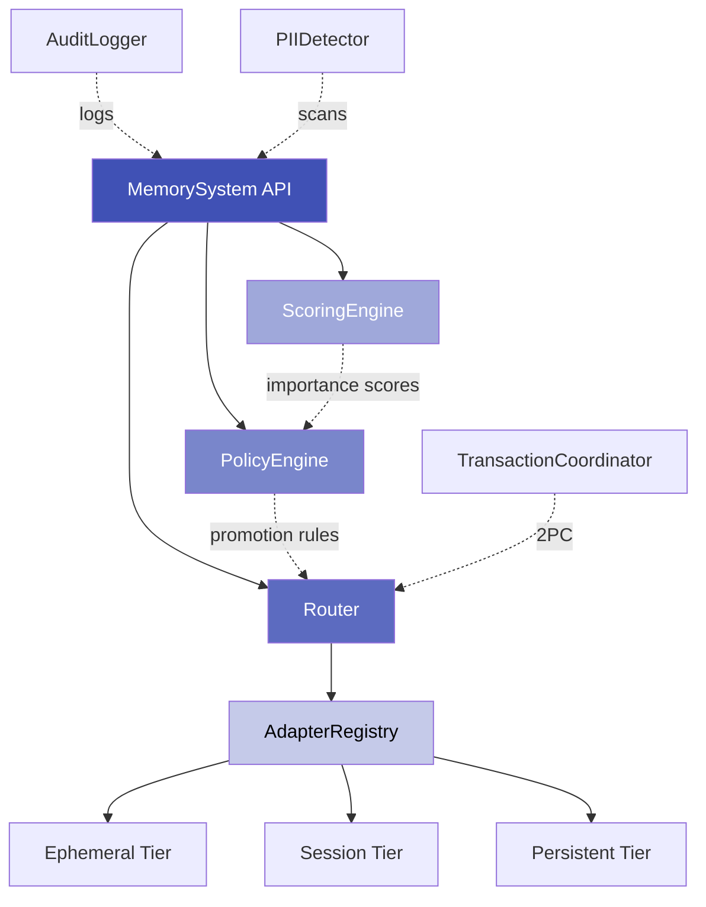
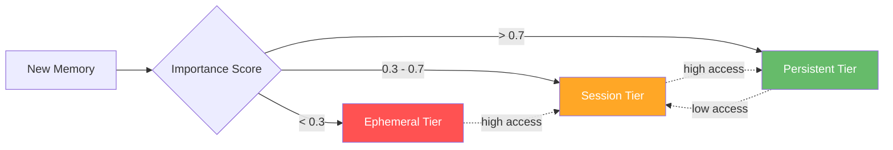
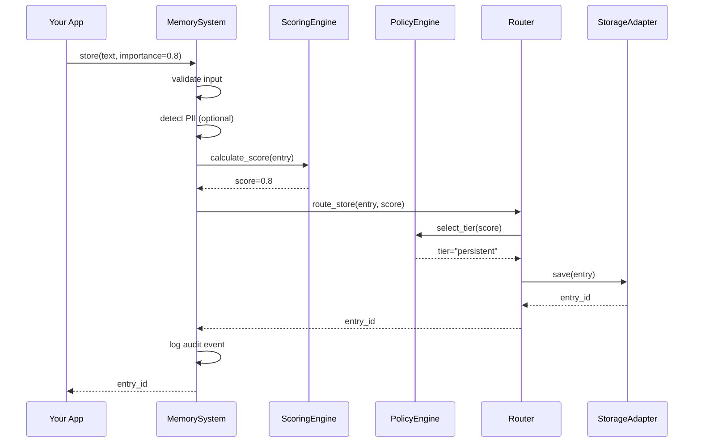
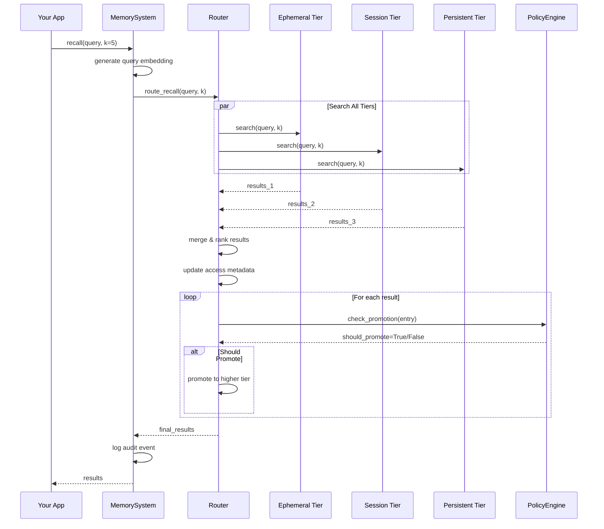
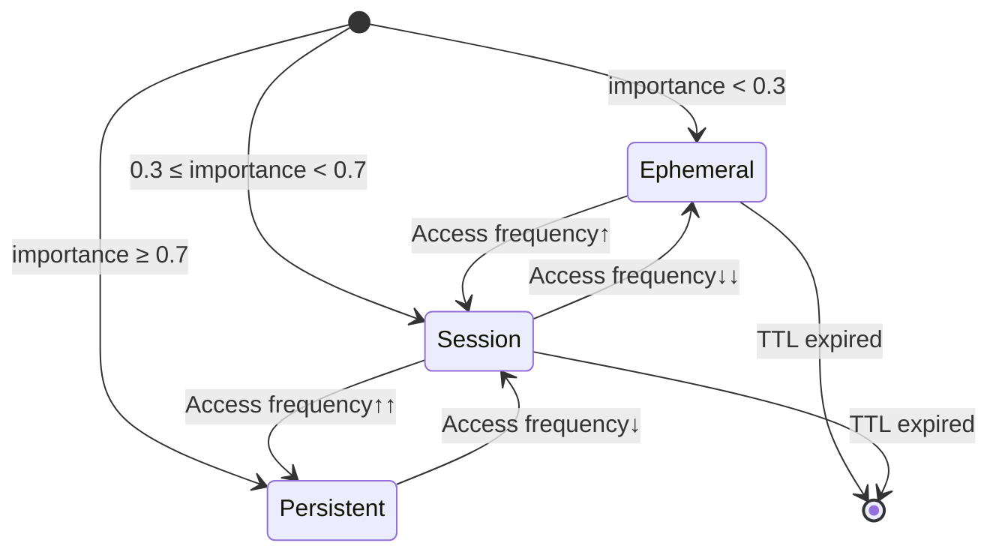

# Core Concepts

Understanding Axon's architecture, design philosophy, and how all the pieces work together.

---

## What is Axon?

**Axon** is an intelligent memory management system for LLM applications. It automatically organizes memories across multiple storage tiers, manages their lifecycle through policies, and provides semantic search with vector embeddings.

Think of it as a **smart memory hierarchy** - similar to how CPUs use L1/L2/L3 caches, Axon uses ephemeral/session/persistent tiers to balance speed, cost, and durability.

---

## Architecture Overview

Axon is built on **five core components** that work together:



### 1. MemorySystem

The **main API** that users interact with. Provides high-level methods:

```python
from axon import MemorySystem
from axon.core.templates import STANDARD_CONFIG

memory = MemorySystem(STANDARD_CONFIG)

# Store memories
entry_id = await memory.store("User prefers dark mode", importance=0.8)

# Recall memories semantically
results = await memory.recall("user preferences", k=5)

# Forget memories
await memory.forget(entry_id)

# Compact memories
await memory.compact(tier="session", strategy="importance")
```

**Responsibilities:**
- Input validation and error handling
- Coordinating Router, PolicyEngine, ScoringEngine
- Providing observability (tracing, logging, audit)
- Transaction management
- PII detection and privacy controls

---

### 2. Router

The **tier orchestrator** that routes operations to the right storage tier.

```python
# Router internally handles:
# 1. Determine target tier based on importance
# 2. Store/retrieve from appropriate adapter
# 3. Check for promotion/demotion eligibility
# 4. Update access metadata
```

**Routing Logic:**



**Key Features:**
- Automatic tier selection based on importance
- Multi-tier search with result merging
- Promotion on frequent access
- Demotion on inactivity
- Tier overflow handling

---

### 3. PolicyEngine

The **lifecycle manager** that enforces policies and makes promotion/demotion decisions.

```python
from axon.core.policies import EphemeralPolicy, SessionPolicy, PersistentPolicy

# Policies define constraints
ephemeral = EphemeralPolicy(
    adapter_type="redis",
    ttl_seconds=60  # Expire after 1 minute
)

session = SessionPolicy(
    adapter_type="redis",
    ttl_seconds=600,  # Expire after 10 minutes
    max_entries=1000,  # Capacity limit
    overflow_to_persistent=True  # Promote when full
)

persistent = PersistentPolicy(
    adapter_type="chroma",
    compaction_threshold=10000  # Compact at 10K entries
)
```

**Responsibilities:**
- Validate tier constraints (TTL, capacity, adapter types)
- Evaluate promotion eligibility
- Determine demotion triggers
- Schedule compaction
- Enforce eviction policies

---

### 4. ScoringEngine

The **importance calculator** that computes dynamic scores based on access patterns.

```python
# Scoring factors:
# 1. Base importance (user-provided)
# 2. Access frequency (how often recalled)
# 3. Recency (when last accessed)
# 4. Session continuity (access pattern)

score = await scoring_engine.calculate_score(entry)
# Returns value 0.0 to 1.0
```

**Scoring Formula:**

```
final_score = (base_importance × 0.5) + 
              (access_frequency × 0.3) + 
              (recency_score × 0.2)
```

**Use Cases:**
- Determine initial tier placement
- Trigger promotion/demotion
- Prioritize compaction candidates
- Influence search ranking

---

### 5. AdapterRegistry

The **storage abstraction layer** that manages connections to storage backends.

```python
# Registry manages adapters for each tier
registry = AdapterRegistry()

# Each tier can use different storage
registry.register("ephemeral", RedisAdapter(...))
registry.register("session", RedisAdapter(...))
registry.register("persistent", ChromaAdapter(...))
```

**Supported Adapters:**
- **InMemory** - Local RAM (development/testing)
- **Redis** - Fast distributed cache
- **ChromaDB** - Embedded vector database
- **Qdrant** - High-performance vector search
- **Pinecone** - Managed vector database

---

## Memory Flow

### Store Operation



**Steps:**
1. **Validate** - Check required fields, sanitize input
2. **PII Detection** - Scan for sensitive information (if enabled)
3. **Score** - Calculate importance score
4. **Route** - Determine target tier
5. **Store** - Save to storage adapter
6. **Audit** - Log operation for compliance
7. **Return** - Provide entry ID to caller

---

### Recall Operation



**Steps:**
1. **Embed** - Convert query text to vector
2. **Search** - Query all tiers in parallel
3. **Merge** - Combine results from all tiers
4. **Rank** - Sort by relevance (similarity score)
5. **Update** - Increment access counts, update timestamps
6. **Promote** - Check if results should move to higher tier
7. **Return** - Provide ranked results to caller

---

### Promotion/Demotion



**Promotion Triggers:**
- High access frequency (>10 accesses in short period)
- Score increase above tier threshold
- Tier overflow (session → persistent)

**Demotion Triggers:**
- Low access frequency (no access in long period)
- Score decrease below tier threshold
- Manual demotion request

---

## Design Principles

### 1. Async-First Architecture

All operations are async for high concurrency:

```python
# ✓ Async operations
entry_id = await memory.store("text")
results = await memory.recall("query")
await memory.forget(entry_id)

# ✗ No blocking operations
# entry_id = memory.store_sync("text")  # Doesn't exist
```

**Benefits:**
- Non-blocking I/O for database operations
- Handle thousands of concurrent requests
- Efficient resource utilization
- Compatible with async frameworks (FastAPI, aiohttp)

---

### 2. Policy-Driven Configuration

Policies define behavior, not code:

```python
# Define once, enforce everywhere
config = MemoryConfig(
    ephemeral=EphemeralPolicy(ttl_seconds=60),
    session=SessionPolicy(ttl_seconds=600, max_entries=1000),
    persistent=PersistentPolicy(compaction_threshold=10000)
)

# System enforces policies automatically
memory = MemorySystem(config)
```

**Benefits:**
- Declarative configuration
- Runtime validation
- Easy to test and modify
- Clear separation of concerns

---

### 3. Storage Agnostic

Swap storage backends without changing code:

```python
# Development: All in-memory
from axon.core.templates import DEVELOPMENT_CONFIG
memory = MemorySystem(DEVELOPMENT_CONFIG)

# Production: Redis + Pinecone
from axon.core.templates import PRODUCTION_CONFIG
memory = MemorySystem(PRODUCTION_CONFIG)

# API stays the same!
await memory.store("text")
results = await memory.recall("query")
```

**Benefits:**
- Easy local development
- Flexible deployment options
- Vendor independence
- Cost optimization (use cheaper storage for less important data)

---

### 4. Observability Built-In

Complete visibility into operations:

```python
# Audit logging
memory.enable_audit()  # GDPR/HIPAA compliance

# Structured logging
memory.set_log_level("DEBUG")

# Tracing
trace = await memory.store("text", trace=True)
print(f"Duration: {trace.duration_ms}ms")
print(f"Tier: {trace.tier}")

# Metrics (via logging)
# - Operation counts
# - Latencies
# - Tier distribution
# - Promotion/demotion rates
```

**Benefits:**
- Production debugging
- Performance monitoring
- Compliance audit trails
- Usage analytics

---

### 5. Type Safety

Full type hints and Pydantic validation:

```python
from axon import MemorySystem
from axon.core.config import MemoryConfig
from axon.models.entry import MemoryEntry

# Type-checked at runtime
memory: MemorySystem = MemorySystem(config)

# Pydantic validation
entry = MemoryEntry(
    text="User prefers dark mode",
    metadata={"importance": 0.8}  # Validated 0.0-1.0
)

# IDE autocomplete and type checking
results: list[MemoryEntry] = await memory.recall("query")
```

**Benefits:**
- Catch errors early (IDE warnings)
- Better code completion
- Self-documenting APIs
- Runtime validation

---

## Key Concepts Summary

| Concept | Purpose | Example |
|---------|---------|---------|
| **Tiers** | Storage hierarchy (ephemeral/session/persistent) | Short-term cache → Long-term knowledge |
| **Policies** | Define tier behavior and constraints | TTL, capacity, overflow rules |
| **Router** | Route operations to correct tier | Importance 0.8 → Persistent tier |
| **Scoring** | Calculate dynamic importance | Access frequency → Higher score |
| **Adapters** | Storage backend abstraction | Redis, ChromaDB, Qdrant, Pinecone |
| **Promotion** | Move to higher tier | Session → Persistent on high access |
| **Demotion** | Move to lower tier | Persistent → Session on low access |
| **Compaction** | Summarize and compress | 1000 entries → 100 summaries |

---

## Common Patterns

### Pattern 1: Importance-Based Routing

```python
# Low importance → Ephemeral (cache)
await memory.store("User clicked button", importance=0.1)

# Medium importance → Session
await memory.store("User viewed product page", importance=0.5)

# High importance → Persistent
await memory.store("User purchased premium plan", importance=0.9)
```

---

### Pattern 2: Semantic Recall with Filters

```python
# Search with metadata filtering
results = await memory.recall(
    "user preferences",
    k=10,
    filter=Filter(
        tags=["preference"],
        min_importance=0.5,
        max_age_seconds=86400  # Last 24 hours
    )
)
```

---

### Pattern 3: Session Management

```python
# Store session context
session_id = "user-123-session-456"

await memory.store(
    "User is browsing electronics",
    importance=0.5,
    tags=["session", session_id],
    tier="session"
)

# Recall session memories
results = await memory.recall(
    "current activity",
    filter=Filter(tags=[session_id]),
    tier="session"
)

# Clean up session on logout
await memory.forget(filter=Filter(tags=[session_id]))
```

---

### Pattern 4: Knowledge Base with Compaction

```python
# Add facts to knowledge base
for fact in knowledge_facts:
    await memory.store(
        fact,
        importance=0.8,
        tags=["knowledge", "verified"],
        tier="persistent"
    )

# Compact when threshold reached
stats = await memory.get_tier_stats("persistent")
if stats["entry_count"] > 10000:
    await memory.compact(
        tier="persistent",
        strategy="semantic"  # Group similar content
    )
```

---

## Next Steps

Now that you understand the architecture, dive deeper into each component:

<div class="grid cards" markdown>

-   :material-layers-triple:{ .lg .middle } **Memory Tiers**

    ---

    Deep dive into ephemeral, session, and persistent tiers.

    [:octicons-arrow-right-24: Learn About Tiers](tiers.md)

-   :material-shield-check:{ .lg .middle } **Policies**

    ---

    Configure lifecycle rules, constraints, and validation.

    [:octicons-arrow-right-24: Policy Guide](policies.md)

-   :material-router:{ .lg .middle } **Routing**

    ---

    Understand tier selection and promotion/demotion logic.

    [:octicons-arrow-right-24: Routing Details](routing.md)

-   :material-autorenew:{ .lg .middle } **Lifecycle**

    ---

    Memory lifecycle from creation to archival.

    [:octicons-arrow-right-24: Lifecycle Guide](lifecycle.md)

</div>
# Correct
await system.store("memory")

# Wrong
system.store("memory")  # Returns coroutine, doesn't execute
```

### 2. Fail-Fast

Invalid inputs raise exceptions immediately:

```python
# Raises ValueError
await system.store("", importance=0.8)  # Empty content

await system.recall("query", k=0)  # Invalid k
```

### 3. Explicit > Implicit

Always prefer explicit configuration:

```python
# Explicit tier
await system.store("data", tier="persistent")

# Explicit importance
await system.store("data", importance=0.8)
```

### 4. Composability

Components can be mixed and matched:

```python
# Custom adapter + policy
registry.register("custom", MyAdapter())
config.tiers["custom"] = MyPolicy()
```

## Next Steps

- [Memory Tiers](tiers.md) - Deep dive into tier architecture
- [Policies](policies.md) - Learn about policy configuration
- [Routing](routing.md) - Understand tier selection logic
