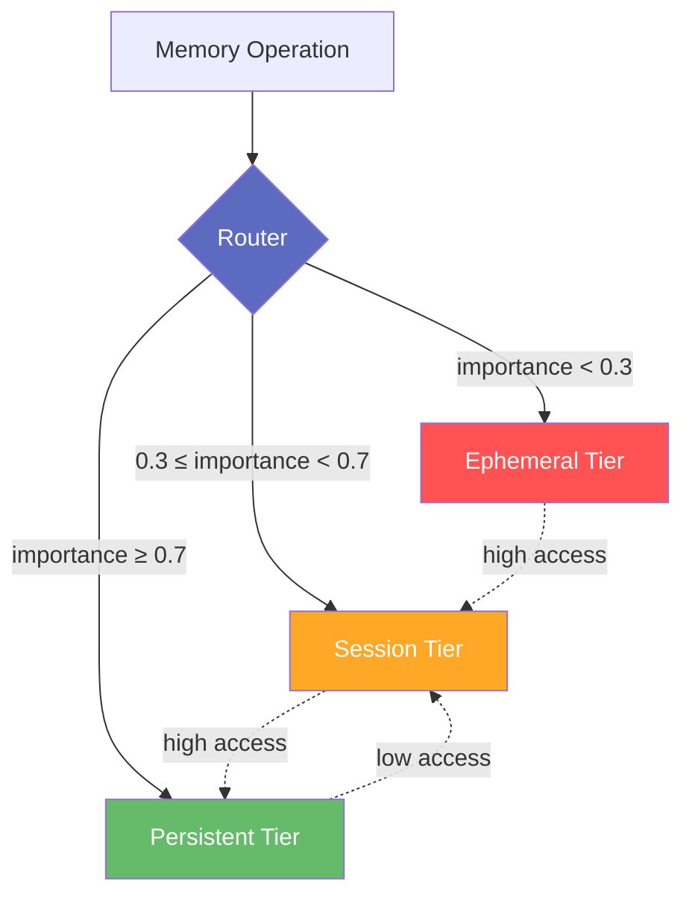
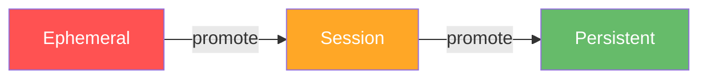
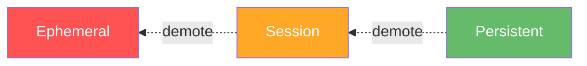
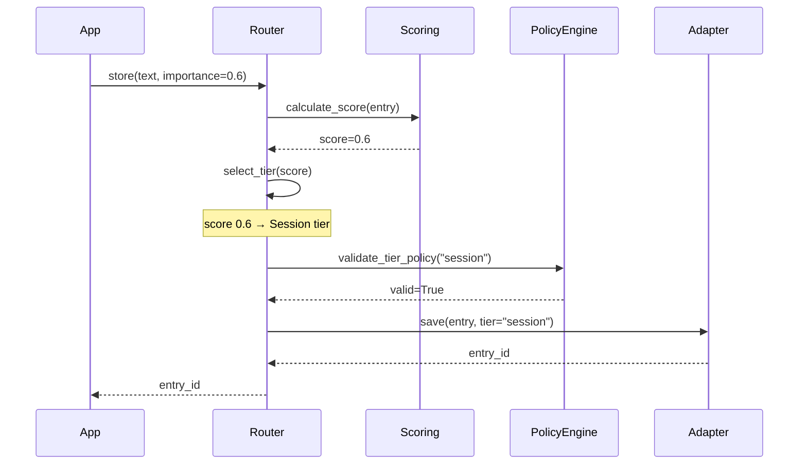

# Routing

Understanding tier selection, importance scoring, and promotion/demotion logic in Axon's intelligent routing system.

---

## Overview

The **Router** is Axon's traffic controller - it decides which tier should handle each memory operation based on importance scores, access patterns, and policy rules.



---

## Tier Selection

### Importance-Based Routing

By default, the Router uses **importance scores** to select tiers:

```python
# Low importance → Ephemeral
await memory.store("User clicked button", importance=0.1)  # → ephemeral

# Medium importance → Session
await memory.store("User viewed page", importance=0.5)     # → session

# High importance → Persistent
await memory.store("User purchased item", importance=0.9)  # → persistent
```

**Default Thresholds:**

| Importance | Tier | Use Case |
|------------|------|----------|
| `< 0.3` | Ephemeral | Temporary cache, rate limits |
| `0.3 - 0.7` | Session | Conversations, workspace |
| `≥ 0.7` | Persistent | Knowledge, preferences |

### Explicit Tier Hints

Override automatic routing by specifying a tier:

```python
# Force to specific tier
await memory.store(
    "Temporary cache entry",
    importance=0.9,  # Would normally go to persistent
    tier="ephemeral"  # But forced to ephemeral
)
```

### Fallback Logic

If the selected tier doesn't exist:

```python
config = MemoryConfig(
    session=SessionPolicy(...),
    persistent=PersistentPolicy(...),
    # No ephemeral tier configured
    default_tier="session"
)

# Tries ephemeral (doesn't exist) → Falls back to session
await memory.store("text", importance=0.1)  # → session (fallback)
```

---

## Importance Scoring

### ScoringEngine

The **ScoringEngine** calculates dynamic importance scores based on multiple factors:

```python
score = await scoring_engine.calculate_score(entry)
# Returns 0.0 to 1.0
```

**Scoring Formula:**

```
final_score = (base_importance × 0.50) + 
              (access_frequency × 0.30) + 
              (recency_score × 0.20)
```

### Scoring Factors

#### 1. Base Importance (Weight: 0.50)

User-provided initial importance:

```python
await memory.store("User preference", importance=0.8)
# base_importance = 0.8
```

#### 2. Access Frequency (Weight: 0.30)

How often the memory is accessed:

```python
# First store
entry_id = await memory.store("Document title")

# Access 10 times
for _ in range(10):
    await memory.recall("document")

# Frequency score increases → May trigger promotion
```

**Formula:**

```python
frequency_score = min(1.0, access_count / 100)
# Caps at 100 accesses for score of 1.0
```

#### 3. Recency Score (Weight: 0.20)

How recently the memory was accessed:

```python
# Recent access → Higher recency score
# Old access → Lower recency score (exponential decay)

recency_score = exp(-time_since_access / half_life)
# half_life = 24 hours by default
```

### Score Evolution Example

```python
# Initial store
entry_id = await memory.store("Important fact", importance=0.6)
# Score: 0.6 × 0.50 = 0.30 → Session tier

# After 5 accesses in 1 hour
score = 0.6 × 0.50 + (5/100) × 0.30 + 0.9 × 0.20
     = 0.30 + 0.015 + 0.18
     = 0.495 → Still session

# After 15 accesses in 2 hours
score = 0.6 × 0.50 + (15/100) × 0.30 + 0.8 × 0.20
     = 0.30 + 0.045 + 0.16
     = 0.505 → Still session

# After 50 accesses in 3 hours
score = 0.6 × 0.50 + (50/100) × 0.30 + 0.7 × 0.20
     = 0.30 + 0.15 + 0.14
     = 0.590 → Still session

# After 100 accesses in 4 hours
score = 0.6 × 0.50 + (100/100) × 0.30 + 0.65 × 0.20
     = 0.30 + 0.30 + 0.13
     = 0.73 → Promoted to persistent!
```

---

## Promotion

**Promotion** moves memories from lower tiers to higher tiers.

### Promotion Triggers

1. **High Importance Score** (≥0.7)
2. **Frequent Access** (>10 accesses in short period)
3. **Tier Overflow** (session tier full with overflow enabled)
4. **Capacity Pressure** (tier approaching max_entries)

### Promotion Path



Memories can only promote **one tier at a time**:
- Ephemeral → Session
- Session → Persistent
- (No direct Ephemeral → Persistent)

### Promotion Example

```python
# Store in session tier
entry_id = await memory.store(
    "User likes dark mode",
    importance=0.5,
    tier="session"
)

# Access frequently
for _ in range(20):
    results = await memory.recall("dark mode preferences", k=1)

# Router detects high access frequency
# Automatically promotes to persistent tier

# Verify promotion
result = await memory.recall("dark mode", tier="persistent")
assert len(result) > 0  # Found in persistent!
```

### Manual Promotion

Force promotion explicitly:

```python
# Get entry from session
results = await memory.recall("important fact", tier="session")
entry = results[0]

# Promote to persistent
await memory.promote(entry.id, target_tier="persistent")
```

---

## Demotion

**Demotion** moves memories from higher tiers to lower tiers (less common).

### Demotion Triggers

1. **Low Importance Score** (<0.3)
2. **Infrequent Access** (no access in 30+ days)
3. **Manual Demotion** (explicit request)
4. **Capacity Relief** (free up higher tier space)

### Demotion Path



### Demotion Example

```python
# Enable demotion in config
config = MemoryConfig(
    ephemeral=EphemeralPolicy(...),
    session=SessionPolicy(...),
    persistent=PersistentPolicy(...),
    enable_demotion=True  # Enable demotion
)

memory = MemorySystem(config)

# Store in persistent
entry_id = await memory.store("Old fact", importance=0.8, tier="persistent")

# Never accessed for 60 days
await asyncio.sleep(60 * 24 * 3600)  # Simulate time

# Router detects staleness
# Automatically demotes to session tier
```

**Note:** Demotion is **disabled by default** because TTL expiration is usually preferred.

---

## Multi-Tier Recall

The Router can search **multiple tiers simultaneously** and merge results.

### Search All Tiers

```python
# Search across all tiers
results = await memory.recall("user preferences", k=10)

# Results merged from:
# - Ephemeral tier (if configured)
# - Session tier (if configured)
# - Persistent tier (if configured)

# Sorted by similarity score (descending)
for result in results:
    print(f"{result.text} (similarity: {result.similarity:.2f})")
```

### Search Specific Tier

```python
# Search only persistent tier
results = await memory.recall(
    "long-term knowledge",
    tier="persistent",
    k=5
)
```

### Result Merging

When searching multiple tiers:

1. **Query each tier** with embedding
2. **Collect results** from all tiers
3. **Merge results** by similarity score
4. **Deduplicate** (same entry in multiple tiers)
5. **Sort** by similarity (descending)
6. **Limit** to k results

```python
# Pseudo-code for multi-tier search
results = []

for tier in ["ephemeral", "session", "persistent"]:
    tier_results = await adapter.search(query_embedding, k=k)
    results.extend(tier_results)

# Merge and deduplicate
unique_results = deduplicate_by_id(results)

# Sort by similarity
unique_results.sort(key=lambda x: x.similarity, reverse=True)

# Return top k
return unique_results[:k]
```

---

## Access Pattern Tracking

The Router tracks access patterns to make intelligent promotion decisions.

### Metadata Updates

Every `recall` operation updates:

```python
entry.metadata.access_count += 1
entry.metadata.last_accessed = datetime.now()
entry.metadata.access_timestamps.append(datetime.now())
```

### Access Velocity

Recent access frequency:

```python
# Calculate accesses in last N hours
recent_window = 24  # hours
recent_accesses = [
    ts for ts in entry.metadata.access_timestamps
    if (now - ts).total_seconds() < recent_window * 3600
]

access_velocity = len(recent_accesses) / recent_window
# Accesses per hour
```

### Access Patterns

Different access patterns lead to different routing decisions:

#### Pattern 1: Bursty Access

```python
# Many accesses in short time → Promote quickly
for _ in range(20):
    await memory.recall("hot topic", k=1)

# Promotes to higher tier rapidly
```

#### Pattern 2: Steady Access

```python
# Regular access over time → Gradual promotion
for day in range(30):
    await memory.recall("regular topic", k=1)
    await asyncio.sleep(86400)  # 1 day

# Promotes after consistent access
```

#### Pattern 3: Declining Access

```python
# Initial high access, then drops → May demote
for _ in range(50):
    await memory.recall("fading topic", k=1)

# Wait 60 days with no access
await asyncio.sleep(60 * 86400)

# May demote due to staleness (if demotion enabled)
```

---

## Routing Configuration

### Configurable Options

```python
config = MemoryConfig(
    ephemeral=EphemeralPolicy(...),
    session=SessionPolicy(...),
    persistent=PersistentPolicy(...),
    
    # Routing behavior
    default_tier="session",      # Tier for neutral importance (0.5)
    enable_promotion=True,       # Auto-promote on high access
    enable_demotion=False        # Auto-demote on low access (usually False)
)
```

### Custom Scoring Weights

```python
from axon.core.scoring import ScoringConfig

scoring_config = ScoringConfig(
    # Promotion weights (must sum to ~1.0)
    promotion_frequency_weight=0.40,   # Emphasize frequency
    promotion_importance_weight=0.30,  # De-emphasize base importance
    promotion_recency_weight=0.20,
    promotion_velocity_weight=0.10,
    
    # Thresholds
    promotion_threshold=0.65,  # Lower threshold → Easier promotion
    demotion_threshold=0.40    # Higher threshold → Harder demotion
)

scoring_engine = ScoringEngine(config=scoring_config)
```

---

## Routing Best Practices

### 1. Use Appropriate Importance Scores

```python
# ✓ Good: Match importance to data value
await memory.store("API cache", importance=0.1)          # Ephemeral
await memory.store("Conversation turn", importance=0.5)  # Session
await memory.store("User profile", importance=0.9)       # Persistent

# ✗ Bad: Everything high importance
await memory.store("Temporary data", importance=0.9)     # Wrong tier!
```

### 2. Enable Promotion, Disable Demotion

```python
# ✓ Recommended
config = MemoryConfig(
    enable_promotion=True,   # Let important data rise
    enable_demotion=False    # Let TTL handle expiration
)

# ⚠️ Use with caution
config = MemoryConfig(
    enable_demotion=True  # May demote too aggressively
)
```

### 3. Let Router Decide Tier

```python
# ✓ Good: Trust router's decision
await memory.store("Some data", importance=0.6)

# ⚠️ Only override when necessary
await memory.store("Must be in persistent", importance=0.6, tier="persistent")
```

### 4. Monitor Routing Metrics

```python
# Get tier statistics
stats = await memory.get_tier_stats("session")
print(f"Entries: {stats['entry_count']}")
print(f"Promotions: {stats['promotions']}")
print(f"Demotions: {stats['demotions']}")

# Check promotion rates
promo_rate = stats['promotions'] / stats['entry_count']
if promo_rate > 0.5:
    print("High promotion rate - consider adjusting thresholds")
```

---

## Advanced Routing

### Conditional Routing

Route based on metadata:

```python
# Route based on tags
async def smart_store(text: str, tags: list[str]):
    if "critical" in tags:
        tier = "persistent"
        importance = 0.9
    elif "temp" in tags:
        tier = "ephemeral"
        importance = 0.1
    else:
        tier = None  # Let router decide
        importance = 0.5
    
    return await memory.store(text, importance=importance, tier=tier, tags=tags)
```

### Routing Policies

Create custom routing logic:

```python
class CustomRouter(Router):
    async def select_tier(self, entry: MemoryEntry) -> str:
        # Custom logic
        if "user_id" in entry.metadata.tags:
            return "persistent"  # User data always persistent
        
        if entry.metadata.importance > 0.8:
            return "persistent"
        elif entry.metadata.importance > 0.4:
            return "session"
        else:
            return "ephemeral"
```

---

## Routing Flow Diagram

Complete flow for a store operation:



---

## Next Steps

<div class="grid cards" markdown>

-   :material-autorenew:{ .lg .middle } **Lifecycle**

    ---

    Memory lifecycle from creation to archival.

    [:octicons-arrow-right-24: Lifecycle Guide](lifecycle.md)

-   :material-shield-check:{ .lg .middle } **Policies**

    ---

    Configure tier policies and constraints.

    [:octicons-arrow-right-24: Policy Guide](policies.md)

-   :material-layers-triple:{ .lg .middle } **Memory Tiers**

    ---

    Deep dive into each tier's characteristics.

    [:octicons-arrow-right-24: Tier Details](tiers.md)

-   :material-chart-line:{ .lg .middle } **Performance**

    ---

    Optimize routing for performance.

    [:octicons-arrow-right-24: Performance Guide](../deployment/performance.md)

</div>
