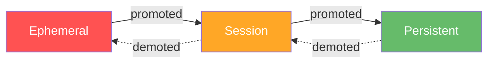
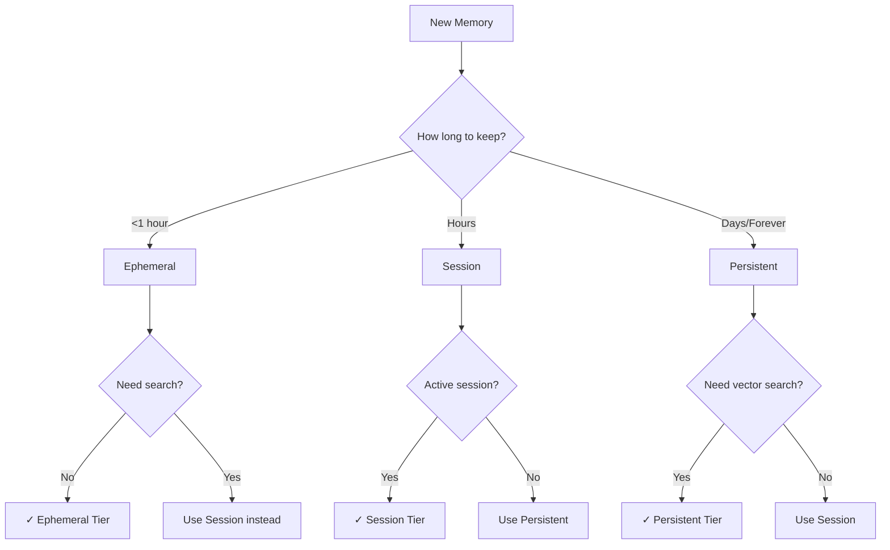

# Memory Tiers

Deep dive into Axon's three-tier memory architecture: ephemeral, session, and persistent tiers.

---

## Overview

Axon organizes memories into **three tiers**, each with different characteristics for storage duration, access speed, and cost:



| Tier | Duration | Storage | Use Case | TTL |
|------|----------|---------|----------|-----|
| **Ephemeral** | Seconds-Minutes | Redis/Memory | Cache, rate limits | 5s-1hr |
| **Session** | Minutes-Hours | Redis/Vector DBs | Conversations, workspace | ≥60s |
| **Persistent** | Days-Forever | Vector DBs | Knowledge base | None/Long |

---

## Ephemeral Tier

The **ephemeral tier** is for very short-lived, high-volume data that should expire quickly.

### Characteristics

- **Duration**: 5 seconds to 1 hour
- **Storage**: Redis or InMemory only
- **Eviction**: TTL-based (automatic expiration)
- **Vector Search**: Disabled (not needed)
- **Access Pattern**: Very frequent, short-lived

### When to Use

✅ **Good For:**
- Rate limiting tokens
- One-time verification codes (OTP)
- Temporary feature flags
- Recent activity tracking (last 5 minutes)
- Short-term cache warming
- API request de-duplication
- Temporary session markers

❌ **Not Good For:**
- Conversation history (use session)
- User preferences (use persistent)
- Anything needing vector search
- Data that must survive restarts

### Configuration

```python
from axon.core.policies import EphemeralPolicy

ephemeral = EphemeralPolicy(
    adapter_type="redis",  # or "memory"
    ttl_seconds=60         # 5-3600 seconds
)
```

**Constraints:**
- `adapter_type`: Only `"redis"` or `"memory"`
- `ttl_seconds`: Between 5 and 3600 (1 hour max)
- `eviction_strategy`: Always `"ttl"` (cannot be changed)
- `enable_vector_search`: Always `False` (cannot be enabled)

### Example Usage

```python
from axon import MemorySystem
from axon.core.config import MemoryConfig
from axon.core.policies import EphemeralPolicy

# Configure ephemeral-only system
config = MemoryConfig(
    ephemeral=EphemeralPolicy(
        adapter_type="redis",
        ttl_seconds=300  # 5 minutes
    ),
    default_tier="ephemeral"
)

memory = MemorySystem(config)

# Store temporary data
await memory.store(
    "Rate limit: user_123 made 5 requests",
    importance=0.1,
    tier="ephemeral",
    tags=["rate-limit", "user_123"]
)

# Automatically expires after 5 minutes
await asyncio.sleep(301)
result = await memory.recall("rate limit user_123", tier="ephemeral")
# Returns [] - data expired
```

### Real-World Use Cases

#### 1. Rate Limiting

```python
# Track API request counts
user_id = "user_123"
key = f"rate_limit:{user_id}"

# Store request count
await memory.store(
    f"Request count: 1",
    importance=0.1,
    tier="ephemeral",
    tags=[key]
)

# Check rate limit
results = await memory.recall(key, tier="ephemeral")
if len(results) > 100:  # Max 100 requests per minute
    raise RateLimitExceeded()
```

#### 2. OTP Codes

```python
# Generate and store OTP
otp_code = "123456"
email = "user@example.com"

await memory.store(
    f"OTP for {email}: {otp_code}",
    importance=0.1,
    tier="ephemeral",
    tags=["otp", email]
)

# Verify OTP (within 60 seconds)
results = await memory.recall(f"OTP {email}", tier="ephemeral")
if results and otp_code in results[0].text:
    print("OTP valid!")
```

#### 3. Recent Activity Tracking

```python
# Track last 5 minutes of activity
await memory.store(
    f"User {user_id} clicked 'Add to Cart' button",
    importance=0.2,
    tier="ephemeral",
    tags=["activity", user_id]
)

# Get recent activity
recent = await memory.recall(
    f"user {user_id} activity",
    tier="ephemeral",
    k=10
)
```

---

## Session Tier

The **session tier** stores memories for the duration of a user session, typically minutes to hours.

### Characteristics

- **Duration**: Minutes to hours (≥60 seconds)
- **Storage**: Redis, InMemory, or Vector DBs
- **Eviction**: TTL-based or capacity-based
- **Vector Search**: Optional (adapter-dependent)
- **Access Pattern**: Moderate frequency, session-scoped

### When to Use

✅ **Good For:**
- Conversation history (chatbots)
- Active workspace state
- Recent user interactions
- Shopping cart data
- Session-specific preferences
- Temporary project data
- Active document context

❌ **Not Good For:**
- Very short-lived data (use ephemeral)
- Long-term knowledge (use persistent)
- Data that must survive server restarts
- Cross-session data

### Configuration

```python
from axon.core.policies import SessionPolicy

session = SessionPolicy(
    adapter_type="redis",              # redis, memory, chroma, qdrant, pinecone
    ttl_seconds=1800,                  # 30 minutes (≥60s)
    max_entries=1000,                  # Capacity limit
    overflow_to_persistent=True,       # Auto-promote when full
    enable_vector_search=False         # If adapter supports it
)
```

**Constraints:**
- `adapter_type`: Any adapter (`"redis"`, `"memory"`, `"chroma"`, `"qdrant"`, `"pinecone"`)
- `ttl_seconds`: ≥60 seconds or `None`
- `max_entries`: ≥10 or `None`
- `overflow_to_persistent`: `True` or `False`
- `enable_vector_search`: `True` or `False` (adapter-dependent)

### Example Usage

```python
from axon.core.templates import STANDARD_CONFIG

memory = MemorySystem(STANDARD_CONFIG)

# Store conversation turns
await memory.store(
    "User: What's the weather today?",
    importance=0.5,
    tier="session",
    tags=["conversation", session_id]
)

await memory.store(
    "Assistant: It's sunny and 72°F",
    importance=0.5,
    tier="session",
    tags=["conversation", session_id]
)

# Recall conversation history
history = await memory.recall(
    "conversation",
    tier="session",
    filter=Filter(tags=[session_id]),
    k=10
)

# History expires after session TTL (e.g., 30 minutes)
```

### Overflow Behavior

When `overflow_to_persistent=True`:

```python
session = SessionPolicy(
    max_entries=100,
    overflow_to_persistent=True
)

# Store 101st entry
await memory.store("Important fact", importance=0.6, tier="session")

# Automatically promoted to persistent tier
# Session tier remains at 100 entries
```

### Real-World Use Cases

#### 1. Chatbot Conversation

```python
# Store conversation context
session_id = f"session_{user_id}_{timestamp}"

async def store_turn(role: str, content: str):
    await memory.store(
        f"{role}: {content}",
        importance=0.5,
        tier="session",
        tags=["conversation", session_id, role]
    )

# Store turns
await store_turn("user", "What's the capital of France?")
await store_turn("assistant", "The capital of France is Paris.")

# Recall recent conversation
history = await memory.recall(
    "conversation",
    tier="session",
    filter=Filter(tags=[session_id]),
    k=10
)

# Build prompt context
context = "\n".join([entry.text for entry in history])
```

#### 2. Active Workspace

```python
# Track currently open documents
await memory.store(
    "User opened document: project_proposal.docx",
    importance=0.4,
    tier="session",
    tags=["workspace", user_id]
)

# Track recent edits
await memory.store(
    "User edited section 'Budget' in project_proposal.docx",
    importance=0.5,
    tier="session",
    tags=["workspace", user_id, "edit"]
)

# Get workspace state
workspace = await memory.recall(
    "current workspace",
    tier="session",
    filter=Filter(tags=["workspace", user_id]),
    k=20
)
```

#### 3. Shopping Cart with Overflow

```python
config = MemoryConfig(
    session=SessionPolicy(
        adapter_type="redis",
        ttl_seconds=1800,  # 30 minutes
        max_entries=50,
        overflow_to_persistent=True  # Save to wishlist
    ),
    persistent=PersistentPolicy(adapter_type="chroma"),
    default_tier="session"
)

memory = MemorySystem(config)

# Add items to cart
await memory.store(
    "Product: Wireless Mouse, Price: $25",
    importance=0.6,
    tier="session",
    tags=["cart", user_id]
)

# When session tier reaches 50 items,
# automatically overflow to persistent (wishlist)
```

---

## Persistent Tier

The **persistent tier** stores long-term memories indefinitely with semantic search capabilities.

### Characteristics

- **Duration**: Days to forever
- **Storage**: Vector DBs (ChromaDB, Qdrant, Pinecone)
- **Eviction**: Manual compaction or archival
- **Vector Search**: Always enabled
- **Access Pattern**: Less frequent, long-term storage

### When to Use

✅ **Good For:**
- Long-term knowledge base
- User history and preferences
- Learned facts and insights
- Important conversations
- Permanent records
- Training data
- Compliance records

❌ **Not Good For:**
- Temporary data (use ephemeral/session)
- High-volume cache (use ephemeral)
- Data that changes frequently
- Very short-lived information

### Configuration

```python
from axon.core.policies import PersistentPolicy

persistent = PersistentPolicy(
    adapter_type="chroma",                    # chroma, qdrant, pinecone, memory
    ttl_seconds=None,                         # No expiration
    compaction_threshold=10000,               # Compact at 10K entries
    compaction_strategy="importance",         # count, semantic, importance, time
    enable_vector_search=True,                # Always True
    archive_adapter=None                      # Optional: s3, gcs
)
```

**Constraints:**
- `adapter_type`: `"chroma"`, `"qdrant"`, `"pinecone"`, or `"memory"` (testing only)
- `ttl_seconds`: Usually `None` (no expiration) or very long
- `compaction_threshold`: ≥100 or `None`
- `compaction_strategy`: `"count"`, `"semantic"`, `"importance"`, or `"time"`
- `enable_vector_search`: Always `True` (cannot be disabled)
- `archive_adapter`: Optional cold storage adapter

### Example Usage

```python
from axon.core.templates import PRODUCTION_CONFIG

memory = MemorySystem(PRODUCTION_CONFIG)

# Store long-term knowledge
await memory.store(
    "User prefers dark mode UI",
    importance=0.8,
    tier="persistent",
    tags=["preference", "ui", user_id]
)

await memory.store(
    "User's birthday is March 15, 1990",
    importance=0.9,
    tier="persistent",
    tags=["profile", user_id]
)

# Semantic recall (works forever)
prefs = await memory.recall(
    "user UI preferences",
    tier="persistent",
    k=5
)

# Data persists across restarts
```

### Compaction

When `compaction_threshold` is reached:

```python
# Manual compaction
await memory.compact(
    tier="persistent",
    strategy="importance"  # Keep high-importance, summarize low
)

# Check compaction stats
stats = await memory.get_tier_stats("persistent")
print(f"Entries: {stats['entry_count']}")
print(f"Threshold: {stats['compaction_threshold']}")
```

### Real-World Use Cases

#### 1. Knowledge Base

```python
# Build knowledge base from documents
documents = [
    "Python is a high-level programming language.",
    "FastAPI is a modern web framework for Python.",
    "Pydantic provides data validation using Python type hints.",
]

for doc in documents:
    await memory.store(
        doc,
        importance=0.8,
        tier="persistent",
        tags=["knowledge", "python"]
    )

# Semantic search
results = await memory.recall(
    "What is Python?",
    tier="persistent",
    k=3
)

for result in results:
    print(f"- {result.text} (relevance: {result.similarity:.2f})")
```

#### 2. User Profile and Preferences

```python
# Store user preferences permanently
preferences = [
    ("Language preference: English", 0.9),
    ("Theme preference: Dark mode", 0.8),
    ("Notification preference: Email only", 0.7),
]

for pref, importance in preferences:
    await memory.store(
        pref,
        importance=importance,
        tier="persistent",
        tags=["profile", user_id]
    )

# Retrieve all preferences
user_prefs = await memory.recall(
    "user preferences",
    tier="persistent",
    filter=Filter(tags=["profile", user_id]),
    k=10
)
```

#### 3. Conversation Archival

```python
# Promote important conversations to persistent
important_conversation = [
    "User: I need help with billing",
    "Agent: I can help with that. What's your account number?",
    "User: My account is ACC-12345",
    "Agent: Thank you. I've issued a refund of $50.",
]

for turn in important_conversation:
    await memory.store(
        turn,
        importance=0.85,  # High importance → persistent
        tier="persistent",
        tags=["support", "billing", user_id]
    )

# Later: Search support history
history = await memory.recall(
    "billing issues",
    tier="persistent",
    filter=Filter(tags=["support", user_id]),
    k=20
)
```

#### 4. Compaction Management

```python
# Check if compaction is needed
stats = await memory.get_tier_stats("persistent")

if stats["entry_count"] > 10000:
    print("Compaction threshold reached")
    
    # Compact using importance strategy
    await memory.compact(
        tier="persistent",
        strategy="importance",
        target_reduction=0.3  # Reduce by 30%
    )
    
    print(f"Compacted from {stats['entry_count']} to {stats['entry_count'] * 0.7:.0f} entries")
```

---

## Tier Comparison

### Performance

| Tier | Read Latency | Write Latency | Throughput | Cost |
|------|--------------|---------------|------------|------|
| **Ephemeral** | <1ms | <1ms | Very High | Low |
| **Session** | 1-10ms | 1-10ms | High | Medium |
| **Persistent** | 10-50ms | 10-100ms | Medium | High |

### Storage Characteristics

| Tier | Durability | Searchability | Capacity | Backup |
|------|------------|---------------|----------|--------|
| **Ephemeral** | None | Key-only | Limited | No |
| **Session** | Redis/RAM | Basic/Vector | Medium | Optional |
| **Persistent** | Disk/Cloud | Vector | Unlimited | Yes |

### Cost Analysis

```python
# Example cost per 1M operations
ephemeral_cost = 0.10   # Redis cache
session_cost = 1.00     # Redis + vector DB
persistent_cost = 5.00  # Full vector search

# Use tiers appropriately to optimize cost
```

---

## Tier Selection Guide

### Decision Tree



### Quick Reference

**Use Ephemeral if:**
- ✓ Data expires in <1 hour
- ✓ No semantic search needed
- ✓ High volume, low importance
- ✓ Cache, rate limits, temp flags

**Use Session if:**
- ✓ Data tied to user session
- ✓ Expires in hours
- ✓ Moderate importance
- ✓ Conversations, workspace state

**Use Persistent if:**
- ✓ Data needed long-term
- ✓ Semantic search required
- ✓ High importance
- ✓ Knowledge base, user profiles

---

## Multi-Tier Strategies

### Pattern 1: Graduated Storage

```python
# All memories start in session tier
entry_id = await memory.store(
    "User clicked product page",
    importance=0.4,
    tier="session"
)

# Frequently accessed → auto-promote to persistent
for _ in range(10):
    await memory.recall("product page", tier="session")

# Now in persistent tier automatically
```

### Pattern 2: Explicit Tier Management

```python
# Cache in ephemeral, facts in persistent
await memory.store("API response cache", importance=0.1, tier="ephemeral")
await memory.store("User email verified", importance=0.9, tier="persistent")
```

### Pattern 3: Overflow Chain

```python
config = MemoryConfig(
    session=SessionPolicy(
        max_entries=100,
        overflow_to_persistent=True  # Auto-promote
    ),
    persistent=PersistentPolicy(
        compaction_threshold=1000  # Summarize old data
    )
)

# Session → Persistent → Compacted
```

---

## Best Practices

### 1. Match Tier to Use Case

```python
# ✓ Good
await memory.store("Rate limit token", tier="ephemeral")
await memory.store("Conversation turn", tier="session")
await memory.store("User preference", tier="persistent")

# ✗ Bad
await memory.store("Rate limit token", tier="persistent")  # Wastes resources
await memory.store("User preference", tier="ephemeral")    # Will be lost
```

### 2. Set Appropriate TTLs

```python
# ✓ Good TTLs
ephemeral: 30-300 seconds
session: 600-3600 seconds (10-60 minutes)
persistent: None (no expiration)

# ✗ Bad TTLs
ephemeral: 7200 seconds (use session)
session: 30 seconds (use ephemeral)
persistent: 600 seconds (defeats purpose)
```

### 3. Use Importance Scores

```python
# Let Axon route automatically
await memory.store("Click event", importance=0.1)  # → Ephemeral
await memory.store("Page view", importance=0.5)    # → Session
await memory.store("Purchase", importance=0.9)     # → Persistent
```

### 4. Enable Overflow

```python
# Prevent data loss
session = SessionPolicy(
    max_entries=1000,
    overflow_to_persistent=True  # ✓ Safe
)
```

---

## Next Steps

<div class="grid cards" markdown>

-   :material-shield-check:{ .lg .middle } **Policies**

    ---

    Learn how to configure tier policies and constraints.

    [:octicons-arrow-right-24: Policy Guide](policies.md)

-   :material-router:{ .lg .middle } **Routing**

    ---

    Understand how memories move between tiers.

    [:octicons-arrow-right-24: Routing Details](routing.md)

-   :material-database:{ .lg .middle } **Storage Adapters**

    ---

    Choose the right storage backend for each tier.

    [:octicons-arrow-right-24: Adapter Guide](../adapters/overview.md)

-   :material-code-braces:{ .lg .middle } **Examples**

    ---

    See tiers in action with working examples.

    [:octicons-arrow-right-24: Tier Examples](../examples/basic.md)

</div>
