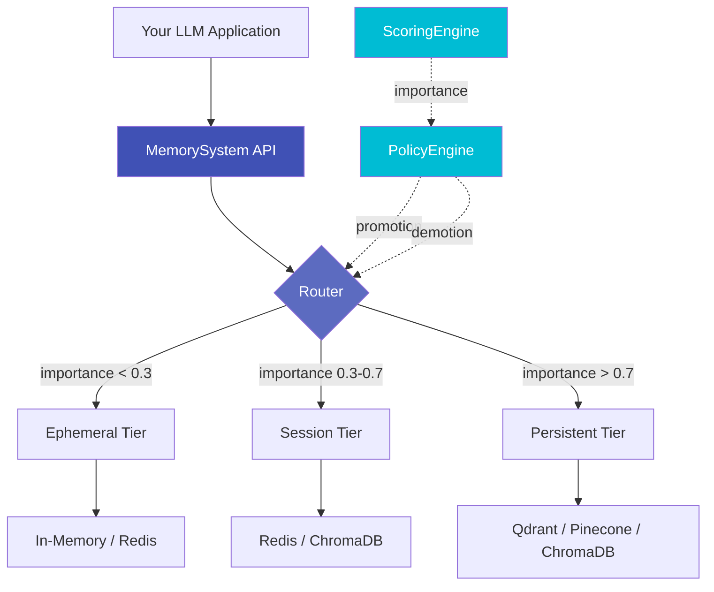

# Axon

<div align="center">

**Unified Memory SDK for LLM Applications**

[](LICENSE)
[](https://www.python.org/downloads/)
[](https://github.com/saranmahadev/Axon)
[](https://pypi.org/project/axon-sdk/)

</div>

---

## What is Axon?

**Axon** is a production-ready memory management system for Large Language Model (LLM) applications. It provides intelligent multi-tier storage, policy-driven lifecycle management, and semantic recall with automatic compaction and summarization.

### Key Features

!!! success "**Multi-Tier Memory Architecture**"
    Automatically route memories across ephemeral, session, and persistent tiers based on importance and access patterns.

!!! info "**Policy-Driven Lifecycle**"
    Define custom policies for TTL, capacity limits, promotion/demotion thresholds, and automatic summarization.

!!! tip "**Semantic Search & Recall**"
    Vector-based similarity search with metadata filtering across all tiers simultaneously.

!!! note "**Production-Grade Features**"
    Built-in audit logging, PII detection, structured logging, and two-phase commit transactions.

!!! example "**Ecosystem Integration**"
    First-class support for LangChain and LlamaIndex with native adapters.

---

## Quick Example

```python
from axon import MemorySystem
from axon.core.templates import balanced

# Create memory system with balanced configuration
system = MemorySystem(config=balanced())

# Store memories with automatic tier routing
await system.store(
    "User prefers dark mode",
    importance=0.8,
    tags=["preference", "ui"]
)

# Recall memories semantically
results = await system.recall(
    "What are the user's UI preferences?",
    k=5
)

# Automatic compaction and summarization
await system.compact(tier="session", strategy="hybrid")
```

---

## Architecture Overview



---

## Why Axon?

### For LLM Applications

| Problem | Axon Solution |
|---------|-----------------|
| **Token Limits** | Automatic summarization and compaction keep context windows manageable |
| **Cost** | Intelligent tier routing reduces expensive vector DB operations |
| **Session Management** | Built-in session isolation with TTL and lifecycle policies |
| **PII & Privacy** | Automatic PII detection with configurable privacy levels |
| **Observability** | Structured logging and audit trails for compliance |

### For Developers

- **Simple API**: Store, recall, forget - that's it
- **Framework Agnostic**: Use with any LLM framework or standalone
- **Type Safe**: Full type hints and Pydantic validation
- **Async-First**: Built on asyncio for high performance
- **Extensible**: Custom adapters, policies, and embedders

---

## Installation

=== "pip"

    ```bash
    pip install axon
    ```

=== "pip (with all adapters)"

    ```bash
    pip install "axon[all]"
    ```

=== "Development"

    ```bash
    git clone https://github.com/yourusername/Axon.git
    cd Axon
    pip install -e ".[dev]"
    ```

---

## Core Concepts

### Memory Tiers

Axon organizes memories into three tiers:

- **Ephemeral**: Short-lived, high-volume data (TTL-based)
- **Session**: Session-scoped context with summarization
- **Persistent**: Long-term semantic storage

### Policies

Policies define lifecycle rules:

```python
from axon.core.policies import SessionPolicy

policy = SessionPolicy(
    ttl_minutes=60,           # Session expires after 1 hour
    max_items=100,            # Limit to 100 memories
    summarize_after=50,       # Summarize when reaching 50 items
    promote_threshold=0.8,    # Promote high-importance memories
)
```

### Routing

The Router automatically selects tiers based on:

1. Explicit tier hints in metadata
2. Importance score thresholds
3. Access patterns (recency, frequency)
4. Capacity constraints

---

## Use Cases

### Chatbot with Persistent Memory

```python
from axon import MemorySystem
from axon.integrations.langchain import AxonChatMemory
from langchain_openai import ChatOpenAI

# Create memory-backed chatbot
memory = AxonChatMemory(system=MemorySystem(...))
llm = ChatOpenAI(model="gpt-4")
chain = LLMChain(llm=llm, memory=memory)

# Conversations persist across sessions
response = await chain.arun("What did we discuss last week?")
```

### RAG with Multi-Tier Storage

```python
from axon.integrations.llamaindex import AxonVectorStore
from llama_index.core import VectorStoreIndex

# Use Axon as LlamaIndex vector store
vector_store = AxonVectorStore(system=MemorySystem(...))
index = VectorStoreIndex.from_vector_store(vector_store)

# Query with automatic tier selection
query_engine = index.as_query_engine()
response = await query_engine.aquery("Explain quantum computing")
```

### Audit-Compliant Memory

```python
from axon.core import AuditLogger

# Enable audit logging for compliance
audit_logger = AuditLogger(max_events=10000, enable_rotation=True)
system = MemorySystem(config=config, audit_logger=audit_logger)

# All operations are automatically logged
await system.store("Sensitive user data", privacy_level=PrivacyLevel.RESTRICTED)

# Export audit trail
events = await system.export_audit_log(operation=OperationType.STORE)
```

---

## What's Next?

<div class="grid cards" markdown>

-   :material-clock-fast:{ .lg .middle } **Quick Start**

    ---

    Get up and running in 5 minutes with our quickstart guide.

    [:octicons-arrow-right-24: Quickstart](getting-started/quickstart.md)

-   :fontawesome-solid-book:{ .lg .middle } **Core Concepts**

    ---

    Learn about tiers, policies, routing, and lifecycle management.

    [:octicons-arrow-right-24: Learn More](concepts/overview.md)

-   :material-api:{ .lg .middle } **API Reference**

    ---

    Comprehensive API documentation for all modules.

    [:octicons-arrow-right-24: API Docs](api/memory-system.md)

-   :fontawesome-solid-rocket:{ .lg .middle } **Deployment**

    ---

    Production deployment guides, monitoring, and best practices.

    [:octicons-arrow-right-24: Deploy](deployment/production.md)

</div>

---

## Community & Support

- **GitHub**: [Report Issues](https://github.com/yourusername/Axon/issues)
- **Discussions**: [Join the Community](https://github.com/yourusername/Axon/discussions)
- **Examples**: [Browse Examples](https://github.com/yourusername/Axon/tree/main/examples)

---

## License

Axon is released under the [MIT License](https://github.com/yourusername/Axon/blob/main/LICENSE).
