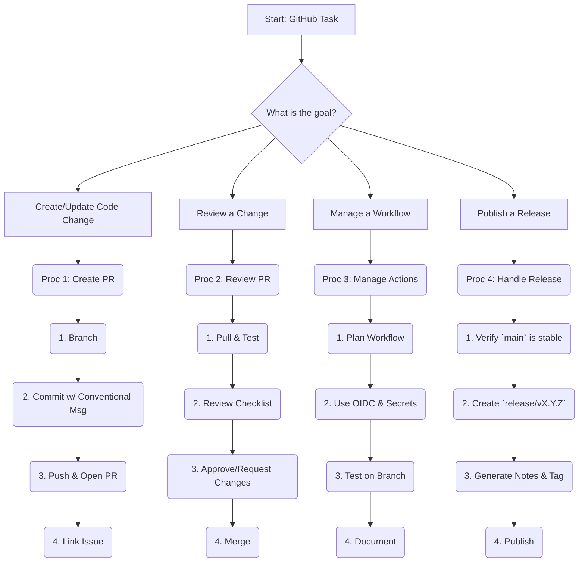

# Quick Reference: GitHub Operations

**Satellite**: `github/AGENT_INSTRUCTIONS.md` | **Version**: 1.0 | **Last Updated**: 2025-11-07

---

## Authority Matrix (Condensed)

| Operation | Authority | Approval Required | Key |
| :--- | :--- | :--- | :--- |
| **Create/Update PR** | L2 (Agent) | L3 (Maintainer) | 🟢 |
| **Merge PR** | L3 (Maintainer) | L3 (Maintainer) | 🟡 |
| **Manage Actions** | L2 (Agent) | L3 (DevOps) | 🟡 |
| **Create Release** | L3 (Maintainer) | L4 (Release Manager) |  |
| **Edit Branch Rules** | L4 (Admin) | L4 (Admin) |  |

*🟢 = Standard Op | 🟡 = Requires Review |  = High-Risk*

---

## Quick Decision Tree

---

## Essential Procedures (Abbreviated)

### Proc 1: Create Well-Structured Pull Request

1. **Branch**: Create a branch from `main`: `feature/your-change`.
2. **Commit**: Use **Conventional Commit** messages (e.g., `feat:`, `fix:`, `docs:`).
3. **Push & Open PR**: Push your branch and open a PR against `main`.
4. **Template**: Fill out the PR template completely. Link to the relevant issue.
5. **Checks**: Ensure all CI checks pass.

### Proc 2: Review and Merge Pull Request

1. **Checkout & Test**: Check out the PR branch locally and run tests.
2. **Review**: Use the PR review checklist. Focus on logic, security, and style.
3. **Approve**: If all checks pass and the review is positive, approve the PR.
4. **Merge**: Use the "Squash and merge" strategy. Ensure the commit message is clean.

### Proc 3: Manage GitHub Actions Workflow

1. **Security First**: Use **OIDC** for cloud auth. Store secrets in GitHub Environments. Pin action versions (e.g., `actions/checkout@v3`).
2. **Reusable Workflows**: For repeated jobs, create a reusable workflow with `workflow_call`.
3. **Test**: Test all workflow changes on a feature branch before merging.
4. **Document**: Every workflow must have a `README.md` explaining its triggers, jobs, and secrets.

### Proc 4: Handle Release and Versioning

1. **Create Release Branch**: From `main`, create a `release/vX.Y.Z` branch.
2. **Finalize**: Perform final tests and version bumps on this branch.
3. **Tag & Publish**: Merge the release branch into `main`, then tag `main` with `vX.Y.Z`. Create a new GitHub Release from the tag.
4. **Automate Notes**: The release notes should be auto-generated from Conventional Commit messages.

---

##  Emergency / Key Contacts

- **Incident Lead**: On-call DevOps Engineer
- **Security Issue**: `@security-team`
- **Release Blocked**: Release Manager
- **Actions Failure**: DevOps Lead
- **Emergency Rollback**: See `deployment/` Quick Reference Card.
