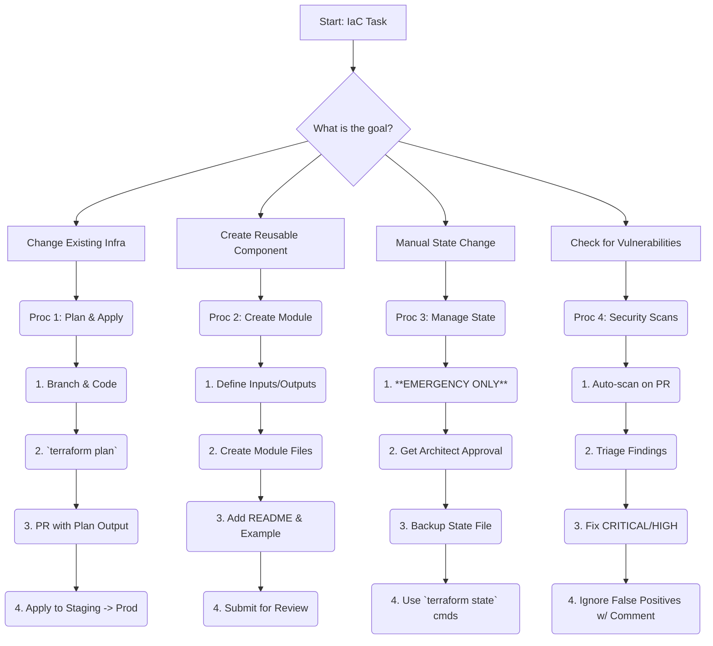

# Quick Reference: Infrastructure as Code

**Satellite**: `infrastructure/AGENT_INSTRUCTIONS.md` | **Version**: 1.0 | **Last Updated**: 2025-11-07

---

## Authority Matrix (Condensed)

| Operation | Authority | Approval Required | Key |
| :--- | :--- | :--- | :--- |
| **Plan IaC Change** | L2 (Agent) | L3 (Senior Dev) | 🟢 |
| **Apply Staging IaC** | L2 (Agent) | L3 (Senior Dev) | 🟢 |
| **Apply Production IaC** | L3 (Senior Dev) | L4 (Architect) | 🟡 |
| **Manage Terraform State** | L3 (Senior Dev) | L4 (Architect) |  |
| **Run Security Scans** | L1 (Junior Dev) | None | 🟢 |

*🟢 = Standard Op | 🟡 = Requires Review |  = High-Risk*

---

## Quick Decision Tree

---

## Essential Procedures (Abbreviated)

### Proc 1: Plan and Apply Infrastructure Changes

1. **Branch & Code**: Create a feature branch. Modify the `.tf` files.
2. **Plan**: Run `terraform fmt`, `terraform validate`, and `terraform plan -out=tfplan`.
3. **Review**: Open a PR. **Include the full `plan` output in the description.** Get approval.
4. **Apply**: Merge to `main` to apply to **staging**. Get **Architect** approval for **production** apply.

### Proc 2: Create a Reusable IaC Module

1. **Contract**: Define inputs (`variables.tf`) and outputs (`outputs.tf`).
2. **Structure**: Create a new directory in `infrastructure/modules/`.
3. **Document**: Create a `README.md` with a description, variables, outputs, and a usage example. This is **mandatory**.
4. **Review**: Get Senior Dev approval for correctness, security, and reusability.

### Proc 3: Manage Terraform State

1. **EMERGENCY ONLY**: Do not use for standard workflows. Get **Architect** approval.
2. **Backup**: Manually back up the remote state file before any operation.
3. **Execute**: Use `terraform state` commands (`mv`, `rm`, `import`). Never edit the state file by hand.
4. **Verify**: Run `terraform plan` after to ensure the state is consistent. Document everything in an issue.

### Proc 4: Handle Infrastructure Security Scans

1. **CI Scans**: `tfsec` or `checkov` runs automatically on all PRs.
2. **Triage**: **CRITICAL/HIGH** findings **must be fixed before merge**. Medium/Low findings should be tracked as issues.
3. **Remediate**: Fix the issue in the IaC code and push the change.
4. **False Positives**: To ignore, add a comment `#tfsec:ignore:<code>` with a justification.

---

##  Emergency / Key Contacts

- **Incident Lead**: On-call DevOps Engineer
- **System Architect**: `@architect`
- **State Corruption**: Restore from backup. Contact Architect immediately.
- **Production Outage**: See `deployment/` Quick Reference Card for rollback.
- **Security Vulnerability Found**: `@security-team`
