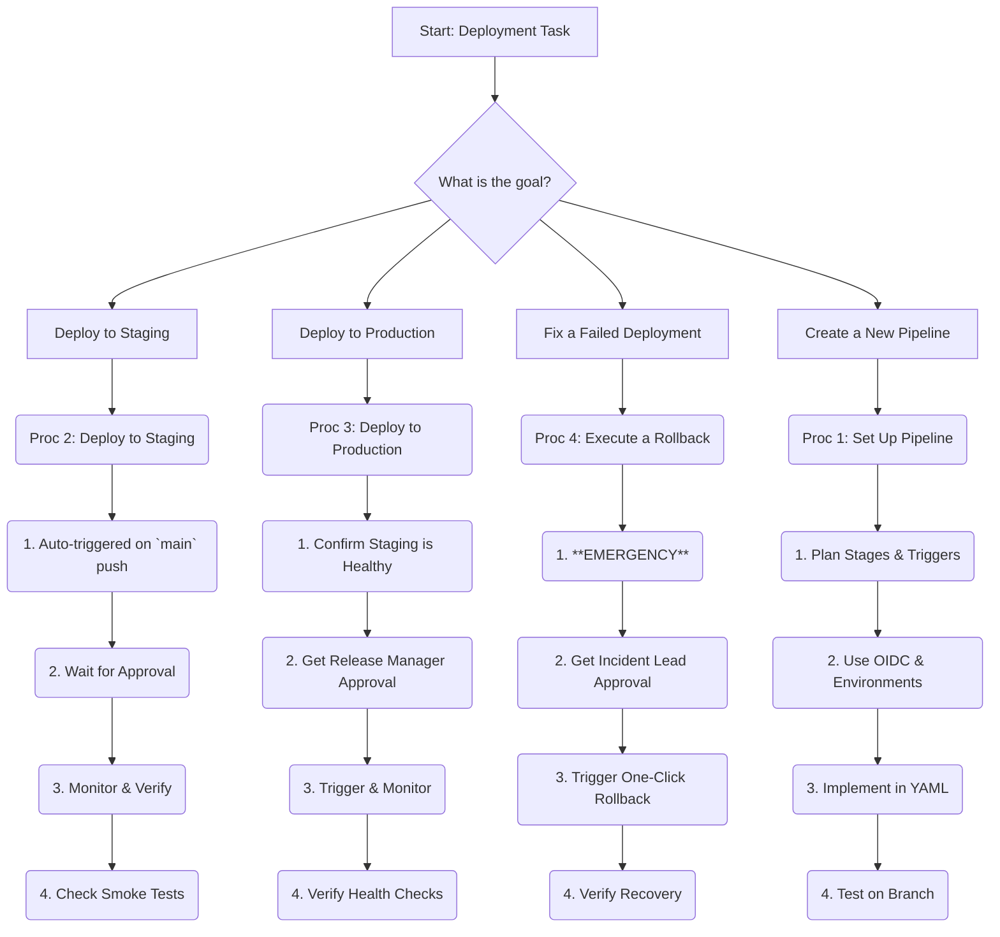

# Quick Reference: CI/CD & Deployment

**Satellite**: `deployment/AGENT_INSTRUCTIONS.md` | **Version**: 1.0 | **Last Updated**: 2025-11-07

---

## Authority Matrix (Condensed)

| Operation | Authority | Approval Required | Key |
| :--- | :--- | :--- | :--- |
| **Deploy to Staging** | L2 (Agent) | L3 (Maintainer) | 🟢 |
| **Deploy to Production** | L3 (Maintainer) | L4 (Release Manager) | 🟡 |
| **Execute Rollback** | L2 (Agent) | L3 (Incident Lead) |  |
| **Create Pipeline** | L2 (Agent) | L3 (DevOps) | 🟡 |
| **Manage Secrets** | L3 (DevOps) | L4 (Security) |  |

*🟢 = Standard Op | 🟡 = Requires Review |  = High-Risk*

---

## Quick Decision Tree

---

## Essential Procedures (Abbreviated)

### Proc 1: Set Up a Deployment Pipeline

1. **Plan**: Define stages (`build`, `test`, `deploy`), triggers (`push`, `pull_request`), and failure notifications.
2. **Secure**: Use **OIDC** for cloud auth. Use GitHub **Environments** for secrets like `STAGING_DB_URL`.
3. **Implement**: Use reusable workflows. Cache dependencies to speed up runs.
4. **Test**: Validate the new pipeline on a feature branch before merging.

### Proc 2: Deploy to a Staging Environment

1. **Trigger**: Automatically triggered on push to `main`.
2. **Approval**: A **Maintainer** must approve the `deploy-staging` job in GitHub Actions.
3. **Monitor**: Watch the build and test jobs. A failure will halt the deployment.
4. **Verify**: After deployment, ensure automated smoke tests pass and check the app's health endpoint.

### Proc 3: Execute a Production Deployment

1. **Pre-Check**: Confirm staging is healthy. Get explicit approval from the **Release Manager**.
2. **Strategy**: Use a safe strategy like **blue-green** or **canary**.
3. **Monitor**: Watch key metrics (error rate, latency) on a monitoring dashboard (Grafana, Datadog).
4. **Outcome**: On success, announce in `#releases`. On failure, immediately trigger a rollback.

### Proc 4: Execute a Rollback

1. **EMERGENCY**: This is an emergency procedure for critical failures.
2. **Approval**: The on-call **Incident Commander** makes the decision.
3. **Trigger**: Use the one-click `rollback` job in the production workflow.
4. **Verify**: Monitor the rollback and confirm the system returns to a stable state.
5. **Post-Mortem**: A post-mortem report is **required**. Investigate the root cause.

---

##  Emergency / Key Contacts

- **Incident Commander**: On-call DevOps Engineer
- **Release Manager**: `@release-manager`
- **DevOps Lead**: `@devops-lead`
- **Security Team**: `@security-team`
- **Production Deployment Failure**: Trigger Rollback Procedure IMMEDIATELY.
