# colcon-gha-visualize

A colcon extension that visualizes build job execution timelines using Mermaid gantt charts, with automatic GitHub Actions Step Summary integration.

## Features

- **Automatic Timeline Visualization**: Generates Mermaid gantt charts showing when each job starts and ends
- **Smart Lane Allocation**: Automatically arranges parallel jobs in separate lanes to clearly show parallelism
- **GitHub Actions Integration**: Automatically outputs charts to `GITHUB_STEP_SUMMARY` when running in GitHub Actions
- **Build Statistics**: Displays max parallelism, lane usage, and total job count
- **Job Status Visualization**: Color-coded job results (success, failed, aborted)

## Installation

```bash
# Using pip
pip install colcon-gha-visualize

# Using uv on development version
uv pip install -e .
```

## Usage

The extension automatically activates as a colcon event handler. Simply run your colcon build commands as usual:

```bash
colcon build
```

To explicitly disable other event handlers and only use this one, run:

```bash
colcon build --event-handlers visualize-
```

### Output

The chart will be:

- **Written to GitHub Step Summary** (if `GITHUB_STEP_SUMMARY` environment variable is set)

### Example Output

When running in GitHub Actions, you'll see a gantt chart like this in the Step Summary:

```mermaid
gantt
    title Colcon Build Timeline
    dateFormat HH:mm:ss
    axisFormat %H:%M:%S
    section Lane 1
    pkg_a : done, 00:00:00, 5000ms
    pkg_d : done, 00:00:05, 3000ms
    section Lane 2
    pkg_b : done, 00:00:01, 4000ms
    pkg_e : crit, 00:00:05, 2000ms
    section Lane 3
    pkg_c : done, 00:00:02, 3000ms
```



### Build Statistics

The extension also outputs:

- **Max Parallelism**: The maximum number of jobs running simultaneously
- **Lanes Used**: Number of lanes needed to visualize all parallel jobs
- **Total Jobs**: Total number of jobs in the build

## How It Works

### Lane Allocation Algorithm

The extension uses an intelligent lane allocation algorithm to arrange parallel jobs:

1. Jobs are sorted by start time
2. For each job, the algorithm finds the first available lane (where the previous job has ended)
3. If no lane is available, a new lane is created
4. This ensures jobs never overlap in the visualization while minimizing the number of lanes

### Job Status Colors

- **Green (done)**: Successful builds
- **Red (crit)**: Failed or aborted builds
- **Blue (active)**: Test failures

## GitHub Actions Example

```yaml
name: Build ROS Workspace

on: [push, pull_request]

jobs:
  build:
    runs-on: ubuntu-latest
    steps:
      - uses: actions/checkout@v3

      - name: Install dependencies
        run: |
          pip install colcon-common-extensions
          pip install colcon-gha-visualize

      - name: Build workspace
        run: |
          colcon build
```

The gantt chart will automatically appear in the job's Step Summary.

## Development

## Requirements

- Python >= 3.8
- colcon-core >= 0.20.1

## License

Apache License 2.0

## Contributing

Contributions are welcome! Please feel free to submit a Pull Request.
