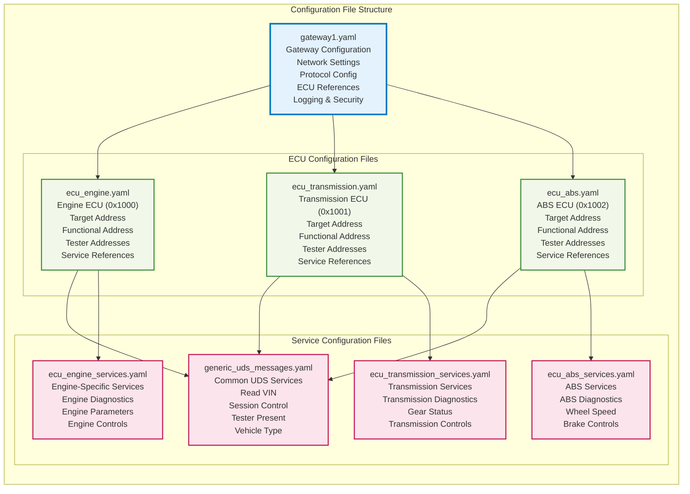
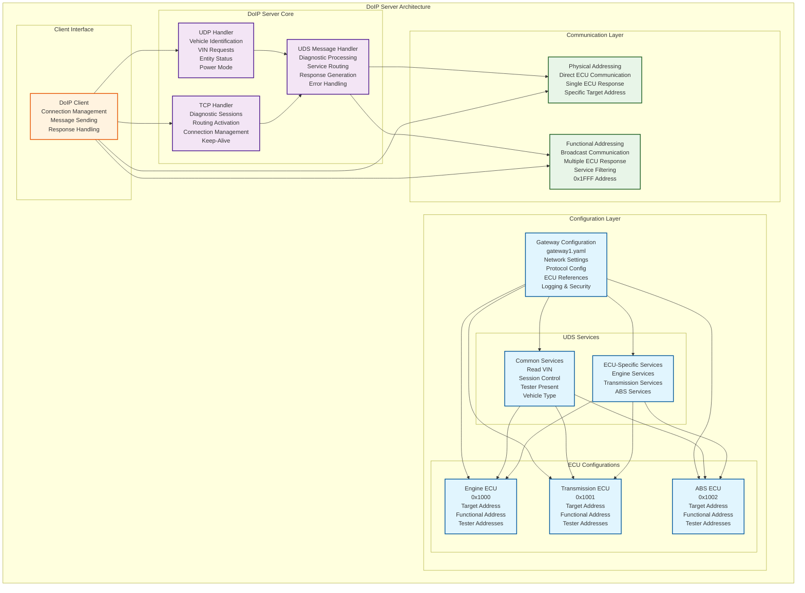
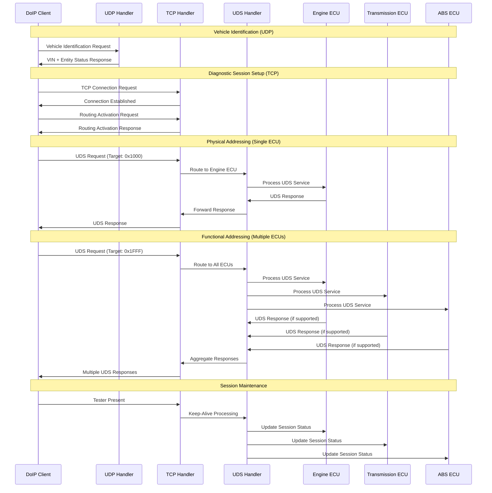

# DoIP Server

A Python implementation of DoIP (Diagnostics over Internet Protocol) server and client with comprehensive YAML configuration management.

## 🚀 Quick Start

```bash
# Install dependencies
poetry install

# Run with hierarchical configuration
poetry run python src/doip_server/main.py --gateway-config config/gateway1.yaml

# Test UDP Vehicle Identification
python scripts/utilities/run_udp_client.py --verbose

# Test Functional Diagnostics
python scripts/test/test_functional_diagnostics.py

# Test Hierarchical Configuration
python -m pytest tests/test_hierarchical_configuration.py -v

# Run comprehensive test suite
poetry run pytest tests/ -v
```

## 📚 Documentation

Comprehensive documentation is available in the `docs/` directory:

- **[📖 Documentation Index](docs/INDEX.md)** - Complete documentation index
- **[🚀 Getting Started](docs/README.md)** - Detailed project overview and setup
- **[⚙️ Configuration Guide](docs/CONFIGURATION.md)** - Complete configuration guide
- **[🔧 API Reference](docs/API.md)** - API reference and examples
- **[🧪 Testing Guide](docs/TESTING.md)** - Testing guide and results
- **[🚀 Deployment Guide](docs/DEPLOYMENT.md)** - Deployment and CI/CD guide
- **[🤝 Contributing](docs/CONTRIBUTING.md)** - How to contribute to this project
- **[📋 Changelog](docs/CHANGELOG.md)** - Project changelog and release notes
- **[🔒 Security](docs/SECURITY.md)** - Security policy and vulnerability reporting
- **[📜 Code of Conduct](docs/CODE_OF_CONDUCT.md)** - Community guidelines

## ✨ Key Features

### 🏗️ Hierarchical Configuration System
- **Multi-File Architecture**: Gateway, ECU, and UDS services in separate files
- **Dynamic ECU Loading**: Add/remove ECUs at runtime without code changes
- **Service Isolation**: ECU-specific services with common service sharing
- **Address Validation**: Per-ECU source and target address validation
- **Configuration Validation**: Comprehensive validation with clear error reporting

### 🔧 Functional Diagnostics
- **Broadcast Communication**: Single request to multiple ECUs simultaneously
- **Functional Addressing**: Default 0x1FFF address for broadcast requests
- **Service Filtering**: Only ECUs supporting the service with functional addressing respond
- **Efficient Diagnostics**: Reduce network traffic and improve diagnostic efficiency
- **Flexible Configuration**: Per-service functional addressing support

### 🚀 Advanced Features
- **Response Cycling**: Automatic cycling through multiple responses per UDS service
- **No Response Configuration**: Configure services that don't send responses (Issue #35)
- **UDP Vehicle Identification**: Network discovery via UDP broadcasts
- **Per-ECU Services**: ECU-specific UDS service definitions
- **Comprehensive Testing**: 99.5% test pass rate with full core functionality
- **Backward Compatibility**: Support for legacy configuration formats

## 🏗️ Architecture

### Hierarchical Configuration System

The DoIP server uses a sophisticated hierarchical configuration system that separates concerns into three main components:

```
config/
├── gateway1.yaml          # Gateway network configuration & ECU references
├── ecu_engine.yaml        # Engine ECU configuration (0x1000)
├── ecu_transmission.yaml  # Transmission ECU configuration (0x1001)
├── ecu_abs.yaml          # ABS ECU configuration (0x1002)
└── uds_services.yaml     # UDS service definitions (common + ECU-specific)
```

### Configuration Components



#### 1. Gateway Configuration (`gateway1.yaml`)
- **Network Settings**: TCP/IP host, port, max connections, timeouts
- **Protocol Configuration**: DoIP version, inverse version
- **ECU References**: Dynamic list of ECU configuration files
- **Response Codes**: Gateway-level response configuration
- **Logging & Security**: Centralized logging and security settings

#### 2. ECU Configurations (`ecu_*.yaml`)
- **ECU Identity**: Name, description, target address
- **Functional Address**: Broadcast address for functional diagnostics (default: 0x1FFF)
- **Tester Addresses**: Allowed source addresses per ECU
- **Service References**: Common services + ECU-specific services
- **ECU-Specific Settings**: Custom configuration per ECU

#### 3. UDS Services Configuration (`uds_services.yaml`)
- **Common Services**: Available to all ECUs (Read VIN, Diagnostic Session Control, etc.)
- **ECU-Specific Services**: Engine, Transmission, ABS specific services
- **Functional Addressing Support**: Services marked for broadcast capability
- **Response Cycling**: Multiple response options per service

### Configuration Flow Diagram



### Communication Flow Diagram



### Benefits of Hierarchical Configuration

#### 🎯 **Separation of Concerns**
- **Gateway Configuration**: Network and protocol settings centralized
- **ECU Configuration**: Individual ECU settings isolated and manageable
- **Service Configuration**: UDS services organized by category and ECU

#### 🔄 **Dynamic Management**
- **Runtime ECU Loading**: Add/remove ECUs without server restart
- **Service Isolation**: ECU-specific services don't interfere with others
- **Easy Scaling**: Add new ECUs by simply adding configuration files

#### 🛡️ **Enhanced Security & Validation**
- **Per-ECU Address Validation**: Source addresses validated per ECU
- **Service Authorization**: Only authorized services available per ECU
- **Configuration Validation**: Comprehensive validation with clear error messages

#### 📈 **Improved Maintainability**
- **Modular Structure**: Easy to understand and modify
- **Clear Ownership**: Each configuration file has a specific purpose
- **Backward Compatibility**: Legacy configurations still supported

## 🔧 Functional Diagnostics

### Overview

The DoIP server supports **functional diagnostics**, enabling broadcast communication to multiple ECUs using a single request. This powerful feature allows clients to efficiently communicate with multiple ECUs simultaneously.

### Key Concepts

#### Functional Addressing
- **Functional Address**: Special logical address (default: `0x1FFF`) representing multiple ECUs
- **Broadcast Communication**: Single request sent to multiple ECUs that support the service
- **Service Filtering**: Only ECUs supporting the requested UDS service with functional addressing respond

#### Physical vs Functional Addressing
- **Physical Addressing**: Direct communication with specific ECU using unique logical address
- **Functional Addressing**: Broadcast communication to multiple ECUs using shared functional address

### Configuration

#### ECU Configuration
Each ECU configuration includes a functional address:

```yaml
ecu:
  name: "Engine_ECU"
  target_address: 0x1000
  functional_address: 0x1FFF  # Broadcast address
  tester_addresses: [0x0E00, 0x0E01, 0x0E02]
```

#### UDS Services Configuration
Services supporting functional addressing are marked:

```yaml
common_services:
  Read_VIN:
    request: "0x22F190"
    responses: ["0x62F1901020011223344556677889AABB"]
    supports_functional: true  # Enables broadcast capability
```

### Usage Examples

#### Basic Functional Request
```python
from doip_client.doip_client import DoIPClientWrapper

# Create client
client = DoIPClientWrapper(
    server_host="127.0.0.1",
    server_port=13400,
    logical_address=0x0E00,
    target_address=0x1000
)

# Connect and send functional request
client.connect()
response = client.send_functional_read_data_by_identifier(0xF190)  # Read VIN
print(f"Response: {response.hex()}")
client.disconnect()
```

#### Functional vs Physical Comparison
```python
# Physical addressing - Engine ECU only
response_physical = client.send_read_data_by_identifier(0xF190)

# Functional addressing - All ECUs that support it
response_functional = client.send_functional_read_data_by_identifier(0xF190)
```

### Supported Services

#### Common Services (All ECUs)
- `Read_VIN` - Vehicle Identification Number
- `Read_Vehicle_Type` - Vehicle Type Information
- `Diagnostic_Session_Control` - Session management
- `Tester_Present` - Keep-alive functionality

#### ECU-Specific Services
- `Engine_Diagnostic_Codes` - Engine trouble codes
- `Transmission_Diagnostic_Codes` - Transmission trouble codes
- `ABS_Diagnostic_Codes` - ABS trouble codes

### Testing

```bash
# Test functional diagnostics
python scripts/test/test_functional_diagnostics.py

# Run functional demo
python -c "from doip_client.doip_client import DoIPClientWrapper; DoIPClientWrapper().run_functional_demo()"
```

## 📊 Test Status

- **Unit Tests**: 17/17 ✅ (100%)
- **Hierarchical Config Tests**: 21/21 ✅ (100%)
- **Response Cycling Tests**: 9/9 ✅ (100%)
- **Legacy Integration Tests**: 13/13 ✅ (100%)
- **Client Extended Tests**: 25/25 ✅ (100%)
- **Main Module Tests**: 12/12 ✅ (100%)
- **Validate Config Tests**: 15/15 ✅ (100%)
- **Debug Client Tests**: 30/30 ✅ (100%)
- **Demo Tests**: 5/6 ✅ (83% - 1 skipped)
- **Overall**: 185/186 tests passing (99.5% success rate)

## 🔧 Development

```bash
# Run tests
poetry run pytest tests/ -v

# Run specific test categories
poetry run pytest tests/test_doip_unit.py -v
poetry run pytest tests/test_hierarchical_configuration.py -v
poetry run pytest tests/test_response_cycling.py -v
```

## 📖 Documentation

For detailed documentation, see the [docs/](docs/) directory or start with the [Documentation Index](docs/INDEX.md).

---

*For complete documentation and implementation details, see the [docs/](docs/) directory.*
