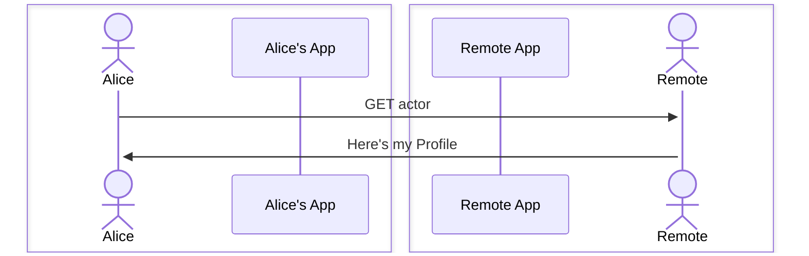
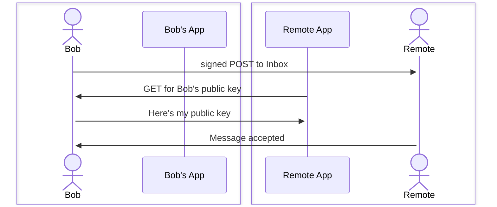
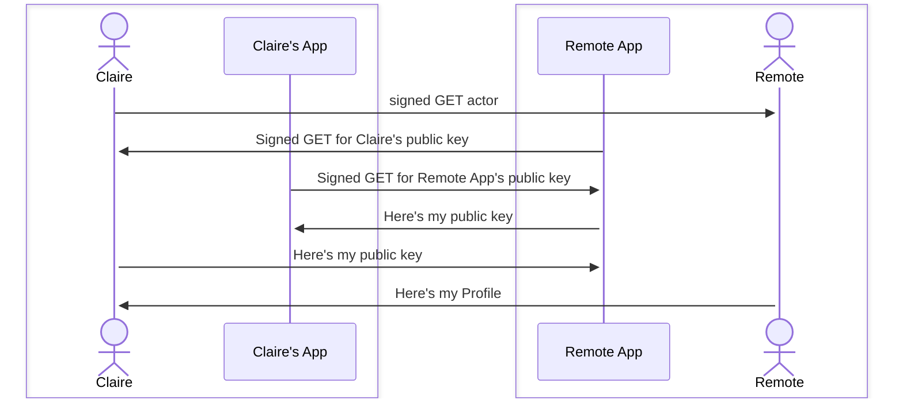

<!--
SPDX-FileCopyrightText: 2023 Helge

SPDX-License-Identifier: CC-BY-4.0
-->

# Public Key Fetching

In this technical note, I want to illustrate what happens when
fetching public keys. I will use the names from
[Verifying your Actor](../verify_actor.md).
As a reminder, Alice requires no HTTP Signatures to be present
and thus does not check them. Bob only checks signatures for POST
requests. Finally, Claire checks HTTP Signatures for GET requests.
We will assume that the Remote participant mirrors Alice's, Bob's,
and Claire's behavior.

The number of requests required for Bob and Claire may seem high.
Deployed Fediverse applications will have mechanisms for key caching,
so the actual number of requests for Alice, Bob, and Claire will be
the same.

## Alice: No public key fetching

## Bob: Key fetch for post

We discuss posting to the inbox here, instead of a GET request.
The behavior of a GET request is the same as Alice.

## Claire: Requiring signatures for GET

The case of Claire's POST is the same as Claire's GET. One should furthermore
note that the Application Actors to not check the signature on the GET to
retrieve their public keys. If such a signature check was done, the process
would be thrown into an infinite loop.

