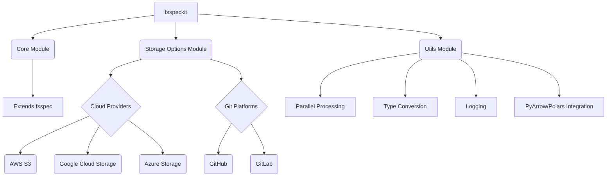

# Architecture Overview

`fsspeckit` is designed to extend and enhance the capabilities of `fsspec`, providing a robust and flexible framework for interacting with various filesystems and data formats. Its architecture is modular, built around core components that abstract away complexities and offer specialized functionalities.

## Extending `fsspec`

At its core, `fsspeckit` builds upon the `fsspec` (Filesystem Spec) library, which provides a unified Pythonic interface to various storage backends. `fsspeckit` extends this functionality by:

- **Simplifying Storage Configuration**: It offers `StorageOptions` classes for various cloud providers (AWS S3, Google Cloud Storage, Azure Storage) and Git platforms (GitHub, GitLab), allowing for easier and more consistent configuration of filesystem access.
- **Enhancing I/O Operations**: It provides extended read/write capabilities for common data formats like JSON, CSV, and Parquet, with integrations for high-performance libraries like Polars and PyArrow.
- **Improving Caching**: The library includes an enhanced caching mechanism that preserves directory structures and offers better monitoring.

## Core Components

The `fsspeckit` library is organized into several key modules:

### `core`

This module contains the fundamental extensions to `fsspec`. It includes the `filesystem` function, which acts as a central factory for creating `fsspec` compatible filesystem objects, potentially with enhanced features like caching and extended I/O. The `DirFileSystem` class is also part of this module, providing specialized handling for directory-based filesystems.

### `storage_options`

This module is dedicated to managing storage configurations for different backends. It defines various `StorageOptions` classes (e.g., `AwsStorageOptions`, `GcsStorageOptions`, `AzureStorageOptions`, `GitHubStorageOptions`, `GitLabStorageOptions`) that encapsulate the necessary parameters for connecting to specific storage services. It also includes utility functions for inferring protocols from URIs and merging storage options.

### `utils`

The `utils` module provides a collection of general-purpose utility functions that support various operations within `fsspeckit`. These include:

- **Parallel Processing**: Functions like `run_parallel` for executing tasks concurrently.
- **Type Conversion**: Utilities such as `dict_to_dataframe` and `to_pyarrow_table` for data manipulation.
- **Logging**: A setup for consistent logging across the library.
- **PyArrow and Polars Integration**: A lot of utility functions, e.g. for optimizing data types and schemas when working with PyArrow tables and Polars DataFrames.

## Diagrams

<!-- Placeholder for architecture diagrams. These can be generated using MkDocs's diagram features (e.g., Mermaid, PlantUML) to visualize the component interactions and data flow. -->

