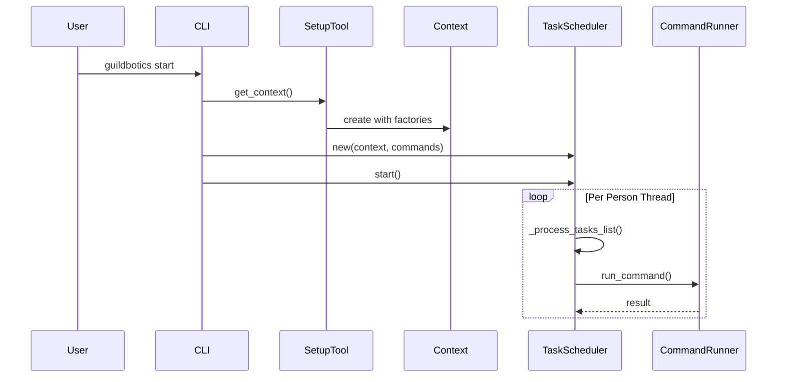
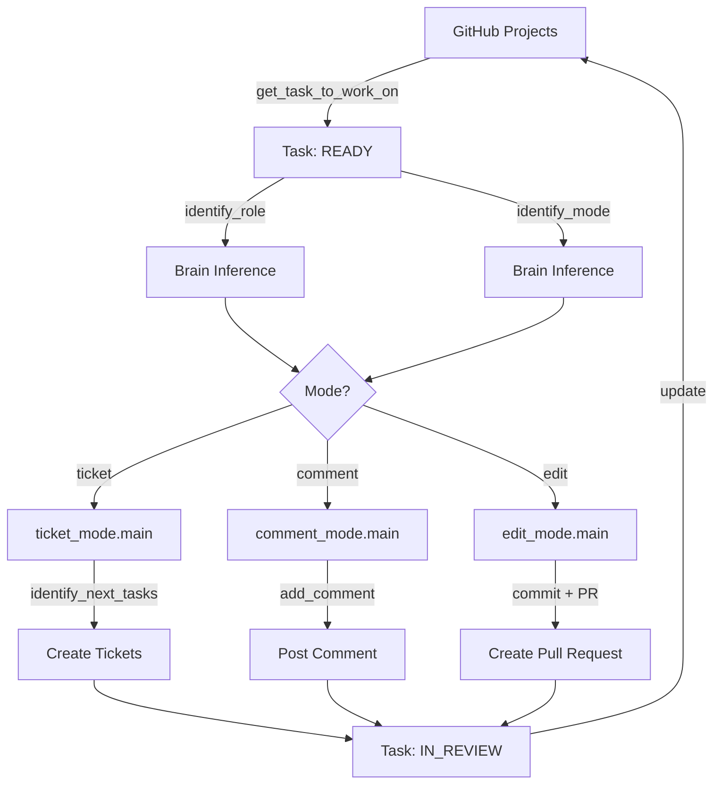
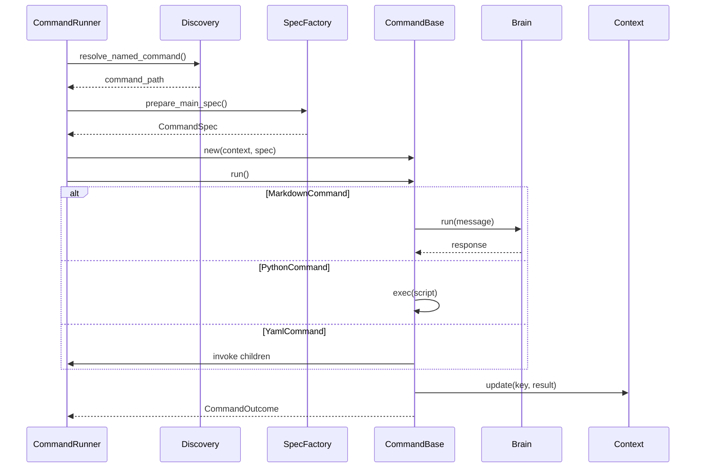

# GuildBotics Architecture

## Document Overview

**Type**: Technical Architecture Documentation
**Audience**: Developers, Architects
**Purpose**: Describe the system architecture, module organization, dependencies, and design principles of GuildBotics

---

## 1. System Overview

GuildBotics is a multi-agent task scheduling and command execution framework. It manages multiple AI agents (brains) and executes arbitrary commands (Markdown prompts, Python scripts, Shell scripts, YAML workflows) on configurable schedules. Built on Python asyncio, it provides an extensible architecture supporting multiple LLM providers, integration services, and execution modes.

### Key Features

- **Multi-Agent Support**: Multiple AI agents with different roles and personalities
- **Task Scheduling**: Cron-based scheduled commands and routine commands per person
- **Pluggable Commands**: Language-agnostic command execution framework (Markdown/Python/Shell/YAML)
- **Brain Abstraction**: Supports multiple LLM providers (Google Gemini, OpenAI, Anthropic Claude) and CLI agents
- **Extensible Integrations**: Pluggable integration framework for external services
- **Internationalization**: Multi-language support via i18n

### Example Use Cases

- **Ticket-Driven Workflow** (default): Processes tasks from GitHub Projects/Issues
- **Custom Workflows**: Any scheduled automation tasks using the command framework
- **CLI Agent Integration**: Delegates complex tasks to Google Gemini CLI, OpenAI Codex CLI, or Claude Code

---

## 2. Architecture Layers

GuildBotics follows a layered architecture with clear separation of concerns:

```
┌─────────────────────────────────────────────────┐
│ Layer 9: CLI (User Interface)                   │
│  - start, run, config, stop commands            │
└─────────────────────────────────────────────────┘
                      ↓
┌─────────────────────────────────────────────────┐
│ Layer 8: Loader (Configuration)                 │
│  - YamlTeamLoader, YamlRoleLoader               │
└─────────────────────────────────────────────────┘
                      ↓
┌─────────────────────────────────────────────────┐
│ Layer 7: Drivers (Execution Engine)             │
│  - TaskScheduler, CommandRunner                 │
└─────────────────────────────────────────────────┘
                      ↓
┌─────────────────────────────────────────────────┐
│ Layer 6: Templates (Workflow Implementations)   │
│  - ticket_driven_workflow, retrospective        │
│  - Modes: ticket/comment/edit                   │
└─────────────────────────────────────────────────┘
                      ↓
┌─────────────────────────────────────────────────┐
│ Layer 5: Commands (Command Framework)           │
│  - MarkdownCommand, PythonCommand, etc.         │
└─────────────────────────────────────────────────┘
                      ↓
┌─────────────────────────────────────────────────┐
│ Layer 4: Intelligences (AI Layer)               │
│  - Brain implementations                        │
│  - Response models, utility functions           │
└─────────────────────────────────────────────────┘
                      ↓
┌─────────────────────────────────────────────────┐
│ Layer 3: Integrations (External Services)       │
│  - TicketManager, CodeHostingService            │
└─────────────────────────────────────────────────┘
                      ↓
┌─────────────────────────────────────────────────┐
│ Layer 2: Runtime (DI Container)                 │
│  - Context, Factories                           │
└─────────────────────────────────────────────────┘
                      ↓
┌─────────────────────────────────────────────────┐
│ Layer 1: Entities (Domain Models)               │
│  - Task, Person, Team, Message                  │
└─────────────────────────────────────────────────┘
```

### Dependency Rules

- **One-way dependencies**: Lower-level modules (`entities/`, `utils/`) must NOT depend on higher orchestration layers (`commands/`, `templates/`, `drivers/`)
- **Interface-based**: Use abstract base classes for cross-layer communication
- **Factory pattern**: Use factories for dependency injection and testability

---

## 3. Module Organization

### 3.1 Core Package Structure

```
guildbotics/
├── cli/                    # CLI entry points
├── runtime/                # Execution context and factories
├── entities/               # Domain models
├── drivers/                # Execution engine
├── loader/                 # Configuration loaders
├── integrations/           # External service integrations
├── intelligences/          # AI intelligence layer
├── commands/               # Command execution framework
├── templates/              # Workflow templates
└── utils/                  # Utilities
```

### 3.2 Module Descriptions

#### CLI (`guildbotics/cli/`)

**Responsibility**: User interface and entry points

**Key Files**:
- `__init__.py`: Click-based CLI command definitions
- `setup_tool.py`: Abstract base class for initialization
- `simple/simple_setup_tool.py`: Default YAML-based implementation

**Commands**:
- `start`: Launch scheduler process
- `run`: Execute custom commands
- `config`: Configuration management (init, add, verify)
- `stop`/`kill`: Process management

#### Runtime (`guildbotics/runtime/`)

**Responsibility**: Dependency injection and execution context management

**Key Classes**:
- `Context`: Central execution context holding all dependencies
- `LoaderFactory`: Creates TeamLoader instances
- `BrainFactory`: Creates Brain instances
- `IntegrationFactory`: Creates TicketManager and CodeHostingService instances

#### Entities (`guildbotics/entities/`)

**Responsibility**: Domain model definitions

**Key Classes**:
```python
Team
  ├── Project (name, language, repositories[], services{})
  └── members: Person[]

Person
  ├── person_id, name, is_active
  ├── roles: dict[str, Role]
  └── task_schedules: CommandSchedule[]

Task
  ├── id, title, description
  ├── status: READY | IN_PROGRESS | IN_REVIEW | DONE | RETROSPECTIVE
  └── comments: Message[]

Message
  ├── content, author, author_type
  └── reactions, file_info
```

#### Drivers (`guildbotics/drivers/`)

**Responsibility**: Workflow execution engine

**Key Classes**:
- `TaskScheduler`: Cron-based task scheduler with per-person threads
- `CommandRunner`: Command execution engine with recursive invocation

#### Loader (`guildbotics/loader/`)

**Responsibility**: Configuration file loading

**Key Classes**:
- `YamlTeamLoader`: Loads team configuration from YAML files
- `YamlRoleLoader`: Loads role definitions

#### Integrations (`guildbotics/integrations/`)

**Responsibility**: External system integration

**Interfaces**:
- `TicketManager`: Abstract ticket management interface
- `CodeHostingService`: Abstract code hosting interface

**Implementations**:
- `GitHubTicketManager`: GitHub Issues/Projects implementation
- `GitHubCodeHostingService`: GitHub repository operations

#### Intelligences (`guildbotics/intelligences/`)

**Responsibility**: AI intelligence and LLM management

**Brain Implementations**:
- `AgnoAgentDefaultBrain`: Agno framework-based implementation
- `CliAgent`: CLI command execution agent
- `BrainStub`: Test stub implementation

**Common Models**: Response models for structured outputs (DecisionResponse, MessageResponse, etc.)

**Functions**: Workflow utility functions (identify_mode, identify_role, talk_as, etc.)

#### Commands (`guildbotics/commands/`)

**Responsibility**: Command execution framework

**Command Types**:
- `MarkdownCommand`: Execute `.md` files as LLM prompts
- `PythonCommand`: Execute `.py` scripts
- `ShellScriptCommand`: Execute `.sh` scripts
- `YamlCommand`: Execute `.yml` workflow definitions
- Document conversion commands (PDF, HTML)

**Framework Classes**:
- `CommandBase`: Abstract base class for commands
- `Registry`: Command type registry
- `Discovery`: Command resolution and discovery
- `CommandSpec`: Command specification data structure

#### Templates (`guildbotics/templates/`)

**Responsibility**: Workflow definitions and templates

**Key Workflows**:
- `ticket_driven_workflow.py`: Main workflow
- `retrospective.py`: Retrospective analysis workflow

**Modes**:
- `ticket_mode.py`: Create sub-tasks
- `comment_mode.py`: Add comments
- `edit_mode.py`: Edit code and create PRs

---

## 4. Key Execution Flows

### 4.1 Scheduler Startup Flow



### 4.2 Ticket-Driven Workflow



### 4.3 Command Execution Flow



---

## 5. Design Patterns

### 5.1 Factory Pattern

Used for dependency injection and implementation switching:

```python
class BrainFactory(ABC):
    def create_brain(name, config) -> Brain

class SimpleBrainFactory(BrainFactory):
    def create_brain(name, config) -> AgnoAgentDefaultBrain | CliAgent
```

### 5.2 Strategy Pattern

Used for swappable implementations:

- Brain implementations: AgnoAgentDefaultBrain, CliAgent, BrainStub
- Command types: MarkdownCommand, PythonCommand, ShellScriptCommand, YamlCommand

### 5.3 Template Method Pattern

Used in CommandBase:

```python
class CommandBase(ABC):
    async def run(self) -> CommandOutcome:
        # Template method to be overridden

class MarkdownCommand(CommandBase):
    async def run(self) -> CommandOutcome:
        # Concrete implementation
```

### 5.4 Registry Pattern

Used for command type management:

```python
_COMMAND_REGISTRY = {
    "md": MarkdownCommand,
    "py": PythonCommand,
    "sh": ShellScriptCommand,
    # ...
}
```

### 5.5 Pipeline Pattern

Used for command chaining:

```python
async def _run_with_children(spec):
    for child in spec.children:
        await _run_with_children(child)
    await _run(spec)
```

---

## 6. Configuration Structure

### 6.1 Team Configuration

```yaml
# team/project.yml
name: MyProject
language: ja
repositories:
  - name: main
    is_default: true
services:
  ticket_manager:
    name: github
    owner: myorg
    project_id: 1
  code_hosting_service:
    name: github
```

### 6.2 Person Configuration

```yaml
# team/members/{person_id}/person.yml
person_id: alice
name: Alice
is_active: true
roles:
  professional: {}
  programmer: {}
account_info:
  github_username: alice
  git_user: alice
  git_email: alice@example.com
routine_commands:
  - workflows/ticket_driven_workflow
task_schedules:
  - command: workflows/cleanup
    schedules:
      - "0 2 * * *"  # Daily at 2:00 AM
```

### 6.3 Brain Configuration

```yaml
# intelligences/agno_agent_mapping.yml
default:
  model: gemini/gemini-2.0-flash-exp
  api_key: ${GOOGLE_API_KEY}

# intelligences/cli_agent_mapping.yml
default: claude-cli.yml
```

---

## 7. Extension Points

### 7.1 Adding a New Brain

```python
class CustomBrain(Brain):
    async def run(self, message: str, **kwargs):
        # Custom implementation
        return response
```

Register in `intelligences/brain_mapping.yml`:
```yaml
custom_brain:
  class: mypackage.CustomBrain
  args:
    param1: value1
```

### 7.2 Adding a New Command Type

```python
class ToDocxCommand(CommandBase):
    extensions = [".docx"]
    inline_key = "to_docx"

    async def run(self) -> CommandOutcome:
        # Implementation
        return CommandOutcome(result, text_output)
```

Automatically registered via registry discovery.

### 7.3 Adding a New Integration

```python
class CustomTicketManager(TicketManager):
    async def create_tickets(self, tasks):
        # Implementation
        pass
```

Update `SimpleIntegrationFactory`:
```python
def create_ticket_manager(self, ...):
    if name == "custom":
        return CustomTicketManager(...)
```

---

## 8. Architecture Principles

### 8.1 Scope Discipline

- Keep every change tightly focused
- Do not broaden scope without explicit agreement

### 8.2 Simplicity First

- Apply KISS (Keep It Simple, Stupid)
- Avoid speculative abstraction (YAGNI)

### 8.3 SOLID Principles

- **Single Responsibility**: Each module has one clear purpose
- **Open/Closed**: Open for extension, closed for modification
- **Liskov Substitution**: Implementations are substitutable
- **Interface Segregation**: Small, focused interfaces
- **Dependency Inversion**: Depend on abstractions, not concretions

### 8.4 DRY (Don't Repeat Yourself)

- No copy-paste duplication
- Factor shared logic into `utils/` or appropriate shared modules

### 8.5 One-Way Dependencies

- Prevent cyclic imports/architectural cycles
- Lower-level modules must NOT depend on higher orchestration layers

### 8.6 Performance Mindset

- Do not prematurely optimize
- Fix evident inefficiencies when discovered (N+1 calls, excessive I/O)

---

## 9. Security Considerations

### 9.1 Secret Management

- Never commit secrets (`.env`, credentials)
- Use environment variables for sensitive data
- Reference `.env.example` for samples

### 9.2 Input Validation

- Validate external inputs
- Fail fast with clear errors

### 9.3 Least Privilege

- Use minimum necessary permissions
- Rotate credentials upon suspicion or exposure

---

## 10. Testing Strategy

### 10.1 Test Structure

```
tests/
├── guildbotics/        # Unit tests (mirror package structure)
│   ├── test_entities.py
│   ├── test_commands.py
│   └── ...
└── it/                 # Integration tests
    ├── test_workflows.py
    └── config/         # Test configuration samples
```

### 10.2 Testing Guidelines

- Framework: pytest
- Use `monkeypatch` for time, randomness, and I/O
- Keep tests deterministic
- Maintain or improve coverage
- Report results honestly

---

## 11. Summary

GuildBotics is an enterprise-grade automation platform with the following characteristics:

1. **Multi-Layer Architecture**: Clear separation of concerns across 9 layers
2. **Factory Pattern**: Dependency injection for flexibility
3. **Pluggable Commands**: Language-agnostic command execution
4. **Async Processing**: Built on Python asyncio
5. **Internationalization**: i18n support
6. **Testable Design**: Interface-centric architecture

The codebase consists of approximately 9,700 lines implementing a sophisticated workflow automation system with extensible AI agent management.
