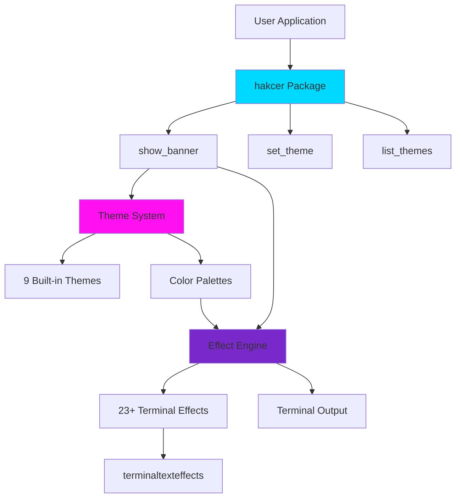
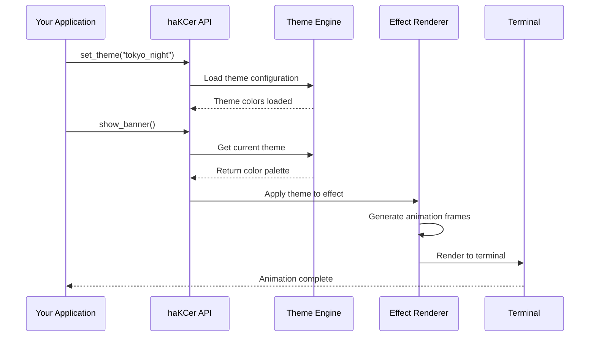
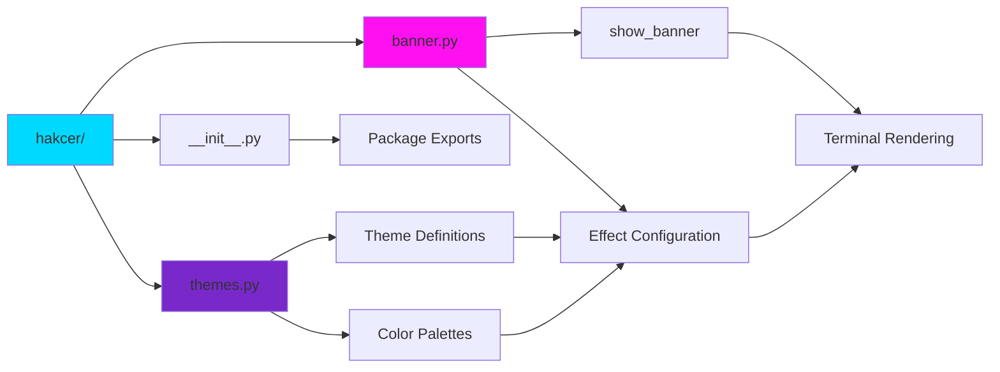

# haKCer - Animated ASCII Banner with Themes

**Drop-in animated ASCII banners for your Python CLI tools with customizable themes**


```

                 ██████████
                █▓       ░██
                █▒        ██
    █████████████░        █████████████████ ████████████ ████████████      ████████████
   ██         ███░        ███▓▒▒▒▒▒▒▒▒▒▒▒██ █▒▒▒▒▒▒▒▒▓████        █████████▓          ▒█
   ██         ███         ███▒▒▒▒▒▒▒▒▒▒▒▒▓██████████████▓        ███▓▒      ▒▓░       ▒█
   ██         ███        ░██▓▒▒▒▒▒▒▒▒▒▒▒▒▒▓██▓▒▒▒▒▒▒▒▒█▓        ███░       ░██░       ▒█
   ██         ███        ▒██▓▒▒▒▒▒▒▒▒▒▒▒▒▒▒██▓▒▒▒▒▒▒▒▓▒        ██  ▓        ██░       ▓█
   ██         ██▓        ███▒▒▒▒▒▒▒▒▒▒▒▒▒▒▒▒█▓▒▒▒▒▒▒▒▓▒       ██   █        ██░       ▓
   ██         ██▒        ██▓▒▒▒▒▒▒▒▒▒▒▒▒▒▒▒▒▓▓▒▒▒▒▒▒▒▓▒      ██    █        ▓█████████
   ██                    ██▒▒▒▒▒▒▒▒█▓▒▒▒▒▒▒▒▒▒▒▒▒▒▒▒▒▓▒   ▒███████ █░       ░▓        █
   ██         ░░         ██▒▒▒▒▒▒▒▒██▒▒▒▒▒▒▒▒▒▒▒▒▒▒▒▒▓█ ▓        ░█ ▓       ░▒       ░█
   ██         ██░       ░█▒▒▒▒▒▒▒▒▒▒▒▒▒▒▒▒▒▒▒▒▒▒▒▒▒▒▒▓█ █░        ▒ █                ░█
   ██         ██        ▓█▒▒▒▒▒▒▒▒▒██▓▒▒▒▒▒▒▒▒▒▒▒▒▒▒▒▓█ █░        ▒ █░               ▒█
    ██████████  ███████████▓██▓▓█▓█  █▓▒▒▒▒▒▒▒▒▒▓██▓██   █▓▓▓▓▓▓▓█    █▓▓▓▓▓▓▓▓▓▓▓▓▓▓██
  .:/====================█▓██▓██=========████▓█▓█ ███======> [ P R E S E N T S ] ====\:.
        /\                 ██▓██           █▓▓▓██ ██
 _ __  /  \__________________█▓█_____________██▓██______________________________ _  _    _
_ __ \/ /\____________________██_____________ ███________ _________ __ _______ _
    \  /         T H E   P I N A C L E    O F   H A K C I N G   Q U A L I T Y
     \/
```

## ✨ What's New in v1.1.0

### 🎨 Custom ASCII Art Support
Use **ANY ASCII art** with haKCer's effects!

```python
# Use your own ASCII art from file
show_banner(custom_file="my_logo.txt", theme="cyberpunk")

# Or inline
banner = """
╔═══════════════╗
║  MY COOL APP  ║
╚═══════════════╝
"""
show_banner(custom_text=banner, effect_name="decrypt")
```

### 🎮 Interactive Demo
```bash
python example.py  # Synthwave-themed interactive showcase
```

## Features

- **29 Terminal Effects** - From subtle to spectacular animations
- **9 Beautiful Themes** - Tokyo Night, Cyberpunk, Neon, Dracula, Nord, Gruvbox, Matrix, and more
- **Custom ASCII Art** - Use your own logos and designs with `custom_text` or `custom_file`
- **Speed Categories** - Fast (<2s), Medium (2-4s), Slow (4s+)
- **Zero Config** - Works out of the box with sensible defaults
- **Pip Installable** - `pip install hakcer`
- **Simple API** - Just 2 lines of code to get started

## Architecture



## Quick Start

### Installation

```bash
pip install hakcer
```

### Basic Usage

```python
from hakcer import show_banner

# Show banner with default theme (synthwave) and random fast effect
show_banner()

# Your application code here
print("Welcome to my CLI tool!")
```

### With Themes

```python
from hakcer import show_banner, set_theme

# Use Tokyo Night theme
set_theme("tokyo_night")
show_banner()

# Or Cyberpunk theme
set_theme("cyberpunk")
show_banner()

# Or any other theme
set_theme("neon")
show_banner(effect_name="synthgrid")
```

## Available Themes

| Theme | Description | Color Scheme |
|-------|-------------|--------------|
| **synthwave** | Classic synthwave with cyan, magenta, purple (default) | `#00D9FF` `#FF10F0` `#7928CA` |
| **tokyo_night** | Dark blue aesthetic inspired by Tokyo at night | `#7aa2f7` `#bb9af7` `#7dcfff` |
| **tokyo_night_storm** | Deeper blue Tokyo Night variant | `#82aaff` `#c792ea` `#89ddff` |
| **neon** | Bright electric neon colors | `#00ff00` `#ff00ff` `#00ffff` |
| **cyberpunk** | Yellow and pink Cyberpunk 2077 inspired | `#fcee09` `#ff2a6d` `#05d9e8` |
| **matrix** | Classic green matrix theme | `#00ff41` `#008f11` `#003b00` |
| **dracula** | Popular Dracula theme | `#bd93f9` `#ff79c6` `#8be9fd` |
| **nord** | Arctic north-bluish color palette | `#88c0d0` `#81a1c1` `#5e81ac` |
| **gruvbox** | Retro groove with warm colors | `#fe8019` `#d3869b` `#83a598` |

## Theme System Flow



## Terminal Effects

### Speed Categories

```python
# Fast effects (<2s) - great for production
show_banner(speed_preference="fast")

# Medium effects (2-4s) - balanced
show_banner(speed_preference="medium")

# Slow effects (4s+) - impressive for demos
show_banner(speed_preference="slow")

# Specific effect
show_banner(effect_name="synthgrid")
```

**Fast Effects (10)**: `decrypt`, `expand`, `print`, `slide`, `wipe`, `colorshift`, `scattered`, `randomsequence`, `pour`, `errorcorrect`

**Medium Effects (10)**: `beams`, `binarypath`, `burn`, `crumble`, `overflow`, `rain`, `spray`, `unstable`, `vhstape`, `waves`

**Slow Effects (9)**: `blackhole`, `bouncyballs`, `fireworks`, `matrix`, `orbittingvolley`, `rings`, `spotlights`, `swarm`, `synthgrid`

## Package Structure



## Documentation

### API Reference

#### `show_banner()`

Display the haKCer banner with animation.

**Parameters:**
- `effect_name` (str, optional): Specific effect to use
- `speed_preference` (str, optional): "fast", "medium", "slow", or "any" (default: "fast")
- `hold_time` (float, optional): Seconds to display final frame (default: 1.5)
- `clear_after` (bool, optional): Clear terminal after animation (default: False)
- `theme` (str, optional): Theme name to use (default: current global theme)

#### `set_theme(theme_name)`

Set the global theme for all banners.

#### `list_themes()`

Get list of all available theme names.

#### `list_effects()`

Get list of all available effect names.

## Usage Examples

Check out [examples.py](examples.py) for comprehensive usage examples including:
- Basic usage
- Theme showcase
- CLI integration with Click
- Smart terminal detection
- Production-ready setups
- Error handling

Run examples:
```bash
python examples.py        # Show menu
python examples.py 1      # Run example 1
python examples.py 7      # List all features
```

## Development

### Setup

```bash
# Clone the repository
git clone https://github.com/haKC-ai/hakcer.git
cd hakcer

# Install in development mode
pip install -e .

# Run tests
python test_package.py
```

### Publishing

Use the automated deployment script:

```bash
./deploy.sh
```

The script will:
1. Validate all required files
2. Run tests
3. Commit to GitHub
4. Build the package
5. Publish to PyPI

See [PYPI_SETUP_GUIDE.md](PYPI_SETUP_GUIDE.md) for detailed instructions.

## Requirements

- Python 3.8+
- terminaltexteffects >= 0.11.0
- rich >= 13.0.0

## Contributing

Contributions welcome! Areas for contribution:
- New themes
- Additional effects
- Performance improvements
- Documentation
- Bug fixes

Please open an issue or PR on GitHub.

## License

MIT License - see [LICENSE](LICENSE) file for details.

## Links

- **PyPI**: https://pypi.org/project/hakcer/
- **GitHub**: https://github.com/haKC-ai/hakcer
- **Issues**: https://github.com/haKC-ai/hakcer/issues

## Best Practices

1. **Always provide `--no-banner` flag** for automation/scripting
2. **Use fast effects** in production tools that run frequently
3. **Check TTY** before showing banner to avoid piping issues
4. **Pick themes** that match your tool's aesthetic

```python
import sys
from hakcer import show_banner

if sys.stdout.isatty():
    show_banner(speed_preference="fast")
```

---

**Made with power by haKCer | The Pinnacle of Hakcing Quality**

Add instant style to your CLI tools!
