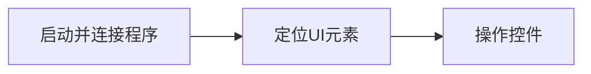

# HP UI 自动化框架 — 非程序员上手指南

> 目标：帮助 HP 内部非程序员同事快速上手 Windows UI 自动化测试，只需会复制粘贴即可完成简单的操作自动化。

---

## 一、可以做什么

- 启动应用（例如 **相机**、**记事本**、内部工具）
- 点击按钮、选择菜单、输入文字、操作下拉框
- （可选）记录测试期间的系统指标（CPU / 内存 / 电池）

只需使用一个主类 **AppManager** 和几个简单的代码片段。

---

## 二、安装（一次性）

1. **安装 Python**（Windows 11）：可以通过 Microsoft Store 安装（建议版本 3.13 及以上）。
2. 打开命令提示符（CMD），运行：
   ```bash
   python -m pip install hp-uia-core
   ```
   这会安装所需的全部组件。

---

## 三、5 分钟快速上手

我们用内置 **相机（Camera）** 应用演示一次完整流程。

### A. 新建文件夹

在本地创建一个工作目录，例如 `C:\UIAuto\camera_demo`。

### B. 创建测试脚本 `auto_camera.py`

将以下内容复制到 `auto_camera.py` 文件中：

```python
from app_manager import AppManager
import logging
from utils import capture_system_metrics

# 基本日志配置（可帮助排查问题）
logging.basicConfig(level=logging.INFO, format='%(asctime)s - %(levelname)s - %(message)s')

# 初始化 AppManager 并连接到应用（返回应用窗口对象）
app = AppManager()
app_window = app.ensure_connected(launch_app="Camera", connect_window="Camera")

# （可选）导出当前窗口下的所有元素，便于调试/查找定位信息
app.extract_elements(dump_file="camera_elements.json")

# 预先定义常用控件的定位器（推荐做法：集中管理，易读易改）
setting_btn = {"automation_id": "settingsButton"}
camera_setting_btn = {"control_type": "Button", "name": "Camera settings"}
framing_grid_combo = {"control_type": "ComboBox", "name": "Framing grid"}

# 实际测试步骤开始
capture_system_metrics('Test Started')
app.element(setting_btn).click_input()
app.element(camera_setting_btn).click_input()
app.element(framing_grid_combo).select("Rule of thirds")
capture_system_metrics('Test Completed')

# 关闭应用
app.close()
```

### C. 运行脚本

在脚本目录地址栏输入 `cmd` 并回车，然后执行：

```bash
python auto_camera.py
```

执行后：

- 相机应用会自动打开（或连接现有窗口）；
- 当前目录会生成 `camera_elements.json`（控件信息）；
- `system_metrics.csv` 记录系统指标。

---

## 四、示例：一个完整的自动化流程

让我们以上面在第三步中编写的 `auto_camera.py` 脚本为例，一起看看一个自动化测试的完整过程。整个流程分为三个核心阶段：



### 1️⃣ 启动与连接程序

在开始之前，先了解一个关键概念：**启动** 和 **连接** 都各有两种方式。

- 启动可以通过 **应用名称（launch\_app）** 或 **可执行文件路径（launch\_exe）** 进行。
- 连接可以通过 **窗口标题（connect\_window）** 或 **进程名（connect\_process）** 进行。

下面我们通过两个最常见的组合示例来说明：

### 示例 1：通过应用名称启动并连接窗口（适用于大多数应用）

```python
app.ensure_connected(launch_app="Camera", connect_window="Camera")
```

此方法适用于绝大多数应用，包括系统自带、Microsoft Store 应用及许多普通桌面程序。

### 示例 2：通过可执行文件启动并通过进程名连接（适用于 Win32 应用）

```python
app.ensure_connected(launch_exe=r"C:\Program Files\MyApp\MyApp.exe", connect_process="MyApp.exe")
```

此方法适用于普通桌面程序，更稳定地识别目标进程。

无论使用哪种方式，`AppManager` 都会自动检测程序是否在运行，必要时启动它，并等待主窗口加载完毕。

此外，`ensure_connected()` 还支持一个可选参数 `relaunch_delay`，用于指定程序启动后延迟多少秒再尝试连接窗口。例如：

```python
app.ensure_connected(launch_exe=r"C:\Program Files\MyApp\MyApp.exe", connect_process="MyApp.exe", relaunch_delay=5)
```

这个参数适用于那些启动后需要较长时间加载并渲染 UI 的应用，可以避免连接过早导致找不到窗口的情况。

### 2️⃣ 定位 UI 元素

应用启动后，下一步就是找到你要操作的界面元素。

可以通过两种方式获取控件信息：

1. **使用辅助工具实时查看**\
   你可以借助 Windows 自带或 Microsoft 提供的工具，如 **Accessibility Insights for Windows**（[官方链接](https://accessibilityinsights.io/docs/windows/overview/)）。只需将鼠标悬停在控件上，即可实时查看控件的 `AutomationId`、`Name`、`ControlType` 等属性。

2. **使用框架自带方法导出所有控件信息**\
   调用框架内置方法 `extract_elements()`，可以一次性导出当前应用窗口下所有控件的结构信息，保存为 JSON 文件。

   ```python
   app.extract_elements(dump_file="camera_elements.json")
   ```

   然后在 JSON 文件中查找对应的控件信息（如按钮名称、AutomationId），找到后即可在脚本中用定位器调用。框架允许通过多种条件组合来定位一个元素，例如同时指定 `control_type`、`name`、`automation_id` 等属性。

在实际使用中，最常见的做法是：

- 若控件有唯一的 `automation_id`，优先使用它；
- 若没有，则组合 `control_type` 与 `name` 进行定位。

示例：

```python
settings_button = {"automation_id": "settingsButton"}
framing_grid_combo = {"control_type": "ComboBox", "name": "Framing grid"}
```

### 3️⃣ 操作元素

获取控件后，就能执行点击、输入、选择等操作。

常见的操作方法包括：

- `click_input()`：模拟鼠标点击，用于按钮、复选框、单选项等控件。
- `select()`：用于下拉框、列表等控件，选择指定选项。

例如：

```python
app.element(settings_button).click_input()
app.element(framing_grid_combo).select("Rule of thirds")
```

此外，针对不同类型的控件（如编辑框、列表、菜单、复选框等），还支持其他丰富的操作方式。可参考官方文档了解详细操作列表： 👉 [Pywinauto 控件操作概览](https://pywinauto.readthedocs.io/en/latest/controls_overview.html)

这样，一个完整的自动化流程就完成了：**启动 → 连接 → 定位 → 操作**。

---

## 五、常见问题与 FAQ

**Q: 需要学 Python 吗？**\
A: 不需要，照抄模板和示例即可，但简单掌握python的写法可以更加高效。

**Q: 报“Element not found”？**\
A: 重新导出元素，或换用其他字段（`name`+`control_type`），也可增大等待时间。对于加载较慢的页面，可在执行前增加延时：

```python
import time
...
time.sleep(3)  # 等待3秒后再尝试查找元素
```

这可以确保界面元素完全渲染后再进行操作。此外，需要注意的是：并非所有控件都会在程序启动时立即加载。有些元素只有在打开特定的菜单、切换标签页或弹出对话框后才会出现在界面上。此时可以：

- 使用 **Accessibility Insights** 工具实时查看当前可见控件；
- 或在脚本的关键步骤处插入 `app.extract_elements(dump_file="current_elements.json")` 来导出当前窗口下可用的元素结构。

这样能更准确地找到当前界面可操作的控件，避免定位失败。

**Q: 应用启动不了？**\
A: Windows Store 应用用“显示名”（如 `Camera`），传统应用用 `.exe` 路径。若不确定显示名，可在“开始菜单”中右键应用图标 → “应用设置” 或 “属性” 查看名称；也可在命令行输入以下命令列出 UWP 应用：

```powershell
Get-StartApps | Sort-Object Name
```

这样可以找到正确的应用名用于 `launch_app`。

**Q: 如何在操作 UI 的同时记录系统状态？**\
A: 你可以在脚本的关键步骤插入如下代码，用于记录系统指标（如 CPU、内存、温度等）并写入 CSV 文件：
```python
capture_system_metrics('Remarks')
```
其中 `'Remarks'` 可以自定义为任何描述当前状态的文字，例如 `'Before_Click'` 或 `'After_Save'`。这有助于将性能数据与操作步骤对应起来。

此外，框架还支持对笔记本 **AC/DC 电源状态切换** 的自动化控制，但此功能为内部扩展模块，需要向框架作者申请获取内部代码方可使用。

**Q: 如何在脚本中输入文字？**\
A: 除了点击控件，你也可以模拟键盘输入。由于键盘操作是全局的，通常可以直接对应用窗口对象执行输入命令。例如：

```python
app_window.type_keys("Phi 3.5", with_spaces=True)
app_window.type_keys("{DOWN}{ENTER}")
```

这里 `with_spaces=True` 表示保留空格键输入，而 `{DOWN}`、`{ENTER}` 等则表示键盘方向键或回车键。通过这种方式，你可以实现如搜索框输入、菜单选择等操作。

---

## 六、编写建议

- 将定位器集中放在一个 `locators_xxx.py` 文件中。
- 每一步加注释，如 `# 打开设置`、`# 选择三分法`。
- 输出文件（JSON/CSV）按测试分目录保存。
- 共享脚本到团队仓库，方便复用。

---

## 七、框架功能概览

- **AppManager**
  - `ensure_connected(...)`：自动连接或启动应用
  - `element({...})`：查找并返回控件
  - `extract_elements(...)`：导出界面元素
  - `close(...)`：关闭应用
- **系统指标**
  - `capture_system_metrics(event, output_file)`：记录性能数据到 CSV

你只需写场景脚本，不必修改框架核心。

---

✅ **完成！** 只要会复制、粘贴、搜索文字，你也能编写 UI 自动化脚本。

