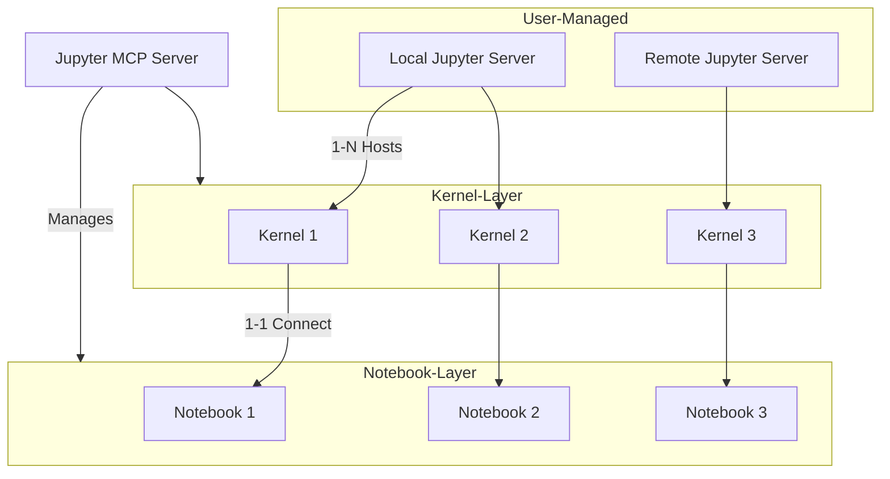
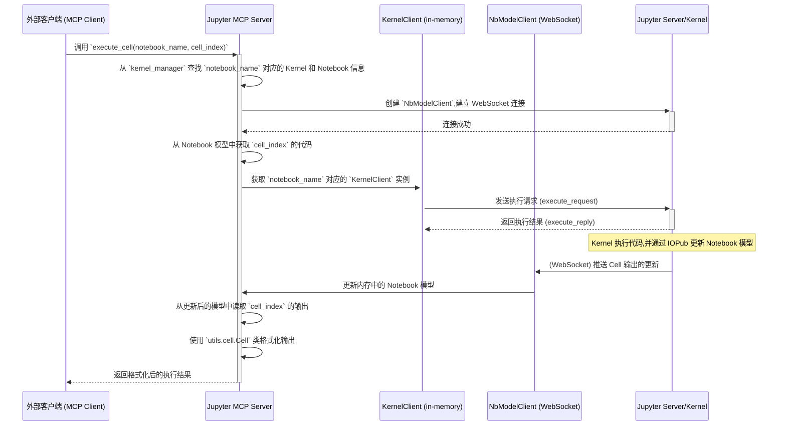
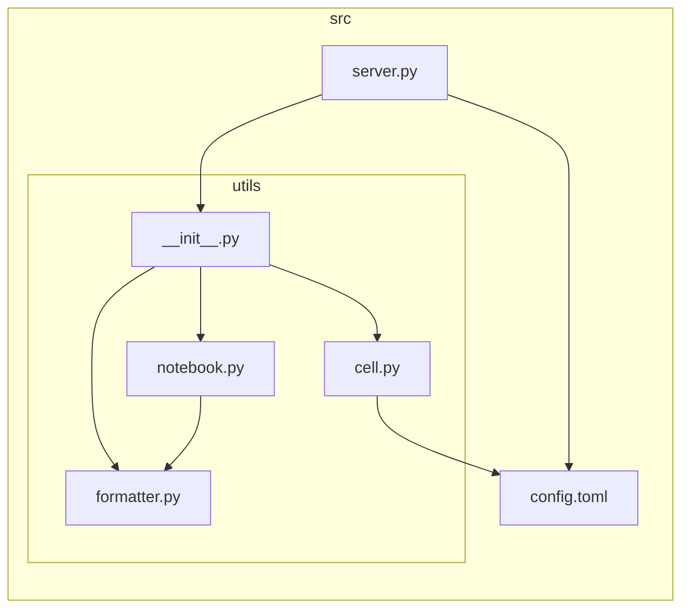

# Jupyter MCP Server 技术文档

本文档为 Jupyter MCP Server 的技术说明文档,旨在为开发者提供清晰的架构说明、关键通信流程以及代码结构解析,以便于进行后续的开发与维护。

## 1. Jupyter MCP Server 架构说明

Jupyter MCP Server 采用三层架构,将 Jupyter 的核心组件进行解耦和管理,实现了灵活、可扩展的远程代码执行环境。三层分别为: **Jupyter 服务器层**、**Kernel 层** 和 **Notebook 层**。

### 1.1 Jupyter 服务器层 (Jupyter Server Layer)

- **角色**: 基础的 Jupyter 环境,可以是在本地或任何远程服务器上运行的 `jupyter lab` 或 `jupyter notebook` 实例。
- **管理**: 由人工启动和维护。MCP 服务器本身不负责启动或管理 Jupyter 服务器实例。
- **连接**: MCP 服务器可以同时连接到多个不同的 Jupyter 服务器,只需提供对应的 URL 和认证 Token。

### 1.2 Kernel 层 (Kernel Layer)

- **角色**: 代码的实际执行环境。每个 Kernel 是一个独立的、隔离的进程。
- **管理**: 由 MCP 服务器通过 `jupyter_kernel_client` 库进行全生命周期管理。当 `connect_notebook` 被调用时,MCP 服务器会为该 Notebook 启动一个新的 Kernel。
- **连接**: MCP 服务器可以同时管理来自不同 Jupyter 服务器的多个 Kernel。这些 Kernel 实例被存储在 `server.py` 的 `kernel_manager` 字典中,以便于后续的查找和操作(如执行代码、重启)。

### 1.3 Notebook 层 (Notebook Layer)

- **角色**: 持久化的代码和文档载体(.ipynb 文件)。它负责存储代码单元(Cell)、Markdown 单元以及它们的输出。
- **管理**: 由 MCP 服务器通过 `jupyter_nbmodel_client` 库进行管理。此库通过 WebSocket 与 Jupyter 服务器通信,实现对 Notebook 内容的实时、增量更新(CRDTs)。
- **关系**: 在本架构中,一个被管理的 Notebook 与一个 Kernel 形成一一对应的关系。MCP 服务器确保每个连接的 Notebook (`notebook_name`) 都有一个专属的 Kernel,从而保证了执行环境的隔离性。

## 2. MCP 服务关键通信过程

以 "在指定 Cell 执行代码" (`execute_cell` 工具) 为例,其关键通信流程如下:

**流程解析**:

1. **请求入口**: 外部客户端向 MCP 服务器发起 `execute_cell` 工具调用。
2. **资源定位**: MCP 服务器根据 `notebook_name` 在全局 `kernel_manager` 中找到对应的 `KernelClient` 实例和 Notebook 路径等连接信息。
3. **模型连接**: MCP 服务器使用 `jupyter_nbmodel_client` 与 Jupyter Server 建立 WebSocket 连接,获取 Notebook 的实时数据模型。
4. **执行代码**: MCP 服务器使用 `KernelClient` 将指定 Cell 的代码发送到对应的 Kernel 执行。
5. **结果同步**:
   - Kernel 执行代码后,执行结果会通过 Jupyter 的消息协议(IOPub)广播。
   - `jupyter_nbmodel_client` 监听这些消息,并实时更新其维护的 Notebook 数据模型(Y.js 文档)。
6. **结果返回**: MCP 服务器从更新后的数据模型中提取目标 Cell 的输出,使用 `Cell` 辅助类进行解析和格式化,最终将结果返回给客户端。

这种设计利用了 `jupyter_nbmodel_client` 的实时同步能力,确保了即使代码执行导致了输出变化,服务端也能获取到最新的、完整的输出内容。

## 3. 项目代码架构

项目的核心逻辑位于 `src` 目录下,其结构清晰,职责分明。

- `server.py`: **主服务文件**。
  
  - 基于 `FastMCP` 构建,是所有工具(Tool)的定义和入口点。
  - 维护一个全局字典 `kernel_manager`,作为管理所有 Notebook 会话的核心,存储了每个 `notebook_name` 对应的 `KernelClient` 实例和连接信息。
  - 实现了 Notebook 管理、Cell 基本操作、Cell 高级功能三大类共 11 个工具。

- `config.toml`: **配置文件**。
  
  - 用于存放服务的可配置项。
  - 目前包含 `ALLOW_IMG` 参数,用于控制是否在返回结果中包含 Base64 编码的图片数据。

- `utils/`: **工具模块包**。
  
  - `__init__.py`: 将 `utils` 包内的核心类和函数导出,供 `server.py` 统一调用。
  - `cell.py`: 定义了 `Cell` 辅助类。这是对 Jupyter Cell 原始 `dict` 的一层封装,提供了标准化的方法来获取 Cell 的源代码、类型、执行计数,以及最重要的——**格式化输出**。它能优雅地处理标准流、错误回溯(Traceback)以及多种显示数据(如 `text/plain` 和 `image/png`)。
  - `notebook.py`: 提供了与 Notebook 交互的辅助函数。例如 `list_cell_basic` 用于快速生成 Notebook 中所有 Cell 的概览,返回一个格式化的表格字符串。
  - `formatter.py`: 包含 `format_table` 函数,用于将表头和数据行格式化为 TSV (制表符分隔值) 字符串,以提供结构清晰、易于解析的文本输出。
