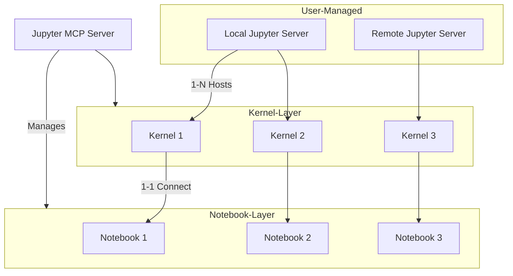
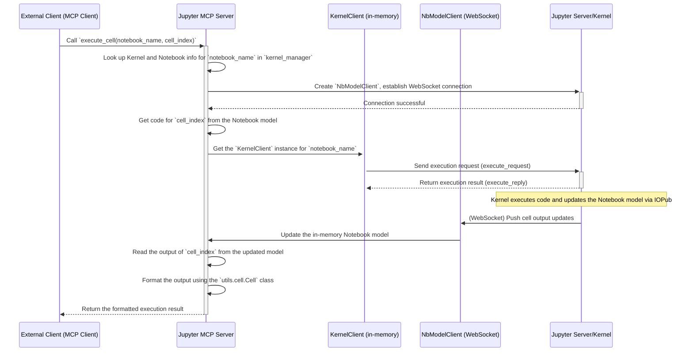
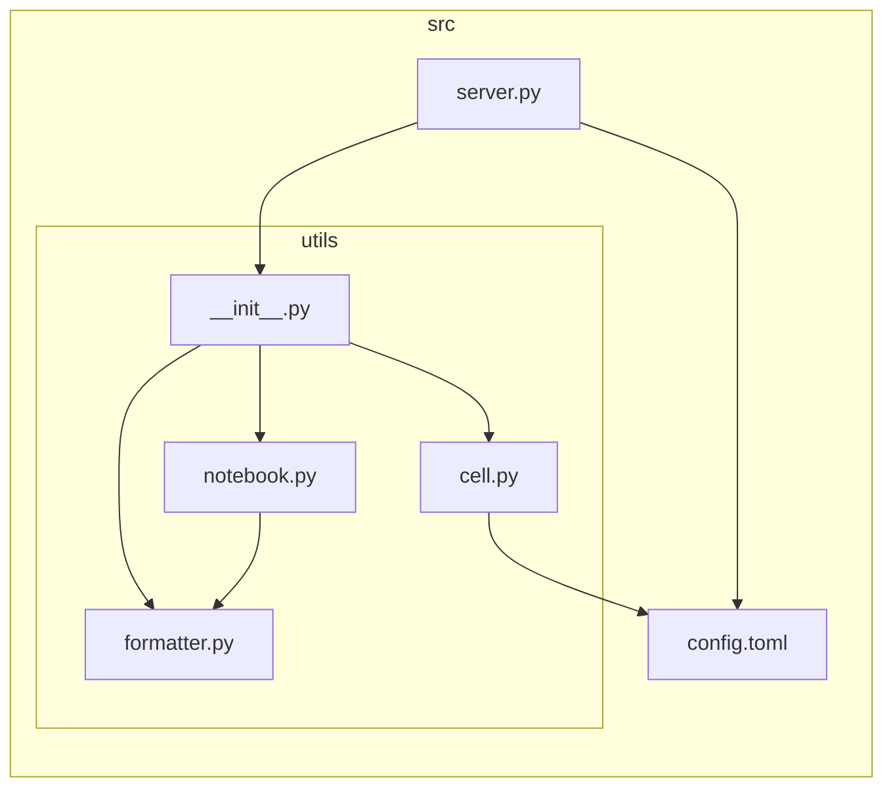

# Jupyter MCP Server Technical Documentation

This document provides technical specifications for the Jupyter MCP Server, aiming to offer developers a clear explanation of the architecture, key communication flows, and code structure to facilitate future development and maintenance.

## 1. Jupyter MCP Server Architecture

The Jupyter MCP Server adopts a three-layer architecture that decouples and manages the core components of Jupyter, creating a flexible and scalable remote code execution environment. The three layers are: the **Jupyter Server Layer**, the **Kernel Layer**, and the **Notebook Layer**.

### 1.1 Jupyter Server Layer

- **Role**: The basic Jupyter environment, which can be a `jupyter lab` or `jupyter notebook` instance running locally or on any remote server.
- **Management**: Started and maintained manually. The MCP server itself is not responsible for starting or managing Jupyter server instances.
- **Connection**: The MCP server can connect to multiple different Jupyter servers simultaneously, provided the corresponding URL and authentication token are supplied.

### 1.2 Kernel Layer

- **Role**: The actual execution environment for the code. Each Kernel is an independent, isolated process.
- **Management**: Managed throughout its lifecycle by the MCP server via the `jupyter_kernel_client` library. When `connect_notebook` is called, the MCP server starts a new Kernel for that Notebook.
- **Connection**: The MCP server can manage multiple Kernels from different Jupyter servers at the same time. These Kernel instances are stored in the `kernel_manager` dictionary in `server.py` for easy lookup and operations (like executing code or restarting).

### 1.3 Notebook Layer

- **Role**: The persistent carrier for code and documents (.ipynb files). It is responsible for storing code cells, Markdown cells, and their outputs.
- **Management**: Managed by the MCP server via the `jupyter_nbmodel_client` library. This library communicates with the Jupyter server via WebSocket to achieve real-time, incremental updates of Notebook content (CRDTs).
- **Relationship**: In this architecture, a managed Notebook has a one-to-one relationship with a Kernel. The MCP server ensures that each connected Notebook (`notebook_name`) has a dedicated Kernel, thus guaranteeing execution environment isolation.

## 2. Key Communication Process of the MCP Service

Taking "executing code in a specified cell" (`execute_cell` tool) as an example, the key communication flow is as follows:

**Flow Explanation**:

1.  **Request Entry**: The external client initiates an `execute_cell` tool call to the MCP server.
2.  **Resource Location**: The MCP server finds the corresponding `KernelClient` instance and connection information (like the Notebook path) in the global `kernel_manager` based on `notebook_name`.
3.  **Model Connection**: The MCP server establishes a WebSocket connection with the Jupyter Server using `jupyter_nbmodel_client` to get the real-time data model of the Notebook.
4.  **Code Execution**: The MCP server uses the `KernelClient` to send the code of the specified cell to the corresponding Kernel for execution.
5.  **Result Synchronization**:
    -   After the Kernel executes the code, the result is broadcasted via Jupyter's message protocol (IOPub).
    -   `jupyter_nbmodel_client` listens for these messages and updates its maintained Notebook data model (a Y.js document) in real-time.
6.  **Result Return**: The MCP server extracts the output of the target cell from the updated data model, parses and formats it using the `Cell` helper class, and finally returns the result to the client.

This design leverages the real-time synchronization capability of `jupyter_nbmodel_client` to ensure that the server can obtain the latest and complete output content, even if the code execution causes changes to the output.

## 3. Project Code Architecture

The core logic of the project is located in the `src` directory, which has a clear structure and well-defined responsibilities.

- `server.py`: **Main Service File**.
  
  - Built on `FastMCP`, it is the definition and entry point for all tools.
  - Maintains a global dictionary `kernel_manager`, which is the core for managing all Notebook sessions, storing the `KernelClient` instance and connection information for each `notebook_name`.
  - Implements a total of 11 tools across three categories: Notebook management, basic cell operations, and advanced cell functions.

- `config.toml`: **Configuration File**.
  
  - Used to store configurable items for the service.
  - Currently includes the `ALLOW_IMG` parameter, which controls whether to include Base64-encoded image data in the results.

- `utils/`: **Utility Module Package**.
  
  - `__init__.py`: Exports the core classes and functions from the `utils` package for unified access by `server.py`.
  - `cell.py`: Defines the `Cell` helper class. This is a wrapper around the raw Jupyter Cell `dict`, providing standardized methods to get the cell's source code, type, execution count, and most importantly, **formatted output**. It gracefully handles standard streams, tracebacks, and various display data (like `text/plain` and `image/png`).
  - `notebook.py`: Provides helper functions for interacting with Notebooks. For example, `list_cell_basic` is used to quickly generate an overview of all cells in a Notebook, returning a formatted table string.
  - `formatter.py`: Contains the `format_table` function, which formats a header and data rows into a TSV (Tab-Separated Values) string to provide a clearly structured and easily parsable text output.
