# 📚 Language Versions | 多语言版本 | 言語バージョン

🌐 **[English](README.md)** | 🇨🇳 **[中文](README_zh.md)** | 🇯🇵 **[日本語](README_ja.md)**

---

## Guru-PK MCP Intelligent Expert Debate System

An AI expert debate system based on local MCP (Model Context Protocol), featuring **dynamic expert generation architecture** that intelligently creates the most suitable expert combinations based on questions for multi-round intellectual confrontation.

## ✨ Core Features

- 🏭 **Dynamic Expert Generation** - Completely question-driven, generating dedicated expert combinations each time
- 🌟 **Unlimited Expert Pool** - Breaking fixed expert limitations, supporting expert generation in any domain  
- 🔄 **Multi-Round PK Process** - Independent Thinking → Cross-Debate → Final Positions → Wisdom Synthesis
- 🎨 **Tufte-Style Infographics** - Transform expert debates into single-page dynamic infographics strictly following data visualization master Edward Tufte's design principles
- 🤖 **Intelligent Division Architecture** - MCP Host-side LLM handles intelligent analysis, MCP Server-side provides process guidance

## 🌐 Online Demo

**👉 [View Infographic Demo](https://mitsudoai.github.io/guru-pk-mcp/)**

This webpage displays Tufte-style dynamic infographics created using this MCP tool, intuitively showcasing the powerful capabilities of the expert debate system.

## 🚀 Quick Installation

### 1. Install Dependencies

**Method 1: Using Installation Script (Recommended)**

**macOS/Linux:**

```bash
curl -LsSf https://astral.sh/uv/install.sh | sh
```

**Windows:**

```powershell
powershell -ExecutionPolicy ByPass -c "irm https://astral.sh/uv/install.ps1 | iex"
```

**Method 2: Install with pip (All Platforms)**

```bash
pip install uv
```

**Method 3: Download Installation Package**

Download the installation package for your platform from [UV Releases](https://github.com/astral-sh/uv/releases)

### 2. Configure MCP Client

**Recommended Method: Install from PyPI**

```json
{
  "mcpServers": {
    "guru-pk": {
      "command": "uvx",
      "args": ["--from", "guru-pk-mcp", "guru-pk-mcp-server"],
      "env": {
        "DATA_DIR": "~/.guru-pk-data"  // macOS/Linux: ~ directory, Windows: %USERPROFILE% directory
      }
    }
  }
}
```

> **Update Instructions**:
>
> - When you need to update `guru-pk-mcp` to the latest version, run:
>
>   ```bash
>   uvx pip install --upgrade guru-pk-mcp
>   ```
>
> - This command fetches and installs the latest released version from PyPI
> - If you encounter cache issues, you can force refresh:
>
>   ```bash
>   uvx --refresh-package guru-pk-mcp --from guru-pk-mcp python -c "print('✅ UVX cache refreshed')"
>   ```
>
> **Notes**:
>
> - macOS users might need to use the full path: `/Users/{username}/.local/bin/uvx`
> - Windows users: `~` automatically resolves to user home directory (e.g., `C:\\Users\\{username}`), no manual modification needed

**Development Method: Install from Source**

```json
{
  "mcpServers": {
    "guru-pk": {
      "command": "uvx", 
      "args": ["--from", "/path/to/guru-pk-mcp", "guru-pk-mcp-server"],
      "env": {
        "DATA_DIR": "~/.guru-pk-data"  // macOS/Linux: ~ directory, Windows: %USERPROFILE% directory
      }
    }
  }
}
```

> **Local Development Instructions**:
>
> - For local development scenarios, if you need to refresh uvx cache, use `make refresh-uvx`
> - This command forces UVX to reinstall the local package, ensuring the use of latest code changes

### 🎯 For Claude Code Users (Recommended)

**Using Custom Slash Command** (More Elegant)

If you're using Claude Code, we recommend this simpler approach:

1. Copy `.claude/commands/guru-pk.md` to your global `~/.claude/commands/` directory
2. Use directly in any project: `/guru-pk your question`

**Advantages:**
- ✅ No MCP server configuration needed
- ✅ Start expert debates with one command
- ✅ Cleaner, more elegant experience

## Getting Started

Restart your MCP client, enter `guru_pk_help` to get help, or directly ask questions to start expert debates!

```javascript
// 1. Natural language questions (most recommended usage)
Are there any directions in the field of generative AI that are particularly suitable for individual entrepreneurship? Please have three experts PK

// 2. Intelligent candidate expert generation (system automatic execution)
start_pk_session: Are there any directions in the field of generative AI that are particularly suitable for individual entrepreneurship?

// 3. Intelligent candidate expert generation (user limits expected expert scope)
start_pk_session: Are there any directions in the field of generative AI that are particularly suitable for individual entrepreneurship? Find two AI field experts and one famous individual entrepreneur to debate
```

### 💡 Usage Tips

**Starting Debates**:

- 🤖 **`start_pk_session: direct question`** - Default high-efficiency batch processing mode (recommended)
- 🔄 **`start_stepwise_pk_session: direct question`** - Traditional step-by-step dialogue mode

**Tool Functions**:

- 📋 `guru_pk_help` - Get system introduction and detailed help
- 📄 `export_session` - Export session as Markdown file
- 🎨 `export_session_as_infographic` - Export session as Tufte-style single-page dynamic infographic
- 📄 `export_enhanced_session` - Export enhanced analysis report
- 🌍 `set_language` - Set expert reply language

### 📱 Compatibility

Supports all MCP-compatible applications: Claude Desktop, Cursor, TRAE, DeepChat, Cherry Studio, etc.

### 🎯 Recommended Configuration

**Most Recommended MCP Hosts**:

- 💰 **Subscription-based MCP Hosts calculated by user requests** - Such as Cursor and overseas TRAE
- 🌟 **Advantages**:
  - Significant cost advantages: subscription billing calculated by user requests, not API call counts or token billing
  - Claude models have the best MCP support with excellent instruction-following capabilities

### ⚠️ Not Recommended Configuration

- 🚫 **TRAE Domestic Version** - Built-in domestic models have sensitive word censorship issues that may interrupt expert debate processes, affecting user experience

## 🛠️ Technical Architecture

**Intelligent Division Principles**:

- 🧠 **MCP Host-side LLM**: Responsible for complex semantic analysis and intelligent generation
- 🔧 **MCP Server-side**: Provides concise process control and data management

### Dynamic Expert Generation Flow

```mermaid
flowchart TD
    A[🤔 Raise Question] --> B[🧠 Intelligent Analysis]
    B --> C[👥 Generate Candidates]
    C --> D[🚀 Start Debate]
    
    A1[Ask system directly about any topic]
    B1[MCP Host-side LLM deeply analyzes question characteristics]
    C1[Dynamically create 3 most relevant experts]
    D1[Launch multi-round PK process]
    
    A -.-> A1
    B -.-> B1
    C -.-> C1
    D -.-> D1
    
    style A fill:#e1f5fe
    style B fill:#f3e5f5
    style C fill:#e8f5e8
    style D fill:#fff3e0
```



### 🔄 Debate Flow

**Two Debate Modes**:

🚀 **Batch Processing Mode** (`start_pk_session`) - **Default Recommended**

- ⚡ High Efficiency: Generate all expert answers in one round, saving about 60% time
- 🎯 Use Cases: Rapidly obtain multi-perspective analysis, efficient decision support

🔄 **Stepwise Mode** (`start_stepwise_pk_session`) - Traditional Experience

- 🎭 Interactive: Experts speak sequentially, allowing real-time adjustment and deep exploration
- 🎯 Use Cases: Deep contemplation, enjoying the complete debate process

**4-Round Debate Flow**:


