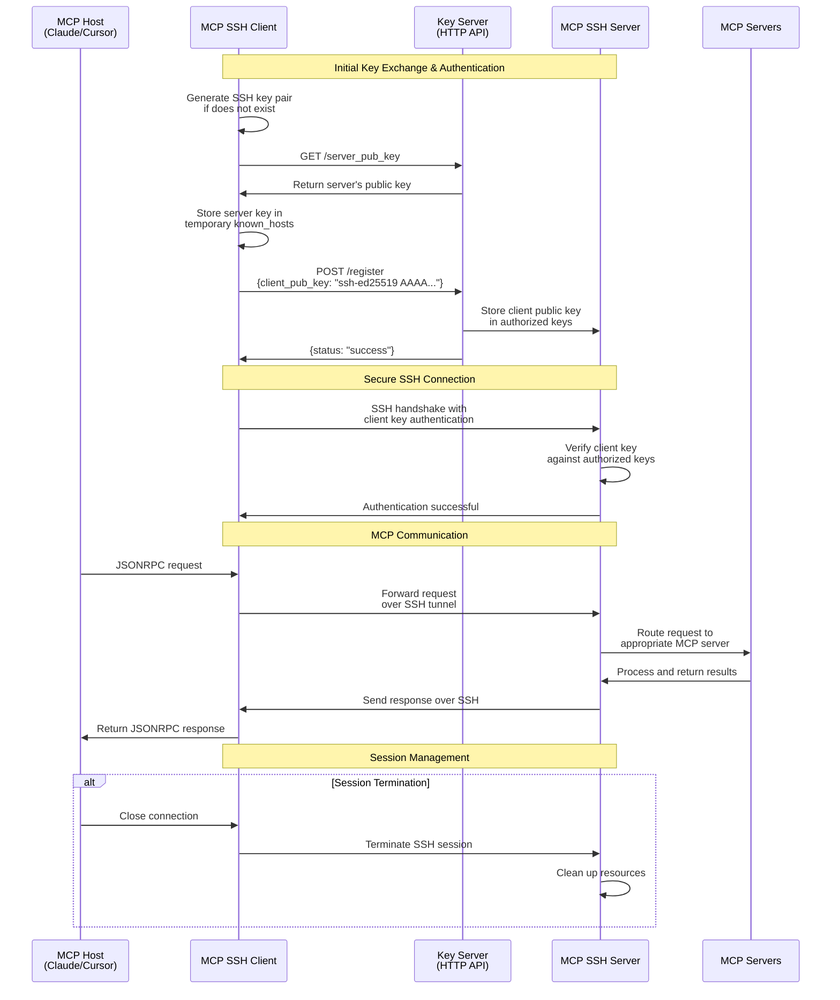

# MCP Server SSH Client

[](https://pypi.org/project/m2m-mcp-server-ssh-client/)
[](https://pypi.org/project/m2m-mcp-server-ssh-client/)
[](https://opensource.org/licenses/MIT)

A Model Context Protocol Server (Remote SSH client) that connects to remote MCP servers over SSH. This client enables accessing and utilizing MCP tools hosted on remote servers, providing a secure channel for MCP communication.

<a href="https://glama.ai/mcp/servers/@Machine-To-Machine/m2m-mcp-server-ssh-client">
  
</a>

## Features

- Connect to any MCP server over SSH
- Proxy all MCP protocol commands through a secure SSH channel
- Support for key-based authentication
- Support for MCP capabilities including tools, prompts, and resources

## Installation

In a `uv` managed python project, add to dependencies by:

```bash
uv add m2m-mcp-server-ssh-client
```

Alternatively, for projects using `pip` for dependencies:
```bash
pip install m2m-mcp-server-ssh-client
```

To install directly from the source:

```bash
git clone https://github.com/Machine-To-Machine/m2m-mcp-server-ssh-client.git
cd m2m-mcp-server-ssh-client
pip install -e .
```

To run the server inside your project:

```
uv run m2m-mcp-server-ssh-client
```

## Common Use Cases

### 1. Quick Start with Demo Server

We maintain a public demo server with various MCP tools already configured and ready to use. (This server will be available until we release our open, decentralized registry.)

This demo server has multiple MCP servers including HackerNews, MLB Stats API, and Formula 1 API tools for you to experiment with.

#### Claude

To connect Claude to this server, simply add the following to Claude Desktop settings.

```json
"mcpServers": {
  "remote-mcp-tools": {
    "command": "uvx",
    "args": [
      "m2m-mcp-server-ssh-client", 
      "--host", "mcp-beta.machinetomachine.ai", 
      "--port", "8022", 
      "--use-key-server"
    ]
  }
}
```

#### Command-line

```bash
# Connect to the M2M public demo server with automatic key exchange
uv run m2m-mcp-server-ssh-client --host mcp-beta.machinetomachine.ai --use-key-server
```

### 2. Local Development Testing

For setting up your own SSH server, refer to [`m2m-mcp-server-ssh-server`](https://github.com/Machine-To-Machine/m2m-mcp-server-ssh-server).

For local testing with your own MCP tools:

```bash
# Connect to a local MCP SSH server
uv run m2m-mcp-server-ssh-client
```

The above command will try to connect to a local SSH server listening on port 8022.

When testing locally, you can simplify key exchange by using the key server:

```bash
# Use the key server for automatic key management (if server has --run-key-server enabled)
uv run m2m-mcp-server-ssh-client --use-key-server
```

The above command will try to use the key server running on port 8000.

### 3. Remote Server Connection

Connect to your own hosted MCP server:

```bash
# Using existing SSH keys
uv run m2m-mcp-server-ssh-client --host your-server.example.com --client-key ~/.ssh/your_key --known-hosts ~/.ssh/known_hosts
```

You can simplify key exchange by running the key server on your remote server and configuring it in client.

## Usage with AI Platforms

### Claude Desktop Integration

Add this to Claude Desktop settings:

```json
"mcpServers": {
  "remote-mcp-tools": {
    "command": "uvx",
    "args": [
      "m2m-mcp-server-ssh-client", 
      "--host", "mcp-beta.machinetomachine.ai", 
      "--port", "8022", 
      "--use-key-server"
    ]
  }
}
```

### MCP Inspector

For debugging or exploring available tools:

```bash
npx @modelcontextprotocol/inspector -- uvx m2m-mcp-server-ssh-client --host mcp-beta.machinetomachine.ai --port 8022 --use-key-server
```

## Usage

### Command Line Options

- `--host`: Remote SSH server host (default: "localhost")
- `--port`: Remote SSH server port (default: 8022)
- `--username`: SSH username (default: "mcp")
- `--client-key`: Client private key file (default: "~/.ssh/m2m_mcp_server_ssh_client")
- `--known-hosts`: Path to known hosts file (default: "~/.ssh/known_hosts")
- `--passphrase`: Passphrase for the private key (default: None)
- `--disable-host-key-checking`: Skip server signature verification (default: False)
- `--log-level`: Set logging level (default: INFO)

## Detailed Examples

### Basic Connection to a Remote Server

Connect to a remote MCP server (SSH server) running on port 8022:

```bash
uvx m2m-mcp-server-ssh-client --host mcp.example.com
```

### Using a Custom SSH Key

Specify a particular SSH key for authentication:

```bash
uvx m2m-mcp-server-ssh-client --host mcp.example.com --client-key ~/.ssh/mcp_custom_key
```

If your key is passphrase-protected:

```bash
uvx m2m-mcp-server-ssh-client --host mcp.example.com --client-key ~/.ssh/mcp_custom_key --passphrase "your-passphrase"
```

### Debug Mode for Troubleshooting

Enable detailed logging for troubleshooting connection issues:

```bash
uvx m2m-mcp-server-ssh-client --host mcp.example.com --log-level DEBUG
```

### Key Server Integration

The MCP SSH Client can use a key server for dynamic key exchange and verification:

```bash
uvx m2m-mcp-server-ssh-client --host mcp.example.com --use-key-server
```

When using a key server:

1. The client fetches the server's public key from `http://host:key-server-port/server_pub_key`
2. The client registers its public key with the server at `http://host:key-server-port/register`
3. A temporary `known_hosts` file is created for the SSH connection

This feature is mutually exclusive with `--known-hosts` and `--disable-host-key-checking`.

### Disabling Host Key Checking

> **⚠️ Security Warning**: Using `--disable-host-key-checking` makes your connection vulnerable to man-in-the-middle attacks. Only use this option in trusted networks or for development/testing purposes.

```bash
uvx m2m-mcp-server-ssh-client --host localhost --disable-host-key-checking
```

### Configure for Claude Desktop

Add to your Claude settings:

```json
"mcpServers": {
  "remote-servers": {
    "command": "uvx",
    "args": [
      "m2m-mcp-server-ssh-client", 
      "--host", "example.com", 
      "--port", "8022", 
      "--username", "mcp"
    ]
  }
}
```

For a more secure configuration with a specific key:

```json
"mcpServers": {
  "remote-servers": {
    "command": "uvx",
    "args": [
      "m2m-mcp-server-ssh-client",
      "--host", "mcp-server.example.com",
      "--port", "8022",
      "--username", "claude-mcp",
      "--client-key", "~/.ssh/claude_mcp_key",
      "--known-hosts", "~/.ssh/mcp_remote_server"
    ]
  }
}
```

## How It Works

The MCP Server SSH Client establishes an SSH connection to a remote server running the MCP Server SSH Server for MCP tools, i.e., [`m2m-mcp-server-ssh-server`](https://github.com/Machine-To-Machine/m2m-mcp-server-ssh-server). It then:

1. Creates a local proxy server that mirrors the capabilities of the remote MCP server
2. Forwards all MCP requests to the remote server through the SSH connection
3. Returns responses from the remote server to the local client

This allows you to use tools running on remote machines as if they were installed locally.

### Authentication Flow



## Security Considerations

- Always use host key verification in production environments
- Use passphrase-protected SSH keys for stronger security
- Consider using dedicated SSH keys for MCP connections
- Set appropriate permissions (600) for your SSH key files
- Use a dedicated, limited-privilege user on the remote server

## Troubleshooting Common Issues

### Connection Refused

```
Error running MCP SSH client: [Errno 111] Connection refused
```

**Solution**: Verify the host and port are correct and that the SSH service is running.

### Authentication Failure

```
Error running MCP SSH client: Authentication failed
```

**Solution**: Check the key file path. Ensure the remote server has your public key installed.

### Host Key Verification Failed

```
Error running MCP SSH client: Host key verification failed
```

**Solution**: Either add the host key to your known_hosts file or use `--disable-host-key-checking` (for testing only).

## Dependencies

- anyio (>=4.5.0)
- asyncssh (>=2.20.0)
- mcp (>=1.1.3)
- pydantic (>=2.0.0)

## Development

### Setup Development Environment

```bash
git clone https://github.com/Machine-To-Machine/m2m-mcp-server-ssh-client.git
cd m2m-mcp-server-ssh-client
uv venv
source .venv/bin/activate  # On Windows: .venv\Scripts\activate
uv pip install -e ".[dev]"
```

### Code Quality

```bash
# Run linting
uv run ruff check .

# Run formatting check
uv run ruff format --check .

# Run security checks
uv run bandit -r src/
```

## Debugging

You can use the MCP inspector to debug the client:

```
npx @modelcontextprotocol/inspector uvx m2m-mcp-server-ssh-client --host example.com
```

For advanced debugging, use the following workflow:

1. Start the client with `--log-level DEBUG`
2. Check the SSH connection parameters and handshake process
3. If using custom keys, verify correct paths and permissions
4. Use `ssh -v` directly to test basic connectivity first

## Contributing

We welcome contributions to help expand and improve `m2m-mcp-server-ssh-client`. Whether you want to add new features, enhance existing functionality, or improve documentation, your input is valuable.

Pull requests are welcome! Feel free to contribute new ideas, bug fixes, or enhancements.

### Contribution Guidelines

1. Fork the repository
2. Create a feature branch: `git checkout -b feature-name`
3. Commit your changes: `git commit -am 'Add some feature'`
4. Push to the branch: `git push origin feature-name`
5. Submit a pull request

## License

MIT License - See LICENSE file for details.

## Authors

- **Machine To Machine**
