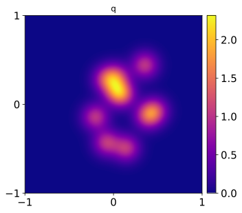
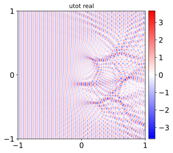
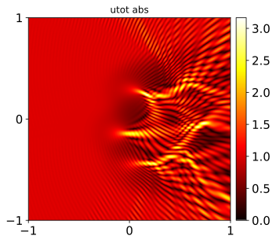
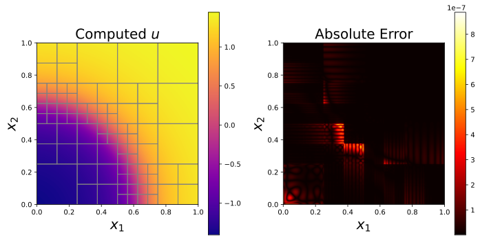

# jaxhps
A JAX package implementing hardware acceleration for HPS methods in two and three dimensions.

See our preprint on arXiv: [Hardware Acceleration for HPS Methods in Two and Three Dimensions](https://arxiv.org/abs/2503.17535)

## Installation

To install, you can use `pip`: 

```
pip install jaxhps
```

The examples require additional packages `matplotlib` and `h5py`. If you want to install them automatically, use:

```
pip install jaxhps[examples]
```

More installation instructions, including installation for a GPU system, are available in [the documentation](https://jaxhps.readthedocs.io/en/latest/#installation).

## Documentation

[https://jaxhps.readthedocs.io/en/latest/](https://jaxhps.readthedocs.io/en/latest/)

## Examples


### hp convergence on 2D problems with known solutions

Shows convergence using uniform quadtrees using both DtN matrices and ItI matrices.
```
python examples/hp_convergence_2D_problems.py --DtN --ItI
```

### High-wavenumber scattering problem

To run the example, you will need exterior single and double-layer potential matrices. These matrices are necessary to define a boundary integral equation for the scattering problem. You can download these matrices from Zenodo: [https://doi.org/10.5281/zenodo.17259087](https://doi.org/10.5281/zenodo.17259087).
Alternatively, you can run the matlab script `examples/driver_gen_SD_matrices.m`. This will generate and save the exterior single and double-layer potential matrices; you can also use this script to generate new potential matrices for different domain sizes, discretization levels, and wavenumbers. Once the matrices are in place, we can run the script:
```
python examples/wave_scattering_compute_reference_soln.py --scattering_potential gauss_bumps -k 100 --plot_utot
```
This will generate plots which looks like this, showing the scattering potential and real part and modulus of the total field: 






### Adaptive discretization on a 3D problem with known solution

We have a script for generating adaptive discretizations on the wavefront problem presented in our paper:

```
python examples/wavefront_adaptive_discretization_3D.py -p 10 --tol 1e-02 1e-05
```

This should produce an image showing the computed solution, generated grid, and error map:




### Inverse wave scattering using automatic differentiation

We have an implementation of a low-dimensional optimization problem using automatic differentiation:

```
python examples/inverse_wave_scattering.py --n_iter 25
```

This is an inverse scattering problem where we try to recover the low-frequency basis coefficients of the scattering potential from the earlier example. Running the code should produce a plot showing the convergence of the objective function:


### Linearized Poisson--Boltzmann equation

Our method can be used to solve the a linearized Poisson-Boltzmann equation, which models the electrostatic properties of a molecule in solution. 

```
python examples/poisson_boltzmann_example.py --tol 1e-01 1e-03 -p 10 
```
