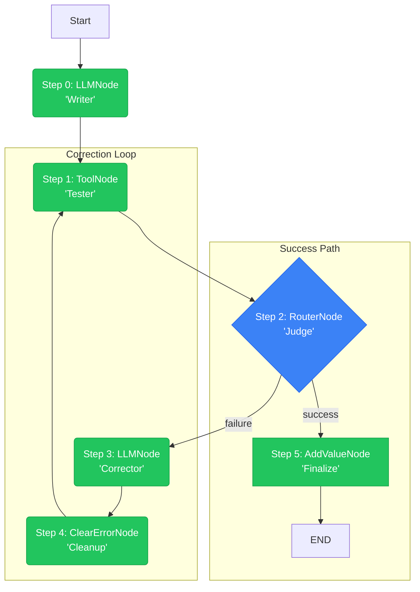

# Lár: The PyTorch for Agents

**Lár** (Irish for "core" or "center") is a "define-by-run" agentic framework for building auditable and reliable AI systems.

It is engineered as a robust alternative to static, "black box" frameworks, which obscure logic, inhibit debugging, and fail unpredictably. Lár implements a **"glass box"** architecture, inspired by the dynamic graphs of PyTorch, where every step of an agent's reasoning process is explicit, inspectable, and logged by default.

This framework provides a deterministic, stateful, and node-based system for orchestrating complex agentic behavior, including self-correction, dynamic branching, and tool-use loops.

-----

## Core Philosophy: "Glass Box" vs. "Black Box"

The primary challenge in production-grade AI is a lack of traceability. When a multi-step agent fails, it's often impossible to determine *why*.

  * **The "Black Box" (Other Frameworks):** Relies on a "magic" `AgentExecutor` that tries to do everything at once. When this magic fails, it's a complex black box that is nearly impossible to debug.

  * **The "Glass Box" (Lár):**  Lár is, by design, a simple, explicit loop. The `GraphExecutor` runs one node at a time, logs the exact state change, and then pauses.

This "define-by-run" approach transforms debugging from an art into a science. You can visually trace the execution, inspect the diff of the state at every transition, and pinpoint the exact node where logic failed. Lár's "flight data recorder" (`history`) isn't an add-on; it's the core output of the engine.

## Key Features

  * **Define-by-Run Architecture:** The execution graph is created dynamically, step-by-step. This naturally enables complex, stateful logic like loops and self-correction.

  * **Total Auditability:** The `GraphExecutor` produces a complete, step-by-step history of every node executed, the state *before* the run, and the state *after*.

  * **Deterministic Logic:** Replace "prompt-chaining" with explicit, testable Python code. Use the `RouterNode` for clear, auditable "if/else" branching.

  * **Testable Units:** Every node is a standalone class. You can unit test your `ToolNode` (your "hands") and your `RouterNode` (your "logic") completely independently of an LLM call.

  * **`Snath` Visualizer:** A built-in Streamlit app (`snath_app.py`) that provides a live, step-by-step, interactive debugger for your agents.

-----

## Installation

This project is managed with [Poetry](https://python-poetry.org/).

1.  **Clone the repository:**

    ```bash
    git clone https://github.com/snath-ai/lar.git
    cd lar
    ```

2.  **Install dependencies:**
    This command creates a virtual environment and installs all packages from `pyproject.toml`.

    ```bash
    poetry install
    ```

-----

## Quick Start: The `Snath` Visualizer

The best way to understand `lar` is to use the interactive `Snath` debugger.

1.  **Set your API key:**
    Create a `.env` file in the project root.

    ```
    # .env
    GOOGLE_API_KEY='YOUR_API_KEY_HERE'
    ```

2.  **Run the app:**

    ```bash
    poetry run streamlit run snath_app.py
    ```

This app allows you to execute a self-correcting agent step-by-step. At each step, it renders the graph's current state and provides a "diff" of the `GraphState`, showing exactly what was **added**, **removed**, or **modified** by the last node.

-----

## The `Lár` Architecture: Core Primitives

You can build any agent with four core components:

1.  **`GraphState`**: A simple, unified object that holds the "memory" of the agent. It is passed to every node, allowing one node to write data (`state.set(...)`) and the next to read it (`state.get(...)`).

2.  **`BaseNode`**: The abstract class (the "contract") for all executable units. It enforces a single method: `execute(self, state)`. The `execute` method's sole responsibility is to perform its logic and return the *next* `BaseNode` to run, or `None` to terminate the graph.

3.  **`GraphExecutor`**: The "engine" that runs the graph. It is a Python generator that runs one node, yields the execution log for that step, and then pauses, waiting for the next call.

4.  **Node Implementations**: The "building blocks" of your agent.

      * **`LLMNode`**: The "Thinker." Calls an LLM (e.g., Gemini) to generate text, modify plans, or correct code.
      * **`ToolNode`**: The "Actor." Executes any deterministic Python function (e.g., run code, search a database, call an API). It supports separate routing for `success` and `error`.
      * **`RouterNode`**: The "Choice." Executes a simple Python function to inspect the state and returns a string key, which deterministically routes execution to the next node. This is your "if/else" statement.
      * **`ClearErrorNode`**: A utility node that cleans up state (e.g., removes `last_error`) to prevent infinite loops.

-----

## Example: A Self-Correcting Agent

The following graph defines an agent that writes, tests, and *debugs its own code*. This kind of stateful loop is trivial in `lar` but extremely complex in a linear-chain framework.

This agent will:

1.  **Write Code** (using `LLMNode`)
2.  **Test Code** (using `ToolNode`)
3.  **Judge Result** (using `RouterNode`)
4.  If the test fails, it **loops back** to an `LLMNode` (the "Corrector") with the error message, clears the error, and tries again.

### Graph Architecture



### Building the Graph

```python
from lar import *

# 1. Define the tools and logic
def run_generated_code(code_string: str) -> str:
    # ... (executes code, raises ValueError on logic error)
    pass

def judge_function(state: GraphState) -> str:
    # ... (checks state for "last_error", returns "failure" or "success")
    pass

# 2. Define the agent's nodes
success_node = AddValueNode(key="final_status", value="SUCCESS", next_node=None)
tester_node = ToolNode(tool_function=run_generated_code, ...)
clear_error_node = ClearErrorNode(next_node=tester_node)

corrector_node = LLMNode(
    prompt_template="Fix this code: {code_string}. Error: {last_error}",
    output_key="code_string",
    next_node=clear_error_node
)

judge_node = RouterNode(
    decision_function=judge_function,
    path_map={"success": success_node, "failure": corrector_node}
)

# Set the tester node's paths
tester_node.next_node = judge_node
tester_node.error_node = judge_node
```

-----

## Project Vision: `lar` & `Snath`

This project follows a professional Open-Core model.

  * **`lar` (The Core Engine):** This repository. The `lar` library is, and always will be, free and open-source (MIT License). It is the core framework for building and running agents.

  * **`Snath` (The Commercial Platform):** The future commercial, managed platform for teams and enterprises, available at **`snath.ai`**. `Snath` will provide a hosted, collaborative environment for deploying, managing, monitoring, and debugging `lar`-based agents at scale. The `snath_app.py` in this repo is the first prototype of this platform.

## Contributing

We welcome contributions to `lar`. Please open an issue or submit a pull request for any bugs, features, or documentation improvements.

## License

This project is licensed under the MIT License.
