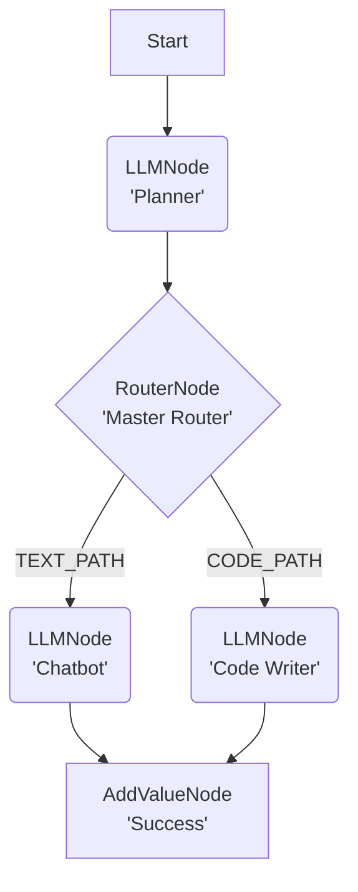

# Lár: The PyTorch for Agents

**Lár** by **SnathAI™** is an open source "define-by-run" agentic framework for building auditable and reliable AI systems.

**Lár** (Irish for "core" or "center") is engineered as a robust alternative to static, "black box" frameworks, which obscure logic, inhibit debugging, and fail unpredictably. Lár implements a **"glass box"** architecture, inspired by the dynamic graphs of PyTorch, where every step of an agent's reasoning process is explicit, inspectable, and logged by default.

This framework provides a deterministic, stateful, and node-based system for orchestrating complex agentic behavior, including self-correction, dynamic branching, and tool-use loops.

-----

## Core Philosophy: "Glass Box" vs. "Black Box"

The primary challenge in production-grade AI is a lack of traceability. When a multi-step agent fails, it's often impossible to determine *why*.

  * **The "Black Box" (Other Frameworks):** Relies on a "magic" `AgentExecutor` that tries to do everything at once. When this magic fails, it's a complex black box that is nearly impossible to debug.

  * **The "Glass Box" (Lár):**  Lár is, by design, a simple, explicit loop. The `GraphExecutor` runs one node at a time, logs the exact state change, and then pauses.

This "define-by-run" approach transforms debugging from an art into a science. You can visually trace the execution, inspect the diff of the state at every transition, and pinpoint the exact node where logic failed. Lár's "flight data recorder" (`history`) isn't an add-on; it's the core output of the engine.

## Why `Lár` is Better: The "Glass Box" Advantage

The Problem | "Black Box" Frameworks (e.g., LangChain)| Lár (The "Glass Box" Engine) |
|------|-------------------------|-------------------|
Debugging | A Nightmare. When an agent fails, you get a 100-line stack trace from inside the framework's "magic" AgentExecutor. You have to guess what went wrong.| Instant & Precise. Your history log is the debugger. You see the exact node that failed (e.g., ToolNode), the exact error (429 Rate Limit), and the exact state that caused it.
Auditability | External & Paid. "What happened?" is a mystery. You need an external, paid tool like LangSmith to add a "flight recorder" to your "black box." | Built-in & Free. The "flight recorder" (history log) is the core, default, open-source output of the GraphExecutor. You built this from day one.
Multi-Agent Collaboration | Chaotic "Chat Room." Agents are put in a room to "talk" to each other. It's "magic," but it's uncontrollable. You can't be sure who will talk next or if they'll get stuck in a loop. | Deterministic "Assembly Line." You are the architect. You define the exact path of collaboration using RouterNode and ToolNode.
Deterministic Control | None. You can't guarantee execution order. The "Tweeter" agent might run before the "Researcher" agent is finished. | Full Control. The "Tweeter" (LLMNode) cannot run until the "RAG Agent" (ToolNode) has successfully finished and saved its result to the state.
Data Flow | Implicit & Messy. Agents pass data by "chatting." The ToolNode's output might be polluted by another agent's "thoughts." | Explicit & Hard-Coded. The data flow is defined by you: RAG Output -> Tweet Input. The "Tweeter" only sees the data it's supposed to.
Resilience & Cost | Wasteful & Brittle. If the RAG agent fails, the Tweeter agent might still run with no data, wasting API calls and money. A loop of 5 agents all chatting can hit rate limits fast. | Efficient & Resilient. If the RAG agent fails, the Tweeter never runs. Your graph stops, saving you money and preventing a bad output. Your LLMNode's built-in retry handles transient errors silently.
Core Philosophy | Sells "Magic." | Sells "Trust."

## Key Features

  * **Define-by-Run Architecture:** The execution graph is created dynamically, step-by-step. This naturally enables complex, stateful logic like loops and self-correction.

  * **Total Auditability:** The `GraphExecutor` produces a complete, step-by-step history of every node executed, the state *before* the run, and the state *after*.

  * **Deterministic Logic:** Replace "prompt-chaining" with explicit, testable Python code. Use the `RouterNode` for clear, auditable "if/else" branching.

  * **Testable Units:** Every node is a standalone class. You can unit test your `ToolNode` (your "hands") and your `RouterNode` (your "logic") completely independently of an LLM call.

  

-----


### Graph Architecture


-----


## The `Lár` Architecture: Core Primitives

You can build any agent with four core components:

1.  **`GraphState`**: A simple, unified object that holds the "memory" of the agent. It is passed to every node, allowing one node to write data (`state.set(...)`) and the next to read it (`state.get(...)`).

2.  **`BaseNode`**: The abstract class (the "contract") for all executable units. It enforces a single method: `execute(self, state)`. The `execute` method's sole responsibility is to perform its logic and return the *next* `BaseNode` to run, or `None` to terminate the graph.

3.  **`GraphExecutor`**: The "engine" that runs the graph. It is a Python generator that runs one node, yields the execution log for that step, and then pauses, waiting for the next call.

4.  **Node Implementations**: The "building blocks" of your agent.

      * **`LLMNode`**: The "Thinker." Calls an LLM (e.g., Gemini) to generate text, modify plans, or correct code.
      * **`ToolNode`**: The "Actor." Executes any deterministic Python function (e.g., run code, search a database, call an API). It supports separate routing for `success` and `error`.
      * **`RouterNode`**: The "Choice." Executes a simple Python function to inspect the state and returns a string key, which deterministically routes execution to the next node. This is your "if/else" statement.
      * **`ClearErrorNode`**: A utility node that cleans up state (e.g., removes `last_error`) to prevent infinite loops.

-----

### Example: The "Glass Box" Audit Trail


You don't need to guess why an agent failed. `lar` is a "glass box" that provides a complete, auditable log for every run, especially failures.

This is a **real execution** log from a lar-built agent. The agent's job was to run a "Planner" and then a "Synthesizer" (both LLMNodes). The GraphExecutor caught a fatal error, gracefully stopped the agent, and produced this perfect audit trail.

**Execution Summary (Run ID: a1b2c3d4-...)**
| Step | Node | Outcome | Key Changes |
| :--- | :--- | :--- | :--- |
| 0 | `LLMNode` | `success` | `+ ADDED: 'search_query'` |
| 1 | `ToolNode` | `success` | `+ ADDED: 'retrieved_context'` |
| 2 | `LLMNode` | `success` | `+ ADDED: 'draft_answer'` |
| 3 | `LLMNode` | **`error`** | **`+ ADDED: 'error': "429 You exceeded your current quota..."`** |

**This is the `lar` difference.** You know the *exact* node (`LLMNode`), the *exact* step (3), and the *exact reason* ("429 Quota Exceeded") for the failure. You can't debug a "black box," but you can **always** fix a "glass box."


## Installation

This project is managed with [Poetry](https://python-poetry.org/).

1.  **Clone the repository:**

    ```bash
    git clone https://github.com/snath-ai/lar.git
    cd lar
    ```

2.  **Install dependencies:**
    This command creates a virtual environment and installs all packages from `pyproject.toml`.

    ```bash
    poetry install
    ```


-----

## The Lár Primitives (The "Lego Bricks")

You can build any agent with 6 core components. `lar` is a "glass box" because you see *exactly* how these components connect.

* **`GraphState`**: The "Memory." A simple Python object that is passed to every node, allowing them to share data.
* **`GraphExecutor`**: The "Engine." A simple `generator` that runs one node at a time and `yield`s the `history` log.
* **`LLMNode`**: The "Brain." It calls the Gemini API to think, write, or critique. It's resilient and auto-retries on rate limits.
* **`ToolNode`**: The "Hands." It runs any Python function (like `run_code` or `search_web`) and has separate `success` and `error` paths.
* **`RouterNode`**: The "Choice." Your `if/else` statement. It runs a simple Python function to decide which node to run next.
* **`AddValueNode` / `ClearErrorNode`**: "Utility" nodes that clean up the state, copy values, and keep your graph running smoothly.

---

## Example 1: The "Planner" Agent (Hello, World!)

This is the simplest, most powerful "real-world" agent you can build. This agent is smart enough to *plan* its work. It takes a user's task and decides whether to write code or just answer as a chatbot.

### 1. The "Glass Box" Flowchart

This is the simple graph we are about to build.



### 2. The Code (The "Lego Bricks" in Action)
This is all you need to build and run this agent. It's just Python.

```python
from lar import *
from lar.utils import compute_state_diff # (Used by executor)

# 1. Define the "choice" logic for our Router
def plan_router_function(state: GraphState) -> str:
    """Reads the 'plan' from the state and returns a route key."""
    plan = state.get("plan", "").strip().upper()
    
    if "CODE" in plan:
        return "CODE_PATH"
    else:
        return "TEXT_PATH"

# 2. Define the agent's nodes (the "bricks")
# We build from the end to the start.

# --- The End Nodes ---
success_node = AddValueNode(
    key="final_status", 
    value="SUCCESS", 
    next_node=None # 'None' means the graph stops
)

chatbot_node = LLMNode(
    model_name="gemini-2.5-pro",
    prompt_template="You are a helpful assistant. Answer the user's task: {task}",
    output_key="final_response",
    next_node=success_node # After answering, go to success
)

code_writer_node = LLMNode(
    model_name="gemini-2.5-pro",
    prompt_template="Write a Python function for this task: {task}",
    output_key="code_string",
    next_node=success_node # For this demo, we just stop
)

# --- The "Choice" Node (The Router) ---
master_router_node = RouterNode(
    decision_function=plan_router_function,
    path_map={
        "CODE_PATH": code_writer_node,
        "TEXT_PATH": chatbot_node
    },
    default_node=chatbot_node # Default to just chatting
)

# --- The "Start" Node (The Planner) ---
planner_node = LLMNode(
    model_name="gemini-2.5-pro",
    prompt_template="""
    Analyze this task: "{task}"
    Does it require writing code or just a text answer?
    Respond with ONLY the word "CODE" or "TEXT".
    """,
    output_key="plan",
    next_node=master_router_node # After planning, go to the router
)

# 3. Run the Agent
executor = GraphExecutor()
initial_state = {"task": "What is the capital of France?"}

# The executor runs the graph and returns the full log
result = executor.run_step_by_step(start_node=planner_node, initial_state=initial_state)

# You can now inspect the 'history' or the 'final_state'
# (This code is just to show the final output)
final_log = list(result)
final_state = GraphState(initial_state)
for step in final_log:
    final_state = GraphState(apply_diff(step["state_before"], step["state_diff"]))

print(final_state.get("final_response"))
# Output: The capital of France is Paris.
```
-----

## Advanced Example: The Self-Correcting "RAG" Agent

The "Planner" is just the beginning. The *real* power of `lar` is building auditable, self-correcting loops.

We have built a **complete, end-to-end RAG demo** that shows `lar` managing a complex, multi-step agent that can:
1.  Plan a search query.
2.  Retrieve context from a local `FAISS` vector database.
3.  Synthesize a "first draft" answer.
4.  **Critique its own draft** using an `LLMNode` as a "test."
5.  **Loop** and *refine* the draft until it passes the critique.

You can run this demo yourself, live, one step at a time.

### **See live RAG Demo ->[ rag-demo](https://github.com/snath-ai/rag-demo)**


## Contributing

We welcome contributions to `lar`. Please open an issue or submit a pull request for any bugs, features, or documentation improvements.

## License

This project is licensed under the MIT License.
