# Architecture Overview

lifx-async is built as a layered architecture with clear separation of concerns.

## System Architecture

```mermaid
graph TB
    subgraph "Layer 4: High-Level API"
        API[api.py<br/>discover, find_lights, etc.]
        DeviceGroup[DeviceGroup<br/>Batch operations]
    end

    subgraph "Layer 3: Device Layer"
        Device[Device<br/>Base class]
        Light[Light<br/>Color control]
        Hev[HevLight<br />HEV support]
        Infrared[InfraredLight<br />Infrared support]
        MultiZone[MultiZoneLight<br/>Linear/1D zones]
        Tile[TileDevice<br/>Matrix/2D zones]
    end

    subgraph "Layer 2: Network Layer"
        Discovery[Discovery<br/>UDP broadcast]
        Connection[Connection<br/>Connection pooling]
        Transport[Transport<br/>UDP sockets]
    end

    subgraph "Layer 1: Protocol Layer"
        Generator[Generator<br/>YAML → Python]
        Types[Protocol Types<br/>Enums, HSBK, etc.]
        Packets[Packets<br/>Message classes]
    end

    subgraph "External"
        YAML[protocol.yml<br/>LIFX specification]
        Network[UDP Network<br/>Port 56700]
    end

    API --> DeviceGroup
    DeviceGroup --> Light
    DeviceGroup --> Hev
    DeviceGroup --> Infrared
    DeviceGroup --> MultiZone
    DeviceGroup --> Tile
    API --> Discovery
    Device --> Connection
    Light --> Device
    Hev --> Light
    Infrared --> Light
    MultiZone --> Light
    Tile --> Light
    Connection --> Transport
    Connection --> Packets
    Discovery --> Transport
    Packets --> Types
    Transport --> Network
    Generator --> YAML
    Generator -.generates.-> Types
    Generator -.generates.-> Packets

    style API fill:#e1f5e1
    style Device fill:#e1f0ff
    style Connection fill:#fff4e1
    style Generator fill:#ffe1f0
```



## Layer Responsibilities

### Layer 1: Protocol Layer

**Purpose**: Handle LIFX binary protocol

- **Auto-Generated**: All code generated from `protocol.yml`
- **Type-Safe**: Full type hints for all structures
- **Binary Serialization**: Pack/unpack protocol messages
- **No Business Logic**: Pure data structures

**Key Files**:

- `protocol_types.py` - Enums, HSBK, field structures
- `packets.py` - Packet class definitions
- `generator.py` - Code generation from YAML

**Example**:

```python
from lifx.protocol.packets import Light
from lifx import HSBK

# Create a packet
packet = Light.SetColor(
    color=HSBK(hue=180, saturation=1.0, brightness=0.8, kelvin=3500), duration=1.0
)

# Serialize to bytes
data = packet.pack()
```

### Layer 2: Network Layer

**Purpose**: Handle network communication

- **UDP Transport**: Async socket operations
- **Discovery**: Broadcast-based device discovery
- **Connection Pooling**: Efficient connection reuse (LRU cache)
- **Retry Logic**: Automatic retry with exponential backoff

**Key Files**:

- `transport.py` - UDP socket wrapper
- `discovery.py` - Device discovery
- `connection.py` - Connection management
- `message.py` - Message building

**Example**:

```python
from lifx.network.connection import DeviceConnection

conn = DeviceConnection(serial="d073d5123456", ip="192.168.1.100")
# Connection automatically pooled
response = await conn.request_response(packet, response_type)
```

### Layer 3: Device Layer

**Purpose**: Device abstractions with high-level operations

- **Device Types**: Base, Light, HevLight, InfraredLight, MultiZoneLight, TileDevice
- **State Storage**: Timestamped state properties with explicit freshness control
- **Type Detection**: Automatic capability detection
- **Async Context Managers**: Automatic resource cleanup

**Key Files**:

- `base.py` - Base Device class
- `light.py` - Light class
- `hev.py` - HevLight class
- `infrared.py` - InfraredLight class
- `multizone.py` - MultiZoneLight class
- `tile.py` - TileDevice class

**Example**:

```python
from lifx import Light

async with Light(serial, ip) as light:
    # High-level operations
    await light.set_color(Colors.BLUE)
    await light.pulse(Colors.RED, period=1.0, cycles=5)
```

### Layer 4: High-Level API

**Purpose**: Simple, batteries-included API

- **Simplified Discovery**: One-line device discovery
- **Batch Operations**: Control multiple devices
- **Direct Connection**: Connect by IP without discovery
- **Filtered Discovery**: Find devices by label or serial

**Key Files**:

- `api.py` - High-level functions
- `color.py` - Color utilities

**Example**:

```python
from lifx import discover, Colors

async with discover() as group:
    await group.set_color(Colors.BLUE)
```

## Data Flow

### Sending a Command


### Discovery Process


## Key Design Decisions

### Async-First

**Why**: LIFX operations involve network I/O which benefits from async

```python
# Multiple devices controlled concurrently
await asyncio.gather(
    light1.set_color(Colors.RED),
    light2.set_color(Colors.BLUE),
    light3.set_color(Colors.GREEN),
)
```

### Connection Pooling

**Why**: Reduces overhead and improves performance

```python
# Same connection reused automatically
async with await Light.from_ip("192.168.1.100") as light:
    await light.set_color(Colors.RED)  # Connection 1
    await light.set_brightness(0.5)  # Reuses Connection 1
    await light.get_label()  # Reuses Connection 1
```

### Storing State with Timestamps

**Why**: Reduces network traffic while keeping you in control of data freshness

```python
import time

# Properties return (value, timestamp) tuples when stored:
stored_color = light.color
if stored_state:
    color, timestamp = stored_color
    age = time.time() - timestamp
    if age < 5.0:  # Still fresh
        # Use stored color
    else:
        # Data is stale, fetch fresh from device
        color, _, _ = await light.get_color()
else:
    # No stored data yet
    color, _, _ = await light.get_color()
```

### Code Generation

**Why**: Protocol updates are automatic, reduces errors

```bash
# Regenerate code
uv run python -m lifx.protocol.generator
```

## Performance Characteristics

### Connection Pool

- **LRU Cache**: Least Recently Used eviction
- **Max Size**: Configurable (default: 128)
- **Metrics**: Track hits, misses, evictions

### Storing State as Properties

- **Format**: `(value, timestamp)` tuples for explicit freshness control
- **Properties**: All device state available as properties
- **Freshness**: Application explicitly manages data age via timestamp
- **Getting Fresh Data**: Use `get_*()` methods to always fetch from device

## Concurrency Model

Each connection supports concurrent requests:

```python
async with DeviceConnection(serial, ip) as conn:
    # All three execute concurrently
    results = await asyncio.gather(
        conn.request_response(packet1, type1),
        conn.request_response(packet2, type2),
        conn.request_response(packet3, type3),
    )
```

**How it works**:

- Background receiver task continuously reads UDP packets
- Responses matched to requests by sequence number
- Each request waits on an `asyncio.Event`
- Single UDP socket per connection

## Next Steps

- [API Reference](../api/index.md) - Detailed API documentation
- [FAQ](../faq.md) - Frequently asked questions
