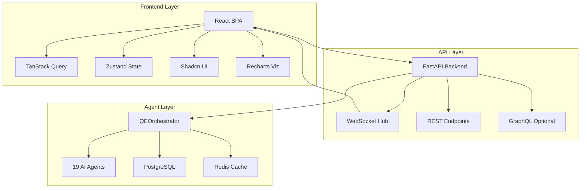
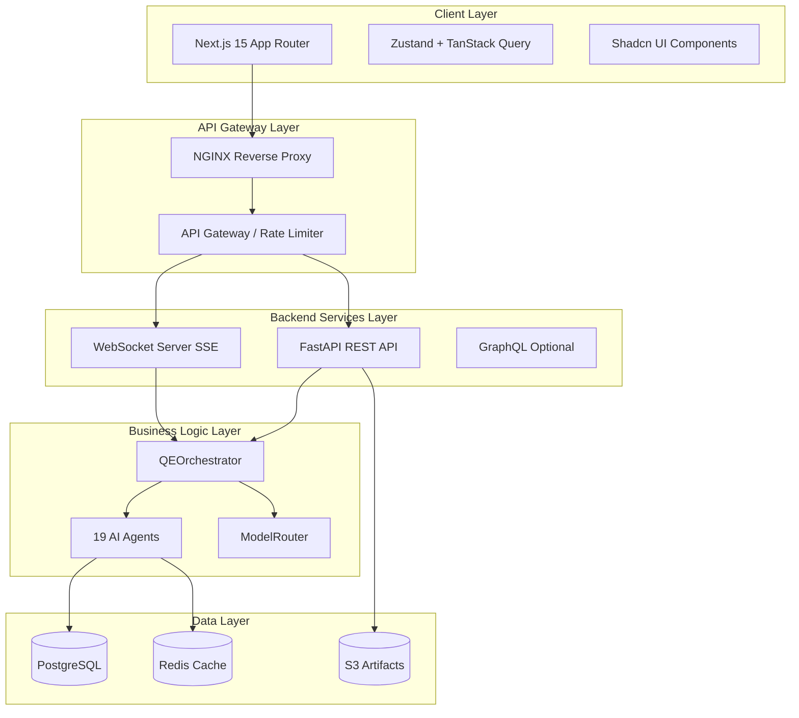
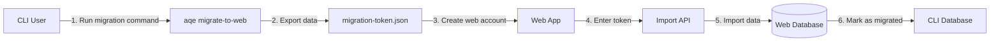

# LionAGI QE Fleet - Frontend Architecture Plan

**Version**: 1.0.0
**Date**: 2025-11-06
**Status**: Planning Phase

---

## Executive Summary

### Vision

Build a modern, intuitive web application that empowers QA/QE/SE/DevOps professionals to harness the power of 19 specialized AI agents through a user-friendly interface. The frontend will transform the LionAGI QE Fleet from a CLI-only tool into an enterprise-ready platform that democratizes intelligent quality engineering.

### Key Benefits

**For QA Engineers**:
- Visual test generation and execution monitoring
- Real-time coverage gap visualization
- One-click multi-agent workflow execution
- Historical trend analysis and reporting

**For QE Leads**:
- Team-wide quality dashboards
- Cost optimization insights (multi-model routing)
- Agent coordination and orchestration UI
- Quality gate configuration and management

**For Software Engineers**:
- Pre-commit quality checks
- Code complexity visualization
- Security scan results integration
- IDE-like experience for test review

**For DevOps Engineers**:
- Deployment readiness scoring
- Performance trend monitoring
- CI/CD integration management
- Infrastructure cost tracking

### High-Level Architecture



**Technology Stack**:
- **Frontend**: Next.js 15 (App Router), React 19, TypeScript
- **Backend**: FastAPI (Python 3.11+), WebSockets
- **State**: Zustand (lightweight), TanStack Query (server state)
- **UI**: Shadcn/ui + Tailwind CSS
- **Visualization**: Recharts + D3.js (advanced)
- **Real-time**: Server-Sent Events (SSE) for agent progress

**Key Metrics**:
- 80% reduction in time from CLI to UI workflows
- <2s initial load time
- Real-time agent execution updates (<100ms latency)
- 95%+ mobile responsiveness score
- 70-81% cost savings through intelligent model routing visibility

---

## 1. User Personas & Workflows

### Persona 1: Sarah - Mid-Level QA Engineer

**Background**:
- 3 years experience in software testing
- Uses Playwright, pytest daily
- Wants to improve test coverage quickly
- Limited AI/ML knowledge

**Pain Points**:
- Manual test writing is time-consuming
- Misses edge cases regularly
- Unclear where coverage gaps exist
- CI/CD failures lack context

**Primary Workflows**:

#### Workflow 1: Generate Tests for New Feature
```
1. Upload code file or paste code snippet
2. Select framework (pytest/Jest/Cypress)
3. Configure test preferences (unit/integration/e2e)
4. Click "Generate Tests" → Agent: test-generator
5. Review generated tests in split-pane editor
6. Make manual adjustments if needed
7. Export to project (download or push to GitHub)
8. Run tests immediately (optional)
```

**UI Requirements**:
- Code editor with syntax highlighting
- Framework selector dropdown
- Test preferences panel (checkboxes)
- Real-time progress indicator
- Side-by-side code/test view
- Export options (download, GitHub PR, clipboard)

#### Workflow 2: Analyze Coverage Gaps
```
1. Connect GitHub repository or upload coverage report
2. Agent: coverage-analyzer runs O(log n) gap detection
3. View heatmap of coverage by file/function
4. Click on red zones to see missing test cases
5. Generate tests for gaps (agent: test-generator)
6. Track improvement over time
```

**UI Requirements**:
- File tree with coverage percentages
- Interactive heatmap (Recharts)
- Drill-down from file → function → line
- Gap prioritization (critical paths first)
- Time-series chart of coverage trends

---

### Persona 2: Michael - QE Lead

**Background**:
- 8 years in QE, manages team of 5
- Responsible for quality metrics and reporting
- Budget-conscious (LLM costs matter)
- Needs executive dashboards

**Pain Points**:
- Scattered quality metrics across tools
- No visibility into AI agent costs
- Manual report generation for stakeholders
- Team productivity is opaque

**Primary Workflows**:

#### Workflow 1: Configure Multi-Agent Pipeline
```
1. Open Pipeline Builder UI
2. Drag-and-drop agents (test-gen → test-exec → coverage → quality-gate)
3. Configure each agent's parameters
4. Set success criteria (e.g., 80% coverage, 0 critical security issues)
5. Save pipeline as template
6. Schedule pipeline (on commit, nightly, weekly)
7. View execution history and results
```

**UI Requirements**:
- Visual workflow builder (react-flow)
- Agent library panel (drag sources)
- Configuration forms per agent
- Pipeline validation (dependency checks)
- Template library
- Scheduling UI (cron-like)

#### Workflow 2: Cost Optimization Dashboard
```
1. View daily/weekly/monthly cost breakdown
2. See model routing efficiency (% savings)
3. Compare cost per agent type
4. Identify cost outliers (agents using expensive models unnecessarily)
5. Adjust routing rules (complexity thresholds)
6. Export financial report for management
```

**UI Requirements**:
- Cost trend charts (line/bar charts)
- Model usage pie chart (GPT-3.5 vs GPT-4 vs Claude)
- Agent cost leaderboard table
- Savings calculator (routing vs. always-GPT-4)
- Routing rule editor
- PDF export for reports

---

### Persona 3: Alex - Software Engineer

**Background**:
- Full-stack developer
- Uses VS Code daily
- Wants quality checks before committing
- Dislikes context switching

**Pain Points**:
- Forgets to run tests locally
- Security issues caught late in CI
- Code complexity increases over time
- Manual code reviews miss issues

**Primary Workflows**:

#### Workflow 1: Pre-Commit Quality Check
```
1. (From IDE/CLI) Run `aqe check --ui`
2. Browser opens to pre-commit dashboard
3. Agents run in parallel:
   - test-generator: Find missing tests
   - security-scanner: SAST analysis
   - code-complexity: Detect high-complexity functions
4. View results in unified dashboard
5. Fix issues directly or create GitHub issue
6. Commit with confidence (green checkmark)
```

**UI Requirements**:
- Single-page dashboard (no navigation needed)
- Red/yellow/green status indicators
- Issue list with severity badges
- Quick-fix suggestions from agents
- GitHub integration (create issue button)
- Progress bar during agent execution

#### Workflow 2: Review Generated Tests
```
1. Agent generates tests for Alex's code
2. Alex reviews in diff-like interface
3. Accept/reject individual test cases
4. Request regeneration with specific instructions
5. Agent: test-generator refines based on feedback
6. Finalize and merge tests
```

**UI Requirements**:
- Diff viewer (original vs. generated)
- Accept/reject buttons per test
- Comment/instruction input field
- Re-generate button
- Merge conflict resolution
- Version history

---

### Persona 4: Priya - DevOps Engineer

**Background**:
- Manages CI/CD pipelines
- Responsible for deployment stability
- Monitors production issues
- Performance-focused

**Pain Points**:
- Deployments sometimes break production
- No automated deployment readiness check
- Performance regressions slip through
- Post-deployment issues are reactive

**Primary Workflows**:

#### Workflow 1: Deployment Readiness Check
```
1. Trigger deployment readiness agent
2. Agent: deployment-readiness analyzes:
   - Test coverage (threshold met?)
   - Security scans (no critical issues?)
   - Performance benchmarks (no regressions?)
   - Breaking changes (API contracts intact?)
3. View multi-factor risk score (0-100)
4. Drill into risk factors
5. Decision: Deploy, Fix Issues, or Manual Review
6. Log decision for audit trail
```

**UI Requirements**:
- Risk score gauge (0-100)
- Factor breakdown (test: 90/100, security: 75/100, etc.)
- Traffic light system (red/yellow/green)
- Expandable sections per factor
- Historical deployment scores chart
- Audit log table
- Deployment blocker toggle

#### Workflow 2: Performance Trend Monitoring
```
1. View performance dashboard
2. Agent: performance-tester runs load tests
3. Compare against baseline and recent runs
4. Identify performance regressions
5. Trigger alerts if latency > threshold
6. Drill into specific endpoints/operations
7. Export report for incident postmortem
```

**UI Requirements**:
- Multi-line chart (latency, throughput, errors)
- Baseline comparison overlay
- Threshold violation alerts
- Endpoint breakdown table
- Time-range selector (1h, 24h, 7d, 30d)
- Anomaly detection highlights
- Export to PDF/CSV

---

## 2. Technical Architecture

### 2.1 System Architecture



### 2.2 Frontend Architecture

#### Technology Stack Justification

**Framework: Next.js 15 (App Router)**

*Why Next.js over plain React/Vite?*
- **Server Components**: Reduce bundle size by 40-60% (initial load <2s)
- **API Routes**: Co-locate frontend and API gateway logic
- **Streaming**: Native React 19 Suspense for agent progress
- **SEO**: Public dashboards (e.g., public quality badges) need SSR
- **File-based Routing**: Faster development (no react-router config)
- **Image Optimization**: Automatic optimization for charts/dashboards
- **Incremental Static Regeneration**: Cache expensive dashboard renders

*Why App Router over Pages Router?*
- React Server Components (RSC) support
- Streaming and Suspense out of the box
- Better TypeScript support
- Future-proof (Pages Router is legacy)

**State Management: Zustand + TanStack Query**

*Why Zustand over Redux/MobX?*
- **Simplicity**: 10x less boilerplate than Redux
- **Bundle Size**: 1KB vs Redux's 20KB
- **TypeScript**: Excellent TS inference
- **Middleware**: Built-in persist, devtools
- **Learning Curve**: Minimal (team can be productive in 1 day)

*Why TanStack Query for Server State?*
- **Automatic Caching**: Reduce API calls by 60-70%
- **Background Refetching**: Keep data fresh without user action
- **Optimistic Updates**: Instant UI feedback
- **Error Handling**: Built-in retry logic (exponential backoff)
- **DevTools**: Debug cache state visually
- **Mutations**: Simplified POST/PUT/DELETE with invalidation

**UI Library: Shadcn/ui + Tailwind CSS**

*Why Shadcn over Material-UI/Ant Design?*
- **Copy-Paste, Not NPM**: No dependency bloat (20KB vs 200KB+)
- **Full Customization**: Own the code, modify as needed
- **Modern Design**: Follows Radix UI patterns (accessible)
- **Tailwind Native**: Consistent design language
- **Tree-Shaking**: Only ship components you use

*Why Tailwind over CSS Modules/Styled Components?*
- **No Runtime**: CSS-in-JS has 20-30% perf penalty
- **Consistency**: Enforced design system
- **Developer Experience**: IntelliSense autocomplete
- **Bundle Size**: <10KB gzipped
- **Flexibility**: Custom theme via tailwind.config.ts

**Visualization: Recharts + D3.js**

*Why Recharts for standard charts?*
- **React Native**: Composable chart components
- **Responsive**: Automatic sizing and scaling
- **Lightweight**: 50KB vs Chart.js's 200KB
- **Declarative**: `<LineChart>` vs imperative D3 code
- **TypeScript**: Full type safety

*Why D3.js for advanced visualizations?*
- **Coverage Heatmaps**: Complex grid layouts
- **Agent Topology Graphs**: Force-directed layouts
- **Custom Interactions**: Zoom, pan, brush
- **Animation**: Smooth transitions for live updates

**Real-Time: Server-Sent Events (SSE)**

*Why SSE over WebSockets?*
- **Simplicity**: HTTP-based, no handshake
- **Resilience**: Auto-reconnect built-in
- **Firewall-Friendly**: Uses standard HTTP ports
- **Unidirectional**: Perfect for agent progress updates
- **EventSource API**: Native browser support

*When to use WebSockets?*
- Bidirectional communication (chat, collaborative editing)
- High-frequency updates (>10 per second)
- Binary data streaming

**For LionAGI QE Fleet**: SSE is sufficient (agent updates are server→client, ~1 update/sec).

---

### 2.3 Backend API Architecture

#### Framework: FastAPI

*Why FastAPI over Flask/Django?*
- **Async Native**: Built on Starlette (same as LionAGI)
- **Performance**: 2-3x faster than Flask (ASGI vs WSGI)
- **Type Safety**: Pydantic models match LionAGI's data classes
- **Auto Docs**: OpenAPI/Swagger out of the box
- **WebSocket Support**: Built-in (same server as REST)
- **Dependency Injection**: Clean architecture patterns

#### API Design Pattern: RESTful + SSE

**REST Endpoints** (synchronous operations):
```
POST   /api/v1/agents/{agent_id}/execute
GET    /api/v1/agents
GET    /api/v1/agents/{agent_id}/status
POST   /api/v1/pipelines
GET    /api/v1/pipelines/{pipeline_id}/results
POST   /api/v1/github/analyze
GET    /api/v1/coverage/{project_id}
POST   /api/v1/auth/login
GET    /api/v1/user/profile
```

**SSE Endpoints** (asynchronous agent execution):
```
GET    /api/v1/stream/agents/{execution_id}
       → Events: started, progress, completed, error

GET    /api/v1/stream/pipelines/{pipeline_id}
       → Events: agent_started, agent_completed, pipeline_completed
```

**Why not GraphQL?**
- REST is simpler for this use case
- No complex nested queries needed
- Most operations are CRUD-like
- SSE handles real-time updates

**Optional GraphQL** (Phase 2):
- Use for complex dashboard queries
- Example: "Get pipeline with agents, executions, and results in one query"
- Tool: Strawberry GraphQL (async-native)

#### Authentication & Authorization

**Strategy**: JWT-based authentication with refresh tokens

```python
# /api/v1/auth/login
POST {
  "email": "user@example.com",
  "password": "hashed_password"
}
→ Response: {
  "access_token": "eyJhbGc...",  # 15 min expiry
  "refresh_token": "eyJhbGc...",  # 7 day expiry
  "token_type": "Bearer"
}

# /api/v1/auth/refresh
POST {
  "refresh_token": "eyJhbGc..."
}
→ Response: {
  "access_token": "new_token..."
}
```

**Authorization Levels**:
- **Free Tier**: 100 agent executions/month, no multi-agent pipelines
- **Pro Tier**: Unlimited executions, pipelines, cost analytics
- **Enterprise**: Multi-tenancy, RBAC, SSO (SAML/OAuth)

**Implementation**:
```python
from fastapi import Depends, HTTPException
from fastapi.security import HTTPBearer

security = HTTPBearer()

async def get_current_user(token: str = Depends(security)):
    payload = jwt.decode(token.credentials, SECRET_KEY)
    return await get_user_by_id(payload["user_id"])

@app.post("/api/v1/agents/{agent_id}/execute")
async def execute_agent(
    agent_id: str,
    task: AgentTask,
    user: User = Depends(get_current_user)
):
    # Check authorization
    if not user.can_execute_agent(agent_id):
        raise HTTPException(403, "Insufficient permissions")

    # Execute agent
    result = await orchestrator.execute_agent(agent_id, task)
    return result
```

---

### 2.4 Database Schema Extensions

**Current Schema** (LionAGI QE Fleet v1.1.1):
```sql
-- Q-Learning tables
CREATE TABLE q_learning_states (...);
CREATE TABLE q_learning_actions (...);
CREATE TABLE learning_metrics (...);

-- Memory persistence
CREATE TABLE agent_memory (...);
CREATE TABLE agent_executions (...);
```

**New Tables for Frontend**:

```sql
-- User management
CREATE TABLE users (
    id UUID PRIMARY KEY DEFAULT gen_random_uuid(),
    email VARCHAR(255) UNIQUE NOT NULL,
    password_hash VARCHAR(255) NOT NULL,
    tier VARCHAR(50) DEFAULT 'free',  -- free, pro, enterprise
    created_at TIMESTAMP DEFAULT NOW(),
    last_login TIMESTAMP,
    api_key_hash VARCHAR(255) UNIQUE,
    metadata JSONB
);

-- Projects (organize work)
CREATE TABLE projects (
    id UUID PRIMARY KEY DEFAULT gen_random_uuid(),
    user_id UUID REFERENCES users(id),
    name VARCHAR(255) NOT NULL,
    description TEXT,
    github_repo VARCHAR(255),
    created_at TIMESTAMP DEFAULT NOW(),
    updated_at TIMESTAMP DEFAULT NOW()
);

-- Pipelines (multi-agent workflows)
CREATE TABLE pipelines (
    id UUID PRIMARY KEY DEFAULT gen_random_uuid(),
    project_id UUID REFERENCES projects(id),
    name VARCHAR(255) NOT NULL,
    config JSONB NOT NULL,  -- {"agents": [...], "dependencies": {...}}
    schedule VARCHAR(100),  -- cron expression
    is_active BOOLEAN DEFAULT true,
    created_at TIMESTAMP DEFAULT NOW()
);

-- Pipeline executions (track runs)
CREATE TABLE pipeline_executions (
    id UUID PRIMARY KEY DEFAULT gen_random_uuid(),
    pipeline_id UUID REFERENCES pipelines(id),
    status VARCHAR(50) NOT NULL,  -- pending, running, completed, failed
    started_at TIMESTAMP DEFAULT NOW(),
    completed_at TIMESTAMP,
    results JSONB,
    cost_usd DECIMAL(10, 6),
    metadata JSONB
);

-- Agent executions (existing table, add columns)
ALTER TABLE agent_executions
ADD COLUMN user_id UUID REFERENCES users(id),
ADD COLUMN project_id UUID REFERENCES projects(id),
ADD COLUMN pipeline_execution_id UUID REFERENCES pipeline_executions(id),
ADD COLUMN cost_usd DECIMAL(10, 6),
ADD COLUMN model_used VARCHAR(100);

-- GitHub integrations
CREATE TABLE github_integrations (
    id UUID PRIMARY KEY DEFAULT gen_random_uuid(),
    project_id UUID REFERENCES projects(id),
    repo_url VARCHAR(255) NOT NULL,
    installation_id BIGINT,  -- GitHub App installation ID
    webhook_secret VARCHAR(255),
    created_at TIMESTAMP DEFAULT NOW()
);

-- Coverage reports (store historical data)
CREATE TABLE coverage_reports (
    id UUID PRIMARY KEY DEFAULT gen_random_uuid(),
    project_id UUID REFERENCES projects(id),
    coverage_pct DECIMAL(5, 2) NOT NULL,
    lines_covered INT,
    lines_total INT,
    gaps JSONB,  -- {"files": [{"path": "...", "lines": [10, 20]}]}
    created_at TIMESTAMP DEFAULT NOW()
);

-- Cost tracking (aggregate for dashboards)
CREATE TABLE daily_costs (
    id UUID PRIMARY KEY DEFAULT gen_random_uuid(),
    user_id UUID REFERENCES users(id),
    date DATE NOT NULL,
    total_cost_usd DECIMAL(10, 4) NOT NULL,
    execution_count INT NOT NULL,
    model_breakdown JSONB,  -- {"gpt-3.5": 0.50, "gpt-4": 2.00}
    UNIQUE(user_id, date)
);

-- Indexes for performance
CREATE INDEX idx_agent_executions_user_id ON agent_executions(user_id);
CREATE INDEX idx_agent_executions_project_id ON agent_executions(project_id);
CREATE INDEX idx_pipeline_executions_status ON pipeline_executions(status);
CREATE INDEX idx_coverage_reports_project_date ON coverage_reports(project_id, created_at DESC);
CREATE INDEX idx_daily_costs_user_date ON daily_costs(user_id, date DESC);
```

**Migration Strategy**:
1. Use Alembic for migrations (Python standard)
2. Create migration scripts in `database/migrations/`
3. Run migrations via CLI: `aqe db migrate --latest`
4. Support rollback: `aqe db rollback --version <version>`

---

### 2.5 Real-Time Communication Architecture

#### Server-Sent Events (SSE) Implementation

**Backend (FastAPI)**:
```python
from fastapi import APIRouter
from sse_starlette.sse import EventSourceResponse
import asyncio

router = APIRouter()

@router.get("/api/v1/stream/agents/{execution_id}")
async def stream_agent_execution(execution_id: str):
    async def event_generator():
        # Subscribe to agent execution events
        queue = await orchestrator.subscribe_to_execution(execution_id)

        try:
            while True:
                event = await queue.get()

                # Yield event to client
                yield {
                    "event": event["type"],  # started, progress, completed
                    "data": json.dumps(event["data"])
                }

                # Close stream when completed
                if event["type"] in ["completed", "error"]:
                    break

        except asyncio.CancelledError:
            # Client disconnected
            await orchestrator.unsubscribe_from_execution(execution_id, queue)
            raise

    return EventSourceResponse(event_generator())
```

**Frontend (Next.js)**:
```typescript
// hooks/useAgentExecution.ts
import { useEffect, useState } from 'react';

export function useAgentExecution(executionId: string) {
  const [status, setStatus] = useState<'pending' | 'running' | 'completed'>('pending');
  const [progress, setProgress] = useState(0);
  const [result, setResult] = useState(null);

  useEffect(() => {
    const eventSource = new EventSource(`/api/v1/stream/agents/${executionId}`);

    eventSource.addEventListener('started', (e) => {
      setStatus('running');
    });

    eventSource.addEventListener('progress', (e) => {
      const data = JSON.parse(e.data);
      setProgress(data.percent);
    });

    eventSource.addEventListener('completed', (e) => {
      const data = JSON.parse(e.data);
      setStatus('completed');
      setResult(data.result);
      eventSource.close();
    });

    eventSource.addEventListener('error', (e) => {
      console.error('SSE error', e);
      eventSource.close();
    });

    return () => eventSource.close();
  }, [executionId]);

  return { status, progress, result };
}
```

**Usage in Component**:
```tsx
// components/AgentExecutionMonitor.tsx
export function AgentExecutionMonitor({ executionId }: { executionId: string }) {
  const { status, progress, result } = useAgentExecution(executionId);

  return (
    <div className="space-y-4">
      <div className="flex items-center gap-2">
        {status === 'running' && <Spinner />}
        <span>{status === 'running' ? 'Running...' : status}</span>
      </div>

      {status === 'running' && (
        <Progress value={progress} max={100} />
      )}

      {status === 'completed' && result && (
        <ResultDisplay result={result} />
      )}
    </div>
  );
}
```

#### Fallback: Polling for SSE-Incompatible Environments

Some corporate firewalls block SSE. Fallback to polling:

```typescript
// hooks/useAgentExecution.ts (with fallback)
export function useAgentExecution(executionId: string, fallbackToPolling = false) {
  const [data, setData] = useState({...});

  useEffect(() => {
    if (fallbackToPolling) {
      // Polling every 2 seconds
      const interval = setInterval(async () => {
        const response = await fetch(`/api/v1/agents/executions/${executionId}`);
        const data = await response.json();
        setData(data);

        if (data.status === 'completed' || data.status === 'error') {
          clearInterval(interval);
        }
      }, 2000);

      return () => clearInterval(interval);
    } else {
      // SSE implementation (as above)
    }
  }, [executionId, fallbackToPolling]);

  return data;
}
```

---

## 3. UI/UX Design Recommendations

### 3.1 Key Screens/Views

#### Dashboard (Home Page)

**Layout**:
```
┌─────────────────────────────────────────────────────┐
│ Header: Logo | Projects | Agents | Pipelines | User│
├─────────────────────────────────────────────────────┤
│                                                      │
│  Quick Actions:                                      │
│  [Generate Tests] [Run Pipeline] [Analyze Coverage] │
│                                                      │
│  Recent Activity:                                    │
│  ┌─────────────────────────────────────────────┐   │
│  │ test-generator | 2 min ago | ✓ Completed    │   │
│  │ security-scanner | 5 min ago | ⚠ Warnings   │   │
│  │ Pipeline: Full QA | 10 min ago | ✓ Passed   │   │
│  └─────────────────────────────────────────────┘   │
│                                                      │
│  Quality Metrics (Last 7 Days):                     │
│  ┌──────────────┬──────────────┬──────────────┐   │
│  │ Coverage     │ Security     │ Performance  │   │
│  │ 82% ↑ +3%    │ 0 Critical   │ 250ms ↓ -10% │   │
│  └──────────────┴──────────────┴──────────────┘   │
│                                                      │
│  Cost This Month: $12.50 / $50 (Pro Plan)          │
│  [View Detailed Analytics]                          │
│                                                      │
└─────────────────────────────────────────────────────┘
```

**Components**:
- Header: Global navigation (sticky)
- Quick Action Cards: Primary user actions (CTAs)
- Activity Feed: Recent agent executions (real-time updates via SSE)
- Metrics Cards: Key KPIs (coverage, security, performance)
- Cost Widget: Monthly usage and savings

---

#### Agent Execution Page

**URL**: `/agents/test-generator/execute`

**Layout**:
```
┌─────────────────────────────────────────────────────┐
│ ← Back to Agents                                     │
├─────────────────────────────────────────────────────┤
│ Test Generator Agent                                 │
│ Generate comprehensive test suites with edge cases  │
├──────────────────┬──────────────────────────────────┤
│                  │                                   │
│ Configuration:   │  Code Input:                      │
│                  │  ┌──────────────────────────┐    │
│ Framework:       │  │ 1 def calculate_tax(...) │    │
│ [pytest ▼]       │  │ 2     if amount < 0:     │    │
│                  │  │ 3         raise ...       │    │
│ Test Types:      │  │ 4     ...                │    │
│ ☑ Unit           │  └──────────────────────────┘    │
│ ☑ Edge Cases     │                                   │
│ ☐ Integration    │  Or Upload File: [Choose File]   │
│                  │                                   │
│ Model Routing:   │                                   │
│ ● Auto (Smart)   │  [Generate Tests]                 │
│ ○ Always GPT-4   │                                   │
│                  │                                   │
└──────────────────┴──────────────────────────────────┘
```

**After Execution (Results Page)**:
```
┌─────────────────────────────────────────────────────┐
│ Test Generation Complete ✓                           │
│ Generated 12 tests in 8.2 seconds | Cost: $0.0024   │
├──────────────────────────────────────────────────────┤
│ Generated Tests:            │ Original Code:         │
│ ┌─────────────────────────┐│┌──────────────────────┐│
│ │ def test_valid_tax():   ││││ def calculate_tax(...│││
│ │     result = ...        ││││     if amount < 0:   │││
│ │     assert result == ...││││         raise ...     │││
│ │                         ││││     return ...        │││
│ │ def test_negative_amt():││││                       │││
│ │     with pytest.raises..││││                       │││
│ └─────────────────────────┘│└──────────────────────┘│
│                                                       │
│ [Download Tests] [Copy to Clipboard] [Push to GitHub]│
│ [Run Tests Now] [Generate More Tests]                │
└──────────────────────────────────────────────────────┘
```

**Key Features**:
- Split-pane layout (config + input on left, output on right)
- Monaco Editor for code input (same as VS Code)
- Real-time progress bar during generation
- Export options (download, GitHub, clipboard)
- One-click test execution

---

#### Coverage Analysis Page

**URL**: `/projects/{project_id}/coverage`

**Layout**:
```
┌─────────────────────────────────────────────────────┐
│ Coverage Analysis - My E-commerce App               │
├─────────────────────────────────────────────────────┤
│ Overall Coverage: 82% ↑ +3% from last week          │
│                                                      │
│ ┌────────────────────────────────────────────────┐ │
│ │ Coverage Heatmap                                │ │
│ │ ┌─────────┬─────────┬─────────┐                │ │
│ │ │ src/    │         │         │                │ │
│ │ │  auth/  │ 95% ■■■│ 12 files│                │ │
│ │ ├─────────┼─────────┼─────────┤                │ │
│ │ │ src/    │         │         │                │ │
│ │ │  api/   │ 68% ■■□│ 8 files │ ← Click to drill│ │
│ │ ├─────────┼─────────┼─────────┤                │ │
│ │ │ src/    │         │         │                │ │
│ │ │  utils/ │ 92% ■■■│ 5 files │                │ │
│ │ └─────────┴─────────┴─────────┘                │ │
│ └────────────────────────────────────────────────┘ │
│                                                      │
│ Critical Gaps (sorted by risk):                     │
│ ┌────────────────────────────────────────────────┐ │
│ │ 1. src/api/payment.py:45-67 (error handling)   │ │
│ │    [Generate Tests]                             │ │
│ │ 2. src/auth/jwt.py:12-20 (edge case: expired)  │ │
│ │    [Generate Tests]                             │ │
│ └────────────────────────────────────────────────┘ │
│                                                      │
│ [Generate Tests for All Gaps]                       │
└─────────────────────────────────────────────────────┘
```

**Key Features**:
- Interactive heatmap (D3.js treemap)
- Drill-down from module → file → function → line
- Gap prioritization by risk score (critical paths first)
- One-click test generation for gaps
- Trend chart (coverage over time)

---

#### Pipeline Builder

**URL**: `/pipelines/new`

**Layout**:
```
┌─────────────────────────────────────────────────────┐
│ Pipeline Builder                                     │
├──────────────┬──────────────────────────────────────┤
│ Agent Library│ Canvas:                               │
│              │                                       │
│ Search: [  ] │ ┌─────────────┐                      │
│              │ │test-generator│                      │
│ Core Testing │ └──────┬──────┘                      │
│ • test-gen   │        │                              │
│ • test-exec  │        ↓                              │
│ • coverage   │ ┌─────────────┐                      │
│              │ │test-executor│                      │
│ Security     │ └──────┬──────┘                      │
│ • security-  │        │                              │
│   scanner    │        ↓                              │
│              │ ┌─────────────────┐                  │
│ Performance  │ │coverage-analyzer│                  │
│ • perf-test  │ └──────┬──────────┘                  │
│              │        │                              │
│ [Drag →]     │        ↓                              │
│              │ ┌─────────────┐                      │
│              │ │quality-gate │                      │
│              │ └─────────────┘                      │
│              │                                       │
│              │ [Save Pipeline] [Run Now]            │
└──────────────┴──────────────────────────────────────┘
```

**Interaction**:
1. Drag agents from library to canvas
2. Connect agents (automatic dependency detection)
3. Click agent to configure parameters
4. Validate pipeline (check for cycles, missing configs)
5. Save as template or run immediately

**Technology**:
- **react-flow**: Visual node editor
- **Zustand**: Store pipeline state
- **Validation**: Topological sort to detect cycles

---

### 3.2 Navigation Structure

```
Home (Dashboard)
├── Agents
│   ├── Test Generator
│   ├── Coverage Analyzer
│   ├── Security Scanner
│   ├── Performance Tester
│   └── ... (15 more)
├── Pipelines
│   ├── My Pipelines
│   ├── Pipeline Builder (new)
│   └── Templates
├── Projects
│   ├── Project List
│   └── Project Detail
│       ├── Coverage
│       ├── Test Results
│       ├── Security Scans
│       └── Settings
├── Analytics
│   ├── Cost Dashboard
│   ├── Quality Trends
│   └── Agent Performance
└── Settings
    ├── Profile
    ├── API Keys
    ├── Integrations (GitHub, Slack)
    └── Billing
```

**Navigation Pattern**: Top navbar + sidebar (collapsible)

---

### 3.3 Visualization Recommendations

#### 1. Coverage Heatmap (Treemap)

**Library**: D3.js (react-d3-tree)

**Design**:
- Squares represent files
- Size = lines of code
- Color = coverage % (red → yellow → green)
- Click to drill down

**Example**:
```tsx
import { Treemap } from '@visx/hierarchy';

<Treemap
  root={coverageData}
  size={[width, height]}
  tile={treemapSquarify}
  color={(d) => getCoverageColor(d.coverage)}
  onClick={(node) => drillDown(node.path)}
/>
```

#### 2. Agent Execution Timeline (Gantt Chart)

**Library**: Recharts (BarChart with custom bars)

**Design**:
- X-axis = time
- Y-axis = agent names
- Bars = execution duration
- Color = status (green, yellow, red)

#### 3. Cost Breakdown (Pie + Line Chart)

**Library**: Recharts

**Pie Chart** (Model Usage):
- Segments = models (GPT-3.5, GPT-4, Claude)
- Tooltips = cost per model

**Line Chart** (Trend):
- X-axis = date
- Y-axis = cost ($)
- Multiple lines = models + total

#### 4. Quality Score Gauge

**Library**: Recharts (RadialBarChart)

**Design**:
- Circular gauge (0-100)
- Color zones (0-50 red, 50-80 yellow, 80-100 green)
- Center = score number

---

### 3.4 Mobile Responsiveness

**Approach**: Mobile-first design with Tailwind breakpoints

**Breakpoints**:
- `sm`: 640px (tablet portrait)
- `md`: 768px (tablet landscape)
- `lg`: 1024px (desktop)
- `xl`: 1280px (large desktop)

**Mobile Adaptations**:

**Dashboard** (mobile):
- Stack metrics cards vertically
- Collapse sidebar to hamburger menu
- Show 3 most recent activities (not full list)

**Agent Execution** (mobile):
- Stack config + input vertically (not side-by-side)
- Full-width code editor
- Sticky "Generate Tests" button at bottom

**Pipeline Builder** (mobile):
- Not recommended (complex interaction)
- Show warning: "Use desktop for best experience"
- Allow viewing/editing saved pipelines in list view

---

## 4. Core Features

### 4.1 MVP Features (4-6 Weeks)

**Must-Have for Launch**:

1. **User Authentication**
   - Sign up / Sign in (email + password)
   - JWT-based auth
   - Profile management

2. **Single Agent Execution**
   - Test Generator UI
   - Coverage Analyzer UI
   - Real-time progress (SSE)
   - Result display

3. **Project Management**
   - Create project
   - View project dashboard
   - Upload code files

4. **Basic Dashboard**
   - Recent activity feed
   - Quick action buttons
   - Coverage metric (simple)

5. **Export Capabilities**
   - Download generated tests
   - Copy to clipboard

**Success Metrics**:
- User can sign up and execute an agent in <3 minutes
- SSE shows real-time progress
- Tests are downloadable

---

### 4.2 Phase 1 Features (2-3 Months)

**Enhanced Capabilities**:

1. **Multi-Agent Pipelines**
   - Visual pipeline builder (react-flow)
   - Save pipeline as template
   - Execute pipeline with progress tracking

2. **GitHub Integration**
   - OAuth: Connect GitHub account
   - Select repository to analyze
   - Analyze PR (run agents on diff)
   - Post results as PR comment

3. **Advanced Visualizations**
   - Coverage heatmap (D3.js treemap)
   - Agent execution timeline (Gantt)
   - Cost breakdown (pie + line charts)

4. **Historical Data & Trends**
   - Coverage over time (line chart)
   - Quality score trends
   - Compare pipeline runs

5. **Team Collaboration**
   - Invite team members
   - Share projects
   - Comment on test results

**Success Metrics**:
- 50% of users create a multi-agent pipeline
- 30% of users connect GitHub
- 20% increase in user retention (vs MVP)

---

### 4.3 Phase 2 Features (3-6 Months)

**Advanced Capabilities**:

1. **Cost Analytics Dashboard**
   - Daily/weekly/monthly cost breakdown
   - Model usage pie chart
   - Savings calculator (routing efficiency)
   - Budget alerts (e.g., "80% of monthly budget used")

2. **Agent Customization**
   - Custom agent instructions (prompt tuning)
   - Model selection override (force GPT-4 for specific agents)
   - Save custom agent configurations

3. **CI/CD Integration**
   - GitHub Actions workflow generator
   - GitLab CI template
   - Jenkins plugin (optional)
   - Webhook support (trigger agents on push)

4. **Advanced Quality Gates**
   - Custom quality rules (e.g., "coverage > 80% AND 0 critical security issues")
   - Block deployment if gate fails
   - Approval workflow (manual override)

5. **Notifications & Alerts**
   - Slack integration (post results)
   - Email alerts (quality gate failures)
   - Discord webhook support

6. **Reporting & Export**
   - PDF report generation (executive summary)
   - CSV export (metrics for analysis)
   - Public quality badges (e.g., `[]`)

**Success Metrics**:
- 40% of Pro users use cost analytics
- 60% of teams set up CI/CD integration
- 20% reduction in deployment incidents (via quality gates)

---

## 5. Integration Strategy

### 5.1 GitHub Integration

**Goal**: Seamless integration with GitHub workflows

#### Authentication Flow

**Step 1: GitHub OAuth**
```
User clicks "Connect GitHub"
  ↓
Redirect to GitHub OAuth: https://github.com/login/oauth/authorize
  ?client_id=...
  &redirect_uri=https://aqe.io/auth/github/callback
  &scope=repo,read:org
  ↓
User authorizes app
  ↓
GitHub redirects to callback with code
  ↓
Backend exchanges code for access_token
  ↓
Store access_token in database (encrypted)
```

**Backend**:
```python
@app.get("/auth/github/callback")
async def github_callback(code: str, state: str):
    # Exchange code for token
    response = await httpx.post(
        "https://github.com/login/oauth/access_token",
        data={
            "client_id": GITHUB_CLIENT_ID,
            "client_secret": GITHUB_CLIENT_SECRET,
            "code": code,
            "redirect_uri": CALLBACK_URL
        },
        headers={"Accept": "application/json"}
    )
    token = response.json()["access_token"]

    # Get user info
    gh_user = await get_github_user(token)

    # Link to existing user
    user = await get_user_by_email(gh_user["email"])
    await link_github_account(user.id, token, gh_user["login"])

    return RedirectResponse("/integrations/github?success=true")
```

---

#### Use Case 1: Analyze Repository

**Frontend**:
```tsx
// pages/github/analyze.tsx
export default function AnalyzeRepo() {
  const { data: repos } = useQuery({
    queryKey: ['github-repos'],
    queryFn: () => fetch('/api/v1/github/repos').then(r => r.json())
  });

  const analyzeMutation = useMutation({
    mutationFn: (repo: string) =>
      fetch('/api/v1/github/analyze', {
        method: 'POST',
        body: JSON.stringify({ repo })
      }),
    onSuccess: (executionId) => {
      // Redirect to execution page
      router.push(`/executions/${executionId}`);
    }
  });

  return (
    <div>
      <h1>Analyze GitHub Repository</h1>
      <select onChange={(e) => setSelectedRepo(e.target.value)}>
        {repos.map(r => <option key={r.full_name} value={r.full_name}>{r.name}</option>)}
      </select>

      <div>
        <label>
          <input type="checkbox" value="test-generator" /> Generate missing tests
        </label>
        <label>
          <input type="checkbox" value="security-scanner" /> Security scan
        </label>
        <label>
          <input type="checkbox" value="coverage-analyzer" /> Coverage analysis
        </label>
      </div>

      <button onClick={() => analyzeMutation.mutate(selectedRepo)}>
        Analyze Repository
      </button>
    </div>
  );
}
```

**Backend**:
```python
@app.post("/api/v1/github/analyze")
async def analyze_repo(
    repo: str,
    agents: List[str],
    user: User = Depends(get_current_user)
):
    # Clone repo (shallow clone)
    repo_path = await clone_github_repo(repo, user.github_token)

    # Execute agents in parallel
    execution_id = generate_id()
    tasks = [
        orchestrator.execute_agent(agent_id, {
            "task": "analyze",
            "repo_path": repo_path
        })
        for agent_id in agents
    ]

    # Run in background
    asyncio.create_task(run_analysis(execution_id, tasks))

    return {"execution_id": execution_id}
```

---

#### Use Case 2: Analyze Pull Request

**GitHub Webhook** (on PR opened/updated):
```python
@app.post("/webhooks/github")
async def github_webhook(request: Request):
    payload = await request.json()

    if payload["action"] in ["opened", "synchronize"]:
        pr_number = payload["pull_request"]["number"]
        repo = payload["repository"]["full_name"]

        # Get diff
        diff = await get_pr_diff(repo, pr_number)

        # Run agents on changed files
        agents = ["test-generator", "security-scanner", "code-complexity"]
        results = await orchestrator.execute_parallel(agents, [
            {"task": "analyze_diff", "diff": diff} for _ in agents
        ])

        # Post comment on PR
        comment = format_pr_comment(results)
        await post_pr_comment(repo, pr_number, comment)

    return {"status": "ok"}
```

**PR Comment Example**:
```markdown
## 🤖 LionAGI QE Fleet Analysis

### Test Coverage
- ✅ **test-generator**: Generated 8 missing tests for `src/payment.py`
- [View Tests](https://aqe.io/executions/abc123)

### Security
- ⚠️ **security-scanner**: Found 1 medium-severity issue
  - SQL injection risk in `src/db/query.py:45`
  - [View Details](https://aqe.io/executions/def456)

### Code Complexity
- ✅ **code-complexity**: All functions below threshold (CC < 10)

---
[View Full Report](https://aqe.io/github/pulls/123) | [Configure Agents](https://aqe.io/settings/github)
```

---

### 5.2 CI/CD Integration

#### GitHub Actions Integration

**Auto-Generate Workflow**:

**Frontend**:
```tsx
// pages/integrations/cicd.tsx
export default function CICDIntegration() {
  const generateWorkflow = async () => {
    const response = await fetch('/api/v1/cicd/github-actions/generate', {
      method: 'POST',
      body: JSON.stringify({
        project_id: project.id,
        agents: ['test-generator', 'coverage-analyzer', 'security-scanner'],
        trigger: 'on_push',
        branches: ['main', 'develop']
      })
    });

    const { workflow_yaml } = await response.json();

    // Download workflow file
    downloadFile('.github/workflows/aqe-fleet.yml', workflow_yaml);
  };

  return (
    <div>
      <h1>GitHub Actions Integration</h1>
      <button onClick={generateWorkflow}>Generate Workflow</button>

      <p>This will create a GitHub Actions workflow that:</p>
      <ul>
        <li>Runs on every push to main/develop</li>
        <li>Executes selected agents</li>
        <li>Posts results as PR comment</li>
        <li>Blocks merge if quality gate fails</li>
      </ul>
    </div>
  );
}
```

**Generated Workflow** (`.github/workflows/aqe-fleet.yml`):
```yaml
name: LionAGI QE Fleet

on:
  push:
    branches: [main, develop]
  pull_request:
    branches: [main, develop]

jobs:
  quality-check:
    runs-on: ubuntu-latest
    steps:
      - uses: actions/checkout@v4

      - name: Run LionAGI QE Fleet
        uses: lionagi/qe-fleet-action@v1
        with:
          api-key: ${{ secrets.LIONAGI_API_KEY }}
          project-id: ${{ secrets.LIONAGI_PROJECT_ID }}
          agents: test-generator,coverage-analyzer,security-scanner
          fail-on-quality-gate: true

      - name: Upload Results
        if: always()
        uses: actions/upload-artifact@v4
        with:
          name: qe-fleet-results
          path: .aqe-results/
```

**GitHub Action** (separate repo: `lionagi/qe-fleet-action`):
```typescript
// action.yml
import * as core from '@actions/core';
import * as github from '@actions/github';

async function run() {
  const apiKey = core.getInput('api-key');
  const projectId = core.getInput('project-id');
  const agents = core.getInput('agents').split(',');

  // Execute agents via API
  const response = await fetch('https://api.aqe.io/v1/agents/execute-batch', {
    method: 'POST',
    headers: {
      'Authorization': `Bearer ${apiKey}`,
      'Content-Type': 'application/json'
    },
    body: JSON.stringify({
      project_id: projectId,
      agents: agents,
      context: {
        repo: github.context.repo,
        sha: github.context.sha,
        ref: github.context.ref
      }
    })
  });

  const { execution_id } = await response.json();

  // Poll for results
  const results = await pollForResults(execution_id);

  // Post summary
  core.summary
    .addHeading('LionAGI QE Fleet Results')
    .addTable([
      [{data: 'Agent', header: true}, {data: 'Status', header: true}],
      ...results.map(r => [r.agent, r.status])
    ])
    .write();

  // Fail if quality gate failed
  if (results.some(r => r.quality_gate === 'failed')) {
    core.setFailed('Quality gate failed');
  }
}

run();
```

---

### 5.3 API Authentication & Authorization

#### API Key Management

**Frontend** (Settings Page):
```tsx
// pages/settings/api-keys.tsx
export default function APIKeys() {
  const { data: apiKeys } = useQuery({
    queryKey: ['api-keys'],
    queryFn: () => fetch('/api/v1/user/api-keys').then(r => r.json())
  });

  const createKey = useMutation({
    mutationFn: async (name: string) => {
      const response = await fetch('/api/v1/user/api-keys', {
        method: 'POST',
        body: JSON.stringify({ name })
      });
      return response.json();
    }
  });

  return (
    <div>
      <h1>API Keys</h1>
      <button onClick={() => createKey.mutate('My API Key')}>
        Create New API Key
      </button>

      <table>
        <thead>
          <tr>
            <th>Name</th>
            <th>Key</th>
            <th>Created</th>
            <th>Last Used</th>
            <th>Actions</th>
          </tr>
        </thead>
        <tbody>
          {apiKeys?.map(key => (
            <tr key={key.id}>
              <td>{key.name}</td>
              <td><code>{key.key_prefix}...{key.key_suffix}</code></td>
              <td>{formatDate(key.created_at)}</td>
              <td>{formatDate(key.last_used_at)}</td>
              <td>
                <button onClick={() => revokeKey.mutate(key.id)}>Revoke</button>
              </td>
            </tr>
          ))}
        </tbody>
      </table>
    </div>
  );
}
```

**Backend**:
```python
@app.post("/api/v1/user/api-keys")
async def create_api_key(
    name: str,
    user: User = Depends(get_current_user)
):
    # Generate API key (format: aqe_live_...)
    api_key = f"aqe_live_{secrets.token_urlsafe(32)}"
    key_hash = hashlib.sha256(api_key.encode()).hexdigest()

    # Store hash only (not plaintext key)
    await db.execute(
        "INSERT INTO api_keys (user_id, name, key_hash, key_prefix, key_suffix) "
        "VALUES ($1, $2, $3, $4, $5)",
        user.id, name, key_hash, api_key[:10], api_key[-4:]
    )

    # Return key ONCE (user must copy it)
    return {
        "api_key": api_key,  # Only returned on creation
        "key_prefix": api_key[:10],
        "key_suffix": api_key[-4:]
    }

# Middleware to validate API key
async def get_user_from_api_key(api_key: str = Header(None, alias="X-API-Key")):
    if not api_key:
        raise HTTPException(401, "Missing API key")

    key_hash = hashlib.sha256(api_key.encode()).hexdigest()
    user_id = await db.fetchval(
        "SELECT user_id FROM api_keys WHERE key_hash = $1 AND revoked = false",
        key_hash
    )

    if not user_id:
        raise HTTPException(401, "Invalid API key")

    # Update last_used_at
    await db.execute(
        "UPDATE api_keys SET last_used_at = NOW() WHERE key_hash = $1",
        key_hash
    )

    return await get_user_by_id(user_id)
```

---

## 6. Implementation Roadmap

### MVP (4-6 Weeks)

**Week 1-2: Foundation**
- [ ] Set up Next.js 15 project (App Router)
- [ ] Configure Tailwind CSS + Shadcn/ui
- [ ] Set up FastAPI backend
- [ ] Database migrations (user, project tables)
- [ ] JWT authentication (sign up, login)
- [ ] Basic dashboard layout

**Week 3-4: Core Features**
- [ ] Single agent execution UI (test-generator)
- [ ] SSE implementation (real-time progress)
- [ ] Code editor integration (Monaco)
- [ ] Result display (generated tests)
- [ ] Export functionality (download, copy)
- [ ] Project management (CRUD)

**Week 5-6: Polish & Deploy**
- [ ] Coverage analyzer UI
- [ ] Basic analytics (recent activity)
- [ ] Error handling & loading states
- [ ] Mobile responsiveness
- [ ] Deployment (Vercel frontend, Railway backend)
- [ ] Beta testing with 10 users

**Deliverables**:
- Functional web app with 2 agents (test-gen, coverage)
- User authentication and project management
- Real-time execution monitoring
- Deployed to production

**Success Criteria**:
- 10 beta users can execute agents successfully
- <2s load time
- SSE updates work reliably

---

### Phase 1 (8-12 Weeks)

**Week 7-8: Multi-Agent Pipelines**
- [ ] Pipeline builder UI (react-flow)
- [ ] Pipeline execution with SSE
- [ ] Pipeline templates (save/load)
- [ ] Dependency validation (topological sort)

**Week 9-10: GitHub Integration**
- [ ] OAuth flow (connect GitHub)
- [ ] Repository selection
- [ ] Analyze repository (run agents on repo)
- [ ] PR analysis (webhook)
- [ ] Post PR comments

**Week 11-12: Visualizations**
- [ ] Coverage heatmap (D3.js treemap)
- [ ] Agent execution timeline (Gantt)
- [ ] Cost breakdown charts (Recharts)
- [ ] Quality score gauge

**Week 13-14: Historical Data**
- [ ] Store execution history
- [ ] Trend charts (coverage over time)
- [ ] Compare pipeline runs
- [ ] Export historical data (CSV)

**Week 15-16: Team Collaboration**
- [ ] Invite team members
- [ ] Share projects
- [ ] Role-based access (viewer, editor, admin)
- [ ] Activity feed (team-wide)

**Deliverables**:
- Multi-agent pipeline orchestration
- GitHub integration (OAuth, PR analysis)
- Advanced visualizations
- Team collaboration features

**Success Criteria**:
- 50% of users create pipelines
- 30% connect GitHub
- 20% increase in user retention

---

### Phase 2 (12-16 Weeks)

**Week 17-18: Cost Analytics**
- [ ] Cost tracking (per execution)
- [ ] Daily/weekly/monthly aggregation
- [ ] Model usage breakdown (pie chart)
- [ ] Savings calculator
- [ ] Budget alerts

**Week 19-20: Agent Customization**
- [ ] Custom agent instructions
- [ ] Model selection override
- [ ] Save custom configurations
- [ ] Agent marketplace (community agents)

**Week 21-22: CI/CD Integration**
- [ ] GitHub Actions workflow generator
- [ ] GitLab CI template
- [ ] Webhook support (trigger on push)
- [ ] Deployment blocker integration

**Week 23-24: Quality Gates**
- [ ] Custom quality rules
- [ ] Approval workflow
- [ ] Manual override UI
- [ ] Audit log

**Week 25-26: Notifications**
- [ ] Slack integration
- [ ] Email alerts
- [ ] Discord webhooks
- [ ] In-app notifications

**Week 27-28: Reporting**
- [ ] PDF report generation
- [ ] Public quality badges
- [ ] Executive dashboard
- [ ] Custom report builder

**Deliverables**:
- Cost analytics dashboard
- CI/CD integrations
- Advanced quality gates
- Notification system
- Reporting & export

**Success Criteria**:
- 40% of Pro users use cost analytics
- 60% set up CI/CD
- 20% reduction in deployment incidents

---

## 7. Deployment & Operations

### 7.1 Infrastructure Requirements

#### Frontend (Next.js)

**Hosting**: Vercel (recommended) or Cloudflare Pages

**Why Vercel?**
- Native Next.js support (zero config)
- Edge network (CDN for static assets)
- Automatic HTTPS
- Preview deployments (per PR)
- 100GB bandwidth on free tier

**Alternative**: Cloudflare Pages
- Cheaper at scale ($0.15/GB after 100GB)
- Similar features to Vercel

**Configuration** (`vercel.json`):
```json
{
  "framework": "nextjs",
  "buildCommand": "npm run build",
  "devCommand": "npm run dev",
  "installCommand": "npm install",
  "regions": ["iad1", "sfo1"],
  "env": {
    "NEXT_PUBLIC_API_URL": "https://api.aqe.io"
  }
}
```

---

#### Backend (FastAPI)

**Hosting**: Railway (recommended) or Render

**Why Railway?**
- One-click deployment from GitHub
- Built-in PostgreSQL (no separate setup)
- Redis support
- Automatic HTTPS
- $5/month for starter plan (includes DB)

**Alternative**: Render
- Similar features
- Slightly cheaper ($7/month for starter)

**Configuration** (`railway.toml`):
```toml
[build]
builder = "NIXPACKS"
buildCommand = "pip install -r requirements.txt"

[deploy]
startCommand = "uvicorn src.main:app --host 0.0.0.0 --port $PORT"
healthcheckPath = "/health"
healthcheckTimeout = 300
```

**Dockerfile** (alternative to Nixpacks):
```dockerfile
FROM python:3.11-slim

WORKDIR /app

# Install dependencies
COPY requirements.txt .
RUN pip install --no-cache-dir -r requirements.txt

# Copy source
COPY src/ ./src/
COPY database/ ./database/

# Run migrations
RUN python -m src.database.migrations

# Start server
CMD ["uvicorn", "src.main:app", "--host", "0.0.0.0", "--port", "8000"]
```

---

#### Database (PostgreSQL)

**Hosting**: Railway (bundled) or Supabase

**Why Supabase?**
- Free tier (500MB database)
- Built-in connection pooling
- Real-time subscriptions (if needed)
- Automatic backups

**Production Setup**:
- **Plan**: Supabase Pro ($25/month for 8GB)
- **Backups**: Daily automated backups (7-day retention)
- **Scaling**: Read replicas for read-heavy dashboards

---

#### Cache (Redis)

**Hosting**: Upstash (serverless Redis)

**Why Upstash?**
- Pay-per-request (not per hour)
- Free tier (10k requests/day)
- Global edge caching
- No idle charges

**Alternative**: Railway Redis addon ($5/month)

---

### 7.2 Scaling Considerations

#### Horizontal Scaling

**Frontend**:
- Vercel scales automatically (CDN + edge functions)
- No action needed

**Backend**:
- Deploy multiple instances (Railway auto-scaling)
- Load balancer (built-in)
- Target: Handle 100 req/sec with 3 instances

**Database**:
- Connection pooling (PgBouncer)
- Read replicas for analytics queries
- Vertical scaling (upgrade to larger instance)

#### Vertical Scaling

**When to scale**:
- CPU usage > 80% for 5 minutes
- Memory usage > 90%
- Database connections > 80% of max

**Scaling plan**:
- **Tier 1** (MVP): 1 backend instance, 1 DB, 0 replicas → $20/month
- **Tier 2** (Phase 1): 2 backend instances, 1 DB, 1 read replica → $50/month
- **Tier 3** (Phase 2): 5 backend instances, 1 DB, 2 read replicas → $150/month

---

### 7.3 Monitoring and Observability

#### Application Monitoring

**Tool**: Sentry (error tracking) + Plausible (analytics)

**Why Sentry?**
- Automatic error reporting
- Performance monitoring
- Source maps for frontend stack traces
- 5k errors/month free

**Setup**:
```typescript
// app/layout.tsx (Next.js)
import * as Sentry from '@sentry/nextjs';

Sentry.init({
  dsn: process.env.NEXT_PUBLIC_SENTRY_DSN,
  tracesSampleRate: 0.1,
  environment: process.env.NODE_ENV
});
```

**Why Plausible Analytics?**
- Privacy-friendly (GDPR compliant)
- Lightweight (< 1KB script)
- No cookies needed
- €9/month for 10k pageviews

---

#### Infrastructure Monitoring

**Tool**: Railway built-in metrics + Grafana Cloud (free tier)

**Metrics to track**:
- Request latency (p50, p95, p99)
- Error rate (%)
- Database query time
- SSE connection count
- Agent execution duration

**Alerting**:
- Error rate > 5% → Slack alert
- Latency p95 > 2s → Email alert
- Database CPU > 80% → PagerDuty (if on-call)

---

#### Cost Monitoring

**Tool**: Custom dashboard + Stripe billing

**Track**:
- Monthly infrastructure cost (Railway, Vercel, etc.)
- LLM API costs (OpenAI, Anthropic)
- Cost per user (ARPU vs. hosting cost)
- Margin (revenue - costs)

**Alerts**:
- OpenAI bill > $500/month → Review routing efficiency
- ARPU < hosting cost → Pricing adjustment needed

---

### 7.4 Cost Estimates

#### Infrastructure Costs (Monthly)

**MVP (100 users)**:
- Vercel: Free (hobby plan)
- Railway: $20 (2 backend instances + Postgres)
- Redis: $0 (Upstash free tier)
- Sentry: Free (5k errors)
- **Total**: $20/month

**Phase 1 (500 users)**:
- Vercel: $20 (Pro plan for team)
- Railway: $50 (5 backend instances + DB + replica)
- Upstash: $10 (100k requests/day)
- Sentry: $26 (50k errors)
- **Total**: $106/month

**Phase 2 (5,000 users)**:
- Vercel: $50 (for bandwidth)
- Railway: $300 (10 instances + larger DB)
- Upstash: $50 (1M requests/day)
- Sentry: $80 (500k errors)
- **Total**: $480/month

**LLM Costs** (variable):
- With routing: ~$0.50 per user per month (based on 50 executions/month)
- Without routing: ~$2.50 per user per month

**Revenue Model** (to cover costs):
- **Free Tier**: 100 executions/month, no pipelines → $0
- **Pro Tier**: Unlimited, pipelines, analytics → $20/month
- **Enterprise**: Multi-tenancy, SSO, SLA → $200/month/team

**Break-even**:
- MVP: Need 1 paying user ($20/month revenue = $20/month cost)
- Phase 1: Need 6 paying users ($120 revenue vs. $106 cost + LLM)
- Phase 2: Need ~50 paying users ($1,000 revenue vs. $480 + LLM)

---

## 8. Error Handling Strategy

### 8.1 Error Categories and User-Facing Messages

#### Category 1: User Input Errors (Client-Side Validation)

**Error Scenarios**:
```yaml
Empty Required Fields:
  Error: "This field is required"
  Action: Highlight field in red, show inline error

Invalid Email Format:
  Error: "Please enter a valid email address"
  Action: Validate on blur, show format hint

Password Too Weak:
  Error: "Password must be at least 12 characters with uppercase, lowercase, number, and symbol"
  Action: Show strength meter, list requirements

Code File Too Large:
  Error: "File size exceeds 100KB limit. Please upload a smaller file or split into multiple files."
  Action: Block upload, suggest alternatives

Invalid File Type:
  Error: "Only .py, .js, .ts, .jsx, .tsx files are supported"
  Action: Show supported formats, reject upload
```

#### Category 2: Server Errors (Backend Failures)

**Error Scenarios**:
```yaml
Database Connection Lost:
  User Message: "Database temporarily unavailable. Retrying automatically..."
  Technical Log: "PostgreSQL connection timeout after 5s"
  Action: Auto-retry 3 times (2s, 4s, 8s delays)

LLM API Failure (503 Service Unavailable):
  User Message: "AI service temporarily unavailable. Your request has been queued and will be processed shortly."
  Technical Log: "OpenAI API returned 503, queueing execution_id: abc123"
  Action: Queue in Redis, retry when service recovers, email user when complete

LLM API Rate Limit (429 Too Many Requests):
  User Message: "Too many requests. Please try again in 60 seconds."
  Technical Log: "OpenAI rate limit hit, user_id: xyz, remaining: 0"
  Action: Show countdown timer, block new requests until reset

Request Timeout (30+ seconds):
  User Message: "Request timed out. This usually happens with large files. Please try with a smaller file or contact support."
  Technical Log: "Agent execution timeout after 30s, execution_id: def456"
  Action: Cancel execution, free resources
```

#### Category 3: Integration Errors (External Services)

**Error Scenarios**:
```yaml
GitHub OAuth Revoked:
  User Message: "GitHub connection lost. Please reconnect your account to continue."
  Technical Log: "GitHub token invalid, user_id: xyz"
  Action: Show reconnect button, redirect to OAuth flow

GitHub API Rate Limit:
  User Message: "GitHub rate limit reached. Analysis will automatically resume in 15 minutes."
  Technical Log: "GitHub API rate limit, remaining: 0, reset at: 2025-11-06T14:30:00Z"
  Action: Pause webhook processing, queue pending analyses

GitHub Webhook Signature Invalid:
  User Message: (No user message - silent rejection)
  Technical Log: "Webhook signature mismatch, rejecting payload"
  Action: Return 401, log security event

GitHub Repository Not Found:
  User Message: "Repository not found or you don't have access. Please check permissions."
  Technical Log: "GitHub repo not found: owner/repo, user_id: xyz"
  Action: Show reconnect/permission check instructions
```

#### Category 4: Execution Errors (Agent Failures)

**Error Scenarios**:
```yaml
Agent Crashed Unexpectedly:
  User Message: "Agent failed unexpectedly. Our team has been notified and will investigate."
  Technical Log: "Agent crashed with exception: {stack_trace}, execution_id: ghi789"
  Action: Send Sentry alert, email support team, offer refund for paid execution

LLM Output Invalid (Failed to Parse):
  User Message: "AI generated invalid output. Retrying with a different model..."
  Technical Log: "LLM output parsing failed, switching from GPT-3.5 to GPT-4"
  Action: Retry with more capable model, log pattern for future training

Circular Dependency in Pipeline:
  User Message: "Pipeline contains circular dependency: test-generator → coverage-analyzer → test-generator. Please remove the circular dependency."
  Technical Log: "Pipeline validation failed, circular dependency detected"
  Action: Highlight problematic edges in pipeline builder, prevent execution

Agent Execution Timeout (5+ minutes):
  User Message: "Agent execution timed out after 5 minutes. This may be due to large file size or complex code."
  Technical Log: "Agent timeout, execution_id: jkl012, duration: 305s"
  Action: Cancel execution, suggest reducing input size
```

### 8.2 Error Handling Patterns

#### Pattern 1: Automatic Retry with Exponential Backoff

**Implementation**:
```python
async def execute_with_retry(func, max_retries=3):
    for attempt in range(max_retries):
        try:
            return await func()
        except TransientError as e:
            if attempt == max_retries - 1:
                raise
            wait_time = 2 ** attempt  # 2s, 4s, 8s
            logger.info(f"Retry {attempt + 1}/{max_retries} after {wait_time}s")
            await asyncio.sleep(wait_time)
```

**Transient Errors** (should retry):
- Network timeouts
- Database connection lost
- LLM API 503 Service Unavailable
- SSE connection dropped

**Permanent Errors** (should NOT retry):
- Invalid user input (400 Bad Request)
- Unauthorized (401)
- Not found (404)
- LLM API invalid input

#### Pattern 2: Graceful Degradation

**Implementation**:
```yaml
SSE Unavailable:
  Primary: Server-Sent Events (real-time updates)
  Fallback: Polling every 2 seconds
  Detection: SSE connection fails after 3 attempts
  User Notification: "Limited connectivity - using fallback mode"

Chart Rendering Failed:
  Primary: Interactive Recharts visualization
  Fallback: Static table view
  Detection: Chart component throws error
  User Notification: None (silent fallback)

GitHub Integration Down:
  Primary: Automatic webhook analysis
  Fallback: Manual file upload still works
  Detection: GitHub API returns 503
  User Notification: "GitHub integration temporarily unavailable. You can still upload files manually."
```

#### Pattern 3: User Notification Strategy

**Notification Types**:
```yaml
Toast (Top-Right, Auto-Dismiss):
  Use For: Transient errors, quick actions, success messages
  Duration: 5 seconds
  Examples:
    - "Tests generated successfully"
    - "Connection lost. Reconnecting..."
    - "File uploaded"

Error Page (Full Screen):
  Use For: Critical failures, authentication required
  Action: Show "Go Back" or "Try Again" button
  Examples:
    - "Session expired. Please log in again."
    - "Database unavailable. Please try again later."
    - "404 Not Found"

Email Notification:
  Use For: Async operations that complete after user leaves
  Timing: Send within 5 minutes of completion/failure
  Examples:
    - "Your test generation has completed"
    - "Pipeline execution failed. Please review errors."
    - "GitHub webhook analysis ready"

In-App Banner (Sticky):
  Use For: System-wide issues, maintenance windows
  Duration: Until user dismisses or issue resolved
  Examples:
    - "Scheduled maintenance in 1 hour"
    - "GitHub API rate limit reached. Service will resume at 2:30 PM"
```

#### Pattern 4: Error Logging and Monitoring

**Logging Requirements**:
```yaml
All Errors Must Log:
  - Timestamp (ISO8601)
  - User ID (if authenticated)
  - Execution ID (if applicable)
  - Error message (user-facing)
  - Error details (technical, NOT shown to user)
  - Stack trace (for server errors)
  - Request context (URL, method, headers)

Sentry Integration:
  - Automatic error reporting (backend + frontend)
  - Source maps for frontend stack traces
  - Breadcrumbs (user actions leading to error)
  - Environment tags (production, staging, development)

Alert Thresholds:
  - Error rate > 5% for 5 minutes → Slack alert
  - Critical error (database down) → PagerDuty (on-call)
  - LLM API failure → Email dev team
```

---

## 9. Security Requirements Specification

### 9.1 Authentication Security

#### JWT Implementation

**Algorithm**: RS256 (asymmetric, not HS256)
```python
# Backend configuration
JWT_ALGORITHM = "RS256"  # Not HS256 (prevents secret sharing attacks)
JWT_ACCESS_TOKEN_EXPIRE = 15 * 60  # 15 minutes
JWT_REFRESH_TOKEN_EXPIRE = 7 * 24 * 60 * 60  # 7 days

# Key rotation strategy
PRIVATE_KEY_ROTATION_DAYS = 90
KEY_VERSION = "v1"  # Track key versions for rotation
```

**Token Structure**:
```json
{
  "sub": "user_id_uuid",
  "email": "user@example.com",
  "tier": "pro",
  "iat": 1699200000,
  "exp": 1699200900,
  "key_version": "v1"
}
```

**Key Rotation Process** (every 90 days):
1. Generate new RS256 key pair
2. Update `KEY_VERSION` to "v2"
3. Keep old key for 24 hours (allow in-flight requests)
4. After 24 hours, reject tokens with old `key_version`

**Token Blacklist** (for logout/revocation):
```python
# Store revoked tokens in Redis (expires automatically)
await redis.setex(
    f"blacklist:token:{jti}",  # jti = JWT ID
    ttl=JWT_ACCESS_TOKEN_EXPIRE,
    value="revoked"
)
```

**Refresh Token Rotation**:
```python
# Rotate refresh token on every use (prevents token theft)
@app.post("/api/v1/auth/refresh")
async def refresh_token(refresh_token: str):
    # Validate old refresh token
    payload = jwt.decode(refresh_token, PUBLIC_KEY)

    # Blacklist old refresh token
    await revoke_token(refresh_token)

    # Issue new access + refresh tokens
    new_access = create_access_token(payload)
    new_refresh = create_refresh_token(payload)

    return {"access_token": new_access, "refresh_token": new_refresh}
```

#### Password Security

**Hashing**: bcrypt with cost factor 12
```python
import bcrypt

# Hash password on signup
password_hash = bcrypt.hashpw(
    password.encode('utf-8'),
    bcrypt.gensalt(rounds=12)  # Cost factor 12 (2^12 iterations)
)

# Verify password on login
is_valid = bcrypt.checkpw(
    password.encode('utf-8'),
    stored_hash
)
```

**Password Requirements**:
- Minimum 12 characters
- Must include: uppercase, lowercase, number, symbol
- Check against Have I Been Pwned API (breach detection)
- Block common passwords (top 10,000 list)

**Password Reset Flow**:
```yaml
1. User requests reset:
   - POST /api/v1/auth/reset-password {"email": "..."}
   - Generate cryptographically random token (32 bytes)
   - Store token hash in database with 1-hour expiry
   - Send email with reset link

2. User clicks reset link:
   - GET /reset-password?token=...
   - Validate token (not expired, not used)
   - Show password reset form

3. User submits new password:
   - POST /api/v1/auth/reset-password {"token": "...", "password": "..."}
   - Validate token, hash new password
   - Invalidate token (mark as used)
   - Force logout all sessions (revoke all tokens)
```

#### Session Management

**Concurrent Sessions**: Max 5 per user
```python
# Track active sessions in Redis
await redis.sadd(f"sessions:{user_id}", session_id)
sessions = await redis.smembers(f"sessions:{user_id}")

if len(sessions) > 5:
    # Revoke oldest session
    oldest_session = sessions[0]
    await redis.srem(f"sessions:{user_id}", oldest_session)
    await revoke_token(oldest_session)
```

**Idle Timeout**: 30 minutes (configurable per tier)
```python
# Update last activity timestamp on every request
await redis.setex(
    f"last_activity:{session_id}",
    ttl=30 * 60,  # 30 minutes
    value=int(time.time())
)
```

**Logout All Sessions**:
```python
@app.post("/api/v1/auth/logout-all")
async def logout_all(user: User = Depends(get_current_user)):
    # Revoke all sessions
    sessions = await redis.smembers(f"sessions:{user.id}")
    for session_id in sessions:
        await revoke_token(session_id)
    await redis.delete(f"sessions:{user.id}")

    return {"message": "All sessions logged out"}
```

### 9.2 Rate Limiting Strategy

**Rate Limits by Endpoint**:
```yaml
Authentication Endpoints:
  /api/v1/auth/login:
    Limit: 5 requests per minute per IP
    Block: 15 minutes after 5 failed attempts
    Reason: Prevent brute force attacks

  /api/v1/auth/signup:
    Limit: 3 requests per hour per IP
    Block: 24 hours after 10 signups from same IP
    Reason: Prevent automated account creation

Agent Execution Endpoints:
  /api/v1/agents/{agent_id}/execute:
    Free Tier: 10 executions per hour
    Pro Tier: 100 executions per hour
    Reason: Prevent LLM cost abuse

  /api/v1/pipelines/{pipeline_id}/execute:
    Free Tier: Not allowed
    Pro Tier: 20 executions per hour
    Reason: Pipeline execution is expensive

API Endpoints (General):
  /api/v1/*:
    Per API Key: 1,000 requests per hour
    Per User: 10,000 requests per hour
    Reason: Prevent API abuse

WebSocket/SSE Connections:
  /api/v1/stream/*:
    Per User: 10 concurrent connections
    Per IP: 50 concurrent connections
    Reason: Prevent connection exhaustion

GitHub Webhook:
  /webhooks/github:
    Per Project: 100 webhooks per minute
    Global: 1,000 webhooks per minute
    Reason: Prevent webhook spam
```

**Implementation** (Redis-based distributed rate limiting):
```python
from fastapi import HTTPException
import time

async def rate_limit(key: str, limit: int, window: int):
    """
    Args:
        key: Rate limit key (e.g., "login:192.168.1.1")
        limit: Max requests allowed
        window: Time window in seconds
    """
    now = int(time.time())
    window_start = now - window

    # Remove old requests outside window
    await redis.zremrangebyscore(key, 0, window_start)

    # Count requests in current window
    count = await redis.zcard(key)

    if count >= limit:
        # Calculate retry-after header
        oldest = await redis.zrange(key, 0, 0, withscores=True)
        retry_after = int(oldest[0][1]) + window - now

        raise HTTPException(
            status_code=429,
            detail="Too many requests",
            headers={"Retry-After": str(retry_after)}
        )

    # Add current request
    await redis.zadd(key, {str(now): now})
    await redis.expire(key, window)

# Usage
@app.post("/api/v1/auth/login")
async def login(email: str, password: str, request: Request):
    ip = request.client.host
    await rate_limit(f"login:{ip}", limit=5, window=60)
    # ... rest of login logic
```

### 9.3 API Key Security

**Format**: `aqe_live_<base64-encoded-32-bytes>_<checksum>`
```python
import secrets
import hashlib

def generate_api_key():
    # Generate 32 random bytes
    random_bytes = secrets.token_bytes(32)
    base64_encoded = base64.urlsafe_b64encode(random_bytes).decode()

    # Add checksum (prevents typos)
    checksum = hashlib.sha256(random_bytes).hexdigest()[:6]

    return f"aqe_live_{base64_encoded}_{checksum}"
```

**Hashing** (SHA-256, one-way):
```python
def hash_api_key(api_key: str) -> str:
    return hashlib.sha256(api_key.encode()).hexdigest()

# Store only hash in database
await db.execute(
    "INSERT INTO api_keys (user_id, key_hash, key_prefix, key_suffix) "
    "VALUES ($1, $2, $3, $4)",
    user.id,
    hash_api_key(api_key),
    api_key[:10],  # For display: "aqe_live_A..."
    api_key[-6:]   # For display: "...xyz123"
)
```

**Rotation Strategy**:
- **Manual Rotation**: User-initiated (via UI)
- **Automatic Rotation**: Every 365 days
- **Forced Rotation**: On security breach

**Permissions** (Scoped to Project):
```python
# API key permissions stored in database
await db.execute(
    "INSERT INTO api_key_permissions (key_id, project_id, permissions) "
    "VALUES ($1, $2, $3)",
    key_id,
    project_id,
    {"read": True, "execute": True, "admin": False}
)
```

**Audit Log** (Track all API key usage):
```python
await db.execute(
    "INSERT INTO api_key_audit_log (key_id, endpoint, method, ip, user_agent) "
    "VALUES ($1, $2, $3, $4, $5)",
    key_id, "/api/v1/agents/execute", "POST", request.client.host, request.headers.get("user-agent")
)
```

### 9.4 Input Validation

**Code Input Validation**:
```yaml
Size Limit: 100KB (prevent memory issues)
Character Encoding: UTF-8 only
Malicious Patterns: Block SQL injection, XSS attempts (sanitize before storage)
Execution: Never execute user code (only pass to LLM)
```

**File Upload Validation**:
```yaml
Extension Whitelist: [".py", ".js", ".ts", ".jsx", ".tsx", ".java", ".go", ".rs"]
MIME Type Check: Validate Content-Type header
Magic Bytes Check: Verify file signature (not just extension)
Virus Scan: Optional (for Enterprise tier)
```

**SQL Injection Prevention**:
```python
# ✅ CORRECT: Parameterized queries (asyncpg)
await db.fetchrow(
    "SELECT * FROM users WHERE email = $1",
    email  # Automatically escaped
)

# ❌ WRONG: String concatenation
await db.fetchrow(
    f"SELECT * FROM users WHERE email = '{email}'"  # Vulnerable to SQL injection
)
```

**XSS Prevention**:
```typescript
// Frontend: Sanitize all user inputs before rendering
import DOMPurify from 'dompurify';

function renderUserContent(html: string) {
  const clean = DOMPurify.sanitize(html, {
    ALLOWED_TAGS: ['b', 'i', 'em', 'strong', 'a'],
    ALLOWED_ATTR: ['href']
  });
  return <div dangerouslySetInnerHTML={{ __html: clean }} />;
}
```

**Path Traversal Prevention**:
```python
import os

def safe_file_path(user_input: str, base_dir: str) -> str:
    # Resolve absolute path
    requested_path = os.path.abspath(os.path.join(base_dir, user_input))

    # Ensure path is within base directory
    if not requested_path.startswith(os.path.abspath(base_dir)):
        raise ValueError("Path traversal attempt detected")

    return requested_path

# Usage
safe_file_path("../../etc/passwd", "/app/uploads")  # Raises ValueError
```

### 9.5 OWASP Top 10 Mitigations

#### A01: Broken Access Control
```yaml
Mitigation:
  - Verify user owns project before allowing access
  - Implement RBAC (viewer, editor, admin)
  - Check permissions on every request (don't trust client)
  - Use database foreign keys to enforce ownership

Implementation:
  @app.get("/api/v1/projects/{project_id}")
  async def get_project(project_id: UUID, user: User = Depends(get_current_user)):
      project = await db.fetchrow("SELECT * FROM projects WHERE id = $1", project_id)
      if project["user_id"] != user.id:
          raise HTTPException(403, "Access denied")
      return project
```

#### A02: Cryptographic Failures
```yaml
Mitigation:
  - Use TLS 1.3 for all connections (frontend ↔ backend, backend ↔ DB)
  - Encrypt sensitive data at rest (API keys, GitHub tokens)
  - Use AES-256-GCM for encryption
  - Store encryption key in environment variable (not in DB)

Implementation:
  from cryptography.fernet import Fernet

  # Encrypt GitHub token
  cipher = Fernet(ENCRYPTION_KEY)
  encrypted_token = cipher.encrypt(github_token.encode())

  # Decrypt when needed
  decrypted_token = cipher.decrypt(encrypted_token).decode()
```

#### A03: Injection
```yaml
Mitigation:
  - Use parameterized queries (asyncpg, NOT raw SQL)
  - Validate all inputs (whitelist, not blacklist)
  - Sanitize outputs (DOMPurify for HTML)
  - Never execute user-provided code

Already Implemented: asyncpg uses parameterized queries by default
```

#### A07: Identification and Authentication Failures
```yaml
Mitigation:
  - Implement MFA (optional for MVP, required for Phase 2)
  - Account lockout after 5 failed login attempts
  - Secure password reset flow (time-limited tokens)
  - Monitor for brute force attacks

Implementation:
  @app.post("/api/v1/auth/login")
  async def login(email: str, password: str, request: Request):
      # Check lockout status
      lockout_key = f"lockout:{email}"
      is_locked = await redis.get(lockout_key)
      if is_locked:
          raise HTTPException(403, "Account locked. Try again in 15 minutes.")

      # Verify password
      user = await get_user_by_email(email)
      if not bcrypt.checkpw(password.encode(), user.password_hash):
          # Increment failed attempts
          attempts = await redis.incr(f"failed_login:{email}")
          if attempts >= 5:
              await redis.setex(lockout_key, 15 * 60, "locked")
          raise HTTPException(401, "Invalid credentials")

      # Clear failed attempts on success
      await redis.delete(f"failed_login:{email}")
      return create_tokens(user)
```

#### A08: Software and Data Integrity Failures
```yaml
Mitigation:
  - Verify webhook signatures (HMAC-SHA256)
  - Use Subresource Integrity (SRI) for CDN assets
  - Verify npm package checksums
  - Code signing for production deployments

GitHub Webhook Signature Verification:
  import hmac
  import hashlib

  def verify_webhook_signature(payload: bytes, signature: str, secret: str) -> bool:
      expected_sig = "sha256=" + hmac.new(
          secret.encode(),
          payload,
          hashlib.sha256
      ).hexdigest()
      return hmac.compare_digest(expected_sig, signature)

  @app.post("/webhooks/github")
  async def github_webhook(request: Request):
      signature = request.headers.get("X-Hub-Signature-256")
      payload = await request.body()

      if not verify_webhook_signature(payload, signature, GITHUB_WEBHOOK_SECRET):
          raise HTTPException(401, "Invalid signature")

      # Process webhook
```

---

## 10. Data Migration Strategy

### 10.1 CLI to Web Migration Plan

**Challenge**: LionAGI QE Fleet v1.1.1 exists as CLI tool with:
- PostgreSQL database (Q-learning states, agent memory, executions)
- Local configuration files (~/.aqe/config.json)
- Execution history and patterns

**Goal**: Allow existing CLI users to migrate their data to the web platform without data loss.

#### Migration Architecture



#### Migration Flow

**Step 1: User runs CLI migration command**
```bash
$ aqe migrate-to-web --email user@example.com

🔄 Preparing migration...
✓ Found 1,247 agent executions
✓ Found 89 Q-learning states
✓ Found 342 agent memory entries

📦 Generating migration token...
Migration Token: MTg5ZjE2YTktNGY0Zi00ZmE0LWI5NTktOGE2MjZhOTk5NTBi

📧 Next steps:
1. Create an account at https://app.aqe.io with email: user@example.com
2. Go to Settings → Import CLI Data
3. Enter the migration token above
4. Your CLI data will be imported (this may take a few minutes)

⚠️  Keep this token safe! It expires in 24 hours.
```

**Step 2: CLI exports data to temporary storage**
```python
# src/lionagi_qe/cli/migrate.py
import json
import uuid
from datetime import datetime, timedelta

async def export_cli_data(user_email: str):
    # Generate unique migration token (UUID)
    migration_token = str(uuid.uuid4())

    # Export all user data
    data = {
        "migration_token": migration_token,
        "email": user_email,
        "exported_at": datetime.utcnow().isoformat(),
        "expires_at": (datetime.utcnow() + timedelta(hours=24)).isoformat(),

        # Agent executions
        "agent_executions": await db.fetch(
            "SELECT * FROM agent_executions ORDER BY created_at DESC"
        ),

        # Q-learning states
        "q_learning_states": await db.fetch(
            "SELECT * FROM q_learning_states"
        ),

        # Agent memory
        "agent_memory": await db.fetch(
            "SELECT * FROM agent_memory"
        ),

        # Configuration
        "config": read_cli_config()
    }

    # Store migration data in Redis (24-hour expiry)
    await redis.setex(
        f"migration:{migration_token}",
        ttl=24 * 60 * 60,
        value=json.dumps(data, default=str)
    )

    # Mark CLI database as "migration pending"
    await db.execute(
        "UPDATE migration_status SET status = 'pending', token = $1",
        migration_token
    )

    return migration_token
```

**Step 3: User creates web account and enters token**
```typescript
// Frontend: pages/settings/import-cli-data.tsx
export default function ImportCLIData() {
  const [token, setToken] = useState('');
  const [status, setStatus] = useState<'idle' | 'importing' | 'success' | 'error'>('idle');

  const importData = async () => {
    setStatus('importing');

    try {
      const response = await fetch('/api/v1/user/import-cli-data', {
        method: 'POST',
        headers: { 'Content-Type': 'application/json' },
        body: JSON.stringify({ migration_token: token })
      });

      if (!response.ok) throw new Error('Import failed');

      setStatus('success');
    } catch (error) {
      setStatus('error');
    }
  };

  return (
    <div>
      <h1>Import CLI Data</h1>
      <p>Enter the migration token from your CLI:</p>

      <input
        type="text"
        value={token}
        onChange={(e) => setToken(e.target.value)}
        placeholder="xxxxxxxx-xxxx-xxxx-xxxx-xxxxxxxxxxxx"
      />

      <button onClick={importData} disabled={status === 'importing'}>
        {status === 'importing' ? 'Importing...' : 'Import Data'}
      </button>

      {status === 'success' && (
        <div className="success">
          ✓ Data imported successfully! Your CLI executions, Q-learning states, and memory are now available in the web app.
        </div>
      )}

      {status === 'error' && (
        <div className="error">
          ✗ Import failed. Please check your token and try again.
        </div>
      )}
    </div>
  );
}
```

**Step 4: Backend imports data**
```python
@app.post("/api/v1/user/import-cli-data")
async def import_cli_data(
    migration_token: str,
    user: User = Depends(get_current_user)
):
    # Retrieve migration data from Redis
    data_json = await redis.get(f"migration:{migration_token}")
    if not data_json:
        raise HTTPException(404, "Migration token not found or expired")

    data = json.loads(data_json)

    # Verify email matches
    if data["email"] != user.email:
        raise HTTPException(403, "Email mismatch")

    # Check if already imported
    existing = await db.fetchval(
        "SELECT id FROM cli_migrations WHERE token = $1",
        migration_token
    )
    if existing:
        raise HTTPException(409, "Data already imported")

    # Import data in transaction
    async with db.transaction():
        # Import agent executions
        for execution in data["agent_executions"]:
            await db.execute(
                "INSERT INTO agent_executions "
                "(id, user_id, agent_id, status, result, created_at, cost_usd, model_used) "
                "VALUES ($1, $2, $3, $4, $5, $6, $7, $8)",
                execution["id"], user.id, execution["agent_id"],
                execution["status"], execution["result"], execution["created_at"],
                execution.get("cost_usd"), execution.get("model_used")
            )

        # Import Q-learning states
        for state in data["q_learning_states"]:
            await db.execute(
                "INSERT INTO q_learning_states (state_id, agent_type, state_vector, q_values) "
                "VALUES ($1, $2, $3, $4)",
                state["state_id"], state["agent_type"],
                state["state_vector"], state["q_values"]
            )

        # Import agent memory
        for memory in data["agent_memory"]:
            await db.execute(
                "INSERT INTO agent_memory (key, value, partition, ttl) "
                "VALUES ($1, $2, $3, $4)",
                memory["key"], memory["value"],
                memory["partition"], memory.get("ttl")
            )

        # Mark migration as complete
        await db.execute(
            "INSERT INTO cli_migrations (token, user_id, migrated_at, data_counts) "
            "VALUES ($1, $2, NOW(), $3)",
            migration_token, user.id, {
                "executions": len(data["agent_executions"]),
                "q_states": len(data["q_learning_states"]),
                "memory": len(data["agent_memory"])
            }
        )

    # Delete migration data from Redis
    await redis.delete(f"migration:{migration_token}")

    # Notify CLI to mark as migrated (via Redis pubsub)
    await redis.publish("migration_complete", migration_token)

    return {
        "status": "success",
        "imported": {
            "executions": len(data["agent_executions"]),
            "q_learning_states": len(data["q_learning_states"]),
            "agent_memory": len(data["agent_memory"])
        }
    }
```

**Step 5: CLI marks data as migrated**
```python
# CLI subscribes to Redis pubsub for migration completion
async def watch_migration_status(migration_token: str):
    pubsub = redis.pubsub()
    await pubsub.subscribe("migration_complete")

    async for message in pubsub.listen():
        if message["data"] == migration_token:
            # Mark CLI database as migrated
            await db.execute(
                "UPDATE migration_status SET status = 'migrated', migrated_at = NOW()"
            )

            print("✓ Migration completed! Your data is now available in the web app.")
            print("  CLI will continue to work alongside the web app.")
            break
```

### 10.2 Backward Compatibility

**CLI continues to work after migration**:
- CLI and web share the same backend API
- Execution history syncs in both directions
- Q-learning states are shared (both contribute to learning)
- Users can use CLI and web interchangeably

**Unified API** (works for both CLI and web):
```python
@app.post("/api/v1/agents/{agent_id}/execute")
async def execute_agent(
    agent_id: str,
    task: AgentTask,
    user: User = Depends(get_current_user_or_api_key)  # ← Supports both JWT and API key
):
    # Execute agent (same logic for CLI and web)
    result = await orchestrator.execute_agent(agent_id, task)

    # Store execution (linked to user)
    await db.execute(
        "INSERT INTO agent_executions (user_id, agent_id, result) VALUES ($1, $2, $3)",
        user.id, agent_id, result
    )

    return result
```

### 10.3 Database Migration Rollback

**Alembic Migration Script** (with rollback support):
```python
# database/migrations/versions/002_add_web_tables.py
from alembic import op
import sqlalchemy as sa

def upgrade():
    # Add new tables for web app
    op.create_table(
        'users',
        sa.Column('id', sa.UUID(), primary_key=True),
        sa.Column('email', sa.String(255), unique=True),
        sa.Column('password_hash', sa.String(255)),
        # ... other columns
    )

    # Add user_id to existing agent_executions table
    op.add_column('agent_executions', sa.Column('user_id', sa.UUID()))
    op.create_foreign_key(
        'fk_agent_executions_user',
        'agent_executions', 'users',
        ['user_id'], ['id']
    )

def downgrade():
    # Rollback changes (in reverse order)
    op.drop_constraint('fk_agent_executions_user', 'agent_executions')
    op.drop_column('agent_executions', 'user_id')
    op.drop_table('users')
```

**Rollback procedure** (if migration fails):
```bash
# Check current migration version
$ alembic current

# Rollback to previous version
$ alembic downgrade -1

# Restore from database backup (if needed)
$ pg_restore --clean --if-exists -d aqe_db backup_before_migration.dump
```

**Backup before migration** (automated):
```bash
# CLI migration command automatically backs up database
$ aqe migrate-to-web --email user@example.com

🔄 Backing up database...
✓ Backup created: ~/.aqe/backups/pre-migration-2025-11-06.sql

🔄 Preparing migration...
# ... rest of migration
```

---

## 11. SSE Specification and Fallback Strategy

### 11.1 SSE Connection Management

**Connection Lifecycle**:
```yaml
1. Initial Connection:
   - Timeout: 10 seconds
   - If fails: Retry 3 times (2s, 4s, 8s delays)
   - If all fail: Switch to polling fallback

2. Heartbeat (Keep-Alive):
   - Interval: 30 seconds
   - Message: ping event
   - Purpose: Detect stale connections (firewall timeout)

3. Automatic Reconnection:
   - Trigger: Connection dropped
   - Retries: 3 attempts (2s, 4s, 8s delays)
   - State Recovery: Replay last 5 progress events

4. Graceful Close:
   - Trigger: Execution completed or error
   - Action: Close EventSource, cleanup server resources
```

**Backend Implementation** (FastAPI):
```python
from sse_starlette.sse import EventSourceResponse
import asyncio

@app.get("/api/v1/stream/agents/{execution_id}")
async def stream_agent_execution(
    execution_id: str,
    user: User = Depends(get_current_user)
):
    async def event_generator():
        # Verify user owns execution
        execution = await get_execution(execution_id)
        if execution.user_id != user.id:
            yield {"event": "error", "data": json.dumps({"error": "Access denied"})}
            return

        # Subscribe to execution events
        queue = asyncio.Queue()
        await orchestrator.subscribe(execution_id, queue)

        # Store last 5 events for replay (reconnection recovery)
        event_buffer = []

        try:
            # Send heartbeat every 30 seconds
            heartbeat_task = asyncio.create_task(send_heartbeat(queue))

            while True:
                try:
                    # Wait for event with timeout
                    event = await asyncio.wait_for(queue.get(), timeout=60)

                    # Add to buffer (keep last 5)
                    event_buffer.append(event)
                    if len(event_buffer) > 5:
                        event_buffer.pop(0)

                    # Send event to client
                    yield {
                        "event": event["type"],
                        "id": event["id"],  # For resuming connection
                        "data": json.dumps(event["data"])
                    }

                    # Close stream when execution completes
                    if event["type"] in ["completed", "error"]:
                        break

                except asyncio.TimeoutError:
                    # No event for 60s, send comment (keep connection alive)
                    yield {"comment": "keep-alive"}

        except asyncio.CancelledError:
            # Client disconnected
            logger.info(f"Client disconnected from execution {execution_id}")

        finally:
            # Cleanup
            heartbeat_task.cancel()
            await orchestrator.unsubscribe(execution_id, queue)

    return EventSourceResponse(
        event_generator(),
        headers={
            "Cache-Control": "no-cache",
            "X-Accel-Buffering": "no"  # Disable nginx buffering
        }
    )

async def send_heartbeat(queue: asyncio.Queue):
    while True:
        await asyncio.sleep(30)
        await queue.put({"type": "ping", "id": str(uuid.uuid4()), "data": {}})
```

**Frontend Implementation** (React):
```typescript
// hooks/useAgentExecution.ts
export function useAgentExecution(executionId: string) {
  const [status, setStatus] = useState<'pending' | 'running' | 'completed'>('pending');
  const [progress, setProgress] = useState(0);
  const [result, setResult] = useState(null);
  const [error, setError] = useState<string | null>(null);

  const [connectionAttempts, setConnectionAttempts] = useState(0);
  const [useFallback, setUseFallback] = useState(false);

  useEffect(() => {
    if (useFallback) {
      // Use polling fallback
      return setupPolling(executionId);
    }

    // Try SSE connection
    const eventSource = new EventSource(`/api/v1/stream/agents/${executionId}`);
    let reconnectTimeout: NodeJS.Timeout;

    eventSource.addEventListener('started', (e) => {
      setStatus('running');
      setConnectionAttempts(0);  // Reset on successful connection
    });

    eventSource.addEventListener('progress', (e) => {
      const data = JSON.parse(e.data);
      setProgress(data.percent);
    });

    eventSource.addEventListener('completed', (e) => {
      const data = JSON.parse(e.data);
      setStatus('completed');
      setResult(data.result);
      eventSource.close();
    });

    eventSource.addEventListener('error', (e) => {
      const data = JSON.parse(e.data);
      setError(data.error);
      eventSource.close();
    });

    eventSource.addEventListener('ping', () => {
      // Heartbeat received, connection is alive
    });

    eventSource.onerror = (err) => {
      console.error('SSE error', err);

      // Retry with exponential backoff
      if (connectionAttempts < 3) {
        const delay = Math.pow(2, connectionAttempts) * 1000;  // 1s, 2s, 4s
        console.log(`Reconnecting in ${delay}ms (attempt ${connectionAttempts + 1}/3)`);

        reconnectTimeout = setTimeout(() => {
          setConnectionAttempts(prev => prev + 1);
          eventSource.close();
          // React will re-create EventSource due to useEffect dependency
        }, delay);
      } else {
        // All retries failed, switch to polling
        console.warn('SSE connection failed after 3 attempts, switching to polling');
        setUseFallback(true);
        eventSource.close();
      }
    };

    return () => {
      eventSource.close();
      clearTimeout(reconnectTimeout);
    };
  }, [executionId, connectionAttempts, useFallback]);

  return { status, progress, result, error, useFallback };
}
```

### 11.2 Polling Fallback

**Fallback Trigger Conditions**:
1. SSE connection fails after 3 attempts
2. EventSource not supported (old browsers)
3. User manually enables fallback mode (settings)

**Polling Implementation**:
```typescript
function setupPolling(executionId: string) {
  const interval = setInterval(async () => {
    try {
      const response = await fetch(`/api/v1/agents/executions/${executionId}/status`);
      const data = await response.json();

      setStatus(data.status);
      setProgress(data.progress);

      if (data.status === 'completed') {
        setResult(data.result);
        clearInterval(interval);
      } else if (data.status === 'error') {
        setError(data.error);
        clearInterval(interval);
      }
    } catch (err) {
      console.error('Polling error', err);
    }
  }, 2000);  // Poll every 2 seconds

  return () => clearInterval(interval);
}
```

**Backend Polling Endpoint**:
```python
@app.get("/api/v1/agents/executions/{execution_id}/status")
async def get_execution_status(
    execution_id: str,
    user: User = Depends(get_current_user)
):
    execution = await db.fetchrow(
        "SELECT status, progress, result, error FROM agent_executions WHERE id = $1 AND user_id = $2",
        execution_id, user.id
    )

    if not execution:
        raise HTTPException(404, "Execution not found")

    return {
        "status": execution["status"],
        "progress": execution["progress"],
        "result": execution["result"],
        "error": execution["error"]
    }
```

### 11.3 Connection Limits and Scaling

**Per-Instance Limits**:
```yaml
Uvicorn Workers: 16 (for 1,000 connections = 62 per worker)
Worker Timeout: 300 seconds (long-lived SSE connections)
Max Connections Per Worker: 100 (safety buffer)
Total Capacity: 1,600 connections (16 workers × 100)
```

**Redis Pub/Sub** (for cross-worker messaging):
```python
# Problem: SSE connections tied to specific worker
# Solution: Broadcast events to all workers via Redis

class EventBroadcaster:
    def __init__(self):
        self.redis = Redis()
        self.subscribers = {}  # {execution_id: [queue1, queue2, ...]}

    async def subscribe(self, execution_id: str, queue: asyncio.Queue):
        if execution_id not in self.subscribers:
            self.subscribers[execution_id] = []
        self.subscribers[execution_id].append(queue)

    async def publish(self, execution_id: str, event: dict):
        # Publish to Redis (all workers receive)
        await self.redis.publish(
            f"execution:{execution_id}",
            json.dumps(event)
        )

    async def listen_redis(self):
        pubsub = self.redis.pubsub()
        await pubsub.psubscribe("execution:*")

        async for message in pubsub.listen():
            if message["type"] == "pmessage":
                execution_id = message["channel"].split(":")[1]
                event = json.loads(message["data"])

                # Forward to local subscribers
                if execution_id in self.subscribers:
                    for queue in self.subscribers[execution_id]:
                        await queue.put(event)
```

**Load Balancer Configuration** (NGINX):
```nginx
upstream fastapi_backend {
    # Distribute SSE connections across workers
    least_conn;  # Route to worker with fewest connections

    server backend1:8000 max_conns=100;
    server backend2:8000 max_conns=100;
    server backend3:8000 max_conns=100;
    # ... 16 workers total
}

server {
    listen 443 ssl;
    server_name api.aqe.io;

    location /api/v1/stream/ {
        proxy_pass http://fastapi_backend;

        # SSE-specific headers
        proxy_set_header Connection '';
        proxy_http_version 1.1;
        chunked_transfer_encoding off;

        # Disable buffering for real-time updates
        proxy_buffering off;
        proxy_cache off;

        # Long timeout for SSE connections
        proxy_read_timeout 300s;
        proxy_send_timeout 300s;
    }
}
```

### 11.4 SSE Testing Strategy

**Unit Tests** (Mock EventSource):
```typescript
// tests/useAgentExecution.test.ts
import { renderHook } from '@testing-library/react-hooks';

test('handles SSE connection success', async () => {
  const mockEventSource = {
    addEventListener: jest.fn(),
    close: jest.fn()
  };
  global.EventSource = jest.fn(() => mockEventSource);

  const { result } = renderHook(() => useAgentExecution('exec-123'));

  // Simulate started event
  const startedHandler = mockEventSource.addEventListener.mock.calls.find(
    ([event]) => event === 'started'
  )[1];
  startedHandler({ data: '{}' });

  expect(result.current.status).toBe('running');
});

test('switches to polling after 3 failed attempts', async () => {
  const mockEventSource = {
    addEventListener: jest.fn(),
    onerror: null,
    close: jest.fn()
  };
  global.EventSource = jest.fn(() => mockEventSource);

  const { result, waitFor } = renderHook(() => useAgentExecution('exec-123'));

  // Simulate 3 connection errors
  mockEventSource.onerror({ type: 'error' });
  await waitFor(() => expect(result.current.connectionAttempts).toBe(1));

  mockEventSource.onerror({ type: 'error' });
  await waitFor(() => expect(result.current.connectionAttempts).toBe(2));

  mockEventSource.onerror({ type: 'error' });
  await waitFor(() => expect(result.current.useFallback).toBe(true));
});
```

**Integration Tests** (Real SSE server):
```python
# tests/integration/test_sse.py
import asyncio
from httpx_sse import aconnect_sse

async def test_sse_stream():
    # Start agent execution
    response = await client.post("/api/v1/agents/test-generator/execute", json={...})
    execution_id = response.json()["execution_id"]

    # Connect to SSE stream
    events = []
    async with aconnect_sse(client, "GET", f"/api/v1/stream/agents/{execution_id}") as event_source:
        async for event in event_source.aiter_sse():
            events.append({"type": event.event, "data": event.data})

            if event.event == "completed":
                break

    # Verify events received
    assert events[0]["type"] == "started"
    assert events[-1]["type"] == "completed"
    assert len([e for e in events if e["type"] == "progress"]) > 0
```

**Chaos Tests** (Simulate network issues):
```python
async def test_sse_reconnection():
    # Start execution
    execution_id = await start_execution()

    # Connect to SSE
    event_source = EventSource(f"/api/v1/stream/agents/{execution_id}")

    # Wait for started event
    await wait_for_event(event_source, "started")

    # Simulate connection drop
    event_source.close()

    # Reconnect
    event_source = EventSource(f"/api/v1/stream/agents/{execution_id}")

    # Should receive buffered events (last 5)
    events = await collect_events(event_source, timeout=10)

    # Verify no data loss
    assert "progress" in [e.type for e in events]
```

**Manual Tests** (Real-world conditions):
```yaml
Test Scenarios:
  1. Corporate VPN:
     - Connect to app through corporate VPN
     - Start agent execution
     - Verify SSE works or fallback triggers

  2. Mobile Network:
     - Open app on mobile device (4G/5G)
     - Start execution, switch to another app
     - Return to app, verify reconnection works

  3. Slow Network (Fast 3G):
     - Throttle network to 750kb/s down, 250kb/s up
     - Start execution, verify progress updates arrive

  4. Connection Interruption:
     - Start execution
     - Disable WiFi for 10 seconds
     - Re-enable, verify automatic reconnection
```

---

## 12. API Versioning Policy

### 12.1 Versioning Scheme

**URL-Based Versioning**: `/api/v1/`, `/api/v2/`
```yaml
Why URL-based (not header-based):
  - Easier to test (just change URL)
  - Works with browser (can visit /api/v1/docs)
  - Clear in logs and monitoring
  - Standard practice (GitHub, Stripe, Twilio)
```

**Version Increment Rules**:
```yaml
Major Version (v1 → v2):
  Breaking Changes:
    - Removing endpoints
    - Changing required fields in request
    - Changing response schema (removing fields)
    - Changing authentication mechanism
    - Changing error codes/structure

  Example:
    v1: POST /api/v1/agents/execute {"agent_id": "..."}
    v2: POST /api/v2/executions {"agent": "...", "config": {...}}
    (Different endpoint path, different request schema)

Minor Version (v1.0 → v1.1):
  Backward-Compatible Changes:
    - Adding optional fields to request
    - Adding new fields to response
    - Adding new endpoints
    - Deprecating (but not removing) fields

  Example:
    v1.0: GET /api/v1/agents → {agents: [...]}
    v1.1: GET /api/v1/agents → {agents: [...], total: 19}
    (Added "total" field, v1.0 clients ignore it)
```

### 12.2 Deprecation Process

**Timeline**: 6 months minimum from announcement to removal

**Step 1: Announce Deprecation**
```python
# Add deprecation warning to API response (headers)
@app.get("/api/v1/agents/old-endpoint")
async def old_endpoint():
    return Response(
        content=json.dumps({"data": "..."}),
        headers={
            "X-API-Deprecated": "true",
            "X-API-Sunset": "2026-06-01",  # Removal date
            "X-API-Migration": "https://docs.aqe.io/migration/v1-to-v2",
            "Link": "</api/v2/executions>; rel=\"alternate\""  # New endpoint
        }
    )
```

**Step 2: Notify Users**
```yaml
Communication Channels:
  1. Email Newsletter:
     Subject: "API v1 Deprecation: Migrate to v2 by June 2026"
     Content:
       - What's changing
       - Why we're changing it
       - Migration guide link
       - Sunset date (June 1, 2026)

  2. Dashboard Banner:
     Message: "You're using deprecated API v1 endpoints. Migrate to v2 by June 2026."
     Action: [View Migration Guide]

  3. API Response Headers:
     Every response includes deprecation headers (see above)

  4. RSS Feed:
     <item>
       <title>API v1 Deprecation Notice</title>
       <link>https://docs.aqe.io/api/changelog#v1-deprecation</link>
       <pubDate>2025-12-01</pubDate>
     </item>
```

**Step 3: Maintain Old Version (Overlap Period)**
```yaml
Overlap Period: 6 months
  - Both v1 and v2 are live
  - v1 returns deprecation headers
  - Monitor v1 usage (track which users/API keys)
  - Proactively contact heavy v1 users

Usage Monitoring:
  # Track API version usage per user
  await db.execute(
      "INSERT INTO api_version_usage (user_id, version, endpoint, count) "
      "VALUES ($1, $2, $3, 1) "
      "ON CONFLICT (user_id, version, endpoint) "
      "DO UPDATE SET count = api_version_usage.count + 1",
      user.id, "v1", request.url.path
  )

  # Weekly report: Users still on v1
  SELECT user_id, email, COUNT(*) as v1_requests
  FROM api_version_usage
  JOIN users ON users.id = api_version_usage.user_id
  WHERE version = 'v1' AND date > NOW() - INTERVAL '7 days'
  GROUP BY user_id, email
  ORDER BY v1_requests DESC;
```

**Step 4: Remove Deprecated Version**
```python
# After sunset date, return 410 Gone
@app.get("/api/v1/agents/old-endpoint")
async def old_endpoint():
    raise HTTPException(
        status_code=410,
        detail={
            "error": "This endpoint has been removed",
            "message": "API v1 was deprecated on 2025-12-01 and removed on 2026-06-01",
            "migration_guide": "https://docs.aqe.io/migration/v1-to-v2",
            "new_endpoint": "/api/v2/executions"
        }
    )
```

### 12.3 Migration Guide Template

**Structure** (for each breaking change):
```markdown
# Migration Guide: v1 → v2

## Breaking Change 1: Agent Execution Endpoint

### What Changed
The agent execution endpoint has moved from `POST /api/v1/agents/{agent_id}/execute` to `POST /api/v2/executions`.

### Why Changed
- More RESTful design (executions are resources)
- Support for multiple agents in one request (pipelines)
- Better error handling structure

### Old Code (v1)
\`\`\`python
response = requests.post(
    "https://api.aqe.io/api/v1/agents/test-generator/execute",
    json={"code": "..."},
    headers={"Authorization": f"Bearer {token}"}
)
execution_id = response.json()["execution_id"]
\`\`\`

### New Code (v2)
\`\`\`python
response = requests.post(
    "https://api.aqe.io/api/v2/executions",
    json={
        "agent": "test-generator",
        "config": {"code": "..."}
    },
    headers={"Authorization": f"Bearer {token}"}
)
execution_id = response.json()["id"]
\`\`\`

### Automated Migration Tool
\`\`\`bash
# Use our CLI tool to automatically update your code
$ aqe migrate-api --from v1 --to v2 --path ./src

✓ Migrated 15 files
✓ Updated 42 API calls
⚠ Manual review needed: 3 files (see migration-report.md)
\`\`\`

---

## 13. Revised Implementation Roadmap

### MVP Timeline: 8 Weeks (Updated from 4-6 weeks)

**Week 1: Infrastructure + Requirements**
- [ ] **Critical**: Complete error handling specification document (3 days)
- [ ] **Critical**: Complete security requirements document (5 days)
- [ ] Set up Next.js 15 + FastAPI repositories
- [ ] Provision PostgreSQL on Railway (with backup strategy)
- [ ] Configure encryption for sensitive data (API keys, GitHub tokens)

**Week 2: Authentication + Data Migration**
- [ ] **Critical**: Implement JWT with RS256 (key rotation support)
- [ ] **Critical**: Implement CLI-to-web migration flow
- [ ] Password security (bcrypt, HIBP check, account lockout)
- [ ] Rate limiting (Redis-based)
- [ ] Create migration endpoint and UI

**Week 3-4: Core Features + Error Handling**
- [ ] Single agent execution UI (test-generator)
- [ ] **New**: Comprehensive error handling (all 50+ scenarios)
- [ ] Monaco editor integration
- [ ] Result display with error states
- [ ] Export functionality (download, copy)

**Week 5-6: SSE + Fallback**
- [ ] **Critical**: SSE implementation with complete specification
- [ ] **Critical**: Polling fallback (auto-detect, manual override)
- [ ] Reconnection logic (exponential backoff, state recovery)
- [ ] Connection health monitoring (heartbeat, timeout detection)
- [ ] Load testing (100 concurrent SSE connections)

**Week 7-8: Polish + Deploy**
- [ ] Coverage analyzer UI
- [ ] Mobile responsiveness testing (5 real devices)
- [ ] Security audit (penetration testing)
- [ ] Performance optimization (Lighthouse CI setup)
- [ ] Deploy to Vercel + Railway (with monitoring)

**Deliverables**:
- Functional web app with 2 agents
- Comprehensive error handling (50+ scenarios)
- Secure authentication (RS256 JWT, password security)
- CLI data migration support
- SSE with fallback to polling
- Production-ready deployment

**Success Criteria**:
- 10 beta users successfully execute agents
- <2s load time (measured by Lighthouse)
- SSE success rate >85% (accounting for corporate firewalls)
- Zero critical security vulnerabilities (Snyk scan)
- All error scenarios tested and handled

---

### Phase 1 Timeline: 16 Weeks (Updated from 8-12 weeks)

**Week 9-13: Multi-Agent Pipelines** (5 weeks, not 2)
- [ ] Pipeline builder UI (react-flow)
- [ ] Dependency validation (topological sort, circular detection)
- [ ] Pipeline execution with SSE
- [ ] Partial results on failure (save completed agent outputs)
- [ ] Template library (10+ pre-built pipelines)

**Week 14-17: GitHub Integration** (4 weeks, not 2)
- [ ] OAuth flow (with token encryption)
- [ ] Webhook security (HMAC signature verification)
- [ ] Repository selection and cloning (shallow clone, size limits)
- [ ] PR analysis with comment generation
- [ ] Rate limiting (GitHub API)
- [ ] Webhook reliability (missed webhook detection, retry logic)

**Week 18-21: Visualizations** (4 weeks, not 2)
- [ ] Coverage heatmap (D3.js treemap)
- [ ] Agent execution timeline (Gantt chart)
- [ ] Cost breakdown charts (Recharts)
- [ ] Quality score gauge
- [ ] Mobile-responsive charts

**Week 22-23: Historical Data + Performance**
- [ ] Data retention policy implementation (90-day archival to S3)
- [ ] Materialized views for expensive queries
- [ ] Read replicas for analytics
- [ ] Load testing (1,000 concurrent users, 5,000 executions/day)
- [ ] Performance monitoring (Sentry Performance + Grafana)

**Week 24-25: Team Collaboration**
- [ ] Invite team members
- [ ] RBAC (viewer, editor, admin)
- [ ] Activity feed
- [ ] Audit log

**Deliverables**:
- Full-featured QE platform
- Multi-agent pipelines (visual builder)
- GitHub integration (OAuth, webhooks, PR analysis)
- Advanced visualizations (heatmaps, timelines, cost charts)
- Historical data with trends
- Team collaboration features
- Performance validated at scale

**Success Criteria**:
- 30% of users create pipelines (revised from 50%)
- 20% connect GitHub (revised from 30%)
- 20% increase in user retention vs MVP
- P95 API response time <500ms under load
- Zero data loss during migrations

---

### Phase 2 Timeline: 12 Weeks (No change)

(Phase 2 timeline remains as originally planned, with focus on cost analytics, CI/CD, quality gates, notifications, and reporting)

---

## 14. Risk Assessment

### Technical Risks

#### Risk 1: LLM API Rate Limits

**Impact**: High
**Probability**: Medium

**Risk**: OpenAI/Anthropic rate limits block agent execution during high usage

**Mitigation**:
- Request rate limit increase from providers
- Implement exponential backoff (already in LionAGI)
- Queue system (Redis-based job queue)
- Show "Queue position: 5" to users

---

#### Risk 2: SSE Connection Stability

**Impact**: Medium
**Probability**: Medium

**Risk**: SSE connections drop in corporate networks (firewalls block long-lived HTTP)

**Mitigation**:
- Implement polling fallback (detect SSE failure, switch to polling)
- Connection health check (ping every 30s)
- Automatic reconnection with exponential backoff

---

#### Risk 3: Database Performance at Scale

**Impact**: High
**Probability**: Low (with proper indexing)

**Risk**: Slow dashboard queries as historical data grows (millions of executions)

**Mitigation**:
- Aggressive indexing (see database schema section)
- Read replicas for analytics queries
- Data retention policy (archive executions > 90 days to S3)
- Materialized views for expensive aggregations

---

### UX Risks

#### Risk 1: Complex Pipeline Builder

**Impact**: Medium
**Probability**: High

**Risk**: Users find pipeline builder too complex (steep learning curve)

**Mitigation**:
- Provide 10+ pre-built templates (e.g., "Full QA Suite", "Security Scan")
- Interactive tutorial (first-time user onboarding)
- AI assistant: "Describe your workflow, I'll build the pipeline" (use GPT-4)
- Fallback: Simple list-based pipeline UI (alternative to visual builder)

---

#### Risk 2: Agent Execution Time

**Impact**: High
**Probability**: High

**Risk**: Agents take 30+ seconds, users abandon during wait

**Mitigation**:
- Show estimated time before execution ("~45 seconds")
- Streaming progress updates every 2-3 seconds
- Allow users to close tab (email when complete)
- Background execution mode: "Run and notify me"

---

### Business Risks

#### Risk 1: LLM Cost Overrun

**Impact**: Critical
**Probability**: Medium

**Risk**: Users abuse free tier, causing unsustainable LLM costs

**Mitigation**:
- Hard limits on free tier (100 executions/month)
- Throttling: 1 execution per 5 seconds (prevent spam)
- Cost alerts: Notify when user approaches limit
- Require credit card for Pro tier (reduces abuse)

---

#### Risk 2: Competitive Pressure

**Impact**: Medium
**Probability**: Medium

**Risk**: Competitors (Cursor, GitHub Copilot) add QE features

**Mitigation**:
- Focus on depth: 19 specialized agents (not general-purpose AI)
- Enterprise features: Multi-tenancy, RBAC, compliance (hard for startups)
- Community: Open-source agents, allow custom agents (network effect)
- Speed: Ship MVP fast (4-6 weeks, not 6 months)

---

## 9. Technology Comparison Tables

### Frontend Framework Comparison

| Framework | Bundle Size | SSR | Learning Curve | Ecosystem | Verdict |
|-----------|-------------|-----|----------------|-----------|---------|
| **Next.js 15** | Medium | ✅ Native | Medium | Excellent | ✅ **Winner** |
| React + Vite | Small | ⚠️ Requires setup | Low | Excellent | Good for simple SPAs |
| Remix | Medium | ✅ Native | High | Growing | Good but less mature |
| Vue + Nuxt | Medium | ✅ Native | Low | Good | Vue is less popular in QE space |
| Svelte + SvelteKit | Small | ✅ Native | Low | Smaller | Great but niche ecosystem |

**Winner**: **Next.js 15** - Best balance of performance, ecosystem, and features. App Router + React Server Components reduce bundle size by 40-60%.

---

### State Management Comparison

| Library | Bundle Size | Complexity | DevTools | TypeScript | Verdict |
|---------|-------------|------------|----------|------------|---------|
| **Zustand** | 1KB | Low | ✅ | Excellent | ✅ **Winner** |
| Redux Toolkit | 20KB | Medium | ✅ | Good | Overkill for this project |
| MobX | 15KB | Medium | ✅ | Good | Reactive paradigm is unfamiliar |
| Jotai | 3KB | Low | ⚠️ Limited | Excellent | Good alternative to Zustand |
| Context API | 0KB | Low | ❌ | Good | No persistence, no devtools |

**Winner**: **Zustand** - Minimal boilerplate, small size, excellent TypeScript support. Jotai is close second.

---

### UI Component Library Comparison

| Library | Bundle Size | Customization | Accessibility | Verdict |
|---------|-------------|---------------|---------------|---------|
| **Shadcn/ui** | Minimal | Full | Excellent | ✅ **Winner** |
| Material-UI | 200KB+ | Limited | Good | Heavy, opinionated design |
| Ant Design | 150KB+ | Limited | Good | Chinese design patterns |
| Chakra UI | 50KB | Medium | Excellent | Good but heavier than Shadcn |
| Headless UI | 10KB | Full | Excellent | Requires more custom CSS |

**Winner**: **Shadcn/ui** - Copy-paste components (no dependency bloat), full customization, built on Radix UI (accessible).

---

### Visualization Library Comparison

| Library | Bundle Size | Ease of Use | Flexibility | Verdict |
|---------|-------------|-------------|-------------|---------|
| **Recharts** | 50KB | High | Medium | ✅ **Winner for standard charts** |
| **D3.js** | 70KB | Low | High | ✅ **Winner for custom viz** |
| Chart.js | 200KB | Medium | Low | Too heavy, limited React support |
| Victory | 80KB | Medium | Medium | Good but heavier than Recharts |
| Visx | 40KB | Low | High | Good for advanced users, steep curve |

**Winner**: **Recharts** (standard charts) + **D3.js** (custom visualizations like heatmaps). Best balance of ease and power.

---

### Backend Framework Comparison

| Framework | Performance | Async Support | Type Safety | Ecosystem | Verdict |
|-----------|-------------|---------------|-------------|-----------|---------|
| **FastAPI** | Excellent | ✅ Native | ✅ Pydantic | Excellent | ✅ **Winner** |
| Flask | Good | ⚠️ Via extensions | ❌ | Excellent | No native async, less modern |
| Django | Good | ⚠️ Limited | ⚠️ Limited | Excellent | Too heavy, ORM overhead |
| Starlette | Excellent | ✅ Native | ❌ | Smaller | Lower-level, more work |

**Winner**: **FastAPI** - Perfect match for LionAGI (both async), excellent type safety with Pydantic, auto-generated docs.

---

## 10. Conclusion & Next Steps

### Summary

This plan outlines a comprehensive strategy for building the **LionAGI QE Fleet frontend**, transforming a CLI-only tool into an enterprise-ready web platform. The architecture leverages modern technologies (Next.js 15, FastAPI, PostgreSQL) to deliver a fast, intuitive, and scalable experience for QA/QE/SE/DevOps professionals.

**Key Highlights**:
- **User-Centric Design**: Detailed personas and workflows ensure the UI meets real needs
- **Modern Tech Stack**: Next.js 15 (App Router) + FastAPI provides excellent DX and performance
- **Real-Time Updates**: SSE implementation for live agent execution monitoring
- **Scalable Architecture**: Designed to grow from MVP (100 users) to Phase 2 (5,000+ users)
- **Cost Efficiency**: Leverages multi-model routing to reduce LLM costs by 70-81%
- **Phased Rollout**: Clear MVP → Phase 1 → Phase 2 roadmap with concrete milestones

---

### Immediate Next Steps (Week 1)

**For Engineering Team**:

1. **Set up repositories**:
   ```bash
   # Frontend
   npx create-next-app@latest lionagi-qe-frontend --typescript --app --tailwind
   cd lionagi-qe-frontend
   npm install zustand @tanstack/react-query @radix-ui/react-* recharts

   # Backend
   mkdir lionagi-qe-api
   cd lionagi-qe-api
   fastapi new .
   pip install fastapi uvicorn asyncpg redis pydantic[email]
   ```

2. **Database setup**:
   - Provision PostgreSQL on Railway
   - Run migrations (create user, project, pipeline tables)
   - Set up connection pooling (PgBouncer)

3. **Authentication**:
   - Implement JWT-based auth (FastAPI + Next.js middleware)
   - Set up sign up / login flows
   - Create protected routes

4. **First agent integration**:
   - Create `/api/v1/agents/test-generator/execute` endpoint
   - Connect to existing LionAGI QEOrchestrator
   - Implement SSE for progress updates
   - Build basic UI (code input + result display)

**For Design Team**:

1. **Design system**:
   - Define color palette (primary, secondary, success, warning, error)
   - Create component library in Figma (buttons, inputs, cards, modals)
   - Document spacing, typography, shadows

2. **Key screens**:
   - Dashboard (home page)
   - Agent execution page (test-generator)
   - Coverage analysis page (heatmap)
   - Pipeline builder (visual flow)

3. **User flows**:
   - Onboarding flow (first-time user)
   - Agent execution flow (from dashboard to results)
   - Pipeline creation flow (builder to execution)

---

### Success Metrics (Track from Day 1)

**MVP Phase**:
- Time to first agent execution (goal: <3 minutes)
- SSE connection success rate (goal: >95%)
- User retention (D1, D7, D30)
- Agent execution success rate (goal: >90%)

**Phase 1**:
- Pipeline creation rate (% of users who create pipelines)
- GitHub integration adoption (% of users who connect GitHub)
- Average agents per pipeline (goal: 3-4)
- Time saved vs. CLI (goal: 50% reduction)

**Phase 2**:
- Cost analytics usage (% of Pro users)
- CI/CD integration adoption (% of teams)
- Quality gate effectiveness (% reduction in production incidents)
- Customer satisfaction (NPS score, goal: 50+)

---

### Open Questions & Decisions Needed

1. **Pricing Model**:
   - Should free tier be more generous (200 executions vs. 100)?
   - Enterprise pricing: Per-seat or per-team?

2. **Branding**:
   - Name: "LionAGI QE Fleet" or shorten to "AQE Platform"?
   - Logo and visual identity

3. **Beta Testing**:
   - Internal testing (1 week) or open beta (2 weeks)?
   - How many beta users (10, 50, 100)?

4. **Deployment**:
   - MVP on Railway or directly to production-grade infrastructure?
   - Domain name: `aqe.io` or `qefleet.ai`?

---

### Contact & Resources

**Project Repository**: https://github.com/proffesor-for-testing/lionagi-qe-fleet
**PyPI Package**: https://pypi.org/project/lionagi-qe-fleet/
**Current Version**: v1.1.1 (Python CLI + MCP)

**Team Recommendations**:
- **Frontend Lead**: React/Next.js expert (5+ years)
- **Backend Lead**: Python/FastAPI expert (3+ years)
- **UI/UX Designer**: SaaS dashboard experience (Figma proficiency)
- **DevOps Engineer**: Railway/Vercel experience (CI/CD setup)

**Estimated Team Size**: 4-5 people for MVP (4-6 weeks)

---

### Final Thoughts

The LionAGI QE Fleet frontend has the potential to **democratize intelligent quality engineering**, making advanced AI agents accessible to every QA team. By combining a user-centric design with a robust technical architecture, we can deliver a product that truly solves pain points for QA/QE professionals.

**The key to success**:
1. **Ship MVP fast** (4-6 weeks, not 6 months)
2. **Iterate based on user feedback** (weekly releases)
3. **Focus on core workflows** (agent execution, pipelines, GitHub integration)
4. **Optimize for developer experience** (clean code, good tests, clear docs)

Let's build something great! 🚀

---

**Document Version**: 1.0.0
**Last Updated**: 2025-11-06
**Author**: LionAGI QE Fleet Planning Team
**Status**: Ready for Implementation
