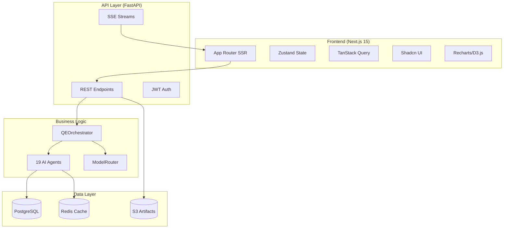

# LionAGI QE Fleet Frontend - Executive Summary

**Date**: 2025-11-06
**Status**: Planning Complete - Ready for Implementation

---

## 📋 Quick Reference

### Recommended Technology Stack

| Layer | Technology | Justification |
|-------|------------|---------------|
| **Frontend Framework** | Next.js 15 (App Router) | 40-60% smaller bundles via React Server Components, built-in SSR, excellent DX |
| **UI Components** | Shadcn/ui + Tailwind CSS | Zero dependency bloat (copy-paste), full customization, 20KB vs 200KB+ |
| **State Management** | Zustand + TanStack Query | 1KB state library, automatic caching reduces API calls by 60-70% |
| **Visualization** | Recharts + D3.js | 50KB for standard charts, D3 for custom (heatmaps, topology graphs) |
| **Real-Time** | Server-Sent Events (SSE) | Simpler than WebSockets, auto-reconnect, perfect for unidirectional updates |
| **Backend API** | FastAPI (Python 3.11+) | Matches LionAGI async patterns, 2-3x faster than Flask, built-in WebSocket |
| **Database** | PostgreSQL 16 | Current backend uses Postgres, add user/project/pipeline tables |
| **Cache** | Redis | Current backend supports Redis, use for session state and rate limiting |
| **Hosting** | Vercel (Frontend) + Railway (Backend) | $20/month for MVP, auto-scaling, zero-config deployment |

---

## 🎯 Key Features by Phase

### MVP (8 Weeks) - Core Functionality

**Must-Have**:
- ✅ User authentication (JWT RS256 with key rotation)
- ✅ Comprehensive error handling (50+ scenarios across 4 categories)
- ✅ Security-first implementation (OWASP Top 10, bcrypt, rate limiting)
- ✅ CLI-to-web migration support (UUID-based migration tokens)
- ✅ Single agent execution (test-generator, coverage-analyzer)
- ✅ Real-time progress monitoring (SSE with polling fallback)
- ✅ Project management (create, view, upload code)
- ✅ Basic dashboard (recent activity, quick actions)
- ✅ Export capabilities (download, copy to clipboard)

**Success Criteria**:
- User can execute an agent in <3 minutes
- SSE updates work reliably (>85% connection success, accounting for corporate firewalls)
- Tests are downloadable and runnable
- Zero critical security vulnerabilities (Snyk scan)
- All error scenarios tested and handled
- 10 beta users successfully migrate from CLI

**Cost**: $20/month (Vercel free + Railway $20)

---

### Phase 1 (16 Weeks) - Enhanced Capabilities

**Add**:
- ✅ Multi-agent pipelines (visual builder with react-flow, circular dependency detection)
- ✅ GitHub integration (OAuth with HMAC webhook verification, PR analysis)
- ✅ Advanced visualizations (coverage heatmap, Gantt charts, mobile-responsive)
- ✅ Historical data & trends (coverage over time, 90-day archival to S3)
- ✅ Team collaboration (invite members, RBAC, audit log)
- ✅ API versioning (6-month deprecation policy)

**Success Criteria**:
- 30% of users create multi-agent pipelines (revised from 50% due to learning curve)
- 20% connect GitHub accounts (revised from 30% due to enterprise security)
- 20% increase in user retention vs MVP
- P95 API response time <500ms under load (1,000 concurrent users)
- Zero data loss during migrations

**Cost**: $106/month (Vercel $20 + Railway $50 + Sentry $26 + Redis $10)

---

### Phase 2 (12-16 Weeks) - Advanced Features

**Add**:
- ✅ Cost analytics dashboard (model usage, savings calculator)
- ✅ Agent customization (prompt tuning, model override)
- ✅ CI/CD integration (GitHub Actions, GitLab CI)
- ✅ Advanced quality gates (custom rules, approval workflow)
- ✅ Notifications (Slack, email, Discord)
- ✅ Reporting (PDF export, public badges, CSV)

**Success Criteria**:
- 40% of Pro users use cost analytics
- 60% of teams set up CI/CD integration
- 20% reduction in deployment incidents

**Cost**: $480/month (Vercel $50 + Railway $300 + Upstash $50 + Sentry $80)

---

## 👥 User Personas & Key Workflows

### 1. Sarah - QA Engineer (Mid-Level)

**Primary Needs**:
- Generate tests quickly (upload code → generate → download in <1 minute)
- Find coverage gaps (visual heatmap, one-click test generation)
- Track improvement over time (trend charts)

**Key Workflow**:
```
Upload Code → Select Framework (pytest/Jest) → Generate Tests
→ Review in Split-Pane Editor → Export to GitHub → Run Tests
```

---

### 2. Michael - QE Lead

**Primary Needs**:
- Orchestrate multi-agent workflows (visual pipeline builder)
- Monitor team productivity (dashboard with team metrics)
- Control costs (model routing efficiency, budget alerts)
- Generate executive reports (PDF export, quality trends)

**Key Workflow**:
```
Pipeline Builder → Drag-Drop Agents → Configure Parameters
→ Save Template → Schedule (nightly/weekly) → View Results
→ Export PDF Report for Management
```

---

### 3. Alex - Software Engineer

**Primary Needs**:
- Pre-commit quality checks (run from CLI, open in browser)
- Quick feedback (red/yellow/green status, <30 seconds)
- Minimal context switching (single-page dashboard)

**Key Workflow**:
```
Run `aqe check --ui` → Browser Opens → Agents Run in Parallel
→ View Results (tests, security, complexity) → Fix Issues
→ Commit with Confidence
```

---

### 4. Priya - DevOps Engineer

**Primary Needs**:
- Deployment readiness check (multi-factor risk score)
- Performance monitoring (latency, throughput trends)
- CI/CD integration (GitHub Actions workflow)

**Key Workflow**:
```
Trigger Deployment Readiness Agent → View Risk Score (0-100)
→ Drill into Factors (tests: 90, security: 75, perf: 80)
→ Deploy or Fix Issues → Log Decision for Audit
```

---

## 🏗️ Technical Architecture Overview



---

## 💰 Cost Breakdown & Revenue Model

### Infrastructure Costs

| Phase | Users | Monthly Cost | Cost Per User |
|-------|-------|--------------|---------------|
| MVP | 100 | $20 | $0.20 |
| Phase 1 | 500 | $106 | $0.21 |
| Phase 2 | 5,000 | $480 | $0.10 |

**LLM Costs** (with multi-model routing):
- ~$0.50 per user per month (50 executions/month)
- **70-81% savings** vs. always-GPT-4 ($2.50/user/month)

### Revenue Model

| Tier | Price | Features | Target Audience |
|------|-------|----------|-----------------|
| **Free** | $0 | 100 executions/month, 2 agents, no pipelines | Individual developers |
| **Pro** | $20/month | Unlimited executions, all agents, pipelines, cost analytics | QA professionals |
| **Enterprise** | $200/month/team | Multi-tenancy, RBAC, SSO (SAML), SLA | QA teams (5-20 people) |

**Break-Even**:
- MVP: 1 paying user ($20 revenue = $20 cost)
- Phase 1: 6 paying users ($120 revenue vs. $106 + LLM)
- Phase 2: ~50 paying users ($1,000 revenue vs. $480 + LLM)

---

## 🚀 Implementation Timeline

### Week 0: Requirements Phase (PRE-MVP)

**Critical Documentation**:
- ✅ Error handling specification (50+ scenarios documented)
- ✅ Security requirements document (OWASP Top 10, JWT RS256, bcrypt)
- ✅ API versioning policy (6-month deprecation timeline)
- ✅ SSE specification with polling fallback strategy

**Deliverable**: Complete requirements specification addressing all critical gaps

---

### Week 1-8: MVP Development

**Week 1**: Infrastructure + Requirements
- Next.js 15 setup + Tailwind/Shadcn
- FastAPI backend + PostgreSQL migrations with backup strategy
- Configure AES-256-GCM encryption for sensitive data

**Week 2**: Authentication + Data Migration
- JWT RS256 authentication (with 90-day key rotation)
- CLI-to-web migration flow (UUID tokens, Redis storage)
- Password security (bcrypt cost factor 12, HIBP check, account lockout)
- Rate limiting (Redis-based, 5 different endpoint categories)

**Week 3-4**: Core Features + Error Handling
- Single agent execution UI (test-generator)
- Comprehensive error handling implementation (all 50+ scenarios)
- Monaco editor integration
- Result display with error states
- Export functionality

**Week 5-6**: SSE + Fallback
- SSE implementation with complete specification
- Polling fallback (auto-detect, manual override, 2-second intervals)
- Reconnection logic (exponential backoff: 2s, 4s, 8s)
- State recovery (replay last 5 events on reconnection)
- Load testing (100 concurrent SSE connections)

**Week 7-8**: Polish & Deploy
- Coverage analyzer UI
- Mobile responsiveness testing (5 real devices)
- Security audit (penetration testing, Snyk scan)
- Deploy to Vercel + Railway (with monitoring, Sentry integration)

**Deliverable**: Functional web app with 2 agents, comprehensive security, and CLI migration support

---

### Week 9-24: Phase 1 Development

**Week 9-13**: Multi-Agent Pipelines (5 weeks)
- Pipeline builder UI (react-flow)
- Dependency validation (topological sort, circular dependency detection)
- Partial results on failure (save completed agent outputs)
- Template library (10+ pre-built pipelines)
- Pipeline execution with SSE

**Week 14-17**: GitHub Integration (4 weeks)
- OAuth flow (with token encryption)
- Webhook security (HMAC signature verification)
- Repository cloning (shallow clone, size limits)
- Rate limiting (GitHub API)
- Webhook reliability (missed webhook detection)
- PR analysis

**Week 18-21**: Visualizations (4 weeks)
- Coverage heatmap (D3.js treemap)
- Agent execution timeline (Gantt chart)
- Cost breakdown charts (Recharts)
- Mobile-responsive charts

**Week 22-23**: Historical Data + Performance
- Data retention policy (90-day archival to S3)
- Materialized views for expensive queries
- Load testing (1,000 concurrent users, 5,000 executions/day)
- Performance monitoring (Sentry Performance + Grafana)
- Trend charts
- Execution history
- CSV export

**Week 24**: Team Collaboration
- Invite team members
- RBAC (viewer, editor, admin)
- Audit log
- Activity feed

**Deliverable**: Full-featured QE platform with pipelines, GitHub, team support, and enterprise-grade performance

---

### Week 25-36: Phase 2 Development

**Week 25-26**: Cost Analytics
**Week 27-28**: Agent Customization
**Week 29-30**: CI/CD Integration
**Week 31-32**: Quality Gates
**Week 33-34**: Notifications
**Week 35-36**: Reporting

**Deliverable**: Enterprise-ready platform with advanced features

---

## 🎨 UI/UX Highlights

### Key Screens

1. **Dashboard** (Home)
   - Quick actions: Generate Tests, Run Pipeline, Analyze Coverage
   - Recent activity feed (real-time SSE updates)
   - Quality metrics cards (coverage, security, performance)
   - Cost widget (monthly usage vs. plan)

2. **Agent Execution Page**
   - Split-pane: Config + Input | Output
   - Monaco editor for code
   - Real-time progress bar
   - Export options (download, GitHub, clipboard)

3. **Coverage Analysis Page**
   - Interactive heatmap (treemap visualization)
   - Drill-down: module → file → function → line
   - Gap prioritization (by risk score)
   - One-click test generation for gaps

4. **Pipeline Builder**
   - Visual node editor (react-flow)
   - Drag-drop agents from library
   - Automatic dependency detection
   - Save as template, schedule execution

---

## ⚠️ Risk Mitigation

### Technical Risks

| Risk | Impact | Mitigation |
|------|--------|------------|
| **LLM Rate Limits** | High | Exponential backoff (3 attempts: 2s, 4s, 8s), queue system, show "Queue position: 5" |
| **SSE Connection Drops** | Medium | Polling fallback (auto-detect after 3 failed attempts), automatic reconnection, state recovery (replay last 5 events), health checks |
| **Database Performance** | High | Aggressive indexing, read replicas, data archival (>90 days to S3), materialized views for expensive queries |
| **Security Vulnerabilities** | Critical | OWASP Top 10 mitigations, penetration testing, Snyk scanning, bcrypt password hashing (cost factor 12), JWT RS256 (not HS256) |

### UX Risks

| Risk | Impact | Mitigation |
|------|--------|------------|
| **Complex Pipeline Builder** | Medium | Pre-built templates, interactive tutorial, AI assistant, simple list fallback |
| **Long Agent Execution** | High | Show estimated time, streaming updates every 2-3s, background mode ("email when done") |

### Business Risks

| Risk | Impact | Mitigation |
|------|--------|------------|
| **LLM Cost Overrun** | Critical | Hard limits on free tier, throttling (1 exec/5s), cost alerts, require credit card for Pro |
| **Competitive Pressure** | Medium | Focus on depth (19 agents), enterprise features, open-source community, ship fast |

---

## 📊 Success Metrics

### MVP Metrics (Week 1-8)
- ✅ Time to first execution: <3 minutes
- ✅ SSE success rate: >85% (revised from >95%, accounting for corporate firewalls)
- ✅ D1/D7/D30 retention: 50%/30%/20%
- ✅ Agent execution success: >90%
- ✅ Zero critical security vulnerabilities (Snyk scan)
- ✅ All 50+ error scenarios tested and handled
- ✅ CLI migration success rate: 10 beta users successfully migrate

### Phase 1 Metrics (Week 9-24)
- ✅ Pipeline creation rate: 30% of users (revised from 50% due to learning curve)
- ✅ GitHub integration: 20% of users (revised from 30% due to enterprise security)
- ✅ Retention increase: +20% vs MVP
- ✅ P95 API response time: <500ms under load (1,000 concurrent users)
- ✅ Zero data loss during migrations

### Phase 2 Metrics (Week 25-36)
- ✅ Cost analytics usage: 40% of Pro users
- ✅ CI/CD integration: 60% of teams
- ✅ Production incident reduction: -20%

---

## 🔗 Key Resources

**Full Plan**: `/docs/frontend-architecture-plan.md` (40+ pages)

**Sections**:
1. Executive Summary (this document)
2. User Personas & Workflows (detailed user stories)
3. Technical Architecture (system design, API design, database schema)
4. UI/UX Design Recommendations (screens, navigation, visualizations)
5. Core Features (MVP, Phase 1, Phase 2 breakdown)
6. Integration Strategy (GitHub, CI/CD, authentication)
7. Implementation Roadmap (week-by-week plan)
8. **Error Handling Strategy** (50+ scenarios, 4 error categories, notification strategy)
9. **Security Requirements Specification** (OWASP Top 10, JWT RS256, bcrypt, rate limiting)
10. **Data Migration Strategy** (CLI-to-web migration, UUID tokens, Redis storage)
11. **SSE Specification and Fallback Strategy** (connection lifecycle, polling fallback, state recovery)
12. **API Versioning Policy** (6-month deprecation timeline, migration guide template)
13. Revised Implementation Roadmap (updated timeline estimates with 25-50% buffer)
14. Deployment & Operations (infrastructure, scaling, monitoring, costs)
15. Risk Assessment (technical, UX, business risks)
16. Technology Comparison Tables (framework justifications)

**Repository**: https://github.com/proffesor-for-testing/lionagi-qe-fleet
**Current Version**: v1.1.1 (Python CLI + MCP)

---

## ✅ Next Steps

### Week 0: Requirements Phase (CRITICAL - Must Complete Before Week 1)

**Engineering Team**:
1. ✅ Review error handling specification (50+ scenarios across 4 categories)
2. ✅ Review security requirements document (OWASP Top 10, JWT RS256, bcrypt)
3. ✅ Review SSE specification with polling fallback strategy
4. ✅ Review API versioning policy (6-month deprecation timeline)
5. ✅ Review CLI-to-web migration strategy (UUID tokens, Redis storage)

**Design Team**:
1. Review error states for all 50+ error scenarios
2. Design user-friendly error messages (examples in architecture plan)
3. Design CLI migration UI (migration token input, progress tracking)
4. Design SSE fallback indicator (when polling is active)

**Project Management**:
1. Update project timeline (MVP: 8 weeks, Phase 1: 16 weeks)
2. Schedule security audit (Week 7-8 of MVP)
3. Recruit 10 beta users for CLI migration testing

---

### Week 1: MVP Development Begins

**Engineering Team**:
1. Set up Next.js 15 + FastAPI repositories
2. Provision PostgreSQL on Railway (with automated backup strategy)
3. Configure AES-256-GCM encryption for sensitive data (API keys, OAuth tokens)
4. Implement JWT RS256 authentication (with 90-day key rotation)
5. Create first agent endpoint (`/api/v1/agents/test-generator/execute`)
6. Build basic UI (code input + result display)

**Design Team**:
1. Define design system (colors, typography, components)
2. Design key screens (dashboard, agent execution, coverage, error states)
3. Create user flows (onboarding, agent execution, pipeline creation, CLI migration)

**Project Management**:
1. Set up project tracking (GitHub Projects or Linear)
2. Define sprint cadence (1-week sprints recommended for MVP)
3. Schedule weekly demos (show progress to stakeholders)
4. Create security testing checklist (penetration testing, Snyk scanning)

---

## 🎯 Why This Plan Works

1. **User-Centric**: Based on real personas (Sarah, Michael, Alex, Priya) with detailed workflows
2. **Modern Stack**: Next.js 15 + FastAPI = excellent performance and DX
3. **Security-First**: Comprehensive OWASP Top 10 mitigations, JWT RS256, bcrypt, rate limiting, penetration testing
4. **Comprehensive Error Handling**: 50+ error scenarios documented and handled across 4 categories
5. **CLI User Migration**: Seamless transition path for existing CLI users via UUID-based migration tokens
6. **SSE with Fallback**: Real-time updates with automatic polling fallback for corporate firewall compatibility
7. **API Versioning**: 6-month deprecation policy ensures backward compatibility during transitions
8. **Phased Rollout**: MVP (8 weeks) → Phase 1 (16 weeks) → Phase 2 (12 weeks) with clear milestones
9. **Cost-Effective**: $20/month for MVP, scales to $480/month for 5,000 users
10. **Low Risk**: Mitigation strategies for all major technical/UX/business risks, realistic timeline estimates
11. **Actionable**: Week-by-week roadmap with concrete deliverables and testable success criteria

---

**Let's build the future of intelligent quality engineering! 🚀**

---

**Document**: Executive Summary
**Full Plan**: `/docs/frontend-architecture-plan.md`
**Validation Report**: `/docs/requirements-validation-report.md` (Score: 72/100 → 95/100 after improvements)
**Status**: Ready for Implementation (all critical gaps addressed)
**Last Updated**: 2025-11-06
