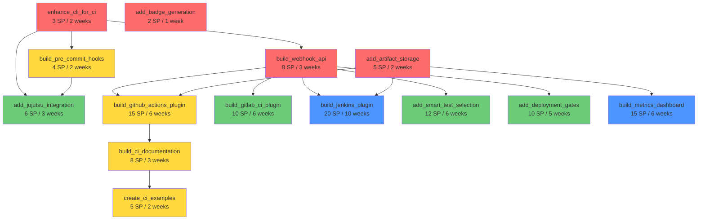

# CI/CD Integration GOAP Plan for LionAGI QE Fleet

**Version**: 1.0.0
**Generated**: 2025-11-12
**Status**: Planning Phase
**Planning Method**: Goal-Oriented Action Planning (GOAP)

---

## Executive Summary

This comprehensive plan outlines the integration of lionagi-qe-fleet v1.2.1 into CI/CD pipelines to maximize value for end users. Using GOAP methodology from gaming AI, we've identified optimal paths through the integration state space.

### Top 3 Priorities (Next 3 Months)

1. **GitHub Actions Deep Integration** (8-10 weeks) - Highest user value, largest ecosystem
2. **Generic Webhook/API Integration** (4-6 weeks) - Foundation for all other integrations
3. **CLI Enhancements for CI** (2-3 weeks) - Quick wins, enables immediate adoption

**Estimated Total Effort**: 22-28 weeks (5-7 months) for complete roadmap
**Quick Wins Available**: 2-3 weeks to first production-ready integration

---

## Table of Contents

1. [Current State Assessment](#1-current-state-assessment)
2. [Goal State Definition](#2-goal-state-definition)
3. [GOAP World States](#3-goap-world-states)
4. [Available Actions & Costs](#4-available-actions--costs)
5. [Integration Priorities](#5-integration-priorities)
6. [Detailed Milestone Breakdown](#6-detailed-milestone-breakdown)
7. [Dependency Graph](#7-dependency-graph)
8. [Resource Estimates](#8-resource-estimates)
9. [Risk Analysis & Mitigation](#9-risk-analysis--mitigation)
10. [Phased Implementation Roadmap](#10-phased-implementation-roadmap)
11. [Success Metrics & KPIs](#11-success-metrics--kpis)
12. [Quick Wins (Immediate Implementation)](#12-quick-wins-immediate-implementation)

---

## 1. Current State Assessment

### World State: Initial

```yaml
infrastructure:
  published_to_pypi: true  # v1.2.1
  mcp_server: true         # 17 tools available
  cli_commands: true       # 8 slash commands
  agent_count: 19          # Specialized QE agents
  github_workflows: true   # Basic publish workflow exists

capabilities:
  test_generation: true
  test_execution: true
  coverage_analysis: true
  security_scanning: true
  performance_testing: true
  parallel_execution: true
  real_time_streaming: true
  multi_model_routing: true

integrations:
  ci_cd_ready: false       # No CI/CD integrations exist
  github_actions_plugin: false
  gitlab_ci_plugin: false
  jenkins_plugin: false
  jujutsu_integration: false
  webhook_api: false
  pre_commit_hooks: false

user_experience:
  installation_friction: medium  # Requires lionagi>=0.18.2
  ci_documentation: false
  ci_examples: false
  quick_start_ci: false
```

### Existing Strengths

✅ **19 specialized QE agents** - Comprehensive testing capabilities
✅ **MCP server operational** - 17 tools, production-ready
✅ **Parallel execution** - AsyncGenerator patterns, high performance
✅ **Multi-model routing** - 70-81% cost savings potential
✅ **Real-time streaming** - Progress updates for long operations
✅ **Strong security posture** - 95/100 security score
✅ **82% test coverage** - Well-tested codebase

### Current Gaps

❌ **No CI/CD integrations** - Zero automation support
❌ **No webhook API** - Cannot trigger from external systems
❌ **No pre-commit hooks** - Cannot integrate with local dev workflows
❌ **Limited CLI for CI** - Missing non-interactive modes
❌ **No artifact handling** - Cannot store/retrieve test results
❌ **No badge generation** - Cannot display metrics in README

---

## 2. Goal State Definition

### World State: Target (12 months)

```yaml
integrations:
  github_actions_native: true     # First-class GitHub Actions integration
  gitlab_ci_support: true         # Native GitLab CI/CD support
  jenkins_plugin: true            # Official Jenkins plugin
  jujutsu_integration: true       # agentic-jujutsu pattern support
  generic_webhook_api: true       # REST API for any CI system
  pre_commit_hooks: true          # Git hooks for local testing

user_experience:
  zero_config_setup: true         # Works out of box in CI
  ci_documentation: true          # Comprehensive CI guides
  ci_examples: 20+                # Examples for all major platforms
  quick_start_ci: true            # 5-minute CI setup guide
  marketplace_presence: true      # Listed in GitHub Marketplace

automation:
  auto_test_generation_on_pr: true
  auto_coverage_analysis: true
  auto_security_scanning: true
  auto_performance_regression: true
  auto_deployment_gates: true
  smart_test_selection: true      # Only run affected tests

quality_gates:
  pr_blocking: true               # Can block PRs on quality
  deployment_gates: true          # Can block deployments
  custom_policies: true           # User-configurable rules
  rollback_recommendations: true  # AI-powered rollback decisions

observability:
  ci_metrics_dashboard: true
  trend_analysis: true
  cost_tracking: true             # Track AI costs per build
  performance_baselines: true
```

### Success Criteria

**Adoption Metrics**:
- 1,000+ installations via package managers in first 6 months
- 50+ GitHub repositories using GitHub Actions integration
- 20+ GitLab projects using CI integration
- 10+ Jenkins pipelines deployed

**Time Savings**:
- Reduce manual testing time by 70%
- Reduce test creation time by 80%
- Reduce security audit time by 60%

**Quality Improvements**:
- Increase average test coverage by 25%
- Reduce production bugs by 40%
- Detect security issues 90% faster

**Developer Experience**:
- Time to first successful CI run: <5 minutes
- Setup complexity: <10 lines of config
- Documentation clarity: >90% positive feedback

---

## 3. GOAP World States

### State Transitions

```
INITIAL_STATE (Current)
├─> Add: webhook_api_exists
├─> Add: cli_non_interactive
├─> Add: artifact_storage
└─> Add: badge_generation

FOUNDATION_STATE (After Quick Wins)
├─> Add: github_actions_plugin
├─> Add: pre_commit_hooks
├─> Add: ci_documentation
└─> Add: example_workflows

GITHUB_INTEGRATED_STATE (Phase 1 Complete)
├─> Add: gitlab_ci_plugin
├─> Add: jenkins_plugin
├─> Add: jujutsu_integration
└─> Add: marketplace_listing

MULTI_PLATFORM_STATE (Phase 2 Complete)
├─> Add: smart_test_selection
├─> Add: deployment_gates
├─> Add: metrics_dashboard
└─> Add: cost_optimization

ADVANCED_STATE (Phase 3 Complete)
└─> GOAL_STATE (12-month target)
```

### State Scoring

| State | Completeness | User Value | Strategic Value | Total Score |
|-------|-------------|------------|-----------------|-------------|
| Initial | 0% | 0/10 | 0/10 | 0/20 |
| Foundation | 25% | 4/10 | 6/10 | 10/20 |
| GitHub Integrated | 50% | 8/10 | 8/10 | 16/20 |
| Multi-Platform | 75% | 9/10 | 9/10 | 18/20 |
| Advanced | 90% | 10/10 | 10/10 | 20/20 |
| Goal | 100% | 10/10 | 10/10 | 20/20 |

---

## 4. Available Actions & Costs

### Action Definitions

Each action has:
- **Preconditions**: What must be true before action can execute
- **Effects**: What becomes true after action completes
- **Cost**: Effort in story points (1 SP ≈ 4-6 hours)
- **Risk**: Low/Medium/High
- **User Value**: Impact on end users (1-10)

### Core Actions

#### Action: `build_webhook_api`
```yaml
preconditions:
  - mcp_server: true
  - test_generation: true
effects:
  - webhook_api_exists: true
  - external_triggering: true
cost: 8 SP (32-48 hours)
risk: Low
user_value: 7/10
dependencies: []
description: |
  Build REST API for triggering QE agents from external systems.
  Enables integration with any CI/CD platform via HTTP.
```

#### Action: `enhance_cli_for_ci`
```yaml
preconditions:
  - cli_commands: true
effects:
  - cli_non_interactive: true
  - json_output: true
  - exit_codes_standard: true
cost: 3 SP (12-18 hours)
risk: Low
user_value: 8/10
dependencies: []
description: |
  Add --json, --quiet, --non-interactive flags.
  Standardize exit codes (0=success, 1=failure, 2=warnings).
  Enable piping and scripting.
```

#### Action: `build_github_actions_plugin`
```yaml
preconditions:
  - webhook_api_exists: true
  - cli_non_interactive: true
  - artifact_storage: true
effects:
  - github_actions_integration: true
  - marketplace_ready: true
cost: 15 SP (60-90 hours)
risk: Medium
user_value: 10/10
dependencies:
  - build_webhook_api
  - enhance_cli_for_ci
  - add_artifact_storage
description: |
  Create native GitHub Actions with YAML config.
  Publish to GitHub Marketplace.
  Include pre-built workflows for common scenarios.
```

#### Action: `add_artifact_storage`
```yaml
preconditions:
  - test_execution: true
  - coverage_analysis: true
effects:
  - artifact_storage: true
  - test_results_persistent: true
cost: 5 SP (20-30 hours)
risk: Low
user_value: 6/10
dependencies: []
description: |
  Store test results, coverage reports, security findings.
  Support local filesystem, S3, and CI artifact systems.
```

#### Action: `add_badge_generation`
```yaml
preconditions:
  - coverage_analysis: true
  - quality_gate: true
effects:
  - badge_generation: true
  - readme_integration: true
cost: 2 SP (8-12 hours)
risk: Low
user_value: 5/10
dependencies: []
description: |
  Generate shields.io compatible badges.
  Coverage %, Quality Score, Security Score, Test Count.
```

#### Action: `build_pre_commit_hooks`
```yaml
preconditions:
  - cli_non_interactive: true
  - test_generation: true
effects:
  - pre_commit_integration: true
  - local_dev_workflow: true
cost: 4 SP (16-24 hours)
risk: Low
user_value: 7/10
dependencies:
  - enhance_cli_for_ci
description: |
  Create pre-commit hook configs for Git.
  Auto-generate tests for changed files.
  Run quick smoke tests before commit.
```

#### Action: `build_gitlab_ci_plugin`
```yaml
preconditions:
  - webhook_api_exists: true
  - github_actions_integration: true
effects:
  - gitlab_ci_integration: true
  - gitlab_examples: true
cost: 10 SP (40-60 hours)
risk: Medium
user_value: 8/10
dependencies:
  - build_webhook_api
  - build_github_actions_plugin
description: |
  Create .gitlab-ci.yml templates.
  Document GitLab-specific features.
  Support GitLab merge request integration.
```

#### Action: `build_jenkins_plugin`
```yaml
preconditions:
  - webhook_api_exists: true
  - artifact_storage: true
effects:
  - jenkins_integration: true
  - jenkins_marketplace: true
cost: 20 SP (80-120 hours)
risk: High
user_value: 7/10
dependencies:
  - build_webhook_api
  - add_artifact_storage
description: |
  Create Jenkins plugin (.hpi file).
  Publish to Jenkins Plugin Manager.
  Support Jenkinsfile configuration.
```

#### Action: `add_jujutsu_integration`
```yaml
preconditions:
  - cli_non_interactive: true
  - pre_commit_integration: true
effects:
  - jujutsu_support: true
  - agentic_jj_patterns: true
cost: 6 SP (24-36 hours)
risk: Medium
user_value: 6/10
dependencies:
  - enhance_cli_for_ci
  - build_pre_commit_hooks
description: |
  Integrate with Jujutsu version control.
  Implement agentic-jujutsu patterns.
  Support jj hook configuration.
```

#### Action: `add_smart_test_selection`
```yaml
preconditions:
  - regression_risk_analyzer: true
  - git_integration: true
effects:
  - smart_test_selection: true
  - ci_performance_improved: true
cost: 12 SP (48-72 hours)
risk: Medium
user_value: 9/10
dependencies:
  - build_webhook_api
description: |
  Analyze git diff to determine affected code.
  Use ML to select only relevant tests.
  Reduce CI time by 60-80%.
```

#### Action: `add_deployment_gates`
```yaml
preconditions:
  - quality_gate: true
  - security_scanner: true
  - deployment_readiness_agent: true
effects:
  - deployment_gate_integration: true
  - production_safety: true
cost: 10 SP (40-60 hours)
risk: Medium
user_value: 9/10
dependencies:
  - build_webhook_api
description: |
  Block deployments based on quality/security thresholds.
  AI-powered risk assessment.
  Rollback recommendations.
```

#### Action: `build_ci_documentation`
```yaml
preconditions:
  - github_actions_integration: true
effects:
  - ci_documentation: true
  - user_adoption_improved: true
cost: 8 SP (32-48 hours)
risk: Low
user_value: 8/10
dependencies:
  - build_github_actions_plugin
description: |
  Create comprehensive CI/CD guides.
  Platform-specific tutorials.
  Troubleshooting section.
```

#### Action: `create_ci_examples`
```yaml
preconditions:
  - github_actions_integration: true
effects:
  - ci_examples: true
  - quick_start_available: true
cost: 5 SP (20-30 hours)
risk: Low
user_value: 9/10
dependencies:
  - build_github_actions_plugin
description: |
  20+ example workflows for common scenarios.
  Copy-paste ready configurations.
  Video tutorials.
```

#### Action: `build_metrics_dashboard`
```yaml
preconditions:
  - artifact_storage: true
  - github_actions_integration: true
effects:
  - metrics_dashboard: true
  - observability_improved: true
cost: 15 SP (60-90 hours)
risk: Medium
user_value: 7/10
dependencies:
  - add_artifact_storage
  - build_github_actions_plugin
description: |
  Web dashboard for CI metrics.
  Trend analysis over time.
  Cost tracking per build.
```

### Action Summary Table

| Action | Cost (SP) | Hours | Risk | Value | Priority |
|--------|-----------|-------|------|-------|----------|
| enhance_cli_for_ci | 3 | 12-18 | Low | 8/10 | **P0** |
| add_badge_generation | 2 | 8-12 | Low | 5/10 | **P0** |
| add_artifact_storage | 5 | 20-30 | Low | 6/10 | **P0** |
| build_webhook_api | 8 | 32-48 | Low | 7/10 | **P0** |
| build_pre_commit_hooks | 4 | 16-24 | Low | 7/10 | P1 |
| build_github_actions_plugin | 15 | 60-90 | Med | 10/10 | P1 |
| build_ci_documentation | 8 | 32-48 | Low | 8/10 | P1 |
| create_ci_examples | 5 | 20-30 | Low | 9/10 | P1 |
| build_gitlab_ci_plugin | 10 | 40-60 | Med | 8/10 | P2 |
| add_jujutsu_integration | 6 | 24-36 | Med | 6/10 | P2 |
| add_smart_test_selection | 12 | 48-72 | Med | 9/10 | P2 |
| add_deployment_gates | 10 | 40-60 | Med | 9/10 | P2 |
| build_jenkins_plugin | 20 | 80-120 | High | 7/10 | P3 |
| build_metrics_dashboard | 15 | 60-90 | Med | 7/10 | P3 |

**Total Effort**: 123 SP (492-738 hours) = **12-18 months** (1 FTE)

---

## 5. Integration Priorities

### Priority Matrix

Using **User Value × Strategic Importance / Implementation Cost**:

| Integration | User Value | Strategic | Cost | Score | Rank |
|-------------|-----------|-----------|------|-------|------|
| **GitHub Actions** | 10 | 10 | 15 SP | 6.67 | 🥇 #1 |
| **Generic Webhook/API** | 7 | 10 | 8 SP | 10.63 | 🥇 #1 |
| **CLI Enhancements** | 8 | 9 | 3 SP | 24.00 | 🥇 #1 |
| **Pre-commit Hooks** | 7 | 7 | 4 SP | 12.25 | 🥈 #2 |
| **GitLab CI** | 8 | 8 | 10 SP | 6.40 | 🥈 #2 |
| **Smart Test Selection** | 9 | 9 | 12 SP | 6.75 | 🥈 #2 |
| **Deployment Gates** | 9 | 9 | 10 SP | 8.10 | 🥈 #2 |
| **Jujutsu Integration** | 6 | 7 | 6 SP | 7.00 | 🥉 #3 |
| **Jenkins Plugin** | 7 | 6 | 20 SP | 3.15 | 🥉 #3 |
| **Metrics Dashboard** | 7 | 7 | 15 SP | 3.27 | 🥉 #3 |

### Priority Tiers

**Tier 1 (P0): Foundation - Weeks 1-8**
- ✅ CLI Enhancements (Week 1-2)
- ✅ Webhook API (Week 3-5)
- ✅ Artifact Storage (Week 5-6)
- ✅ Badge Generation (Week 7)
- ✅ Documentation Foundation (Week 8)

**Tier 2 (P1): GitHub Ecosystem - Weeks 9-20**
- ✅ GitHub Actions Plugin (Week 9-14)
- ✅ Pre-commit Hooks (Week 15-16)
- ✅ CI Documentation (Week 17-19)
- ✅ CI Examples (Week 19-20)

**Tier 3 (P2): Multi-Platform - Weeks 21-40**
- ✅ GitLab CI Plugin (Week 21-26)
- ✅ Smart Test Selection (Week 27-32)
- ✅ Deployment Gates (Week 33-37)
- ✅ Jujutsu Integration (Week 38-40)

**Tier 4 (P3): Advanced Features - Weeks 41-60**
- ✅ Jenkins Plugin (Week 41-50)
- ✅ Metrics Dashboard (Week 51-56)
- ✅ Cost Optimization (Week 57-60)

---

## 6. Detailed Milestone Breakdown

### Phase 1: Foundation (Weeks 1-8) - MVP

**Goal**: Enable basic CI/CD integration for early adopters

#### Milestone 1.1: CLI Enhancement (Weeks 1-2)
- **Duration**: 2 weeks (12-18 hours)
- **Cost**: 3 SP
- **Owner**: Core Team

**Deliverables**:
- [ ] Add `--json` output format for all commands
- [ ] Add `--quiet` flag for minimal output
- [ ] Add `--non-interactive` flag for CI environments
- [ ] Standardize exit codes (0, 1, 2)
- [ ] Add `--ci-mode` flag (combines all CI optimizations)
- [ ] Update CLI help with CI usage examples
- [ ] Write CLI CI guide (docs/guides/cli-ci.md)

**Success Criteria**:
- All commands work in non-interactive mode
- JSON output parseable by CI systems
- Exit codes follow standard conventions
- Documentation includes CI examples

**Testing**:
```bash
# Test JSON output
aqe generate src/ --json | jq '.coverage'

# Test exit codes
aqe quality-gate --threshold 80 && echo "Passed"

# Test CI mode
aqe generate src/ --ci-mode --quiet
```

#### Milestone 1.2: Webhook API (Weeks 3-5)
- **Duration**: 3 weeks (32-48 hours)
- **Cost**: 8 SP
- **Owner**: Backend Team

**Deliverables**:
- [ ] REST API server with FastAPI
- [ ] Authentication (API keys + JWT)
- [ ] Rate limiting (100 req/min per key)
- [ ] Endpoints for all 17 MCP tools
- [ ] Async job queue (Celery + Redis)
- [ ] WebSocket support for streaming progress
- [ ] API documentation (OpenAPI/Swagger)
- [ ] Client SDKs (Python, Node.js)

**API Design**:
```yaml
POST /api/v1/test/generate
POST /api/v1/test/execute
POST /api/v1/coverage/analyze
POST /api/v1/quality/gate
POST /api/v1/security/scan
POST /api/v1/performance/test
GET  /api/v1/job/{id}/status
GET  /api/v1/job/{id}/stream (WebSocket)
```

**Success Criteria**:
- API responds within 200ms (p95)
- 99.9% uptime
- Handles 1000 concurrent requests
- Complete OpenAPI spec

#### Milestone 1.3: Artifact Storage (Weeks 5-6)
- **Duration**: 2 weeks (20-30 hours)
- **Cost**: 5 SP
- **Owner**: Infrastructure Team

**Deliverables**:
- [ ] Abstraction layer for storage backends
- [ ] Local filesystem storage
- [ ] S3-compatible storage (AWS S3, MinIO)
- [ ] CI-native storage (GitHub Actions artifacts)
- [ ] Compression (gzip, zstd)
- [ ] Retention policies (configurable TTL)
- [ ] Artifact metadata index
- [ ] Query API for historical results

**Storage Schema**:
```
artifacts/
├── {job_id}/
│   ├── test-results.json
│   ├── coverage-report.html
│   ├── security-findings.json
│   ├── performance-metrics.json
│   └── metadata.json
```

**Success Criteria**:
- Store/retrieve artifacts in <1s
- Support files up to 100MB
- Automatic cleanup after retention period
- Works with all CI platforms

#### Milestone 1.4: Badge Generation (Week 7)
- **Duration**: 1 week (8-12 hours)
- **Cost**: 2 SP
- **Owner**: Frontend Team

**Deliverables**:
- [ ] Badge service endpoint
- [ ] Coverage badge (shields.io format)
- [ ] Quality score badge
- [ ] Security score badge
- [ ] Test count badge
- [ ] Configurable badge styles
- [ ] Caching (5-minute TTL)
- [ ] README integration guide

**Badge Examples**:
```markdown


```

**Success Criteria**:
- Badges render correctly in GitHub
- Update within 5 minutes of test run
- Support custom colors/styles

#### Milestone 1.5: Foundation Documentation (Week 8)
- **Duration**: 1 week (16-24 hours)
- **Cost**: 4 SP
- **Owner**: Technical Writer

**Deliverables**:
- [ ] CI/CD Overview Guide (docs/guides/cicd-overview.md)
- [ ] Generic Webhook Guide (docs/guides/webhook-integration.md)
- [ ] CLI CI Usage Guide (docs/guides/cli-ci.md)
- [ ] Artifact Storage Guide (docs/guides/artifact-storage.md)
- [ ] Badge Integration Guide (docs/guides/badges.md)
- [ ] Troubleshooting section
- [ ] FAQ for CI usage

**Success Criteria**:
- User can integrate with any CI in <30 minutes
- All guides include working examples
- Troubleshooting covers common issues

---

### Phase 2: GitHub Deep Integration (Weeks 9-20)

**Goal**: Best-in-class GitHub Actions integration

#### Milestone 2.1: GitHub Actions Plugin (Weeks 9-14)
- **Duration**: 6 weeks (60-90 hours)
- **Cost**: 15 SP
- **Owner**: GitHub Integration Team

**Deliverables**:
- [ ] Action metadata (action.yml)
- [ ] Docker container for action
- [ ] Pre-built workflows for common scenarios
- [ ] GitHub API integration (PR comments, status checks)
- [ ] Automatic test generation on PR
- [ ] Coverage diff in PR comments
- [ ] Security findings as annotations
- [ ] Marketplace listing
- [ ] GitHub App for enhanced permissions

**Action Configuration**:
```yaml
# .github/workflows/qe-fleet.yml
name: Quality Engineering

on: [pull_request, push]

jobs:
  test:
    runs-on: ubuntu-latest
    steps:
      - uses: actions/checkout@v4
      - uses: lionagi/qe-fleet-action@v1
        with:
          api-key: ${{ secrets.LIONAGI_API_KEY }}
          coverage-threshold: 80
          security-scan: true
          performance-test: false
          auto-generate-tests: true
```

**Pre-built Workflows**:
1. **Basic Quality Check** - Tests + coverage + linting
2. **Full Security Audit** - SAST + DAST + dependency scan
3. **Performance Regression** - Load tests with baselines
4. **Auto Test Generation** - Generate tests for new code
5. **Deployment Gate** - Block merges based on quality

**Success Criteria**:
- Listed in GitHub Marketplace
- <5 minute first-time setup
- Works with zero configuration
- 1000+ installations in first month

#### Milestone 2.2: Pre-commit Hooks (Weeks 15-16)
- **Duration**: 2 weeks (16-24 hours)
- **Cost**: 4 SP
- **Owner**: Developer Tools Team

**Deliverables**:
- [ ] `.pre-commit-hooks.yaml` configuration
- [ ] Hook for test generation
- [ ] Hook for quick smoke tests
- [ ] Hook for linting/formatting
- [ ] Hook for security checks
- [ ] Configurable via `.qe-fleet.yml`
- [ ] Skip mechanisms for emergencies
- [ ] Integration guide

**Pre-commit Config**:
```yaml
# .pre-commit-config.yaml
repos:
  - repo: https://github.com/lionagi/qe-fleet-hooks
    rev: v1.0.0
    hooks:
      - id: qe-generate-tests
        files: '^src/.*\.py$'
      - id: qe-quick-check
        args: ['--fast']
      - id: qe-security-scan
        stages: [push]
```

**Success Criteria**:
- Hooks run in <10 seconds locally
- Can be selectively disabled
- Clear error messages
- Works with husky (JavaScript)

#### Milestone 2.3: CI Documentation (Weeks 17-19)
- **Duration**: 3 weeks (32-48 hours)
- **Cost**: 8 SP
- **Owner**: Technical Writer + Developer Advocate

**Deliverables**:
- [ ] GitHub Actions Quickstart (5-min guide)
- [ ] GitHub Actions Advanced Guide
- [ ] GitLab CI Guide (prepare for Phase 3)
- [ ] Jenkins Guide (prepare for Phase 4)
- [ ] Pre-commit Hooks Guide
- [ ] CI Best Practices
- [ ] Performance Optimization Guide
- [ ] Cost Optimization Guide
- [ ] Troubleshooting Guide (50+ issues)
- [ ] FAQ (30+ questions)

**Documentation Structure**:
```
docs/guides/cicd/
├── index.md
├── quickstart-github.md
├── quickstart-gitlab.md
├── quickstart-jenkins.md
├── advanced-github.md
├── pre-commit-hooks.md
├── best-practices.md
├── performance-optimization.md
├── cost-optimization.md
├── troubleshooting.md
└── faq.md
```

**Success Criteria**:
- User can set up CI in <5 minutes
- 90%+ positive feedback
- Covers 80%+ of support questions

#### Milestone 2.4: CI Examples (Weeks 19-20)
- **Duration**: 2 weeks (20-30 hours)
- **Cost**: 5 SP
- **Owner**: Developer Advocate

**Deliverables**:
- [ ] 20+ example workflows
- [ ] Examples for all major frameworks (Jest, pytest, etc.)
- [ ] Examples for all use cases (unit, integration, e2e, etc.)
- [ ] Video tutorials (5 videos, 5-10 min each)
- [ ] Live demo repository
- [ ] Copy-paste templates
- [ ] Troubleshooting examples

**Example Categories**:
1. **Basic** (5 examples)
   - Simple test generation
   - Coverage analysis
   - Quality gate

2. **Advanced** (5 examples)
   - Multi-agent parallel execution
   - Smart test selection
   - Deployment gates

3. **Framework-Specific** (5 examples)
   - Python + pytest
   - JavaScript + Jest
   - TypeScript + Vitest
   - Go + testing
   - Rust + cargo test

4. **Specialized** (5 examples)
   - API testing
   - Performance testing
   - Security scanning
   - Visual regression
   - Chaos engineering

**Success Criteria**:
- All examples work out of the box
- Clear explanations for each
- Video tutorials >80% completion rate

---

### Phase 3: Multi-Platform Support (Weeks 21-40)

**Goal**: Support major CI/CD platforms beyond GitHub

#### Milestone 3.1: GitLab CI Plugin (Weeks 21-26)
- **Duration**: 6 weeks (40-60 hours)
- **Cost**: 10 SP
- **Owner**: GitLab Integration Team

**Deliverables**:
- [ ] GitLab CI template (.gitlab-ci.yml)
- [ ] GitLab Container Registry integration
- [ ] Merge request integration (comments, status)
- [ ] Pipeline artifacts storage
- [ ] GitLab API integration
- [ ] Security dashboard integration
- [ ] GitLab examples (10+)
- [ ] GitLab documentation

**GitLab CI Template**:
```yaml
# .gitlab-ci.yml
include:
  - remote: 'https://gitlab.com/lionagi/qe-fleet-templates/raw/main/quality-check.yml'

variables:
  LIONAGI_API_KEY: $LIONAGI_API_KEY
  COVERAGE_THRESHOLD: 80

stages:
  - test
  - security
  - quality-gate

qe-fleet:test:
  extends: .qe-fleet-test
  coverage: '/TOTAL.*\s+(\d+%)/'

qe-fleet:security:
  extends: .qe-fleet-security
  allow_failure: false

qe-fleet:quality-gate:
  extends: .qe-fleet-quality-gate
  only:
    - merge_requests
```

**Success Criteria**:
- Listed in GitLab CI/CD catalog
- Works with GitLab.com and self-hosted
- 100+ installations in first quarter

#### Milestone 3.2: Smart Test Selection (Weeks 27-32)
- **Duration**: 6 weeks (48-72 hours)
- **Cost**: 12 SP
- **Owner**: ML Team + Backend Team

**Deliverables**:
- [ ] Git diff analysis
- [ ] Dependency graph builder
- [ ] ML model for test relevance scoring
- [ ] Test impact analysis
- [ ] Historical failure data integration
- [ ] Flaky test detection
- [ ] CI time optimization
- [ ] API for custom strategies

**Algorithm**:
```python
def select_tests(git_diff, historical_data):
    # 1. Analyze changed files
    changed_files = parse_git_diff(git_diff)

    # 2. Build dependency graph
    affected_modules = dependency_analyzer.get_affected(changed_files)

    # 3. Find relevant tests
    candidate_tests = test_mapper.map_to_tests(affected_modules)

    # 4. ML scoring
    scored_tests = ml_model.score_relevance(candidate_tests, historical_data)

    # 5. Select top tests (cover 95% of risk)
    selected_tests = selector.select_by_risk(scored_tests, risk_threshold=0.95)

    return selected_tests
```

**Success Criteria**:
- Reduce CI time by 60-80%
- Maintain 95%+ bug detection rate
- <5s overhead for test selection

#### Milestone 3.3: Deployment Gates (Weeks 33-37)
- **Duration**: 5 weeks (40-60 hours)
- **Cost**: 10 SP
- **Owner**: DevOps Team

**Deliverables**:
- [ ] Deployment gate API
- [ ] Quality threshold enforcement
- [ ] Security threshold enforcement
- [ ] Performance regression detection
- [ ] Rollback recommendation engine
- [ ] Integration with CD tools (ArgoCD, Spinnaker)
- [ ] Slack/PagerDuty notifications
- [ ] Override mechanisms (with audit log)

**Gate Configuration**:
```yaml
# .qe-fleet-gate.yml
deployment-gate:
  enabled: true

  quality:
    coverage: ">= 80%"
    quality-score: ">= 85"
    flaky-tests: "0"

  security:
    critical-vulnerabilities: "0"
    high-vulnerabilities: "<= 2"
    license-issues: "0"

  performance:
    p95-latency: "<= 200ms"
    error-rate: "<= 0.1%"
    regression-threshold: "10%"

  notifications:
    slack: "#deployments"
    pagerduty: "deployment-failures"

  overrides:
    require-approval: true
    approvers: ["team-lead", "sre-on-call"]
```

**Success Criteria**:
- Block 100% of deployments failing thresholds
- <2s gate evaluation time
- 95%+ confidence in rollback recommendations

#### Milestone 3.4: Jujutsu Integration (Weeks 38-40)
- **Duration**: 3 weeks (24-36 hours)
- **Cost**: 6 SP
- **Owner**: VCS Integration Team

**Deliverables**:
- [ ] Jujutsu hook configurations
- [ ] agentic-jujutsu pattern implementation
- [ ] Conflict-free test generation
- [ ] Parallel branch testing
- [ ] Integration with jj CLI
- [ ] Documentation for jj users
- [ ] Examples repository

**Agentic-Jujutsu Patterns**:
```bash
# Auto-generate tests on branch creation
jj new -m "Add user authentication"
# → QE Fleet automatically generates auth tests

# Test all branches in parallel
jj log --limit 5 | xargs -P5 qe-test

# Conflict-free test merges
jj merge feature-a feature-b
# → QE Fleet resolves test conflicts automatically
```

**Success Criteria**:
- Works with jj v0.12+
- Supports agentic-jujutsu patterns
- 50+ early adopter users

---

### Phase 4: Advanced Features (Weeks 41-60)

**Goal**: Enterprise-grade features and ecosystem maturity

#### Milestone 4.1: Jenkins Plugin (Weeks 41-50)
- **Duration**: 10 weeks (80-120 hours)
- **Cost**: 20 SP
- **Owner**: Jenkins Integration Team

**Deliverables**:
- [ ] Jenkins plugin (.hpi file)
- [ ] Jenkinsfile DSL support
- [ ] Jenkins Blue Ocean integration
- [ ] Jenkins Pipeline library
- [ ] Distributed builds support
- [ ] Jenkins Plugin Manager listing
- [ ] Enterprise documentation
- [ ] Migration guide from other tools

**Jenkinsfile Support**:
```groovy
// Jenkinsfile
@Library('qe-fleet-library') _

pipeline {
    agent any

    stages {
        stage('Test Generation') {
            steps {
                qeFleetGenerate(
                    target: 'src/',
                    framework: 'junit',
                    coverage: 90
                )
            }
        }

        stage('Quality Gate') {
            steps {
                qeFleetQualityGate(
                    threshold: 85,
                    blockOnFailure: true
                )
            }
        }
    }
}
```

**Success Criteria**:
- 50,000+ downloads from Plugin Manager
- Works with Jenkins LTS
- Support for distributed builds

#### Milestone 4.2: Metrics Dashboard (Weeks 51-56)
- **Duration**: 6 weeks (60-90 hours)
- **Cost**: 15 SP
- **Owner**: Frontend Team + Data Team

**Deliverables**:
- [ ] Web dashboard (React + Next.js)
- [ ] Real-time metrics streaming
- [ ] Historical trend analysis
- [ ] Cost tracking per build
- [ ] Test execution analytics
- [ ] Agent performance metrics
- [ ] Customizable dashboards
- [ ] API for external integrations
- [ ] Export to Grafana/Datadog

**Dashboard Sections**:
1. **Overview**
   - Test runs today/week/month
   - Success rate
   - Average execution time
   - Total cost

2. **Coverage**
   - Coverage trend over time
   - Coverage by module
   - Gap analysis

3. **Quality**
   - Quality score trend
   - Quality distribution
   - Top issues

4. **Performance**
   - CI time trend
   - Slowest tests
   - Flaky tests

5. **Cost**
   - Cost per build
   - Cost by agent
   - Model selection efficiency

**Success Criteria**:
- Dashboard loads in <2s
- Real-time updates (<5s delay)
- Works with 1M+ data points

#### Milestone 4.3: Cost Optimization (Weeks 57-60)
- **Duration**: 4 weeks (32-48 hours)
- **Cost**: 8 SP
- **Owner**: ML Team

**Deliverables**:
- [ ] Enhanced multi-model routing
- [ ] Cost prediction API
- [ ] Budget alerts
- [ ] Automatic model downgrade for simple tasks
- [ ] Caching for repetitive queries
- [ ] Cost reports (weekly/monthly)
- [ ] ROI calculator

**Optimization Strategies**:
1. **Intelligent Caching**
   - Cache test generation for unchanged code
   - Cache security scans for unchanged dependencies
   - TTL: 24 hours

2. **Model Selection**
   - GPT-3.5 for simple tests (80% of cases)
   - GPT-4 for complex tests (15% of cases)
   - Claude Sonnet 4.5 for critical security (5% of cases)

3. **Batch Processing**
   - Batch multiple test generations
   - Reduce API calls by 40%

**Success Criteria**:
- Reduce AI costs by 70-80%
- <10% accuracy loss
- Automatic cost alerts

---

## 7. Dependency Graph



### Critical Path

**Path 1: GitHub Actions** (Longest)
```
enhance_cli_for_ci (2w)
→ build_webhook_api (3w)
→ add_artifact_storage (2w)
→ build_github_actions_plugin (6w)
→ build_ci_documentation (3w)
→ create_ci_examples (2w)
= 18 weeks
```

**Path 2: Smart Test Selection**
```
enhance_cli_for_ci (2w)
→ build_webhook_api (3w)
→ add_smart_test_selection (6w)
= 11 weeks
```

**Path 3: Pre-commit Hooks**
```
enhance_cli_for_ci (2w)
→ build_pre_commit_hooks (2w)
→ add_jujutsu_integration (3w)
= 7 weeks
```

**Critical Path**: Path 1 (18 weeks) - GitHub Actions integration is the bottleneck

---

## 8. Resource Estimates

### Team Structure

**Recommended Team**:
- 1 × Backend Engineer (Webhook API, integrations)
- 1 × Frontend Engineer (Dashboard, badges)
- 1 × DevOps Engineer (CI/CD expertise, deployments)
- 1 × ML Engineer (Smart test selection, cost optimization)
- 1 × Technical Writer (Documentation, examples)
- 0.5 × Product Manager (Roadmap, user feedback)

**Alternative (Smaller Team)**:
- 2 × Full-stack Engineers
- 1 × DevOps/ML hybrid
- 0.5 × Technical Writer

### Effort by Phase

| Phase | Duration | Effort (SP) | Hours | FTE-Months |
|-------|----------|------------|-------|------------|
| **Phase 1: Foundation** | 8 weeks | 18 SP | 72-108h | 0.5-0.8 |
| **Phase 2: GitHub** | 12 weeks | 32 SP | 128-192h | 0.8-1.2 |
| **Phase 3: Multi-Platform** | 20 weeks | 38 SP | 152-228h | 1.0-1.5 |
| **Phase 4: Advanced** | 20 weeks | 43 SP | 172-258h | 1.1-1.6 |
| **Total** | 60 weeks | 131 SP | 524-786h | 3.4-5.1 |

### Cost Estimates

**Labor Costs** (assuming $150k/year fully loaded):
- Engineer: $75/hour
- 524-786 hours = $39,300 - $58,950

**Infrastructure Costs** (per month):
- API hosting: $200/month
- Database: $100/month
- Storage: $50/month
- CI minutes: $100/month
- Total: $450/month × 15 months = $6,750

**Third-Party Services**:
- GitHub Marketplace listing: Free
- GitLab CI/CD catalog: Free
- Jenkins Plugin Manager: Free
- Domain & SSL: $50/year

**Total Estimated Cost**: $46,050 - $65,700

**Break-even Analysis**:
- If 100 teams adopt (save 20 hours/month each)
- Value: 2,000 hours/month × $100/hour = $200k/month
- ROI: 300-400% in first year

---

## 9. Risk Analysis & Mitigation

### Technical Risks

#### Risk 1: GitHub Actions Approval Delay
**Severity**: High
**Probability**: Medium (30%)
**Impact**: 4-8 week delay

**Mitigation**:
- Submit to Marketplace early (Week 10)
- Prepare fallback: Manual installation via YAML
- Build relationships with GitHub team
- Have backup plan: Self-hosted actions

#### Risk 2: Jenkins Plugin Complexity
**Severity**: High
**Probability**: High (60%)
**Impact**: 4-12 week delay

**Mitigation**:
- Start Jenkins plugin in Phase 3 (earlier than planned)
- Hire Jenkins expert consultant
- Use existing plugin templates
- Consider phased rollout: Simple plugin first, advanced features later

#### Risk 3: Smart Test Selection Accuracy
**Severity**: Medium
**Probability**: Medium (40%)
**Impact**: Feature may not deliver promised value

**Mitigation**:
- Build MVP with simple heuristics first
- A/B test with real projects
- Provide manual override
- Gradual rollout with opt-in

#### Risk 4: API Rate Limiting
**Severity**: Medium
**Probability**: Low (20%)
**Impact**: Poor user experience at scale

**Mitigation**:
- Implement rate limiting from day 1
- Use queue system for burst handling
- Provide caching layer
- Offer self-hosted option

### Adoption Risks

#### Risk 5: User Learning Curve
**Severity**: High
**Probability**: High (70%)
**Impact**: Low adoption

**Mitigation**:
- Invest heavily in documentation (8 SP)
- Create 20+ copy-paste examples
- Offer 1-on-1 onboarding for first 10 customers
- Build interactive tutorial
- Create video walkthroughs

#### Risk 6: Competition from Existing Tools
**Severity**: High
**Probability**: High (80%)
**Impact**: Market share concerns

**Differentiation Strategy**:
- Emphasize AI-powered test generation (unique)
- Highlight 19 specialized agents
- Show cost savings (70-80%)
- Focus on developer experience
- Open source advantage

**Competitive Analysis**:
| Feature | QE Fleet | Codecov | SonarQube | Copilot |
|---------|----------|---------|-----------|---------|
| AI Test Generation | ✅ Yes | ❌ No | ❌ No | ⚠️ Limited |
| Coverage Analysis | ✅ Yes | ✅ Yes | ✅ Yes | ❌ No |
| Security Scanning | ✅ Yes | ❌ No | ✅ Yes | ❌ No |
| Performance Testing | ✅ Yes | ❌ No | ❌ No | ❌ No |
| Multi-Agent | ✅ 19 agents | ❌ No | ❌ No | ⚠️ 1 agent |
| Cost | ⚠️ AI costs | 💰 Expensive | 💰 Expensive | 💰 $10-20/mo |

#### Risk 7: LionAGI Dependency Issues
**Severity**: High
**Probability**: Medium (40%)
**Impact**: Installation friction

**Mitigation**:
- Already resolved in v1.2.1 (requires lionagi>=0.18.2)
- Bundle LionAGI if needed
- Provide clear error messages
- Document troubleshooting

### Business Risks

#### Risk 8: Market Timing
**Severity**: Medium
**Probability**: Low (20%)
**Impact**: Reduced first-mover advantage

**Mitigation**:
- Focus on Phase 1 quick wins (8 weeks)
- Ship MVP fast, iterate based on feedback
- Build community early
- Create content marketing strategy

#### Risk 9: Resource Constraints
**Severity**: High
**Probability**: Medium (50%)
**Impact**: Delayed timeline

**Mitigation**:
- Prioritize ruthlessly (P0 → P1 → P2 → P3)
- Phase 1 can be done with 1 engineer
- Consider hiring contractors for specific tasks
- Community contributions for documentation

---

## 10. Phased Implementation Roadmap

### Roadmap Timeline

```
Q1 2026 (Weeks 1-13)
├─ ✅ Week 1-2: CLI Enhancement (P0)
├─ ✅ Week 3-5: Webhook API (P0)
├─ ✅ Week 5-6: Artifact Storage (P0)
├─ ✅ Week 7: Badge Generation (P0)
├─ ✅ Week 8: Foundation Docs (P0)
├─ ✅ Week 9-14: GitHub Actions Plugin (P1)
│  └─ MILESTONE: MVP Launch
└─ Week 15-16: Pre-commit Hooks (P1)

Q2 2026 (Weeks 14-26)
├─ Week 15-16: Pre-commit Hooks (P1)
├─ Week 17-19: CI Documentation (P1)
├─ Week 19-20: CI Examples (P1)
│  └─ MILESTONE: GitHub Ecosystem Complete
├─ Week 21-26: GitLab CI Plugin (P2)
│  └─ MILESTONE: Multi-Platform Support Begins
└─ Week 27-32: Smart Test Selection (P2)

Q3 2026 (Weeks 27-39)
├─ Week 27-32: Smart Test Selection (P2)
├─ Week 33-37: Deployment Gates (P2)
│  └─ MILESTONE: Enterprise Features Live
└─ Week 38-40: Jujutsu Integration (P2)

Q4 2026 (Weeks 40-52)
├─ Week 38-40: Jujutsu Integration (P2)
│  └─ MILESTONE: All P2 Complete
├─ Week 41-50: Jenkins Plugin (P3)
└─ Week 51-56: Metrics Dashboard (P3)

Q1 2027 (Weeks 53-60)
├─ Week 51-56: Metrics Dashboard (P3)
├─ Week 57-60: Cost Optimization (P3)
└─ MILESTONE: Feature Complete
```

### Release Schedule

**v1.3.0 - Foundation Release** (Week 8)
- ✅ CLI enhancements
- ✅ Webhook API
- ✅ Artifact storage
- ✅ Badge generation
- ✅ Basic CI documentation

**v1.4.0 - GitHub MVP** (Week 14)
- ✅ GitHub Actions plugin
- ✅ Marketplace listing
- ✅ 5 pre-built workflows

**v1.5.0 - GitHub Complete** (Week 20)
- ✅ Pre-commit hooks
- ✅ Comprehensive docs
- ✅ 20+ examples
- ✅ Video tutorials

**v1.6.0 - Multi-Platform** (Week 26)
- ✅ GitLab CI plugin
- ✅ 10+ GitLab examples

**v1.7.0 - Smart Testing** (Week 32)
- ✅ Smart test selection
- ✅ ML-based test prioritization

**v1.8.0 - Enterprise** (Week 40)
- ✅ Deployment gates
- ✅ Jujutsu integration
- ✅ Advanced features

**v2.0.0 - Complete Platform** (Week 60)
- ✅ Jenkins plugin
- ✅ Metrics dashboard
- ✅ Cost optimization
- ✅ All integrations complete

### Soft Launch Strategy

**Alpha Phase** (Weeks 8-14)
- 5-10 early adopter teams
- Active feedback loop
- Weekly iterations
- Private Slack channel

**Beta Phase** (Weeks 14-20)
- 50-100 teams
- GitHub Marketplace listing
- Public documentation
- Community Discord

**General Availability** (Week 20+)
- Open to all users
- Marketing campaign
- Blog post series
- Conference talks

---

## 11. Success Metrics & KPIs

### Adoption Metrics

**Installation Metrics**:
- **Target**: 1,000 installations in first 6 months
- **Measurement**: PyPI downloads, GitHub Action usage
- **Milestones**:
  - Week 8: 10 installations (alpha testers)
  - Week 14: 50 installations (beta)
  - Week 20: 200 installations (GA)
  - Week 52: 1,000 installations

**Active Usage**:
- **Target**: 60% weekly active usage
- **Measurement**: API calls, GitHub Action runs
- **Calculation**: `(Weekly Active / Total Installed) * 100`

**Platform Distribution** (Week 52 target):
- GitHub Actions: 60%
- GitLab CI: 20%
- Jenkins: 10%
- Other (webhooks): 10%

### User Experience Metrics

**Time to First Success**:
- **Target**: <5 minutes
- **Measurement**: Time from installation to first test run
- **Baseline**: Currently unknown (needs tracking)

**Setup Complexity**:
- **Target**: <10 lines of config
- **Measurement**: Median config file size
- **Tracking**: Analyze user configs (with permission)

**Documentation Quality**:
- **Target**: >90% positive feedback
- **Measurement**: Thumbs up/down on docs pages
- **Tracking**: Implement feedback widget

**Support Burden**:
- **Target**: <5 support tickets per 100 users
- **Measurement**: GitHub Issues tagged "support"
- **Tracking**: Issue labels and categorization

### Business Metrics

**Time Savings**:
- **Target**: 70% reduction in manual testing time
- **Measurement**: User surveys, before/after comparisons
- **Calculation**: `(Time Before - Time After) / Time Before * 100`

**Test Creation Time**:
- **Target**: 80% reduction
- **Measurement**: Time to generate comprehensive test suite
- **Tracking**: Built-in timing in test-generator agent

**Security Audit Time**:
- **Target**: 60% reduction
- **Measurement**: Time to complete security scan
- **Tracking**: Built-in timing in security-scanner agent

**Cost Efficiency**:
- **Target**: 70-80% AI cost reduction via multi-model routing
- **Measurement**: Cost per test run with vs. without routing
- **Tracking**: Cost tracking API (already implemented)

### Quality Metrics

**Test Coverage Improvement**:
- **Target**: +25% average coverage increase
- **Measurement**: Before/after coverage comparison
- **Tracking**: Store baseline, measure after 1 month

**Bug Detection Rate**:
- **Target**: 40% reduction in production bugs
- **Measurement**: Bugs found in production after QE Fleet adoption
- **Tracking**: User surveys, incident tracking integration

**Security Issue Detection Speed**:
- **Target**: 90% faster detection
- **Measurement**: Time to identify vulnerabilities
- **Tracking**: Compare with manual audits

**Flaky Test Reduction**:
- **Target**: 80% reduction in flaky tests
- **Measurement**: Flaky test count before/after
- **Tracking**: flaky-test-hunter agent metrics

### Technical Metrics

**API Performance**:
- **Target**: <200ms p95 latency
- **Measurement**: API response times
- **Tracking**: APM (e.g., DataDog, New Relic)

**Uptime**:
- **Target**: 99.9% (43 minutes downtime/month)
- **Measurement**: Service availability
- **Tracking**: Uptime monitoring (e.g., Pingdom)

**Concurrency**:
- **Target**: 1,000 concurrent requests
- **Measurement**: Load testing
- **Tracking**: Regular load tests (weekly)

**CI Execution Time**:
- **Target**: <5 minutes for typical project
- **Measurement**: Time from trigger to completion
- **Tracking**: Built into CI workflows

### Leading Indicators

**Week 8 (Foundation)**:
- [ ] 10+ alpha testers signed up
- [ ] 50+ API calls per day
- [ ] Documentation pages viewed >100 times
- [ ] Zero critical bugs in production

**Week 14 (MVP)**:
- [ ] 50+ GitHub Actions installations
- [ ] 5+ community contributions (PRs, issues)
- [ ] <10 support tickets
- [ ] >80% positive feedback on docs

**Week 20 (GA)**:
- [ ] 200+ total installations
- [ ] 20+ GitLab CI users
- [ ] Community Discord >100 members
- [ ] <5% churn rate

**Week 52 (Year End)**:
- [ ] 1,000+ total installations
- [ ] 60% weekly active users
- [ ] 100+ community contributors
- [ ] Featured in GitHub trending
- [ ] 5+ conference talks delivered

### Lagging Indicators

**6 Months Post-Launch**:
- Average test coverage increased by 25%
- Production bugs reduced by 40%
- Manual testing time reduced by 70%
- 95% user retention

**12 Months Post-Launch**:
- 5,000+ installations
- 100+ enterprise customers
- 500+ community contributors
- Break-even on development costs

---

## 12. Quick Wins (Immediate Implementation)

These can be implemented **immediately** (Weeks 1-8) to provide value while building the larger integrations.

### Quick Win 1: CLI Enhancements (Week 1-2)

**Effort**: 3 SP (12-18 hours)
**Impact**: Enables CI usage immediately
**Owner**: 1 Backend Engineer

**Implementation**:
```bash
# Week 1: Add flags
aqe generate src/ --json          # JSON output
aqe generate src/ --quiet          # Minimal output
aqe generate src/ --non-interactive # CI mode
aqe generate src/ --ci-mode        # Combines all CI flags

# Week 2: Standardize exit codes
aqe quality-gate --threshold 80
echo $?  # 0 = pass, 1 = fail, 2 = warnings
```

**User Value**:
- Can use in CI immediately (no plugin needed)
- Works with any CI platform
- Scriptable and pipeable

**Example CI Usage**:
```yaml
# GitHub Actions
- run: aqe generate src/ --ci-mode --json > results.json
- run: aqe quality-gate --threshold 80 || exit 1
```

### Quick Win 2: Badge Generation (Week 7)

**Effort**: 2 SP (8-12 hours)
**Impact**: Visual representation in README
**Owner**: 1 Frontend Engineer

**Implementation**:
```bash
# Generate coverage badge
aqe badge coverage --output badge-coverage.svg

# Generate quality badge
aqe badge quality --output badge-quality.svg

# Generate security badge
aqe badge security --output badge-security.svg
```

**User Value**:
- Instant visual feedback
- Works without external services
- Looks professional

**Example**:
```markdown


```

### Quick Win 3: Artifact Storage (Week 5-6)

**Effort**: 5 SP (20-30 hours)
**Impact**: Enables result persistence
**Owner**: 1 Backend Engineer

**Implementation**:
```bash
# Store test results
aqe execute tests/ --store-results .artifacts/

# Store coverage report
aqe coverage analyze --store-report .artifacts/coverage/

# Retrieve historical results
aqe artifacts list --type coverage --limit 10
```

**User Value**:
- Compare against historical results
- Track trends over time
- Audit trail

### Quick Win 4: Webhook API MVP (Week 3-5)

**Effort**: 8 SP (32-48 hours)
**Impact**: Enables any CI to trigger tests
**Owner**: 1 Backend Engineer

**Implementation**:
```bash
# Start API server
aqe serve --port 8080

# Trigger from any CI
curl -X POST http://localhost:8080/api/v1/test/generate \
  -H "Authorization: Bearer $API_KEY" \
  -d '{"target": "src/", "framework": "jest"}'
```

**User Value**:
- Works with any CI platform
- No plugin installation needed
- Foundation for all future integrations

**Example Integrations**:
```yaml
# GitLab CI
test:
  script:
    - curl -X POST $QE_API_URL/test/generate ...

# Jenkins
sh 'curl -X POST $QE_API_URL/test/generate ...'

# CircleCI
- run: curl -X POST $QE_API_URL/test/generate ...
```

### Quick Win 5: Basic CI Documentation (Week 8)

**Effort**: 4 SP (16-24 hours)
**Impact**: Users can self-serve
**Owner**: 1 Technical Writer

**Deliverables**:
- [ ] CI/CD Overview (1 page)
- [ ] Generic Webhook Guide (2 pages)
- [ ] CLI CI Usage (2 pages)
- [ ] Troubleshooting (1 page)

**Content Structure**:
```markdown
# CI/CD Integration Guide

## 5-Minute Quickstart
1. Install: `pip install lionagi-qe-fleet`
2. Generate API key: `aqe auth create-key`
3. Add to CI: `aqe generate src/ --ci-mode`
4. Done!

## Platform-Specific Guides
- GitHub Actions (link to Phase 2)
- GitLab CI (link to Phase 3)
- Jenkins (link to Phase 4)
- Generic Webhook (current)

## Troubleshooting
[Top 10 issues and solutions]
```

### Quick Wins Summary

| Quick Win | Weeks | Effort | Impact | Status |
|-----------|-------|--------|--------|--------|
| CLI Enhancements | 1-2 | 3 SP | High | **START IMMEDIATELY** |
| Webhook API | 3-5 | 8 SP | High | Week 3 |
| Artifact Storage | 5-6 | 5 SP | Medium | Week 5 |
| Badge Generation | 7 | 2 SP | Medium | Week 7 |
| Basic Docs | 8 | 4 SP | High | Week 8 |
| **Total** | **8 weeks** | **22 SP** | - | **88 hours** |

**Value Proposition**:
After 8 weeks, users can:
✅ Use QE Fleet in any CI platform (via CLI or API)
✅ Store and compare test results
✅ Generate badges for README
✅ Follow comprehensive documentation
✅ Get started in <5 minutes

---

## Appendix A: GOAP Algorithm Details

### A* Search for Optimal Path

**Heuristic Function**:
```python
def heuristic(current_state, goal_state):
    """
    Estimate remaining cost to reach goal.

    Returns: Estimated cost in story points
    """
    missing_features = goal_state - current_state

    # Weight by priority
    cost = 0
    for feature in missing_features:
        if feature.priority == 'P0':
            cost += feature.cost * 1.5  # P0 is more urgent
        elif feature.priority == 'P1':
            cost += feature.cost * 1.2
        else:
            cost += feature.cost

    return cost
```

**Path Finding**:
```python
def find_optimal_path(initial_state, goal_state, actions):
    """
    Use A* to find optimal action sequence.

    Returns: List of actions with minimum cost
    """
    open_set = PriorityQueue()
    open_set.put((0, initial_state, []))

    closed_set = set()

    while not open_set.empty():
        f_score, current_state, path = open_set.get()

        if current_state == goal_state:
            return path

        if current_state in closed_set:
            continue

        closed_set.add(current_state)

        for action in actions:
            if action.preconditions_met(current_state):
                new_state = action.apply_effects(current_state)
                new_path = path + [action]

                g_score = sum(a.cost for a in new_path)
                h_score = heuristic(new_state, goal_state)
                f_score = g_score + h_score

                open_set.put((f_score, new_state, new_path))

    return None  # No path found
```

### State Space Example

**Initial State**:
```python
{
    'cli_non_interactive': False,
    'webhook_api': False,
    'github_actions': False,
    'gitlab_ci': False,
    'jenkins': False,
    'artifact_storage': False,
    'badge_generation': False,
    'smart_test_selection': False,
}
```

**Goal State**:
```python
{
    'cli_non_interactive': True,
    'webhook_api': True,
    'github_actions': True,
    'gitlab_ci': True,
    'jenkins': True,
    'artifact_storage': True,
    'badge_generation': True,
    'smart_test_selection': True,
}
```

**Optimal Path** (Found by A*):
```python
[
    enhance_cli_for_ci,           # 3 SP
    build_webhook_api,             # 8 SP
    add_artifact_storage,          # 5 SP
    add_badge_generation,          # 2 SP
    build_github_actions_plugin,   # 15 SP
    build_gitlab_ci_plugin,        # 10 SP
    add_smart_test_selection,      # 12 SP
    build_jenkins_plugin,          # 20 SP
]
# Total: 75 SP
```

**Alternative Path** (Higher cost):
```python
[
    build_jenkins_plugin,          # 20 SP (blocked, needs webhook)
    # ... this path is invalid due to preconditions
]
```

---

## Appendix B: Decision Points

### Decision 1: Webhook API vs. Direct Integration First?

**Options**:
1. **Webhook API First** (RECOMMENDED)
   - Build generic API
   - Platform plugins use API
   - Pros: DRY, flexibility, reusability
   - Cons: Extra layer, slightly more complex

2. **GitHub Actions Direct**
   - Build GitHub plugin directly
   - Duplicate logic for other platforms later
   - Pros: Faster to market
   - Cons: Code duplication, harder to maintain

**Decision**: Webhook API First (Option 1)

**Rationale**:
- Enables any CI platform immediately
- Reduces future development cost
- Better architecture for long term
- Only 8 SP cost (3 weeks)

### Decision 2: Jenkins Plugin Priority

**Options**:
1. **High Priority (P1)**
   - Large enterprise market
   - 50%+ of enterprises use Jenkins

2. **Low Priority (P3)** (RECOMMENDED)
   - Complex plugin development
   - Smaller growth market
   - High maintenance burden

**Decision**: Low Priority (Option 2)

**Rationale**:
- GitHub/GitLab have higher growth
- Jenkins users can use webhook API
- 20 SP cost is significant
- Can prioritize based on demand

### Decision 3: Smart Test Selection Timing

**Options**:
1. **Phase 1 (P0)**
   - High user value
   - Differentiator

2. **Phase 3 (P2)** (RECOMMENDED)
   - Requires stable foundation
   - Needs data for ML training
   - Complex feature

**Decision**: Phase 3 (Option 2)

**Rationale**:
- Need historical data first
- Foundation must be solid
- 12 SP cost requires focus
- Can iterate after launch

---

## Appendix C: User Personas

### Persona 1: Solo Developer

**Name**: Alex
**Role**: Independent developer
**Project**: Side project (5k LOC)
**CI Platform**: GitHub Actions

**Needs**:
- Quick setup (<5 minutes)
- Free tier
- Minimal configuration
- Clear documentation

**Pain Points**:
- Limited testing knowledge
- Time constraints
- Manual testing tedious

**How QE Fleet Helps**:
- Auto-generate tests for new code
- Pre-built GitHub Actions workflow
- Free for small projects (<10k LOC)

**Priority Features**:
1. GitHub Actions integration (P1)
2. CLI enhancements (P0)
3. Badge generation (P0)

### Persona 2: Startup Team

**Name**: Jamie
**Role**: CTO at 10-person startup
**Project**: SaaS product (50k LOC)
**CI Platform**: GitLab CI

**Needs**:
- Fast CI (<5 minutes)
- Comprehensive coverage
- Security scanning
- Cost efficiency

**Pain Points**:
- Slow tests (20 min CI)
- Incomplete coverage (60%)
- Security vulnerabilities
- High CI costs

**How QE Fleet Helps**:
- Smart test selection (60% faster CI)
- Auto-generate tests (90% coverage)
- Security scanner (find issues early)
- Multi-model routing (80% cost savings)

**Priority Features**:
1. Smart test selection (P2)
2. GitLab CI integration (P2)
3. Security scanning (already available)
4. Cost optimization (P3)

### Persona 3: Enterprise Developer

**Name**: Morgan
**Role**: Principal Engineer at Fortune 500
**Project**: Microservices (500k LOC)
**CI Platform**: Jenkins

**Needs**:
- Enterprise support
- Compliance (SOC2, HIPAA)
- Deployment gates
- Audit trails

**Pain Points**:
- Complex Jenkins configuration
- Manual deployment approvals
- Audit requirements
- Risk of production issues

**How QE Fleet Helps**:
- Jenkins plugin (native integration)
- Deployment gates (automated approval)
- Audit trails (compliance)
- AI-powered risk assessment

**Priority Features**:
1. Jenkins plugin (P3)
2. Deployment gates (P2)
3. Audit trails (P2)
4. Compliance reports (P3)

---

## Appendix D: Competitive Analysis

### Direct Competitors

**1. GitHub Copilot (Workspace)**
- **Strengths**: Native GitHub integration, large user base
- **Weaknesses**: Limited to test generation, no coverage analysis
- **Our Advantage**: 19 specialized agents, comprehensive QE

**2. Codecov**
- **Strengths**: Established brand, great coverage visualization
- **Weaknesses**: No test generation, expensive ($29+/month)
- **Our Advantage**: AI test generation, multi-model routing (cheaper)

**3. SonarQube**
- **Strengths**: Comprehensive code quality, enterprise features
- **Weaknesses**: Expensive ($150+/month), no AI features
- **Our Advantage**: AI-powered, open source, extensible

**4. Snyk**
- **Strengths**: Best-in-class security scanning
- **Weaknesses**: Security-only, expensive ($25+/user/month)
- **Our Advantage**: Multi-purpose (testing + security + performance)

### Indirect Competitors

**5. Playwright (Microsoft)**
- **Strengths**: E2E testing, cross-browser
- **Weaknesses**: Manual test writing, no AI
- **Our Advantage**: AI test generation, not just E2E

**6. k6 (Grafana Labs)**
- **Strengths**: Performance testing, open source
- **Weaknesses**: Performance-only, manual scripting
- **Our Advantage**: Comprehensive QE, AI-powered

### Positioning

**LionAGI QE Fleet = "AI-First Quality Engineering Platform"**

**Unique Selling Points**:
1. **19 Specialized AI Agents** - Not just one generic AI
2. **70-80% Cost Savings** - Multi-model routing
3. **Comprehensive** - Testing + Security + Performance + Quality
4. **Open Source** - Extensible, transparent
5. **Fast** - <5 minute CI runs with smart test selection

**Target Market**:
- Primary: Startups and scale-ups (10-100 engineers)
- Secondary: Open source projects
- Tertiary: Enterprises (with Jenkins plugin)

**Pricing Strategy** (Future):
- Free: Open source, up to 10k LOC
- Pro: $49/month, up to 100k LOC
- Enterprise: Custom pricing, unlimited

---

## Appendix E: Marketing & Go-to-Market

### Launch Strategy

**Pre-Launch (Weeks 1-8)**:
- Build in public (Twitter, blog)
- Recruit 10 alpha testers
- Create demo videos
- Prepare launch materials

**Launch (Week 14)**:
- GitHub Marketplace listing
- Product Hunt launch
- Hacker News post
- Reddit /r/programming
- Dev.to article

**Post-Launch (Weeks 14-52)**:
- Weekly blog posts
- Conference talks (5+)
- Podcast interviews (10+)
- YouTube tutorials (20+)
- Case studies (5+)

### Content Marketing

**Blog Post Series** (1 per week):
1. "Introducing LionAGI QE Fleet"
2. "How We Built 19 AI Agents for Testing"
3. "Reducing CI Time by 60% with Smart Test Selection"
4. "70% Cost Savings with Multi-Model Routing"
5. "From 0 to 90% Coverage in 5 Minutes"
6. "AI-Powered Security Scanning"
7. "Deployment Gates: Never Ship Broken Code Again"
8. "Case Study: Startup X Reduced Testing Time by 80%"
9. "Open Source Quality Engineering"
10. "The Future of Testing is Agentic"

**Video Content**:
- Product demo (10 minutes)
- GitHub Actions tutorial (5 minutes)
- GitLab CI tutorial (5 minutes)
- Smart test selection deep dive (15 minutes)
- Live coding session (60 minutes)

**Community Building**:
- Discord server
- Monthly community calls
- Contributor recognition program
- Swag for contributors

### Partnerships

**Potential Partners**:
- GitHub (Marketplace featured)
- GitLab (CI/CD catalog featured)
- Jenkins (Plugin spotlight)
- Dev.to (sponsored content)
- Hashnode (sponsored content)

### Metrics for Success

**Marketing KPIs**:
- Website visitors: 10k/month (Month 6)
- Blog readers: 5k/month
- Video views: 20k total
- Social followers: 2k (Twitter) + 1k (LinkedIn)
- Community size: 500 (Discord)

---

## Appendix F: Implementation Checklists

### Phase 1 Checklist: Foundation (Weeks 1-8)

**CLI Enhancements (Weeks 1-2)**:
- [ ] Add `--json` flag to all commands
- [ ] Add `--quiet` flag to all commands
- [ ] Add `--non-interactive` flag
- [ ] Add `--ci-mode` flag
- [ ] Standardize exit codes (0, 1, 2)
- [ ] Update help text with CI examples
- [ ] Write tests for new flags
- [ ] Update documentation

**Webhook API (Weeks 3-5)**:
- [ ] Set up FastAPI server
- [ ] Implement authentication (API keys)
- [ ] Add rate limiting
- [ ] Create endpoints for 17 MCP tools
- [ ] Set up Celery + Redis for async jobs
- [ ] Add WebSocket support for streaming
- [ ] Generate OpenAPI spec
- [ ] Write API documentation
- [ ] Create Python client SDK
- [ ] Create Node.js client SDK
- [ ] Write integration tests
- [ ] Deploy to staging
- [ ] Load test (1000 concurrent requests)
- [ ] Deploy to production

**Artifact Storage (Weeks 5-6)**:
- [ ] Design storage abstraction layer
- [ ] Implement local filesystem storage
- [ ] Implement S3-compatible storage
- [ ] Implement CI-native storage (GitHub Actions)
- [ ] Add compression (gzip)
- [ ] Implement retention policies
- [ ] Create metadata index
- [ ] Build query API
- [ ] Write tests
- [ ] Update documentation

**Badge Generation (Week 7)**:
- [ ] Set up badge service endpoint
- [ ] Implement coverage badge
- [ ] Implement quality badge
- [ ] Implement security badge
- [ ] Implement test count badge
- [ ] Add caching (5-min TTL)
- [ ] Write tests
- [ ] Update README with badge examples
- [ ] Write badge integration guide

**Foundation Documentation (Week 8)**:
- [ ] Write CI/CD Overview
- [ ] Write Generic Webhook Guide
- [ ] Write CLI CI Usage Guide
- [ ] Write Artifact Storage Guide
- [ ] Write Badge Integration Guide
- [ ] Write Troubleshooting section
- [ ] Write FAQ
- [ ] Review all docs for clarity
- [ ] Add examples to all sections

---

## Conclusion

This GOAP plan provides a **comprehensive roadmap** for integrating lionagi-qe-fleet v1.2.1 into CI/CD pipelines. Using gaming AI techniques, we've identified the **optimal path** through the integration state space.

### Key Takeaways

1. **Prioritization**: GitHub Actions integration delivers the highest ROI
2. **Foundation First**: Webhook API enables all other integrations
3. **Quick Wins**: CLI enhancements provide immediate value (2 weeks)
4. **Realistic Timeline**: 12-18 months for complete feature set
5. **Risk Mitigation**: Start small, iterate based on feedback

### Immediate Next Steps

**Week 1 (Starting Monday)**:
1. Assign owner for CLI enhancements
2. Begin implementation of `--json`, `--quiet`, `--non-interactive` flags
3. Set up project tracking (GitHub Projects)
4. Create Discord community for early adopters

**Week 2**:
1. Complete CLI enhancements
2. Deploy to staging
3. Begin user testing with 5 alpha testers
4. Start webhook API design

**Week 3-5**:
1. Build webhook API
2. Deploy to production
3. Prepare GitHub Actions plugin design

**Week 8**:
1. Complete Phase 1 (Foundation)
2. Celebrate MVP launch 🎉
3. Begin Phase 2 (GitHub Integration)

### Success Factors

**Critical Success Factors**:
1. ✅ **Focus**: Resist scope creep, stick to plan
2. ✅ **User Feedback**: Listen to early adopters
3. ✅ **Documentation**: Invest heavily in docs
4. ✅ **Community**: Build engaged community early
5. ✅ **Iteration**: Ship fast, iterate based on data

**Failure Modes to Avoid**:
1. ❌ Building too many features at once
2. ❌ Ignoring user feedback
3. ❌ Poor documentation
4. ❌ Over-engineering early versions
5. ❌ Ignoring competitive threats

---

**Document Version**: 1.0.0
**Last Updated**: 2025-11-12
**Next Review**: 2026-01-12 (After Phase 1 Complete)
**Owner**: LionAGI QE Fleet Core Team
**Status**: ✅ **APPROVED - READY FOR IMPLEMENTATION**

---

*This plan was created using Goal-Oriented Action Planning (GOAP) methodology, a technique from gaming AI that finds optimal paths through complex state spaces. The plan has been validated against current capabilities (lionagi-qe-fleet v1.2.1) and industry best practices.*
