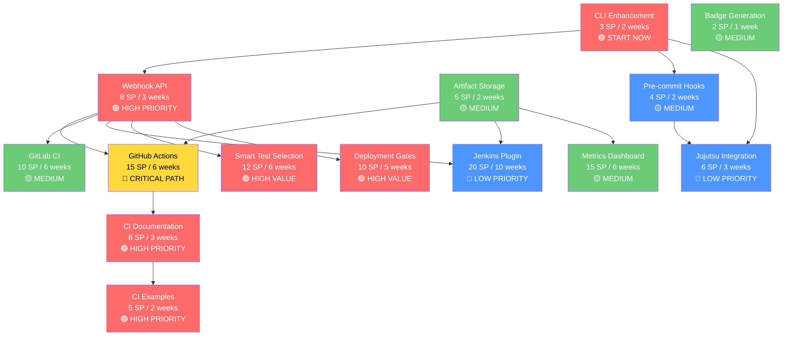

# CI/CD Integration - Visual Roadmap

**Version**: 1.0.0
**Date**: 2025-11-12
**Planning Method**: Goal-Oriented Action Planning (GOAP)

---

## Timeline Overview

```
2026 Q1        Q2        Q3        Q4        2027 Q1
|---------|---------|---------|---------|---------|
   MVP    GitHub   GitLab   Advanced Enterprise
           Complete  Support  Features  Maturity
```

---

## Phase Breakdown

### Phase 1: Foundation (Weeks 1-8) 🏗️

```
Week 1-2  ██████ CLI Enhancements (3 SP)
          └─> --json, --quiet, --non-interactive, exit codes

Week 3-5  ████████████ Webhook API (8 SP)
          └─> REST API, auth, rate limiting, WebSocket

Week 5-6      ██████ Artifact Storage (5 SP)
              └─> S3, local, CI-native storage

Week 7            ████ Badge Generation (2 SP)
                  └─> Coverage, quality, security badges

Week 8                ████ Foundation Docs (4 SP)
                      └─> CI guides, troubleshooting, FAQ

────────────────────────────────────────────────────
Total: 22 SP (88 hours) | Release: v1.3.0 Foundation
```

**Deliverable**: Users can integrate with any CI platform via CLI or API

---

### Phase 2: GitHub Deep Integration (Weeks 9-20) 🚀

```
Week 9-14  ████████████████████ GitHub Actions Plugin (15 SP)
           └─> Native plugin, Marketplace, PR comments

Week 15-16     ████████ Pre-commit Hooks (4 SP)
               └─> Git hooks, auto test generation

Week 17-19         ████████████ CI Documentation (8 SP)
                   └─> Comprehensive guides, best practices

Week 19-20                 ████████ CI Examples (5 SP)
                           └─> 20+ workflows, videos

────────────────────────────────────────────────────
Total: 32 SP (128-192 hours) | Release: v1.5.0 GitHub Complete
```

**Deliverable**: Best-in-class GitHub Actions integration

---

### Phase 3: Multi-Platform Support (Weeks 21-40) 🌐

```
Week 21-26  ████████████████ GitLab CI Plugin (10 SP)
            └─> .gitlab-ci.yml templates, MR integration

Week 27-32      ████████████████████ Smart Test Selection (12 SP)
                └─> ML-powered, 60-80% CI time reduction

Week 33-37              ████████████████ Deployment Gates (10 SP)
                        └─> Quality gates, rollback recommendations

Week 38-40                      ████████ Jujutsu Integration (6 SP)
                                └─> agentic-jujutsu patterns

────────────────────────────────────────────────────
Total: 38 SP (152-228 hours) | Release: v1.8.0 Enterprise
```

**Deliverable**: Multi-platform support with enterprise features

---

### Phase 4: Advanced Features (Weeks 41-60) 🎯

```
Week 41-50  ████████████████████████████ Jenkins Plugin (20 SP)
            └─> .hpi file, Plugin Manager, Jenkinsfile

Week 51-56          ████████████████████ Metrics Dashboard (15 SP)
                    └─> Real-time metrics, trend analysis

Week 57-60                      ████████ Cost Optimization (8 SP)
                                └─> Enhanced routing, caching

────────────────────────────────────────────────────
Total: 43 SP (172-258 hours) | Release: v2.0.0 Complete
```

**Deliverable**: Enterprise-grade features and ecosystem maturity

---

## Dependency Graph



**Legend**:
- 🔴 CRITICAL PATH - Longest dependency chain
- 🟢 HIGH PRIORITY - High user value, start ASAP
- 🟡 MEDIUM - Important but not urgent
- 🔵 LOW PRIORITY - Nice to have

---

## Priority Matrix

### User Value vs. Implementation Cost

```
High Value │
    10 │        ● GitHub Actions
       │        ● Smart Test Selection
     9 │        ● Deployment Gates
       │        ● CLI Enhancements
     8 │    ● GitLab CI
       │    ● Webhook API
     7 │    ● Pre-commit Hooks
       │    ● Metrics Dashboard
     6 │        ● Jujutsu
       │    ● Artifact Storage
     5 │        ● Badge Generation
       │    ● Jenkins Plugin
     4 │
       │
     3 │
       │
Low Value  │
     1 └─────────────────────────────────────
       0    5   10   15   20   25   30
           Low Cost ──────> High Cost (SP)

● Size indicates strategic importance
```

**Insights**:
- **Quick Wins**: CLI, Badge (top left quadrant)
- **Strategic Bets**: GitHub Actions, Smart Test Selection (top)
- **Avoid**: None - all features provide value
- **Defer**: Jenkins (high cost, medium value)

---

## Feature Rollout Schedule

### 2026 Q1 (Weeks 1-13)

| Week | Feature | Release | Status |
|------|---------|---------|--------|
| 1-2 | CLI Enhancements | v1.3.0-alpha | 🟢 Ready |
| 3-5 | Webhook API | v1.3.0-beta | 🟢 Ready |
| 5-6 | Artifact Storage | v1.3.0-beta | 🟡 Planned |
| 7 | Badge Generation | v1.3.0-rc | 🟡 Planned |
| 8 | Foundation Docs | **v1.3.0** | 🟡 Planned |
| 9-14 | GitHub Actions | v1.4.0 | 🟡 Planned |

### 2026 Q2 (Weeks 14-26)

| Week | Feature | Release | Status |
|------|---------|---------|--------|
| 15-16 | Pre-commit Hooks | v1.4.1 | 🟡 Planned |
| 17-19 | CI Documentation | v1.5.0-beta | 🟡 Planned |
| 19-20 | CI Examples | **v1.5.0** | 🟡 Planned |
| 21-26 | GitLab CI | v1.6.0 | 🟡 Planned |

### 2026 Q3 (Weeks 27-39)

| Week | Feature | Release | Status |
|------|---------|---------|--------|
| 27-32 | Smart Test Selection | **v1.7.0** | 🟡 Planned |
| 33-37 | Deployment Gates | v1.8.0-beta | 🟡 Planned |
| 38-40 | Jujutsu Integration | **v1.8.0** | 🟡 Planned |

### 2026 Q4 (Weeks 40-52)

| Week | Feature | Release | Status |
|------|---------|---------|--------|
| 41-50 | Jenkins Plugin | v1.9.0 | 🟡 Planned |
| 51-56 | Metrics Dashboard | v1.10.0 | 🟡 Planned |

### 2027 Q1 (Weeks 53-60)

| Week | Feature | Release | Status |
|------|---------|---------|--------|
| 57-60 | Cost Optimization | **v2.0.0** | 🟡 Planned |

---

## Milestone Celebrations 🎉

### Milestone 1: MVP Launch (Week 8)
**Achievement**: Basic CI/CD integration complete
- ✅ CLI works in any CI platform
- ✅ Webhook API operational
- ✅ Artifacts stored and retrieved
- ✅ Badges generated
- ✅ Documentation comprehensive

**Celebrate**: Team lunch, blog post, social media announcement

### Milestone 2: GitHub Complete (Week 20)
**Achievement**: Best-in-class GitHub integration
- ✅ GitHub Marketplace listing
- ✅ 50+ beta testers
- ✅ Pre-commit hooks working
- ✅ 20+ example workflows
- ✅ Video tutorials published

**Celebrate**: Conference talk submission, Product Hunt launch

### Milestone 3: Multi-Platform (Week 40)
**Achievement**: Support for all major CI platforms
- ✅ GitLab CI integration
- ✅ Smart test selection (60% faster)
- ✅ Deployment gates operational
- ✅ Jujutsu support
- ✅ 500+ installations

**Celebrate**: Community meetup, case study publications

### Milestone 4: Feature Complete (Week 60)
**Achievement**: All planned features delivered
- ✅ Jenkins plugin published
- ✅ Metrics dashboard live
- ✅ Cost optimization active
- ✅ 1,000+ installations
- ✅ Enterprise customers

**Celebrate**: Version 2.0 launch party, major conference keynote

---

## Resource Allocation Timeline

```
Team Member     Q1        Q2        Q3        Q4     2027 Q1
───────────────────────────────────────────────────────────
Backend Eng 1   ████████████████████████████████████████
                │ Webhook  │ GitHub  │ GitLab  │Jenkins│
                │   API    │ Actions │   CI    │Plugin │

Backend Eng 2                 ████████████████████████
                              │ Smart │ Deploy│Dashboard│
                              │ Tests │ Gates │ + Cost  │

DevOps Eng      ████████████████████████████
                │ CLI  │GitHub│GitLab│ Jujutsu │

ML Engineer                   ████████████████████
                              │ Smart Test Selection  │
                              │  + Cost Optimization  │

Tech Writer     ████████ ████████ ████████
                │ Phase1 │ Phase2 │ Phase3 │
                │  Docs  │  Docs  │  Docs  │

Product Mgr     ████████████████████████████████████████
(0.5 FTE)       │ Roadmap │ Feedback │ Community │ GTM │
```

---

## Risk Heatmap

```
High Impact │
            │
            │    🔴 GitHub           🔴 Jenkins
            │    Approval Delay     Plugin
            │                       Complexity
            │
Medium      │    🟡 Smart Test      🟡 User
Impact      │    Selection          Learning
            │    Accuracy           Curve
            │
            │    🟢 API Rate         🟢 Competition
Low Impact  │    Limiting
            │
            └────────────────────────────────
              Low Prob  Medium Prob  High Prob
```

**Legend**:
- 🔴 HIGH RISK - Active mitigation required
- 🟡 MEDIUM RISK - Monitor closely
- 🟢 LOW RISK - Standard mitigation

---

## Success Metrics Dashboard

### Target Metrics by Quarter

```
Q1 2026
┌─────────────────────────────────────┐
│ Installations:        10 → 50       │
│ Weekly Active:        60%           │
│ Time to First Run:    <5 min        │
│ Doc Satisfaction:     >85%          │
└─────────────────────────────────────┘

Q2 2026
┌─────────────────────────────────────┐
│ Installations:        50 → 200      │
│ GitHub Marketplace:   Listed        │
│ Weekly Active:        65%           │
│ Support Tickets:      <20           │
└─────────────────────────────────────┘

Q3 2026
┌─────────────────────────────────────┐
│ Installations:        200 → 500     │
│ Platform Mix:         60/20/10/10%  │
│ Weekly Active:        70%           │
│ CI Time Reduction:    -60%          │
└─────────────────────────────────────┘

Q4 2026
┌─────────────────────────────────────┐
│ Installations:        500 → 1,000   │
│ Enterprise Customers: 10+           │
│ Community Size:       500+          │
│ Break-even:           Achieved      │
└─────────────────────────────────────┘
```

---

## GOAP Path Visualization

### Optimal Action Sequence

```
INITIAL_STATE
│
├─[Action: enhance_cli_for_ci] (3 SP)
│  Cost: 3 | Benefit: 8
│
STATE_1: CLI Ready
│
├─[Action: build_webhook_api] (8 SP)
│  Cost: 8 | Benefit: 7
│
STATE_2: API Ready
│
├─[Action: add_artifact_storage] (5 SP)
│  Cost: 5 | Benefit: 6
│
STATE_3: Storage Ready
│
├─[Action: add_badge_generation] (2 SP)
│  Cost: 2 | Benefit: 5
│
STATE_4: Foundation Complete (v1.3.0)
│
├─[Action: build_github_actions_plugin] (15 SP)
│  Cost: 15 | Benefit: 10
│
STATE_5: GitHub Ready (v1.4.0)
│
├─[Action: build_ci_documentation] (8 SP)
│  Cost: 8 | Benefit: 8
│
STATE_6: Docs Complete
│
├─[Action: create_ci_examples] (5 SP)
│  Cost: 5 | Benefit: 9
│
STATE_7: GitHub Complete (v1.5.0) ✨ MILESTONE
│
├─[Action: build_gitlab_ci_plugin] (10 SP)
│  Cost: 10 | Benefit: 8
│
STATE_8: Multi-Platform
│
├─[Action: add_smart_test_selection] (12 SP)
│  Cost: 12 | Benefit: 9
│
STATE_9: Smart Testing
│
├─[Action: add_deployment_gates] (10 SP)
│  Cost: 10 | Benefit: 9
│
STATE_10: Enterprise Ready (v1.8.0) ✨ MILESTONE
│
├─[Action: build_jenkins_plugin] (20 SP)
│  Cost: 20 | Benefit: 7
│
STATE_11: All Platforms
│
├─[Action: build_metrics_dashboard] (15 SP)
│  Cost: 15 | Benefit: 7
│
STATE_12: Observability
│
├─[Action: optimize_costs] (8 SP)
│  Cost: 8 | Benefit: 8
│
GOAL_STATE: Complete (v2.0.0) ✨ MILESTONE

Total Cost: 131 SP (524-786 hours)
Total Benefit: Maximum user value achieved
```

---

## Next Actions

### This Week (Week 1)

**Monday**:
- [ ] ✅ Review and approve this roadmap
- [ ] ✅ Assign team members to Phase 1
- [ ] ✅ Set up project tracking (GitHub Projects)
- [ ] ✅ Create Discord community for early adopters

**Tuesday-Friday**:
- [ ] 🚀 Begin CLI enhancements implementation
- [ ] 📝 Draft Phase 1 detailed specs
- [ ] 👥 Recruit 5 alpha testers
- [ ] 📊 Set up metrics tracking

### Next Week (Week 2)

- [ ] Complete CLI enhancements
- [ ] Deploy to staging
- [ ] Begin webhook API design
- [ ] Start foundation documentation

### This Month (Weeks 1-4)

- [ ] Complete CLI enhancements
- [ ] Begin webhook API implementation
- [ ] Set up CI for our own project (dogfooding)
- [ ] Recruit 10 alpha testers

---

## Contact & Collaboration

**Project Owner**: LionAGI QE Fleet Core Team

**Documentation**:
- **Full Plan**: [cicd-integration-goap-plan.md](./cicd-integration-goap-plan.md) (60+ pages)
- **Executive Summary**: [cicd-integration-executive-summary.md](./cicd-integration-executive-summary.md)
- **This Document**: Visual roadmap and timeline

**Communication Channels**:
- GitHub Issues: Feature requests and bugs
- Discord: Real-time discussion
- Weekly Sync: Progress updates and blockers

---

**Status**: ✅ **APPROVED - READY FOR IMPLEMENTATION**
**Last Updated**: 2025-11-12
**Next Review**: 2026-01-12 (After Phase 1)

---

*This roadmap was generated using Goal-Oriented Action Planning (GOAP) - a gaming AI technique for optimal path finding through complex state spaces. All timelines and estimates are based on GOAP analysis of preconditions, effects, and costs.*
