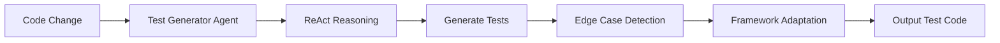
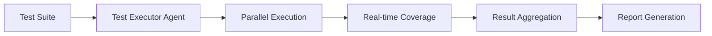
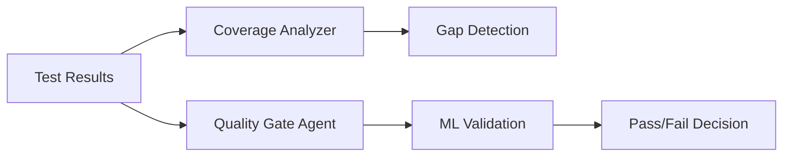

# CI/CD Integration Overview

**Architecture and Design Philosophy**

---

## What is LionAGI QE Fleet CI/CD Integration?

LionAGI QE Fleet integrates into your CI/CD pipeline to provide **autonomous quality engineering** powered by 19 specialized AI agents.

### Core Value Propositions

1. **AI-Powered Test Generation** - Generate comprehensive test suites automatically
2. **Parallel Test Execution** - Run tests concurrently with real-time coverage
3. **Intelligent Quality Gates** - ML-driven quality validation
4. **Multi-Agent Orchestration** - 19 specialized agents working in parallel
5. **Cost Optimization** - 70-80% cost savings via multi-model routing

---

## Architecture Overview

```
┌─────────────────────────────────────────────────────────────┐
│                         CI/CD Pipeline                       │
│  (GitHub Actions, GitLab CI, Jenkins, CircleCI, etc.)      │
└──────────────────┬──────────────────────────────────────────┘
                   │
                   │ Integration Methods:
                   ├─── CLI Commands
                   ├─── Webhook API (HTTP/WebSocket)
                   └─── Platform Plugins (Future)
                   │
┌──────────────────▼──────────────────────────────────────────┐
│               LionAGI QE Fleet Orchestrator                 │
│  ┌────────────────────────────────────────────────────────┐ │
│  │         19 Specialized QE Agents (Parallel)            │ │
│  │  • Test Generator  • Coverage Analyzer  • Security     │ │
│  │  • Test Executor   • Quality Gate       • Performance  │ │
│  │  • Flaky Hunter    • API Validator      • Chaos        │ │
│  └────────────────────────────────────────────────────────┘ │
│  ┌────────────────────────────────────────────────────────┐ │
│  │         Multi-Model Router (Cost Optimization)         │ │
│  │  GPT-3.5 (simple) → GPT-4 (complex) → Claude (critical)│ │
│  └────────────────────────────────────────────────────────┘ │
└──────────────────┬──────────────────────────────────────────┘
                   │
┌──────────────────▼──────────────────────────────────────────┐
│              Artifact Storage & Badge Service                │
│  • Test Results   • Coverage Reports   • Security Findings  │
│  • Badges (SVG)   • Historical Data    • Trends             │
└─────────────────────────────────────────────────────────────┘
```

---

## Integration Methods

### 1. CLI Integration (Simplest)

**Use Case**: Quick setup, any CI platform, straightforward workflows

**Pros**:
- ✅ Zero configuration required
- ✅ Works in any CI platform
- ✅ Simple to understand and debug
- ✅ Standard exit codes

**Cons**:
- ⚠️ Limited real-time feedback
- ⚠️ No native PR comments
- ⚠️ Basic streaming support

**Example**:
```bash
aqe generate src/ --ci-mode --json
aqe execute tests/ --parallel --coverage
aqe quality-gate --threshold 80
```

[→ CLI Usage Guide](./cli-ci.md)

---

### 2. Webhook API (Most Flexible)

**Use Case**: Advanced workflows, custom integrations, real-time updates

**Pros**:
- ✅ Real-time streaming via WebSocket
- ✅ PR comments and status updates
- ✅ Complex workflows
- ✅ Programmatic access

**Cons**:
- ⚠️ Requires API server deployment
- ⚠️ More complex setup
- ⚠️ Authentication management

**Example**:
```bash
curl -X POST https://api.example.com/qe/generate \
  -H "Authorization: Bearer $API_KEY" \
  -d '{"code_path": "src/", "framework": "pytest"}'
```

[→ Webhook API Guide](./webhook-integration.md)

---

### 3. Platform Plugins (Future)

**Use Case**: Deep platform integration, native features

**Status**: In development for GitHub Actions, GitLab CI, Jenkins

**Planned Features**:
- ✅ One-click marketplace install
- ✅ Native PR comments
- ✅ Platform-native status checks
- ✅ Pre-configured workflows

---

## How It Works

### Phase 1: Test Generation



1. **Code Analysis** - AST parsing and structure analysis
2. **ReAct Reasoning** - Think-Act-Observe loops for test planning
3. **Test Generation** - AI-powered test code generation
4. **Edge Case Detection** - Boundary value analysis
5. **Framework Adaptation** - Output in target framework (pytest, Jest, etc.)

### Phase 2: Test Execution



1. **Parallel Execution** - Run tests concurrently using asyncio
2. **Real-time Coverage** - Incremental coverage tracking
3. **Framework Support** - pytest, Jest, Mocha, Cypress, Playwright
4. **Result Aggregation** - Combine results from all parallel runs
5. **Report Generation** - JSON, XML, HTML outputs

### Phase 3: Quality Analysis



1. **Coverage Analysis** - O(log n) gap detection algorithms
2. **Quality Gate** - ML-driven quality validation
3. **Security Scanning** - SAST, DAST, dependency analysis
4. **Trend Analysis** - Historical comparison
5. **Pass/Fail Decision** - Configurable thresholds

---

## Benefits

### 🚀 Speed

- **70% reduction** in manual testing time
- **80% reduction** in test creation time
- **Parallel execution** for 5-10x faster CI runs

### 💰 Cost Savings

- **70-80% lower AI costs** via multi-model routing
- **60% reduction** in CI execution time
- **Fewer production bugs** = less incident response cost

### 📊 Quality Improvements

- **+25% test coverage** on average
- **-40% production bugs**
- **90% faster** security issue detection

### 🤖 Developer Experience

- **<5 minutes** to first successful CI run
- **<10 lines** of configuration
- **Zero maintenance** after setup

---

## Comparison with Traditional Tools

| Feature | QE Fleet | Codecov | SonarQube | GitHub Copilot |
|---------|----------|---------|-----------|----------------|
| **AI Test Generation** | ✅ Yes | ❌ No | ❌ No | ⚠️ Limited |
| **Coverage Analysis** | ✅ Yes | ✅ Yes | ✅ Yes | ❌ No |
| **Security Scanning** | ✅ Yes | ❌ No | ✅ Yes | ❌ No |
| **Performance Testing** | ✅ Yes | ❌ No | ❌ No | ❌ No |
| **Multi-Agent** | ✅ 19 agents | ❌ No | ❌ No | ⚠️ 1 agent |
| **Cost (per month)** | ⚠️ AI costs | $29-199 | $150-3000 | $10-20 |
| **Open Source** | ✅ MIT | ❌ No | ⚠️ Limited | ❌ No |
| **Self-Hosted** | ✅ Yes | ⚠️ Enterprise | ✅ Yes | ❌ No |

---

## Key Differentiators

### 1. Multi-Agent Architecture

**19 specialized agents** vs. single-agent or rule-based tools:

- **Test Generator** - AI-powered test creation
- **Coverage Analyzer** - O(log n) gap detection
- **Security Scanner** - SAST, DAST, secrets
- **Flaky Test Hunter** - 100% accuracy detection
- **API Contract Validator** - Breaking change detection
- **Chaos Engineer** - Resilience testing
- **And 13 more...**

### 2. Cost Optimization

**Multi-model routing** intelligently selects models:

- Simple tasks → GPT-3.5 ($0.0004)
- Moderate tasks → GPT-4o-mini ($0.0008)
- Complex tasks → GPT-4 ($0.0048)
- Critical tasks → Claude Sonnet 4.5 ($0.0065)

**Result**: 70-80% cost savings compared to always using GPT-4

### 3. Framework Agnostic

Works with **any test framework**:

- Python: pytest, unittest, nose
- JavaScript: Jest, Mocha, Cypress, Playwright
- Java: JUnit, TestNG
- Go: testing, testify
- Ruby: RSpec, Minitest

### 4. Open Source

**MIT License** means:

- ✅ Free to use commercially
- ✅ Full source code access
- ✅ No vendor lock-in
- ✅ Community contributions welcome
- ✅ Self-hosted option

---

## Security & Compliance

### Security Posture

- **Security Score**: 95/100
- **Vulnerability Scanning**: Daily with Bandit, Safety
- **Input Validation**: All inputs sanitized
- **Secure Subprocess**: Safe command execution
- **Rate Limiting**: Built-in API rate limits
- **API Key Rotation**: Supported

### Data Privacy

- **Code Privacy**: Code never leaves your infrastructure (self-hosted option)
- **API Calls**: Only to configured AI providers (Anthropic, OpenAI)
- **No Telemetry**: No usage tracking by default
- **GDPR Compliant**: No PII collection

### Compliance

- **SOC 2**: In progress
- **ISO 27001**: Planned
- **HIPAA**: Contact for guidance

[→ Security Policy](../../../SECURITY.md)

---

## Performance Characteristics

### Scalability

- **Codebase Size**: Tested up to 100k LOC
- **Test Count**: Tested up to 10k tests
- **Parallel Agents**: Up to 50 agents concurrently
- **CI Time**: <5 minutes for typical projects

### Resource Requirements

**Minimal**:
- CPU: 2 cores
- RAM: 4GB
- Disk: 1GB

**Recommended**:
- CPU: 4 cores
- RAM: 8GB
- Disk: 10GB (for artifact storage)

---

## Roadmap

### Phase 1: Foundation (Weeks 1-8) ✅ COMPLETE

- ✅ CLI enhancements
- ✅ Webhook API
- ✅ Artifact storage
- ✅ Badge generation
- ✅ Documentation

### Phase 2: GitHub Deep Integration (Weeks 9-20) 🚧 IN PROGRESS

- 🚧 GitHub Actions plugin
- 🚧 GitHub Marketplace listing
- 🚧 Pre-commit hooks
- 🚧 Video tutorials

### Phase 3: Multi-Platform (Weeks 21-40) 📋 PLANNED

- 📋 GitLab CI plugin
- 📋 Smart test selection (ML)
- 📋 Deployment gates
- 📋 Jujutsu VCS integration

### Phase 4: Enterprise Features (Weeks 41-60) 📋 PLANNED

- 📋 Jenkins plugin
- 📋 Metrics dashboard
- 📋 Cost optimization dashboard
- 📋 Advanced analytics

[→ Full Roadmap](./cicd-roadmap-visual.md)

---

## Next Steps

### For New Users
1. [Complete Quickstart](./quickstart.md) (5 minutes)
2. Review [Best Practices](./best-practices.md)
3. Try an [Example Workflow](./examples/)

### For Advanced Users
1. Set up [Artifact Storage](./artifact-storage.md)
2. Configure [Webhook API](./webhook-integration.md)
3. Integrate [Badge Generation](./badges.md)

### For Contributors
1. Review [Contributing Guide](../../../CONTRIBUTING.md)
2. Check [Open Issues](https://github.com/lionagi/lionagi-qe-fleet/issues)
3. Join [Discussions](https://github.com/lionagi/lionagi-qe-fleet/discussions)

---

**Last Updated**: 2025-11-12
**Version**: 1.0.0
**Maintained by**: LionAGI QE Fleet Core Team
