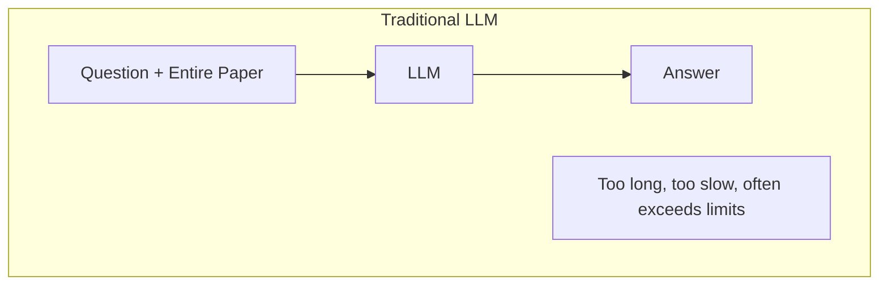
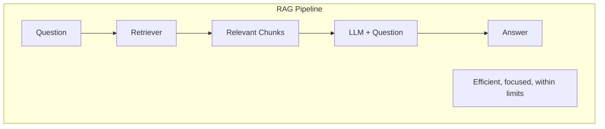

# What is RAG (Retrieval-Augmented Generation)?

RAG, or Retrieval-Augmented Generation, is a technique that enhances Large Language Models (LLMs) by combining them with information retrieval systems. This explanation covers the core concepts, benefits, and how NERxiv implements RAG for scientific metadata extraction.

## The Challenge with LLMs Alone

LLMs like GPT, LLaMA, or Qwen are powerful text generation models, but they have limitations when working with long documents:

1. **Limited Context Window**: Most LLMs can only process 2,000-32,000 tokens (~1,500-24,000 words) at once
2. **Long Scientific Papers**: A typical arXiv paper contains 10,000-50,000 words
3. **Irrelevant Information**: Feeding entire papers to an LLM includes lots of content irrelevant to your specific query
4. **Computational Cost**: Processing very long contexts is slow and expensive

## The RAG Solution

RAG solves these problems by adding a retrieval step before generation:





## The Three Stages of RAG

### 1. Chunking (Indexing)

The document is divided into smaller, manageable pieces called "chunks."

**Purpose**: Break large documents into pieces that fit in memory and can be individually evaluated.

**In NERxiv**:
```python
from nerxiv.chunker import Chunker

chunker = Chunker(chunk_size=1000, chunk_overlap=200, text=paper_text)
chunks = chunker.chunk_text()
# Result: [chunk1, chunk2, chunk3, ..., chunk_n]
```

**Example**: A 30,000-word paper becomes ~100 chunks of 300 words each.

### 2. Retrieval (Search)

Find the chunks most relevant to your query using semantic similarity.

**Purpose**: Select only the chunks that likely contain the answer, reducing noise and staying within token limits.

**How it works**:

1. **Encode query**: Convert your question into a high-dimensional vector (embedding)
   ```
   "Find all chemical formulas" → [0.23, -0.45, 0.12, ..., 0.89]
   ```

2. **Encode chunks**: Convert each chunk into an embedding
   ```
   Chunk 1: "The material La₀.₈Sr₀.₂NiO₂ was synthesized..." → [0.19, -0.42, 0.08, ...]
   Chunk 2: "Previous studies have shown that..." → [-0.31, 0.15, -0.67, ...]
   ```

3. **Compute similarity**: Calculate how similar each chunk is to the query using cosine similarity
   ```
   Chunk 1 similarity: 0.87 (very relevant)
   Chunk 2 similarity: 0.34 (less relevant)
   ```

4. **Select top chunks**: Keep only the most similar chunks
   ```
   Top 5 chunks: [chunk_1, chunk_42, chunk_15, chunk_78, chunk_3]
   ```

**In NERxiv**:
```python
from nerxiv.rag import CustomRetriever

retriever = CustomRetriever(
    model="all-MiniLM-L6-v2",
    query="Find all mentions of chemical formulas",
    n_top_chunks=5,
)
relevant_text = retriever.get_relevant_chunks(chunks=chunks)
```

### 3. Generation (Augmented LLM)

The LLM generates an answer using only the relevant chunks.

**Purpose**: Produce a focused, accurate answer based on the most relevant information.

**In NERxiv**:
```python
from nerxiv.rag import LLMGenerator

generator = LLMGenerator(model="llama3.1:70b", text=relevant_text)
answer = generator.generate(prompt=prompt_template)
```

The LLM now sees:
```
Expert instruction + Query + Top 5 relevant chunks → Answer
(~3,000 tokens instead of 30,000)
```

## Why RAG Works for Scientific Papers

### 1. Handles Length

Papers with 50,000 words can be processed using only 5,000 words of relevant content.

### 2. Improves Accuracy

By focusing on relevant sections, the LLM isn't distracted by unrelated information.

**Example**: When extracting material formulas, the retriever finds sections mentioning materials, ignoring lengthy theoretical derivations or references.

### 3. Reduces Hallucination

LLMs sometimes "hallucinate" or make up information. RAG grounds the model in actual document content.

**Without RAG**:
```
Query: "What materials were studied?"
LLM (from training): "Common materials in this field include Fe₂O₃ and TiO₂"
(Wrong - not in the paper)
```

**With RAG**:
```
Query: "What materials were studied?"
Retrieved chunk: "We investigated La₀.₈Sr₀.₂NiO₂ samples..."
LLM: "La₀.₈Sr₀.₂NiO₂"
(Correct - from the paper)
```

### 4. Enables Targeted Queries

Different queries retrieve different chunks:

```
Query: "Material formulas" → Retrieves introduction, methods, results
Query: "Computational methods" → Retrieves methods, computational details
Query: "Experimental conditions" → Retrieves experimental setup, procedures
```

## Semantic Similarity: The Magic Behind Retrieval

RAG relies on semantic similarity, not keyword matching.

### Traditional Keyword Search

```
Query: "DFT calculations"
Matches: Chunks containing the exact words "DFT" and "calculations"
Misses: "density functional theory computations"
```

### Semantic Search (RAG)

```
Query: "DFT calculations"
Embedding: [0.23, -0.45, 0.12, ..., 0.89]

Similar chunks (by embedding similarity):
- "DFT calculations" (0.95 similarity)
- "density functional theory computations" (0.91 similarity)
- "ab initio methods" (0.78 similarity)
- "first-principles simulations" (0.74 similarity)
```

The model understands that these phrases are related, even without exact word matches.

## RAG vs. Fine-Tuning

Both techniques can improve LLM performance, but they're different:

| Aspect | RAG | Fine-Tuning |
|--------|-----|-------------|
| **Updates** | New documents added anytime | Requires retraining |
| **Data needs** | Just the documents | Large labeled dataset |
| **Cost** | Low | High (GPU, time) |
| **Knowledge source** | External (retrievable) | Internal (model weights) |
| **Transparency** | Can see retrieved chunks | Black box |
| **Best for** | Document-specific queries | Task-specific behaviors |

In fact, both can be used at the same time in a process where, first, RAG retrieves and populates a given schema with metadata validated from a human, and second, fine-tuning improves the metadata extraction by measuring the performance of RAG.

## Limitations of RAG

While powerful, RAG has limitations:

### 1. Retrieval Quality Matters

If the retriever misses relevant chunks, the LLM can't find the answer:

```
Query: "What is the bandgap?"
Retrieved: Chunks about synthesis (wrong topic)
LLM: "The bandgap is not mentioned" (missed the right chunk)
```

**Solution**: Better retrieval models, more chunks, semantic chunking

### 2. Chunk Boundaries

Important information might be split across chunks:

```
Chunk 1: "The material La₀.₈Sr₀.₂NiO₂ has interesting"
Chunk 2: "electronic properties with a bandgap of 1.2 eV."
```

If only Chunk 1 is retrieved, the bandgap is missed.

**Solution**: Chunk overlap, semantic chunking

### 3. Computational Overhead

RAG adds retrieval time before generation:

```
Without RAG: ~5 seconds (LLM only)
With RAG: ~2 seconds (retrieval) + ~5 seconds (LLM) = ~7 seconds
```

**Solution**: Use faster retrieval models, cache embeddings

## RAG in NERxiv: Complete Workflow

Here's how everything comes together in NERxiv:

```python
# 1. Load paper
with h5py.File("paper.hdf5", "r") as f:
    text = f[arxiv_id]["arxiv_paper"]["text"][()].decode("utf-8")

# 2. Chunk the paper
from nerxiv.chunker import Chunker
chunker = Chunker(chunk_size=1000, chunk_overlap=200, text=text)
chunks = chunker.chunk_text()

# 3. Retrieve relevant chunks
from nerxiv.rag import CustomRetriever
retriever = CustomRetriever(
    model="all-MiniLM-L6-v2",
    query="Find all chemical formulas and material names",
    n_top_chunks=5,
)
relevant_text = retriever.get_relevant_chunks(chunks=chunks)

# 4. Generate answer
from nerxiv.rag import LLMGenerator
from nerxiv.prompts import PROMPT_REGISTRY

prompt_template = PROMPT_REGISTRY["material_formula"].prompt
generator = LLMGenerator(model="llama3.1:70b", text=relevant_text)
answer = generator.generate(prompt=prompt_template.build(text=relevant_text))

print(answer)  # "La₀.₈Sr₀.₂NiO₂"
```
