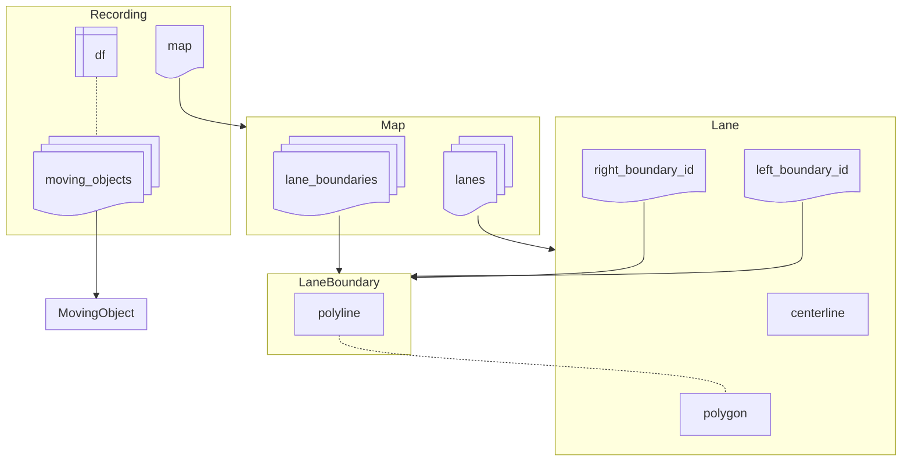

## Recordings and Map Data

The omega-prime library has two major components, the `Recording` and the `Map`.
The `Recording` stores the dynamic object information and the map object.
A recording is a continuous traffic observation and usually corresponds to an OSI trace or an MCAP recording.
The dynamic object information is stored in the attribute `df` (for DataFrame) as a single polars DataFrame, where each row corresponds to the observation of a single moving object at a specific point in time.
A convenience function to access this data in an object oriented manner are the `MovingObject` stored in `moving_objects` attribute of the `Recording`.
For most operations, it is recommended to use the DataFrame stored in `df` directly, as polars provides a fast and flexible API for data manipulation.
See the [Polars user guide](https://docs.pola.rs/) for more information on how to use polars DataFrames.
The object polygons for each timestamp are accessible as shapely objects in the `polygon` column or as [`polars_st`](https://github.com/Oreilles/polars-st) geometries in the `geometry` column.
It is recommended to make use of `polars_st` as much as possible instead of `shapely` since `polars_st` can utilize the benefits of using a DataFrame more effectively.

The `Map` stores the static map information, i.e., lanes and lane boundaries.
Lanes and lane boundaries are derived form the ASAM OSI definition and are also corresponding to the concept of lanelets in Lanelet2.
When working with the map data in python, the geometries of the map are represented through polygons or polylines (for boundaries and centerlines) using [shapely](https://shapely.readthedocs.io/en/stable/).

`MovingObject`, `Lane` and `LaneBoundary` each have types and additional information corresponding to ASAM OSI definitions.
The library uses [betterosi](https://github.com/ika-rwth-aachen/betterosi) as a python implementation of ASAM OSI.

The omega-prime specification suggests the usage of ASAM OpenDRIVE maps as map data.
This is supported through the `MapOdr` subclass of `Map`. 
Additionally, this library provides subclasses for ASAM OSI maps through `MapOsi` and `MapOsiCenterline`, where the latter does not provide lane polygons and lane boundaries (which is needed for some datasets).
In the future, `MapLanelet` will provide support for Lanelet2 maps.
Thus, a key benefit of using this library is the unified interface to work with different map formats.

See [Tutorials / Introduction](notebooks/tutorial.ipynb) for examples of how to use omega-prime.

## Converters

The class `omega_prime.converters.DatasetConverter` aids in defining converters that transform existing data sources into the omega-prime format.
For guidance on how to implement your own converter you can have a look at the `LxdConverter`, which translates the [LevelXData](https://levelxdata.com/) datasets into omega-prime.
Additionally, you can have a look at [omega-prime-trajdata](https://github.com/ika-rwth-aachen/omega-prime-trajdata) to convert many motion prediction datasets into the omega-prime format.
Examples of datasets that can be converted with `omega-prime-trajdata` into omega-prime are [NuPlan](https://www.nuscenes.org/nuplan), [NuScene](https://www.nuscenes.org/), [Argoverse2](https://www.argoverse.org/av2.html) and [Waymo Open Dataset - Motion](https://waymo.com/open/).
Here, the class `TrajdataConverter` implements the `DatasetConverter`.

Data that is available as ASAM OpenDRIVE and ASAM OSI traces does not need a conversion an can be directly used with `omega-prime`.
Many simulation tools such as [esmini](https://github.com/esmini/esmini) or [CARLA](https://carla.org/) through [Carla-OSI-Service](https://github.com/DLR-TS/Carla-OSI-Service) support the logging of simulation data as OSI traces.
These can be directly read in and analyzed with the omega-prime library.

## Locator

The `Locator` uses the `Map` object to locate `MovingObject`s or any polygon or coordinate onto the `Lane`s of the map.
The `Locator` can assign lane occupancy to objects and derive s-t-coordinate (Frenet coordinates).

See [Tutorials / Locator](notebooks/tutorial_locator.ipynb) for examples of how to use the `Locator`.

## Metrics

The `MetricsManager` makes use of [Polars feature of lazy evaulation](https://docs.pola.rs/user-guide/concepts/lazy-api/#previewing-the-query-plan) to enable efficient computation of many, possible, dependent metrics.
The metrics computation can be defined by subclassing `Metric` or, more easily by using the decorator `@omega_prime.metrics.metric` a function that computes your metric based on the `Recording.df`.
Moreover, the `Metric` lets you define dependencies between metrics, e.g., `distance_traveled` needs to be computed to compute `timegaps`. 
The `MetricsManager` then handles the dependencies automatically, and makes sure only the things you actually need are computed.

See [Tutorials / Metrics](notebooks/tutorial_metrics.ipynb) for examples of how to define and use the metric utilities.
