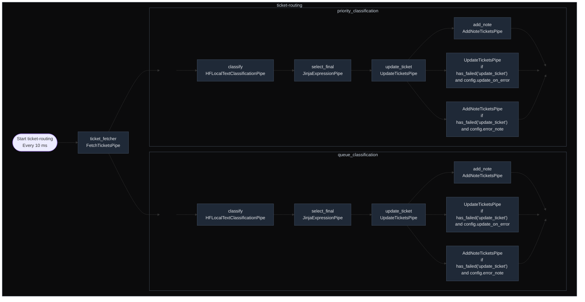

```mermaid
flowchart TD
  classDef start fill:#0ea5e9,stroke:#0e7490,color:#fff
  classDef step fill:#1f2937,stroke:#475569,color:#e5e7eb
  classDef hidden fill:none,stroke:none,color:transparent
  subgraph ticket_routing [ticket-routing]
    ticket_routing__start(["Start ticket-routing<br/>Every 10 ms"])
    ticket_routing__ticket_fetcher["ticket_fetcher<br/>FetchTicketsPipe"]:::step
  subgraph ticket_routing__queue_classification [queue_classification]
    ticket_routing__queue_classification__entry[" "]:::hidden
    ticket_routing__queue_classification__exit[" "]:::hidden
    ticket_routing__queue_classification__classify["classify<br/>HFLocalTextClassificationPipe"]:::step
    ticket_routing__queue_classification__select_final["select_final<br/>JinjaExpressionPipe"]:::step
    ticket_routing__queue_classification__update_ticket["update_ticket<br/>UpdateTicketsPipe"]:::step
    ticket_routing__queue_classification__add_note["add_note<br/>AddNoteTicketsPipe"]:::step
    ticket_routing__queue_classification__UpdateTicketsPipe["UpdateTicketsPipe<br/>if has_failed('update_ticket') and config.update_on_error"]:::step
    ticket_routing__queue_classification__AddNoteTicketsPipe["AddNoteTicketsPipe<br/>if has_failed('update_ticket') and config.error_note"]:::step
  end
  style ticket_routing__queue_classification fill:#0b0b0c,stroke:#4b5563,color:#cbd5e1
  subgraph ticket_routing__priority_classification [priority_classification]
    ticket_routing__priority_classification__entry[" "]:::hidden
    ticket_routing__priority_classification__exit[" "]:::hidden
    ticket_routing__priority_classification__classify["classify<br/>HFLocalTextClassificationPipe"]:::step
    ticket_routing__priority_classification__select_final["select_final<br/>JinjaExpressionPipe"]:::step
    ticket_routing__priority_classification__update_ticket["update_ticket<br/>UpdateTicketsPipe"]:::step
    ticket_routing__priority_classification__add_note["add_note<br/>AddNoteTicketsPipe"]:::step
    ticket_routing__priority_classification__UpdateTicketsPipe["UpdateTicketsPipe<br/>if has_failed('update_ticket') and config.update_on_error"]:::step
    ticket_routing__priority_classification__AddNoteTicketsPipe["AddNoteTicketsPipe<br/>if has_failed('update_ticket') and config.error_note"]:::step
  end
  style ticket_routing__priority_classification fill:#0b0b0c,stroke:#4b5563,color:#cbd5e1
  end
  style ticket_routing fill:#0b0b0c,stroke:#4b5563,color:#cbd5e1
  ticket_routing__ticket_fetcher --> ticket_routing__queue_classification__entry
  ticket_routing__queue_classification__classify --> ticket_routing__queue_classification__select_final
  ticket_routing__queue_classification__select_final --> ticket_routing__queue_classification__update_ticket
  ticket_routing__queue_classification__update_ticket --> ticket_routing__queue_classification__add_note
  ticket_routing__queue_classification__update_ticket --> ticket_routing__queue_classification__UpdateTicketsPipe
  ticket_routing__queue_classification__update_ticket --> ticket_routing__queue_classification__AddNoteTicketsPipe
  ticket_routing__queue_classification__entry --> ticket_routing__queue_classification__classify
  ticket_routing__queue_classification__add_note --> ticket_routing__queue_classification__exit
  ticket_routing__queue_classification__UpdateTicketsPipe --> ticket_routing__queue_classification__exit
  ticket_routing__queue_classification__AddNoteTicketsPipe --> ticket_routing__queue_classification__exit
  ticket_routing__ticket_fetcher --> ticket_routing__priority_classification__entry
  ticket_routing__priority_classification__classify --> ticket_routing__priority_classification__select_final
  ticket_routing__priority_classification__select_final --> ticket_routing__priority_classification__update_ticket
  ticket_routing__priority_classification__update_ticket --> ticket_routing__priority_classification__add_note
  ticket_routing__priority_classification__update_ticket --> ticket_routing__priority_classification__UpdateTicketsPipe
  ticket_routing__priority_classification__update_ticket --> ticket_routing__priority_classification__AddNoteTicketsPipe
  ticket_routing__priority_classification__entry --> ticket_routing__priority_classification__classify
  ticket_routing__priority_classification__add_note --> ticket_routing__priority_classification__exit
  ticket_routing__priority_classification__UpdateTicketsPipe --> ticket_routing__priority_classification__exit
  ticket_routing__priority_classification__AddNoteTicketsPipe --> ticket_routing__priority_classification__exit
  ticket_routing__start --> ticket_routing__ticket_fetcher
```
